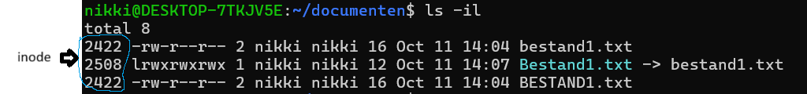

# Linux introductie
_Linux is overal_, Linux jobs zijn overal, er is een tekort aan Linux talent en er is vraag naar Linux vaardigheden in zowat elke branche en jobcategorie wereldwijd.

- _Linux is de kernel_ van een systeem, de centrale controller van alles wat er op de computer gebeurt.
- _Linux is een combinatie van software genaamd_ **GNU / Linux**, die het besturingssysteem definieert. (_GNU's Not Unix_)
- _GNU is de gratis open source software die veel commando's aanbiedt die gelijkaardig zijn aan de UNIX-commando's_.
- _Het verhaal van Linux begint met UNIX_, een besturingssysteem dat in de jaren zeventig door AT&T Bell Labs is ontwikkeld voor grote machines (servers).
- _UNIX is geschreven in de C-taal en low-level programmeertaal (assembler)_.
## Keuze distrubutie

**Rol**: distributies beschikbaar voor verschillende systemen; commercieel voor _servers_ en _desktop_, gespecialiseerd voor hergebruik van computers,_embedded systemen_, enz.

**Functie**: distributies kunnen gekozen worden op basis van het _doel van gebruik of de benodigde beveiliging_.

**Levenscyclus**: de meeste distributies hebben_grote en kleine updatecycli_. _Sommige Linux-releases hebben langdurige ondersteuning_ (**LTS**) (5+ jaar, 13 jaar voor SUSE LTS).

**Stabiliteit**: sommige distributies bieden _stabiele of onstabiele releases_, alsook releases in test

**Kost**: _distributies zijn kosteloos_. Indien hier nood aan is, kan het nuttig zijn om voor ondersteuning te betalen. _Enterprise gebruikers kunnen betalen voor ondersteuning of zelf voor ondersteuning zorgen_.
# De shell

- _Zodra een gebruiker een commando heeft ingevoerd, accepteert de terminal wat de gebruiker heeft getypt en geeft het door aan een shell_.
- De _CLI biedt een nauwkeurigere controle, grotere snelheid en de mogelijkheid om taken gemakkelijker te automatiseren door middel van scripts_ dan GUI.  
- De _shell vertaalt de opdrachten die door een gebruiker zijn ingevoerd in acties die door het besturingssysteem uitgevoerd moeten worden_.
- _Linux ondersteunt het gebruik van veel verschillende shells_.
- De _meest gebruikte shell voor Linux is de_ **Bash-shell**
## Bash shell

De Bash-shell heeft _veel populaire functies_, waaronder:

- _Command line geschiedenis_
- _Inline bewerkingen_
- _Scripting_
    - Commando's die in een bestand geplaatst worden, kunnen vervolgens geïnterpreteerd en uitgevoerd worden.
- _Aliassen_
    - Lange opdrachten kun je een korte bijnaam geven.
- _Variabelen_
    - Wordt gebruikt om informatie op te slaan voor de Bash-shell en voor de gebruiker.

## prompt

```bash
sysadmin@localhost:~$
```

De weergegeven prompt bevat de volgende informatie:

- _Gebruikersnaam_ (sysadmin)
- _Systeemnaam_ (localhost)
- _Huidige directory_ (~)

Het ~ -symbool wordt gebruikt als afkorting voor de homedirectory van de gebruiker
# Commandostructuur
- Een **commando** _is een softwareprogramma dat uitgevoerd wordt in de CLI en een actie op de computer uitvoert_.
- Om een commando uit te voeren, is het _typen van de naam van het commando de eerste stap_.
- _Sommige opdrachten hebben extra invoer nodig om correct te werken_.
- Deze _extra invoer is er in twee vormen_: **opties** en **argumenten**.
    - **Opties** _worden gebruikt om het gedrag van een commando te wijzigen_.
        - Opties kunnen in combinatie met andere opties gebruikt worden
        - Oudere opdrachten gebruiken voor opties meestal letters, terwijl nieuwere opdrachten volledige woorden gebruiken
            - Opties van één letter worden voorafgegaan door een enkel koppelteken, zoals de optie -h.
            - Opties voor volledige woorden worden voorafgegaan door twee streepjes - tekens zoals de volledige woordvorm van de optie -h, de optie --human-readable
    - **Argumenten** _worden gebruikt om aanvullende informatie te verstrekken_ (zoals een bestandsnaam of een gebruikersnaam).
        - _Sommige commando's accepteren meerdere argumenten_.
        - Een **argument** _kan gebruikt worden om iets te specificeren waarop het commando moet reageren_.
- Het typische formaat voor een commando is als volgt:

```shell
command [options] [arguments]
```

#### history

- Uitgevoerde opdrachten worden bewaard in een geschiedenislijst.
    
    - Door op de pijl omhoog **↑** te drukken, wordt het vorige commando op de promptregel weergegeven.
    - Om de volledige geschiedenislijst van een terminal te bekijken, gebruikt u de geschiedenisopdracht: **history**
- Het gewenste commando uit de geschiedenislijst kan uitgevoerd worden door een uitroepteken te typen en vervolgens het nummer naast de opdracht, bijvoorbeeld: !3
    
- Als het 'history'-commando een getal n als argument krijgt, toont dit de laatste n commando's uit de geschiedenislijst.
    
- Om het meest recente commando uit te voeren, typ !! en druk op Enter
    
- Om de meest recente iteratie van een specifiek commando uit te voeren, typ je !command en druk je op Enter.
    
- In de terminal kan je ook de hotkey Ctrl-r gebruiken om te zoeken in de history:
    
    1. Druk de toetsen Ctrl en r tegelijkertijd in.
    2. Typ de zoekterm in.
    3. Vind je niet wat je zoekt, druk dan nogmaals Ctrl-r in om het volgende resultaat te vinden. Herhaal dit indien nodig.
    4. Heb je het commando gevonden dat je zoekt? Druk op enter om het uit te voeren.

#### Variabelen

## Opbouw commando

`command [-opties] [argument]`

## Opties

### Opties kunnen in combinatie met andere opties gebruikt worden:

dit onderstaande voorbeeld is een combinatie van `ls -l -r`

```shell
sysadmin@localhost:~$ ls -lr
```

### - of --

Bij een optie die _enkel een letter_ heeft gebruiken we een enkele `-` Bij een optie met een _woord_ gebruiken we een dubbele `--`
# Variabelen
- Er zijn twee soorten variabelen in de Bash-shell:
	- Lokale variabelen -> bestaan enkel in de huidige shell. De lokale variabelen gaan verloren bij het sluiten van een terminalvenster of shell.
	- Omgevingsvariabelen (of globale variabelen) -> zijn voor het volledige systeem beschikbaar.
## definiëren

```bash
sysadmin@localhost:~$ variabele='string'

sysadmin@localhost:~$ variabeleInt=1
```


## print waarde van variabele

```bash
sysadmin@localhost:~$ echo $(variable)
```

## omgevingsvariabelen maken

Het commando `env` geeft een lijst met omgevingsvariabelen.

```bash
sysadmin@localhost:~$ export $(variabele)
```

## ongedaan maken omgevingsvariabele

```bash
sysadmin@localhost:~$ unset $(variabele)
```
## $PATH

Belangrijkste bash variabele:

- alle plaatsten waar het systeem zoekt naar uitvoerbare programma's
- als een commando niet op 1 van deze plaatsen staat krijg je **"command not found"**

# Aliassen

Eenvoudige namen toe te wijzen aan langere of ingewikkeldere commando's

## Aanmaken alias
```bash
alias aliasnaam='commando'
```

**voorbeeld***
```bash
alias ll='ls -lah'
```

## Aliassen bekijken 

```bash
alias
```
## Alias verwijderen

Verwijderen doen we met unalias
```bash
unalias ll
```
## Aliassen permanent maken

liassen die je in de terminal invoert, gelden alleen voor de huidige sessie. Om ze permanent te maken, kun je ze toevoegen aan je `.bashrc` of `.bash_profile` bestand (afhankelijk van je systeem).

1. Open `.bashrc` of `.bash_profile` in een teksteditor:
```bash
nano ~/.bashrc
```    

2. Voeg de alias toe:
```bash

alias ll='ls -lah'
``` 

3. Sla het bestand op en voer vervolgens uit om de wijzigingen direct toe te passen:
```bash
source ~/.bashrc
```

# Aanhalingstekens
3 soorten aanhalingstekens:

- **enkele aanhalingstekens (' ')**
    - _voorkomen_ dat de shell _alle speciale tekens_ "interpreteert" of uitbreidt

```shell
sysadmin@localhost:~$ echo $variabele
inhoudVanDeVariabele

sysadmin@localhost:~$ echo '$variable'
$variable
```

- **dubbele aanhalingstekens (" ") **
    - _voorkomen_ dat de shell sommige _metatekens_ interpreteert, _inclusief glob-tekens (*)_

```shell
sysadmin@localhost:~$ echo D*
Desktop Documents Downloads

sysadmin@localhost:~$  echo "D*"
D*
```

- **achterwaardse aanhalingstekens of backtick (` `) **
    - _"opdrachtvervanging"_ waardoor een _opdracht kan worden uitgevoerd binnen de regel van een andere opdracht_
    - Je kan _hetzelfde bereiken door $()_ te gebruiken.

```shell
sysadmin@localhost:~$ echo today is `date`
Today is Mon Nov 4 03:40:04 UTC 2030

sysadmin@localhost:~$  echo $(date)$
Today is Mon Nov 4 03:40:04 UTC 2030
```

## Backslash

Om _slechts één enkel karakter te blokkeren_ aan de speciale betekenis van een shell-metateken, wordt het **backslash (\ )** teken gebruikt.
# Puntkomma
Om meerdere commando's na elkaar uit te voeren.

```shell
sysadmin@localhost:~$ cal 1 2015;cal 2 2015; cal 3 2015
```
# Hulp opvragen

Met het commando `man` vraag je de man page van een commando op via de man pages.

```bash
sysadmin@localhost:~$ man command
```

- Navigeer door het document met de pijltjestoetsen.
- Gebruik de `Q`-toets om een man page af te sluiten.

## Secties in de pagina

Meer algemene secties:
- NAAM (Name): geeft de naam van het commando en een zeer korte beschrijving.
- SYNOPSIS (Synopsis): geeft voorbeelden van hoe het commando uitgevoerd wordt.
- BESCHRIJVING (Description): biedt een meer gedetailleerde beschrijving van het commando.
- OPTIES (Options): geeft een overzicht van de opties voor het commando en een beschrijving van hoe die gebruikt worden.
- AUTEUR (Author): Geeft de naam van de persoon die de man page heeft opgesteld en (soms) de contactgegevens van die persoon.
- BUGS RAPPORTEREN (Reporting Bugs): geeft details over hoe problemen met het commando gerapporteerd kunnen worden.
- COPYRIGHT (Copyright): geeft de licentie(s) weer die van toepassing zijn bij het commando.
- ZIE OOK (See Also): Geeft je een idee waar u aanvullende informatie kunt vinden. Vaak vind je hier ook andere commando's die ermee verbonden zijn.

## Secties in man

- Er zijn duizenden manpages op een typische Linux-distributie. Om al deze manpages te ordenen, zijn ze onderverdeeld in secties.
- Standaard zijn er negen secties:
	- Algemene opdrachten (General Commands)
	- Systeemoproepen (System Calls)
	- Bibliotheekoproepen (Library Calls)
	- Speciale bestanden (Special Files)
	- Bestandsformaten en conventies (File Formats and Conventions)
	- Spellen (Games)
	- Diversen (Miscellaneous)
	- Systeembeheeropdrachten (System Administration Commands)
	- Kernel-routines (Kernel Routines)

Soms zijn er manpages met dezelfde naam in verschillendesecties. Om ze allemaal te zien, gebruik je optie `-f`:
```bash
sysadmin@localhost:~$ man -f passwd
passwd (lssl)        - compute password hashes
passwd (1)           - change user password
passwd (5)           - the password file
```

Om de sectie van de juiste manpage op te geven, plaats je na het commando man het cijfer van de sectie, gevolgd door het op te zoeken commando:

```bash
sysadmin@localhost:~$ man 5 passwd
```

Met de optie `-k` zoek je waar de term overal in voorkomt:

```bash
sysadmin@localhost:~$ man -k passwd
```

## whereis

Gebruik het commando `whereis` om de locatie van of de manpages voor een commando te zoeken. Dit commando zoekt naar commando's, bronbestanden en manpages op specifieke locaties waar deze bestanden doorgaans worden bewaard:

```bash
sysadmin@localhost:~$ whereis ls
ls: /bin/ls /usr/share/man/man1/ls.1.gz
```

## help

Met de optie --help kun je vaak basisinformatie van een commando opvragen.

```bash
nikki@Debian-Victus:~$ ps --help simple

Usage:
 ps [options]

Basic options:
 -A, -e               all processes
 -a                   all with tty, except session leaders
  a                   all with tty, including other users
 -d                   all except session leaders
 -N, --deselect       negate selection
  r                   only running processes
  T                   all processes on this terminal
  x                   processes without controlling ttys

For more details see ps(1).
```

## Documentatie

- Op de meeste systemen is er een map waar aanvullende documentatie te vinden is, zoals documentatiebestanden van softwareleveranciers van derden.
- Deze documentatiebestanden worden vaak README-bestanden genoemd en hebben doorgaans namen als README of readme.txt.
- Typische locaties voor deze bestanden zijn:
	- `/usr /share/doc`
	- `/usr/doc`.
# Bestandssysteem

- In Linux wordt alles bewaard in bestanden.
- Bestanden worden gebruikt om gegevens op te slaan, zoals tekst, afbeeldingen en programma's. 
- Een map (directory) is een type bestand dat gebruikt wordt om andere bestanden in te bewaren.
- Met mappen kun je een hiërarchische organisatiestructuur opzetten.

## Root

De Linux mappenstructuur (filesystem), heeft een **root directory** (voorgesteld door een slash: ‘`/`’) op het hoogste niveau.

![[Pasted image 20241231083805.png]]

Om de inhoud van de root directory te zien, gebruik je het commando `ls -l` met een ‘`/`’ als argument.

```bash
sysadmin@localhost:~$ ls -l /
```

## Home

- Op de meeste Linux distributies is er een directory met de naam **home** onder de root.
- Onder deze home directory bevindt zich een map (directory) voor elke gebruiker die de naam van de gebruiker krijgt en waarin de gebruiker automatisch terechtkomt bij het openen van een shell.
	- De gebruiker heeft de volledige controle om extra bestanden en mappen in hun homedirectory te maken en te verwijderen.
	- De meeste andere mappen in een Linux bestandssysteem zijn beveiligd met bestandsrechten.
- De home directory wordt voorgesteld door het ‘~’–teken (Windows: AltGr + = + spatie, Mac: Option + N).

## pwd
Het commando `pwd` (print working directory) toont de map waarin de gebruiker zich momenteel bevindt.

```bash
nikki@Debian-Victus:~$ pwd
/home/nikki
```

## cd
Gebruik het commando `cd` (change directory) om door het bestandssysteem te navigeren waarbij je als argument de naam van de map opgeeft. De wijziging van de map is ook te zien in de prompt.

```bash
nikki@Debian-Victus:~$ cd Downloads/
nikki@Debian-Victus:~/Downloads$ 
```

- *Zonder argument brengt het cd-commando de gebruiker naar zijn* **homedirectory**.
- Met behulp van `cd -` kan je *terugspringen vanwaar je komt*

## Pad

- Een *pad is een lijst met mappen, gescheiden door het teken* ‘**/**’.
	- Voorbeeld: /home/sysadmin.

- Er zijn *twee soorten* paden:
	- **Absoluut**
	- **Relatief**

### Absoluut pad
- Met absolute paden kan de gebruiker de exacte locatie van een directory specificeren.
	- **Absolute paden beginnen altijd bij de root directory **en dus steeds met het ‘**/**’-teken.
	- Handig om in scripts toe te passen!
- Het pad /home/sysadmin is een absoluut pad; het vertelt het systeem om:
	- Begin bij de root directory (/) -> ga naar de home directory -> ga naar de sysadmin directory

```bash
nikki@Debian-Victus:~ cd /home/nikki/Music/
```

### Relatief pad

- Een relatief pad gaat naar een locatie, **relatief ten opzichte van de huidige locatie in het bestandssysteem**.
	- De gebruiker moet zich momenteel in een map bevinden die objecten in het pad bevat
	- Relatieve paden beginnen met de naam van een directory

```bash
nikki@Debian-Victus:~ cd Music/
```

## twee puntjes (..)

- Met twee puntjes (..) **ga je naar een map hoger dan de huidige map**, ook wel de *bovenliggende map* genoemd.
```bash
cd ..
```

- De dubbele punt **kan ook in langere paden gebruikt worden**.
```bash
cd ../../Downloads/
```

## Eén punt (.)

Eén punt (.) **refereert altijd naar de huidige directory**

# Inhoud van mappen

## ls
- Het commando ls wordt gebruikt om de inhoud van een map weer te geven en kan gedetailleerde informatie over de bestanden geven.
	`ls [OPTION]... [FILE]...`

- Het commando ls wordt gebruikt om de inhoud van een map weer te geven en kan gedetailleerde informatie over de bestanden geven.
	`ls`

- Het commando ls kan ook worden gebruikt om de inhoud van gelijk welke andere map weer te geven. Hiervoor geef je als argument het pad naar de map mee.

### Veel gebruikte ls opties

| Optie | Werking                                                                                         |
|-------|-------------------------------------------------------------------------------------------------|
| -a    | Toont alle bestanden, inclusief de verborgen bestanden (= bestanden waarvan de naam begint met een punt). |
| -l    | Toont de bestanden in een lange lijst met de metadata over die bestanden.                       |
| -R    | Toont de bestanden van een map én die van de submappen.                                         |
| -S    | Toont de bestanden gesorteerd op bestandsgrootte van groot naar klein.                          |

### Detailweergave
- Details van weergave “lange lijst” (optie –l):

 #### Bestandstype (File Type)

![[Pasted image 20241231091856.png]]

| Symbool | Bestandstype     |
| ------- | ---------------- |
| d       | directory        |
| -       | normaal bestand  |
| l       | symbolische link |
#### Rechten
- Bepaalt de toegangsrechten tot een bestand

![[Pasted image 20241231092110.png]]

#### Aantal hardlinks

![[Pasted image 20241231092137.png]]

#### Eigenaar (User Owner)
- Eigenaar van een bestand bepaalt de toegangsrechten

![[Pasted image 20241231092201.png]]

#### Groep (Group Owner)
- Groepsrechten zijn van toepassing voor de aangegeven groep bijeen bestand.

![[Pasted image 20241231092226.png]]


#### Bestandsgrootte (File Size)
• Bestandsgrootte wordt in bytes genoteerd.

![[Pasted image 20241231093119.png]]

#### Tijdstempel (Timestamp)
- Geeft weer wanneer het bestand voor het laatst werd bijgewerkt.

![[Pasted image 20241231093240.png]]

#### Bestandsnaam

![[Pasted image 20241231093313.png]]


## Inhoud van mappen

### tree

- Met het commando `tree` krijg je een overzicht van de bestandsstructuur vanaf de huidige map.
	- Hint: probeer ook eens piping met het commando `less` (sneller) of `more` (verouderd):
		- `- tree | less`
		- `- tree | more`

# Globbing

Glob-karakters worden vaak **wild cards genoemd**.

| Symbool | werking                                                                               |
| ------- | ------------------------------------------------------------------------------------- |
| \*      | Representeert 0 of meer gelijk welke tekens in een bestandsnaam.                      |
| ?       | Representeert precies 1 teken.                                                        |
| []      | Zoekt een match met precies 1 teken dat tussen de vierkante haakjes wordt opgegeven.  |
| !       | Wordt gebruikt met [ ] om aan te geven dat de tekens tussen [ ] niet mogen voorkomen. |

| Globbing Use Case | Wat het doet                                                     |
| ----------------- | ---------------------------------------------------------------- |
| `t*`              | Alle bestanden die beginnen met 't'.                             |
| `*.???`           | Alle bestanden die 3 karakters voor hun extensie krijgen.        |
| `[gu]*`           | Alle bestanden die beginnen met 'g' of 'u'.                      |
| `[a-d]*`          | Alle bestanden die beginnen met een letter van 'a' t/m 'd'.      |
| `[!a-t]*`         | Alle bestanden die **niet** beginnen met de letters 'a' t/m 't'. |
| `ls e*`           | Alle mappen die beginnen met 'e' (met het `ls` commando).        |

# Bestand en mappenbeheer

## cp (kopieren)

- Het commando `cp` wordt gebruikt om bestanden te kopiëren. Het vereist:
	- een bron: het te kopiëren bestand
	- en een bestemming: waar de kopie zich moet bevinden.

```bash
cp [source] [destination]
```

| Optie | Wat het doet                                               |
| ----- | ---------------------------------------------------------- |
| -v    | Toont output indien de kopie succesvol is uitgevoerd.      |
| -i    | Vraagt of een bestand overschreven mag worden.             |
| -r    | Kopieert zowel bestanden als de volledige mappenstructuur. |
## mv (verplaatsen/hernoemen)

- Gebruik het commando mv om een bestand te verplaatsen.
- Wanneer een bestand wordt verplaatst, wordt het van de oorspronkelijke locatie verwijderd en op een nieuwe locatie geplaatst.
- Het commando mv wordt ook gebruikt om een bestand te hernoemen.
	- De naam van het bestand verandert alleen als er ook een bestandsnaam is opgegeven voor de bestemming.
	- Als er geen bestemmingsmap is opgegeven, wordt het bestand hernoemd en blijft het in de bronmap.

```
mv [source] [destination]
```

| Optie | Wat het doet                                           |
|-------|--------------------------------------------------------|
| -v    | Toont output indien de verplaatsing succesvol is uitgevoerd. |
| -i    | Vraagt of een bestand overschreven mag worden.        |
| -n    | Overschrijft niet de inhoud van een doelbestand.      |

### Recusief en mappen bij mv

- Het `mv`-commando in Bash automatisch mappen verplaatst zonder dat je de `-r` optie nodig hebt, in tegenstelling tot het `cp`-commando, waar je `-r` moet gebruiken om mappen te kopiëren.

- Bij `mv` wordt de inhoud van een map (inclusief submappen) automatisch verplaatst, zonder extra opties. De `-r` optie is dus niet nodig voor het verplaatsen van mappen, omdat dit al standaard wordt ondersteund.

## touch (aanmaken van een bestand)

- Gebruik het commando touch om een leeg bestand aan te maken.
```bash
sysadmin@localhost:~$ touch sample.txt
```

- Je kunt ook een bestand maken waar meteen tekst in staat als volgt:
```bash
sysadmin@localhost:~$ echo "Een bestand met text" > sample.txt
```

## mkdir (directory aanmaken)

- Met het commando mkdir maak je een map.
```bash
sysadmin@localhost:~$ mkdir test
```

- Met optie -p kan je meteen een volledige mappenstructuur aanmaken.
```bash
sysadmin@localhost:~$ mkdir -p map1/map2/map3

sysadmin@localhost:~$ tree|less
|-- map1
|   `-- map2
|       `-- map3
```

## rm (bestanden verwijderen)

- Met het commando rm kun je een bestand verwijderen
- Gebruik globbing om meerdere bestanden in één keer te verwijderen.

```bash
sysadmin@localhost:~$ rm sample.txt
```

| Optie | Wat het doet                                                   |
| ----- | -------------------------------------------------------------- |
| -r    | Wordt gebruikt om een map (en de inhoud ervan) te verwijderen. |
| -f    | Alles wordt verwijderd zonder bevestiging te vragen.           |

## find

### Syntax

```bash
find [options] [path...] [expression]
```

```bash
# Voorbeelden:
find -L /var/www -name "*.js" # -L = to follow symbolic links
find /home/linuxize -type f -iname document.pdf
find . -type d #alle directory's zoeken in huidige directory
find /var/www/my_website -type f -exec chmod 0666 {} \; #Zoeken en rechten aanpassen
find /etc/dovecot/conf.d -name "*.conf" -mtime 5 #die precies 5 dagen geleden zijn gewijzigd
find /etc/dovecot/conf.d -name "*.conf" -mtime -5 #die voorbije 5 dagen geleden zijn gewijzigd
find . -type f -size +1M -size 21M # zoeken naar bestanden tussen1 en  2 megabyte
```
 
 ### Optielijst


| Optie                                            | Wat het doet                                                                                                                 |
| ------------------------------------------------ | ---------------------------------------------------------------------------------------------------------------------------- |
| -name                                            | Zoek op naam (hoofdlettergevoelig). Aanvaard globbing.                                                                       |
| -iname<br> `iname "\*.csv" -o "\*.sh"`           | Zoek op naam. Aanvaard globbing. (NIET Hoofdletterongevoelig)<br>o is voor of (OR) -a is voor en (AND)                       |
| -regex                                           | Zoek op reguliere expressie (zoals in het `grep` commando).                                                                  |
| -type                                            | Zoek op type: 'f' voor bestanden, 'd' voor mappen, etc.                                                                      |
| -empty                                           | Zoek op lege bestanden of mappen.                                                                                            |
| -maxdepth                                        | Zoek niet dieper dan een maximaal aantal mappen.                                                                             |
| -ls                                              | Voer het commando "ls -l" uit op de gevonden bestanden.                                                                      |
| -delete                                          | Verwijder de gevonden bestanden of mappen. **Let op!** Test eerst met `-ls` voordat je `-delete` gebruikt om te verwijderen. |
| -exec                                            | Voer een commando uit op de gevonden bestanden of mappen.                                                                    |
| -atime, -amin, -ctime, -cmin, -mtime, -mmin, ... | Zoek op bestanden of mappen die geopend, aangepast, etc. binnen een bepaald aantal minuten of dagen.                         |
| -perm                                            | Zoek op rechten (niet kennen voor examen)                                                                                    |

### Voorbeelden

| Voorbeeld                                | Wat het doet                                                                                           |
| ---------------------------------------- | ------------------------------------------------------------------------------------------------------ |
| `find . -mtime -1`                       | Vind alle bestanden of mappen die aangepast zijn in de laatste 24 uur.                                 |
| `find . -size +10k`                      | Vind alle bestanden of mappen met een grootte groter dan 10 kB.                                        |
| `find . -maxdepth 1 -type d -name "*a*"` | Zoek enkel in de huidige map (niet in diepere mappen) naar mappen waarvan de naam de letter "a" bevat. |
| `find . -name "*.sh" -o -name "*.csv"`   | Vind alle bestanden met extensie "sh" of "csv".                                                        |
| `find . -type d -name "D*s"`             | Vind alle mappen die beginnen met een "D" en eindigen op een "s".                                      |

| **Optie**   | **Voorbeeld**                                    | **Uitleg**                                                                    |
| ----------- | ------------------------------------------------ | ----------------------------------------------------------------------------- |
| `-name`     | `find ~ -name "file.txt"`                        | Zoekt naar een bestand met exact de naam `file.txt`.                          |
| `-iname`    | `find ~ -iname "*.csv" -o -iname "*.sh"`         | Zoekt naar bestanden die eindigen op `.csv` of `.sh` (hoofdletterongevoelig). |
| `-type`     | `find ~ -type d`                                 | Zoekt naar directories (`d`) in plaats van bestanden (`f`).                   |
| `-empty`    | `find ~ -type f -empty`                          | Zoekt naar lege bestanden in je home-directory.                               |
| `-maxdepth` | `find ~ -maxdepth 2 -name "*.log"`               | Zoekt naar bestanden met `.log` binnen 2 niveaus diep.                        |
| `-ls`       | `find ~ -name "*.txt" -ls`                       | Toont een gedetailleerde lijst van bestanden met `.txt`.                      |
| `-delete`   | `find ~/Downloads -type f -name "*.tmp" -delete` | Verwijdert tijdelijke bestanden met extensie `.tmp`.                          |
| `-exec`     | `find ~ -name "*.log" -exec rm {} \;`            | Voert een commando uit (hier: verwijdert bestanden met `.log`).               |
| `-atime`    | `find ~ -type f -atime +30`                      | Zoekt naar bestanden die meer dan 30 dagen geleden geopend zijn.              |
| `-mtime`    | `find ~ -type f -mtime -7`                       | Zoekt naar bestanden die minder dan 7 dagen geleden gewijzigd zijn.           |
| `-perm`     | `find ~ -type f -perm 644`                       | Zoekt naar bestanden met de rechten `644` (lees/schrijf/alleen lezen).        |

# Links
Twee soorten links:
- **hard link**
	- hetzelfde bestand waarnaar het linkt, maar met een andere naam. 
	- Het deelt dezelfde inode. 
	- Wijzigingen aan het originele bestand of hard links, worden ook toegepast op de andere hard links.
	- *Zijn letterlijk 2 bestanden die een link hebben met elkaar*

```bash
ln [target] [link_naam]
```


- **symbolic link** (ook wel soft link),
	- *lijkt veel op een snelkoppeling op het bureaublad in Windows.*
	- De symbolische link verwijst alleen naar de locatie van een bestand.
	- Wijzigingen aan het soft link bestand, worden ook toegepast op het originele bestand en de hard links.

```bash
ln -s [target] [link_naam]

#Voorbeeld 
nikki@Debian-Victus:~/Documents$ ln -s /etc/passwd mypasswd

```

![[Pasted image 20241231101040.png]]

| Eigenschap                                                              | Hardlink | Softlink (symbolische link) |
| ----------------------------------------------------------------------- | -------- | --------------------------- |
| Kopie van het originele bestand                                         | Ja       | Nee                         |
| Delen dezelfde inode (*)                                                | Ja       | Nee                         |
| Het verwijderen van het originele bestand heeft geen invloed op de link | Ja       | Nee                         |
| Kan naar een directory verwijzen                                        | Nee      | Ja                          |
| Kan naar een ander bestandssysteem verwijzen                            | Nee      | Ja                          |
(\*) inode (index node) = een datastructuur die gegevens over bestanden en mappen bijhoudt zoals de locatie op harde schijf, attributen, permissies, …
- Met de optie -i bij het ls-commando kun je het inode nummer opvragen.
- Symbolische link is appelblauzeegroen
	`ls -i`


### Weegeven

#### Hardlink

```bash
nikki@Debian-Victus:~/Documents$ ls -li
total 844
15267037 -rw-r--r-- 1 nikki nikki 805619 Dec 26 11:27 'Bash commands en variabelen te kennen.pdf'
15207376 -rw-r--r-- 1 nikki nikki   1189 Dec  1 21:45  cookies.txt
15266504 -rw-r--r-- 1 nikki nikki  36117 Dec 30 21:59  GesprekMetAiOverBewustzijn.docx
15338172 drwxr-xr-x 2 nikki nikki   4096 Nov 21 13:23  heimdal
15339032 drwxr-xr-x 9 nikki nikki   4096 Dec 15 15:15  HoGent
15243306 -rw-r--r-- 1 nikki nikki     56 Nov 25 00:13  keyHDD
15231558 drwxr-xr-x 2 nikki nikki   4096 Nov 24 23:41  VPProjects
```

Na het maken van een hard link, wordt de **link count** met één verhoogd:

```bash
# Bij volgende voorbeeld is de "1" na "-rw-r--r--" de link count
5207376 -rw-r--r-- 1 nikki nikki   1189 Dec  1 21:45  cookies.txt
```

#### Softlink

```bash
nikki@Debian-Victus:~/Documents$ ln -s /etc/passwd mypasswd

lrwxrwxrwx 1 nikki nikki     11 Dec 31 10:23  mypasswd -> /etc/passwd
```


# Werken met text

## cat

- Het cat commando kan worden gebruikt **om tekstbestanden te maken en weer te geven in de standard output** namelijk het scherm.
- Dit commando kan eveneens gebruikt worden **om de uitvoer van verschillende tekstbestanden samengevoegd te tonen** op het scherm.

### Weergeven
```bash
sysadmin@localhost:~$ cat food.txt
Food is good.
```

### Maken

- 2 Manieren:
#### manier 1
```bash
sysadmin@localhost:~$ echo "Dit is een voorbeeldtekst." > nieuwbestand.txt
```
#### manier 2
```bash
sysadmin@localhost:~$ cat > nieuwbestand.txt
Dit is een voorbeeldtekst.
Dit wordt opgeslagen in nieuwbestand.txt.
```

Druk op `Ctrl+D` om de tekst op te slaan.
### Samenvoegen

```bash
cat bestand1.txt bestand2.txt > samengevoegd.txt
```

### Here document (niet kennen voor examen)

```bash
	cat>>naamBestand<<EOF
	voorbeeldtext
	EOF
```

eindig met EOF

## Head en Tail

### head

Het **`head`**-commando toont de eerste 10 regels van een bestand (standaard), maar je kunt het aanpassen met `-n` om een specifiek aantal regels te tonen, bijvoorbeeld:

```bash
head -n 20 bestand.txt
```

### tail

Het **`tail`**-commando toont de laatste 10 regels van een bestand (standaard), maar ook hier kun je `-n` gebruiken om het aantal regels te specificeren, bijvoorbeeld:

```bash
tail -n 20 bestand.txt
```

### positief / negatief

**Negatieve waarde (bijv. `-3`)**:

- Als je een negatieve waarde opgeeft (zoals `-3`), betekent dit dat je de laatste **n** regels van het bestand wilt zien, beginnend vanaf het einde.
- Bijvoorbeeld:
```bash
tail -n -3 bestand.txt
```

**Positieve waarde met plusteken (bijv. `+3`)**:

- Als je een positieve waarde opgeeft voorafgegaan door een plusteken (`+`), betekent dit dat je wilt beginnen bij de opgegeven regel en vervolgens de rest van het bestand wilt tonen, beginnend vanaf die regel tot het einde.
- Bijvoorbeeld:
```bash
tail -n +3 bestand.txt
```

## Piping

Het pipe-teken ( `|` ) kan worden gebruikt **om de uitvoer van het ene commando als invoer naar het andere te sturen**.

```bash

```

## Input/Output redirection

- Input/Output redirection zorgt ervoor **dat de uitvoer van een commando kan omgeleid worden naar een ander uitvoerkanaal**.

- De mogelijke uitvoerkanalen zijn:
	- **STDIN**: Standaardinvoer is informatie die normaal door de gebruiker via het toetsenbord wordt ingevoerd.
	- **STDOUT**: standaarduitvoer, of STDOUT, is de normale uitvoer van opdrachten.
	- **STDERR**: Standaardfout zijn foutmeldingen die worden gegenereerd door opdrachten.

	- **Redirection** voer je uit aan de hand van `<` of `>`-*tekens*.

- Met `>>` kan je **tekst aan een bestand toegevoegen in plaats van te overschrijven**.


### STDIN (Standaardinvoer)

- **Wat is het?**  
    Dit is de invoer die een commando kan ontvangen. In een typische situatie is STDIN gekoppeld aan het toetsenbord, zodat een gebruiker direct gegevens kan invoeren.
    
- **Voorbeeld in Bash:**  
    Bij het gebruiken van een commando zoals `cat`, kun je tekst invoeren via het toetsenbord:
    
```bash
cat
```

Als je daarna tekst typt en op Enter drukt, voert `cat` die tekst uit naar STDOUT (meestal het scherm). Je kunt ook STDIN doorsturen vanaf een bestand:
    
```bash
cat < bestand.txt
```
We steken de inhoud van bestand.txt in cat
### STDOUT (Standaarduitvoer)

- **Wat is het?**  
    Dit is de standaarduitvoer van een commando. Meestal is STDOUT gekoppeld aan de terminal, zodat de uitvoer op het scherm verschijnt.
    
- **Voorbeeld in Bash:**  
    Als je een bestand weergeeft met `ls`, wordt de uitvoer (lijst van bestanden) naar STDOUT gestuurd:
```bash
ls
```

 Je kunt deze uitvoer ook omleiden naar een bestand:
    
```bash
ls > bestandenlijst.txt
```

### STDERR (Standaardfout)

- **Wat is het?**  
    Dit is het kanaal waar foutmeldingen van een commando naar worden gestuurd. Net zoals STDOUT, is STDERR meestal gekoppeld aan de terminal, maar het is gescheiden van de gewone uitvoer.
    
- **Voorbeeld in Bash:**  
    Als je probeert een niet-bestaand bestand te lezen:
```bash
cat nietbestaandbestand.txt
```
De foutmelding wordt naar STDERR gestuurd. Je kunt foutmeldingen ook naar een bestand sturen met `2>`:
    
```bash
cat nietbestaandbestand.txt 2> foutenlog.txt
```

## sort
sorteert lijnen text
### Syntax
```bash
sort [OPTION]... [FILE]...
```

### opties

| Optie | Werking                                                 |
| ----- | ------------------------------------------------------- |
| -t    | Om af te wijken van het standaard veldscheidingsteken.  |
| -k    | Om aan te geven op welk veld er moet gesorteerd worden. |
| -n    | Om een numerieke sortering uit te voeren.               |


## wc

Het wc commando **geeft het aantal regels, woorden en bytes voor een bestand en het totale aantal regels als er meer dan één bestand is opgegeven**.

```bash
$ wc -l voorbeeld.txt
50 voorbeeld.txt
```

| Optie | Werking                                                              |
|-------|----------------------------------------------------------------------|
| -l    | Om alleen het aantal regels weer te geven.                           |
| -w    | Om alleen het aantal woorden weer te geven.                          |
| -c    | Om alleen het aantal bytes weer te geven.                           |

## cut
 - Het cut commando **kan tekstkolommen uit een bestand of standaardinvoer halen**

| Optie | Werking                                                              |
|-------|----------------------------------------------------------------------|
| -d    | Om af te wijken van het standaard kolomscheidingsteken.               |
| -f    | Om aan te geven op welk(e) veld(en) er uit het tekstbestand moet worden gehaald. |
| -c    | Om tekstkolommen te extraheren op basis van de karakterpositie.      |
### Voorbeeld

bestand.txt
```
naam,leeftijd,beroep
Jan,30,programmeur
Piet,25,ontwerper
Maria,28,arts
```

```bash
cut -d ',' -f 2 bestand.txt
```

```
leeftijd
30
25
28
```

## grep

### Syntax
```bash
       grep [OPTION...] PATTERNS [FILE...]
       grep [OPTION...] -e PATTERNS ... [FILE...]
       grep [OPTION...] -f PATTERN_FILE ... [FILE...]
```

### opties

| Optie | Werking                                                         |
| ----- | --------------------------------------------------------------- |
| -E    | Om uitgebreide reguliere expressies te begrijpen.               |
### patronen

| Patroon  | Beschrijving                                          |
|----------|-------------------------------------------------------|
| .        | Voor één karakter                                    |
| []       | Voor een opsomming van karakters                      |
| [^ ]     | Niet voor een opsomming van karakters                 |
| *        | Voor 0 of meerdere karakters                         |
| ^        | Voor een karakter aan het begin van een regel        |
| $        | Voor een karakter aan het einde van een regel        |

### Voorbeelden

| Optie/patroon | Voorbeeld                       | Beschrijving                                                                                             |
| ------------- | ------------------------------- | -------------------------------------------------------------------------------------------------------- |
| .             | `grep "P.t" bestand.txt`        | Zoekt naar woorden waarin "P" gevolgd wordt door één willekeurig karakter en daarna een "t".             |
| []            | `grep "P[aeiou]t" bestand.txt`  | Zoekt naar woorden waarin "P" gevolgd wordt door een van de klinkers en dan een "t".                     |
| [^ ]          | `grep "P[^aeiou]t" bestand.txt` | Zoekt naar woorden waarin "P" gevolgd wordt door een niet-klinker en daarna een "t".                     |
| *             | `grep "P.*t" bestand.txt`       | Zoekt naar woorden waarin "P" gevolgd wordt door nul of meer willekeurige tekens en eindigt met een "t". |
| ^             | `grep "^P" bestand.txt`         | Zoekt naar regels die beginnen met de letter "P".                                                        |
| $             | `grep "t$" bestand.txt`         | Zoekt naar regels die eindigen met de letter "t".                                                        |

| Optie/patroon | Voorbeeld                         | Beschrijving                                                                 |
| ------------- | --------------------------------- | ---------------------------------------------------------------------------- |
| [0-9]         | `grep "[0-9]" bestand.txt`        | Zoekt naar regels die minstens één cijfer bevatten.                          |
| [0-9]*        | `grep "[0-9]*" bestand.txt`       | Zoekt naar regels die nul of meer cijfers bevatten (dit komt altijd voor).   |
| [0-9]\{2,4\}  | `grep "[0-9]\{2,4\}" bestand.txt` | Zoekt naar regels die tussen 2 en 4 cijfers bevatten.                        |
| ^[0-9]        | `grep "^[0-9]" bestand.txt`       | Zoekt naar regels die beginnen met een cijfer.                               |
| [0-9]$        | `grep "[0-9]$" bestand.txt`       | Zoekt naar regels die eindigen met een cijfer.                               |
| \b[0-9]\b     | `grep "\b[0-9]\b" bestand.txt`    | Zoekt naar regels die een enkel getal bevatten (een cijfer als apart woord). |

| Optie | Voorbeeld                           | Beschrijving                                                                                                                 |
| ----- | ----------------------------------- | ---------------------------------------------------------------------------------------------------------------------------- |
| -d    | `grep -d " " "fout" bestand.txt`    | Zoekt naar het patroon "fout" in het bestand `bestand.txt`, <br>met een aangepast scheidingsteken (bijvoorbeeld een spatie). |
| -f    | `grep -f patronen.txt bestand.txt`  | Zoekt naar de patronen die zijn opgeslagen in het bestand `patronen.txt` in `bestand.txt`.                                   |
| -c    | `grep -c "fout" bestand.txt`        | Toont het aantal regels in `bestand.txt` die het patroon "fout" bevatten.                                                    |
| -E    | `grep -E "fout\|error" bestand.txt` | Zoekt naar regels die ofwel "fout" ofwel "error" bevatten, door gebruik                                                      |

## reguliere expressies

In Bash kun je reguliere expressies gebruiken in combinatie met verschillende tools zoals `grep`, `sed`, `awk`, enzovoort. **Reguliere expressies zijn krachtige patronen waarmee je complexe tekstpatronen kunt zoeken en manipuleren.**

- In `grep` geef je een patroon op door het tussen aanhalingstekens (`" "`) te plaatsen. Het patroon is een reguliere expressie (regex) die je zoekt in een bestand of input.

### Regex characters

| Symbool | werking                                                  |
| ------- | -------------------------------------------------------- |
| .       | voor 1 karakter                                          |
| \[]     | opsomming van karakters                                  |
| \[^]    | niet voor een opsomming van karakters                    |
| \*      | 0 of meer karakters                                      |
| ^       | voor karakter aan begin van een regel                    |
| $       | voor karakter aan einde van een regel                    |
|         |                                                          |
|         | **Karakters voor uitgebreide reguliere expressies**      |
| ?       | karakter is optioneel karakter (komt 0 of een keer voor) |
| +       | karakter komt één of meerdere keer voor                  |
| \|      | keuzes te maken tussen verschillende karakters           |
|         |                                                          |
| \\      | **escape-teken**                                         |

#### \\ (escape teken)
- De backslash (`\`) wordt gebruikt als **escape-teken** in reguliere expressies om speciale tekens letterlijk te maken.

```bash
grep "path/to/file\.txt" bestand.txt
```

#### `.` (voor 1 karakter)

**Waar `.` staat, kan elk teken of karakter worden voorgesteld, maar het aantal is 1, omdat `.` slechts 1 karakter voorstelt.**

- Dit voorbeeld zoekt alle woorden met 3 karakters, waarbij de punt (.) elk teken tussen de "a" en "b" kan voorstellen.

```bash
grep "a.b" bestand.txt
```

---

#### `\[]` (opsomming van karakters)

**De symbolen tussen de vierkante haken `[ ]` vertegenwoordigen een set van karakters waaruit één karakter kan worden gekozen.**

- Dit voorbeeld zoekt naar regels die een van de letters "a", "b", of "c" bevatten.

```bash
grep "[abc]" bestand.txt
```

---

#### `\[^]` (niet voor een opsomming van karakters)

**De `[^ ]` zorgt ervoor dat je zoekt naar een karakter dat niet voorkomt in de opgegeven set.**

- Dit voorbeeld zoekt naar regels die geen van de letters "a", "b", of "c" bevatten.

```bash
grep "[^abc]" bestand.txt
```

---

#### `\*` (0 of meer karakters)

**De ster `*` staat voor 0 of meer herhalingen van het voorafgaande teken.**

- Dit voorbeeld zoekt naar regels die beginnen met "a" gevolgd door nul of meer "b" karakters.

```bash
grep "ab*" bestand.txt
```

---

#### `^` (voor karakter aan begin van een regel)

**Het caret-symbool `^` zorgt ervoor dat het patroon aan het begin van de regel moet staan.**

- Dit voorbeeld zoekt naar regels die beginnen met "abc".

```bash
grep "^abc" bestand.txt
```

---

#### `$` (voor karakter aan einde van een regel)

**Het dollarteken `$` zorgt ervoor dat het patroon aan het einde van de regel moet staan.**

- Dit voorbeeld zoekt naar regels die eindigen met "xyz".

```bash
grep "xyz$" bestand.txt
```

---

### **Karakters voor uitgebreide reguliere expressies**

#### `?` (karakter is optioneel, komt 0 of 1 keer voor)

**De vraagteken `?` betekent dat het voorafgaande karakter optioneel is en dus 0 of 1 keer kan verschijnen.**

- Dit voorbeeld zoekt naar regels die "col" gevolgd door een optioneel "o" bevatten (dus "col" of "cool").

```bash
grep "col?" bestand.txt
```

---

#### `+` (karakter komt één of meerdere keren voor)

**De plusteken `+` betekent dat het voorafgaande karakter 1 of meer keer moet voorkomen.**

- Dit voorbeeld zoekt naar regels die "a" gevolgd door één of meer "b" karakters bevatten.

```bash
grep "ab+" bestand.txt
```

---

#### `|` (keuzes maken tussen verschillende karakters)

**De pipe `|` wordt gebruikt om verschillende keuzes tussen karakters aan te geven.**

- Dit voorbeeld zoekt naar regels die "apple" of "orange" bevatten.

```bash
grep "apple|orange" bestand.txt
```

### Combineren

Er kunnen meerdere regex-karakters gecombineerd worden om een complexer patroon te maken

#### Voorbeeld

```
alice
bob
carl
alice123
carla
bob45
abc123
1234abc
```

We willen een regex maken die:

1. **Zoekt naar woorden die beginnen met "a"** (`^a`).
2. **Bevatten een van de volgende karakters "l", "i", of "c"** (`[lic]`).
3. **Bevatten vervolgens 0 of meer cijfers** (`\d*`).
4. **Of eindigen met "123"** (`123$`).

```bash
grep "^a[lic]\d*\|123$" bestand.txt
```

Verwacht resultaat:
```
alice123
abc123
1234abc
```

### Veel gebruikte regex

| **Combinatie / Patroon** | **Uitleg** | **Voorbeeld** |
|--------------------------|------------|---------------|
| `^abc`                   | Zoekt naar "abc" aan het begin van de regel. | `grep "^abc" bestand.txt` |
| `abc$`                   | Zoekt naar "abc" aan het einde van de regel. | `grep "abc$" bestand.txt` |
| `[a-z]`                  | Zoekt naar één kleine letter van a tot z. | `grep "[a-z]" bestand.txt` |
| `[A-Za-z]`               | Zoekt naar één letter (hoofdletter of kleine letter). | `grep "[A-Za-z]" bestand.txt` |
| `[^0-9]`                 | Zoekt naar een karakter dat geen cijfer is. | `grep "[^0-9]" bestand.txt` |
| `\d`                     | Zoekt naar één cijfer (0-9). | `grep "\d" bestand.txt` |
| `\D`                     | Zoekt naar één karakter dat geen cijfer is. | `grep "\D" bestand.txt` |
| `\w`                     | Zoekt naar een alfanumeriek karakter (letters, cijfers, underscore). | `grep "\w" bestand.txt` |
| `\W`                     | Zoekt naar een niet-alfanumeriek karakter. | `grep "\W" bestand.txt` |
| `a*b`                    | Zoekt naar "b" die vooraf kan worden gegaan door 0 of meer "a" tekens. | `grep "a*b" bestand.txt` |
| `a+`                     | Zoekt naar "a" die één of meer keer voorkomt. | `grep "a+" bestand.txt` |
| `a?`                     | Zoekt naar "a" die 0 of 1 keer voorkomt. | `grep "a?" bestand.txt` |
| `a{3}`                   | Zoekt naar exact drie "a" achter elkaar. | `grep "a{3}" bestand.txt` |
| `a{2,5}`                 | Zoekt naar 2 tot 5 herhalingen van "a". | `grep "a{2,5}" bestand.txt` |
| `(abc|xyz)`              | Zoekt naar "abc" of "xyz". | `grep "\(abc\|xyz\)" bestand.txt` |
| `^a.*b$`                  | Zoekt naar een string die begint met "a" en eindigt met "b". | `grep "^a.*b$" bestand.txt` |
| `a{2,}`                   | Zoekt naar 2 of meer herhalingen van "a". | `grep "a{2,}" bestand.txt` |
| `.*`                      | Zoekt naar nul of meer willekeurige karakters. | `grep ".*" bestand.txt` |
| `\bword\b`                | Zoekt naar "word" als een apart woord (gebruik van word boundary). | `grep "\bword\b" bestand.txt` |
| `[^abc]`                  | Zoekt naar een karakter dat geen "a", "b" of "c" is. | `grep "[^abc]" bestand.txt` |
| `.*abc.*`                 | Zoekt naar een string die "abc" ergens bevat. | `grep ".*abc.*" bestand.txt` |


# Groepen

- Groepen bieden gebruikers een manier om bestanden te delen.
- Voor elke gebruiker wordt standaard ook een groep aangemaakt met zijn naam.

## Groepen bekijken

- Bij het maken van een groep kan het grep-commando worden gebruikt om de configuratie en wijzigingen te verifiëren.

```bash
sysadmin@localhost:~$ grep root /etc/group
root:x:0:
```

Id 0-999 = voor systeem doeleinden
Id >1000= voor andere gebruikers


```bash
nikki@Debian-Victus:~/Documents$ grep nikki /etc/group
nikki:x:1000:
```

```
development:x:1001:
naam:paswoord (geencrypteerd in /etc/shadow):Id:
```
### Alle groepen visuliseren

- Met het commando `cat /etc/group`, kan je alle groepen visualiseren die reeds zijn aangemaakt in het systeem


## Groepen aanmaken

- Met het commando `groupadd` **kan je als rootgebruiker een nieuwe groep aanmaken.**

- Gebruik de optie -g om een groeps-ID (GID) voor de groep op te geven.

```bash
groupadd [groepnaam]
```

- Als je geen optie gebruikt, zal groupadd automatisch een GroupID (GID) toewijzen die één waarde hoger is dan de laatst toegevoegde waarde in het bestand /etc/group.

```bash
sysadmin@localhost:~$ groupadd development
sysadmin@localhost:~$ grep development /etc/group
development:x:1001:
```


## Groep naam wijzigen

Het groupmod commando kan gebruikt worden om hetzij de groepnaam te veranderen met de -n optie of de GID te veranderen met de -g optie.

```bash
sysadmin@localhost:~$ groupmod -n clercks sales
```

```bash
sysadmin@localhost:~$ groupmod -g 10003 sales
```

## Groep verwijderen

Het `groupdel` commando kan gebruikt worden om een groep te verwijderen.

```bash
sysadmin@localhost:~$ groupdel clercks
```


# Gebruikers 

## Gebruikers bekijken

Alle gebruikers met hun toegekende waarden kan je terugvinden in het bestand `/etc/passwd`.

`cat /etc/passwd` toon je alle gebruikers

```bash
sysadmin@localhost:~$ cat /etc/passwd
```

Een enkel gebruiker:

```bash
nikki@Debian-Victus:~/Documents$ grep nikki /etc/passwd

nikki:x:1000:1000:Nikki,,,:/home/nikki:/bin/bash
```

Samengevat betekent deze regel die we terug krijgen:

- Loginnaam: **nikki**
- Versleuteld wachtwoord: **x** (is opgeslagen in `/etc/shadow`)
- UID: **1000**
- GID: **1000**
- Gebruikersnaam: **Nikki** (wanneer dit veld echter leeg is betekend dit dat de gebruikernaam dezelfde is als de loginnaam.)
- Thuismap: **/home/nikki**
- Standaard shell: **/bin/bash**

### Extra info
#### UID vs GID

| Kenmerk                    | UID (User ID)                                           | GID (Group ID)                                           |
|----------------------------|---------------------------------------------------------|---------------------------------------------------------|
| **Wat wordt geïdentificeerd** | Identificeert een individuele gebruiker op het systeem. | Identificeert een groep van gebruikers op het systeem.  |
| **Toepassing**              | Wordt gebruikt om toegang en rechten van een specifieke gebruiker te beheren. | Wordt gebruikt om toegang en rechten van een groep gebruikers te beheren. |
| **Gebruik in besturingssysteem** | De UID is gekoppeld aan de gebruiker zelf, zoals bij het toekennen van bestandstoegang. | De GID is gekoppeld aan de groep waartoe de gebruiker behoort, zoals bij het beheren van groepsrechten. |
| **Voorbeeld**               | De gebruiker "nikki" heeft bijvoorbeeld de UID 1000.    | De groep "users" heeft bijvoorbeeld de GID 1000.       |


## Gebruikers aanmaken
- **Voor elke gebruiker wordt standaard ook een groep aangemaakt met zijn naam.**

- Elke gebruiker krijgt een gebruikers-ID toegewezen. De rootgebruiker krijgt het gebruikers-ID 0. Alle ander gebruikers krijgen een `gebruikers-ID` in stijgende volgorde **beginnende bij 1000**.

- Met het commando `useradd` kan je **als rootgebruiker een nieuwe gebruiker (user) aanmaken**.

- Met de **optie** `–D` kan je de **standaardwaarden bekijken die worden gebruikt bij het aanmaken van een gebruiker**.

- Met de **optie** `–m` kun je **aangeven dat de home directory meteen aangemaakt moet worden**.

- Na het toevoegen van de gebruiker, moet je een wachtwoord instellen.

### Voorbeeld

1. **Gebruik `useradd` om een gebruiker toe te voegen:**
```bash
sudo useradd -m -s /bin/bash nikki
```

**Uitleg van de opties:**
- `-m` : Maakt automatisch de thuismap voor de gebruiker aan (bijvoorbeeld `/home/nikki`).
- `-s /bin/bash` : Stelt de standaard shell in op `bash` voor de gebruiker (je kunt dit aanpassen naar een andere shell als je dat wilt).
- `nikki` : De naam van de gebruiker die je wilt toevoegen.

2. **Stel een wachtwoord in voor de nieuwe gebruiker:**
```bash
sudo passwd nikki
```


## Paswoord

Met het commando `passwd` **kan je een wachtwoord toekennen aan de gebruiker**.
Met de optie `–l` **kan het wachtwoord van een gebruiker gelockt worden** en met de optie `–u` **wordt terug toegang verleent**.

## id (user en groep id's opvragen)

Met commando `id` kan je **je gebruikers-ID en je groeps-ID opvragen en de groepen waartoe je behoort**.

```bash
sysadmin@localhost:~$ id
```
## who (ben je ingelogd)
Met het commando `who` kan je weten **als wie je ingelogd bent**.

```bash
sysadmin@localhost:~$ who
```
## w (wie is er ingelogd)

Met het commando `w` kan je zien **wie er ingelogd is in het systeem**.

```bash
sysadmin@localhost:~$ w
```


## usermod (instellingen gebruiker wijzigen)

Met het commando `usermod` kan je **als rootgebruiker de instellingen van een gebruiker wijzigen**.

voorbeeld een gebruiker 'alex' toe voegen aan groepen 'sporten' en 'zwemmen'
```bash
sysadmin@localhost:~$ usermod -aG sporten,zwemmen alex
```

In dit voorbeeld een gebruiker 'alex' een primaire groep toe kennen
```bash
sysadmin@localhost:~$ usermod -g 1004 alex
```

### primaire groep

Een **primaire groep** is de standaardgroep waaraan een gebruiker is gekoppeld en die wordt gebruikt wanneer de gebruiker bestanden aanmaakt of andere activiteiten uitvoert waarbij een groepscontext nodig is.

#### Belangrijke eigenschappen van een primaire groep:

1. **Standaardinstelling bij creatie van bestanden:**
    
    - Wanneer een gebruiker een bestand aanmaakt, wordt de eigenaar van het bestand automatisch ingesteld op de gebruiker, en de groep wordt standaard ingesteld op de primaire groep van de gebruiker.
2. **Uniek per gebruiker:**
    
    - Elke gebruiker heeft precies één primaire groep. Bij de creatie van een gebruiker wordt vaak automatisch een groep aangemaakt met dezelfde naam als de gebruiker, en deze wordt ingesteld als primaire groep.
3. **Identificatie via GID:**
    
    - De primaire groep heeft een unieke **Group ID (GID)** die gekoppeld is aan de gebruiker.

### Voorbeeld:

Als de gebruiker `nikki` een bestand aanmaakt:

- Eigenaar: `nikki`
- Groep: `nikki` (als `nikki`'s primaire groep ingesteld is op de groep `nikki`).
### mogelijke acties met usermod

| **Actie**                         | **Commando**                                                        | **Uitleg**                                                                                                    |
| --------------------------------- | ------------------------------------------------------------------- | ------------------------------------------------------------------------------------------------------------- |
| Voeg gebruiker toe aan een groep  | `sudo usermod -aG groepnaam nikki`<br>`sudo usermod -aG sudo nikki` | Voeg de gebruiker `nikki` toe aan de groep `groepnaam`.<br>Voeg de gebruiker `nikki` toe aan de groep `sudo`. |
| Wijzig standaard shell            | `sudo usermod -s /usr/bin/zsh nikki`                                | Stel de standaard shell van de gebruiker `nikki` in op `zsh`.                                                 |
| Wijzig de thuismap                | `sudo usermod -d /new/home/nikki nikki`                             | Verplaats de thuismap van `nikki` naar `/new/home/nikki` <br>(map moet handmatig worden verplaatst).          |
| Wijzig de primaire groep          | `sudo usermod -g developers nikki`                                  | Stel de primaire groep van `nikki` in op `developers`.                                                        |
| Wijzig de gebruikersnaam          | `sudo usermod -l nikki_new nikki`                                   | Wijzig de naam van gebruiker `nikki` naar `nikki_new`.                                                        |
| Vergrendel een account            | `sudo usermod -L nikki`                                             | Vergrendel het account van `nikki` (voorkomt inloggen).                                                       |
| Ontgrendel een account            | `sudo usermod -U nikki`                                             | Ontgrendel een eerder vergrendeld account.                                                                    |
| Wijzig de UID                     | `sudo usermod -u 2000 nikki`                                        | Stel een nieuwe UID in voor de gebruiker `nikki`.                                                             |
| Verwijder gebruiker uit een groep | `sudo gpasswd -d nikki developers`                                  | Verwijder de gebruiker `nikki` uit de groep `developers`.                                                     |
| Stel accountvervaldatum in        | `sudo usermod -e 2025-01-01 nikki`                                  | Stel een vervaldatum in voor het account van `nikki`.                                                         |
## userdel (gebruiker verwijderen)

Met het commando `userdel` wordt een gebruiker terug verwijderd.

```bash
sysadmin@localhost:~$ userdel alex
```
## su (inloggen als andere gebruiker)

- Met het commando `su` kan je je inloggen als een andere gebruiker.

```bash
sysadmin@localhost:~$ su nikki
Password:
nikki@localhost:~$
```


- Indien er geen gebruikersnaam achter vermeld wordt log je je in als rootgebruiker.
```bash
sysadmin@localhost:~$ su
Password:
root@localhost:~$
```
## exit (verlaten)

Gebruik `exit` om profiel te verlaten

```bash
root@localhost:~$ exit
sysadmin@localhost:~$
```
# Permissies

Toegangsrechten van een bestand.

## Rechten lezen

Om de toegekende rechten te visualiseren maak je gebruik van het commando `ls -l`.

### voorbeeld
- zonder bestandsnaam toegevoegd
```bash
nikki@Debian-Victus:~/Documents$ ls -l
total 844
-rw-r--r-- 1 nikki nikki 805619 Dec 26 11:27 'Bash commands en variabelen te kennen.pdf'
-rw-r--r-- 1 nikki nikki   1189 Dec  1 21:45  cookies.txt
-rw-r--r-- 1 nikki nikki  36117 Dec 30 21:59  GesprekMetAi.docx
drwxr-xr-x 2 nikki nikki   4096 Nov 21 13:23  heimdal
drwxr-xr-x 9 nikki nikki   4096 Dec 15 15:15  HoGent
drwxr-xr-x 2 nikki nikki   4096 Nov 24 23:41  VPProjects
nikki@Debian-Victus:~/Documents$
```

- met bestandsnaam toegevoegd
```bash
nikki@Debian-Victus:~/Documents$ ls -l cookies.txt 
-rw-r--r-- 1 nikki nikki 1189 Dec  1 21:45 cookies.txt
nikki@Debian-Victus:~/Documents$
```

## De eerste 10 karakters

De eerste 10 karakters bepalen type bestand en de rechten:

```bash
-rw-r--r-- 1 nikki groep 1189 Dec  1 21:45 cookies.txt
```

| Onderdeel     | Uitleg                                           |
| ------------- | ------------------------------------------------ |
| `-rw-r--r--`  | Bestandstype en permissies:                      |
|               | - Eerste teken `-`: Gewoon bestand.              |
|               | - `rw-`: Eigenaar kan lezen en schrijven.        |
|               | - `r--`: Groep kan alleen lezen.                 |
|               | - `r--`: Overige gebruikers kunnen alleen lezen. |
| `1`           | Aantal harde links naar het bestand.             |
| `nikki groep` | Eigenaar en groep van het bestand.               |
| `1189`        | Grootte van het bestand in bytes.                |
| `Dec 1 21:45` | Datum en tijd van de laatste wijziging.          |
| `cookies.txt` | Naam van het bestand.                            |
### Betekenis

| Tekenpositie | Tekenreeks | Betekenis                                         |
| ------------ | ---------- | ------------------------------------------------- |
| 1            | `-`        | Gewoon bestand                                    |
|              | `d`        | Directory (map)                                   |
|              | `l`        | Symbolische link                                  |
| 2,3,4        | `rw-`      | Eigenaar: lezen en schrijven                      |
| 5,6,7        | `r--`      | Groep: alleen lezen                               |
| 8,9,10       | `r--`      | Overige gebruikers: alleen lezen                  |
|              | `---`      | Geen permissies                                   |
|              | `rwx`      | Lezen, schrijven en uitvoeren (volledige rechten) |

## Rechten wijzigen
### De symbolisch methode

#### Rechten

| Teken  | Betekenis            |
|--------|-----------------------|
| `r`    | Lezen                |
| `w`    | Schrijven            |
| `x`    | Uitvoeren            |
| `-`    | Geen toestemming     |


#### Toepassing

| Symbool | Toepassing               |
| ------- | ------------------------ |
| `u`     | Eigenaar                 |
| `g`     | Groep                    |
| `o`     | Overige gebruikers       |
| `a`     | Iedereen (`u`, `g`, `o`) |
#### Actie

| Symbool | Actie              |
|---------|--------------------|
| `+`     | Recht toevoegen    |
| `-`     | Recht verwijderen  |
| `=`     | Recht instellen    |
#### Voorbeeld
```bash
chmod u+x bestand.txt   # Voeg uitvoerrechten toe aan de eigenaar
chmod g-w bestand.txt   # Verwijder schrijfrechten voor de groep
chmod o=r bestand.txt   # Stel rechten in op alleen lezen voor anderen
```


### De numerieke methode:

- Bij de numerieke methode splits je **rechten** per categorie (eigenaar, groep, anderen).


#### **Rechten**

| Cijfer | Rechten               | Symbolische weergave | binair |
| ------ | --------------------- | -------------------- | ------ |
| `0`    | Geen                  | `---`                | 000    |
| `1`    | Uitvoeren             | `--x`                | 001    |
| `2`    | Schrijven             | `-w-`                | 010    |
| `3`    | schrijven + uitvoeren | `-wx`                | 011    |
| `4`    | Lezen                 | `r--`                | 100    |
| `5`    | Lezen + uitvoeren     | `r-x`                | 101    |
| `6`    | Lezen + schrijven     | `rw-`                | 110    |
| `7`    | Alle                  | `rwx`                | 111    |
#### **Toepassing**

1e cijfer: **Eigenaar**  
2e cijfer: **Groep**  
3e cijfer: **Overige gebruikers**

#### Voorbeeld:

```bash
chmod 754 bestand.txt  # Eigenaar: rwx, groep: r-x, anderen: r--
```


## standaardrechten

**Standaardrechten zijn de rechten die automatisch worden toegewezen aan bestanden en mappen wanneer ze worden aangemaakt**. Deze rechten kunnen variëren afhankelijk van de systeeminstellingen en de **umask** (gebruikersmasker) van het systeem.

### Voorbeeld van standaardrechten:

- **Bestanden**: De standaard rechten voor nieuwe bestanden zijn vaak **rw-r--r--** (lees en schrijf voor de eigenaar, alleen lees voor anderen).
- **Mappen**: De standaard rechten voor nieuwe mappen zijn vaak **rwxr-xr-x** (lees, schrijf en uitvoer voor de eigenaar, lees en uitvoer voor anderen).


### umask

`Umask` is een waarde die het systeem vertelt welke rechten **niet** *mogen worden toegekend aan bestanden of mappen*.

```bash
nikki@Debian-Victus:~/Documents$ umask
0022
```

1. *Eerste getal* **duidt aan dat het octaal is**.
2. *Tweede getal* duidt de waarde aan waarmee de **maximale standaardwaarde van de eigenaar (user) wordt verminderd**.
3. *Derde getal* duidt de waarde aan waarmee de **maximale standaardwaarde van de groep (group) wordt verminderd**.
4. *Vierde getal* duidt de waarde aan waarmee de **maximale standaardwaarde van de andere (others) wordt verminderd**.

#### Bijvoorbeeld:

- Als de **umask** 022 is, worden de standaardrechten voor een bestand **rw-r--r--** (666 - 022).
- Als de **umask** 0777 is, worden de standaardrechten voor een bestand **---------** (geen rechten).

#### Berekening
```
  777 (maximale permissie)
-0022 (umask)
-----
  755 (standaaard permissie)
```

