https://circuitverse.org/simulator
https://simulator.io/board
# Notatie logische poorten

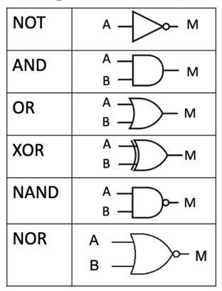

#  Logische poorten anders bekeken

We behouden de werking van de EN-, OF en Exclusieve OF-
poorten, maar we bekijken:
- de ingang A als signaal én
- de ingang B als stuurlijn.

## EN-poort als doorlaatfilter.
Als stuurlijn 1 is laat deze het signaal normaal door.
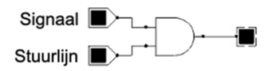

| Stuurlijn | Signaal | Uit |
| --------- | ------- | --- |
| 0         | 0       | 0   |
| 0         | 1       | 0   |
| 1         | 0       | 0   |
| 1         | 1       | 1   |
- Stuurlijn = 0 => Signaal wordt geblokkeerd (uit = 0).
- Stuurlijn = 1 => Signaal wordt doorgelaten.

## Exclusieve OF-poort als flexibele invertor
Als stuurlijn 1 is inverteert deze de waarde van het signaal.
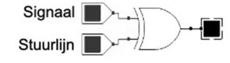

| Stuurlijn | Signaal | Uit |
| --------- | ------- | --- |
| 0         | 0       | 0   |
| 0         | 1       | 1   |
| 1         | 0       | 1   |
| 1         | 1       | 0   |
- Stuurlijn = 0 => Signaal wordt doorgelaten.
- Stuurlijn = 1 => Signaal wordt geïnverteerd.

## OF-poort als samensteller

De OF-poort kan signalen samenvoegen naar de uitgang.
Hierbij is de uitgang 1 zelfs als slechts op één van de ingangen een signaal aanwezig is terwijl er op de andere ingangen signaal 0 wordt aangeboden.
Enkel als alle signalen 0 zijn is de uitgang 0.

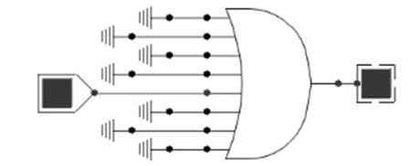

| X   | Y   | Z   | Sign | Uitgang |
| --- | --- | --- | ---- | ------- |
| 0   | 0   | 0   | 0    | 0       |
| 0   | 0   | 0   | 1    | 0       |
| 0   | 0   | 1   | 0    | 1       |
| 0   | 0   | 1   | 1    | 1       |

# Combinatorische schakelingen

Een combinatorische schakeling is een netwerk van logische poorten dat een vooropgestelde functie uitvoert.

https://circuitverse.org/users/152345/projects/computer-systems
## De decoder

Functie: **alle uitgangen zijn 0 met uitzondering van die ene uitgang waarvan de index (adres) als binair getal op de ingangen staat**.
Belangrijk! Bij een decoder is precies één uitgang hoog.

**Decoder is op basis van AND poorten**

Een decoder met n ingangen teken je als volgt:
- Inverteer alle ingangen
- Plaats 2n EN-poorten met n ingangen
- Benoem de uitgangen D0 tem. D(2n-1)
- De ide ingang van elke EN-poort wordt ofwel
met de ide ingang van de schakeling
verbonden ofwel met zijn inverse, afhankelijk
van de binaire schrijfwijze van de index
- 0 => inverse ingang
- 1 => ingang
### 3 to 8 Decoder

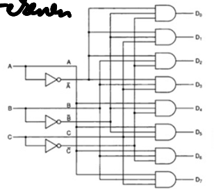

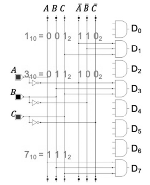

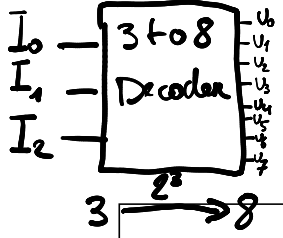

| A   | B   | C   |     | D0  | D1  | D2  | D3  | D4  | D5  | D6  | D7  |
| --- | --- | --- | --- | --- | --- | --- | --- | --- | --- | --- | --- |
| 0   | 0   | 0   | 0   | 1   | 0   | 0   | 0   | 0   | 0   | 0   | 0   |
| 0   | 0   | 1   | 1   | 0   | 1   | 0   | 0   | 0   | 0   | 0   | 0   |
| 0   | 1   | 0   | 2   | 0   | 0   | 1   | 0   | 0   | 0   | 0   | 0   |
| 0   | 1   | 1   | 3   | 0   | 0   | 0   | 1   | 0   | 0   | 0   | 0   |
| 1   | 0   | 0   | 4   | 0   | 0   | 0   | 0   | 1   | 0   | 0   | 0   |
| 1   | 0   | 1   | 5   | 0   | 0   | 0   | 0   | 0   | 1   | 0   | 0   |
| 1   | 1   | 0   | 6   | 0   | 0   | 0   | 0   | 0   | 0   | 1   | 0   |
| 1   | 1   | 1   | 7   | 0   | 0   | 0   | 0   | 0   | 0   | 0   | 1   |

---
### 2 to 4 Decoder

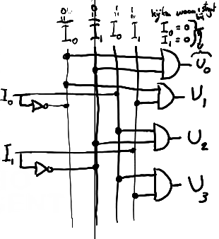

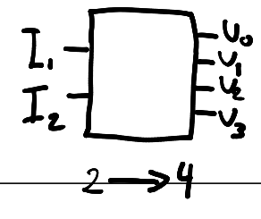

| I0  | I1  | U0  | U1  | U2  | U3  |
| --- | --- | --- | --- | --- | --- |
| 0   | 0   | 1   | 0   | 0   | 0   |
| 0   | 1   | 0   | 1   | 0   | 0   |
| 1   | 0   | 0   | 0   | 1   | 0   |
| 1   | 1   | 0   | 0   | 0   | 1   |

---

## De multiplexer
**Om een parallele stroom van gegevens een seriële uitgang te geven via een selectie vanuit A, B, C in een binair adres.**

De multiplexer is een combinatie van:
- een decoder
- EN-doorlaatfilters
- een OF-samensteller

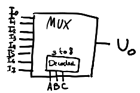

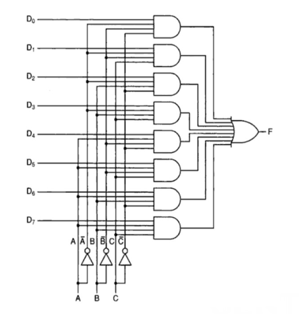

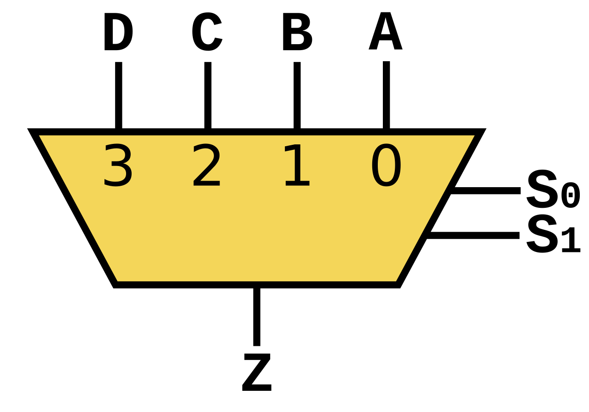

| S 1 | S 0 | Z   |
| --- | --- | --- |
| 0   | 0   | A   |
| 0   | 1   | B   |
| 1   | 0   | C   |
| 1   | 1   | D   |
## De optellers

### Half Adder

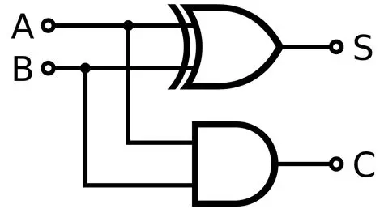

| A   | B   | S SOM | C uit carry |
| --- | --- | ----- | ----------- |
| 0   | 0   | 0     | 0           |
| 0   | 1   | 1     | 0           |
| 1   | 0   | 1     | 0           |
| 1   | 1   | 0     | 1           |
### Full Adder

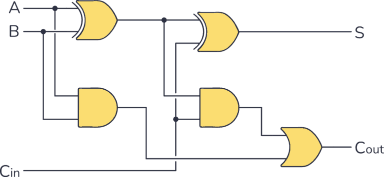

| **A** | **B** | **C** in (carry) | S Som | C out (carry) |
| ----- | ----- | ---------------- | ----- | ------------- |
| 0     | 0     | 0                | 0     | 0             |
| 0     | 0     | 1                | 1     | 0             |
| 0     | 1     | 0                | 1     | 0             |
| 0     | 1     | 1                | 0     | 1             |
| 1     | 0     | 0                | 1     | 0             |
| 1     | 0     | 1                | 0     | 1             |
| 1     | 1     | 0                | 0     | 1             |
| 1     | 1     | 1                | 1     | 1             |
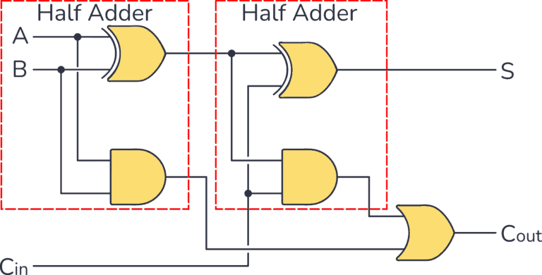

## De Ripple Carry Adder
https://www.youtube.com/watch?v=wvJc9CZcvBc&t=5s

Een **opteller die twee n-bit woorden in één keer bij elkaar optelt** (bv. 2 8-bit woorden), bestaat uit 1 halve en n-1 hele optellers. De carry bits golven doorheen de schakeling, vandaar de term ”ripple” in de naam.

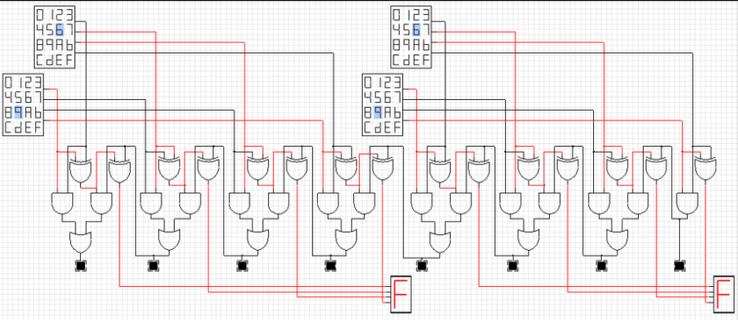

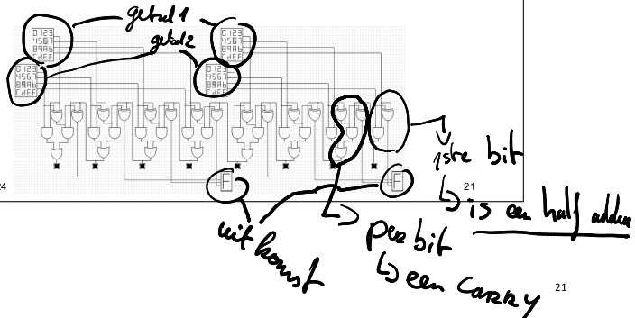

