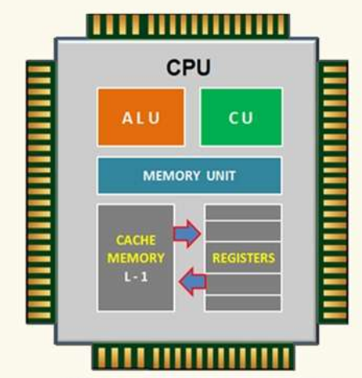
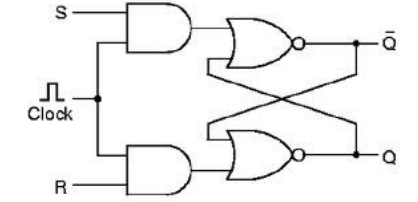

# Algemeen blokschema van de hoofdonderdelen van een computer

# ALU

Het Arithmetic & Logic Unit is een onderdeel van elke processor die op flexibele manier bewerkingen uitvoert op twee n-bit operanden.

## Bewerkingen:
• en, of, niet,
• optellen, aftrekken,
• 2-complement,
• negatie, …

## Werking

Alle bewerkingen (en, of, niet, optellen) worden tegelijk uitgevoerd.
De gewenste bewerking stroomt door naar de uitgang met een EN-doorlaatfilter gevolgd door een OF-samensteller.
Om de doorlaatfilter/samensteller combinatie correct te laten werken verloopt de selectie via een decoder (slechts één signaal mag doorgelaten worden).

Voor nog meer flexibiliteit zijn er nog drie extra stuurlijnen en wat extra poorten aanwezig namelijk:

- ENA en ENB houden de ingangssignalen op A en B tegen indien 0
- INVA inverteert het A ingangssignaal indien 1 en laat die onveranderd door indien 0
- INC voor de carryin bit (enkel bij eerste 1-bit ALU van een n-bit-ALU-reeks)

Er kunnen zich dus verschillende combinaties voordoen aan de ingangen F0, F1, ENA, ENB, INVA en INC. Niet alle combinaties zijn zinvol, soms geven verschillende combinaties van stuurlijnen dezelfde bewerking.

## Een n-bit ALU (bvb. 8-bit ALU)

Er zijn circuits aanwezig die
- overflow detecteren bij het optellen van zowel unsigned als signed integers
- een negatieve uitkomst detecteren bij signed integer
- nul als uitkomst detecteert

Er zijn dus 2 operanden van n-bit nl. A en B, en 6 stuurlijnen nl. InvA, EnA, EnB, F1, F0, INC aanwezig.
Elke combinatie van de stuurlijnen geeft een (al dan niet zinvolle) bewerking op de operanden.

*Examen:*  zelf opstellen door te redeneren vanuit ALU schema

\- (streepje) wil zeggen dat een 1 of 0 niet uitmaakt voor de output.

# Bouwstenen van een geheugen

## Bouwstenen

### Gated latch (Niet Kennen)
#### AND-OR latch (Niet kennen)

#### Gated latch (Niet kennen)

#### Clocked Gated latch (Niet kennen)

### De SR-latch

Om met logische poorten een geheugen te maken is feedback (terugkoppeling) nodig.

1-bit geheugen opgebouwd met behulp van 2 NOR poorten
	=> twee stabiele toestanden
		• Set=1 (en Reset=0) => Q=1 (en -Q=0)
		• Reset=1 (en Set=0) => Q=0 (en -Q=1)

Werking:
- met een kleine vertraging (wegens poortvertraging) neemt de 2de ingang van één van de NOR-poorten de werking van de S of R ingang over
- om een nieuwe waarde in het geheugen te schrijven moet ofwel S, ofwel R, voldoende lang op 1 gehouden worden
  *Opmerking*: De ingangen (S en R) mogen NOOIT gelijktijdig 1 zijn!

### De geklokte SR-latch

Hier worden twee EN-doorlaatfilters toegevoegd zodat de toestand van de S- en R-ingangen slechts doorgelaten worden wanneer het kloksignaal hoog (1) is. De klok is meestal laag (0) en wordt “eventjes” hoog (1) gebracht op het moment dat we iets in het geheugen willen schrijven.

*Problemen:*
- S en R kunnen nog altijd gelijktijdig 1 zijn => mag niet, oscillatie mogelijk
- Klokpuls kan eventueel te kort zijn => de bit zal dan niet in het geheugen geschreven zijn en/of de SR-latch zal oscilleren
### De geklokte D-latch

Hier worden de S- en R-ingangen herleid tot één D-ingang. De NIET-poort zorgt dat R en S nooit allebei 1 zijn.
Probleem: Klokpuls kan nog steeds te kort zijn

### D-flip-flop

Deze schakeling onthoudt de toestand van ingang D bij elke stijgende flank op de klok-ingang (CK).

#### Rising Edge op basis van Gated latch (NIET KENNEN)

#### Pulsgenerator

Bij dit deel van de schakeling hangt aan ingang a een (extern) kloksignaal, op de uitgang d krijgen we een korte puls.

#### Werking van de schakeling:

- Door de poortvertraging op de niet-poort wordt na een stijgende flank op CK een korte puls gegenereerd op beide EN-poorten (middelste ingangen).
- Deze puls maakt kortstondig de S-ingang van de SR-latch hoog als D=1 of de R-ingang als D=0.
- De lengte van de puls moet voldoende lang zijn om de SR-latch in een (nieuwe) stabiele toestand te brengen.

*Voordelen*:
- Door aan de CK-ingang een stijgende flank aan te leggen, wordt de waarde die op dat moment aan de D-ingang hangt, in het geheugen geschreven.
- De maker (fabrikant) van de D-flip-flop zorgt er zelf voor dat de (interne) puls op de EN-poorten voldoende lang is.
- De (interne) puls moet ook voldoende kort zijn. Want hoe korter de puls, hoe sneller na elkaar we iets in het geheugen kunnen schrijven.

#### Voorstelling D-flip-flop’s:

### Register

Is een combinatie van meerdere flip-flops waarvan de voedingspinnen, de clock en clear pinnen gecombineerd zijn.
Functie: Een 8-bit woord op de D-pinnen wordt vast-gehouden bij een stijgende flank op de CK pin.
Een dergelijke opstelling binnenin een CPU wordt ook een “register” genoemd.

# Het RAM-geheugen

Het bieden van een tijdelijke opslag voor informatie, die snel toegankelijk is en verdwijnt van zodra de computer uitgezet wordt.

**Opbouw van RAM geheugen:**
- lange lijst van locaties (bestaande uit geheugencellen)
- in elke locatie kan één computerwoord opgeslagen worden
- de opgeslagen informatie kan in willekeurige volgorde opgevraagd worden - vandaar de naam “Random Access Memory”
- om de geheugenlocaties individueel te kunnen aanwijzen, heeft elke locatie een uniek adres (= binair getal).

## Basisopdrachten

Slechts 2 basisopdrachten (CPU  RAM geheugen):
- Lees de inhoud van de geheugenlocatie met adres X.
- Schrijf nieuwe inhoud in de geheugenlocatie met adres X

## Interactie met het RAM-geheugen

**Adreslijnen**:
- geven aan welke geheugencel gelezen of geschreven moet worden
- verbindingen tussen de processor en het RAM geheugen
- elke adreslijn is 1 elektrische verbinding

**Datalijnen**:
- Verbindingen tussen de processor en het RAM geheugen waarover het op te slaan of uit te lezen woord uitgewisseld wordt.

**Stuurlijnen**:
- Bijkomende verbinding tussen de processor en het RAM geheugen met de functies:
	- opdracht: aangeven of er gelezen of geschreven moet worden
	- timing: zorgen dat de processor en het geheugen in hetzelfde ritme blijven werken

## Schematische voorstelling

### Cellen

De cellen zijn D-flip-flops. Eén flip-flop houdt één bit van één geheugenlocatie vast.

Ze zijn georganiseerd in een matrixvorm:
- horizontaal: bits van het woord
- verticaal: opeenvolgende geheugenlocaties

### adreslijnen en de woordselectie

**Adreslijnen**:
- zijn unidirectionele lijnen (enkel ingang voor de RAM chip)
- het binaire getal op deze lijnen = de te adresseren locatie

**Decoder**:
- zet signaal op n adreslijnen om naar signaal op 2n woordselectielijnen
- Op elk ogenblik zal slechts één woordselectielijn hoog zijn, namelijk diegene die aangewezen wordt door het binair getal op de adreslijnen
*Woordselectielijnen*: uitgangen van de decoder

### leesfilters

EN-doorlaatfilters/OF-samensteller combinatie:

Functie: **Alleen de uitgangen van de flip-flops in de aangewezen rij naar de datalijnen doorgegeven**.

*EN-doorlaatfilter*:
- Select-ingang/stuurlijn (links) verbonden met woordselectielijn
- Signaal-ingang (rechts) verbonden met uitgang van de flipflop

*OF-samensteller*:
- evenveel ingangen als er locaties op de chip zijn!
- slechts één ingang bevat een nuttig signaal, de rest nul, dankzij de werking van de adresdecoder

### stuurlijnen

**RD: Read**
Zolang deze lijn hoog is, wordt het woord van de locatie die door de adreslijnen aangewezen wordt naar de datalijnen doorgegeven.

**WR: Write**
Externe klokpuls die aangeeft dat het woord dat op de datalijnen staat naar de locatie, die door de adreslijnen aangewezen wordt, moet geschreven worden.

**CS: Chip Select**
Maakt het mogelijk om meerdere geheugenchips parallel op dezelfde adres- en datalijnen te zetten (zie later). Er mag steeds slechts 1 chip geselecteerd zijn, bij de rest moet CS=0. CS bepaalt of WR en RD door de EN-doorlaatfilters mogen.

### datalijnen

De datalijnen zijn bidirectionele verbindingen die de woorden transporteren :
- van het RAM-geheugen naar de CPU bij het lezen en
- van de CPU naar de RAM-chip bij het schrijven

Om bidirectionele verbindingen mogelijk te maken, zijn tri-state buffers nodig.

### schrijfpoort

EN poort gebruikt als doorlaatfilter:
- Externe klokpuls is de signaallijn (bovenste lijn)
- “Woordselectielijn” is de stuurlijn/select ingang (onderste lijn)

Functie:
- De externe klokpuls wordt alleen naar die rij (locatie) doorgelaten waarnaar geschreven moet worden.
- Om problemen te voorkomen mag slechts één schrijfpoort tegelijk actief worden en daar zorgt de decoder voor, want de woordselectielijnen zijn uitgangen van een decoder.

## leescyclus

1. Begintoestand: CS, RD en WR lijnen zijn laag.
2. De CPU plaatst de datalijnen in hoog-ohmige toestand.
3. Vervolgens plaatst de CPU het adres van de gewenste locatie op de adreslijnen.
4. Via de decoder, adresselectie en leesfilters komt de inhoud van de gewenste locatie aan de ingang van de tri-state buffers.
5. De CPU maakt RD en CS lijnen hoog.
6. De tri-state buffers sturen de datalijnen actief aan.
7. De CPU leest het gevraagde woord van de datalijnen.
8. De CPU maakt CS, RD en WR lijnen terug laag ter voorbereiding van de volgende cyclus.

## schrijfcyclus

1. Begintoestand: CS, RD en WR lijnen zijn laag.
2. De CPU plaatst het weg te schrijven woord op de datalijnen.
3. De CPU plaatst het adres van de doellocatie op de adreslijnen.
4. Het weg te schrijven woord wordt aan de ingangen van ALLE flip-flops aangeboden.
5. De CPU maakt CS stuurlijn hoog en stuurt een klokpuls naar de WR stuurlijn. (Door de werking van de schrijfpoorten krijgen alleen de flip-flops van de gewenst rij de schrijfpuls binnen.)
6. De flip-flops van de geadresseerde locatie bewaren het door de CPU gegeven woord.
7. De CPU maakt CS, RD en WR lijnen terug laag ter voorbereiding van de volgende cyclus.

## organisatie van RAM-chips

Naast de totale opslagcapaciteit in Kibit, Mibit of Gibit, is ook de organisatie van de chip belangrijk, want het aantal data- en adreslijnen hangt ervan af.

### Voorbeeld:

## RAM-modules

RAM-chips combineren in één module (“latje”) om een groter RAM-geheugen te bouwen

### Voorbeeld:

We willen een geheugenmodule maken met:
	- totale *geheugencapaciteit : 128 bit*
	- *woordbreedte : 4 bit*

*Hoeveel woorden* (van 4 bit) kunnen we dan opslaan? *32 woorden* (128/4)

*Hoeveel datalijnen* zal de module hebben? *4 datalijnen*

*Hoeveel adreslijnen* heeft onze module? *5 adreslijnen* (chipselect1 + chipselect2 + adreslijn 0 + adreslijn 1 + adreslijn 2 )

*Welke stuurlijnen* heeft onze module? *WR, RD, CS*

### Situatie 1:

Maak 128-bit-module (32x4bit) met 4 chips van 32x1 bit

Aantal datalijnen bij 32x1-chip? 1 datalijn
Aantal adreslijnen bij 32x1-chip? 5 adreslijnen
Welke stuurlijnen heeft 32x1-chip? WR, RD, CS

Hoe organiseren we onze module?
– Elke chip zorgt voor 1 datalijn
– Elke chip gebruikt dezelfde 5 adreslijnen
– CS is voor elke chip gemeenschappelijk
– ook RD en WR zijn gemeenschappelijk

# De stack (Assambly)

Een *stack is een datastructuur voor ​de opslag van een wisselend aantal ​elementen waarbij geldt dat het ​element dat het laatst werd toegevoegd,​ het eerst weer wordt opgehaald*. ​
Dit principe wordt ook wel **LIFO** (LastInFirstOut) genoemd.​

Een stack kan geïmplementeerd worden als een *gelinkte lijst*, of, als de grootte begrensd is, als een *array*, met een pointer die naar het laatste stackelement wijst.

Elke processor heeft een hardware stack, maar de werking​ ervan kan verschillen.​

​*Speciaal adresregister*: **Stack Pointer** (SP)​

​Twee soorten instructies maken gebruik van de stack:​
1. *PUSH en POP​*
    - **PUSH** verhoogt SP met 1 en slaat een waarde op de stack op​
    - **POP** leest de hoogste waarde van de stack en verlaagt SP met 1​
    
2. *CALL en RET*(urn)​
    - **CALL** slaat het adres van de volgende instructie op de stack op en springt naar een subroutine​
    - **RET** haalt het adres van de stack en springt naar dit adres.​

## Hardware stack

De hardware stack wordt door de processor gebruikt als **call ​stack** maar is ook beschikbaar voor de programmeur om ​waarden in op te slaan.​

​In de praktijk wordt de stack (naast als call stack) *vooral ​gebruikt om registerwaarden op te slaan na een sprong naar ​een subroutine of interrupt afhandelingsroutine*.​

​Omdat adresgegeven (call stack) op de stack gemengd ​worden met registerwaarden moet de programmeur er zorg ​voor dragen dat alle gePUSHt waarden gePOPt worden vóór ​de RETurn instructie!​

## Call stack

Is een stack die in het geheugen van een computer​ wordt bijgehouden tijdens de uitvoering van een ​programma.​

Deze wordt gebruikt om twee soorten gegevens op​ te slaan:​
	- *inhoud van registers* die tijdelijk hergebruikt worden​
	- *lokale variabelen*

### Inhoud van registers:​

Het *hoofdprogramma* wordt uitgevoerd.​
- Bij de uitvoering van de **call** instructie​
	- wordt het adres van de volgende instructie op de stack opgeslagen​
	- springt de uitvoering naar het opgegeven adres​

​​De *subroutine* wordt uitgevoerd.
- Bij de uitvoering van de **RET** instructie
	- wordt het opgeslagen adres van de stack gehaald​
	- gaat het programma verder op het (van de stack) teruggelezen adres

![[./attachmentscomputersystems/Screencast from 2024-12-07_20-53-12.webm]]

### Lokale variabelen:​

Op de stack kunnen ook gegevens opgeslagen worden.​
​*Na de CALL en de PUSH instructie bevat de stack* **één ​adres** *en* **één gegeven**.​

`PAS OP!​`
Als de programmeur de POP instructie vóór ​de RET instructie vergeet zal CPU een verkeerd​ terugkeeradres van de stack lezen en ​het programma zal onherroepelijk vastlopen.​

# Het cachegeheugen
## Cachegeheugen

Een cache is een *opslagplaats waarin veelgebruikte data* ​**tijdelijk** *worden opgeslagen om* **sneller** *toegang tot deze data​ mogelijk te maken, of een* **kopie** *van een verzameling data ​op een medium dat* **sneller** *toegankelijk is dan het medium ​waarop de originele data opgeslagen zijn*.​

​Het opslaan van veelgebruikte data op een sneller medium ​om sneller toegang tot deze data te hebben wordt **caching** ​genoemd.​

- **latentie** = de vertraging die optreedt voordat een operand wordt geleverd
- **bandbreedte** = de hoeveelheid gegevens die per tijdseenheid kan worden geleverd​

Cache kan de *latentie sterk verbeteren op voorwaarde* dat ​er **een hoge hit rate** is. ​

​Het gebruik van *meervoudige caches* **vergroot de bandbreedte** ​*en* **reduceert de latentie**. ​

​Indien er een *afzonderlijke cache voor instructies en voor data ​gebruikt* wordt spreken we van **split cache**. ​

Caching wordt echter op zeer *verschillende niveau's* toegepast nl.:​
- **L(evel) 1 cache** of onchip-cache: zeer snel RAM-geheugen dat in de processor zelf is ingebouwd ​
- **L(evel) 2 cache**: eveneens zeer snel RAM-geheugen dat op een aparte chip tussen de processor en het "normale" RAM geheugen geplaatst is. ​
- **disk-cache**: een groot gedeelte van het "normale" RAM geheugen dat gereserveerd wordt om kopies van de meest recent gelezen bestanden van de harde schijf in op te slaan. ​
- **De cache van de internet-browser**: een cache op de harde schijf die de meest recent opgevraagde internetpagina's bevat of ARP en DNS caches: relatie IP/MAC-adres (ARP) of IP adres/naam wordt een tijdje bijgehouden.​
- **Proxies**: Je internet provider houdt op zijn beurt vaak ook kopies bij van de meest opgevraagde internet-pagina's. ​
    
 

De cachegeheugens bevatten gewoonlijk elkaars inhoud ​d.w.z. de inhoud van niveau 1 is opgenomen in niveau 2, …​

​Caches verrichten hun functie door gebruik te maken van *2 ​typen adreslokalisering* nl.​
- **Ruimtelijk lokaliteit** : opeenvolgend uit te voeren instructies en data zitten meestal dicht bij elkaar in het hoofdgeheugen​​
- **Temporele lokaliteit** : er is een kans dat instructies of data na korte tijd opnieuw gebruikt zullen worden (bvb programma lus)​

### Werking van de cache

Cachegeheugen wordt onderverdeeld in blokken met een vaste ​grootte die cache lines of cacheregels worden genoemd. ​

​Een cacheregel bestaat gewoonlijk uit tussen 8 en 64 bytes.​

​Bij een geheugenverwijzing wordt door de cache controller ​gecontrolleerd of de *informatie in de cache beschikbaar is:*
- *zoja =>* spreken we dan van een **hit**​
- *zoniet =>* spreken we van een **miss** en wordt de informatie​ opgehaald uit het hoofdgeheugen en eerst ​opgeslagen in een cacheregel. Wanneer de cache ​reeds vol is wordt meestal het LRU algoritme​ toegepast.​

*Methodes voor het terugschrijven van data naar het hoofdgeheugen*:​
- **Write-through**: wijzigingen worden onmiddellijk naar de cache én naar het geheugen geschreven​
- **Write-back**: wijzigingen worden pas geschreven wanneer de cache-regel uit de cache verwijderd wordt.​

| ​          | Write-through​                      | Write-back​                                       |
| ---------- | ----------------------------------- | ------------------------------------------------- |
| Voordelen​ | hoofdgeheugen is altijd up-to-date​ | schrijfoperaties worden gegroepeerd​              |
| Nadelen​   | ​                                   | extra latentie bij cache miss door delayed write​ |
### Direct-mapped cache​

Dit is de meest voorkomende en meest eenvoudigste cache, ​een cache met een rechtstreekse geheugenafbeelding.​

​Elke cache-regel wordt op een vaste plaats in de cache ​afgebeeld en die cache-regels zitten dus ook in het ​hoofdgeheugen.​

 

*Velden*:​
- **Valid**: cache element bevat ja of neen een cache regel​
- **Tag**: resterende hogere orde adresbits die aangeven uit welke geheugenregel de gegevens afstammen.​
- **Data**: cache-regel, is een kopie van de geheugenregel​

Voordeel: ​
- Een geheugenregel kan maar op één plaats in de cache staan ​snelle controle of de data in de cache staat.​

​
### Cache coherency​

*Belang:​*
**Wanneer dezelfde data op 2 verschillende plaatsen aanwezig is,​ is het belangrijk te weten op welke plaats de juiste data aanwezig is**.​

​Een aantal technieken vereisen hiervoor extra hardware:​
- verandering van hoofdgeheugen door I/O of DMA toegang ​(zie later)​
- multi-processor systemen​
- …​

*Vereisten:* **bus snooping** *of* **bus sniffing​**
- monitoring van het verkeer op de systeembus​
