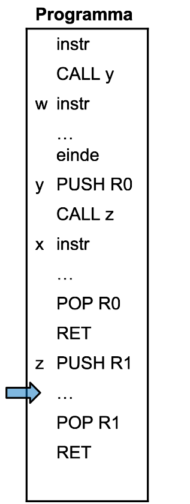
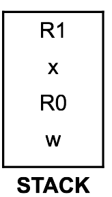

# Oefeningen

## Hoe zal de stack eruit zien bij uitvoering van het programma, als de uitvoer tot aan de  blauwe lijn gekomen is?

### Oplossing

# Meer oefeningen 

OEFENING 1: Hoe ziet de stack eruit? De pijl duidt de laatste instructie aan. Laat ook de eventueel doorstreepte waarden uit je stack staan.

  

|            | **Programma**      |
| ---------- | ------------------ |
|            | instructie         |
|            | CALL w             |
| **a**      | instructie         |
|            | instructie         |
|            | PUSH R0            |
|   => | PUSH R3  ……. |
| **w**      | instructie         |
|            | PUSH R1            |
|            | CALL v             |
| **b**      | instructie         |
|            | POP R1             |
|            | RET                |
| **v**      | PUSH R2            |
|            | instructie         |
|            | POP R2             |
|            | RET                |

  
  

  
  

OEFENING 2: Hoe ziet de stack eruit? De pijl duidt de laatste instructie aan. Laat ook de eventueel doorstreepte waarden uit je stack staan.

 
|            | **Programma**            |
| ---------- | ------------------------ |
|            | instructie               |
|            | CALL x                   |
| **a**      | instructie               |
|            | instructie               |
|            | PUSH R5                  |
|   => | PUSH R3  ……        |
| **y**      | instructie               |
|            | PUSH R1                  |
|            | POP R1  RET        |
| **x**      | PUSH R2                  |
|            | Instructie  CALL y |
| **b**      | POP R2                   |
|            | RET                      |

  
  

OEFENING 3: Hoe ziet de stack eruit? Laat ook de eventueel doorstreepte waarden uit je stack staan.

|       | **Programma**             |
| ----- | ------------------------- |
|       | Instructie  PUSH R1 |
|       | CALL x                    |
| **a** | instructie                |
|       | instructie                |
|       |                           |
|       | PUSH R3                   |
| **y** | instructie                |
|       |                           |
|       | POP R2  RET         |
| **x** | PUSH R2                   |
|       | Instructie  CALL y  |
| **b** | POP R2                    |
|       | RET                       |