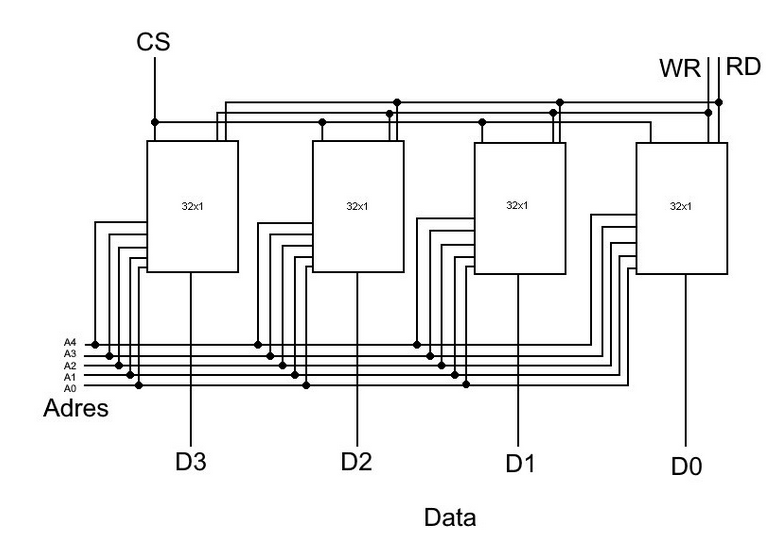
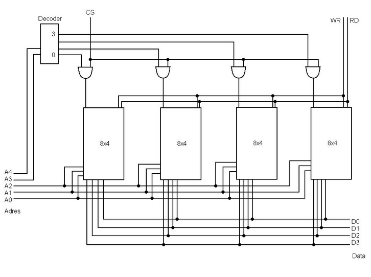

# Ram

## RAM-modules​

### Oefening 1: ​

`Maak 128-bit-module (32x4bit) met 4 chips van 32x1 bit​`

**Aantal datalijnen bij 32x1-chip?​** => 1 datalijn
**Aantal adreslijnen bij 32x1-chip?​** => 5 adreslijnen
**Welke stuurlijnen heeft 32x1-chip?​** => WR, RD, CS
**Hoe organiseren we onze module?** 
- Elke chip zorgt voor 1 datalijn​   
- Elke chip gebruikt dezelfde 5 adreslijnen​
- CS is voor elke chip gemeenschappelijk​
- ook RD en WR zijn gemeenschappelijk

**Grafische voorstelling**
32x4bit-module met 4 chips van 32x1 bit​

 

### Oefening 2: ​

`Maak 128-bit-module (32x4bit) met 4 chips van 8x4 bit​`

​**Aantal datalijnen bij 8x4-chip?​** => 4 datalijn​
**Aantal adreslijnen bij 8x4-chip?​**=> 3 adreslijnen​
**Welke stuurlijnen heeft 8x4-chip?​**=> WR, RD, CS​
**Hoe organiseren we onze module?​**
- De 4 datalijnen van de 4 chips zijn doorverbonden​
- Elke chip gebruikt de 3 laagste adreslijnen v/d module​
- De 2 hoogste adreslijnen zorgen (via een decoder)​ voor het activeren van de juiste CS​
- WR en RD zijn gemeenschappelijk voor de 4 chips​

**Grafische voorstelling**
32x4bit-module met 4 chips van 8x4 bit​

 
### Realistischer oefening:​

`Maak een 1GiByte-module, woordbreedte 64-bit​`
`Gebruik hierbij 64Mix8bit-geheugenchips​`

1. **Hoeveel 64bit-woorden kunnen we opslaan in de module?​**
	    Capaciteit module = 1GiByte = 8 x 210 x 210 x 210 = 233 bit​  
		Woordbreedte = 64 bit = 26 bit​  
		=> Aantal woorden in module = 233/26 = 227​
2. **Hoeveel 64Mix8bit-geheugenchips hebben we nodig?​**
		Capaciteit module = 1GiByte = 233 bit (zie a)​  
	    Capaciteit chip = 64Mi x 8 bit = 26 x 220 x 23 bit = 229 bit​  
	    => Aantal chips = 233/229 = 24 = 16​
3. **Hoeveel adres- en datalijnen zal de module hebben?​**
	    Woordbreedte module = 64 bit => 64 datalijnen​  
	    Aantal woorden in module = 227 ​  
	    => 27 adreslijnen​
4. **Hoeveel adres- en datalijnen hebben de chips?​**
    Woordbreedte chip = 8 bit => 8 datalijnen​  
	Aantal 8 bit woorden in chip = 64Mi = 226​  
	=> 26 adreslijnen
5. **Hoeveel adreslijnen worden intern gebruikt voor het ontdubbelen van CS?​**
	    Aantal adreslijnen voor CS​  
		= aantal adreslijnen module – aantal adreslijnen chip ​  
		= 27 – 26 = 1 adreslijn​
6. **Hoeveel chips worden gelijktijdig geactiveerd via CS​  bij 1 lees- of schrijfoperatie?​**
		Woordbreedte module / woordbreedte chip​  
		= 64 bit / 8 bit = 8​  
		=> 8 chips gelijktijdig actief​

