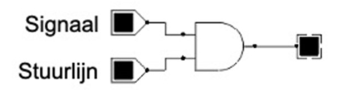
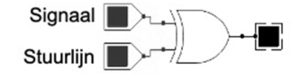
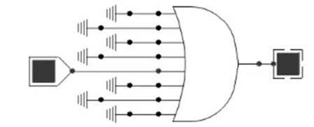
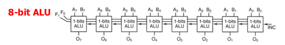
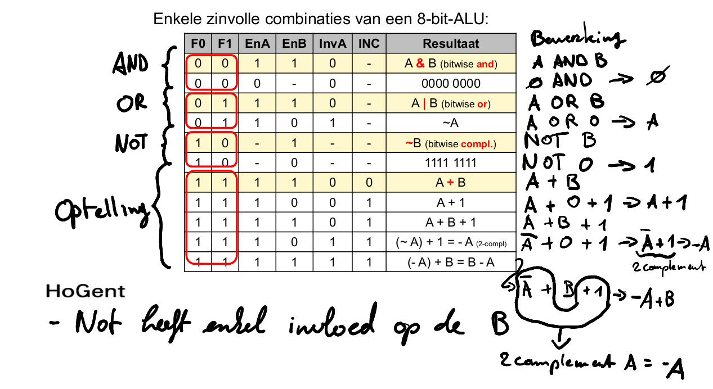
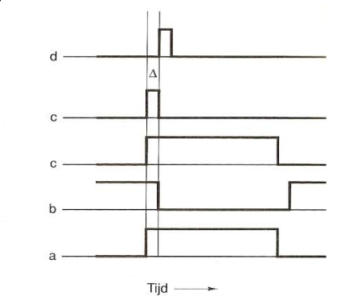
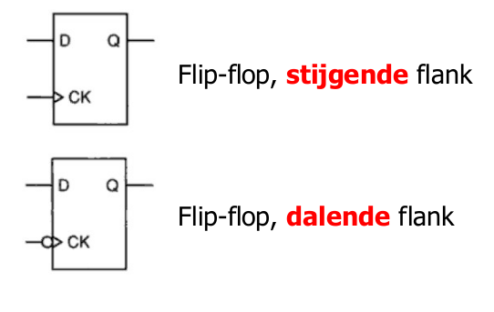
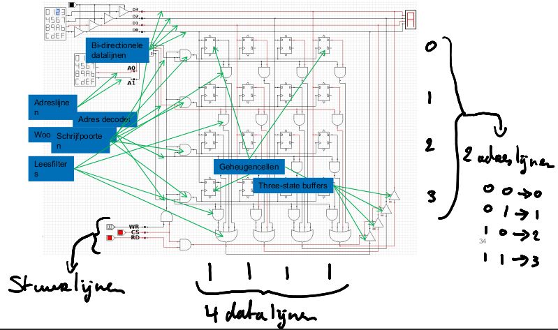
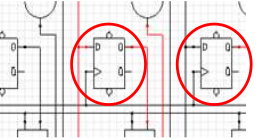

# Examen

examen is **gesloten boek**, en je zal een schermopname moeten maken via Panopto.

sporthal van campus Schoonmeersen
# H01 Inleiding

- Computer vs Embedded System

- Analoog vs Digitaal

- Experimenteel
	- Optische technologie
	- Kwantumtechnologie

# H02 Besturingssystemen

- _Software die_ op een computerapparaat wordt uitgevoerd en de _hardware- en softwarecomponenten beheert_.
- **Scheduling**: programma's die uitgevoerd moeten worden en _services aanbieden aan gebruikers of programma’s worden ingepland_.
- Gewoonlijk afgekort als **OS**
## onderdelen OS

Hardware: het fysieke deel van een computer inclusief onderliggende elektronica.

**Kernel**: vormt _de communicatie tussen de hardware en software_ van een computer en _beheert de hardwarebronnen_. (staat tussen de gebruikersinterface en de hardware)

**Shell**: de _gebruikersinterface waarmee gebruikers specifieke taken van de computer kunnen aanvragen_. Deze verzoeken kunnen worden gedaan via de **CLI** of **GU**
## GUI vs CLI
- **GUI** = Grafische gebruikersinterface (_Graphical User Interface_)
- **CLI** = Commando-regel interface (_Command-Line Interface_)

## Keuze

De 3 belangrijkste besturingssystemen vandaag zijn:

- **Microsoft Windows**
- **Apple macOS**
- **Linux**

## Linux distributies
- Red Hat
- Suse
- Debian
- Android
- Raspbian
- Linux from scratch

## Open source licenties
- **End User License Agreement (EULA)** -> _is niet open source, is bij proprietary software_
    - is een juridisch document dat geaccepteerd moet worden voordat de software geïnstalleerd wordt.
- **GNU General Public License version 2 (GPLv2)**
    - is een _licentie waarbij de broncode voor iedereen beschikbaar moet zijn en waarbij iedereen wijzigingen kan aanbrengen_
    - _Wijzigingen moeten onder dezelfde licentie vallen_.
- **Free and Open Source Software**
    - is _software waarbij iedereen de broncode kan bekijken, wijzigen en opnieuw kan verspreiden_.

# H03 Basiskennis GNU / Linux

- Gnu/Linux
	- Kernel = linux
	- begint met unix en commandos zijn gelijkaardig

- Keuze distro
	- Rol
	- Functie
	- Levenscyclus
	- Stabiliteit
	- Kost

## Bash shell

- Prompt
```bash
sysadmin@localhost:~$
```

```shell
command [options] [arguments]
```


### STDIN (Standaardinvoer)

- **Wat is het?**  
    Dit is de invoer die een commando kan ontvangen. In een typische situatie is STDIN gekoppeld aan het toetsenbord, zodat een gebruiker direct gegevens kan invoeren.
    
- **Voorbeeld in Bash:**  
    Bij het gebruiken van een commando zoals `cat`, kun je tekst invoeren via het toetsenbord:
    
```bash
cat
```

Als je daarna tekst typt en op Enter drukt, voert `cat` die tekst uit naar STDOUT (meestal het scherm). Je kunt ook STDIN doorsturen vanaf een bestand:
    
```bash
cat < bestand.txt
```
We steken de inhoud van bestand.txt in cat
### STDOUT (Standaarduitvoer)

- **Wat is het?**  
    Dit is de standaarduitvoer van een commando. Meestal is STDOUT gekoppeld aan de terminal, zodat de uitvoer op het scherm verschijnt.
    
- **Voorbeeld in Bash:**  
    Als je een bestand weergeeft met `ls`, wordt de uitvoer (lijst van bestanden) naar STDOUT gestuurd:
```bash
ls
```

 Je kunt deze uitvoer ook omleiden naar een bestand:
    
```bash
ls > bestandenlijst.txt
```

### STDERR (Standaardfout)

- **Wat is het?**  
    Dit is het kanaal waar foutmeldingen van een commando naar worden gestuurd. Net zoals STDOUT, is STDERR meestal gekoppeld aan de terminal, maar het is gescheiden van de gewone uitvoer.
    
- **Voorbeeld in Bash:**  
    Als je probeert een niet-bestaand bestand te lezen:
```bash
cat nietbestaandbestand.txt
```
De foutmelding wordt naar STDERR gestuurd. Je kunt foutmeldingen ook naar een bestand sturen met `2>`:
    
```bash
cat nietbestaandbestand.txt 2> foutenlog.txt
```

### Piping

```bash
cat /var/log/syslog | grep "error" | head -n 10

cat bestand.txt | tr ' ' '\n' | sort | uniq | wc -l

#- `tr ' ' '\n'`: Zet spaties om in nieuwe regels (maakt van woorden afzonderlijke regels).
#- `sort`: Sorteert de woorden alfabetisch.
#- `uniq`: Verwijdert dubbele woorden.
#- `wc -l`: Telt het aantal unieke woorden (regels).
```


## Tekens
### Aanhalingstekens
3 soorten aanhalingstekens:

- **enkele aanhalingstekens (' ')**
    - _voorkomen_ dat de shell _alle speciale tekens_ "interpreteert" of uitbreidt

```shell
sysadmin@localhost:~$ echo $variabele
inhoudVanDeVariabele

sysadmin@localhost:~$ echo '$variable'
$variable
```

- **dubbele aanhalingstekens (" ") **
    - _voorkomen_ dat de shell sommige _metatekens_ interpreteert, _inclusief glob-tekens (*)_

```shell
sysadmin@localhost:~$ echo D*
Desktop Documents Downloads

sysadmin@localhost:~$  echo "D*"
D*
```

- **achterwaardse aanhalingstekens of backtick (\` \`) **
    - _"opdrachtvervanging"_ waardoor een _opdracht kan worden uitgevoerd binnen de regel van een andere opdracht_
    - Je kan _hetzelfde bereiken door $()_ te gebruiken.

```shell
sysadmin@localhost:~$ echo today is `date`
Today is Mon Nov 4 03:40:04 UTC 2030

sysadmin@localhost:~$  echo $(date)$
Today is Mon Nov 4 03:40:04 UTC 2030
```

### Backslash

Escape character
Om _slechts één enkel karakter te blokkeren_ aan de speciale betekenis van een shell-metateken, wordt het **backslash (\ )** teken gebruikt.

### Puntkomma
Om meerdere commando's na elkaar uit te voeren.

```shell
sysadmin@localhost:~$ cal 1 2015;cal 2 2015; cal 3 2015
```

## Globbing

Glob-karakters worden vaak **wild cards genoemd**.

| Symbool | werking                                                                               |
| ------- | ------------------------------------------------------------------------------------- |
| \*      | Representeert 0 of meer gelijk welke tekens in een bestandsnaam.                      |
| ?       | Representeert precies 1 teken.                                                        |
| []      | Zoekt een match met precies 1 teken dat tussen de vierkante haakjes wordt opgegeven.  |
| !       | Wordt gebruikt met [ ] om aan te geven dat de tekens tussen [ ] niet mogen voorkomen. |

| Globbing Use Case | Wat het doet                                                     |
| ----------------- | ---------------------------------------------------------------- |
| `t*`              | Alle bestanden die beginnen met 't'.                             |
| `*.???`           | Alle bestanden die 3 karakters voor hun extensie krijgen.        |
| `[gu]*`           | Alle bestanden die beginnen met 'g' of 'u'.                      |
| `[a-d]*`          | Alle bestanden die beginnen met een letter van 'a' t/m 'd'.      |
| `[!a-t]*`         | Alle bestanden die **niet** beginnen met de letters 'a' t/m 't'. |
| `ls e*`           | Alle mappen die beginnen met 'e' (met het `ls` commando).        |

## Alliassen

Eenvoudige namen toe te wijzen aan langere of ingewikkeldere commando's

```bash
# Aliassen bekijken
alias
```

```bash
#Aanmaken alias
alias aliasnaam='commando'

#voorbeeld
alias ll='ls -lah'
```


```bash
# Alias verwijderen
unalias ll
```
### Aliassen permanent maken

liassen die je in de terminal invoert, gelden alleen voor de huidige sessie. Om ze permanent te maken, kun je ze toevoegen aan je `.bashrc` of `.bash_profile` bestand (afhankelijk van je systeem).

1. Open `.bashrc` of `.bash_profile` in een teksteditor:
```bash
nano ~/.bashrc
```    

2. Voeg de alias toe:
```bash

alias ll='ls -lah'
``` 

3. Sla het bestand op en voer vervolgens uit om de wijzigingen direct toe te passen:
```bash
source ~/.bashrc
```


## Variabelen

```bash
# definiëren
sysadmin@localhost:~$ variabele='string'
sysadmin@localhost:~$ variabeleInt=1
```

```bash
# print waarde van variabele
sysadmin@localhost:~$ echo $(variable)
```

### omgevingsvariabelen

Het commando `env` geeft een lijst met omgevingsvariabelen.

```bash
#weergeven
sysadmin@localhost:~$ env
```

```bash
sysadmin@localhost:~$ export $(variabele)
```

```bash
#ongedaan maken omgevingsvariabele
sysadmin@localhost:~$ unset $(variabele)
```
### $PATH = waar alle commandos staan

```bash
echo $PATH
```

- Belangrijkste bash variabele:
	- alle plaatsten waar het systeem zoekt naar uitvoerbare programma's
	- als een commando niet op 1 van deze plaatsen staat krijg je **"command not found"**

- *Locatie toevoegen*
```bash
export PATH=$PATH:/pad/naar/directory
```
voor permanent voeg dit toe aan `bash.rc`
```
nano ~/.bashrc
```


## Groepen en Gebruikers

- Voor elke gebruiker wordt standaard ook een groep aangemaakt met zijn naam.

### Groepen

```bash
#Groep bekijken
sysadmin@localhost:~$ grep "^root" /etc/group
root:x:0:
nikki@Debian-Victus:~/Documents$ grep "^nikki" /etc/group
nikki:x:1000:

#Id 0-999 = voor systeem doeleinden
#Id >1000= voor andere gebruikers
```


```bash
#Groepsnaam aanpassen

sysadmin@localhost:~$ groupmod -n clercks sales

sysadmin@localhost:~$ groupmod -g 10003 sales
```


### Gebruikers

Alle gebruikers met hun toegekende waarden kan je terugvinden in het bestand `/etc/passwd`.

`cat /etc/passwd` toon je alle gebruikers

```bash
sysadmin@localhost:~$ cat /etc/passwd
```

Een enkel gebruiker:

```bash
nikki@Debian-Victus:~/Documents$ grep nikki /etc/passwd

nikki:x:1000:1000:Nikki,,,:/home/nikki:/bin/bash
```

Samengevat betekent deze regel die we terug krijgen:

- Loginnaam: **nikki**
- Versleuteld wachtwoord: **x** (is opgeslagen in `/etc/shadow`)
- UID: **1000**
- GID: **1000**
- Gebruikersnaam: **Nikki** (wanneer dit veld echter leeg is betekend dit dat de gebruikernaam dezelfde is als de loginnaam.)
- Thuismap: **/home/nikki**
- Standaard shell: **/bin/bash**

### Extra info
#### UID vs GID

| Kenmerk                    | UID (User ID)                                           | GID (Group ID)                                           |
|----------------------------|---------------------------------------------------------|---------------------------------------------------------|
| **Wat wordt geïdentificeerd** | Identificeert een individuele gebruiker op het systeem. | Identificeert een groep van gebruikers op het systeem.  |
| **Toepassing**              | Wordt gebruikt om toegang en rechten van een specifieke gebruiker te beheren. | Wordt gebruikt om toegang en rechten van een groep gebruikers te beheren. |
| **Gebruik in besturingssysteem** | De UID is gekoppeld aan de gebruiker zelf, zoals bij het toekennen van bestandstoegang. | De GID is gekoppeld aan de groep waartoe de gebruiker behoort, zoals bij het beheren van groepsrechten. |
| **Voorbeeld**               | De gebruiker "nikki" heeft bijvoorbeeld de UID 1000.    | De groep "users" heeft bijvoorbeeld de GID 1000.       |


## Bestanden en mappen

### Absoluut pad
- Met absolute paden kan de gebruiker de exacte locatie van een directory specificeren.
	- **Absolute paden beginnen altijd bij de root directory **en dus steeds met het ‘**/**’-teken.
	- Handig om in scripts toe te passen!
- Het pad /home/sysadmin is een absoluut pad; het vertelt het systeem om:
	- Begin bij de root directory (/) -> ga naar de home directory -> ga naar de sysadmin directory

```bash
nikki@Debian-Victus:~ cd /home/nikki/Music/
```

### Relatief pad

- Een relatief pad gaat naar een locatie, **relatief ten opzichte van de huidige locatie in het bestandssysteem**.
	- De gebruiker moet zich momenteel in een map bevinden die objecten in het pad bevat
	- Relatieve paden beginnen met de naam van een directory

```bash
nikki@Debian-Victus:~ cd Music/
```

### `ls -l` Detailweergave

 
```bash
-rw-r--r-- 1 nikki groep 1189 Dec  1 21:45 cookies.txt
```


| Tekenpositie | Tekenreeks | Betekenis                                         |
| ------------ | ---------- | ------------------------------------------------- |
| 1            | `-`        | Gewoon bestand                                    |
|              | `d`        | Directory (map)                                   |
|              | `l`        | Symbolische link                                  |
| 2,3,4        | `rw-`      | Eigenaar: lezen en schrijven                      |
| 5,6,7        | `r--`      | Groep: alleen lezen                               |
| 8,9,10       | `r--`      | Overige gebruikers: alleen lezen                  |
|              | `---`      | Geen permissies                                   |
|              | `rwx`      | Lezen, schrijven en uitvoeren (volledige rechten) |

| Onderdeel     | Uitleg                                                                   |
| ------------- | ------------------------------------------------------------------------ |
| `-rw-r--r--`  | Bestandstype en permissies:                                              |
|               | - Eerste teken `-`: Gewoon bestand. `d` = directory en `l` =is= softlink |
|               | - `rw-`: Eigenaar kan lezen en schrijven.                                |
|               | - `r--`: Groep kan alleen lezen.                                         |
|               | - `r--`: Overige gebruikers kunnen alleen lezen.                         |
| `1`           | Aantal harde links naar het bestand.                                     |
| `nikki groep` | Eigenaar en groep van het bestand.                                       |
| `1189`        | Grootte van het bestand in bytes.                                        |
| `Dec 1 21:45` | Datum en tijd van de laatste wijziging.                                  |
| `cookies.txt` | Naam van het bestand.                                                    |

### Find


```bash
find [options] [path...] [expression]
```


| Optie                                            | Wat het doet                                                                                                                 |
| ------------------------------------------------ | ---------------------------------------------------------------------------------------------------------------------------- |
| -name                                            | Zoek op naam (hoofdlettergevoelig). Aanvaard globbing.                                                                       |
| -iname<br> `iname "\*.csv" -o "\*.sh"`           | Zoek op naam. Aanvaard globbing. (NIET Hoofdletterongevoelig)<br>o is voor of (OR) -a is voor en (AND)                       |
| -regex                                           | Zoek op reguliere expressie (zoals in het `grep` commando).                                                                  |
| -type                                            | Zoek op type: 'f' voor bestanden, 'd' voor mappen, etc.                                                                      |
| -empty                                           | Zoek op lege bestanden of mappen.                                                                                            |
| -maxdepth                                        | Zoek niet dieper dan een maximaal aantal mappen.                                                                             |
| -ls                                              | Voer het commando "ls -l" uit op de gevonden bestanden.                                                                      |
| -delete                                          | Verwijder de gevonden bestanden of mappen. **Let op!** Test eerst met `-ls` voordat je `-delete` gebruikt om te verwijderen. |
| -exec                                            | Voer een commando uit op de gevonden bestanden of mappen.                                                                    |
| -atime, -amin, -ctime, -cmin, -mtime, -mmin, ... | Zoek op bestanden of mappen die geopend, aangepast, etc. binnen een bepaald aantal minuten of dagen.                         |
| -perm                                            | Zoek op rechten (niet kennen voor examen)                                                                                    |


#### Regex

| **Regex-patroon**              | **Uitleg**                                                   | **Find-commando**                                      |
| ------------------------------ | ------------------------------------------------------------ | ------------------------------------------------------ |
| `.*\.txt$`                     | Matcht bestanden die eindigen op `.txt`.                     | `find ~ -regex '.*\.txt$' -type f`                     |
| `.*/a[^/]*$`                   | Matcht bestanden die beginnen met de letter `a`.             | `find ~ -regex '.*/a[^/]*$' -type f`                   |
| `.*/[^/]{5}$`                  | Matcht bestanden met exact 5 tekens in de naam.              | `find ~ -regex '.*/[^/]{5}$' -type f`                  |
| `.*[0-9].*`                    | Matcht bestanden die een cijfer in de naam bevatten.         | `find ~ -regex '.*[0-9].*' -type f`                    |
| `.*/[a-zA-Z]+$`                | Matcht bestanden waarvan de naam alleen uit letters bestaat. | `find ~ -regex '.*/[a-zA-Z]+$' -type f`                |
| `.*/[^/]{8}$`                  | Matcht bestanden met exact 8 tekens in de naam.              | `find ~ -regex '.*/[^/]{8}$' -type f`                  |
| `.*/[^bB][^/]*$`               | Matcht bestanden die niet beginnen met `b` of `B`.           | `find ~ -regex '.*/[^bB][^/]*$' -type f`               |
| `.*/.*[0-9]$`                  | Matcht bestanden waarvan de naam eindigt op een cijfer.      | `find ~ -regex '.*/.*[0-9]$' -type f`                  |
| `.*/[a-zA-Z]{3}[0-9]{3}\.txt$` | Matcht bestanden zoals `abc123.txt`.                         | `find ~ -regex '.*/[a-zA-Z]{3}[0-9]{3}\.txt$' -type f` |
| `.*test.*`                     | Matcht bestanden die `test` in de naam bevatten.             | `find ~ -regex '.*test.*' -type f`                     |
| `.*/.[o][^/]*$`                | Matcht bestanden waarvan de tweede letter een "o" is.        | `find ~ -regex '.*/.[o][^/]*$' -type f`                |

### Links

- In een Linux/Unix-bestandssysteem (zoals ext4) is een **inode** het "echte" bestand, oftewel de datastructuur die alle belangrijke informatie over een bestand bevat. 
- Wat jij ziet (bestandsnamen) zijn in feite **verwijzingen** naar die inode.

```bash
nikki@Debian-Victus:~/Dev/HoGent/computerSystems/bash$ ls -li
total 12
16267591 drwxr-xr-x 2 nikki nikki 4096 Jan 26 17:49 dir1
16267589 -rw-r--r-- 2 nikki nikki   25 Jan 26 17:48 hardlink.txt
16267593 lrwxrwxrwx 1 nikki nikki   16 Jan 27 10:45 softlink.txt -> tekstbestand.txt
16267589 -rw-r--r-- 2 nikki nikki   25 Jan 26 17:48 tekstbestand.txt
```

| **Kenmerk**                  | **Soft Link** (zoals windows snelkoppeling)                  | **Hard Link**                                      |
| ---------------------------- | ------------------------------------------------------------ | -------------------------------------------------- |
| **Verwijzingstype**          | Verwijst naar een **pad** van het bestand.                   | Verwijst direct naar de **inode** van het bestand. |
| **Eigen inode**              | Heeft een eigen inode die het pad opslaat.                   | Deelt dezelfde inode met het originele bestand.    |
| **Breekbaarheid**            | Breekt als het doelbestand wordt verplaatst of verwijderd.   | Blijft intact zolang de inode bestaat.             |
| **Directories ondersteunen** | Kan directories linken.                                      | Kan geen directories linken.                       |
| **Bestandssystemen**         | Kan bestanden/directories over bestandssystemen heen linken. | Beperkt tot hetzelfde bestandssysteem.             |

(\*) inode (index node) = een datastructuur die gegevens over bestanden en mappen bijhoudt zoals de locatie op harde schijf, attributen, permissies, …
- Met de optie -i bij het ls-commando kun je het inode nummer opvragen.
- Symbolische link is appelblauzeegroen
	`ls -i`

| **Kenmerk**                  | **Soft Link**                                              | **Hard Link**                                                                        | **Kopie**                                                |
| ---------------------------- | ---------------------------------------------------------- | ------------------------------------------------------------------------------------ | -------------------------------------------------------- |
| **Verwijzingstype**          | Verwijst naar het bestand via een pad.                     | Verwijst direct naar de inode van het bestand.                                       | Onafhankelijk bestand met een eigen inode.               |
| **Directories ondersteunen** | Kan directories linken.                                    | Kan geen directories linken.                                                         | Maakt een onafhankelijke kopie van de directory.         |
| **Bestandssystemen**         | Kan over bestandssystemen heen werken.                     | Beperkt tot hetzelfde bestandssysteem.                                               | Kan overal worden gekopieerd.                            |
| **Breekbaarheid**            | Breekt als het doelbestand wordt verwijderd.               | Blijft intact zolang de inode bestaat.                                               | Volledig onafhankelijk van het origineel.                |
| **Schijfruimte**             | Gebruikt een klein beetje ruimte voor de link.             | Gebruikt geen extra ruimte.                                                          | Gebruikt extra ruimte voor de volledige kopie.           |
| **Wijzigingen**              | Wijzigingen in het doelbestand zijn zichtbaar via de link. | Wijzigingen in het doelbestand zijn zichtbaar via de link.                           | Wijzigingen hebben geen effect op het origineel.         |
| **Verwijdering**             | Alleen de link wordt verwijderd, niet de data.             | Alleen de verwijzing wordt verwijderd, niet de data (als andere hard links bestaan). | Het origineel blijft bestaan; de kopie is onafhankelijk. |


## Commando's


| Commando                     | voorbeeld                                                                 | uitleg                                                          |
| ---------------------------- | ------------------------------------------------------------------------- | --------------------------------------------------------------- |
| `history`                    | `history`<br>`history 43`                                                 | Toont de history van commando's<br>gebruikt uit history lijn 43 |
| \|                           | cat /var/log/syslog \| grep "error" \| head -n 10                         | output van een commando doorgeven                               |
| **Variabelen**               |                                                                           |                                                                 |
| `env`                        | `env`                                                                     | omgevingsvariabelen weergeven                                   |
| `variabele='string'`         | `variabele='string'`<br>`variabeleInt=1`<br>`variabele=$(cat config.env)` | variabele aanmaken<br><br>(variabele kan ook commando zijn)     |
| `$naamvariabele`             | `$naamvariabele`                                                          | variabele oproepen                                              |
| `export $naamvariabele`      | `export $naamvariabele`                                                   | omgevingsvariabelen maken                                       |
| `unset $naamvariabele`       | `unset $naamvariabele`                                                    | omgevingsvariabelen verwijderen                                 |
|                              |                                                                           |                                                                 |
| **Alliassen**                |                                                                           |                                                                 |
| `alias`                      | `alias`                                                                   | Alle alias weergeven                                            |
| `alias aliasnaam='commando'` | `alias ll='ls -lah'`<br>                                                  | Allias aanmaken                                                 |
| `unalias aliasnaam`          | `unalias ll`                                                              | Alias verwijderen                                               |
|                              |                                                                           |                                                                 |

### Bestanden en mappen

| Commando                                | voorbeeld                                                                                                                                                                                                                                                                                                                                                                                                                                                         | uitleg                                                                                                                                                                                                                                                                                                                                                                                                                                                                                                                                                                                                                                                                                                                                                          |
| --------------------------------------- | ----------------------------------------------------------------------------------------------------------------------------------------------------------------------------------------------------------------------------------------------------------------------------------------------------------------------------------------------------------------------------------------------------------------------------------------------------------------- | --------------------------------------------------------------------------------------------------------------------------------------------------------------------------------------------------------------------------------------------------------------------------------------------------------------------------------------------------------------------------------------------------------------------------------------------------------------------------------------------------------------------------------------------------------------------------------------------------------------------------------------------------------------------------------------------------------------------------------------------------------------- |
| `ls`                                    | `ls`<br>`ls /directoryvoorbeeld/`<br>`ls -a`<br>`ls -l`<br>`ls -R`<br>`ls -S`<br>`ls -h`<br>`ls -i`<br>`ls \| less`<br>`ls \| more`                                                                                                                                                                                                                                                                                                                               | inhoud map weergeven<br>geeft inhoud van directroryvoorbeeld<br>verborgen bestanden weergeven<br>toon in lijst<br>toon inhoud + sub dir inhoud<br>Sorteer alfabetisch<br>human readable (leesbaarder)<br>controle inode<br>navigeerbare lijst<br>minder navigeerbare lijst                                                                                                                                                                                                                                                                                                                                                                                                                                                                                      |
| `tree`                                  | `tree`<br>`tree \| less`<br>`tree \| more`                                                                                                                                                                                                                                                                                                                                                                                                                        | bestandstructuur weergeven                                                                                                                                                                                                                                                                                                                                                                                                                                                                                                                                                                                                                                                                                                                                      |
| `cd`                                    | `cd mapnaam`<br>`cd /home/gebruiker`<br>`cd ./map1/`<br>`cd ..`<br>`cd ../map3/mapje/`                                                                                                                                                                                                                                                                                                                                                                            | opent relatief mapnaam<br>opent absoluut<br>. is voor huidige directory<br>.. is voor bovenliggende directory                                                                                                                                                                                                                                                                                                                                                                                                                                                                                                                                                                                                                                                   |
| `echo "text om weer te geven"`          | `echo "text om weer te geven"`<br>`echo $variabele`<br>`echo bestand`                                                                                                                                                                                                                                                                                                                                                                                             | iets in se cli printen                                                                                                                                                                                                                                                                                                                                                                                                                                                                                                                                                                                                                                                                                                                                          |
| `touch bestandsnaam.txt`                | `touch bestandsnaam.txt`<br>`"voorbeeldText" > bestand.txt`                                                                                                                                                                                                                                                                                                                                                                                                       | bestand aanmaken<br>maakt nieuw bestand en schrijft text er in weg                                                                                                                                                                                                                                                                                                                                                                                                                                                                                                                                                                                                                                                                                              |
| `nano`                                  | `nano`<br>`nano bestend.txt`                                                                                                                                                                                                                                                                                                                                                                                                                                      | nano opstarten<br>                                                                                                                                                                                                                                                                                                                                                                                                                                                                                                                                                                                                                                                                                                                                              |
| `man command`                           | `man ls`<br>`man -f passwd`<br>`man 5 passwd`<br>`man -k passwd`                                                                                                                                                                                                                                                                                                                                                                                                  | hulp opvragen van commando<br>secties opvragen waar commando in voorkomt<br>gewenste sectie openen<br>woord zoeken in hele man paginas                                                                                                                                                                                                                                                                                                                                                                                                                                                                                                                                                                                                                          |
| `whereis commando`                      | `whereis ls`                                                                                                                                                                                                                                                                                                                                                                                                                                                      | locatie commando en locatie man                                                                                                                                                                                                                                                                                                                                                                                                                                                                                                                                                                                                                                                                                                                                 |
| `commando --help`                       | `ls --help`<br>`ls --help simple`                                                                                                                                                                                                                                                                                                                                                                                                                                 | help pagina oproepen van commando<br>simple help oproepen                                                                                                                                                                                                                                                                                                                                                                                                                                                                                                                                                                                                                                                                                                       |
| `pwd`                                   | `pwd`                                                                                                                                                                                                                                                                                                                                                                                                                                                             | toon huidige directory                                                                                                                                                                                                                                                                                                                                                                                                                                                                                                                                                                                                                                                                                                                                          |
| `cp [source] [destination]`             | `cp tekstbestand.txt ./dir1/`<br>`cp * ./dir1/`<br>`cp tekstbestand.txt ./dir1/ -v`<br>`cp tekstbestand.txt ./dir1/ -i`                                                                                                                                                                                                                                                                                                                                           | kopieer a naar b<br>mag ook met globbing<br>-v is verbose (zegt wat er gebeurd)<br>-i vraagt of mag overschreven worden<br>-r kopieert bestanden en mappen <br>                                                                                                                                                                                                                                                                                                                                                                                                                                                                                                                                                                                                 |
| `mv [source] [destination]`             | `mv tekstbestand.txt ./dir1/`<br>`mv * ./dir1/`<br>`mv tekstbestand.txt ./dir1/ -v`<br>`mv tekstbestand.txt ./dir1/ -i`<br>`mv tekstbestand.txt ./dir1/ -n`                                                                                                                                                                                                                                                                                                       | verplaats a naar b<br>mag ook met globbing<br>-v is verbose (zegt wat er gebeurd)<br>-i vraagt of mag overschreven worden<br>-n overschrijft niet de inhoud van doelbestand                                                                                                                                                                                                                                                                                                                                                                                                                                                                                                                                                                                     |
| `mkdir naamMap`                         | `mkdir mapNaam`<br>`mkdir -p map1/map2/map3`                                                                                                                                                                                                                                                                                                                                                                                                                      | maakt map aan<br>maak map aan met structuur                                                                                                                                                                                                                                                                                                                                                                                                                                                                                                                                                                                                                                                                                                                     |
| `rm bestand`                            | `rm bestand.txt`<br>`rm ~/map1 -r`<br>`rm bestand.txt -f`                                                                                                                                                                                                                                                                                                                                                                                                         | Verwijder bestand<br>verwijder map met inhoud<br>verwijder zonder bevestiging                                                                                                                                                                                                                                                                                                                                                                                                                                                                                                                                                                                                                                                                                   |
| `find [options] [path...] [expression]` | `find -L /var/ -name "*.js"`<br>`find ~ -iname "*.csv" -o -iname "*.sh"`<br>`find ~ -iname "*.csv" -a -iname "*.sh"`<br>`find ~ -regex '.*/.[o][^/]*'`<br>`find ~ -type d`<br>`find ~ -type f -empty`<br>`find ~ -maxdepth 2 -name "*.log"`<br>`find ~ -name "*.txt" -ls`<br>`find ~/Downloads -type f -name "*.tmp" -delete`<br>`find ~ -name "*.log" -exec rm {} \;`<br>`find ~ -type f -atime +30`<br>`find ~ -type f -mtime -7`<br>`find ~ -type f -perm 644` | Zoek op naam (hoofdlettergevoelig). Aanvaard globbing.<br>Zoek op naam. Aanvaard globbing. (NIET Hoofdletterongevoelig)<br>o is voor of (OR) -a is voor en (AND)<br>Zoek op reguliere expressie (zoals in het `grep` commando).<br>Zoek op type: 'f' voor bestanden, 'd' voor mappen, etc.<br>Zoek op lege bestanden of mappen.<br>Zoek niet dieper dan een maximaal aantal mappen.<br>Voer het commando "ls -l" uit op de gevonden bestanden.<br>Verwijder de gevonden bestanden of mappen.<br>Voer een commando uit op de gevonden bestanden of mappen.<br>Zoek op bestanden of mappen die geopend, aangepast, etc. binnen een bepaald aantal minuten of dagen.<br>-atime, -amin, -ctime, -cmin, -mtime, -mmin, <br>Zoek op rechten (niet kennen voor examen) |
| `ln -s [doelbestand] [softlink]`        | `ln -s /home/nikki/document.txt /home/nikki/document_shortcut`                                                                                                                                                                                                                                                                                                                                                                                                    | Softlink maken                                                                                                                                                                                                                                                                                                                                                                                                                                                                                                                                                                                                                                                                                                                                                  |
| `ln [doelbestand] [hardlink]`           | `ln /home/nikki/document.txt /home/nikki/document_hardlink`                                                                                                                                                                                                                                                                                                                                                                                                       | Hardlink maken                                                                                                                                                                                                                                                                                                                                                                                                                                                                                                                                                                                                                                                                                                                                                  |
### Textbestanden

| Commando                               | voorbeeld                                                                                                                                                                                                                                                                                                                                                                                                                                                        | uitleg                                                                                                                                                                                                                                                                                                                                                                                                                                                                                                                                                                                                                                                                                                                                                                                                    |
| -------------------------------------- | ---------------------------------------------------------------------------------------------------------------------------------------------------------------------------------------------------------------------------------------------------------------------------------------------------------------------------------------------------------------------------------------------------------------------------------------------------------------- | --------------------------------------------------------------------------------------------------------------------------------------------------------------------------------------------------------------------------------------------------------------------------------------------------------------------------------------------------------------------------------------------------------------------------------------------------------------------------------------------------------------------------------------------------------------------------------------------------------------------------------------------------------------------------------------------------------------------------------------------------------------------------------------------------------- |
| `cat`                                  | `cat food.txt`<br>`cat > nieuwbestand.txt`<br>`cat bestand1.txt bestand2.txt > samengevoegd.txt`<br>`cat>>naamBestand<<EOF voorbeeldtext EOF`                                                                                                                                                                                                                                                                                                                    | inhoud bestand weergeven in de terminal<br>text in een nieuw bestand zetten (afsluiten met `ctrl + d`)<br>samenvoegen<br>text in een nieuw bestand zetten (HereDocument)                                                                                                                                                                                                                                                                                                                                                                                                                                                                                                                                                                                                                                  |
| `head [opties] [bestand...]`           | `head bestand.txt`<br>`head -n 20 bestand.txt`                                                                                                                                                                                                                                                                                                                                                                                                                   | toont eerste 10 regels van een text<br>toont n aantal regels van het begin van een text                                                                                                                                                                                                                                                                                                                                                                                                                                                                                                                                                                                                                                                                                                                   |
| `tail [opties] [bestand...]`           | `tail bestand.txt`<br>`tail -n 20 bestand.txt`                                                                                                                                                                                                                                                                                                                                                                                                                   | toont laatste 10 regels van een text<br>toont n aantal regels van het eind van een text                                                                                                                                                                                                                                                                                                                                                                                                                                                                                                                                                                                                                                                                                                                   |
| `sort [opties] [bestand...]`           | `sort bestand.txt`<br>`sort -r bestand.txt`<br>`sort -n cijfers.txt`<br>`sort -k2 -n data.txt`<br>`sort -t bestand.txt`                                                                                                                                                                                                                                                                                                                                          | sorteert elke rij in een bestand<br>omgekeerde volgorde<br>sorteer numeriek<br>op welke kolom sorteren<br>Om af te wijken van het standaard veldscheidingsteken (spatie)                                                                                                                                                                                                                                                                                                                                                                                                                                                                                                                                                                                                                                  |
| `wc [opties] [bestand...]`             | `wc filename.txt`<br>`wc filename.txt -l`<br>`wc filename.txt -w`<br>`wc filename.txt -c`                                                                                                                                                                                                                                                                                                                                                                        | aantal regels, woorden en bytes<br>aantal regels alleen<br>aantal woorden alleen<br>aantal bytes alleen                                                                                                                                                                                                                                                                                                                                                                                                                                                                                                                                                                                                                                                                                                   |
| `cut OPTION [FILE...]`                 | `cut -d ' ' -f 3 filename.txt`<br>`cut -d',' -f1,3 data.txt`<br>`cat /var/log/syslog \| cut -d' ' -f1-3`<br>`cut -c1-4 bestand.txt`                                                                                                                                                                                                                                                                                                                              | tekstkolommen uit een bestand of standaardinvoer halen<br>-d = delimiter = wat is de scheiding in de kolommen<br>-f = welke kolom<br>-c = specifieke posities van tekens                                                                                                                                                                                                                                                                                                                                                                                                                                                                                                                                                                                                                                  |
| `grep [opties] PATROON [BESTANDEN...]` | `grep "error" /var/log/syslog`<br>`grep -i "error" /var/log/syslog`<br>`grep -r "error" /var/log/syslog`<br>`grep -n "error" /var/log/syslog`<br>`grep -v "error" bestand.txt`<br>`grep "P.t" bestand.txt`<br>`grep "P[aeiou]t" bestand.txt`<br>`grep "P[^aeiou]t" bestand.txt`<br>`grep "P*t" bestand.txt`<br>`grep "^P" bestand.txt`<br>`grep "t$" bestand.txt`<br>`grep "tex?" bestand.txt`<br>`grep "ab+" bestand.txt`<br>`grep "apple\|orange" bestand.txt` | (Global Regular Expression Print) tekst te doorzoeken en te filteren op basis van patronen en weergeven<br>-i case-insensitive (hoofdletter ongevoelig) <br>-r recursief zoeken<br>-n is om ook regelnummer weer te geven<br>-v waar het patroon niet voorkomt<br>`.` is regex voor willekeurig character<br>`[]` is enkel willekeurig wat in de haakjes staat<br>`[^]` is enkel wat niet bevat wat tussen de haakjes zit<br>`*` 0 of veel willekeurige tekens<br>`^` Regels die beginnen met letter die volgt (in voorbeeld P)<br>`$` Regels die eindigen met letter die voorgaat (in voorbeeld t)<br>`?` voorafgaande karakter optioneel is en dus 0 of 1 keer kan verschijnen<br>`+` voorafgaande karakter 1 of meer keer moet voorkomen<br>`\|` om verschillende keuzes tussen karakters aan te geven |
|                                        |                                                                                                                                                                                                                                                                                                                                                                                                                                                                  |                                                                                                                                                                                                                                                                                                                                                                                                                                                                                                                                                                                                                                                                                                                                                                                                           |
### Groepen

| Commando                                              | voorbeeld                                                | uitleg                                                                                           |
| ----------------------------------------------------- | -------------------------------------------------------- | ------------------------------------------------------------------------------------------------ |
| `grep "^groepnaam" /etc/group`                        | `grep "^nikki" /etc/group`                               | een groep opzoeken                                                                               |
| `groupadd nieuweGroepNaam`                            | `groupadd sales`                                         | maak nieuwe groep aan                                                                            |
| `groupmod [OPTIES] nieuweGroepNaam orgineleGroepNaam` | `groupmod -n clercks sales`<br>`groupmod -g 10003 sales` | -n verander de naam van de groep (sales in clercks veranderen)<br>-g verander de id van de groep |
| `groupdel groepnaam`                                  | `groupdel clercks`                                       | verwijder een group                                                                              |
### Users

| Commando                                 | voorbeeld                                                                                                                                                                                                                                                                                                                                                                                           | uitleg                                                                                                                                                                                                                                                                                                                                                       |
| ---------------------------------------- | --------------------------------------------------------------------------------------------------------------------------------------------------------------------------------------------------------------------------------------------------------------------------------------------------------------------------------------------------------------------------------------------------- | ------------------------------------------------------------------------------------------------------------------------------------------------------------------------------------------------------------------------------------------------------------------------------------------------------------------------------------------------------------ |
| `grep gebruikersnaam /etc/passwd`        | `grep nikki /etc/passwd`                                                                                                                                                                                                                                                                                                                                                                            | geef gebruiker weer                                                                                                                                                                                                                                                                                                                                          |
| `useradd -m -s /bin/bash gebruikersnaam` | `useradd -m -s /bin/bash nikki`                                                                                                                                                                                                                                                                                                                                                                     | gebruiker aanmaken<br>`-m` : Maakt automatisch de thuismap voor de gebruiker aan<br>`-s /bin/bash` : Stelt de standaard shell in op `bash`                                                                                                                                                                                                                   |
| `userdel gebruikersnaam`                 | `userdel alex`                                                                                                                                                                                                                                                                                                                                                                                      | gebruiker verwijderen                                                                                                                                                                                                                                                                                                                                        |
| `passwd gebruikersnaam`                  | `passwd nikki`                                                                                                                                                                                                                                                                                                                                                                                      | paswoord instellen                                                                                                                                                                                                                                                                                                                                           |
| `id`                                     | `id`<br>`id root`                                                                                                                                                                                                                                                                                                                                                                                   | id van huidige gebruiker<br>id van een gebruiker                                                                                                                                                                                                                                                                                                             |
| `who`                                    | `who`                                                                                                                                                                                                                                                                                                                                                                                               | huidige gebruiker weergeven                                                                                                                                                                                                                                                                                                                                  |
| `w`                                      | `w`                                                                                                                                                                                                                                                                                                                                                                                                 | toon alle ingelogde gebruikers                                                                                                                                                                                                                                                                                                                               |
| `usermod [opties] GEBRUIKERSNAAM`        | `sudo usermod -aG groepnaam nikki`<br>`sudo usermod -aG sudo nikki`<br>`sudo usermod -s /usr/bin/zsh nikki`<br>`sudo usermod -d /new/home/nikki nikki`<br>`sudo usermod -g developers nikki`<br>`sudo usermod -l nikki_new nikki`<br>`sudo usermod -L nikki`<br>`sudo usermod -U nikki`<br>`sudo usermod -u 2000 nikki`<br>`sudo gpasswd -d nikki developers`<br>`sudo usermod -e 2025-01-01 nikki` | Voeg de gebruiker `nikki` toe aan de groep `groepnaam`.<br>Voeg de gebruiker `nikki` toe aan de groep `sudo`<br>Wijzig standaard shell<br>Wijzig de thuismap<br>Wijzig de primaire groep<br>Wijzig de gebruikersnaam<br>Vergrendel een account<br>Ontgrendel een account<br>Wijzig de UID<br>Verwijder gebruiker uit een groep<br>Stel accountvervaldatum in |
| `su`                                     | `su`<br>`su alex`                                                                                                                                                                                                                                                                                                                                                                                   | inloggen als root<br>inloggen als andere gebruiker                                                                                                                                                                                                                                                                                                           |
| `exit`                                   | `exit`                                                                                                                                                                                                                                                                                                                                                                                              | gebruiker sessie eindigen                                                                                                                                                                                                                                                                                                                                    |

### Rechten

| Commando | voorbeeld                                                                                                | uitleg                                                                                                                                                                       |
| -------- | -------------------------------------------------------------------------------------------------------- | ---------------------------------------------------------------------------------------------------------------------------------------------------------------------------- |
| `chmod`  | `chmod u+x bestand.txt`<br>`chmod g-w bestand.txt`<br>`chmod o=r bestand.txt`<br>`chmod 754 bestand.txt` | Voeg uitvoerrechten toe aan de eigenaar<br>Verwijder schrijfrechten voor de groep<br>Stel rechten in op alleen lezen voor anderen<br>Eigenaar: rwx, groep: r-x, anderen: r-- |
| `umask`  | `umask`<br>`umask 0022`                                                                                  | standaard bestandspermissies opvragen<br>stel umask waarde in                                                                                                                |

#### UMASK Berekening
```
  777 (maximale permissie)
-0022 (umask)
-----
  755 (standaaard permissie)
```

- Veelgebruikte `umask`-waarden en hun effecten

| **Umask** | **Bestand** | **Directory** | **Betekenis**                                 |
| --------- | ----------- | ------------- | --------------------------------------------- |
| `0000`    | `rw-rw-rw-` | `rwxrwxrwx`   | Volledige permissies voor iedereen.           |
| `0002`    | `rw-rw-r--` | `rwxrwxr-x`   | Groep heeft dezelfde rechten als de eigenaar. |
| `0022`    | `rw-r--r--` | `rwxr-xr-x`   | Alleen eigenaar heeft volledige toegang.      |
| `0077`    | `rw-------` | `rwx------`   | Alleen de eigenaar heeft toegang.             |
#### Rechten

| Teken  | Betekenis            |
|--------|-----------------------|
| `r`    | Lezen                |
| `w`    | Schrijven            |
| `x`    | Uitvoeren            |
| `-`    | Geen toestemming     |

#### Toepassing

| Symbool | Toepassing               |
| ------- | ------------------------ |
| `u`     | Eigenaar                 |
| `g`     | Groep                    |
| `o`     | Overige gebruikers       |
| `a`     | Iedereen (`u`, `g`, `o`) |
#### Actie

| Symbool | Actie              |
|---------|--------------------|
| `+`     | Recht toevoegen    |
| `-`     | Recht verwijderen  |
| `=`     | Recht instellen    |

| Cijfer | Rechten               | Symbolische weergave | binair |
| ------ | --------------------- | -------------------- | ------ |
| `0`    | Geen                  | `---`                | 000    |
| `1`    | Uitvoeren             | `--x`                | 001    |
| `2`    | Schrijven             | `-w-`                | 010    |
| `3`    | schrijven + uitvoeren | `-wx`                | 011    |
| `4`    | Lezen                 | `r--`                | 100    |
| `5`    | Lezen + uitvoeren     | `r-x`                | 101    |
| `6`    | Lezen + schrijven     | `rw-`                | 110    |
| `7`    | Alle                  | `rwx`                | 111    |

#### Veelgebruikte permissies in octale notatie

| **Octale Notatie** | **Permissies** | **Betekenis**                                                  |
| ------------------ | -------------- | -------------------------------------------------------------- |
| `777`              | `rwxrwxrwx`    | Volledige toegang voor iedereen.                               |
| `755`              | `rwxr-xr-x`    | Volledige toegang voor eigenaar, lezen/uitvoeren voor anderen. |
| `644`              | `rw-r--r--`    | Lezen/schrijven voor eigenaar, alleen lezen voor anderen.      |
| `600`              | `rw-------`    | Alleen lezen/schrijven voor de eigenaar.                       |
| `400`              | `r--------`    | Alleen lezen voor de eigenaar.                                 |

1e cijfer: **Eigenaar**  
2e cijfer: **Groep**  
3e cijfer: **Overige gebruikers**

## Belangrijke locaties

|        |               |                         |     |
| ------ | ------------- | ----------------------- | --- |
| `~`    | `/home/user/` | home directory van user |     |
| `/`    | `/`           | root directory          |     |
| `/etc` |               |                         |     |


# H04 Logische schakelingen

https://circuitverse.org/simulator
https://simulator.io/board


##  Logische poorten 

### EN-poort als doorlaatfilter




### Exclusieve OF-poort als flexibele invertor



### OF-poort als samensteller



## Combinatorische schakelingen

### De decoder

- Selecteren van een index
- Binair naar decimaal omzetten


![[Pasted image 20250125121551.png]]


| A   | B   | C   |     | D0  | D1  | D2  | D3  | D4  | D5  | D6  | D7  |
| --- | --- | --- | --- | --- | --- | --- | --- | --- | --- | --- | --- |
| 0   | 0   | 0   | 0   | 1   | 0   | 0   | 0   | 0   | 0   | 0   | 0   |
| 0   | 0   | 1   | 1   | 0   | 1   | 0   | 0   | 0   | 0   | 0   | 0   |
| 0   | 1   | 0   | 2   | 0   | 0   | 1   | 0   | 0   | 0   | 0   | 0   |
| 0   | 1   | 1   | 3   | 0   | 0   | 0   | 1   | 0   | 0   | 0   | 0   |
| 1   | 0   | 0   | 4   | 0   | 0   | 0   | 0   | 1   | 0   | 0   | 0   |
| 1   | 0   | 1   | 5   | 0   | 0   | 0   | 0   | 0   | 1   | 0   | 0   |
| 1   | 1   | 0   | 6   | 0   | 0   | 0   | 0   | 0   | 0   | 1   | 0   |
| 1   | 1   | 1   | 7   | 0   | 0   | 0   | 0   | 0   | 0   | 0   | 1   |


### De multiplexer

- **Om een parallele stroom van gegevens een seriële uitgang te geven via een selectie vanuit A, B, C in een binair adres.**
	- Je kiest bij de invoer (voorbeeld 3 digits) het signaal dat moet doorgegeven worden
	- De multiplexer is een combinatie van:
		- een decoder
		- EN-doorlaatfilters
		- een OF-samensteller


### De optellers

#### Half Adder

- Halve Opteller
	- Kan maar tot 2 tellen (heeft maar 2 inputs) , 2de digit is eigelijk carry out
	- Output En poort is carry out


| A   | B   | S SOM | C uit carry |
| --- | --- | ----- | ----------- |
| 0   | 0   | 0     | 0           |
| 0   | 1   | 1     | 0           |
| 1   | 0   | 1     | 0           |
| 1   | 1   | 0     | 1           |


#### Full Adder

- Halve Opteller
	- Kan tot 3 tellen (heeft 3 inputs) , 2de digit is eigelijk carry out
	- nu kunnen we onze vorige carry optellen bij ons 2 andere binaire getallen
	- Output Of poort is carry out

| **A** | **B** | **C'** in (carry) | S Som | C out (carry) |
| ----- | ----- | ----------------- | ----- | ------------- |
| 0     | 0     | 0                 | 0     | 0             |
| 0     | 0     | 1                 | 1     | 0             |
| 0     | 1     | 0                 | 1     | 0             |
| 0     | 1     | 1                 | 0     | 1             |
| 1     | 0     | 0                 | 1     | 0             |
| 1     | 0     | 1                 | 0     | 1             |
| 1     | 1     | 0                 | 0     | 1             |
| 1     | 1     | 1                 | 1     | 1             |


## De Ripple Carry Adder

- Een **opteller die twee n-bit woorden in één keer bij elkaar optelt** 
	- Combinatie van 1 half adder en 7 full adders
	- output is 8 bit woord + 1 carrybit


# H05 Interne computeronderdelen

## Algemeen blokschema van de hoofdonderdelen van een computer

- **CPU**
- **RAM**
- **ROM**
- **I/O**
- Bussen
	- **Controlebus**
		- verantwoordelijk voor het verzenden van **controle- en statussignalen** tussen de CPU en andere onderdelen.
		- Het regelt hoe en wanneer gegevens worden verwerkt, bijvoorbeeld:
			- Of een bepaalde operatie een **lees- of schrijfoperatie** is.
		    - Het aangeven van een **interrupt** (onderbreking) of een fout.
	- **Adresbus**
		- De adresbus transporteert de **geheugenadressen** van de CPU naar andere onderdelen, zoals het RAM of ROM.
		- Hiermee bepaalt de CPU welk geheugenlocatie (of I/O-apparaat) wordt aangesproken.
		- **Unidirectioneel**: Het transport van adressen gaat meestal maar één kant op, van de CPU naar de rest.
	- **Databus**
		- De databus transporteert de eigenlijke **gegevens** tussen de CPU en andere onderdelen van de computer.
		- **Bidirectioneel**: Data kan in beide richtingen gaan, bijvoorbeeld:
			- De CPU leest data uit het geheugen.
		    - De CPU schrijft data naar het geheugen.
		- De breedte van de databus (bijvoorbeeld 32-bit of 64-bit) bepaalt hoeveel data tegelijkertijd kan worden overgedragen.


### Hoe werken de bussen samen?

- Wanneer de CPU een geheugenoperatie uitvoert, zoals het lezen van een variabele uit het RAM:
    1. De **adresbus** transporteert het geheugenadres van de locatie naar het RAM.
    2. De **controlebus** stuurt een signaal naar het RAM om aan te geven dat een leesoperatie moet worden uitgevoerd.
    3. De **databus** transporteert de opgevraagde data van het RAM terug naar de CPU.

## ALU (CPU)

- Onderdeel van de cpu voor bewerkingen
	- AND
	- OR
	- NOT
	- Optellen (Full adder)

-1 bit ALU




### De signialen
- **stuursignalen** (*F0*, *F1*, *INVA*, *ENA* en *ENB*) worden doorgelust naar alle ALU cellen
	- de *Cin* van de eerste cel is een **stuurlijn** van de n-bit ALU die “INC” (INCrement) genoemd wordt

- **datalijnen** (*A0*, *B0*, *A1*, *B1*, …) zijn afzonderlijk aangesloten

- de **uitgangen** (*O0*, *O1*, …) zijn afzonderlijk aangesloten
	- de *Cuit* van de laatste cel is een extra uitgang van de n-bit ALU




## Bouwstenen van een geheugen

### SR-latch
- Zelfde als gated latch maar simpeler


#### De geklokte SR-latch


### D-latch


### De geklokte D-latch


### Pulsgenerator





### D-flip-flop

#### Rising edge 


#### Abstracter

**Twee soorten flanken:**

- **Rising edge**: Het moment waarop het kloksignaal van **laag naar hoog** (0 → 1) verandert.
- **Falling edge**: Het moment waarop het kloksignaal van **hoog naar laag** (1 → 0) verandert.




### Register


## Het RAM-geheugen

### Interactie met het RAM-geheugen

**Adreslijnen**:
- geven aan welke geheugencel gelezen of geschreven moet worden
- verbindingen tussen de processor en het RAM geheugen
- elke adreslijn is 1 elektrische verbinding

**Datalijnen**:
- Verbindingen tussen de processor en het RAM geheugen waarover het op te slaan of uit te lezen woord uitgewisseld wordt.

**Stuurlijnen**:
- Bijkomende verbinding tussen de processor en het RAM geheugen met de functies:
	- opdracht: aangeven of er gelezen of geschreven moet worden
	- timing: zorgen dat de processor en het geheugen in hetzelfde ritme blijven werken (klok)

#### Voorbeeld





### Cellen

De cellen zijn D-flip-flops. Eén flip-flop houdt één bit van één geheugenlocatie vast.



Ze zijn georganiseerd in een matrixvorm:
- horizontaal: bits van het woord
- verticaal: opeenvolgende geheugenlocaties


### organisatie van RAM-chips

- totale opslagcapaciteit in Kibit, Mibit of Gibit, i
- organisatie van de chip belangrijk, want het aantal data- en adreslijnen hangt ervan af.


- Kolommen = *aantal datalijnen* = *aantal bits per woord*
- Adreslijnen = *macht* van 2 van de Rijen

- Aantal chips = (grootte van de chip) / (aantal adressen van chip * bits van een chip)
- Aantal chips op 1 rij = (bits van processor) / (bits van geheugen)
- Aantal rijen van chip = (aantal woorden van module) / (aantal adressen van chip)
- Adreslijnen per module = log2(aantal woorden van de module)
- Adreslijnen per chip = log2(aantal adressen in een chip)
- aantal Chip Select op module = log2(aantal rijen)
- aantal chips tegelijk aansturen: (aantal bits van module) / (aantal bits van een chip)


#### Voorbeeld:

We willen een geheugenmodule maken met:
	- totale *geheugencapaciteit : 128 bit*
	- *woordbreedte : 4 bit*

*Hoeveel woorden* (van 4 bit) kunnen we dan opslaan? *32 woorden* (128/4)

*Hoeveel datalijnen* zal de module hebben? *4 datalijnen*

*Hoeveel adreslijnen* heeft onze module? *5 adreslijnen* (chipselect1 + chipselect2 + adreslijn 0 + adreslijn 1 + adreslijn 2 )

*Welke stuurlijnen* heeft onze module? *WR, RD, CS*

Hoeveel gehegenchips

#### Voorbeeld 2

Maak 128-bit-module (32x4bit) met 4 chips van 32x1 bit

Aantal datalijnen bij 32x1-chip? 1 datalijn
Aantal adreslijnen bij 32x1-chip? 5 adreslijnen
Welke stuurlijnen heeft 32x1-chip? WR, RD, CS


#### voorbeeld 3

##### Gegeven:

- De totale **capaciteit** van de RAM-module = **2048 bit** = **128 woorden** van **16 bit** per woord.
- De beschikbare geheugenchip = **64 × 4 bit** (64 adressen, elk met een breedte van 4 bit).
- We moeten de juiste combinatie van deze chips gebruiken om de RAM-module te bouwen.
##### Vraag 1: Hoeveel geheugenchips heb ik nodig om de module te bouwen?

- Elk woord in de RAM heeft een breedte van **16 bit**.
- Een enkele geheugenchip heeft een breedte van **4 bit**.
- Dus, om **één woord (16 bit)** op te slaan, hebben we: 16 bit÷4 bit per chip= 4  chips
- De totale **aantal woorden** in de RAM = **128 woorden**.
- Elke chip heeft **64 woorden** beschikbaar.
- Dus, om **128 woorden** te krijgen, hebben we per bit-breedte: 128 woorden÷64 woorden per chip=2 rijen 
- Aangezien we **4 chips per woord** nodig hebben en **2 rijen**, is het totaal: 4×2=8 chips

**Antwoord:** **8 chips**
##### Vraag 2: Hoeveel adreslijnen zal de RAM module hebben?

- De RAM-module heeft **128 woorden**, dus het aantal adreslijnen wordt bepaald door: log⁡2(128)= 7

**Antwoord:** **7 adreslijnen**
##### Vraag 3: Hoeveel adreslijnen zal 1 geheugenchip hebben?

- Een enkele chip heeft **64 adressen** (64 woorden van 4 bit).
- Het aantal adreslijnen per chip is: log⁡2(64) = 6

**Antwoord:** **6 adreslijnen**
##### Vraag 4: Hoeveel adreslijnen zijn er nodig voor de Chip Select (CS)?

- De RAM-module heeft 128 woorden, terwijl één chip slechts 64 woorden kan opslaan.
- Daarom moeten we **twee geheugenchips per bit-breedte selecteren**.
- Om de juiste chip te kiezen, hebben we één extra adreslijn nodig.

**Antwoord:** **1 adreslijn voor CS**
##### Vraag 5: Hoeveel chips worden er gelijktijdig geactiveerd door de CS bij een lees- en schrijfoperatie?

- Per lees- of schrijfoperatie wordt **één volledig woord van 16 bit** gelezen of geschreven.
- We hebben **4 chips** nodig om 16 bit op te slaan.
- Omdat de adressen verdeeld zijn over **2 rijen chips**, worden **4 chips per rij** tegelijkertijd geactiveerd.

**Antwoord:** **4 chips tegelijkertijd**

## De stack (Assambly)

*Speciaal adresregister*: **Stack Pointer** (SP)​ (SP isde plaats in de stack)

​Twee soorten instructies maken gebruik van de stack:​
1. *PUSH en POP​*
    - **PUSH** verhoogt SP met 1 en slaat een waarde op de stack op​
    - **POP** leest de hoogste waarde van de stack en verlaagt SP met 1​
    
2. *CALL en RET*(urn)​
    - **CALL** slaat het adres van de volgende instructie op de stack op en springt naar een subroutine​
    - **RET** haalt het adres van de stack en springt naar dit adres.​


| Instructie | Beschrijving                                                                                                                                                   | Stack Pointer (SP)                                      |
| ---------- | -------------------------------------------------------------------------------------------------------------------------------------------------------------- | ------------------------------------------------------- |
| **PUSH**   | Verhoogt SP met 1 en slaat een waarde op de stack op<br>*Zet op de stack*                                                                                      | SP wordt **verhoogd** (+1) <br>*legt iets op de stack*  |
| **POP**    | Leest de hoogste waarde van de stack en verlaagt SP met 1<br>*Verwijder van de stack*                                                                          | SP wordt **verlaagd** (-1)<br>*haalt iets van de stack* |
| **CALL**   | Slaat het adres van de volgende instructie op de stack op en springt naar een subroutine<br>*sla volgende rijnummer op op de stack EN ga naar locatie na CALL* | SP wordt **verhoogd** (+1)<br>*legt iets op de stack*   |
| **RET**    | Haalt het adres van de stack en springt naar dit adres<br>*Keer terug naar locatie die bovenop de stack ligt*                                                  | SP wordt **verlaagd** (-1)<br>*haalt iets van de stack* |


![[./attachmentscomputersystems/Screencast from 2024-12-07_20-53-12.webm]]

## Het cachegeheugen

Het opslaan van veelgebruikte data op een sneller medium ​om sneller toegang tot deze data te hebben wordt **caching** ​genoemd.​

Caching wordt echter op zeer *verschillende niveau's* toegepast nl.:​
- **L(evel) 1 cache** of onchip-cache: zeer snel RAM-geheugen dat in de processor zelf is ingebouwd ​
- **L(evel) 2 cache**: eveneens zeer snel RAM-geheugen dat op een aparte chip tussen de processor en het "normale" RAM geheugen geplaatst is. ​
- **disk-cache**: een groot gedeelte van het "normale" RAM geheugen dat gereserveerd wordt om kopies van de meest recent gelezen bestanden van de harde schijf in op te slaan. ​
- **De cache van de internet-browser**: een cache op de harde schijf die de meest recent opgevraagde internetpagina's bevat of ARP en DNS caches: relatie IP/MAC-adres (ARP) of IP adres/naam wordt een tijdje bijgehouden.​
- **Proxies**: Je internet provider houdt op zijn beurt vaak ook kopies bij van de meest opgevraagde internet-pagina's. ​


Bij een geheugenverwijzing wordt door de cache controller ​gecontrolleerd of de *informatie in de cache beschikbaar is:*
- *zoja =>* spreken we dan van een **hit**​
- *zoniet =>* spreken we van een **miss** en wordt de informatie​ opgehaald uit het hoofdgeheugen en eerst ​opgeslagen in een cacheregel. Wanneer de cache ​reeds vol is wordt meestal het LRU algoritme​ toegepast.​

*Methodes voor het terugschrijven van data naar het hoofdgeheugen*:​
- **Write-through**: wijzigingen worden onmiddellijk naar de cache én naar het geheugen geschreven​
- **Write-back**: wijzigingen worden pas geschreven wanneer de cache-regel uit de cache verwijderd wordt.​

### Direct-mapped cache​

Dit is de meest voorkomende en meest eenvoudigste cache, ​een cache met een rechtstreekse geheugenafbeelding.​

*Velden*:​
- **Valid**: cache element bevat ja of neen een cache regel​
- **Tag**: resterende hogere orde adresbits die aangeven uit welke geheugenregel de gegevens afstammen.​
- **Data**: cache-regel, is een kopie van de geheugenregel​


### Cache coherency​

*Belang:​*
**Wanneer dezelfde data op 2 verschillende plaatsen aanwezig is,​ is het belangrijk te weten op welke plaats de juiste data aanwezig is**.​

### Cache oefeningen


| Hex nummer | In Binair |     | TAG                             | LINE                 | Byte           |
| ---------- | --------- | --- | ------------------------------- | -------------------- | -------------- |
| 4A         | 0100 1010 | *0* | *10*                            | *01*                 | *010*          |
| 63         | 0110 0011 | *0* | *11*                            | *00*                 | *011*          |
|            |           |     | 4 keer de cache in het geheugen | 4 regels in de cache | 8 byte / regel |
|            |           |     | 00 -> 11                        | 00 -> 11             | 000 -> 111     |


