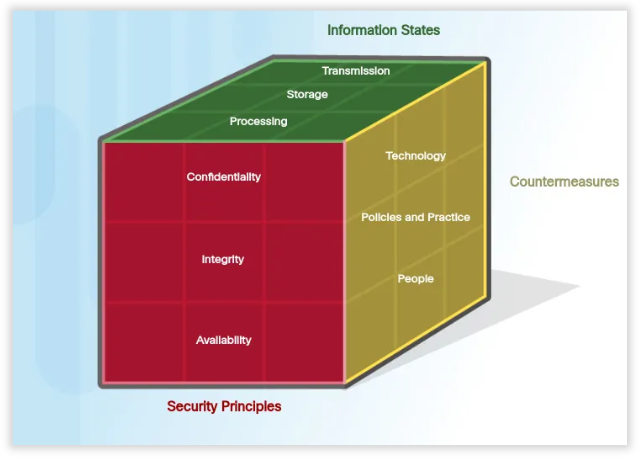

#Samenvatting #Cybersecurity #HoGent #toegepasteinformatica

Lesgever: [Pieter-Jan Maenhaut](pieterjan.maenhaut@hogent.be)
# H0 [Inleiding](./H00%20Inleiding.md)
## Legal
# H1 [data, het virtuele goud](./H01%20Data%20het%20virtuele%20goud.md)
## Tegenhanger
## Jou data
## Industrial data
## Omgaan met data
## Staten van data
## CIA driehoek
## Maatregelen
## De cyber security kubus
## Paswoord
# H2 [een wereld van experten en criminelen](./H02%20Een%20wereld%20van%20experten%20en%20criminelen.md)
## Wetgeving in cybersecurity
## Aanvallers
## Verdedigers
## Security vs privacy
## GDPR
# H3 [bedreigingen, aanvallen en kwetsbaarheden](./H03%20bedreigingen,%20aanvallen%20en%20kwetsbaarheden.md)
## Interne vs externe aanvallen
## Nu meer en eigen toestellen op netwerk
## Bredere reikwijdte en cascade-effect
## Malware en kwaadaardige code
## Misleiding op oplichting
## E-mail en browser aanvallen
## Applicatie-aanvallen
## APT's
# H4 [Confidentiality](./H04%20Confidentiality.md)
## Cryptografie
## Cryptoanalyse
## Data verduisteren
# H5 [Integrity](./H05%20Integrity.md)
## Digitale handtekening
## Hashing algoritmes
## Toepassingen van hashing algoritmes
## Kraken van hashing
## HMAC
# H6 [Availability](H06%20Availability.md)
## Onvoorziene problemen
## Hoge beschikbaarheid
## Backup-ups
# H7 [Certificaten](./H07%20Certificaten.md)
## Waarom nood aan certificaten?
## De oplossing: certificaten
## Toepassing: HTTPS
## Toepassing: VPN
# H8 [Red team](./H08%20Red%20team.md)
## Taak van het red team
## De 5 fasen
## Fase 1: Reconnaissance
## Fase 2: Scanning en enumeration
## Fase 3-5: Gaining access, maintaining access, covering tracks
## Pentests en audit reports
# H9 [Bleu team](./H09%20Bleu%20team.md)
## Een diepe verdediging
## Systemen en apparaten beschermen
## Fysieke bescherming
## Gebruikersbeheer
## Server Hardening
## Network Hardening
## Asset management
## Nood aan experten
# [Labo's](./Labo's.md)

# Examen

Notities van wat er gezegd werd over het examen Cybersecurity

1. Examen Cybersecurity: Examen op pc Geen labo's uitvoeren Theorievragen Inzichtsvragen
2. Van buiten leren ja/nee...
3. CIA RSGMC weten wat die betekenen, niet van buiten leren hoe gpg bestand genereren
4. Labo's => inzicht, wat doen we en waarom doen we het? Niet puur "welke commando's voer je in?"
    - Eerder "Hoe werkt John the Ripper? (eerst rainbow attack, daarna brute-force)
    - Wel screenshots: screenshot van powershell venster bv -> "wat gebeurt hier/wat doen we hier??"
5. Mogelijks voorbeeldexamen? Aankondiging voor de vakantie => waar zijn... etc meer praktische info Stroomvoorziening in Sporthal !
6. Verwacht om met netwerkkabel te werken!
7. ZIEK: Zo snel mogelijk laten weten !!!Aan examenSecretariaat via telefoon (BEL HEN)!!! Volgende week geen les meer

# Samenvatting

## Encryptie

- Hash (MD5,SHA2-256)
	- enkel integrity (is de inhoud niet aangepast?)

- Symmetrisch (2 dezelfde sleutels)
	- Advanced Encryption Standard (**AES**)
	- International Data Encryption Algorithm (**IDEA**)

- Asymmetrisch (2 verschillende sleutels) 
	- **Digitale handtekening + HMAC** (RSA) (geeft intergriteit(klopt de inhoud) en authentiction(van wie)) (Eerst Private key dan public)
		1. Verzender tekent door 
			1. een hash te maken van een document 
			2. algoritme met en *Private key* op de hash uitvoeren
			3. resultaat is een signature of handtekening
		2. Verzender verzend het 
			1. document
			2. public key
			3. handtekening
		3. Ontvanger verifieert door
			1. Het document gaat door hetzelfde hashing algoritme als de verzender
			2. de handtekening wordt ontsleuteld met *public key* 
			3. Het resultaat van de Hashing en de ontsleuteling van de handtekening zou hetzelfde resultaat moeten geven
			4. Nu ben je zeker dat de verzender de verzender is en de data onderweg niet aangepast is
	-  **een digitaal paspoort** (X.509) (Eerst public dan private)
		- HTTPS en VPN
		- CA genereert **certificaten** (== digitale identiteitskaarten) voor gebruikers die dit aanvragen
	    - Gebruikers kunnen **elkaar controleren** via deze certificaten of ze daadwerkelijk met de gewenste persoon communiceren
	    - Een certificaat koppelt een **publieke sleutel** van een gebruiker aan zijn **identiteit**.*
	    
## Availability
- 5x9 principe (uptime)
- De 3-2-1-regel (Backup)
# Red Team
 1. Reconnaissance
 2. Scanning an enumeration
 3. Gaining Acces
 4. Maintaining Acces
 5. Covering Tracks

- Pentests en audit reports

# Bleu Team

- **Layering** (*gelaagdheid*)
- **Limiting** (*beperking*)
- **Diversity** (*diversiteit*)
- **Obscurity** (*verduistering*)
- **Simplicity** (*eenvoud*)

- Fysieke toegang
- Gebruikersbeheer
	- AAA framework (Tripple A Raamwerk)
- Hosts
- Draadloze en mobiele apparaten
- Servers
- Netwerk(apparaten)

- Assets management