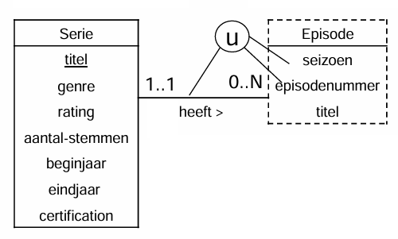
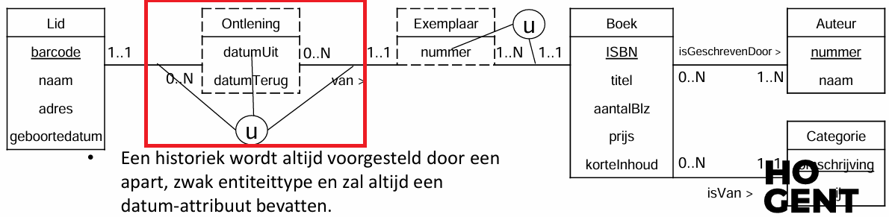
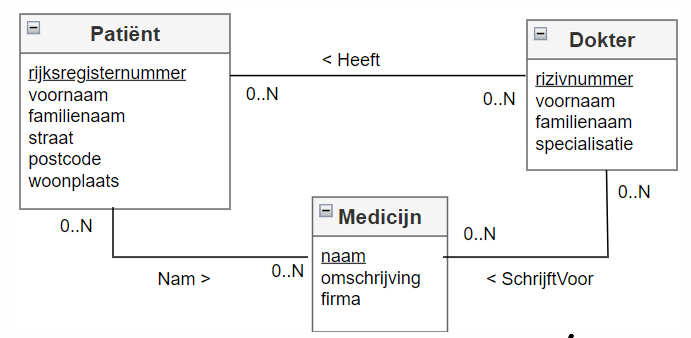
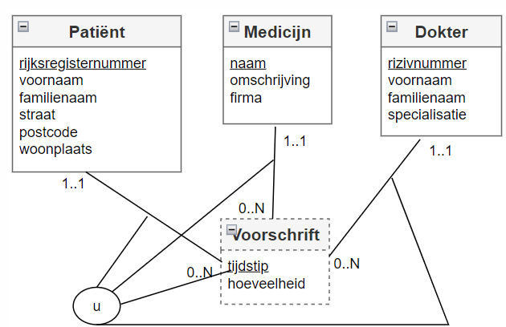

# Zwakke entiteiten

- Is **bestaansafhankelijk** want de *minimumcardinaliteit is 1*
- **Kan niet los op zichzelf bestaan** (je hebt een *andere entiteit (relatie) nodig* om te kunnen identificeren)
- **Aangeduid met een stippellijn**.
- Voor de identificatie wordt een kandidaatsleutelattribuuttype van het zwak entiteittype **gekoppeld aan de relatie**. *Dit attribuuttype wordt niet onderlijnd*.
- Het *is* immers *geen kandidaatsleutel* op zich maar **maakt deel uit van een kandidaatsleutel** (*kandidaatsleutelattribuuttypes*).

**Als je kan identificeren is het GEEN zwak entiteittype**. → *Enkel bestaansafhankelijkheid is niet voldoende* om te spreken van een zwak entiteittype.

# Historiek

De datum waarop een LID een EXEMPLAAR van een BOEK uitleent, verdwijnt uit de databank wanneer het LID dit EXEMPLAAR terug brengt. Dit strookt niet met wat we gewend zijn in de realiteit. 
**Soms is het noodzakelijk een overzicht van bepaalde gegevens uit het verleden te hebben** en te kunnen weergeven –in dit geval de ontleningen van elk EXEMPLAAR van een BOEK sedert dit werd aangekocht

- **Er wordt een bijkomend, zwak entiteittype** *ONTLENING* **toegevoegd**.
- ONTLENING is **zwak** omdat het *bestaansafhankelijk is van LID en van EXEMPLAAR* ÉN omdat het *zelf niet over voldoende attribuuttypes beschikt om zich te identificeren*.
- We noemen het entiteittype *ONTLENING* een **historiek**.
- Is steeds met een **datum**.
# Ternaire relatie

- We willen dit niet!
- Oplossing, gebruik een zwak entiteitstype (nadeel, de relatie is weg)

