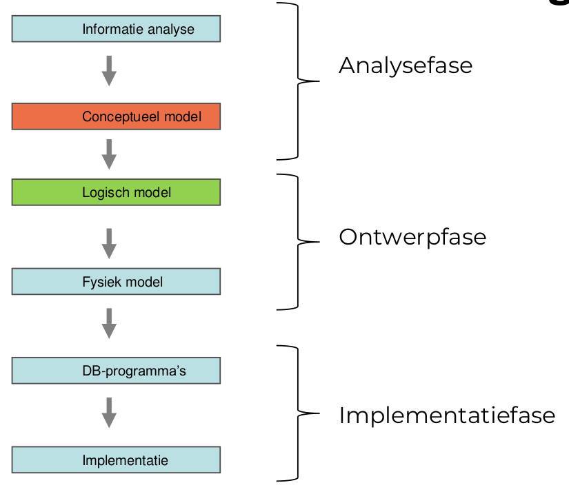
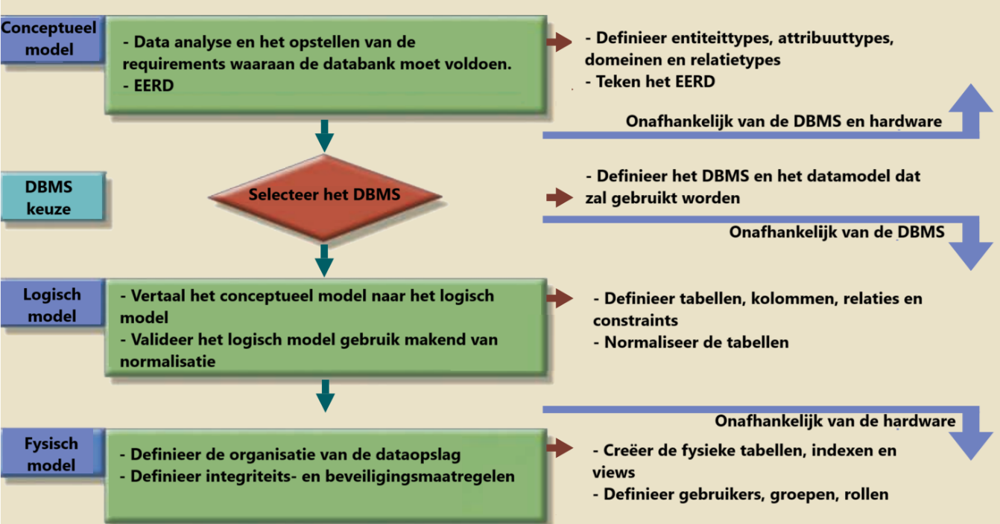
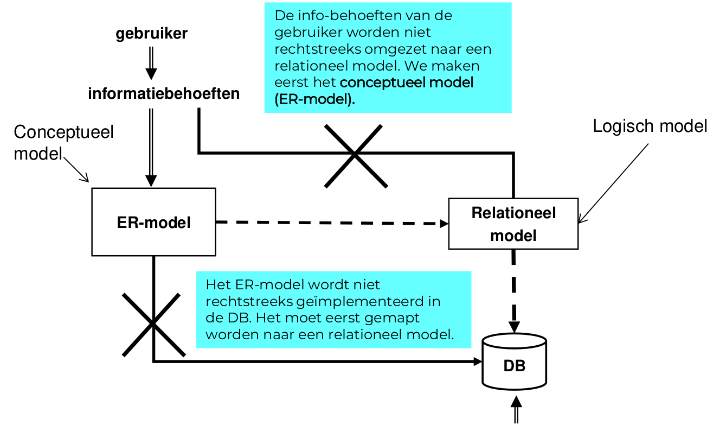
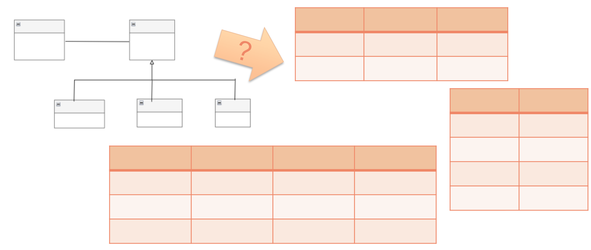
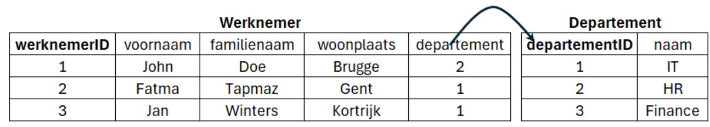
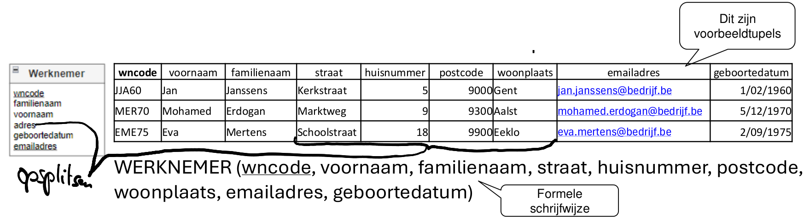

# Fasen in de ontwikkeling van een DB

## Steeds eerst ER-model (conceptueel model) van daar uit altijd een relationeel model

# Van conceptueel model naar logisch model

# Bouwstenen voor het relationeel model

-  *Entiteittypes* **en** *attribuuttypes* **uit het ERD worden omgezet naar relaties (= tabellen) met kolommen**.

- *Terminologie*
	- **Tupel**
	- **Tupelverzamelingen**
	- **Attribuut**
	- **Domein**
	- **Attribuuttype**
	- **Sleutels**
# Terminologie
## Tupel

### Definitie

- **tuppel = een rij in een tabel**
- **Een geordende lijst met waarden van kenmerken die een object beschrijven**.
- Een **tupel is steeds uniek**.

### Voorbeeld

Een **tupel** *voor het beschrijven van een product*: `(100, ‘Pringles’, ‘Classic Paprika’, ‘175g’, 2.5)`

## Attribuut

### Definitie

- **Een benoemd kenmerk van een tupel**.*
- Attribuut **is een kolom in een tabel**
- Een attribuut van een tupel **mag geen meerdere waarden hebben**, de attribuutwaarde **moet éénwaardig en atomair (ondeelbaar) zijn**.

### Voorbeeld

In de tabel **Studenten**:

| **StudentID** | **Naam** | **Leeftijd** | **Studierichting** |
| ------------- | -------- | ------------ | ------------------ |
| 1             | Nikki    | 41           | Informatica        |

De attributen in deze tabel zijn:

1. **StudentID**: Een unieke identificatie van een student (bijvoorbeeld een integer).
2. **Naam**: De naam van de student (tekst).
3. **Leeftijd**: De leeftijd van de student (integer).
4. **Studierichting**: De studie van de student (tekst).

## Domein

### Definitie

- Een beperkte verzameling van mogelijke (toegelaten) waarden die voor de attributen in de tupels van een relatie kunnen worden gebruikt.
- **Toegestane type of bereik van waarden die een attribuut (kolom) kan aannemen**. Het bepaalt de eigenschappen van de data in een database.

### Voorbeeld

- Het domein van een attribuut **Leeftijd** kan zijn: *een geheel getal tussen 0 en 120*.
- Het domein van een attribuut **E-mailadres** kan zijn: *een tekst die voldoet aan het e-mailformaat* (zoals `naam@domein.com`).
## Relatie

### Definitie

 - Een **relatie is een verzameling van tupels die gelijksoortige objecten beschrijven**.
 - Is geen relatietype!
 - **Relaties tussen tabellen in een database worden gedefinieerd via** `sleutels` (primary en foreign keys). 
 - Er zijn **drie hoofdtypen relaties**:
	 - **Een-op-een (1:1)**
		 - Eén record in tabel A komt overeen met precies één record in tabel B.
			 - Voorbeeld: Een persoon en zijn/haar identiteitskaart.
	 - **Een-op-veel (1:N)**
		 - Eén record in tabel A kan overeenkomen met meerdere records in tabel B.
			 - Voorbeeld: Een klant kan meerdere bestellingen hebben.
	 - **Veel-op-veel (N:M)**
		 - Meerdere records in tabel A kunnen overeenkomen met meerdere records in tabel B.
		- Wordt meestal geïmplementeerd met een tussentabel.
			- Voorbeeld: Studenten en vakken die ze volgen.

### Voorbeeld:

Tabel **Studenten**:

|StudentID|Naam|
|---|---|
|1|Nikki|
|2|Sam|

Tabel **Inschrijvingen**:

|InschrijvingID|StudentID|Vak|
|---|---|---|
|1|1|Informatica|
|2|1|Wiskunde|
|3|2|Geschiedenis|

Hier is een **relatie** tussen de tabellen gebaseerd op de `StudentID`, die als **foreign key** fungeert in de tabel **Inschrijvingen**.

# Vergelijking met het ER-model

| **ER-model**       | **Relationeel model** | **Databank**        |
|---------------------|-----------------------|---------------------|
| Entiteittype        | Relatie              | Tabel               |
| Entiteit            | Tupel                | Rij                 |
| Attribuuttype       | Attribuut            | Kolom               |
| Attribuutwaarde     | Attribuutwaarde      | Kolomwaarde         |
Relaties worden omgezet naar primaire sleutels (PK) en vreemde sleutels (FK)
# Regels van het relationeel model

1. Elke **tupel in een relatie is uniek** (elke rij in een tabel is uniek).
2. Elk **attribuut is enkelvoudig** (samengestelde attribuutwaarden zijn niet toegestaan).
3. Elk **attribuut is enkelwaardig** (meerwaardige attribuutwaarden zijn niet toegestaan).
4. **Verbanden tussen relaties worden gelegd aan de hand van vreemde sleutels**.
# Sleutels
## Inleiding

- **Sleutels zorgen ervoor dat elk tupel uniek is**.

- Er zijn **4 soorten** sleutels:
	- **Kandidaatsleutels**
	- **Primaire sleutel**
	- **Alternatieve sleutels**
	- **Vreemde sleutels**

## Kandidaatsleutel

### Definitie

- Is een **minimale verzameling van attributen in de tupel, waarvan de combinatie elk tupel, binnen een tupelverzameling, uniek kan identificeren**.

- 2 varianten
	- **Enkelvoudig**
	- **Samengesteld**

### Voorbeeld

- Enkelvoudig
	- Een student binnen HOGENT is uniek op basis van zijn studentnummer
	- rijksregisternummer
	- studentennummer
	- emailadres

- Samengesteld
	- Combinatie van hotelnaam en kamernummer

## Primaire sleutel

### Definitie

- **Uit de kandidaatsleutels wordt één sleutel gekozen. Dit is de primaire sleutel**.

- De **primaire sleutel moet steeds ingevuld zijn** (NULL is niet toegelaten).

### Voorbeeld

- studentennummer
## Alternatieve sleutel

### Definitie

- **Elke kandidaatsleutel die geen primaire sleutel geworden is**, wordt een alternatieve sleutel genoemd.

- **Indien in een tupel de alternatieve sleutel NULL-waarde heeft dan verliest de alternatieve sleutel zijn functie van ‘kandidaatsleutel’**, want het is niet langer uniek.

### Voorbeeld

- rijksregisternummer + nationaliteit
- emailadres

## Vreemde sleutels = foreign keys

### Definitie

- Een vreemde sleutel (foreign key) is **de verbindende schakel tussen twee tupelverzamelingen**. Met een waarde uit een tupel van de ene verzameling kun je in een andere verzameling de juiste tupel met gerelateerde gegevens opzoeken.

- De **vreemde sleutel in de ene tabel verwijst naar de primaire sleutel uit de andere tabel**.

- Het **doel van een vreemde sleutel is het behouden van de gegevensintegriteit**

### Voorbeeld

- `departement` en `departementId`

# Mapping
## Stappenplan

1. **Elk entiteittype wordt een tupel verzameling of tabel**​ (opgelet bij specialisatie!).​
2. **Enkelvoudige attribuuttypes overnemen**.​
3. **Samengestelde attribuuttypes opsplitsen in enkelvoudige attribuuttypes**.​
4. **Meerwaardige attributen in een aparte, nieuwe verzameling plaatsen.**​
5. **Primaire sleutel bepalen** (opgelet bij zwakke entiteiten!).​
6. **Voor elke relatie (verband) tussen entiteittypen de vreemde sleutel(s) bepalen**.​
	- *Binair verband:*
		- 1 op N verband: vreemde sleutel aan N-zijde
		- 1 op 1 verband: vreemde sleutel aan 1 zijde (zelf te kiezen)
		- Veel op veel: aparte tabel met 2 vreemde sleutels
	- *Unair verband:*
		- 1 op veel: vreemde sleutel in zelfde (naam van rol 1-zijde!)
		- 1 op 1: vreemde sleutel met zichzelf
		- Veel op veel: nieuwe tabel met 2 vreemde sleutels (rolnamen gebruiken!)
7. **Integriteitregels bepalen van elke vreemde sleutel.​**
	- naar welke primaire sleutel verwijst deze vreemde sleutel
	- is de vreemde sleutel verplicht of optioneel?
	- is de vreemde sleutel uniek (bij 1 op 1)

## Mapping van entiteittypes

- Elk entiteittype mappen.
	- *Eenvoudige attribuuttypes*→ **kolom**.
	- Een *samengesteld attribuuttype* → **opsplitsen in enkelvoudige attribuuttypes**.
	- Een van de *kandidaatsleutels kiezen als* **de primaire sleutel.**

### Voorbeeld

- Resultaat:

WERKNEMER (*wncode*, voornaam, familienaam, straat, huisnummer, postcode, woonplaats, emailadres, geboortedatum)
## Mapping van relatietypes

- Nadat de entiteittypes zijn gemapt naar tabellen, kan men verder gaan met  het mappen van de relatietypes.

- De *manier van mappen hangt af van de* **maximumcardinaliteiten**.
	- 1:1 – relatie
	- 1: N – relatie
	- M:N – relatie
### 1 op 1 relatie met min card = 1 aan één zijde

- **Beschrijving**: Eén entiteit is verplicht gekoppeld aan exact één andere entiteit. 

- **Mapping**: Voeg een foreign key van één tabel naar de andere, of combineer beide entiteiten in één tabel. - 

- **Voorbeeld**: 
	- **Tabel A**: Persoon (*PersoonID*, Naam) 
	- **Tabel B**: Identiteitskaart (*IDKaartID*, PersoonID)

### 1 op 1 relatie met min card = 0 aan beide zijden

- **Beschrijving**: Eén entiteit is optioneel gekoppeld aan exact één andere entiteit. 

- **Mapping**: Gebruik een foreign key met een NULL-waarde mogelijk in beide tabellen. 

- **Voorbeeld**: 
	- **Tabel A**: Persoon (*PersoonID*, Naam)
	- **Tabel B**: Auto (*AutoID*, PersoonID)
### 1 op N relatie

- **Beschrijving**: Eén entiteit is gekoppeld aan meerdere entiteiten aan de andere zijde. 

- **Mapping**: Voeg een foreign key toe aan de tabel aan de N-zijde. 

- **Voorbeeld**: 
	- **Tabel A**: Klant (*KlantID*, Naam) 
	- **Tabel B**: Bestelling (*BestellingID*, KlantID)

### 1 op N unaire relatie

- **Beschrijving**: Een entiteit verwijst naar zichzelf in een hiërarchische of gerelateerde structuur. 

- **Mapping**: Voeg een foreign key toe binnen dezelfde tabel. 

- **Voorbeeld**: 
	- **Tabel**: Werknemer (*WerknemerID*, Naam, ManagerID)
### M op N relatie

- **Beschrijving**: Meerdere entiteiten aan beide zijden kunnen met elkaar verbonden zijn. 

- **Mapping**: Maak een tussentabel met foreign keys naar beide betrokken tabellen. 

- **Voorbeeld**: 
	- **Tabel A**: Student (*StudentID*, Naam) 
	- **Tabel B**: Vak (*VakID*, Naam) 
	- **Tussentabel**: Inschrijving (*StudentID*, *VakID*)

## Zwakke entiteiten

- **Beschrijving**: Een zwakke entiteit is een entiteit die niet zelfstandig kan bestaan zonder een sterke (ondersteunende) entiteit. Het heeft geen eigen unieke sleutel en gebruikt de primaire sleutel van de sterke entiteit als (deel van) zijn sleutel. - 

- **Mapping**: 1. Maak een aparte tabel voor de zwakke entiteit. 2. Voeg een foreign key toe die verwijst naar de sterke entiteit. 3. Combineer de foreign key met een onderscheidend attribuut als primaire sleutel. 

- **Voorbeeld**: 
	- **Sterke entiteit**: Project (*ProjectID*, Naam) 
	- **Zwakke entiteit**: Taak (*ProjectID*, *TaakNummer*, Beschrijving) 
		- Primaire sleutel: `(ProjectID, TaakNummer)`
## Mapping meerwaardige attributen

- Het meerwaardig attribuut schrappen en er een nieuw entiteittype van maken. Veel-op-veel tussen beide entiteittypes. Betekenisloze sleutel toevoegen in nieuw entiteittype. Attribuut naam of omschrijving toevoegen.

- Mappingregels van veel-op-veel toepassen.

- **Beschrijving**: Een meerwaardig attribuut is een attribuut dat meerdere waarden kan aannemen voor één entiteit. Bijvoorbeeld telefoonnummers van een persoon. 

- **Mapping**: 
	1. **Meerwaardig attribuut schrappen**: Maak een nieuwe tabel die het meerwaardige attribuut voorstelt. 
	2. **Nieuw entiteittype maken**: De nieuwe tabel bevat een foreign key naar de oorspronkelijke entiteit en een nieuwe sleutel (indien nodig) om de waarden uniek te identificeren. 
	3. **Mappingregels voor veel-op-veel toepassen**: - Gebruik een tussentabel om de relatie te modelleren. 
	4. Voeg een beschrijvend attribuut toe, zoals een naam of omschrijving. 
	
- **Voorbeeld**: 
	- **Entiteit**: Persoon (PersoonID, Naam) 
	- **Meerwaardig attribuut**: Telefoonnummer 
	- **Nieuwe tabel**: 
		- **Tabel**: Telefoonnummer (*TelefoonID*, PersoonID, Nummer, Type) 
			- `TelefoonID`: Betekenisloze sleutel 
			- `PersoonID`: Foreign key naar Persoon 
			- `Nummer`: Het telefoonnummer 
			- `Type`: Bijvoorbeeld mobiel, werk, thuis 
	
	- Relatie: - **Persoon** (1) ↔ **Telefoonnummer** (N)
## Mapping Specialisatie: {Mandatory, And}

- Mandatory, And: **1 tabel met alle attributen van supertype en subtypes + booleans om subtypes te onderscheiden**.
- Mandatory: **tenminste 1 van de booleans moet Ja** zijn
-  And: **kan bekomen worden door beide booleans op Ja te zetten**

### Voorbeeld

  - **Supertype**: Voertuig (VoertuigID, Merk, IsAuto, IsVrachtwagen)
  - **Subtypes**:
    - Auto: Heeft attributen zoals AantalDeuren.
    - Vrachtwagen: Heeft attributen zoals Laadvermogen.
  - **Tabel**:
    - Voertuig (VoertuigID, Merk, IsAuto, IsVrachtwagen, AantalDeuren, Laadvermogen)
#### Uitleg:
- **Mandatory**: Ten minste één van de booleans `IsAuto` of `IsVrachtwagen` moet `Ja` zijn.
- **And**: Beide booleans kunnen `Ja` zijn als het voertuig zowel een auto als een vrachtwagen is (bijvoorbeeld een pick-up).

## Mapping Specialisatie: {Optional, And}

- Optional, And: **2 tabellen: 1 voor supertype en 1 voor alle subtypes**
- booleans **om subtypes te onderscheiden**. Vanuit de subtabel verwijzen naar de supertabel.
- And: **Kan bekomen worden door beide booleans op Ja te zetten**.

### Voorbeeld

  - **Supertype**: Voertuig (VoertuigID, Merk)
  - **Subtypes**:
    - Auto: (AutoID, VoertuigID, AantalDeuren, IsAuto)
    - Vrachtwagen: (VrachtwagenID, VoertuigID, Laadvermogen, IsVrachtwagen)

#### Uitleg:
- **Optional**: Een voertuig kan een auto, een vrachtwagen, of geen van beide zijn.
- **And**: Een voertuig kan zowel in de `Auto`- als de `Vrachtwagen`-tabel staan.

## Mapping Specialisatie: {Mandatory, Or}

• Mandatory, Or: **geen tabel voor supertype, wel een aparte tabel voor elk subtype.**
• Mandatory: **je kan geen andere creeëren in dit model**.
• Or: **voor beide soorten is een aparte tabel.**

### Voorbeeld

  - **Subtypes**:
    - Auto (AutoID, Merk, AantalDeuren)
    - Vrachtwagen (VrachtwagenID, Merk, Laadvermogen)
#### Uitleg:
- **Mandatory**: Elk voertuig moet óf een auto óf een vrachtwagen zijn.
- **Or**: Een voertuig kan niet in beide tabellen staan.

## Mapping Specialisatie: {Optional, Or}

• Optional, Or:** tabel voor elk type: zowel voor supertype als elk subtype**.
• De **subtypes verwijzen naar het supertype**.
• Optional: **Er kunnen andere  gecreëerd worden in de tabel.**
• Or: **aparte tabellen voor elk subtype.**

### Voorbeeld

- **Beschrijving**: Een tabel voor het supertype en een aparte tabel voor elk subtype. De subtabels verwijzen naar het supertype via een foreign key.
- **Voorbeeld**:
  - **Supertype**: Voertuig (VoertuigID, Merk)
  - **Subtypes**:
    - Auto (AutoID, VoertuigID, AantalDeuren)
    - Vrachtwagen (VrachtwagenID, VoertuigID, Laadvermogen)

#### Uitleg:
- **Optional**: Een voertuig kan alleen in de supertype-tabel staan zonder gekoppeld subtype.
- **Or**: Een voertuig kan slechts in één van de subtabels voorkomen.
# Structuurbeperkingen

-  Relationeel model bevat enkel 0 of 1 op veel verbanden:
	- Veel op veel verbanden: opsplitsen in twee 1 op veel verbanden
	- 1 op 1 verband: beperkingsregels toepassen: ‘uniek’
 
 - Minimum cardinaliteit 1:
	 - bij max. cardinaliteit 1: beperkingsregel: mag niet null zijn
	 - bij max. cardinaliteit veel: kan niet afgedwongen worden

