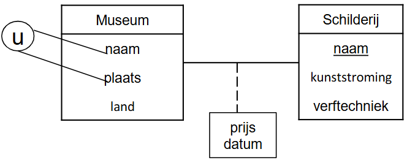
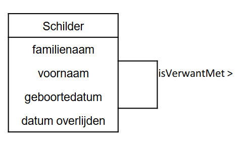
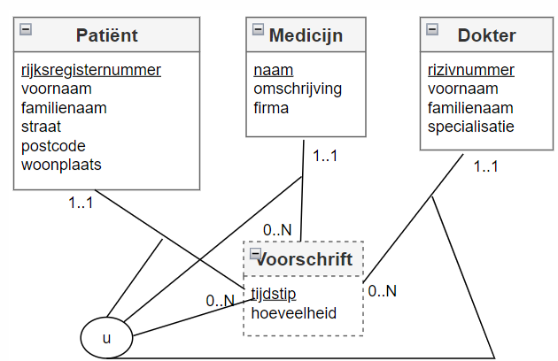
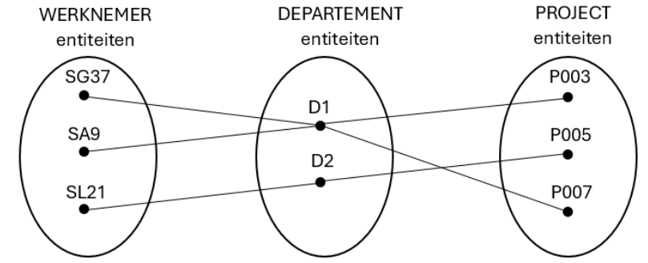
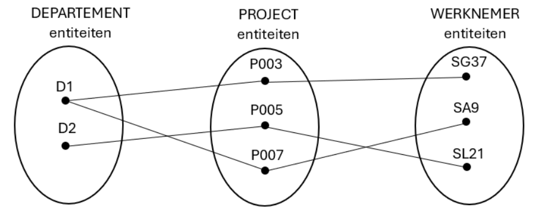
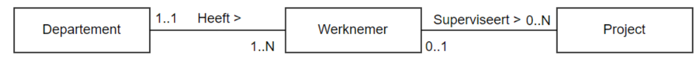
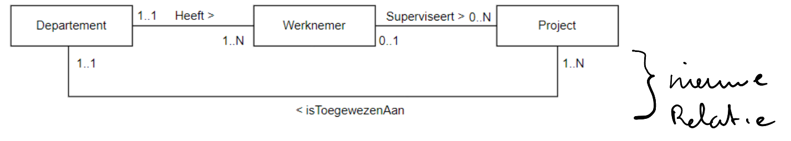
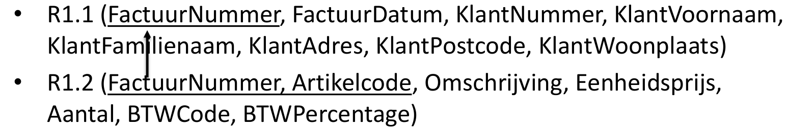
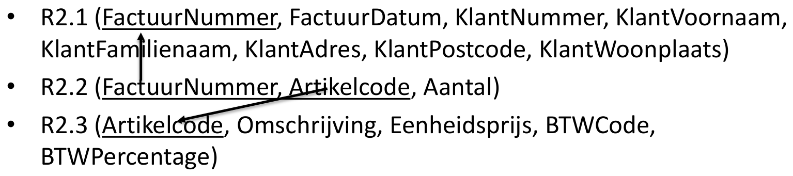
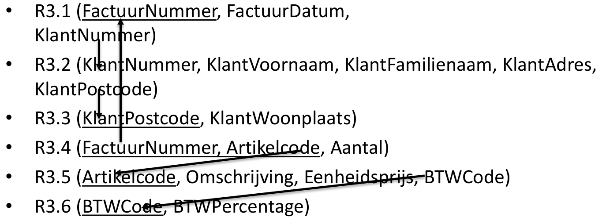

# H01 [Databanken inleiding](./H01%20Inleiding.md)

## Basisdefinities databank
Een **gedeelde verzameling van logisch met elkaar verbonden gegevens en hun beschrijving**, ontworpen om aan de *informatienoden* van een organisatie te voldoen. (T. Connolly).
- *digitaal opgeslagen*
- *specifiek bedrijfsproces*
- *specifieke groep* (gebruikers en applicaties)

## DBMS

**Databanksysteem**: 
	- *databank* (data)
	- *DBMS* (om met de data te werken) (RDBMS = **DBMS voor relationele databanken**)
		- een verzameling computerprogramma’s (softwaremodules)
		- *Nodig om* een databank te
			- *definiëren*
			- *creëren*
			- *wijzigen*
			- *beheren*
		- **back-up en recovery**
		- **beheerstools om de prestaties** van de data-bank **te monitoren en te optimaliseren**.
		- *gebruiken* (gegevens invoeren en ‘lezen’)

### Voorbeelden: (4)

| Merknaam                 | Omschrijving                                                                                                                   |     |
| ------------------------ | ------------------------------------------------------------------------------------------------------------------------------ | --- |
| **Oracle Database**      | Het grootste en eerste commerciële RDBMS. Wordt gebruikt in veel van 's werelds grootste bedrijven.                            |     |
| **Microsoft SQL server** | RDBMS-product van Microsoft. Leverbaar in vele versies voor verschillende bedrijfsbehoeften.                                   |     |
| **MySQL**                | Het populairste **open source** RDBMS. Sinds 2010 wordt het ontwikkeld, gedistribueerd en ondersteund door Oracle Corporation. |     |
| **PostgreSQL**           | Ook een gratis, open source RDBMS. Sommigen zouden zeggen krachtiger dan MySQL                                                 |     |
## Basisdefinities: Databank gebruikers (5)

1. **De data-administrators** (DA) zijn in een onderneming centraal verantwoordelijk zijn voor de data (waakt op de data zelf)
2. **database ontwerper** vertaalt conceptueel model naar logisch en intern model
3. **database administrator** (DBA) databankbeheerder, implementeert en monitort DB (waakt op de werking)
4. **Applicatie ontwikkelaar** schrijft databankprogramma’s/databankapplicaties
5. **Eindgebruikers** gebruikt databankapplicaties en voert op die manier databankacties uit
	- Sommige eindgebruikers zijn zich niet bewust van de databank
	- Sommige geavanceerde eindgebruikers kennen de structuur van de databank

## Delen van een databanksysteem (5)

### Datamodel (gegevensmodel)

- **Databankmodel**: *bestaat uit verschillende datamodellen*
- **Datamodel**: *weergave van de gegevens met hun kenmerken en hun relaties*
- In de cursus komen er **3 datamodellen** aan bod:
	1. **Conceptueel datamodel** (**(E)ERD diagram**)
		- perfecte weergave van de gegevensvereisten van de ‘business’ requirements.
		- algemene beschrijving gegevenselementen, kenmerken en relaties
			- *Gebruikt door ‘IT’ en ‘business’*
			- <ins>Weergave hoe ‘de business’ de gegevens ziet</ins>
			- Voorstelling: (E)ERD diagram (Entety Relation Diagram)
	2. **Logisch datamodel** **(relationeel model + Normalisatie)** 
		- *vertaling conceptueel gegevensmodel naar het type databankmodel*
			- Relationeel, hiërarchisch, OO, XML, NoSQL
		- nog altijd verstaanbaar voor niet IT-ers, maar *leunt al dichter aan bij hoe de data fysiek zal opgeslagen worden*
	3.  **Fysiek datamodel**  **(Database script)**
		- *Geeft informatie over fysieke opslag*:
			- *waar* worden welke gegevens opgeslagen
			- *Wat is de grootte van de datavelden* (aantal characters, type variabele)
			- *Indexen* die het ophalen versnellen
		- Zeer *DBMS afhankelijk*
		- (Mensen van de business komen hier niet mee in contact)

### Cataloog
- Schatkist *van DBMS*
- *Definities en beschrijving van de elementen in de DB* (**= metadata**)
- *Definities logisch gegevensmodel* en *intern gegevensmodel*
- Zorgt voor *synchronisatie en consistentie van de gegevensmodellen*
- *Opslagplaats voor integriteitsregels*, en andere informatie zoals gebruikers, ...

### Databankmodel
- **Databankmodel** = *databankschema*
	- **bevat**
		- *beschrijving van de databankstructuur*
		- *specificaties v/d elementen*, hun eigenschappen, relaties, beperkingen, ...
	- **Opgesteld tijdens databankontwerp** – Wijzigt niet om de haverklap (door de database ontwerper)
	- **Opgeslagen in de cataloog** (is metadata)
	- **Toestand van een databank**
		- *Op dat ogenblik aanwezige data*
		- *Wijzigt voortduren*

### Instances
- **Instances** = instanties (wat er in zit)

### drielagen architectuur

1. **Externe laag** → externe datamodel, *bevat views*
	- Deelverzameling van het logisch model
	- Voor een specifieke doelgroep.
	- Wordt gebruikt om de toegang tot gegevens te controleren en beveiliging af te dwingen
2. **Middelste laag** → *conceptuele / logische laag*
3. **Interne laag** → interne datamodel, legt vast *hoe data fysisch georganiseerd en opgeslagen wordt*

## Belangrijke begrippen  (4)

### Gegevensonafhankelijkheid:

-  = *wijzigingen aan de gegevensbeschrijving hebben weinig tot geen impact op de applicaties*
- **Fysieke gegevensonafhankelijkheid**: *wijzigingen van de opslagspecificaties hebben* **geen invloed op het logisch model** *noch op de applicatie* → wordt opgevangen door het DBMS
- **Logische gegevensonafhankelijkheid**: *minimale aanpassingen aan de applicaties bij wijzigingen aan het logisch model*
### gestructureerde en ongestructureerde gegevens

- **Gestructureerde gegevens**
	- *Kunnen in een logisch datamodel voorgesteld worden*
	- *Integriteitsregels kunnen opgesteld en afgedwongen worden*
	- *Vereenvoudigen, opzoeken, verwerken en analyseren*
	- Voorbeelden: naam, geboortejaar, geboorteplaats van een kunstenaar
	
* **Ongestructureerde gegevens**
	* *kunnen niet op een zinvolle manier worden geïnterpreteerd door een applicatie*
	* Voorbeelden: gesprekken op social media, e-mails
	* *Let op*: er bestaat veel meer ongestructureerde data dan gestructureerde data

* **Semi-gestructureerde gegevens** 
	* *De structuur van de gegevens is zeer onregelmatig of zeer wisselend*.
	* Voorbeelden: webpagina's van individuele gebruikers op een social media platform, cv-documenten in een personeelsdatabank

### Redundantegegevens

* Databank = centrale en unieke opslag gegevens
* Soms worden *databanken gedupliceerd uit veiligheidsoverwegingen of omwille van performantie*
	* →**redundantie**
* **DBMS** *is verantwoordelijk voor de synchronisatie* en garandeert de juistheid van de gegevens

### Integriteitsregels

* Integriteitsregelsworden *gedefinieerd op basis van het conceptueel model en opgeslagen in de catalog*
	* Worden *afgedwongen door het DBMS*
* *Vastleggen hoe gegevens worden opgeslagen* (**syntactische regel**)
	* Bvb: customerIDis een geheel getal (100, 200, niet 2.A)
* *Vastleggen wanneer gegevens correct zijn* (**semantische regel**)
	* Bvb: Eenheidsprijs > 0; geboortedatum niet > vandaag
* Integriteitsregels worden gespecificeerd als *onderdeel van het conceptuele/logische datamodel*+ *centraal opgeslagen in de cataloog*

# H2 + H3 + H4 Conceptueel model: (E)ERD
## H2 [Conceptueel model: ERD](./H02%20Conceptueel%20model.md) + H03 [Zwakke entiteiten](./H03%20Zwakke%20entiteiten.md) + H04 [EERD](./H04%20Enhanced%20Entity%20Relationship%20Diagram.md)

## Fases in Databank Ontwerp (4)

Het *ontwerpen van een databank* vertrekt vanuit de bedrijfsprocessenen bestaat uit *4 fases*:
* **Fase1**
	* = *Verzamelenenanalyserenvan de functionele/ inhoudelijke vereisten* 
	* (databasemodel & DBMS onafhankelijk)
	* via
		* domeinanalyse
		* functionele analyse
		* behoeft analyse
* **Fase2**
	* = *Conceptueelontwerp* -> **Conceptueel datamodel** 
	* (databasemodel & DBMS onafhankelijk)
	* Het conceptueel model
		* **EERD**
* **Fase3** 
	* = *Logischontwerp* -> **Logisch datamodel** 
	* (DBMS onafhankelijk)
	* **relationeel model **
		- + Normalisatie
	* *Type databank is bekend*(relationele databank, NoSQL databank, hiërarchische databank, ...)
	* Het *product zelf ligt nog niet vast*
		- voor relationeledatabank: Microsoft SQL Server of MySQL of Oracle of DB2 of ...
		- voor NoSQL document databank: MongoDB of CouchDB of ...
		- voor hiërarschische databank: IMS of ...
* **Fase4** 
	* = *Fysiekontwerp* -> **Intern datamodel** 
	* (DBMS specifiek)
	* Is de feitelijke *implementatie van het logisch model*.
	* Je *kiest eerst een product*, ook *DBMS* genoemd (MySQL, Microsoft SQL Server, Oracle, ...).
	* Maakt dbms **script**
		* Je *implementeert het logisch model en zet dit om in datadefinitiecode(= DDL)*, die kan worden verwerkt door het DBMS.
		* *Technische details worden toegevoegd* (datatypes van de attribuuttypes, ...)
		* Indien mogelijk worden ook de *functionele beschrijvingen ‘vertaald’ naar databaseconcepten*. Zo kunnen de bedrijfsregels rond correct geboortejaar en jaar van overlijden omgezet worden naar een integriteitsrestrictie.

## ERD

### Entiteit type

- Een *entiteit is een instantie van een entiteittype*.
- Een entiteit types heeft attribuut types (Bv: schilder heeft naam, geboortejaar, ..) 
- In het conceptueel model *nemen we entiteittypes op* (geen individuele entiteiten).
- Een *entiteittype–bestaat in de reële wereld*. –kan zowel *abstract* (een tentoonstelling, firma, cursus, job, ...) als *fysiek* (schilderij, persoon, auto, huis, ...) zijn.
	- is *ondubbelzinnig gedefinieerd* voor een bepaalde groep gebruikers.
	- *karakteriseert een collectie van entiteiten* 
	- *heeft een naam en inhoud en is identificeerbaar*.

### Attribuut type
##### Enkelvoudige versus samengestelde attribuuttypes

**Samengesteld attribuuttype**: 
- *het attribuuttype kan nog opgesplitst worden in enkelvoudige attribuuttypes*. 
- Bijvoorbeeld het attribuuttype ‘adres’ kan samengesteld zijn uit een ‘straat’, een ‘nummer’, een ‘postcode’ en een 'woonplaats'.
- *Wij werken in het conceptueel model steeds op het niveau van enkelvoudige attribuuttypes*

##### Enkelwaardige versus meerwaardige attribuuttypes

**Enkelwaardig attribuuttype**: 
- *het attribuuttype heeft één waarde*. 
- Bijvoorbeeld 
	- het attribuuttype ‘museum’ van ‘SCHILDERIJ’ 
	- de attribuuttypes ‘geboortejaar’ en ‘jaar overlijden’ van ‘SCHILDER’. •

**Meerwaardigattribuuttype**: 
- *het attribuuttype kan (meerdere) waarden bevatten*. 
- Bijvoorbeeld 
	- een ‘SCHILDER' kan meerdere talen spreken of meerdere hobbyshebben. 
	- In dat geval zijn ‘talen’ en ‘hobby's’ meerwaardigeattribuuttypes.•
	
- In een ERD mogen beide voorkomen (zie later). *Binnen Databases vermijden we meerwaardigeattributen in het ERD*

#### Kandidaat sleutel attributen

- De *attributen die deel uitmaken van een kandidaat sleutel noemt men de kandidaat sleutelattributen*.
- *Er kunnen meerdere kandidaat sleutels zijn. Later wordt uit de kandidaat sleutels één sleutel gekozen als primaire sleutel*.
- kandidaat sleutel van het entiteittype*
	- *Één attribuut of meerdere attributen
	- samen die de entiteiten van een entiteittype op een* **unieke, irreducibele manier identificeren**
		- Irreducibiliteit wil zeggen dat er geen uniciteit mag gelden als men één of meerdere attributen weg laat.

- Alle *enkelvoudige kandidaat sleutels* (bestaat uit 1 attribuuttype) worden **onderlijnd**. 
- Indien een kandidaatsleutel *uit meerdere attribuuttypes bestaat* (samengestelde kandidaat sleutel)
	- duiden we dit dan aan met de **’u’-constraint**.

### Relatie type

- **Unairerelatie** →*1 entiteittype*
	- Relatie met zichzelf
	- *één entiteitstype neemt meer dan één keer deel aan de relatie*
	- => de *rolnaam is essentieel voor het onderscheiden van de betekenis die elke deelnemende entiteit speelt*
- **Binaire relatie** →*2 entiteittypes*
	- Relatie met een ander
	- de *naam van elk deelnemend entiteitstype kan worden gebruikt als rolnaam*

Voorbeeld van een unaire of recursieve relatie:

Voorbeeld van een binaire relatie:

#### Cardinaliteiten

- *Cardinaliteit betekent aantal* en wordt uitgedrukt als een *getal*.
- cardinaliteit **=** *het aantal entiteiten dat kan deelnemen aan de relatie*.
- *Elk relatietype heeft een minimum-en een maximumcardinaliteit*

- *WIJ MODELLEREN ENKEL WAT WE WETEN*. **We veronderstellen niet!**
	- *!! Verkeerd gekozen cardinaliteiten kunnen ook voor minder kwalitatieve applicaties zorgen*

**Maximum cardinaliteit** = het *maximum aantal entiteiten van het entiteittype dat op een gegeven tijdstip kandeelnemen aan een relatie van het relatietype*. Mogelijke waarden zijn **1 of N**.
- **1**: *één entiteit kan in relatie staan met maximum 1 (andere) entiteit via dit relatietype*
- **N**: *één entiteit kan in relatie staan met N (andere) entiteiten via dit relatietype. N is een willekeurig geheel getal groter dan 1*.

**Minimum cardinaliteit** = het *minimum aantal entiteiten van het entiteittype dat op elk tijdstip moet voorkomen in een relatie van het relatietype*. Mogelijke waarden zijn **0** of **1**.
- **0**: *sommige entiteiten nemen niet deel aan de relatie. De relatie is optioneel voor dat entiteittype.*
- **1**: *een entiteit moet altijd in relatie staan met minimum één andere entiteit*.

### Zwakke entiteiten

- Is **bestaansafhankelijk** want de *minimumcardinaliteit is 1*
- **Kan niet los op zichzelf bestaan** (je hebt een *andere entiteit (relatie) nodig* om te kunnen identificeren)
- **Aangeduid met een stippellijn**.
- Voor de identificatie wordt een kandidaatsleutelattribuuttype van het zwak entiteittype **gekoppeld aan de relatie**. *Dit attribuuttype wordt niet onderlijnd*.
- Het *is* immers *geen kandidaatsleutel* op zich maar **maakt deel uit van een kandidaatsleutel** (*kandidaatsleutelattribuuttypes*).

**Als je kan identificeren is het GEEN zwak entiteittype**. → *Enkel bestaansafhankelijkheid is niet voldoende* om te spreken van een zwak entiteittype.

### Historiek

De datum waarop een LID een EXEMPLAAR van een BOEK uitleent, verdwijnt uit de databank wanneer het LID dit EXEMPLAAR terug brengt. Dit strookt niet met wat we gewend zijn in de realiteit. 
**Soms is het noodzakelijk een overzicht van bepaalde gegevens uit het verleden te hebben** en te kunnen weergeven –in dit geval de ontleningen van elk EXEMPLAAR van een BOEK sedert dit werd aangekocht

- **Er wordt een bijkomend, zwak entiteittype** *ONTLENING* **toegevoegd**.
- ONTLENING is **zwak** omdat het *bestaansafhankelijk is van LID en van EXEMPLAAR* ÉN omdat het *zelf niet over voldoende attribuuttypes beschikt om zich te identificeren*.
- We noemen het entiteittype *ONTLENING* een **historiek**.
- Is steeds met een **datum**.
### Ternaire relatie

- We willen dit niet!
- Oplossing, gebruik een zwak entiteitstype (nadeel, de relatie is weg)

## EERD: Enhanced Entity Relationship Diagram

- Het Enhanced Entity Relationship Diagram of EERD is een **uitbreiding van het ERD**.
	- **alle concepten uit het ERD blijven behouden**, namelijk entiteittype, attribuuttype en relatietype.
	- een *nieuw modelleringsconcept wordt toegevoegd*:
		- **specialisatie**
		- **generalisatie**

### Specialisatie

- Om een *subcollectie van entiteiten te karakteriseren*, worden aparte entiteittypes aangemaakt: 
	- **sub(entiteit)types**.
- Het *oorspronkelijke entiteittype is het* 
	- **superentiteittype** 
- Een **subentiteittype** *erft alle attribuuttypes en relatietypes van zijn* **superentiteittype**.
- Een **subentiteittype** *kan*:
	- *zelf specifieke attribuuttypes hebben. Deze gelden* **niet voor het superentiteittype**.
	- *aanleiding geven tot extra relatietypes met (andere)( sub) entiteittypes*. *Deze gelden* **niet voor het supereniteittype**.
- Een **subentiteittype** *heeft* **GEEN** *kandidaatsleutelattribuuttype*!
- **Specialisatie = het creëren van specifiekere subentiteittypes voor een gegeven entiteittype**. Een *specialisatie definieert* **een IS-EEN relatie**.
- Komt overeen met een *top-down proces van conceptuele verfijning*.

#### Participatie constraint

- Specialisatie wordt gekenmerkt door een disjoint constraint en een participatie constraint.
- De participatierestrictie bepaalt of op elk tijdstip elke entiteit van het supertype ook entiteit moet zijn van ten minste één subtype of niet.

- **Totale participatie**:
	- *Elke entiteit van het supertype* **moet** *op elk tijdstip ook entiteit zijn van ten minste één subtype*. *Er bestaan geen entiteiten van het supertype die niet tot een subtype behoren*. => **Mandatory**

- **Partiële participatie**:
	- Er **kunnen** *entiteiten van het supertype zijn die niet tot één van de opgesomde subtypes behoren*. => **Optional**

#### Disjoint constraint

- Specialisatie wordt gekenmerkt door een disjoint constraint en een participatie constraint.
- De Disjoint constraint specificeert tot welke subentiteittypes een entiteit van het superentiteittype kan behoren.. 
- Overlappende subtypes
	- Een entiteit *kan tot meer dan één subtype behoren*. -> **AND** 
- Disjuncte subtypes
	- Een exclusieve OR tussen de subtypes: een entititeit *kan maar tot 1 subtype behoren*. -> **OR**

### Generalisatie

- Het *creëren van* **een algemeen supertype** *dat de gemeenschappelijke attribuuttypes en relatietypes van een aantal gegeven entiteittypes verenigt*. Dit is het omgekeerde proces van specialisatie.
- Komt overeen met een *bottom-up proces van conceptuele synthese*.

Bijvoorbeeld: 
- meerdere types muziekinstrumenten: PIANO, VIOOL en GITAAR.
- Met de generalisatiebenadering → superentiteittype STRIJKINSTRUMENT met de gemeenschappelijke kenmerken van de meerdere subtypen

### Beperkingen van het ERD

Beperkingen steeds documenteren
#### 1. Tijdelijke beperkingen 

 - (**Dit zijn beperkingen die gelden in een bepaald tijdsinterval**) kunnen niet worden gemodelleerd.

- Bijvoorbeeld
	- een project moet binnen een maand toegewezen worden aan een specifiek departement 
	- een werknemer kan niet terugkeren naar een departement waarvan hij vroeger ooit de manager was
	
- Oplossing
	-  Deze beperkingen **moeten worden gedocumenteerd** en kunnen later worden

#### 2. Het ERD kan geen consistentie garanderen tussen verschillende relatietypes

- Bijvoorbeeld
	- een werknemer moet werken in het departement waarvan hij de manager is
	- een werknemer kan enkel werken aan projecten die toegewezen zijn aan het departement waar hij werkt

- Oplossing
	- Deze beperkingen **moeten worden gedocumenteerd** en kunnen later worden geïmplementeerd (bijvoorbeeld door databanktriggers - zie Databanken 2)

#### 3. In het ERD is het domein waartoe attributen behoren, niet bekend.

- **Men kan niet de mogelijke verzameling van waarden voor een attribuut vastleggen.**

- Bijvoorbeeld
	- het aantal uren dat aan een project gewerkt wordt, moet groter of gelijk zijn dan 0 

-  Oplossing
	- Deze beperkingen **moeten worden gedocumenteerd** en kunnen later worden geïmplementeerd (bijvoorbeeld door databankconstraints - zie Databanken 2)

#### 4. In het ERD is het niet mogelijk de definitie van functies op te nemen.

- **We steken geen berekeningen in het ERD**

- Bijvoorbeeld
	- de manier waarop het salaris van een werknemer wordt berekend in functie van zijn startdatum

#### 5. Fan trap

- Een fan trap = **treedt op wanneer één entiteittype, een 1..N relatie heeft met twee andere entiteittypes, waardoor er een schijnbare associatie bestaat tussen de twee andere entiteittypes, die echter niet uitgedrukt wordt door het model**.

##### Voorbeeld

###### Probleem:
- Welke WERKNEMERs werken aan welk PROJECT?
	

- Enkele entiteiten

- Aan welk PROJECT werkt WERKNEMER SG37?

###### Oplossing:
- Juiste associaties tussen de entiteiten leggen

- Hier door volgorde te veranderen

- Aan welk PROJECT werkt WERKNEMER SG37?

#### 6. Chasm Trap

- Een chasm trap = **wanneer een model het bestaan van een relatie tussen entiteitstypes suggereert, terwijl er geen relatie bestaat tussen bepaalde entiteittypes.**

- **Bijvoorbeeld:** *als een of meer relaties met een minimum-cardinaliteit 0 deel uitmaken van relatie*.

##### Voorbeeld

###### Probleem:
- Aan welk DEPARTEMENT werden welke PROJECTen toegewezen?

- Aan welk DEPARTEMENT werd het PROJECT P007 toegewezen?

###### Oplossing:

- **Een extra relatie toevoegen**

- Aan welk DEPARTEMENT werd het PROJECT P007 toegewezen?

# Logisch ontwerp: H05 [Relationeel model](./H05%20Relationeel%20model.md) + H06 [Normalisatie](./H06%20Normalisatie.md)

## Bouwstenen voor het relationeel model

-  *Entiteittypes* **en** *attribuuttypes* **uit het ERD worden omgezet naar relaties (= tabellen) met kolommen**.

### Tupel

#### Definitie

- **tuppel = een rij in een tabel**
- **Een geordende lijst met waarden van kenmerken die een object beschrijven**.
- Een **tupel is steeds uniek**.

#### Voorbeeld

Een **tupel** *voor het beschrijven van een product*: `(100, ‘Pringles’, ‘Classic Paprika’, ‘175g’, 2.5)`

### Attribuut

#### Definitie

- **Een benoemd kenmerk van een tupel**.*
- Attribuut **is een kolom in een tabel**
- Een attribuut van een tupel **mag geen meerdere waarden hebben**, de attribuutwaarde **moet éénwaardig en atomair (ondeelbaar) zijn**.

#### Voorbeeld

In de tabel **Studenten**:

| **StudentID** | **Naam** | **Leeftijd** | **Studierichting** |
| ------------- | -------- | ------------ | ------------------ |
| 1             | Nikki    | 41           | Informatica        |

De attributen in deze tabel zijn:

1. **StudentID**: Een unieke identificatie van een student (bijvoorbeeld een integer).
2. **Naam**: De naam van de student (tekst).
3. **Leeftijd**: De leeftijd van de student (integer).
4. **Studierichting**: De studie van de student (tekst).

### Domein

#### Definitie

- Een beperkte verzameling van mogelijke (toegelaten) waarden die voor de attributen in de tupels van een relatie kunnen worden gebruikt.
- **Toegestane type of bereik van waarden die een attribuut (kolom) kan aannemen**. Het bepaalt de eigenschappen van de data in een database.

#### Voorbeeld

- Het domein van een attribuut **Leeftijd** kan zijn: *een geheel getal tussen 0 en 120*.
- Het domein van een attribuut **E-mailadres** kan zijn: *een tekst die voldoet aan het e-mailformaat* (zoals `naam@domein.com`).
### Relatie

#### Definitie

 - Een **relatie is een verzameling van tupels die gelijksoortige objecten beschrijven**.
 - Is geen relatietype!
 - **Relaties tussen tabellen in een database worden gedefinieerd via** `sleutels` (primary en foreign keys). 
 - Er zijn **drie hoofdtypen relaties**:
	 - **Een-op-een (1:1)**
		 - Eén record in tabel A komt overeen met precies één record in tabel B.
			 - Voorbeeld: Een persoon en zijn/haar identiteitskaart.
	 - **Een-op-veel (1:N)**
		 - Eén record in tabel A kan overeenkomen met meerdere records in tabel B.
			 - Voorbeeld: Een klant kan meerdere bestellingen hebben.
	 - **Veel-op-veel (N:M)**
		 - Meerdere records in tabel A kunnen overeenkomen met meerdere records in tabel B.
		- Wordt meestal geïmplementeerd met een tussentabel.
			- Voorbeeld: Studenten en vakken die ze volgen.

#### Voorbeeld:

Tabel **Studenten**:

|StudentID|Naam|
|---|---|
|1|Nikki|
|2|Sam|

Tabel **Inschrijvingen**:

|InschrijvingID|StudentID|Vak|
|---|---|---|
|1|1|Informatica|
|2|1|Wiskunde|
|3|2|Geschiedenis|

Hier is een **relatie** tussen de tabellen gebaseerd op de `StudentID`, die als **foreign key** fungeert in de tabel **Inschrijvingen**.

### Sleutels
#### Inleiding

- **Sleutels zorgen ervoor dat elk tupel uniek is**.

- Er zijn **4 soorten** sleutels:
	- **Kandidaatsleutels**
	- **Primaire sleutel**
	- **Alternatieve sleutels**
	- **Vreemde sleutels**

#### Kandidaatsleutel

##### Definitie

- Is een **minimale verzameling van attributen in de tupel, waarvan de combinatie elk tupel, binnen een tupelverzameling, uniek kan identificeren**.

- 2 varianten
	- **Enkelvoudig**
	- **Samengesteld**

##### Voorbeeld

- Enkelvoudig
	- Een student binnen HOGENT is uniek op basis van zijn studentnummer
	- rijksregisternummer
	- studentennummer
	- emailadres

- Samengesteld
	- Combinatie van hotelnaam en kamernummer

#### Primaire sleutel

##### Definitie

- **Uit de kandidaatsleutels wordt één sleutel gekozen. Dit is de primaire sleutel**.

- De **primaire sleutel moet steeds ingevuld zijn** (NULL is niet toegelaten).

##### Voorbeeld

- studentennummer
#### Alternatieve sleutel

##### Definitie

- **Elke kandidaatsleutel die geen primaire sleutel geworden is**, wordt een alternatieve sleutel genoemd.

- **Indien in een tupel de alternatieve sleutel NULL-waarde heeft dan verliest de alternatieve sleutel zijn functie van ‘kandidaatsleutel’**, want het is niet langer uniek.

##### Voorbeeld

- rijksregisternummer + nationaliteit
- emailadres

#### Vreemde sleutels = foreign keys

##### Definitie

- Een vreemde sleutel (foreign key) is **de verbindende schakel tussen twee tupelverzamelingen**. Met een waarde uit een tupel van de ene verzameling kun je in een andere verzameling de juiste tupel met gerelateerde gegevens opzoeken.

- De **vreemde sleutel in de ene tabel verwijst naar de primaire sleutel uit de andere tabel**.

- Het **doel van een vreemde sleutel is het behouden van de gegevensintegriteit**

##### Voorbeeld

- `departement` en `departementId`

## Mapping
### Stappenplan

1. **Elk entiteittype wordt een tupel verzameling of tabel**​ (opgelet bij specialisatie!).​
2. **Enkelvoudige attribuuttypes overnemen**.​
3. **Samengestelde attribuuttypes opsplitsen in enkelvoudige attribuuttypes**.​
4. **Meerwaardige attributen in een aparte, nieuwe verzameling plaatsen.**​
5. **Primaire sleutel bepalen** (opgelet bij zwakke entiteiten!).​
6. **Voor elke relatie (verband) tussen entiteittypen de vreemde sleutel(s) bepalen**.​
	- *Binair verband:*
		- 1 op N verband: vreemde sleutel aan N-zijde
		- 1 op 1 verband: vreemde sleutel aan 1 zijde (zelf te kiezen)
		- Veel op veel: aparte tabel met 2 vreemde sleutels
	- *Unair verband:*
		- 1 op veel: vreemde sleutel in zelfde (naam van rol 1-zijde!)
		- 1 op 1: vreemde sleutel met zichzelf
		- Veel op veel: nieuwe tabel met 2 vreemde sleutels (rolnamen gebruiken!)
7. **Integriteitregels bepalen van elke vreemde sleutel.​**
	- naar welke primaire sleutel verwijst deze vreemde sleutel
	- is de vreemde sleutel verplicht of optioneel?
	- is de vreemde sleutel uniek (bij 1 op 1)

### Mapping van entiteittypes

- Elk entiteittype mappen.
	- *Eenvoudige attribuuttypes*→ **kolom**.
	- Een *samengesteld attribuuttype* → **opsplitsen in enkelvoudige attribuuttypes**.
	- Een van de *kandidaatsleutels kiezen als* **de primaire sleutel.**

#### Voorbeeld

- Resultaat:

WERKNEMER (*wncode*, voornaam, familienaam, straat, huisnummer, postcode, woonplaats, emailadres, geboortedatum)
### Mapping van relatietypes

- Nadat de entiteittypes zijn gemapt naar tabellen, kan men verder gaan met  het mappen van de relatietypes.

- De *manier van mappen hangt af van de* **maximumcardinaliteiten**.
	- 1:1 – relatie
	- 1: N – relatie
	- M:N – relatie
#### 1 op 1 relatie met min card = 1 aan één zijde

- **Beschrijving**: Eén entiteit is verplicht gekoppeld aan exact één andere entiteit. 

- **Mapping**: Voeg een foreign key van één tabel naar de andere, of combineer beide entiteiten in één tabel. - 

- **Voorbeeld**: 
	- **Tabel A**: Persoon (*PersoonID*, Naam) 
	- **Tabel B**: Identiteitskaart (*IDKaartID*, PersoonID)

#### 1 op 1 relatie met min card = 0 aan beide zijden

- **Beschrijving**: Eén entiteit is optioneel gekoppeld aan exact één andere entiteit. 

- **Mapping**: Gebruik een foreign key met een NULL-waarde mogelijk in beide tabellen. 

- **Voorbeeld**: 
	- **Tabel A**: Persoon (*PersoonID*, Naam)
	- **Tabel B**: Auto (*AutoID*, PersoonID)
#### 1 op N relatie

- **Beschrijving**: Eén entiteit is gekoppeld aan meerdere entiteiten aan de andere zijde. 

- **Mapping**: Voeg een foreign key toe aan de tabel aan de N-zijde. 

- **Voorbeeld**: 
	- **Tabel A**: Klant (*KlantID*, Naam) 
	- **Tabel B**: Bestelling (*BestellingID*, KlantID)

#### 1 op N unaire relatie

- **Beschrijving**: Een entiteit verwijst naar zichzelf in een hiërarchische of gerelateerde structuur. 

- **Mapping**: Voeg een foreign key toe binnen dezelfde tabel. 

- **Voorbeeld**: 
	- **Tabel**: Werknemer (*WerknemerID*, Naam, ManagerID)
#### M op N relatie

- **Beschrijving**: Meerdere entiteiten aan beide zijden kunnen met elkaar verbonden zijn. 

- **Mapping**: Maak een tussentabel met foreign keys naar beide betrokken tabellen. 

- **Voorbeeld**: 
	- **Tabel A**: Student (*StudentID*, Naam) 
	- **Tabel B**: Vak (*VakID*, Naam) 
	- **Tussentabel**: Inschrijving (*StudentID*, *VakID*)

### Zwakke entiteiten

- **Beschrijving**: Een zwakke entiteit is een entiteit die niet zelfstandig kan bestaan zonder een sterke (ondersteunende) entiteit. Het heeft geen eigen unieke sleutel en gebruikt de primaire sleutel van de sterke entiteit als (deel van) zijn sleutel. - 

- **Mapping**: 1. Maak een aparte tabel voor de zwakke entiteit. 2. Voeg een foreign key toe die verwijst naar de sterke entiteit. 3. Combineer de foreign key met een onderscheidend attribuut als primaire sleutel. 

- **Voorbeeld**: 
	- **Sterke entiteit**: Project (*ProjectID*, Naam) 
	- **Zwakke entiteit**: Taak (*ProjectID*, *TaakNummer*, Beschrijving) 
		- Primaire sleutel: `(ProjectID, TaakNummer)`
### Mapping meerwaardige attributen

- Het meerwaardig attribuut schrappen en er een nieuw entiteittype van maken. Veel-op-veel tussen beide entiteittypes. Betekenisloze sleutel toevoegen in nieuw entiteittype. Attribuut naam of omschrijving toevoegen.

- Mappingregels van veel-op-veel toepassen.

- **Beschrijving**: Een meerwaardig attribuut is een attribuut dat meerdere waarden kan aannemen voor één entiteit. Bijvoorbeeld telefoonnummers van een persoon. 

- **Mapping**: 
	1. **Meerwaardig attribuut schrappen**: Maak een nieuwe tabel die het meerwaardige attribuut voorstelt. 
	2. **Nieuw entiteittype maken**: De nieuwe tabel bevat een foreign key naar de oorspronkelijke entiteit en een nieuwe sleutel (indien nodig) om de waarden uniek te identificeren. 
	3. **Mappingregels voor veel-op-veel toepassen**: - Gebruik een tussentabel om de relatie te modelleren. 
	4. Voeg een beschrijvend attribuut toe, zoals een naam of omschrijving. 
	
- **Voorbeeld**: 
	- **Entiteit**: Persoon (PersoonID, Naam) 
	- **Meerwaardig attribuut**: Telefoonnummer 
	- **Nieuwe tabel**: 
		- **Tabel**: Telefoonnummer (*TelefoonID*, PersoonID, Nummer, Type) 
			- `TelefoonID`: Betekenisloze sleutel 
			- `PersoonID`: Foreign key naar Persoon 
			- `Nummer`: Het telefoonnummer 
			- `Type`: Bijvoorbeeld mobiel, werk, thuis 
	
	- Relatie: - **Persoon** (1) ↔ **Telefoonnummer** (N)
### Mapping Specialisatie: {Mandatory, And}

- Mandatory, And: **1 tabel met alle attributen van supertype en subtypes + booleans om subtypes te onderscheiden**.
- Mandatory: **tenminste 1 van de booleans moet Ja** zijn
-  And: **kan bekomen worden door beide booleans op Ja te zetten**

### Voorbeeld

  - **Supertype**: Voertuig (VoertuigID, Merk, IsAuto, IsVrachtwagen)
  - **Subtypes**:
    - Auto: Heeft attributen zoals AantalDeuren.
    - Vrachtwagen: Heeft attributen zoals Laadvermogen.
  - **Tabel**:
    - Voertuig (VoertuigID, Merk, IsAuto, IsVrachtwagen, AantalDeuren, Laadvermogen)
#### Uitleg:
- **Mandatory**: Ten minste één van de booleans `IsAuto` of `IsVrachtwagen` moet `Ja` zijn.
- **And**: Beide booleans kunnen `Ja` zijn als het voertuig zowel een auto als een vrachtwagen is (bijvoorbeeld een pick-up).

### Mapping Specialisatie: {Optional, And}

- Optional, And: **2 tabellen: 1 voor supertype en 1 voor alle subtypes**
- booleans **om subtypes te onderscheiden**. Vanuit de subtabel verwijzen naar de supertabel.
- And: **Kan bekomen worden door beide booleans op Ja te zetten**.

### Voorbeeld

  - **Supertype**: Voertuig (VoertuigID, Merk)
  - **Subtypes**:
    - Auto: (AutoID, VoertuigID, AantalDeuren, IsAuto)
    - Vrachtwagen: (VrachtwagenID, VoertuigID, Laadvermogen, IsVrachtwagen)

#### Uitleg:
- **Optional**: Een voertuig kan een auto, een vrachtwagen, of geen van beide zijn.
- **And**: Een voertuig kan zowel in de `Auto`- als de `Vrachtwagen`-tabel staan.

### Mapping Specialisatie: {Mandatory, Or}

• Mandatory, Or: **geen tabel voor supertype, wel een aparte tabel voor elk subtype.**
• Mandatory: **je kan geen andere creeëren in dit model**.
• Or: **voor beide soorten is een aparte tabel.**

### Voorbeeld

  - **Subtypes**:
    - Auto (AutoID, Merk, AantalDeuren)
    - Vrachtwagen (VrachtwagenID, Merk, Laadvermogen)
#### Uitleg:
- **Mandatory**: Elk voertuig moet óf een auto óf een vrachtwagen zijn.
- **Or**: Een voertuig kan niet in beide tabellen staan.

### Mapping Specialisatie: {Optional, Or}

• Optional, Or:** tabel voor elk type: zowel voor supertype als elk subtype**.
• De **subtypes verwijzen naar het supertype**.
• Optional: **Er kunnen andere  gecreëerd worden in de tabel.**
• Or: **aparte tabellen voor elk subtype.**

### Voorbeeld

- **Beschrijving**: Een tabel voor het supertype en een aparte tabel voor elk subtype. De subtabels verwijzen naar het supertype via een foreign key.
- **Voorbeeld**:
  - **Supertype**: Voertuig (VoertuigID, Merk)
  - **Subtypes**:
    - Auto (AutoID, VoertuigID, AantalDeuren)
    - Vrachtwagen (VrachtwagenID, VoertuigID, Laadvermogen)

#### Uitleg:
- **Optional**: Een voertuig kan alleen in de supertype-tabel staan zonder gekoppeld subtype.
- **Or**: Een voertuig kan slechts in één van de subtabels voorkomen.

## Normalisatie

- Het proces bestaat uit een aantal stappen die steunen op functionele afhankelijkheid, waarbij we partiële en transitieve afhankelijkheden wegwerken.

- Het wordt toegepast op een verzameling met als doel elk attribuuttype te plaatsen in een nieuwe verzameling waar het volledig functioneel afhankelijk is van de gehele primaire sleutel.

- **FA**
	- Waar is de sleutel altijd afhankelijk van?
	- Waar de sleutel afhankelijk van is, is altijd van toepassing
- **R0 (Analyse)**: 
	- **Verzamelen van gegevens**
	- **bepalen wat herhaald/overbodig is** (maar nog niets doen)
	- **checken of er een Kandidaat Sleutel (ID) is.**
- **R1 (1NF)**: 
	- **Verwijderen herhalende groepen**
	- atomaire attributen(**Samenstellingen splitsen**)
	- **invoeren/verfijnen van primaire sleutels.**
- **R2 (2NF)**: 
	- **Wegwerken partiële afhankelijkheden** .
		- Partiële afhankelijkheid komt alleen voor als je een samengestelde sleutel hebt.
		- bv: Puntenboek(*StudentId*, *VakId* ,Cijfer, StudentenNaam)
			- Samengestelde sleutel -> *StudentId*, *VakId* 
			- Partiele afhankelijkheid -> StudentenNaam (alleen afhankelijk van StudentenId)
			- OPLOSSING, opsplitsen in 2 tabellen zodat Studentenaam er niet meer in zit.
- **R3 (3NF)**: 
	- Wegwerken transitieve afhankelijkheden (een niet-sleutelattribuut hangt niet via een ander attribuut af van de sleutel).
		- Een **transitieve afhankelijkheid** (A→B en B→C, waarbij B geen sleutel is) betekent dat bepaalde attributen niet rechtstreeks van de primaire sleutel afhangen, maar via een ander attribuut.
- **RM (BCNF & afronden)**: 
	- Controleren of elke determinant (sleutel) een candidate key is,
	- **tabellen definitief benoemen**, 
	- **Integriteitsregels toevoegen** referentiële integriteit en andere constraints toevoegen, 
	- en **alles integreren in één relationeel schema**.
### Uitleg

#### R0 – Voorbereidende analyse voor 1NF

1. **Welke gegevens komen 1 keer voor?**
    - Identificeer attributen/velden die per record **uniek** of in ieder geval niet herhalend zijn.
    - Bepaal of er al een duidelijke identifier (ID) is voor het geheel (bijv. _BestelID_, _KlantID_).
      
2. **Welke gegevens herhalen zich?**
    - Zoek naar velden of groepen van velden die in één record meermaals voorkomen (herhalende groepen).
    - Bijvoorbeeld: in een _Order_-formulier waar in één rij meerdere artikelcodes of aantallen “achter elkaar” staan.
      
3. **Wat zijn procesgegevens of niet-relevante gegevens?**
    - Filter velden die je niet (permanent) nodig hebt, zoals tijdelijke statusinfo, systeemvelden (“laatste update door gebruiker X”).
    - Deze kunnen vaak geëlimineerd of verplaatst worden naar een audit/log.
      
4. **Heeft het document al een identificatie?**
    - Controleer of er in het brondocument een natuurlijk of kunstmatig ID is. Zo niet, bedenk of je een surrogate key (autonummer) wilt toevoegen.

**Doel van R0**:
- Een duidelijk beeld krijgen van alle (mogelijke) kolommen en hun gebruik.
- Klaarzetten voor de daadwerkelijke omzetting naar 1NF (in R1).

---

#### R1 – Eerste normaalvorm (1NF)

1. **Verwijder herhalende groepen**
    - Creëer een aparte tabel voor gegevens die meerdere keren voorkomen in één record.
    - Bijv. een _Bestelling_ (hoofdtabel) en een _BestelRegel_ (detailtabel) waar je de individuele items kwijt kunt.
      
2. **Elimineer niet-relevante of procesvelden**
    - Als dit nog niet in R0 is gedaan, doe het nu definitief: verwijder of verplaats gegevens die niet structureel in het datamodel thuishoren.
      
3. **Maak velden atomaire attributen (Samenstellingen splitsen)**
    - Splits samengestelde velden (bijv. “Naam” in “Voornaam” / “Achternaam”, of “Adres” in “Straat”, “Huisnummer”, “Postcode”, “Plaats”).
    - Controleer of er geen opsommingen in één veld staan (bijv. meerdere e-mailadressen in één kolom).
      
4. **Zorg dat elke tabel een primaire sleutel (PK) heeft**
    - Via bestaande of nieuw toegevoegde (surrogate) sleutels.

**Doel van R1**:
- Je datamodel voldoet nu formeel aan **1NF**: **elke rij en kolom is eenduidig, geen herhalende groepen, en alleen atomaire waarden**.

---

#### R2 – Tweede normaalvorm (2NF)

> 2NF is pas relevant als je in een tabel een _samengestelde sleutel_ als PK gebruikt.

1. **Identificeer partiële afhankelijkheden**
    - Een partiële afhankelijkheid houdt in dat een attribuut in de tabel alleen van _een deel_ van de samengestelde primaire sleutel afhangt (in plaats van de hele sleutel).
    - Voorbeeld: in een tabel met (_StudentID_, _VakID_) als PK staat “StudentNaam”. Dat attribuut hangt alleen af van _StudentID_ en niet van _VakID_.
      
2. **Verplaats de partieel afhankelijke attributen**
    - Maak een nieuwe tabel waar het attribuut wél van de volledige sleutel (of een nieuwe primaire sleutel) afhangt.
    - In het voorbeeld: verhuis “StudentNaam” naar een tabel **Student** met _StudentID_ als PK.
    - Laat in de oorspronkelijke tabel alleen attributen staan die afhangen van de volledige (samengestelde) sleutel.

**Doel van R2**:
- Alle niet-sleutelattributen in een tabel hangen volledig af van de (hele) primaire sleutel. **Er zijn geen partiële afhankelijkheden meer.**

---

#### R3 – Derde normaalvorm (3NF)

1. **Zoek transitieve afhankelijkheden**
    - Transitieve afhankelijkheid betekent: _A → B_ en _B → C_ (en _B_ is geen sleutel), waardoor _C_ indirect van _A_ afhangt.
    - Concreet voorbeeld: _ArtikelID_ → _LeverancierNaam_ en _LeverancierNaam_ → _LeverancierAdres_. Dan is _ArtikelID_ → _LeverancierAdres_ transitief.
    - Het idee is dat “LeverancierAdres” in een **Leverancier**-entiteit thuishoort, niet bij **Artikel**.
      
2. **Splits en herstructureer**
    - Maak een aparte tabel voor de entiteit die transitief is. In het voorbeeld: **Leverancier** met _LeverancierID_ als PK, en in **Artikel** leg je alleen de referentie _LeverancierID_ vast.
    - Controleer of er nog andere velden zijn die met deze nieuwe entiteit te maken hebben en dus meeverhuizen.
      

**Doel van R3**
- **Alle niet-sleutelattributen hangen** _direct_ (en alleen) **af van de primaire sleutel**, niet via andere attributen.

---

#### RM – BCNF (Boyce–Codd Normal Form) & Finaliseren

1. **Controleer of alle determinanten candidate keys zijn**
    - BCNF vereist dat voor elke FD X→Y, X een candidate key moet zijn.
    - Heb je nog FD’s waarbij de linkerkant (determinant) geen candidate key is? Splits dan opnieuw, of pas je sleuteldefinitie aan.
      
2. **Definitieve naamgeving tabellen**
    - Geef elke tabel een duidelijke, betekenisvolle naam.
    - Soms hanteer je conventies als meervoud (**Artikelen**, **Klanten**) of enkelvoud (**Artikel**, **Klant**); wees in elk geval consequent.
      
3. **Bepaal en leg referentiële integriteit (FK’s) vast**
    - Voor elke relatie: maak de FK-kolom in de detailtabel aan en zorg voor integriteitsregels (cascade, restrict, etc. waar nodig).
      
4. **Integreer in een overkoepelend relationeel model**
    - Stel een ERD (Entity-Relationship Diagram) op of een schema-overzicht:
        - **Tabelnamen**, **kolommen**, **PK**, **FK**, _datatypes_, en evt. _constraints_ (UNIQUE, CHECK).
    - Dit helpt om consistentie en volledigheid te waarborgen.

**Doel van RM**:
- **Het eindmodel** in BCNF (indien je het echt zo ver nodig hebt) of tenminste 3NF, **met alle noodzakelijke constraints en duidelijke documentatie**.

---

### Uitleg met voorbeeld
#### Normalisatie stap 1: opstellen van R0 + FA

- Opstellen FA
	- Waar is de sleutel altijd afhankelijk van?
	- Waar de sleutel afhankelijk van is, is altijd van toepassing.

- Opstellen R0
	- Welke gegevens komen 1 keer voor?
	- Welke gegevens herhalen zich?
	- Wat zijn procesgegevens of niet-relevante gegevens?
	- Heeft het document een identificatie?
- Bepaal de functionele afhankelijkheden

##### Voorbeeld Notatie R0

	*Herhalende gegevens tussen haakjes met \**

##### Voorbeeld FA opstellen

- FactuurNummer → FactuurDatum, KlantNummer, KlantNaam, KlantAdres, KlantPostcode, KlantWoonplaats *(Trans)*
- KlantNummer → KlantNaam, KlantAdres, KlantPostcode, KlantWoonplaats
- KlantPostcode → KlantWoonplaats *(Trans)*
- Artikelcode → Omschrijving, Eenheidsprijs, BTWCode, BTWPercentage
- BTWCode → BTWPercentage *(Trans)*
- FactuurNummer, Artikelcode → Omschrijving, Eenheidsprijs, Aantal, BTWCode, BTW Percentage
#### Normalisatie stap 2: opstellen van R1

- wegwerken procesgegevens (kan reeds in voorgaande stap gebeuren)
- opsplitsen samengestelde gegevens
- wegwerken herhalende groepen (HG)
	- Hoe?
		1. herhalende gegevens in nieuwe verzameling (tabel)
		2. sleutel oorspronkelijke verzameling mee overnemen
		3. bepalen sleutel nieuwe verzameling

##### Voorbeeld Notatie R1

#### Normalisatie stap 3: opstellen van R2

- wegwerken partiële afhankelijkheden:
	- Hoe?
		1. zoek gegevens die partieel afhankelijk zijn
		2. verwijder deze uit oorspronkelijke tabel
		3. breng ze over naar nieuwe tabel met als sleutel de determinant waarvan ze FA zijn

##### Voorbeeld Notatie R2

#### Normalisatie stap 4: opstellen van R3

- wegwerken transitieve afhankelijkheden:
	- Hoe?
		1. zoek gegevens die transitief afhankelijk zijn
		2. verwijder deze uit oorspronkelijke tabel
		3. breng deze over in een nieuwe tabel met als sleutel de determinant waarvan ze FA zijn

##### Voorbeeld Notatie R3

#### Normalisatie stap 5: opstellen van RM (Relationeel model)

RM = Relationeel model

1. elke tabel een beduidende naam geven
2. integriteitregels toevoegen voor elke vreemde sleutel
3. integreren in overkoepelend relationeel model (RM)

##### Voorbeeld afgewerkt Relationeel model

