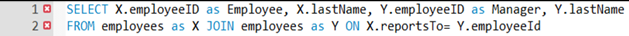
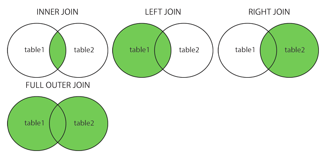

# Installatie

# Import script

![[Pasted image 20241121094249.png]]


![[Pasted image 20241121094309.png]]

# maak zelf een script

![[Pasted image 20241121094437.png]]

# Syntax

- Is niet case sensitive
- Moet niet op 1 lijn
```sql
SELECT ProductName,ProductId 
FROM products;
```

# Select

```sql
SELECT [ALL | DISTINCT] {*|uitdrukking [,uitdrukking ...]}
FROM tabelnaam
[WHERE voorwaarde(n)]
[GROUP BY kolomnaam [,kolomnaam ...]
[HAVING voorwaarde(n)]
[ORDER BY {kolomnaam|volgnr}{ASC|DESC}[,...]
```

```sql
SELECT * FROM Tabel;
```

```sql
SELECT Kolom FROM Tabel;
```

```sql
SELECT Kolom1,Kolom2,... FROM Tabel;
```

## Where

```sql
SELECT ProductId,ProductName,UnitPrice
FROM products
WHERE categoryID = 1;
```

### Voorwaarden aan rijen opleggen
- *Vergelijkingsoperatoren*
	- = (gelijk aan)
	- > (kleiner dan)
	- >= (kleiner dan of gelijk aan)
	- < (groter dan)
	- <= (groter dan of gelijk aan)
	- <> (is niet gelijk)
- *Wildcards*
	- De operator LIKE, NOT LIKE
	- In combinatie met wildcards:
		- % => willekeurige tekenrij met 0 of meerdere tekens
		- _ =>1 teken
- *Logische operatoren*
	- OR, AND, NOT (volgens stijgende prioriteit)
- *Een interval van specifieke waarden*
	- BETWEEN, NOT BETWEEN
- *Een lijst van waarden*
	- IN, NOT IN
- *Onbekende waarden*
	- IS NULL, IS NOT NULL
- *Je kan haakjes gebruiken om de prioriteitsregels te doorbreken of het geheel leesbaarder te maken*

## Null

- NULL waarden komen voor bij niet-ingevulde kolommen (zonder default waarde).
- NULL is niet gelijk aan 0 of een blanco string!
- NULL velden worden onderling als gelijk beschouwd (voor testen met DISTINCT)
- Als in een rekenkundige uitdrukking een NULL-veld wordt verwerkt is het resultaat ook NULL
- `region<> ‘OR’` geeft geen lege velden terug, gebruik `region<> ‘OR’ OR regionIS NULL`

## Formatteren van de resultaten

- Sorteren data
	- *ORDER BY* clausule
		- Kan meerdere sorteervelden bevatten
		- Een sorteerveld is een kolomnaam of een volgnummer dat overeenkomt met de volgorde van het gegeven achter de SELECT.
		- Bij meerdere sorteervelden gebeurt het sorteren van links naar rechts.
		- Standaard gebeurt het sorteren in stijgende volgorde (ASC).Een dalende volgorde moet expliciet vermeld worden (DESC)
	
- Eliminatie van duplicaten
	- *DISTINCT* produceert een lijst waarin alle rijen uniek zijn, identieke rijen worden uit het resultaat verwijderd.
	- *ALL*(default) toont alle rijen, ook dubbels.
	
- Wijzigen van kolomnaam
	- Standaard : kolomtitel = naam van kolom in tabel; berekende kolommen krijgen geen kolomnaam.
	- Een kolom een andere titel geven:
		- Via *AS* keyword
		- Met een string na de kolomnaam
		- Die nieuwe kolomnaam kan je ook gebruiken in ORDER BY (maar niet in WHERE, HAVING, GROUP BY)
	
- Berekende resultaatkolommen
	- Via wiskundige operatoren : +, -, /, *
	```sql
 SELECT ProductName, Unitprice * UnitsInStockAS InventoryValue FROM Products
```

## Commentaar
- /\* commentaar \*/ 
- \--commentaar (beperkt zich tot 1 lijn)

## Functies

- *String functies*: concat, left, right, length, substring, replace, ...
- *DateTime functies*: dateAdd, dateDiff, day, month, year, ...
	- **NOW()**: retourneert huidige datum en tijd in DATETIME formaat: JJJJ-MM-DD UU:MM:SS.
	- **CURDATE()** →huidige datum in JJJJ-MM-DD
- *Rekenkundige functies*: round, floor, ceil, cos, sin, ...
- *Aggregate functies*: AVG, SUM, MIN, MAX ...
- *IFNULL(kolom, x)*: vervangt gevonden NULL-waardes door x.

## data conversie

- Impliciet,voor sommige omzettingen
	- Voorbeeld: UnitPrice* 0,5 →UnitPrice(money) wordt automatisch naar decimal geconverteerd

- Expliciet met:
	- CAST(\<value expression\> AS \<data type\>)
	- Voorbeeld:
			- PRINT CAST(-25.25 AS INTEGER) →-25
			- SELECT CAST(38,8 AS CHAR) →‘38,8’
			
	- CONVERT(\<expression\>, type)
		- Voorbeeld
			- CONVERT( curdate(), char)→‘2016-11-24’
		
## strings

- Stringoperator: *concatenatie*
```sql
SELECT CONCAT(productid, ‘ , ’, productname) AS Product FROM Products;
```
![[Pasted image 20241121112432.png]]


- Gebruik maken van tekst (*literals*)
```sql
SELECT ProductName, ‘$’, Unitprice FROM Products;
```
![[Pasted image 20241121112416.png]]


## CASE functie

- Voorbeeld voor verschepingskost:

```sql
SELECT OrderID, Freight,
  CASE 
	when Freight is null then'Kost onbekend’
	when Freight = 0 then'Gratis verscheping' 
	when Freight < 20 then'Lage verschepingskost' 
	when Freight < 100 then'Gemiddelde verschepingskost' 
	else ‘Hoge verschepingskost' 
  END
	as ‘Verschepingskost’ FROM orders;
```

# Statische functies

Statistische functies (= aggregaatsfuncties)

• Statistische functies enkel te gebruiken in SELECT, HAVING, ORDER BY **niet** in WHERE, GROUP BY

- SQL voorziet 5 standaardfuncties
	- **SUM**(uitdrukking): som
	- **AVG**(uitdrukking): gemiddelde
	- **MIN**(uitdrukking): minimum
	- **MAX**(uitdrukking): maximum
	- **COUNT**(*|[DISTINCT] kolomnaam): aantal

- Deze functies geven één antwoord per kolom (of groep) en mogen dus niet in een WHERE clausule (= rijniveau) gebruikt worden.

# GROUP BY

GROUP BY clausule :
- Indeling van tabel in groepen van rijen met gemeenschappelijke kenmerken.
- Per groep wordt maar één rij teruggegeven!

SELECT clausule
- Alle waarden uit de SELECT-clause (result set) moeten van hetzelfde niveau zijn
### Voorbeelden

Toon per categorie het aantal producten.
```sql
SELECT CategoryID, COUNT(productID) AS Aantal
FROM Products
GROUP BY CategoryID
```

Toon per categorie het aantal producten, waarvan er meer dan 10 in stock zijn.
```sql
SELECT CategoryID, COUNT(productID) AS Aantal
FROM Products
WHERE UnitsInStock > 10
GROUP BY CategoryID
```

Één waarde voor artcode en één waarde voor min(prijs) PER groep (per artcode)
```sql
SELECT artcode, MIN(offerteprijs)
FROM offertes
GROUP BY artcode;
```

# HAVING

Selecteren van groepen op basis van bepaalde groepseigenschappen

## WHERE <> HAVING

Verschil tussen WHERE en HAVING
	- WHERE - heeft betrekking op enkele rijen
	- HAVING - heeft betrekking op groepen


### Voorbeelden

Toon het aantal producten voor elke categorie die meer dan 10 producten bevat.
```sql
SELECT CategoryID, COUNT(productID) AS Aantal
FROM Products
GROUP BY CategoryID
HAVING COUNT(productID) > 10
```

Toon het aantal producten in voorraad voor elke categorie die meer dan 10 producten in voorraad bevat.
```sql
SELECT CategoryID, COUNT(productID) as Aantal
FROM Products
WHERE UnitsInStock >10
GROUP BY CategoryID
HAVING COUNT(*) > 10
```

# Join

Selecteren van kolommen uit meerdere tabellen
- **JOIN** keyword: specifiëert de tabellen die samengevoegd moeten wordem
	- Inner join
	- Outer join
	- Cross join 
	  
- **ON** keyword: specificeert hoe de tabellen samengevoegd worden

```sql
SELECT uitdrukking FROMtabel JOIN tabel ON voorwaarde [JOIN tabel ON voorwaarde...]
```

**HOE NIET JOIN GEBRUIKEN!!!!!!!!!**
```sql
SELECT uitdrukking FROM tabel, tabel [, tabel...] WHERE voorwaarde
```

## Alliasen

Gebruik van tabel aliassen (via ‘as’ of spatie)

```sql
SELECTo.OrderID, ShipCountry, ProductID, Quantity 
FROM orders o JOIN order_detailsod 
	ON o.OrderID= od.OrderID 
WHERE ShipCountrynotin ('Belgium','France','Germany')
```


## INNER JOIN

Koppelen van rijen uit één tabel met rijen uit een andere tabel op basis van gemeenschappelijke waarden in de overeenkomstige kolommen.

De relatie tussen de velden in de verschillende tabellen kan je uitdrukken a.d.h.v. 
- = (equi-join) 
- < 
- >
- <>
- >= 
- <=

met 2 tabellen
```sql
SELECT orders.OrderID, ShipCountry, ProductID, Quantity 
FROM orders JOIN order_details 
	ON orders.OrderID = order_details.OrderID 
WHERE ShipCountry not in ('Belgium','France','Germany')
```


met 3 tabellen
```sql
SELECT o.OrderID, ShipCountry, p.ProductName, Quantity 
FROM orders o 
	JOIN order_detailsod ON o.OrderID= od.OrderID 
	JOIN productsp ON p.ProductID= od.ProductID 
WHERE ShipCountrynotin ('Belgium','France','Germany')
```


### Relatie met zichzelf


```sql

```

## OUTER JOIN

Retourneert alle records van één tabel, zelfs als er geen gerelateerd record bestaat in de andere tabel.

Er zijn 3 types van outer join
- LEFT OUTER JOIN
	- retourneert alle rijen van de eerst (= voor keyword JOIN) genoemde tabel in de FROM clause (SQL-92)
- RIGHT OUTER JOIN 
	- retourneert alle rijen van de tweede (= na keyword JOIN) genoemde tabel in de FROM clause (SQL-92)
- FULL OUTER JOIN (bestaat niet in MySQL) 
	- retourneert alle rijen uit beide tabellen, ook als die geen corresponderende rij hebben in andere tabel (SQL-92)


### Voorbeeld : 
Geef de bedrijfsnamen van alle klanten en de ID van de bestellingen die ze plaatsten. 
Ook klanten die nog nooit een bestelling geplaatst hebben worden in de lijst opgenomen.

```sql
SELECT c.CompanyName, o.OrderID 
FROM Customers c 
LEFT OUTER JOIN Orders o ON o.customerid = c.customerid;
```




Full outer join zullen we niet zien en gebruiken in de cursus


## Cross join

Bij een cross join is het aantal rijen in de resultaattabel gelijk aan het aantal rijen in de eerste tabel maal het aantal rijen in de tweede tabel.

```sql
SELECT concat(e1.FirstName,' ',e1.LastName) AS Groepslid1, concat(e2.FirstName,' ',e2.LastName) AS Groepslid2 FROM Employees e1 cross JOIN Employees e2;
```


# UNION

Via een UNION combineer je het resultaat van 2 of meerdere queries in 1 resultaattabel

```sql
SELECT... FROM ... WHERE ... 
UNION
SELECT... FROM ... WHERE ... 
ORDER BY ...
```

**Voorwaarden**

- De resultaten van de 2 SELECT opdrachten moeten evenveel kolommen bevatten.
- Overeenkomstige kolommen uit beide SELECT's moeten van hetzelfde datatype zijn en beide NULL-waarden toelaten of niet.
- Kolommen komen voor in dezelfde volgorde.
- De kolomnamen/titels van de UNION zijn deze van de eerste SELECT.
- Het resultaat bevat echter steeds alleen unieke rijen.
- Aan het einde van de UNION kan je een ORDER BY toevoegen. In deze clausule mag geen kolomnaam of uitdrukking voorkomen indien kolomnamen van beide select's verschillend zijn. Gebruik in dat geval kolomnummers

## voorbeeld:

```sql
SELECT firstname+ ‘ ‘ + lastnameas name, city, postalcode 
FROM Employees 
UNION
SELECT companyname, city, postalcode 
FROM Customers
```

Gebruikt bij geef mij eens de adressen van verschillende personen en bedrijven

# INSERT

Toevoegen van rijen in een tabel gebeurt via het INSERT statement:
- één enkele rij toevoegen via specificatie van waarden
- *geselecteerde rij(en) uit een andere tabel toevoegen (2TI)*

```sql
INSERT[LOW_PRIORITY | DELAYED | HIGH_PRIORITY] [IGNORE] 
[INTO] tbl_name[(col_name[, col_name] ...)] 
{VALUES | VALUE} (value_list) [, (value_list)] ... 
[ON DUPLICATE KEY UPDATE assignment_list]
```

## Methode 1
```sql
INSERT INTO categories(categoryID, categoryName)
```

## Methode 2
```sql
INSERT INTO categoriesVALUES(10, 'Chocolade', NULL, NULL)
```

## Aandacht voor:

- Het aantal opgegeven kolomnamen en waarden moeten gelijk zijn.
- Het type van de waarde moet overeenstemmen met het datatype van de desbetreffende kolom.
- Als geen kolomnamen worden opgegeven, worden de waarden toegekend volgens de kolomvolgorde zoals bepaald bij de definitie van de tabel (CREATE).
- Ook NULL mag als waarde worden opgegeven.
- Verplichte velden moet je opgeven, tenzij ze een default waarde bevatten.
- De constraints worden gecontroleerd...
- Kolommen niet vermeld in ‘insert’, krijgen een NULL waarde, tenzij er een DEFAULT constraint bestaat, dan wordt de DEFAULT waarde toegekend.
- Bij een auto-increment kolom worden waarden door het systeem gegeneerd bij het toevoegen van een rij. Deze kolom mag je dan ook nooit toevoegen aan een INSERT instructie.Je kan de gegenereerde waarde wel achteraf opvragen.

# Update

```sql
UPDATE[LOW_PRIORITY] [IGNORE] table_reference
SET assignment_list
[WHERE where_condition] 
[ORDER BY ...] 
[LIMIT row_count]
```


## Wijzigen van alle rijen in een tabel
Voorbeeld: 

- verhoog de prijs van alle producten met 10%
```sql
UPDATE Products
SET unitprice= (unitprice* 1.1)
```
## Wijzigen van 1 rij of een groep van rijen
- Voorbeeld: verhoog de prijs van het product “Chocolade” met 10%
```sql
UPDATE products
SET unitprice= (unitprice* 1.1) 
WHERE productname= ‘Chocolade’
```
- Voorbeeld: verhoog de prijs van het product “Chocolade” met 10% en plaats ‘aantal eenheden in voorraad’ op 0
```sql
UPDATE products
SET unitprice= (unitprice* 1.1), unitsinstock= 0 
WHERE productname= ‘Chocolade’
```

## CASE –NULLIF

Voorbeeld: Pas kolom reportsToaan: indien reportsTo= 101, dan wordt de inhoud NULL

```sql
UPDATE employees 
SET reportsTo = 
	CASE WHEN reportsTo= 101 
		THEN NULL
	END
```

```sql
UPDATE employees 
SET reportsTo = NULLIF(reportsTo,101)
```

# DELETE

```sql
DELETE[LOW_PRIORITY] [QUICK] [IGNORE] 
FROM tbl_name[PARTITION (partition_name[,partition_name] ...)] 
[WHERE where_condition] 
[ORDER BY ...] 
[LIMIT row_count]
```

## Verwijderen van rij(en)
–Voorbeeld: verwijder de categorie ‘Chocolade’
```sql
DELETE FROM categories
WHERE categoryName= ‘Chocolade’
```
## Verwijderen van alle rijen in een tabel
–via DELETE zal de auto increment soms gewoon verder lopen
```sql
DELETE FROM products
```

–via TRUNCATE zal de auto increment herstarten vanaf 1 (performanter: drop gevolgd door create)
```sql
TRUNCATE TABLE products
```


Referentiële integriteitsregel:
- Bij het verwijderen (en updaten) van een aantal records in een tabel, kan het zijn dat records in een andere tabel ook verwijderd (aangepast) worden (vb. ON DELETE CASCADE). 
- Het verwijderen van een record kan hierdoor soms falen→bij het wissen van gegevens moeten de gegevens vaak trapsgewijs in de juiste volgorde in meerdere tabellen worden verwijderd. Dit wordt verder behandeld in 2TI.
 
**Vergeet de WHERE clause niet (anders de volledige tabel leeg!)**