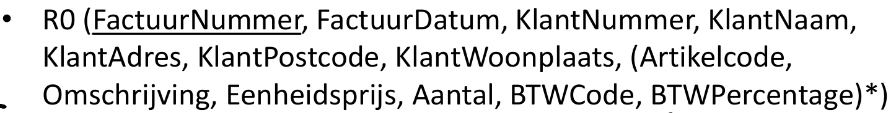
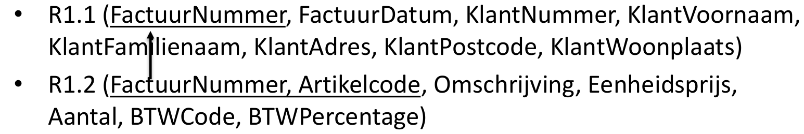
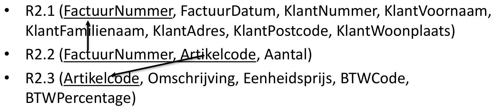
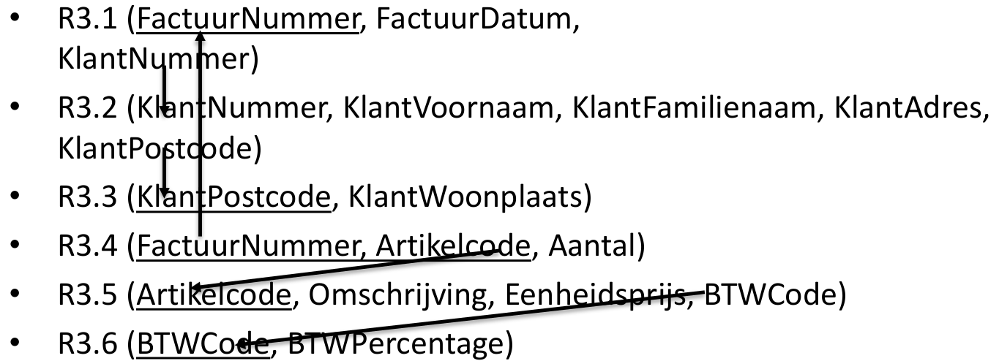
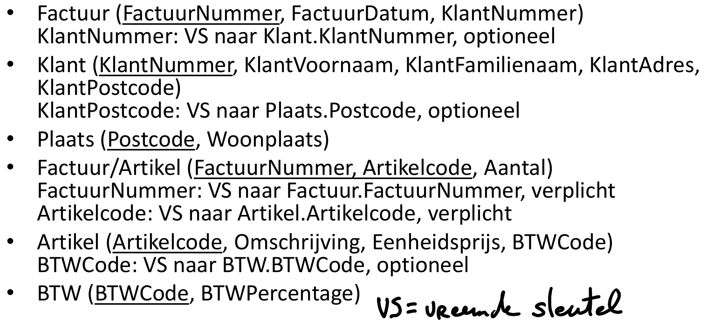

## Normalisatie

- Het proces bestaat uit een aantal stappen die steunen op functionele afhankelijkheid, waarbij we partiële en transitieve afhankelijkheden wegwerken.

- Het wordt toegepast op een verzameling met als doel elk attribuuttype te plaatsen in een nieuwe verzameling waar het volledig functioneel afhankelijk is van de gehele primaire sleutel.

- **FA**
	- Waar is de sleutel altijd afhankelijk van?
	- Waar de sleutel afhankelijk van is, is altijd van toepassing
- **R0 (Analyse)**: 
	- **Verzamelen van gegevens**
	- **bepalen wat herhaald/overbodig is** (maar nog niets doen)
	- **checken of er een Kandidaat Sleutel (ID) is.**
- **R1 (1NF)**: 
	- **Verwijderen herhalende groepen**
	- atomaire attributen(**Samenstellingen splitsen**)
	- **invoeren/verfijnen van primaire sleutels.**
- **R2 (2NF)**: 
	- **Wegwerken partiële afhankelijkheden** .
		- Partiële afhankelijkheid komt alleen voor als je een samengestelde sleutel hebt.
		- bv: Puntenboek(*StudentId*, *VakId* ,Cijfer, StudentenNaam)
			- Samengestelde sleutel -> *StudentId*, *VakId* 
			- Partiele afhankelijkheid -> StudentenNaam (alleen afhankelijk van StudentenId)
			- OPLOSSING, opsplitsen in 2 tabellen zodat Studentenaam er niet meer in zit.
- **R3 (3NF)**: 
	- Wegwerken transitieve afhankelijkheden (een niet-sleutelattribuut hangt niet via een ander attribuut af van de sleutel).
		- Een **transitieve afhankelijkheid** (A→B en B→C, waarbij B geen sleutel is) betekent dat bepaalde attributen niet rechtstreeks van de primaire sleutel afhangen, maar via een ander attribuut.
- **RM (BCNF & afronden)**: 
	- Controleren of elke determinant (sleutel) een candidate key is,
	- **tabellen definitief benoemen**, 
	- **Integriteitsregels toevoegen** referentiële integriteit en andere constraints toevoegen, 
	- en **alles integreren in één relationeel schema**.
### Uitleg

#### R0 – Voorbereidende analyse voor 1NF

1. **Welke gegevens komen 1 keer voor?**
    - Identificeer attributen/velden die per record **uniek** of in ieder geval niet herhalend zijn.
    - Bepaal of er al een duidelijke identifier (ID) is voor het geheel (bijv. _BestelID_, _KlantID_).
      
2. **Welke gegevens herhalen zich?**
    - Zoek naar velden of groepen van velden die in één record meermaals voorkomen (herhalende groepen).
    - Bijvoorbeeld: in een _Order_-formulier waar in één rij meerdere artikelcodes of aantallen “achter elkaar” staan.
      
3. **Wat zijn procesgegevens of niet-relevante gegevens?**
    - Filter velden die je niet (permanent) nodig hebt, zoals tijdelijke statusinfo, systeemvelden (“laatste update door gebruiker X”).
    - Deze kunnen vaak geëlimineerd of verplaatst worden naar een audit/log.
      
4. **Heeft het document al een identificatie?**
    - Controleer of er in het brondocument een natuurlijk of kunstmatig ID is. Zo niet, bedenk of je een surrogate key (autonummer) wilt toevoegen.

**Doel van R0**:
- Een duidelijk beeld krijgen van alle (mogelijke) kolommen en hun gebruik.
- Klaarzetten voor de daadwerkelijke omzetting naar 1NF (in R1).

---

#### R1 – Eerste normaalvorm (1NF)

1. **Verwijder herhalende groepen**
    - Creëer een aparte tabel voor gegevens die meerdere keren voorkomen in één record.
    - Bijv. een _Bestelling_ (hoofdtabel) en een _BestelRegel_ (detailtabel) waar je de individuele items kwijt kunt.
      
2. **Elimineer niet-relevante of procesvelden**
    - Als dit nog niet in R0 is gedaan, doe het nu definitief: verwijder of verplaats gegevens die niet structureel in het datamodel thuishoren.
      
3. **Maak velden atomaire attributen (Samenstellingen splitsen)**
    - Splits samengestelde velden (bijv. “Naam” in “Voornaam” / “Achternaam”, of “Adres” in “Straat”, “Huisnummer”, “Postcode”, “Plaats”).
    - Controleer of er geen opsommingen in één veld staan (bijv. meerdere e-mailadressen in één kolom).
      
4. **Zorg dat elke tabel een primaire sleutel (PK) heeft**
    - Via bestaande of nieuw toegevoegde (surrogate) sleutels.

**Doel van R1**:
- Je datamodel voldoet nu formeel aan **1NF**: **elke rij en kolom is eenduidig, geen herhalende groepen, en alleen atomaire waarden**.

---

#### R2 – Tweede normaalvorm (2NF)

> 2NF is pas relevant als je in een tabel een _samengestelde sleutel_ als PK gebruikt.

1. **Identificeer partiële afhankelijkheden**
    - Een partiële afhankelijkheid houdt in dat een attribuut in de tabel alleen van _een deel_ van de samengestelde primaire sleutel afhangt (in plaats van de hele sleutel).
    - Voorbeeld: in een tabel met (_StudentID_, _VakID_) als PK staat “StudentNaam”. Dat attribuut hangt alleen af van _StudentID_ en niet van _VakID_.
      
2. **Verplaats de partieel afhankelijke attributen**
    - Maak een nieuwe tabel waar het attribuut wél van de volledige sleutel (of een nieuwe primaire sleutel) afhangt.
    - In het voorbeeld: verhuis “StudentNaam” naar een tabel **Student** met _StudentID_ als PK.
    - Laat in de oorspronkelijke tabel alleen attributen staan die afhangen van de volledige (samengestelde) sleutel.

**Doel van R2**:
- Alle niet-sleutelattributen in een tabel hangen volledig af van de (hele) primaire sleutel. **Er zijn geen partiële afhankelijkheden meer.**

---

#### R3 – Derde normaalvorm (3NF)

1. **Zoek transitieve afhankelijkheden**
    - Transitieve afhankelijkheid betekent: _A → B_ en _B → C_ (en _B_ is geen sleutel), waardoor _C_ indirect van _A_ afhangt.
    - Concreet voorbeeld: _ArtikelID_ → _LeverancierNaam_ en _LeverancierNaam_ → _LeverancierAdres_. Dan is _ArtikelID_ → _LeverancierAdres_ transitief.
    - Het idee is dat “LeverancierAdres” in een **Leverancier**-entiteit thuishoort, niet bij **Artikel**.
      
2. **Splits en herstructureer**
    - Maak een aparte tabel voor de entiteit die transitief is. In het voorbeeld: **Leverancier** met _LeverancierID_ als PK, en in **Artikel** leg je alleen de referentie _LeverancierID_ vast.
    - Controleer of er nog andere velden zijn die met deze nieuwe entiteit te maken hebben en dus meeverhuizen.
      

**Doel van R3**
- **Alle niet-sleutelattributen hangen** _direct_ (en alleen) **af van de primaire sleutel**, niet via andere attributen.

---

#### RM – BCNF (Boyce–Codd Normal Form) & Finaliseren

1. **Controleer of alle determinanten candidate keys zijn**
    - BCNF vereist dat voor elke FD X→Y, X een candidate key moet zijn.
    - Heb je nog FD’s waarbij de linkerkant (determinant) geen candidate key is? Splits dan opnieuw, of pas je sleuteldefinitie aan.
      
2. **Definitieve naamgeving tabellen**
    - Geef elke tabel een duidelijke, betekenisvolle naam.
    - Soms hanteer je conventies als meervoud (**Artikelen**, **Klanten**) of enkelvoud (**Artikel**, **Klant**); wees in elk geval consequent.
      
3. **Bepaal en leg referentiële integriteit (FK’s) vast**
    - Voor elke relatie: maak de FK-kolom in de detailtabel aan en zorg voor integriteitsregels (cascade, restrict, etc. waar nodig).
      
4. **Integreer in een overkoepelend relationeel model**
    - Stel een ERD (Entity-Relationship Diagram) op of een schema-overzicht:
        - **Tabelnamen**, **kolommen**, **PK**, **FK**, _datatypes_, en evt. _constraints_ (UNIQUE, CHECK).
    - Dit helpt om consistentie en volledigheid te waarborgen.

**Doel van RM**:
- **Het eindmodel** in BCNF (indien je het echt zo ver nodig hebt) of tenminste 3NF, **met alle noodzakelijke constraints en duidelijke documentatie**.

---

### Uitleg met voorbeeld
#### Normalisatie stap 1: opstellen van R0 + FA

- Opstellen FA
	- Waar is de sleutel altijd afhankelijk van?
	- Waar de sleutel afhankelijk van is, is altijd van toepassing.

- Opstellen R0
	- Welke gegevens komen 1 keer voor?
	- Welke gegevens herhalen zich?
	- Wat zijn procesgegevens of niet-relevante gegevens?
	- Heeft het document een identificatie?
- Bepaal de functionele afhankelijkheden

##### Voorbeeld Notatie R0

	*Herhalende gegevens tussen haakjes met \**

##### Voorbeeld FA opstellen

- FactuurNummer → FactuurDatum, KlantNummer, KlantNaam, KlantAdres, KlantPostcode, KlantWoonplaats *(Trans)*
- KlantNummer → KlantNaam, KlantAdres, KlantPostcode, KlantWoonplaats
- KlantPostcode → KlantWoonplaats *(Trans)*
- Artikelcode → Omschrijving, Eenheidsprijs, BTWCode, BTWPercentage
- BTWCode → BTWPercentage *(Trans)*
- FactuurNummer, Artikelcode → Omschrijving, Eenheidsprijs, Aantal, BTWCode, BTW Percentage
#### Normalisatie stap 2: opstellen van R1

- wegwerken procesgegevens (kan reeds in voorgaande stap gebeuren)
- opsplitsen samengestelde gegevens
- wegwerken herhalende groepen (HG)
	- Hoe?
		1. herhalende gegevens in nieuwe verzameling (tabel)
		2. sleutel oorspronkelijke verzameling mee overnemen
		3. bepalen sleutel nieuwe verzameling

##### Voorbeeld Notatie R1

#### Normalisatie stap 3: opstellen van R2

- wegwerken partiële afhankelijkheden:
	- Hoe?
		1. zoek gegevens die partieel afhankelijk zijn
		2. verwijder deze uit oorspronkelijke tabel
		3. breng ze over naar nieuwe tabel met als sleutel de determinant waarvan ze FA zijn

##### Voorbeeld Notatie R2

#### Normalisatie stap 4: opstellen van R3

- wegwerken transitieve afhankelijkheden:
	- Hoe?
		1. zoek gegevens die transitief afhankelijk zijn
		2. verwijder deze uit oorspronkelijke tabel
		3. breng deze over in een nieuwe tabel met als sleutel de determinant waarvan ze FA zijn

##### Voorbeeld Notatie R3

#### Normalisatie stap 5: opstellen van RM (Relationeel model)

RM = Relationeel model

1. elke tabel een beduidende naam geven
2. integriteitregels toevoegen voor elke vreemde sleutel
3. integreren in overkoepelend relationeel model (RM)

##### Voorbeeld afgewerkt Relationeel model

