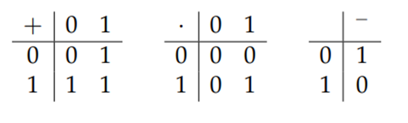
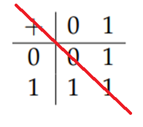
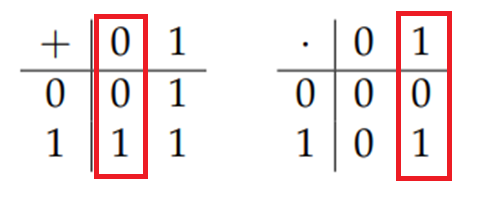
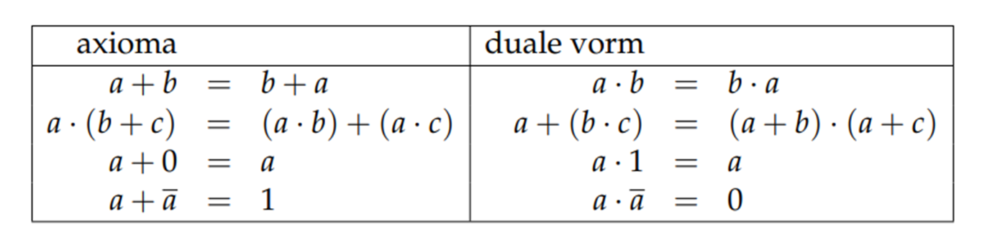
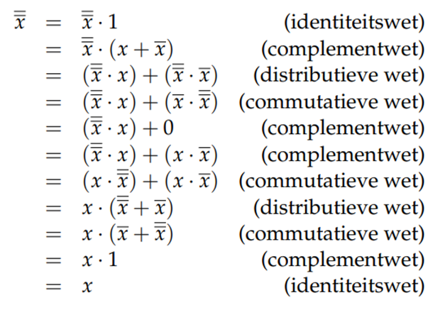
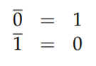
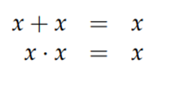
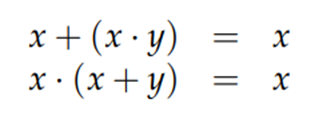
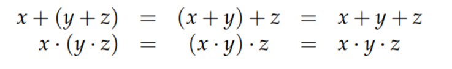
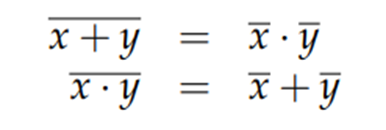

# Wat is boole-algebra

Een Boole-algebra is één specifieke algebraïsche structuur.

Een Boole-algebra **B** bestaat uit
- een *verzameling* **S** die minstens *twee constanten*, **0** en **1**, bevat;
- twee *binaire operatoren* op S: **+** en **·** ;
- een *unaire operator* op S: **−** (complement).

# Wetten

In een Boole-algebra moeten voor alle x, y, z ∈ S de axioma’s van Huntington geldig zijn:

1. **Commutatieve wetten**:
$$x+y = y+x$$
$$x.y = y.x$$
2. **Distributieve wetten**:
$$x.(y+z) = (x.y)+(x.z)$$
$$x+(y.z) = (x+y).(x+z)$$
3. **Identiteitswetten**:
$$x+0 = x$$
$$x.1 = x$$

4. **Complementwetten**:
$$x+\overline{x} = 1$$
$$x.\overline{x} = 0$$

  ## Notatie:
  
$$ B = (S, +, ·, − , 0, 1) = (S, +, ·, \overline{})$$

## Afspraken

- De binaire operator . moet niet steeds expliciet opgeschreven worden, zo is *x · y = xy*
- Bij de uitwerking van een uitdrukking heeft de bewerking *·* steeds voorrang op *+* tenzij haakjes een andere volgorde aangeven

# Bewijzen

## Voorbeeld :

- Stel B = {0, 1}.
- Op deze verzameling B worden drie operatoren gedefinieerd:
	- twee binaire operatoren, nl. + en ·
	- één unaire operator, −

- De definitie van deze drie operatoren wordt gegeven a.d.h.v. de volgende tabellen:

### Verificatie van axioma’s van Huntington:

Stel a, b, c ∈ B dan geldt:

#### 1. Commutativiteit:   
	a + b = b + a
	a · b = b · a

##### Bewijs:

| a   | b   | a + b | b + a |
| --- | --- | ----- | ----- |
| 0   | 0   | 0     | 0     |
| 0   | 1   | 1     | 1     |
| 1   | 0   | 1     | 1     |
| 1   | 1   | 1     | 1     |
Analoog voor ·

Als de matrix diagonaal symmetrisch is, is de operator commutatief:

##### CONCLUSIE -> **OK**

#### 2. Distributiviteit:
	a · (b + c) = (a · b) + (a · c)
	a + (b · c) = (a + b) · (a + c)

##### Bewijs:

| a   | b   | c   | b . c | a + (b . c) | a + b | a + c | (a + b) . (a + c) |
| --- | --- | --- | ----- | ----------- | ----- | ----- | ----------------- |
| 0   | 0   | 0   | 0     | 0           | 0     | 0     | 0                 |
| 0   | 0   | 1   | 0     | 0           | 0     | 1     | 0                 |
| 0   | 1   | 0   | 0     | 0           | 1     | 0     | 0                 |
| 0   | 1   | 1   | 1     | 1           | 1     | 1     | 1                 |
| 1   | 0   | 0   | 0     | 1           | 1     | 1     | 1                 |
| 1   | 0   | 1   | 0     | 1           | 1     | 1     | 1                 |
| 1   | 1   | 0   | 0     | 1           | 1     | 1     | 1                 |
| 1   | 1   | 1   | 1     | 1           | 1     | 1     | 1                 |
##### CONCLUSIE -> **OK**

#### 3. Identiteit
	a + 0 = a  
	a · 1 = a

##### Bewijs

##### Conclusie -> **OK**

#### 4. Complement
	a + ā = 1
	a . ā = 0

##### Bewijs
| a   | ā   | a + ā | a . ā |
| --- | --- | ----- | ----- |
| 0   | 1   | 1     | 0     |
| 1   | 0   | 1     | 0     |
##### Conclusie -> **OK**

#### Eindconclusie: Alle 4 axioma’s voldaan -> Dit is een Boole algebra!

## Voorbeeld Oefening
Nog uit te werken
# Dualiteitsbeginsel

**Duale uitdrukking:** *Alle symbolen vervangen door duale vorm*

| Sybool | duale vorm |
| ------ | ---------- |
| +      | .          |
| .      | +          |
| 0      | 1          |
| 1      | 0          |
| -      | -          |

**Uitdrukking is geldig <=> Duale is geldig**

# Eigenschappen

## Eigenschap 1: het complement is uniek

**Voor elke x ∈ S bestaat er juist één x ∈ S zodat x+ x ̅=1 en x ∙ x ̅=0**

**Bewijs:** Stel dat er nog een element y ∈ S bestaat waarvoor *x + y = 1* en *x · y = 0*.
	
**We tonen aan dat** *y= x ̅*

| y = | *y . 1*                 | (identiteitswet)    |
| --- | ----------------------- | ------------------- |
| =   | *y . (x + x ̅)*         | (complementwet)     |
| =   | *(y . x) + (y . x ̅)*   | (distributieve wet) |
| =   | *(x . y) + (x ̅ . y)*   | (commutatieve wet)  |
| =   | *(0) + (x ̅ . y)*       | (veronderstelling)  |
| =   | *(x . x ̅) + (x ̅ . y)* | (complementwet)     |
| =   | *(x ̅. x) + (x ̅ . y)*  | (commutatieve wet)  |
| =   | *x ̅ . (x + y)*         | (distributieve wet) |
| =   | *x ̅ . 1*               | (veronderstelling)  |
| =   | *x ̅*                   | (identieteitswet)   |

## Eigenschap 2: involutie

**Als we de unaire operator tweemaal toepassen op een element x dan krijgen we als uitkomst opnieuw x**

**x ̿=x**

**Bewijs**

## Eigenschap 3: complement van 0 en 1

**Het complement van 0 is 1 en omgekeerd**

**Opmerking**:
- Beide uitdrukking zijn elkaars duale.
- Beide bewijzen zijn ook elkaars duale!

## Eigenschap 4: idempotentie

**Wanneer de operator + toegepast wordt op tweemaal hetzelfde argument dan is het resultaat dat argument.**

**Wanneer de operator · toegepast wordt op tweemaal hetzelfde argument dan is het resultaat dat argument.**

## Eigenschap 5: begrenzing

**Om het even welke waarde optellen bij 1 levert steeds 1.** 

**Om het even welke waarde vermenigvuldigen met 0 levert steeds 0.**

## Eigenschap 6: absorptie

**Een element x optellen bij een product waarin x voorkomt als factor levert steeds x.**

**Een element x vermenigvuldigen met een som waarin x als term voorkomt levert steeds.**

## Eigenschap 7: associatief

**Wanneer we drie elementen vermenigvuldigen dan kunnen we de haakjes verplaatsen zonder het resultaat te wijzigen.**

**We kunnen de haakjes dus ook weglaten omdat de uitdrukking niet verkeerd kan begrepen worden.**

## Eigenschap 8: wetten van de Morgan

**Het complement van een som is het product van de complementen.**

**Het complement van een product is de som van de complementen.**

## Voorbeeld oefening

nog aan te vullen