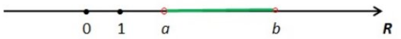
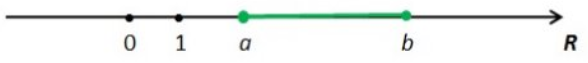
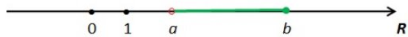

# Het veld ℝ, +, .

Voor de verzameling der reële getallen, ℝ , samen met de optelling (+) en de vermenigvuldiging (·) gedefinieerd op deze verzameling, gelden de volgende eigenschappen:​

Stel x,y,z∈ ℝ, dan geldt:

- ℝ is gesloten voor + en . : x + y ∈ ℝ en x . y ∈ ℝ
- commutatief: *x + y = y + x en x . y = y . x*
- associatief: *(x + y) + z = x + (y + z) en (x . y) . z = x . (y . z)*
- distributief: *x . (y  + z) = x . y + x . z*
- neutraal element: *x + 0 = x en x . 1 = x*
- invers element voor + : voor elke x ∈ ℝ bestaan er een element -x ∈ ℝ zodat x + (-x) = 0
- invers element voor . : voor elke x ∈ ℝ₀ bestaan er een element x⁻¹ ∈ ℝ zodat x . x⁻¹ = 1

Hieruit mogen we besluiten dat ℝ, +, · een veld is.​

# Machten

- Stel $a ∈ ℝ₀$ dan geld voor alle $n ∈ ℕ₀$
		$a⁰ = 1$
		$a¹ = a$
		$aⁿ = a . aⁿ⁻¹$   $(n ≥ 2)$
		$a⁻¹= \frac{1}{a}$
		$a⁻ⁿ= \frac{1}{a⁻ⁿ}$

- Stel $a ∈ ℝ₀⁺$ dan geld voor alle $p∈ ℕ$ en $q ∈ ℕ₀$
		$a^{1/q} = \sqrt[q]{a} = w \Leftrightarrow w^{q} = a (w ∈ ℝ )$
		$a^{p/q} = \sqrt[q]{a^p}$
		$a^{-p/q} = \frac{1}{a^{p/q}}$
		
- Stel $a,b ∈ ℝ₀⁺$ Voor alle $r,s∈ ℚ$ geld
		$a^r . a^s = a^{r+s}$
		$a^r/a^s = a^{r-s}$
		$(a^r)^s= a^{r.s}$
		$a^r . b^r = (a.b)^r$
		$a^r/b^r=(a/b)^r$

# Intervallen in ℝ

- *De verzameling ℝ kan voorgesteld worden als een rechte*.​
- Indien op deze reële rechte een ijk is aangebracht kan om het even welk reëel getal hierop aangeduid worden. ​
- Elk punt van de reële rechte komt overeen met één specifiek reëel getal. Wanneer we een aaneengesloten deel van de reële rechte willen aanduiden, spreken we van een interval. Een interval is een deelverzameling van ℝ. ​
- We maken onderscheid tussen vier soorten intervallen:​

1. *Open interval*: bevat alle reële getallen gelegen tussen twee reële waarden a en b, a en b zelf niet inbegrepen. ​
		$]a,b[= \{x∈ℝ|a<x<b\}⊆ℝ$

2. *Gesloten interval*: bevat alle reële getallen gelegen tussen twee reële waarden a en b, a en b
		$[a,b]=\{x ∈ℝ|a≤x≤b\}⊆ℝ$

3. *Halfopen interval* \[a, b\[ bevat alle reële getallen gelegen tussen twee reële waarden a en b, a inbegrepen, b niet inbegrepen.
		$]a,b[= \{x∈ℝ|a≤x<b\}⊆ℝ$

4. *Halfopen interval* ]a, b] bevat alle reële getallen gelegen tussen twee reële waarden a en b, a niet inbegrepen, b wel inbegrepen.​
		$]a,b[= \{x∈ℝ|a<x<b\}⊆ℝ$

De verzameling van de reële getallen kan zelf ook als een interval voorgesteld worden: ​ℝ bevat alle reële getallen gelegen tussen −∞ en +∞, −∞ en +∞ zelf niet inbegrepen, dus​
$$ℝ=]-∞,+∞[$$
Deze intervalnotatie voor ℝ geeft duidelijk weer dat **oneindig (∞) niet tot de reële getallen behoort**. Nochtans wordt binnen de analyse vaak gewerkt met het begrip oneindig. Wanneer de reële rechte uitgebreid wordt met −∞ en +∞, dan spreken we van de *uitgebreide reële rechte*.

# Het begrip oneindig in de wiskunde

## De uitgebreide reële rechte

Door −∞ en +∞ toe te voegen aan ℝ bekomen we de uitgebreide reële rechte :
$$\overline{ℝ}=ℝ ∪\{−∞,+∞\}=[−∞,+∞] met −∞<x<+∞ \text{ voor elke }x ∈ℝ$$
## Eigenschappen
### Rekenregels voor optellen en aftrekken:

#### voor elke x ∈ ℝ geldt

$+∞ +∞ = +∞$
$-∞ +∞ = -∞$
$+∞ +(+∞) = +∞$
$-∞ +(-∞) = -∞$

#### Let op! De volgende bewerkingen zijn **niet** gedefinieerd.

$+∞ +(-∞)$
$-∞ +(+∞)$

### Rekenregels voor vermenigvuldigen en delen:

#### voor elke x ∈ ℝ₀⁺ geldt

$+∞ . x = +∞$
$-∞ .x = -∞$
$+∞ /x = +∞$
$-∞/x = -∞$

#### voor elke x ∈ ℝ₀⁻ geldt

$+∞ . x = +∞$
$-∞ .x = -∞$
$+∞ /x = +∞$
$-∞/x = -∞$

#### voor elke x ∈ ℝ geldt

$x/(+∞)= 0$
$x/(-∞)=0$

#### voor elke x ∈ ℝ₀ geldt

$x/0=∞$

Dit laatste betekend dat x/0 ofwel $+∞$ ofwel $-∞$ is al naargelang de situatie.

#### Eveneens geldt

$+∞ . (+∞) = +∞$
$-∞ .(-∞) = -∞$
$+∞.(-∞) = -∞$
$-∞.(+∞) = -∞$

#### Let op! De volgende bewerkingen zijn **niet** gedefinieerd:

$0.+∞$
$0.-∞$
$∞.∞$
$0/0$
$0⁰$
$∞⁰$

# Oefeningen

### 1. Stel $a ∈ ℝ₀$. Schrijf de volgende uitdrukkingen zo eenvoudig mogelijk.

a) $a³ + a³$
b) $a³ . a³$
c) $(a³)³$
d) $a³ . a⁻³$
e) $(3.a)³$
f) $a³/a⁻³$
g) $(3/a)⁻³$

#### Oplossing

a) $a³ + a³ = 2.a³$
b) $a³ . a³ = a⁶$
c) $(a³)³=a⁹$
d) $a³ . a⁻³=1$
e) $(3.a)³=27.a³$
f) $a³/a⁻³=a⁶$
g) $(3/a)⁻³=a³/27$

### Vereenvoudig $(x,y ∈ ℝ₀)$

a) $(-2x⁴y)³/(-2x³y)²$
b) $(-x²y³)⁴.(-2xy⁴)⁻³$
c) $x(x-1)+(3x+)(x-2)$

#### Oplossing

a) $(-2x⁴y)³/(-2x³y)²=-2x⁶y$
b) $(-x²y³)⁴.(-2xy⁴)⁻³=-x⁵/8$
c) $x(x-1)+(3x+)(x-2)=4x²-6x-2$