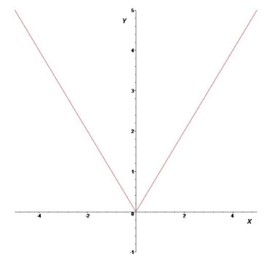
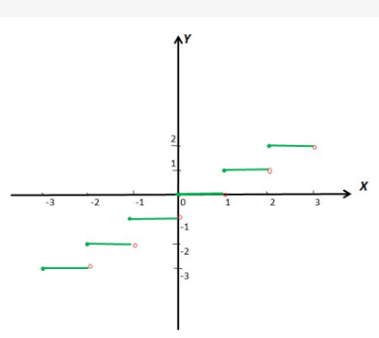
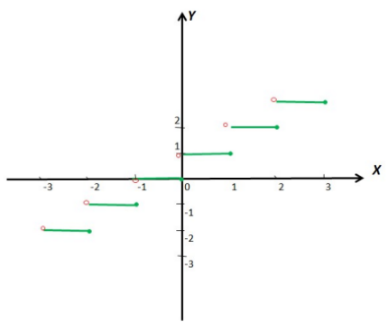

# Absolute waarde functie

## Definitie

- De **absolute waarde functie** is de functie met als functievoorschrift

$$ \text{abs} : \mathbb{R} \to \mathbb{R} : x \mapsto \sqrt{x^2} = \begin{cases} x & \text{als } x \geq 0, \\ -x & \text{als } x < 0. \end{cases} $$
## Domein
$$dom(abs)=ℝ$$
## Beeld
$$bld(abs)=ℝ⁺$$

## Grafiek

## Voorbeelden

- $abs(7) = 7$
- $abs(-13)=13$

# Floor en ceiling functie

## De floor functie

### Definitie

- De **floor**-functie is de functie met functievoorschrift:
$$floor: ℝ \to ℤ:x \mapsto floor(x) = z \text{ met } z \text{ het grootste geheel getal zodat } z ≤ x$$

### Domein
$$dom(floor)=ℝ$$
### Beeld
$$bld(floor)=ℤ$$
### Grafiek

### Voorbeelden
- $floor(-0,5) = -1$
- $floor(2,77) = 2$
- $floor(-4,9) = -5$

## De functie ceiling

### Definitie
- De **ceiling**-functie is de functie met functievoorschrift:
$$ceiling: ℝ \to ℤ:x \mapsto ceiling(x) = z \text{ met } z \text{ het kleinste geheel getal zodat } z ≥ x$$
### Domein
$$dom(ceiling)=ℝ$$

### Beeld
$$bld(ceiling)=ℤ$$

### Grafiek

### Voorbeeld
- $ceiling(-0,5) = 0$
- $ceiling(2,77) = 3$
- $ceiling(-4,9) = -4$

# Oefeningen

## 1. Stel  $f:ℝ→ℝ:x↦abs(x+1)$
- a) Geef het domein en beeld van $f$
- b) Bepaal alle nulpunten van $f$
- c) Schets de grafiek va $f$

### Oplossing

## 2. Stel
	$f:ℝ→ℝ:x↦floor(ceiling(x-\frac{1}{2}))$
	$g:ℝ→ℝ:x↦floor(ceiling(x)-\frac{1}{2})$
	$h:ℝ→ℝ:x↦ceiling(floor(x+\frac{1}{2}))$

- Geef voor elk van de gegeven functies het domein en het beeld. Bepaal voor elke functie de nulpunten. Teken de grafiek van de functies $f$, $g$ en $h$.

### Oplossing