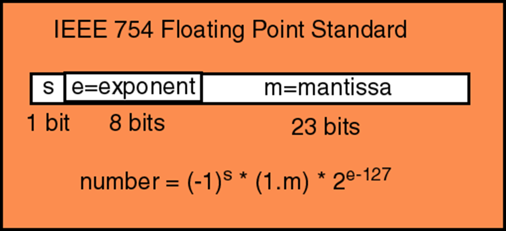
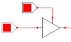
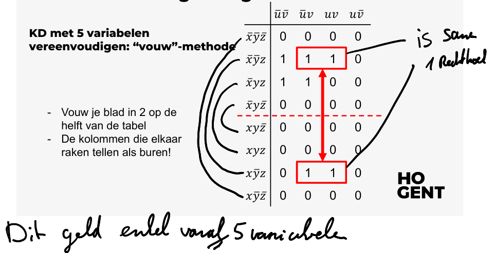
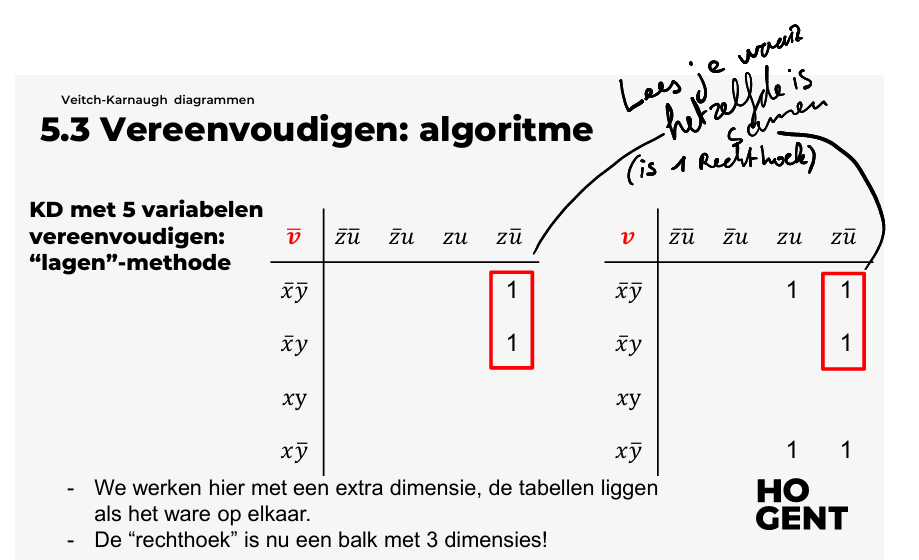

# H01 [Binair rekenen](./H01%20Binair%20rekenen.md)
## Getallensystemen of talstelsels
## Bewerkingen in het binair stelsel
## Negatieve getallen
## Overflow
## Floating-point

# H02 [Logische poorten](./H02%20Logische%20poorten.md)
## Overzicht van een logische poort
## Basispoorten
## De tri-state buffer
## Wetten van De Morgen

# H03 [Boole-algebra](./H03%20Boole-algebra.md)
## Wat is boole-algebra
## Wetten
## Bewijzen
## Dualiteitsbeginsel
## Eigenschappen

# H04 [Boolese uitdrukkingen en Functies](./H04%20Boolese%20Uitdrukkingen%20En%20Functies.md)
## Boolese uitdrukkingen
## Minimale en maximale Boolese uitdrukkingen
## De disjunctieve normaalvorm: DNV
## De conjunctieve normaalvorm: CNV
## Vereenvoudigen van Boolese uitdrukkingen
# H05 [Veitch-Karnaugh diagrammen](./H05%20Veitch-Karnaugh%20diagrammen.md)
## Doel
## Werking
## DNV (Disjunctieve Normaal Vorm) VS CNV (Congjectieve Normaal Vorm)
## Vereenvoudigen
## Voorbeelden
## Boole algebra en logisch schakelingen
## Oefeningen
# H06 [Codeertheorie](./H06%20Codeertheorie.md)
## Inleiding
## Foutdetecterende codes
## Foutverbeterende codes
# H07 [Inleiding tot analyse](./H07%20Inleiding%20tot%20analyse.md)
## Het veld ℝ, +, .
## Machten
## Intervallen in ℝ
## Het begrip oneindig in de wiskunde
## Oefeningen
# H08 [Veelterm functies](./H08%20Veelterm%20%functies.md)
## Definities en notaties
## Constante functies
## Lineaire functies of functies van de eerste graad
## Functies van de tweede graad
# H09 [Exponentiële en logaritmische functies](./H09%20Exponentiële%20en%20logaritmische%20functies.md)
## De exponentiële functie
## De logaritmische functie
## Oefeningen
# H10 [Bijzondere functies](./H10%20Bijzondere%20functies.md)
## Absolute waarde functie
## Floor en ceiling functie
## Oefeningen
# H11 [Eindige velden](./H11%20Eindige%20%velden.md)
## Definities en eigenschappen
## Het eindig veld $ℤ_p$
## Voorbeelden
## Rekenen in $ℤ_p$
## Vergelijkingen in $ℤ_p$
## Oefeningen

# Samenvatting voor examen

## Binair rekenen

### Binair

| 2¹⁰  | 2⁹  | 2⁸  | 2⁷  | 2⁶  | 2⁵  | 2⁴  | 2³  | 2²  | 2¹  | 2⁰  |
| ---- | --- | --- | --- | --- | --- | --- | --- | --- | --- | --- |
| 1024 | 512 | 256 | 128 | 64  | 32  | 16  | 8   | 4   | 2   | 1   |
#### **na** de komma

| 2⁻¹ | 2⁻²  | 2⁻³   | 2⁻⁴    | 2⁻⁵     |
| --- | ---- | ----- | ------ | ------- |
| 0,5 | 0,25 | 0,125 | 0,0625 | 0,03125 |
#### Optellen

analoog aan decimaal stelsel (onder elkaar)
#### andere

| not        | and | or  | xor                        |
| ---------- | --- | --- | -------------------------- |
| complement |     |     | enkel bij verschillend = 1 |
### Octaal

Binair getal omzetten naar octale voorstelling:
	- *binair getal groeperen per 3 bit* ( => 2³ = 8)Eventueel leidende nullen toevoegen (groen in de tabel)
	- *octale waarde bepalen per 3 bit*

Voorbeeld: (111010)₂ = ( 111 010 )₂ = (72)₈
### Hexadecimaal

Binair getal omzetten naar hexadecimale voorstelling:
- *binair getal groeperen per 4 bit* Eventueel leidende nullen toevoegen 
- *hexadecimale waarde bepalen per 4 bit*

Voorbeeld: (111010)₂ =  (0011 1010)₂ = (3A)₁₆

### Negatieve binaire getallen

**3 methodes** om een negatief getal binair voor te stellen :
1. *Teken (1bit) + absolute waarde (7bits)* (8-bit **signed magnitude**)
	- *Meest linkse bit binnen het woord gebruiken als tekenbit*
2. *Excess-N*
	- **N** *bij het getal optellen* (*N =* **127** *bij 8 bit woorden*)
3. *Two’s complement* of 2’s complement
	-  **Positieve** *getallen* -> *gewone binaire vorm*
	- **Negatieve** *getallen* -> *2’s complement van de binaire vorm*
		1. Schrijf de *binaire vorm* van de **absolute waarde**
		2. *inverteer* hiervan **alle bits** (dus 0 => 1 en 1 => 0)
		3. *tel er binair* **1** *bij op*

### Overflow

Wanneer treedt **overflow** op?
- Als er 1 van de overflow condities optreedt (**niet beide samen!**). Deze zijn:
	1. “*carry naar het tekenbit*” = Overdracht van de op één na meest linkse positie naar de meest linkse positie (msb)
	2. “*carry naar buiten*” = Overdracht van de meest linkse positie (msb) naar nergens of dus buiten het computerwoord

### Floating-point

- We hebben, bijgevolg, *2 getallen nodig om één kommagetal voor te stellen*, namelijk
	- één met de *waarde* (**mantisse**)
	- één met de *aanduiding waar de komma moet komen* (meestal onder de vorm van een **exponent**).

	- Voorbeeld: (101,1101)₂ = (1,***011101***)₂ . 2*²*
		***011101*** is de mantisse
		*²* is de exponent 
	

#### IEEE 754 binary32 getal (binair) naar Decimale waarde

Voorbeeld:  Er staat volgend binary32 getal in het geheugen:
 (11000000101100000000000000000000)₂
 
 dit delen we op volgens binairy32 IEEE 754
 (1)₂ (10000001)₂ (01100000000000000000000)₂

- 1 bit voor **teken** (**s**) -> (*1*)₂ => ***het getal is negatief***
- 8 bits voor de **exponent** (**e**) voorgesteld in de *excess-127* -> (10000001)₂ = (129)₁₀ => 129-127 dus exponent = ***²***
- 23 bits voor de **mantisse** (**m**) -> 011000…. -> *enkel het deel na de komma => 1,*011000…* = ***(1,375)₁₀***

  Het getal is dus *-1,375 . 2²* = ***(-5,5)₁₀***

#### Decimaal getal naar IEEE 754 binary32 getalwaarde (binair)

Voorbeeld: (- 2,25)₁₀
1. (stap1)  IEEE 754 single voorstelling begint met **1** omdat het decimale startgetal negatief is.
2. (stap1) binaire voorstelling  => (- 10,01)₂
3. (stap2) genormaliseerde vorm  => (- 1,***001*** x 2`¹`)₂ => (2¹ omdat de komma maar 1 plaats is moeten opschuiven)
4.  (stap3) exponent met Excess-127 =>(127 + `1`= 128)₁₀ => (*1000 0000*)₂
5. (stap4) IEEE 754 single voorstelling (32 bit) => **1** *10000000* ***00100000000000000000000***

 IEEE 754 single voorstelling is dus 1100000000100000000000000000000

## Logische poorten

### 7 soorten

**NIET**-poort (NOT)
**EN**-poort (AND)
**OF**-poort (OR)
**XOR**-poort
	- enkel bij verschillend = 1
**NEN**-poort (NAND)
	- And met not op uitgang
**NOR**-poort 
	- Or met not op uitgang

**De tri-state buffer**
	- *om kortsluiting (x/  ) op bussen te vermijden*
	- Twee ingangen:
		- *stuurlijn*
			- *Stuurlijn = 1* => signaal *wordt doorgegeven* naar de uitgang
			- *Stuurlijn = 0* => signaal *wordt niet doorgegeven*
		- *signaal*
	- 
## Boole-algebra
- Bewijzen/vereenvoudigen (formularium)
## Boolese Uitdrukkingen En Functies
- Minimale uitdrukking
	- Alle mogelijke AND combinaties
- Maximale uitdrukking
	- Alle mogelijke OR Commbinaties

- De disjunctieve normaalvorm: DNV
	- **som*** *van* **minimale** *uitdrukkingen*
	- 2 Manieren om te bepalen
		- gebruik axioma’s en eigenschappen (Boole algebra?)
		- gebruik de uitvoertabel
			- Elke rij heeft een minimale term. Deze bevat 𝑥 voor de rijen waar 𝑥 = 1, en 𝑥̅ waar 𝑥 = 0. Analoog voor y, z, …
			- Tel deze minimale term op met de output voor elke rij
- De conjunctieve normaalvorm: CNV
	- **product** *van* **maximale** *uitdrukkingen*
	-  2 methodes om de CNV te bepalen: 
		- met eigenschappen
		- via waarheidstabel
			- dezelfde stappen worden doorlopen als DNV maar *telkens de duale vorm ervan*. (duaal = alles wat 0 is vermenigvuldigen)

- Vereenvoudigen van Boolese uitdrukkingen
	- **Een Boolese functie vereenvoudigen kan o.a. door te steunen op de axioma’s en eigenschappen van een Boole-algebra.**

## Veitch-Karnaugh diagrammen

- *hulpmiddel om logische expressies te vereenvoudigen*
- *AND, OR en NOT, makkelijker te maken door* **overbodige termen weg te halen**

- Werking
	- Aanmaken van Karnaugh-diagram
		- Het aantal vakjes in de K-map wordt bepaald door het aantal variabelen in de functie
			- Bij 2 variabelen heb je een 2x2-raster (4 vakjes).
			- Bij 3 variabelen heb je een 2x4-raster (8 vakjes).
			- Bij 4 variabelen heb je een 4x4-raster (16 vakjes), enzovoort.
	- Invullen van het diagram
		- Je vult de K-map in door de uitkomst (1 of 0) van de logische functie in
	- Vereenvoudigen door groeperen
		- zoeken naar groepen van 1's
			- Deze groepen zijn blokken van aangrenzende vakjes, zoals 
				- paren 2
				- kwarten 4
				- octetten 8
		-  **ze mogen overlappen**
		- **Zo groot mogelijk**
		- moeten rechthoekig zijn
		- **mogen door de randen van het diagram heen "wrappen"**

- DNV (Disjunctieve Normaal Vorm) VS CNV (Congjectieve Normaal Vorm)
	- Met minimale uitdrukking (.)+(.) (DNV) (AND)
		- Alle 1 groeperen
	- Met maximale uitdrukking (+).(+) (CNV) (OR)
		- alle 0 groeperen

### Met 5 variabelen

### Boole algebra en logisch schakelingen
- Mer karnaugh diagram logische schakelingen vereenvoudigen

## Codeertheorie

### Foutdetecterende codes 
- **Herhaling**
	- n voor aantal herhaling, letterlijk herhaling (001) -> (001001)
- **Pariteit** (2)
	1. we voegen 1 bit toe om te zien of er even of oneven aantal 1 of 0 zijn
	- *Oneven pariteit*
		2. een oneven aantal 1-bits = 0, even aantal 1-bits = 1
	- *Even pariteit*
		2. een even aantal 1-bits = 0, oneven aantal 1-bits = 1
- **Controlegetal** (2)
	- *Rest als controlegetal*
		- Rest van deling 'waarde getal' / priemgetal (`%(getal/priemgetal)`)
	- *Cyclic Redundancy Check*
		- deling, waarbij de rest van de deling als “checksum” wordt meegestuurd
			1. Voeg n-1 nullen achteraan toe aan de data(=orginele data) met n = de lengte van de polynoom(=deler)​
		    2. Schrijf de polynoom links onder de data bit-reeks met extra nullen, meest linkse bit van polynoom is 1, die van data erboven ook. ​
		    3. Voer nu “XOR”-bewerking uit​
		    4. De polynoom wordt opnieuw links onder het bekomen resultaat geschreven, en de XOR bewerking wordt herhaald​
		    5. Stop wanneer het bekomen resultaat(= checksum) korter is dan de polynoom. (leading zeros niet meegeteld)​
### Foutverbeterende codes (2)
- *Backward Error Correction*
	- Bij fouten wrden de gegevens opnieuw gevraagd

- *Forward Error Correction*
	- Algoritmes die in staat zijn om de correcte bitreeks te recinstrueren uit de vervormde bitreeeks
	- **Hammingcode**
		- (Algoritme) Data inpakken
			1. Nummer all bits van de orginele data van d1 tem dn (van links naar rechts)
			2. Voeg pariteitsbits toe -> positie wordt bepaald door de machten van 2 (p1->1,p2->2,d1->3,p3->4,d2->5,d3->6...)
			3. We maken nu een matrix met 
				+ inhoud kolom rij (horizontaal) wat gecreeerd is in stap 1 tem 3
				+ aantal rijen (verticaal) = het aantal pariteitsbits 
					+ met rij1 P1 (naam van apriteitsbit) 
					+ rij 2 P2
					+ ....
			4. Kruisjes zetten waar bits moeten komen in matrix (van links naar rechts)
				+ rij p1 starten bij 1 (1om1) -> positie 1, positie 3, positie 5,positie 7, positie 9, positie 11, ...
				+ rij p2 starten bij 2 (2om2) -> positie 2, positie 3, positie 6,positie 7, positie 10, positie 11, ...
				+ rij p3 starten bij 4 (4om4) -> positie 4, positie 5, positie 6,positie 7, positie 12, positie 13, positie 14, positie 15, ...
				+ rij p3 qtarten bij 8 (8om8) -> positie 8, positie 9, positie 10,positie 11, positie 12, positie 13, positie 14, positie 15, positie 32, positie 33, ...
				+ ...
			5. we gaan per kolom af en waar over 1 staat wordt elk kruisje 1 en waar 0 staat elk kruisje 0, lege bovenste velden blijven nog af
			6. we gaan nu aller rijen lang (behalve de bovenste), en we zorgen voor elke rij voor oneven pariteit (alle 1 moeten even zijn door 0 toe te voegen of een 1)
			7. we kijken nu naar onze bovenste rij en vullen een 1 in als er in de kolom ergens een 1 staat en anders een 0
			8. Nu onze bovenste rij compleet is is deze onze te verzenden data
		- Data controleren en terughalen (en eventueel fout correctie)
			1. we noteren ons woord op de bovenste rij van de matrix die bij het algoritme is gecreeërd
			2. Kruisjes zetten waar bits moeten komen in matrix (van links naar rechts) (zoals bij het algoritme)
			3. we gaan per kolom af en waar over 1 staat wordt elk kruisje 1 en waar 0 staat elk kruisje 0
			4. we kijken nu rij per rij of er even aantal 1 zijn (oneven pariteit)
			5. waar er oneven is zit een fout
			6. We zoeken de fout
				- waar is de fout?
					- We noteren de posities van de pariteitsbits met een oneven aantal eentjes in hun rij en tellen deze op. 
						- In het voorbeeld dus: p1(1) en p3(4) of dus 1 + 4 = 5 
							- dus de fout zit in  het 5e bit

## functies

### Samenvatting

|Functietype|Algemene Vorm|Grafiek|Domein|Beeld (Bereik)|x berekenen|y berekenen|
|---|---|---|---|---|---|---|
|Constante Functie|$f(x)=c$|Horizontale lijn|$\mathbb{R}$|$c$|Voor $y = c$: alle $x \in \mathbb{R}$   Geen oplossing voor $y \neq c$|$y = c$|
|Lineaire Functie|$f(x)=mx+b$|Rechte lijn|$\mathbb{R}$|$\mathbb{R}$|$x = \frac{y - b}{m}$|$y = mx + b$|
|Tweedegraadsfunctie|$f(x)=ax^2+bx+c$|Parabool|$\mathbb{R}$|$[y_{\text{min}}, \infty)$ als $a > 0$ en $(-\infty, y_{\text{max}}]$ als $a < 0$|$x = \frac{-b \pm \sqrt{b^2 - 4a(c - y)}}{2a}$|$y = ax^2 + bx + c$|
|Logaritmische Functie|$f(x)=\log_b(x)$|Loggrafiek|$x > 0$|$\mathbb{R}$|$x = b^y$|$y = \log_b(x)$|
|Exponentiële Functie|$f(x)=a^x$|Exponentiëlegrafiek|$\mathbb{R}$|$y > 0$|$x = \log_a(y)$|$y = a^x$|
|Ceiling Functie|$f(x)=\lceil x \rceil$|Stapgrafiek met sprongen omhoog|$\mathbb{R}$|$\mathbb{Z}$ (Alle gehele getallen)|Voor een gegeven $y \in \mathbb{Z}$: $x \in (y -1, y]$|$y = \lceil x \rceil$|
|Floor Functie|$f(x)=\lfloor x \rfloor$|Stapgrafiek met sprongen omlaag|$\mathbb{R}$|$\mathbb{Z}$ (Alle gehele getallen)|Voor een gegeven $y \in \mathbb{Z}$: $x \in [y, y +1)$|$y = \lfloor x \rfloor$|

#### 1. Constante Functies

$$f(x)=a$$
$$a= \text{Bereik(alle mogelijke y-as waarden)}$$
$$\text{Domein(alle mogelijke x-as waarden )}= ℝ$$

![[Pasted image 20250113172145.png]]
##### Algemene Vorm

$f(x)= a$ waarbij $a$ een constante getal is.

- $b=0$

##### Eigenschappen

- **Domein**: Alle reële getallen ($\mathbb{R}$)
- **Beeld** (Bereik): De constante c
- **Afgeleide**: 0 (geen verandering)

#### 2. Lineaire Functies

##### Definitie

Een **lineaire functie** is een functie waarvan de grafiek een rechte lijn is. Het beschrijft een constante verandering.
$$f(x)=bx+a$$
![[Pasted image 20250113173418.png]]

##### Algemene Vorm

$f(x)=bx+a$ waarbij:

- $b$ de rico (helling (slope)) van de lijn is (richting coefficient)
	- **m>0**: De lijn stijgt van links naar rechts.
	- **m<0m < 0m<0**: De lijn daalt van links naar rechts.
	- **m=0m = 0m=0**: De lijn is horizontaal (dit is eigenlijk een constante functie).
- $a$ het snijpunt met de y-as (y-intercept) is (bij $x0$)

- $c=0$

$$f(x)=ax+b$$

##### Eigenschappen

- **Domein**(alle mogelijke **x-waarden**): Alle reële getallen ($\mathbb{R}$)
- **Beeld** (bereik) (alle mogelijke **y-waarden**): Alle reële getallen ($\mathbb{R}$)
- **Rico (Helling) (mm)**:
	- **m>0**: De lijn stijgt van links naar rechts.
	- **m<0m < 0m<0**: De lijn daalt van links naar rechts.
	- **m=0m = 0m=0**: De lijn is horizontaal (dit is eigenlijk een constante functie).

#### 3. Tweedegraadsfuncties (Quadratische Functies)

$$f(x) = cx^2 + bx + a$$

![[Pasted image 20250113173009.png]]

##### Algemene Vorm

$f(x) = cx^2 + bx + a$ waarbij a, b en c constanten zijn, en $a≠0$.
- a is het snypunt met de y-as
- b is de rico
- c is de kromming
	- 0 is een rechte
	- c > 0: De parabool opent **omhoog** (dalparabool).
	- c < 0: De parabool opent **omlaag** (bergparabool)

$$f(x) = ax^2 + bx + c$$
##### Eigenschappen

- **Domein**(alle mogelijke **x-waarden**):  Alle reële getallen ($\mathbb{R}$)
- **Bereik**(alle mogelijke **y-waarden**): (Beeld)
    - Als $a>0: y ≥ \text{minimumwaarde}$
    - Als $a < 0: y ≤ \text{maximumwaarde}$
- **Symmetrie-as**: $x = -\frac{b}{2a}$
- **Nulpunten**: Oplossingen van $ax^2 + bx + c = 0$

#### 4. Logaritmische Functies

##### Definitie

Een **logaritmische functie** is de inverse van een exponentiële functie. 
Het beschrijft hoe vaak je een bepaald getal (de grondtal) moet vermenigvuldigen om een gegeven getal te verkrijgen.
$$log_a(x)$$
![[Pasted image 20250113203400.png]]
##### Algemene Vorm

$f(x)=log⁡_a(x)$ 
- a≠1 (a mag niet 1 zijn)
- a>0 (a moet groter zijn dan 0)
- a > 1 dalende curve
- a < 1 stijgende curve
- **a = snijpunt x bij y 1** 

##### Eigenschappen

- **Domein**(alle mogelijke **x-waarden**):  $x > 0$
- **Bereik**(alle mogelijke **y-waarden**): Alle reële getallen ($\mathbb{R}$)
- **Asymptoot**: Verticale asymptoot bij x=0
- **Monotoniciteit**:
    - Als b > 1: stijgend
    - Als 0 < b < 1: dalend

##### Tip
- $2^3 = 8$  <=>  $\log_2(8) = 3$
#### 5. exponentiële functie
##### Definitie

Een **logaritmische functie** is de inverse van een exponentiële functie. 
$$f(x)=a^x$$
![[Pasted image 20250113211008.png]]
##### Algemene Vorm

$f(x)=a^x$ 
- a≠1 (a mag niet 1 zijn)
- a>0 (a moet groter zijn dan 0)
- a > 1 dalende curve
- a < 1 stijgende curve
- **a = snijpunt y bij x 1** 

#### 6. Bijzondere functies
- Absolute waarde functie
- Floor(naar onder afronden) en ceiling(naar boven afronden) functie
	- $floor(-0,5) = -1$
	- $floor(2,77) = 2$
	- $floor(-4,9) = -5$

	- $ceiling(-0,5) = 0$
	- $ceiling(2,77) = 3$
	- $ceiling(-4,9) = -4$

## Eindige velden

* Het eindig veld $ℤ_p$
	* De verzameling $ℤ_m$, met $m ∈ ℕ_0$, stelt de verzameling voor met als elementen de eerste $m$ natuurlijke getallen:
$$ℤ_m=\{0,1,...,m-1\}$$
- $ℤ_m$ is dus een **eindige verzameling** met $m$ elementen.

- Additieve Invers $−a$
	- Welke optelsom om 0 uit te komen
	- 0 is altijd 0
	- 1 = n-1 en loopt af

| Element \(a\) | Multiplicatieve Invers $(a-1)$ | Berekening/Reden                             |
| ------------- | ------------------------------ | -------------------------------------------- |
| 0             | 0                              | $(7 + 0 = 7 \equiv 0 \, (\text{mod} \, 7))$  |
| 1             | 6                              | $(1 + 6 = 7 \equiv 0 \, (\text{mod} \, 7))$  |
| 2             | 5                              | $(2 + 5 = 7 \equiv 0 \, (\text{mod} \, 7))$  |
| 3             | 4                              | $(3 + 4 = 7 \equiv 0 \, (\text{mod} \, 7))$  |
| 4             | 3                              | $(4 + 3 = 7 \equiv 0 \, (\text{mod} \, 7))$  |
| 5             | 2                              | $(5 + 2 = 7 \equiv 0 \, (\text{mod} \, 7))$  |
| 6             | 1                              | $( 6 + 1 = 7 \equiv 0 \, (\text{mod} \, 7))$ |

- Multiplicatieve Invers $a^{-1}$
	- 0 bestaat niet
	- 1 is altijd 1
	- n-1 = n -1
	- Welke vermenigvuldiging voor rest 1 uit te komen?

| Element (a) | Multiplicatieve Invers $(a^{-1})$ | Berekening/Reden                      |
| ----------- | --------------------------------- | ------------------------------------- |
| 0           | /                                 | bestaat nooit                         |
| 1           | 1                                 | $(1 \times 1 = 1 \equiv 1 \pmod{7})$  |
| 2           | 4                                 | $(2 \times 4 = 8 \equiv 1 \pmod{7})$  |
| 3           | 5                                 | $(3 \times 5 = 15 \equiv 1 \pmod{7})$ |
| 4           | 2                                 | $(4 \times 2 = 8 \equiv 1 \pmod{7})$  |
| 5           | 3                                 | $(5 \times 3 = 15 \equiv 1 \pmod{7})$ |
| 6           | 6                                 | $(6 \times 6 = 36 \equiv 1 \pmod{7})$ |

- $a\pmod{n}$ geeft de **rest na deling** **van a door n**.
	- **Voor $3\pmod{5}$:**
	    - **Deel 3 door 5:** Quotiënt = 0, Rest = 3
	    - **Resultaat:** $3\pmod{5}=3$
	- **Belangrijke Punten:**
	    - Als $a<n_a$ , dan is $a\pmod{n}=a$.
	    - De rest is altijd een getal tussen $0$ en $n−1$.

- Vergelijkingen in $ℤ_p$
	-  In $ℤ_{17} : x + 5 ≡ 35$
	    - $(x + 5 ≡ 35)\text{ mod }17 → x$ moet een element zijn van $ℤ^{17}$
	    - Deel eerst alle veelvouden van $17$ weg: $(x + 5 ≡ 1)\text{ mod }17$
	    - $(x + 5 ≡ 1)\text{ mod }17 → (x ≡ -4)\text{ mod }17 → (x ≡ -4 + 17)\text{ mod }17 → (x ≡ 13)\text{ mod }17$ of dus $x =13$
		    - **Controle:** $(13 + 5 ≡ 35)\text{ mod }17 → (18 ≡ 35)\text{ mod }17 → (1 ≡ 1)\text{ mod }17$

- Gelijkheid vs Congurent
	- **`=` (Gelijkheid):** Geeft aan dat twee waarden exact hetzelfde zijn.
	        - **Voorbeeld:** 4+3=74 + 3 = 74+3=7
	- **`≡` (Congruentie):** Geeft aan dat twee waarden dezelfde rest hebben bij deling door een bepaald getal (modulus).
	        - **Voorbeeld:** 17≡5 (mod 12) omdat beide een rest van 5 hebben bij deling door 12.