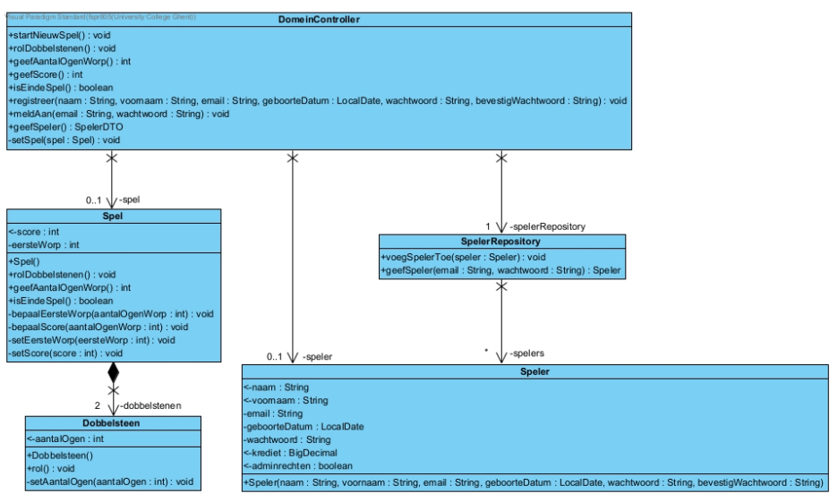

[Bijhorende powerpoint](./attachments/OOSD1_SlidesH5.ppsx)
#  Doelstellingen


- om **alle onderdelen** van een DCD correct te benoemen  
- om **de betekenis** van een DCD te begrijpen  
- om **een DCD op te bouwen** op iteratieve wijze met behulp van 3 GRASP-patronen: *controller*, *creator* en *expert*  
- om **een systeemoperatie** te definiëren met de correcte verantwoordelijkheid (*doing*/*knowing*)  
- om de systeemoperaties op te splitsen in **deelverantwoordelijkheden** die op het DCD kunnen geplaatst worden  
- om **een DCD om te zetten naar Java-code**  


# Ontwikkeling van het Design Class Diagram (DCD) met GRASP

## Inleiding

- Softwareontwikkeling wordt vaak uitgevoerd via een **iteratief proces**
	- waarbij het systeem **stapsgewijs wordt verfijnd en uitgebreid**. 
	- Elke iteratie doorloopt gestructureerde fasen zoals 
		- **Requirement Analysis**
		- **Design**
		- **Implementation**
		- **Testing**
	- Het **Design Class Diagram (DCD)** speelt een cruciale rol in het objectgeoriënteerde ontwerpproces door de structurele en functionele aspecten van het systeem te visualiseren. 
	- **GRASP (General Responsibility Assignment Software Patterns)** biedt richtlijnen voor het toewijzen van verantwoordelijkheden aan klassen binnen het DCD, wat bijdraagt aan een robuust en onderhoudbaar ontwerp.

## Fasen van Iteratieve Ontwikkeling

### Requirement Analysis

- De **Requirement Analysis** fase richt zich op het grondig begrijpen van de klantbehoeften en het vastleggen van duidelijke afspraken. 
- Dit vormt de basis voor alle volgende stappen in het ontwikkelingsproces.
- Dit is het vak Analyse

### Design

- In de **Design** fase wordt het ontwerpklassendiagram (DCD) ontwikkeld op basis van de analyseresultaten. 
- Het DCD vertaalt het conceptuele model naar een technisch ontwerp, klaar voor implementatie. 
- Belangrijke artefacten uit de analysefase dienen als fundament voor het ontwerp, zoals 
	- **Use Case Diagrammen**
	- **Domeinmodellen**
	- **Systeemsequentiediagrammen (SSD)** 
	- **Operation Contracts (OC’s)**

### Implementation en Testing

- **Implementation** betreft het vertalen van het DCD naar daadwerkelijke softwareklassen in een programmeertaal zoals Java. 

- **Testing** zorgt ervoor dat de geïmplementeerde functionaliteiten voldoen aan de specificaties en correct functioneren binnen het systeem.

## Design Class Diagram (DCD)

- **Design Class Diagram (DCD)** 
	- Het DCD dient als **blauwdruk voor de implementatiefase**
	- Zorgt voor een **coherente overgang van ontwerp naar code**.
	- visualiseert de structuur van het systeem door het  definiëren
		- `klassen`
		- `klassen hun attributen`
		- `methoden`
		- `klassen hun onderlinge relaties`

### Voorbeeld DCD

### Kenmerken van een DCD

- **Klassen en Attributen**: Definiëren de entiteiten en hun eigenschappen binnen het systeem.
- **Methoden**: Beschrijven het gedrag en de functionaliteit van de klassen.
- **Associaties**: Geven de relaties tussen klassen weer, inclusief multipliciteit en navigabiliteit.
- **Encapsulatie**: Waarborgt dat attributen privé zijn en via methoden toegankelijk, bevorderend voor gegevensintegriteit.

## GRASP-Principes

**GRASP** biedt patronen voor het effectief toewijzen van verantwoordelijkheden aan klassen binnen het DCD:

1. **Controller**:
    - Coördineert systeemgebeurtenissen en acties.
    - Functie als centraal aanspreekpunt voor systeemoperaties.
	    - Domeincontroller is de controller

2. **Expert**
    - Beheert en kent relevante informatie.
    - Verantwoordelijk voor het uitvoeren van specifieke taken op basis van expertise.
    - zal ons helpen om te bepalen wie welke verantwoordelijkheid precies kan opnemen
	    - In voorbeeld 
			-  Dobbelsteen is EXPERT van attribuut `aantalOgen`.  
		    - Spel is EXPERT van de twee dobbelstenen (we moeten de som kunnen maken).  
		    - Spel is EXPERT van attribuut `eersteWorp`.  
		    - DomeinController is EXPERT van spel. 
		    - Speler is Expert van zijn eigen attributen

2. **Creator**:
    - Verantwoordelijk voor het aanmaken van nieuwe objecten.
    - Toegewezen aan klassen die intensief gebruikmaken van of aggregaties beheren van het te creëren object.
	    - In voorbeeld
		    - DomeinController heeft alle nodige data om een `Speler`-object te maken
		    - Spel maakt een dobbelsteen

## Stappenplan voor Ontwikkeling van Systeemoperaties

### Stap 1: Identificeren van Verantwoordelijkheden (DOING & KNOWING)

- **DOING-verantwoordelijkheden**: Betrekken acties zoals het creëren, bijhouden of wijzigen van domeinobjecten.
- **KNOWING-verantwoordelijkheden**: Betrekken het kennen en teruggeven van informatie aan de gebruikersinterface.

### Stap 2: Definiëren van Methodesignaturen

- **DOING-methoden**:
    - **Naam**: Reflecteert de uitgevoerde actie.
    - **Parameters**: Afhankelijk van de vereiste input.
    - **Returntype**: `void`.

- **KNOWING-methoden**:
    - **Naam**: Beschrijft de verstrekte informatie.
    - **Parameters**: Meestal geen.
    - **Returntype**: Specifiek datatype of een Data Transfer Object (DTO).

### Stap 3: Toewijzen van Verantwoordelijkheden aan Klassen

- **Controller Pattern**:
    - Wijs de coördinatie van systeemoperaties toe aan een centrale controllerklasse.

- **Creator Pattern**:    
    - Wijs het aanmaken van nieuwe objecten toe aan de klasse die deze objecten beheert.

- **Expert Pattern**:    
    - Wijs verantwoordelijkheden toe aan de klasse die de meeste relevante informatie bezit om de taak uit te voeren.

## Implementatie Overwegingen

- **Encapsulatie**: Attributen zijn privé en toegankelijk via publieke methoden om gegevensintegriteit te waarborgen.
- **Data Transfer Objects (DTOs)**: Faciliteren gestructureerde en veilige gegevensoverdracht tussen lagen zonder directe blootstelling van domeinobjecten.
- **Consistentie en Semantische Integriteit**: Zorgvuldige vertaling van het DCD naar implementatie om de betekenis van relaties en verantwoordelijkheden te behouden.

## Conclusie

Het ontwikkelen van een **Design Class Diagram (DCD)** binnen een iteratief ontwikkelingsproces, ondersteund door **GRASP-principes**, zorgt voor een gestructureerd en onderhoudbaar softwaresysteem. Door verantwoordelijkheden systematisch toe te wijzen aan de juiste klassen, wordt een robuuste architectuur gecreëerd die voldoet aan de gestelde eisen en flexibel genoeg is voor verdere uitbreiding en verfijning.

In volgende iteraties zullen deze principes verder worden toegepast op aanvullende use cases, wat bijdraagt aan de continue groei en verbetering van het systeem.

# Samenvatting van Verantwoordelijkheidsassignatie

- Verantwoordelijkheidsassignatie is een fundamenteel aspect van objectgeoriënteerd ontwerp dat bijdraagt aan de structuur, flexibiliteit en onderhoudbaarheid van softwaresystemen. 
- Door het toepassen van GRASP-principes zoals Controller, Creator en Expert, kunnen ontwikkelaars verantwoordelijkheden effectief toewijzen, wat leidt tot robuuste en schaalbare architecturen.

## Stap 1: DOING/KNOWING

- **DOING**: = object(en) aanmaken/bijhouden/verwijderen of waarde(n) aanpassen.
    - Toewijzen wanneer een systeemoperatie acties uitvoert op domeinobjecten.
    - Criteria:
        1. Aanwezigheid van een Operation Contract (OC).
        2. Functionaliteit die domeinobjecten manipuleert.

- **KNOWING**: = waarde(n) teruggeven.
    - Toewijzen wanneer een systeemoperatie informatie verstrekt.
	    - Als de systeemoperatie op het SSD een returnpijl heeft, is er KNOWING-verantwoordelijkheid
	    - Bij loop of alternatief verloop: als er data moet worden teruggegeven uit het domein, is er KNOWING-verantwoordelijkheid.
    - Criteria:
        1. Terugkeerpijl in het Systeemsequentiediagram (SSD).
        2. Data-uitwisseling uit het domein.

**Regels**:

1. Een systeemoperatie kan 0, 1 of meerdere verantwoordelijkheden hebben.
2. Eén verantwoordelijkheid kan niet zowel DOING als KNOWING zijn.
3. Zonder DOING of KNOWING:
    - Geen methode in het DCD.
    - Geen aanpassingen in het domein.
    - Alleen wijzigingen in de applicatielaag.

## Stap 2: Definieer Methode

- **DOING-methoden**:
    - **Naam**: Beschrijft de actie.
    - **Parameters**: Alleen indien noodzakelijk.
    - **Returntype**: `void`.

- **KNOWING-methoden**:
    - **Naam**: Beschrijft de informatie.
    - **Parameters**: Alleen indien noodzakelijk.
    - **Returntype**: Specifiek datatype of DTO.


**Methodes in de DomeinController** die gegevens retourneren naar de UI moeten een primitief type, voorgedefinieerde Java-klasse, DTO of een verzameling hiervan als returntype hebben.

### DTO

- DTO:
	- Om verschillende types van data die samenhoren door te geven van de domeinlaag naar de applicatielaag dan doen we dit altijd via een DTO. 
		- Zo is er geen risico dat de applicatie methodes oproept uit het domein die eigenlijk niet toegestaan zijn.

	- In deze `record` (bv. `SpelerDTO`) plaatsen we alleen de waarden van de attributen, maar geen methodes. 
	- Zo kan de UI geen domeinmethodes aanroepen.  

1. **DTO definiëren als `record`**  
   ```java
   package dtos;                  
   import java.math.BigDecimal;

   public record SpelerDTO(String naam, String voornaam, BigDecimal krediet,boolean adminrechten) {}
```

2. **DTO aanmaken**
    
- Je maakt een DTO-object aan zoals elk ander Java-object, door de constructor aan te roepen:
        
```java
        // Voorbeeld
        new SpelerDTO(
            speler.getNaam(),
            speler.getVoornaam(),
            speler.getKrediet(),
            speler.isAdminrechten()
        );
```

3. **DTO gebruiken in je applicatie**
    
    - Stel dat je via de DomeinController een `SpelerDTO`-object terugkrijgt:
        
        ```java
        SpelerDTO spelerDTO = dc.geefSpeler();
        ```
        
    - Om de waarden uit dit `SpelerDTO`-object te halen, roep je simpelweg de _automatisch gegenereerde_ methodes aan (ze dragen dezelfde naam als het attribuut):
        
        ```java
        System.out.printf(
            "De speler met naam: %s %s heeft %s adminrechten en %.2f krediet",
            spelerDTO.voornaam(),
            spelerDTO.naam(),
            spelerDTO.adminrechten() ? "WEL" : "GEEN",
            spelerDTO.krediet()
        );
        ```
        
## Stap 3: Toewijzen van Deelverantwoordelijkheden

- **Controller Pattern**:
    - Centraliseer coördinatie van systeemoperaties in een `DomeinController`.

- **Creator Pattern**:
    - Wijs het creëren van objecten toe aan de klasse die deze beheert, zoals een repository.

- **Expert Pattern**:
    - Toewijzen aan de klasse die de meeste relevante informatie bezit voor de verantwoordelijkheid.


**Conclusie**: Door het systematisch toepassen van GRASP-patronen worden verantwoordelijkheden effectief toegewezen, wat leidt tot een consistent en onderhoudbaar ontwerp binnen het Design Class Diagram (DCD).


# Van DCD naar Java

### Van Design Class Diagram (DCD) naar Java: Theoretische Benadering

#### Inleiding

Het vertalen van een **Design Class Diagram (DCD)** naar Java-klassen is een fundamenteel proces binnen objectgeoriënteerd ontwerpen. Deze transformatie vereist een systematische toepassing van OOP-principes om een consistente en onderhoudbare codebasis te waarborgen.

#### Kernconcepten

1. **Klassen, Attributen en Methoden**
    
    - **Klassen**: Vertegenwoordigen entiteiten uit het DCD en worden geïmplementeerd als Java-klassen.
    - **Attributen**: Worden als privévelden (`private`) gedefinieerd binnen de klasse.
    - **Methoden**: Definiëren het gedrag van de klasse en zijn openbaar toegankelijk via getters en setters indien nodig.
    
    ```java
    public class VoorbeeldKlasse {
        private int attribuut;
    
        public VoorbeeldKlasse() {
            // Constructor
        }
    
        public int getAttribuut() {
            return attribuut;
        }
    
        public void setAttribuut(int attribuut) {
            this.attribuut = attribuut;
        }
    
        public void voorbeeldMethode() {
            // Methodeimplementatie
        }
    }
    ```
    
2. **Associaties**
    
    - **Eendelige Associaties**: Geïmplementeerd als objectreferenties.
    - **Veelvoudige Associaties**: Geïmplementeerd met verzamelingen zoals `List<>`.
    
    ```java
    public class Klant {
        private List<Order> orders;
    
        public Klant() {
            this.orders = new ArrayList<>();
        }
    
        public void voegOrderToe(Order order) {
            orders.add(order);
        }
    
        public List<Order> getOrders() {
            return orders;
        }
    }
    ```
    
3. **Encapsulatie**
    - Attributen zijn privé en toegankelijk via publieke methoden om gegevensintegriteit te waarborgen.
    - Bevordert loskoppeling en verhoogt de modulariteit van het systeem.

4. **Constructors**
    
    - Initialiseren van objecten met de benodigde attributen.
    - Ondersteunen van overloading om flexibiliteit bij objectcreatie te bieden.
    
    ```java
    public class Product {
        private String naam;
        private double prijs;
    
        public Product(String naam, double prijs) {
            this.naam = naam;
            this.prijs = prijs;
        }
    
        // Getters en Setters
    }
    ```
    

#### Implementatie Overwegingen

- **Consistentie**: Zorg ervoor dat de naamgeving en datatypes in de Java-code overeenkomen met die in het DCD.
- **Semantische Integriteit**: Behoud de betekenis van relaties en verantwoordelijkheden door nauwkeurige implementatie van associaties en methoden.
- **Verantwoordelijkheidsassignatie**: Toepassing van GRASP-patronen zoals **Controller**, **Creator**, en **Expert** voor het toewijzen van verantwoordelijkheden aan de juiste klassen.

#### Voorbeeld van Verantwoordelijkheidsassignatie met GRASP

- **Controller**: Beheert systeemoperaties en coördineert interacties tussen klassen.
- **Creator**: Verantwoordelijk voor het aanmaken van nieuwe objecten.
- **Expert**: Klassen die de meeste relevante informatie bezitten voor specifieke taken.

```java
public class DomeinController {
    private Spel spel;

    public void startNieuwSpel() {
        this.spel = new Spel();
    }

    public void rolDobbelstenen() {
        spel.rolDobbelstenen();
    }

    public int geefScore() {
        return spel.getScore();
    }
}

```

```java

public class Spel {
    private int score;
    private List<Dobbelsteen> dobbelstenen;

    public Spel() {
        this.score = 0;
        this.dobbelstenen = new ArrayList<>();
        // Initialisatie van dobbelstenen
    }

    public void rolDobbelstenen() {
        for (Dobbelsteen d : dobbelstenen) {
            d.rol();
        }
        // Logica voor scoreberekening
    }

    public int getScore() {
        return score;
    }
}

```

```java

public class Dobbelsteen {
    private int aantalOgen;

    public Dobbelsteen() {
        this.aantalOgen = 1;
    }

    public void rol() {
        // Implementatie van rollogica
    }

    public int getAantalOgen() {
        return aantalOgen;
    }
}
```

#### Conclusie

Het theoretisch vertalen van een **Design Class Diagram (DCD)** naar Java-klassen vereist een grondig begrip van objectgeoriënteerde principes en verantwoordelijkheidsassignatie. Door consistente naamgeving, juiste encapsulatie, en toepassing van GRASP-patronen, ontstaat een robuuste en onderhoudbare codebasis die naadloos aansluit op het ontwerpmodel.
# Conclusie

Deze theoretische en beknopte benadering van het ontwikkelen van een **Design Class Diagram (DCD)** met behulp van **GRASP-principes** binnen een iteratief ontwikkelingsproces biedt een solide basis voor het ontwerpen van robuuste en onderhoudbare softwaresystemen. Door verantwoordelijkheden zorgvuldig toe te wijzen en encapsulatie te handhaven, wordt de kwaliteit en schaalbaarheid van het ontwerp gewaarborgd.