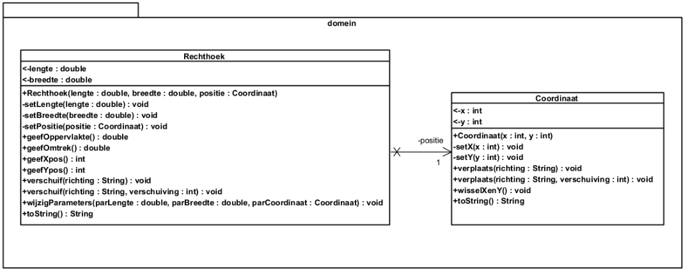
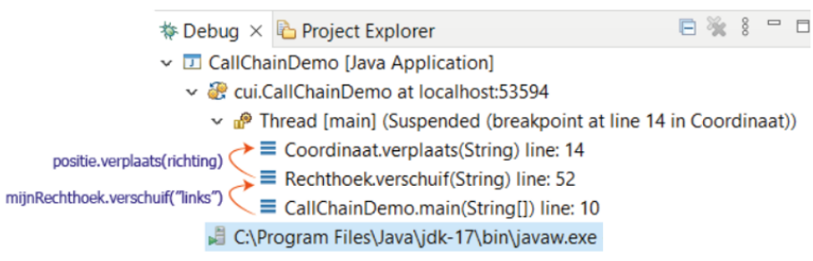
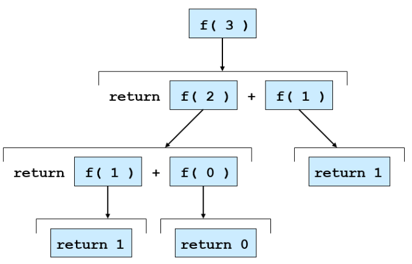
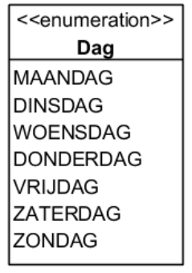
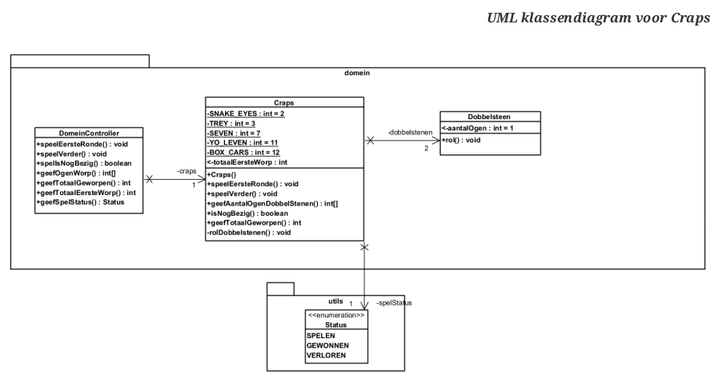

#  Doelstellingen


- een methode te declareren, te implementeren en te gebruiken in Java
- methodes te gebruiken met arrays
- verschillende API methodes te gebruiken
- een enum type te gebruiken

#  Inleiding
 
 >
>- Methodes omschrijven gedrag.
>
>- Elke definitie van een methode bevat de omschrijving van het gedrag in de vorm van een stukje code. 
>- Dit stukje code wordt uitgevoerd wanneer een methode wordt aangeroepen.
>
>- Het aanroepen van een methode gebeurt door de naam van de methode te gebruiken. 
>- Via een mechanisme van parameters kunnen bij het aanroepen van een methode ook waarden worden doorgegeven aan de methode.
>- Mogelijks retourneert een methode na uitvoering een resultaat terug naar de aanroeper.
>

- **Goede methodes hebben volgende eigenschappen**:

	- **de stukjes code zijn klein**, ze bevatten slechts een beperkt aantal regels code
		- het staat niet in steen gegrift maar **meestal zal zo’n stukje code niet meer dan 15 tot 20 lijntjes code** bevatten…

	- een methode **omschrijft één specifieke taak**
		- deze taak wordt heel duidelijk omschreven via een **welgekozen naam** voor de methode

## Rode draad: Rechthoek

- Doorheen dit hoofdstuk gaan we veel gebruik maken van de **domeinklassen** `Rechthoek` en `Coordinaat`.
	- Verschillende concepten die aan bod komen zullen worden toegepast op deze domeinklassen.

### UML domeinklassen Rechthoek & Coordinaat




### Code

#### public class Coordinaat

```java
package domein;

public class Coordinaat {
    private int x;
    private int y;

    public Coordinaat(int x, int y) {
        setX(x);
        setY(y);
    }

    public int getX() {
        return x;
    }

    public int getY() {
        return y;
    }

    private void setX(int x) {
        this.x = x;
    }

    private void setY(int y) {
        this.y = y;
    }

    public void verplaats(String richting) {
        verplaats(richting, 1);
    }

    public void verplaats(String richting, int verschuiving) {
        switch (richting) {
            case "boven" -> y += verschuiving;
            case "onder" -> y -= verschuiving;
            case "links" -> x -= verschuiving;
            case "rechts" -> x += verschuiving;
        }
    }

    public void wisselXenY() {
        int temp = x;
        x = y;
        y = temp;
    }

    @Override
    public String toString() {
        return String.format("x = %d, y = %d", x, y);
    }
}

```

#### public class Rechthoek

```java
package domein;

public class Rechthoek {
    private double lengte;
    private double breedte;
    private Coordinaat positie;

    public Rechthoek(double lengte, double breedte, Coordinaat positie) {
        setLengte(lengte);
        setBreedte(breedte);
        setPositie(positie);
    }

    public double getLengte() {
        return lengte;
    }

    public double getBreedte() {
        return breedte;
    }

    private void setLengte(double lengte) {
        this.lengte = lengte;
    }

    private void setBreedte(double breedte) {
        this.breedte = breedte;
    }

    private void setPositie(Coordinaat positie) {
        this.positie = positie;
    }

    public double geefOppervlakte() {
        return lengte * breedte;
    }

    public double geefOmtrek() {
        return 2 * (lengte + breedte);
    }

    public int geefXpos() {
        return positie.getX();
    }

    public int geefYpos() {
        return positie.getY();
    }

    public void verschuif(String richting) {
        positie.verplaats(richting);
    }

    public void verschuif(String richting, int verschuiving) {
        positie.verplaats(richting, verschuiving);
    }

    @Override
    public String toString() {
        return String.format("Rechthoek van %.2f op %.2f op coordinaat (%d, %d).",
                lengte, breedte, positie.getX(), positie.getY());
    }
}

```


# Declaratie van een methode

```java
private void setLengte(double lengte) {
	this.lengte = lengte;
}
```

- **access modifier**: `private`
- **return type**: `void`
- **naam**: `setLengte`
- **formele parameterlijst** met 1 parameter: `(double lengte)`
- methode **body**: `{this.lengte = lengte;}`
### Modifiers

Modifiers bepalen hoe en waar een methode toegankelijk is en hoe de methode zich gedraagt.

- **Access Modifiers**: Deze bepalen het niveau van toegankelijkheid van een methode:
    
    - **private**: De methode kan niet van buitenaf worden aangeroepen.
    - **public**: De methode kan van buitenaf worden aangeroepen.
- **Andere Modifiers**: In dit hoofdstuk leer je enkele andere modifiers kennen, zoals:
    
    - **static**: De methode behoort tot de klasse zelf en niet tot een instantie van de klasse.
    - **final**: De methode kan niet worden overschreven door een subclass.

### Returntype

Het returntype bepaalt welk datatype de methode retourneert.

- **Void**: Als de methode geen waarde retourneert, gebruik je **void** als returntype.

### Naam*

- De naam van de methode moet duidelijk en ondubbelzinnig aangeven wat de functie van de methode is.
- Goede namen maken de code leesbaar en begrijpelijk.

### Formele Parameterlijst

- De formele parameterlijst beschrijft de gegevens die de methode nodig heeft bij de aanroep.
- Het formaat van de lijst is een door komma’s gescheiden lijst van formele parameters, waarbij elke parameter een datatype en een naam heeft.
- Als de methode geen parameters nodig heeft, gebruik je lege ronde haakjes **()**.
### Body

- De body van een methode bevat het codeblok dat wordt uitgevoerd wanneer de methode wordt aangeroepen.
- Dit blok bevat de werkelijke logica van de methode.

Deze indeling maakt het gemakkelijker om de verschillende aspecten van methodes in Java te begrijpen en te onthouden. Elk onderdeel heeft zijn eigen functie en doel, waardoor je de structuur en opbouw van methodes beter kunt volgen.

## Method overloading

>
>**Method Overloading** betekent dat je **meerdere methodes** met **dezelfde naam** kunt hebben, **zolang de parameterlijst verschilt**.
>

- **Signatuur van een methode**: 
	- De naam van de methode en de lijst van formele parameters bepalen de signatuur. 
	- Het returntype maakt geen deel uit van de signatuur.

- **Method Overloading**: 
	- Wanneer je meerdere methodes met dezelfde naam hebt, maar met een verschillende parameterlijst (d.w.z. verschillende datatypes of een ander aantal parameters), spreken we van **method overloading**.

- **Vermijd duplicatie van code**. In het voorbeeld hieronder wordt duplicatie vermeden door de ene methode de andere aan te laten roepen, waardoor de code eenvoudiger te onderhouden en foutbestendiger wordt.
### Overloaded methodes (Foutieve versie)

- In dit voorbeeld wordt de methode `verplaats` twee keer gedeclareerd met dezelfde naam, maar de parameterlijst verschilt.

- **Probleem**: Beide methodes doen min of meer hetzelfde, met slechts een klein verschil: de ene methode gebruikt altijd een verschuiving van 1, de andere een variabele verschuiving.

```java
public void verplaats(String richting) {
    switch (richting) {
        case "boven" -> y += 1;
        case "onder" -> y -= 1;
        case "links" -> x -= 1;
        case "rechts" -> x += 1;
    }
}

public void verplaats(String richting, int verschuiving) {
    switch (richting) {
        case "boven" -> y += verschuiving;
        case "onder" -> y -= verschuiving;
        case "links" -> x -= verschuiving;
        case "rechts" -> x += verschuiving;
    }
}

```

### Overloaded methodes (zonder duplicatie van code)

- Een betere oplossing zou zijn om de logica voor het verplaatsen in één methode te plaatsen, en de andere methode door te verwijzen naar deze ene methode. 
	- Zo voorkom je duplicatie.

```java
public void verplaats(String richting) {
    verplaats(richting, 1);  // Roep de tweede versie van de methode aan met verschuiving = 1
}

public void verplaats(String richting, int verschuiving) {
    switch (richting) {
        case "boven" -> y += verschuiving;
        case "onder" -> y -= verschuiving;
        case "links" -> x -= verschuiving;
        case "rechts" -> x += verschuiving;
    }
}
```

# Aanroepen van een methode

>
>- **Methode-aanroep**: 
	- Je roept een methode aan met 
		- de **naam** en 
		- een lijst van **argumenten** (**actuele parameters**) **tussen haakjes**.
			- Deze waarden worden doorgegeven aan de formele parameters van de methode.
			- Pass by value
				- **Primitieve types**: alleen de waarde wordt gekopieerd.
			-Pass by Reference
				- **Objecten**: de referentie (adres) naar het object wordt gekopieerd, waardoor wijzigingen het object zelf beïnvloeden.
>
### Wat is Pass by Value?

- In Java gebeurt **"pass by value"** altijd wanneer je een methode aanroept. 
	- Dit betekent dat de **waarde** van de argumenten naar de methode wordt gekopieerd, en **niet het originele argument zelf**. 
	- Het hangt echter af van het type argument of dit een merkbaar verschil maakt:

		- **Primitieve types** (zoals `int`, `double`)
			- De waarde van de variabele wordt gekopieerd. 
			- Wijzigingen aan de variabele in de methode hebben geen invloed op het originele argument.

	    - **Objecten**: 
		    - De waarde die wordt doorgegeven is **de referentie** naar het object (het geheugenadres), niet het object zelf. 
		    - Dit betekent dat de methode een kopie krijgt van het adres van het object. 
		    - Als je het object via de kopie wijzigt, **wordt het originele object wel aangepast**.
    

### Voorbeeld met een primitief type (Pass by Value)

```java
public class PassByValueExample {
    public static void main(String[] args) {
        int nummer = 5;
        wijzigWaarde(nummer);
        System.out.println("Na de methode-aanroep: " + nummer);
    }

    public static void wijzigWaarde(int x) {
        x = 10;  // Wijzig de kopie van 'nummer'
    }
}
```

- **Wat gebeurt hier?**
    - De waarde van `nummer` (5) wordt gekopieerd naar `x` in de methode `wijzigWaarde`.
    - We veranderen `x` naar 10, maar dit heeft **geen invloed op** `nummer` in de `main`-methode.
    - De uitvoer is: **"Na de methode-aanroep: 5"** (de waarde van `nummer` blijft onveranderd).

**Waarom?**

- Omdat bij primitieve types, zoals `int`, alleen de waarde wordt gekopieerd. De originele variabele in de `main`-methode blijft onveranderd.

### Voorbeeld met een object (Pass by Value van referentie)

```java
public class PassByReferenceExample {
    public static void main(String[] args) {
        Coördinaten punt = new Coördinaten(1, 2);
        wijzigCoordinaten(punt); // Object wordt doorgegeven
        System.out.println("Na de methode-aanroep: " + punt);
    }

    public static void wijzigCoordinaten(Coördinaten c) {
        c.setX(10);  // Wijzig de eigenschappen van het object
    }
}

class Coördinaten {
    private int x, y;
    
    public Coördinaten(int x, int y) {
        this.x = x;
        this.y = y;
    }
    
    public void setX(int x) {
        this.x = x;
    }

    @Override
    public String toString() {
        return "x = " + x + ", y = " + y;
    }
}
```

- **Wat gebeurt hier?**
    - Het object `punt` wordt doorgegeven aan de methode `wijzigCoordinaten`.
    - Binnen de methode wijzig je de `x`-waarde van het object `punt` (nu verandert `punt.x` van 1 naar 10).
    - De uitvoer is: **"Na de methode-aanroep: x = 10, y = 2"**.

**Waarom?**

- Het object zelf wordt niet gekopieerd, maar de **referentie naar het object**. Dat betekent dat zowel de methode als de `main`-methode naar hetzelfde object wijzen. Als je het object via die referentie wijzigt, worden die veranderingen zichtbaar in het originele object.

### **Samenvatting**

- **Pass by value** betekent dat je altijd een **kopie** van de waarde van het argument doorgeeft aan de methode.
    - **Bij primitieve types**: De waarde wordt gekopieerd, dus wijzigingen hebben geen effect op de originele waarde.
    - **Bij objecten**: De **referentie** (adres) naar het object wordt gekopieerd, niet het object zelf. Wijzigingen aan het object via de kopie zijn dus zichtbaar voor het originele object.

Hopelijk maakt dit het duidelijker! Laat me weten als je meer uitleg nodig hebt!
# Uitvoering van een methode 

### Samenvatting 

- **Call Stack** wordt opgebouwd bij elke methode-aanroep.
- **Frames** bevatten informatie over de uitvoering van de methodes.
- **Methode beëindiging**: Bij voltooiing van een methode wordt het frame verwijderd, en het programma keert terug naar de plek van de methode-aanroep.

### Essentie

>
De **call stack** helpt de JVM om de volgorde van methodes te beheren en zorgt ervoor dat de uitvoering op de juiste plek verdergaat. Het begrijpen van de call stack is belangrijk voor debuggen.
>


### Uitvoering van een Methode

1. **Methode-aanroep**:
    - Bij een methode-aanroep wordt het huidige punt in de uitvoering van het programma vastgelegd.
    - De uitvoering van de methode begint zodra de parameters zijn doorgegeven.
    - Na voltooiing van de methode keert het programma terug naar het punt van de aanroep en gaat de uitvoering verder.

2. **Call Stack**:    
    - Elke methode-aanroep plaatst een **frame** op de **call stack**, die de informatie over de methode bevat.
    - De **JVM** gebruikt de call stack om de volgorde van uitvoering en de terugkeer naar de juiste plek in het programma te beheren.
    - De **call stack** speelt een cruciale rol bij het debuggen, omdat het je helpt te begrijpen waar je programma zich bevindt in de uitvoering.

3. **Call Chain**:    
    - De **call chain** is de reeks van methode-aanroepen die plaatsvond.
    - **Voorbeeld**:
        - `main()` roept `verschuif()` aan.
        - `verschuif()` roept `verplaats()` aan.
    - Elke aanroep plaatst een nieuw frame op de call stack. Zodra een methode voltooid is, wordt het frame verwijderd en gaat de uitvoering verder naar de plaats van de aanroep.

4. **Einde van een Methode**:    
    - De uitvoering van een methode stopt wanneer:
        - **Een return statement** wordt bereikt, en bij niet-`void` methodes een waarde wordt geretourneerd.
        - **Het einde van de methode** wordt bereikt zonder return statement, maar dit is alleen toegestaan voor `void` methodes.
    - **Fout**: Bij niet-`void` methodes moet elk pad naar het einde van de methode leiden naar een return statement. Anders krijg je een compileerfout.

## Lokale variabelen

>
>- In een methode kan je ook gebruik maken van lokale variabelen.
>	- Dit zijn **variabelen die gedeclareerd worden in het code blok van de methode**.
>

```java
//voorbeeld: lokale variabele in de methode wissel in klasse Coordinaat

public void wisselXenY() {
	int temp = x; //①
	x = y;
	y = temp;
}
```

- ① de lokale variabele temp wordt aan het begin van code blok geïnitializeerd 
	- met de x-waarde van de Coordinaat

>	
>- Formele parameters kan je beschouwen als een speciaal soort lokale variabelen
	 zoals hierboven werd beschreven krijgt een formele parameter bij aanroep een waarde toegekend
>	 
>- Lokale variabelen en parameters bestaan enkel tijdens de uitvoering van de methode
	- zodra de methode beëindigd wordt zijn parameters en lokale variabelen niet meer beschikbaar
	- een parameter of een lokale variabele van een methode kan dus nooit een waarde onthouden tussen verschillende aanroepen naar de methode
>	
>- Lokale variabelen krijgen geen default waarde toegekend bij declaratie, je moet ze zelf expliciet een initïele waarde geven
	- dit anders bij instantie variabelen die wel degelijk een default waarde krijgen bij instantiatie
>
# Scope van een declaratie

>
>- voor elke declaratie automatisch een scope is bepaald
>- De scope regels van Java bepalen op welke plaatsen je in je programma gebruik kan maken van een gedeclareerd item. 
	- We noemen dit de scope of het bereik van het gedeclareerde item.
>


### basisregels 


- **Scope van een Parameter**:
    - De scope van een parameter is beperkt tot *de body van de methode waarin de parameter gedeclareerd is*.

- **Scope van een Lokale Variabele**:    
    - De scope van een lokale variabele *begint bij de declaratie en eindigt aan het einde van het blok waarin deze is gedeclareerd*.

- **Scope van een Lokale Variabele in een For-lus**:    
    - Een variabele die in het initialisatiegedeelte van de **for-lus** wordt gedeclareerd, *is beschikbaar in zowel de header als de body van de for-lus*.

- **Scope van Methode- en Instanties Variabelen**:    
    - De scope van een methode en instantie variabele is de *volledige body van de klasse*. 
    - Dit betekent dat ze toegankelijk zijn voor alle methodes binnen de klasse.

## Naamgeving en het keyword this

- **Shadowing** kan leiden tot verwarring, maar met `this` kun je ervoor zorgen dat de juiste instantievariabele wordt aangesproken.

### Naamgeving en Scope-overlap
    
- Het is **niet toegestaan** om een lokale variabele in een methode te declareren met dezelfde naam als een formele parameter.

- Het **is wel toegestaan** om een lokale variabele of formele parameter dezelfde naam te geven als een **instantievariabele** binnen een methode.


 ### Shadowing
    
   - Wanneer een **lokale variabele of formele parameter dezelfde naam heeft als een instantievariabele**, wordt de instantievariabele "overschaduwd" binnen de scope van de methode. 
	   - Dit betekent dat de *instantievariabele niet meer zichtbaar is*.

   - Dit fenomeen wordt **shadowing** genoemd.

### Gebruik van `this`
    
  - Het **`this`** keyword **verwijst naar het huidige object**, dus je **kunt het gebruiken om een instantievariabele te benaderen**, 
	  - *zelfs wanneer deze wordt "overschaduwd" door een lokale variabele of formele parameter met dezelfde naam*.

	- **Voorbeeld**: `this.x = x` zorgt ervoor dat de waarde van de formele parameter `x` wordt toegewezen aan de instantievariabele `x`.

# Constructoren 

### Wat is een Constructor?

>
>- Een **constructor** is een speciaal soort methode die wordt gebruikt om een **instantie van een klasse te creëren**.
>- Een constructor **heeft geen return type**, ook geen `void`.
>- De naam van de constructor moet gelijk zijn aan de naam van de klasse.
>- Constructoren worden aangeroepen met het **keyword `new`**.
>

#### Voorbeeld van een Constructor
    
```java
    public class Rechthoek {
        private double lengte;
        private double breedte;
        private Coordinaat positie;
    
        public Rechthoek(double lengte, double breedte, Coordinaat positie) {
            setLengte(lengte);
            setBreedte(breedte);
            this.positie = positie; // Gebruik van 'this' verwijst naar de instantie
        }
    }
   
```
    
### Aanroep van een Constructor
    
- Constructoren worden aangeroepen met **`new`**:
    
    ```java
    Rechthoek mijnRechthoek = new Rechthoek(1, 1, new Coordinaat(1, 1));
    ```
    
### Default Waarden voor Instantie Variabelen
    
- Als een instantievariabele geen expliciete waarde krijgt, krijgt deze een **default waarde**:
     
| Type         | Default Waarde |
|--------------|----------------|
| **byte**     | 0              |
| **short**    | 0              |
| **int**      | 0              |
| **long**     | 0L             |
| **float**    | 0.0f           |
| **double**   | 0.0d           |
| **char**     | '\u0000'       |
| **boolean**  | false          |
| **reference type** | null     |
 
### Controle van Validiteit van Parameters
    
- Vaak wil je controleren of de parameters binnen geldige grenzen vallen bij de aanroep van de constructor.

	- **Voorbeeld**: Als de waarde van `x` in een `Coordinaat` buiten een geldig bereik valt, kun je dit afvangen.

 ### Probleem met Onjuiste Waarden
    
- In een simpel voorbeeld zou je de waarde aanpassen naar een default (zoals `0`), maar dit is geen robuuste oplossing omdat je dan niet weet dat er iets mis is gegaan.
- Een betere oplossing is het gebruik van **exceptions** om het probleem te melden in plaats van het programma stilletjes verder te laten gaan.

### Conclusie

- Constructoren in Java worden gebruikt om objecten te initialiseren en hebben geen returntype. 

- Het is belangrijk om de validiteit van parameters te controleren en bij fouten gebruik te maken van **exceptions** voor robuuste foutafhandeling.
# Exceptions

>
>- Exceptions helpen om fouten op te vangen en de uitvoering van het programma te stoppen als er iets mis is.
>- Het is essentieel om **exceptions te werpen** bij ongeldige input en **validatie** te doen om robuuste code te schrijven.
>
### Wat is een Exception?
    
   - Een **exception** wordt gebruikt om een fout of probleem aan te geven tijdens de uitvoering van een programma.
   - Het **werpt een exception** wanneer iets niet klopt, zoals ongeldige parameters bij het maken van een object.

### Werpen van een Exception
    
- Een exception wordt geworpen met het **`throw`** keyword.
	 **Voorbeeld**: Als de waarden voor `x` of `y` buiten een geldig interval vallen, kan een `IllegalArgumentException` worden geworpen.
	 
```java
	throw new IllegalArgumentException("x en y moeten in interval [-1000, 1000] liggen.");
```
    
### Effect van een Geworpen Exception
    
- Het **werpen van een exception stopt de normale uitvoering** van het programma.
- Als de exception niet wordt opgevangen, zal het programma stoppen.

### Afhandelen van Exceptions
    
- Later zal je leren hoe exceptions kunnen worden **opgevangen** en **afgehandeld** om het programma weer op de rails te krijgen.

### Vermijden van Duplicate Code
    
   - **Duplicate code** in setter-methodes kan worden vermeden door een aparte **hulpmethode** te maken voor validatie (bijvoorbeeld, `controleerGrenzen`).
    
```java
    private void controleerGrenzen(int waarde) {
        if (waarde < -1000 || waarde > 1000)
            throw new IllegalArgumentException("Waarde buiten geldig bereik.");
    }
```
    
### Robuuste Code en Domeinregels
    
- Domeinregels kunnen worden afgedwongen door exceptions te werpen in de setters, zoals het controleren van een positieve waarde voor lengte en breedte of een geldige positie voor een rechthoek.
    
```java
    private void setLengte(double lengte) {
        if (lengte <= 0)
            throw new IllegalArgumentException("Lengte moet strikt positief zijn.");
        this.lengte = lengte;
    }
```
    
### Verbetering van Code Door Setters
    
- Door gebruik te maken van setters voor variabele updates, kan je ervoor zorgen dat de objecten altijd aan de geldige regels voldoen
	- *bijvoorbeeld bij `public void verplaats`*.

- **CODE MET ZWAKHEDEN IN KLASSE COÖRDINAAT**
```java
//CODE MET ZWAKHEDEN IN KLASSE COÖRDINAAT
public void verplaats(String richting, int verschuiving) {
	switch (richting) {
		case "boven" -> y += verschuiving;
		case "onder" -> y -= verschuiving;
		case "links" -> x -= verschuiving;
		case "rechts" -> x += verschuiving;
	}
}
```

- **ROBUUSTE CODE: **
```java
public class Coordinaat {
	private int x;
	private int y;

	public Coordinaat(int x, int y) {
		setX(x);
		setY(y);
	}

	private void setX(int x) {
		controleerGrenzen(x);
		this.x = x;
	}
	
	private void setY(int y) {
		controleerGrenzen(y);
		this.y = y;
	}

//ROBUUSTE CODE
//-------------
//Door gebruik te maken van setters voor variabele updates, kan je ervoor zorgen dat de objecten altijd aan de geldige regels voldoen zoals hier onder bij verplaats
	public void verplaats(String richting, int verschuiving) {
        switch (richting) {
            case "boven" -> setY(y + verschuiving);
            case "onder" -> setY(y - verschuiving);
            case "links" -> setX(x - verschuiving);
            case "rechts" -> setX(x + verschuiving);
        } 
    }

	private void controleerGrenzen(int waarde) { ①
		if (waarde < -1000 || waarde > 1000)
			throw new IllegalArgumentException(String.format("x en y moeten in interval [%d, %d] liggen.",-1000, 1000));
	}

// andere methodes & constructor weggelaten voor plaatswinst
}    
```

# Het keyword static 

>
>- **`static` modifier** maakt het mogelijk 
	- om **variabelen en methoden** te declareren die **tot de klasse zelf** behoren
	- niet tot een specifieke instantie van de klasse.
	>
>- Deze variabelen en methoden worden **klasse variabelen** en **klasse methoden** genoemd.
>
>- **Static methoden** en **static variabelen** zijn **gemeenschappelijk voor alle instanties** van de klasse en niet gebonden aan individuele objecten van die klasse.
>
## Instantie variabelen en instantie methodes

- **Instantie variabelen** zijn uniek voor elk object, en **instanties methoden** gebruiken deze variabelen om objectgedrag te definiëren.
### Instantie Variabelen
    
   - De **toestand van een object** wordt opgeslagen in **instanties variabelen**.
   - Elke instantie (object) heeft zijn **eigen set** van instantie variabelen met **unieke waarden**.
    
   **Voorbeeld**:
    
```java
    Rechthoek rechthoek1 = new Rechthoek(10, 10, new Coordinaat(100, 0));
    Rechthoek rechthoek2 = new Rechthoek(300, 300, new Coordinaat(0, 0));
```
    
- **rechthoek1** en **rechthoek2** hebben dezelfde variabelen, maar met **verschillende waarden**.

### Instantie Methoden
    
- **Instantie methoden** definiëren het gedrag van objecten. Ze kunnen **aangeroepen worden op specifieke instanties** van een klasse.
    
**Voorbeeld**:
    
```java
    System.out.printf("Lengte van rechthoek1 is %.2f%n", rechthoek1.getLengte());
    System.out.printf("Lengte van rechthoek2 is %.2f%n", rechthoek2.getLengte());
```
    
- De **lengte van elke rechthoek** wordt opgevraagd via de **instanties** van `rechthoek1` en `rechthoek2`. De uitvoer toont de **verschillende waarden** voor de lengtes van de twee objecten.

## Static variabelen

>
>- *Klasse variabelen* zorgen voor **minder geheugenverbruik** en **makkelijker onderhoud** van de code
	- omdat je niet elke keer dezelfde waarde hoeft te herhalen. 
	- Het gebruik van **`static`** garandeert dat *de waarde gedeeld wordt door alle instanties van de klasse*.
>
### Klasse Variabelen in Java

- **`static` keyword** maakt het mogelijk om **klasse variabelen** te declareren die **gemeenschappelijk zijn voor alle instanties** van een klasse.

- Klasse variabelen behoren tot de **klasse zelf** en **niet** tot een specifiek object. 
	- Dit betekent dat **alle objecten** van de klasse dezelfde klasse variabelen delen.

### Voordelen van Klasse Variabelen

- **Toegang**: Elk object van de klasse kan klasse variabelen lezen of wijzigen, maar zelfs zonder een object kun je de klasse variabelen raadplegen of manipuleren.
- **Efficiëntie**: Klasse variabelen besparen **geheugen**, omdat ze slechts één keer worden opgeslagen, ongeacht het aantal objecten.

### Voorbeeld:**

```java
public class Coordinaat {
    private static int ondergrens = -1000;  // Klasse variabele
    private static int bovengrens = 1000;   // Klasse variabele
    private int x;
    private int y;

    private void setX(int x) {
        controleerGrenzen(x);
        this.x = x;
    }

    private void setY(int y) {
        controleerGrenzen(y);
        this.y = y;
    }

    private void controleerGrenzen(int waarde) {
        if (waarde < ondergrens || waarde > bovengrens)
            throw new IllegalArgumentException(
                String.format("x en y moeten in interval [%d, %d] liggen.", ondergrens, bovengrens));
    }
}
```

- **Waarom Klasse Variabelen?**
    - De **ondergrens** en **bovengrens** voor coördinaten zijn voor alle instanties hetzelfde. Het gebruik van klasse variabelen voorkomt **duplicatie** en zorgt ervoor dat deze waarden consistent blijven voor elke instantie.

## Static methodes

>
>- Static methoden zijn **klasse methoden** die niet afhankelijk zijn van een specifieke instantie. 
	- Ze kunnen niet naar **`this`** verwijzen of gebruik maken van **instantie variabelen** en **instantie methoden**. 
	- Ze worden aangeroepen via de **klassenaam**.
>
### Static Methodes in Java

- **`static` keyword** maakt het mogelijk om **klasse methoden** te declareren die tot de **klasse zelf** behoren, niet tot een specifieke instantie van de klasse.

### Belangrijke Kenmerken

- **Aangeroepen door de klassenaam**:
    
    - Static methoden worden aangeroepen via de **klassenaam**, niet via een object.
    - **Voorbeeld**: `Coordinaat.getOndergrens()`


- **Geen toegang tot instantie variabelen of methoden**:
    
    - Static methoden kunnen geen gebruik maken van **instantie variabelen** en **instantie methoden** van de klasse.


- **Geen referentie naar `this`**:
    
    - Static methoden kunnen niet verwijzen naar **`this`**, omdat `this` naar een instantie verwijst die niet bestaat voor een static methode.

### Voorbeeld van Static Methodes

```java
public class Coordinaat {
    private static int ondergrens = -1000;  // Static variabele - gedeeld door alle instanties
    private static int bovengrens = 1000;   // Static variabele - gedeeld door alle instanties
    private int x;  // Instantie variabele - uniek voor elke instantie
    private int y;  // Instantie variabele - uniek voor elke instantie

    // Static methode om de ondergrens te verkrijgen
    public static int getOndergrens() {
        return ondergrens;  // Retourneert de waarde van de static variabele 'ondergrens'
    }

    // Static methode om de bovengrens te verkrijgen
    public static int getBovengrens() {
        return bovengrens;  // Retourneert de waarde van de static variabele 'bovengrens'
    }

    // Static methode om de bovengrens te wijzigen
    public static void setBovengrens(int bovengrens) {
        Coordinaat.bovengrens = bovengrens;  // Wijzigt de static variabele 'bovengrens'
    }

    // Static methode om de ondergrens te wijzigen
    public static void setOndergrens(int ondergrens) {
        Coordinaat.ondergrens = ondergrens;  // Wijzigt de static variabele 'ondergrens'
    }
}

```

### Gebruik van Static Methodes

- Omdat **`ondergrens`** en **`bovengrens`** **static** variabelen zijn, worden ze gedeeld door **alle instanties** van de klasse `Coordinaat`. 
	- Dit betekent dat wanneer je deze waarden wijzigt via de **static methodes** (`setBovengrens()` en `setOndergrens()`), 
	- **de wijziging van toepassing is op alle objecten** van de `Coordinaat` klasse, ongeacht hoeveel objecten je hebt gemaakt.

```java
public class StaticApp {
    public static void main(String[] args) {
        // Aanroepen van static methodes zonder object
        System.out.printf("Coordinaten liggen in het interval [%d, %d]",
                          Coordinaat.getOndergrens(),  // Roept de static methode 'getOndergrens' aan
                          Coordinaat.getBovengrens());  // Roept de static methode 'getBovengrens' aan
        // Wijzig de static variabelen via de static methodes
        Coordinaat.setBovengrens(2000);  // Wijzigt de 'bovengrens' via de static methode
        Coordinaat.setOndergrens(-2000);  // Wijzigt de 'ondergrens' via de static methode
    }
}

```

### "static" VS  "niet static"(instance) methode

- De **tegenhanger van `static`** in Java is **instantie**. 
	- Waar een **`static` variabele of methode** behoort tot de **klasse zelf** en **gemeenschappelijk is voor alle objecten** van die klasse
	- behoort een **instantie variabele of methode** tot een **specifiek object** (de instantie) van die klasse

```java
public class Example {
    private static int staticVariable = 10;  // Klasse variabele
    private int instanceVariable = 20;      // Instantie variabele

    // Static methode
    public static void staticMethod() {
        System.out.println("Static Methode");
    }

    // Instantie methode
    public void instanceMethod() {
        System.out.println("Instantie Methode");
    }
}

public class Main {
    public static void main(String[] args) {
        // Static methode kan zonder object worden aangeroepen
        Example.staticMethod();

        // Voor instantie methode moet een object worden gemaakt
        Example obj1 = new Example();
        obj1.instanceMethod();

        // Static variabele wordt gedeeld door alle instanties
        Example obj2 = new Example();
        System.out.println(obj1.staticVariable);  // 10
        System.out.println(obj2.staticVariable);  // 10

        // Instantie variabele is uniek per object
        System.out.println(obj1.instanceVariable);  // 20
        System.out.println(obj2.instanceVariable);  // 20
    }
}

```
# Het keyword final 

>
>- **Final variabelen** zorgen ervoor dat de waarde **niet kan worden gewijzigd** nadat deze is geïnitialiseerd.
>- **Final** in combinatie met **`static`** wordt gebruikt om **constanten** te definiëren die gedeeld worden door **alle instanties** van de klasse en **niet kunnen worden gewijzigd**.
>
### Final Variabelen in Java

- **`final` modifier** wordt gebruikt om een variabele **onveranderlijk** te maken nadat deze is geïnitialiseerd.
    - Een **final variabele** kan niet meer worden gewijzigd nadat deze een waarde heeft gekregen.

### Kenmerken van Final Variabelen

- **Final instantie variabelen** moeten een waarde krijgen **voordat de constructor eindigt**:
    
    - De waarde kan worden toegekend **bij declaratie** of **in de body van de constructor**.
    - Het is niet mogelijk om een **setter** te maken voor een **final instantie variabele**.
- **Final referentievariabelen**:
    
    - De **referentie** kan niet worden gewijzigd na initialisatie, maar het **object** waarnaar verwezen wordt kan wel worden aangepast.

### Final Variabelen en Constants

- Het **`final` keyword** kan ook worden gebruikt in combinatie met **`static`** om **constanten** te definiëren:
    - Een constante is een **klasse variabele** die **niet kan worden gewijzigd**.
    - In Java is het gebruikelijk om de naam van een constante **compleet in hoofdletters** te schrijven, met underscores tussen de onderdelen.

### Voorbeeld van Final en Static Variabelen

```java
public class Coordinaat {
    public static final int ONDERGRENS = -1000;  // Constante
    public static final int BOVENGRENS = 1000;   // Constante
    private int x;
    private int y;

    public Coordinaat(int x, int y) {
        setX(x);
        setY(y);
    }

    private void setX(int x) {
        controleerGrenzen(x);
        this.x = x;
    }

    private void setY(int y) {
        controleerGrenzen(y);
        this.y = y;
    }

    private static void controleerGrenzen(int waarde) {
        if (waarde < ONDERGRENS || waarde > BOVENGRENS)
            throw new IllegalArgumentException(
                String.format("x en y moeten in interval [%d, %d] liggen.", ONDERGRENS, BOVENGRENS));
    }
}
```

### Gebruik van Final Constants

```java
public class StaticApp {
    public static void main(String[] args) {
        Rechthoek mijnRechthoek = new Rechthoek(10, 10, 
            new Coordinaat(Coordinaat.ONDERGRENS, Coordinaat.BOVENGRENS));  // Gebruik van constante
    }
}
```

# Reflectie - de main methode 

>
>- De **main methode** is het startpunt van je programma en wordt altijd statisch gedeclareerd.
>- Voor het gebruik van instantie variabelen en methoden in de main methode, moet je eerst een object van de klasse maken.
>
### Main Methode in Java

- De **main methode** is het startpunt van een Java programma en wordt altijd aangeroepen door de JVM bij het opstarten van het programma.
- De declaratie van de **main methode** is als volgt:
    
    ```java
    public static void main(String[] args)
    ```
    
    - **`static`**: De methode is **static** zodat de JVM geen object van de klasse hoeft te maken om het programma te starten.
    - **`String[] args`**: Dit is een parameterlijst waarmee je argumenten kunt doorgeven via de commandoregel of een IDE.

### Voorbeeld van de Main Methode

```java
public class StaticApp {
    public static void main(String[] args) {
        System.out.printf("Coordinaten liggen in het interval [%d, %d]",
                          Coordinaat.getOndergrens(),
                          Coordinaat.getBovengrens());
    }
}
```

### Gebruik van Instanties in de Main Methode

- Als je binnen de main methode gebruik wilt maken van instantie variabelen en methoden, moet je eerst een instantie van de klasse maken.

**Voorbeeld**:

```java
package cui;
import domein.Coordinaat;
import domein.Rechthoek;

public class StaticApp02 {
    private Rechthoek rechthoek;

    public static void main(String[] args) {
        StaticApp02 myApp = new StaticApp02();  // Maak een instantie van StaticApp02
        myApp.maakEnToonRechthoek();  // Roep een instantie methode aan
    }

    private void maakEnToonRechthoek() {
        this.rechthoek = new Rechthoek(10, 10, new Coordinaat(5, 5));
        System.out.printf("Deze instantie van rechthoek heeft een omtrek van %.2f", rechthoek.geefOmtrek());
    }
}
```

#### Uitleg:

- **Main Methode**: De **main methode** wordt aangeroepen zonder dat er een object van `StaticApp02` is.
- **Instantie Aanmaken**: In de main methode wordt een instantie van de klasse `StaticApp02` gemaakt (`myApp`), waarna een instantie methode (`maakEnToonRechthoek`) wordt aangeroepen.
- **Instantiemethode**: De methode **`maakEnToonRechthoek`** kan alleen via een instantie van `StaticApp02` worden aangeroepen, omdat het geen **static** methode is.

# Reflectie - de Java API 

- De **Java API** is een uitgebreide set van **klassen** en **methoden** die je kunt gebruiken om Java-programma’s te schrijven.

- Hoewel de specificatie **zeer uitgebreid** is en in het begin ontmoedigend kan lijken, zul je merken dat je je steeds **comfortabeler** voelt bij het raadplegen en gebruiken van de API.

- **Belangrijk**: Zorg ervoor dat je altijd de **API specificatie** gebruikt die overeenkomt met de **versie van de Java JDK** die je gebruikt.
    - Voor de juiste specificatie kun je de officiële Oracle documentatie raadplegen: [Java Platform](https://docs.oracle.com/en/java/javase/) en [Java API](https://docs.oracle.com/en/java/javase/21/docs/api/index.html)

 ## De klasse SecureRandom

>
>- **SecureRandom** wordt gebruikt om **veilige willekeurige getallen** te genereren, zoals voor cryptografische toepassingen of simulaties zoals dobbelsteenwerpen.
>
### SecureRandom Klasse in Java

- De **SecureRandom** klasse uit de **java.security** package biedt methodes om *willekeurige getallen en booleans te genereren*.

- Deze methoden  zijn **geen static methodes**. 
	-  Dit betekent dat je een **instantie van de SecureRandom klasse** moet maken om ze te gebruiken.
		- **nextInt**
		- **nextDouble**
		- **nextFloat**
		- **nextLong**
		- **nextBoolean** 

### Voorbeeld 1: Gebruik van SecureRandom

```java
package cui;
import java.security.SecureRandom; //Import van secure random

public class CirkelApp01 {
    public static void main(String[] args) {
        new CirkelApp01().werkMetRandom();
    }

    private void werkMetRandom() {
        final int MIN = 1;
        final int MAX = 100;
        SecureRandom random = new SecureRandom();  // Instantie van SecureRandom maken
        for (int i = 0; i < 10; i++) {
            int straal = random.nextInt(MIN, MAX + 1);  // Willekeurig geheel getal
            System.out.printf("Cirkel met straal %d%n", straal);
        }
    }
}
```

- **`nextInt(MIN, MAX + 1)`**: Deze methode retourneert een willekeurig geheel getal in het interval **[MIN, MAX]**.

### Voorbeeld 2: Simulatie van Dobbelsteen Werpen

```java
package cui;
import java.security.SecureRandom;

public class SecureRandomDemo {
    public static void main(String[] args) {
        new SecureRandomDemo().werkMetSecureRandom();
    }

    private void werkMetSecureRandom() {
        SecureRandom randomNumbers = new SecureRandom();
        int frequentie[] = new int[6];  // Frequentietabel voor 6 dobbelsteen zijden
        for (int i = 1; i <= 6000000; i++) {
            ++frequentie[randomNumbers.nextInt(6)];  // Willekeurig getal tussen 0 en 5
        }
        System.out.printf("%s%25s%n", "Worp", "Aantal keer geworpen");
        for (int i = 0; i < frequentie.length; i++) {
            System.out.printf("%3d%15d%n", i + 1, frequentie[i]);
        }
    }
}
```

- **`nextInt(6)`** genereert een willekeurig getal tussen **\[0, 6)**, wat simuleert hoe vaak elke zijde van de dobbelsteen is geworpen.

**output**

```
Worp    Aantal keer geworpen
  1        999633
  2        999311
  3        998815
  4       1001811
  5       1000234
  6       1000196
```

### Voorbeeld 3: Dobbelsteen 1 keer Werpen

```java
import java.security.SecureRandom;

public class Dobbelsteen {
    public static void main(String[] args) {
        SecureRandom random = new SecureRandom();
        
        // Eén keer de dobbelsteen werpen
        int worp = random.nextInt(6) + 1; // Willekeurig getal tussen 1 en 6
        System.out.println("De dobbelsteenworp is: " + worp);
    }
}

```

- **`random.nextInt(6) + 1;`**: Dit genereert een willekeurig getal tussen **1** en **6**. 
	- De **`nextInt(6)`** geeft een getal tussen **0** en **5**, en door **1 toe te voegen** krijg je een getal tussen **1** en **6**.

- De dobbelsteen wordt maar **één keer geworpen** en de uitkomst wordt direct weergegeven.
### Goed om te weten

- De **`nextDouble(min, max)`** methode retourneert een willekeurig decimaal getal tussen de **min** en **max** waarden.

## De klasse Math

>
>- De **Math** klasse biedt nuttige methoden en constanten voor wiskundige berekeningen zonder dat een object van de klasse nodig is.
>
### Math Klasse in Java

- De **Math** klasse bevat **publieke constanten** en een scala aan **static methods** voor wiskundige berekeningen.
- Een voorbeeld van een **publieke constante** is **`public static final double PI`**.
- Methoden in de **Math** klasse zijn **klasse methoden** en kunnen dus zonder instantie van de klasse worden aangeroepen.

### Voorbeeld Math Gebruiken

```java
package cui;
import java.security.SecureRandom;

public class CirkelApp02 {
    public static void main(String[] args) {
        new CirkelApp02().werkMetMath();
    }

    private void werkMetMath() {
        SecureRandom random = new SecureRandom();
        final int MIN = 1;
        final int MAX = 100;
        
        for (int i = 0; i < 10; i++) {
            double straal = random.nextDouble(MIN, MAX);
            System.out.printf("Een cirkel met straal %.2f heeft een oppervlakte van %.2f.%n", 
                              straal, Math.PI * Math.pow(straal, 2));
        }
    }
}
```

### Uitleg:

- **`Math.PI`** geeft de waarde van pi, die constant is.
- **`Math.pow(straal, 2)`** berekent de **kwadraat** van de straal, wat wordt gebruikt om de oppervlakte van de cirkel te berekenen.

## De klasse BigDecimal

>
>- **BigDecimal** biedt **exacte precisie** voor decimale getallen, ideaal voor berekeningen die nauwkeurigheid vereisen, zoals geldbedragen.
>- Het biedt methoden voor wiskundige bewerkingen die nauwkeuriger zijn dan standaard **float** of **double** methoden.
>
### BigDecimal in Java

- **BigDecimal** uit de **java.math** package is een geschikt datatype voor het werken met **willekeurig grote decimale getallen** en biedt **exacte precisie**. Het is vooral nuttig voor situaties waarin nauwkeurigheid vereist is, zoals het representeren van **geldwaarden**.
    
- **Float** en **double** zijn ongeschikt voor exacte berekeningen, omdat ze **beperktere precisie** bieden.
    

### Voorbeeld: BigDecimal Constructor

```java
import java.math.BigDecimal;

public class HalloBigDecimal {
    public static void main(String[] args) {
        new HalloBigDecimal().werkMetBigDecimal();
    }

    private void werkMetBigDecimal() {
        BigDecimal bd1 = new BigDecimal("0.123"); // String als argument
        BigDecimal bd2 = new BigDecimal(0.0587);  // double als argument
        BigDecimal bd3 = new BigDecimal(2500);    // int als argument
        System.out.printf("bd1 = %f%nbd2 = %f%nbd3 = %f%n", bd1, bd2, bd3);
    }
}
```

### Voorbeeld: BigDecimal valueOf Methode

- **`BigDecimal.valueOf(double)`** is de aanbevolen manier om een **BigDecimal** van een **double** te maken, omdat deze nauwkeuriger is dan de constructor.

```java
BigDecimal bd4 = new BigDecimal(0.1);
BigDecimal bd5 = BigDecimal.valueOf(0.1);
System.out.printf("bd4 = %.30f%nbd5 = %.30f%n", bd4, bd5);
```

### Wiskundige Bewerkingen met BigDecimal

- Voor wiskundige bewerkingen, zoals **optellen**, **aftrekken**, **vermenigvuldigen** en **delen**, moet je de respectieve methoden gebruiken, zoals **add**, **subtract**, **multiply** en **divide**.

### Voorbeeld: Jaarlijkse Interest Berekenen

```java
public static void main(String[] args) {
    new Interest().berekenIntrest();
}

private void berekenIntrest() {
    BigDecimal principal = BigDecimal.valueOf(1000.0);
    BigDecimal rate = BigDecimal.valueOf(0.05);
    System.out.printf("%s%20s%n", "Year", "Amount on deposit");
    for (int year = 1; year <= 10; year++) {
        BigDecimal amount = principal.multiply(rate.add(BigDecimal.ONE).pow(year));
        System.out.printf("%4d%20s%n", year, NumberFormat.getCurrencyInstance().format(amount));
    }
}
```

**output**

```
Year Amount on deposit
   1         $1,050.00
   2         $1,102.50
   3         $1,157.62
   4         $1,215.51
   5         $1,276.28
   6         $1,340.10
   7         $1,407.10
   8         $1,477.46
   9         $1,551.33
  10         $1,628.89
```


# Case study 1 - arrays en methodes 


- **Arrays** zijn objecten in Java. Een arrayvariabele bevat een **referentie** naar een verzameling elementen.

- Wanneer een array wordt doorgegeven aan een methode
	- kan de **inhoud van de array worden gewijzigd**
	- maar de **referentie naar de array kan niet worden gewijzigd** (*pass-by-value*).

### Voorbeeld 1: Doorgeven van een Array bij Methode Aanroep

```java
public class ArrayApp01 {
    public static void main(String[] args) {
        int[] getallen = { 1, 2, 3, 4, 5 };
        System.out.printf("Array als argument bij methode aanroep:%n");
        System.out.printf(" getallen bevat: %s%n", geefAlsString(getallen));
    }

    public static String geefAlsString(int[] array) {
        String resultaat = "[";
        for (int i = 0; i < array.length; i++) {
            resultaat += String.format("%d%s", array[i], i == array.length - 1 ? "" : ", ");
        }
        resultaat += "]";
        return resultaat;
    }
}
```

- De methode **`geefAlsString`** ontvangt de array als argument en **leest de inhoud**, zonder deze te wijzigen.

**Output**

```
Array als argument bij methode aanroep:
  getallen bevat: [1, 2, 3, 4, 5]
```

### Voorbeeld 2: Wijzigen van de Array Referentie

```java
public static void main(String[] args) {
    int[] getallen = { 1, 2, 3, 4, 5 };
    System.out.printf("Voor aanroep, getallen bevat: %s%n", geefAlsString(getallen));
    wijzigReferentieDoorgegevenArray(getallen);
    System.out.printf("Na aanroep, getallen bevat: %s%n", geefAlsString(getallen));
}

private static void wijzigReferentieDoorgegevenArray(int[] doorgegevenArray) {
    doorgegevenArray = new int[100];  // Wijzigt de referentie
}
```

- **De array referentie** wordt gewijzigd, maar de originele array wordt **niet beïnvloed** door deze wijziging.

### Voorbeeld 3: Wijzigen van de Array Inhoud

```java
public static void main(String[] args) {
    int[] getallen = { 1, 2, 3, 4, 5 };
    System.out.printf("Voor aanroep, getallen bevat: %s%n", geefAlsString(getallen));
    wijzigInhoudDoorgegevenArray(getallen);
    System.out.printf("Na aanroep, getallen bevat: %s%n", geefAlsString(getallen));
}

public static void wijzigInhoudDoorgegevenArray(int[] doorgegevenArray) {
    for (int i = 0; i < doorgegevenArray.length; i++) {
        doorgegevenArray[i] *= 2;  // Verdubbel de inhoud
    }
}
```

- **De inhoud van de array** wordt gewijzigd, omdat de array wordt doorgegeven via **pass-by-reference**.

### Conclusie

- Wanneer een array wordt doorgegeven aan een methode, kan de **inhoud worden gewijzigd**, maar de **referentie** naar de array zelf kan niet worden aangepast.
- **Arrays** worden doorgegeven via **pass-by-value**, maar doordat ze objecten zijn, kunnen ze **muteren** als ze als **referentie** worden doorgegeven.

# Case study 2 - twee-dimensionale arrays en methodes

>
>- Je leert hoe je **twee-dimensionale arrays** gebruikt om gegevens zoals **studenten en hun cijfers** voor meerdere testen op te slaan.
>- De **`GradeBook`** klasse bevat methoden voor:
    - Het **berekenen van gemiddelden**.
    - Het **zoeken van het laagste en hoogste cijfer**.
    - Het **genereren van uitvoer** met gegevens en staafdiagrammen.
>
### GradeBook Applicatie

Dit is de hoofdapplicatie die de gegevens van de studenten verwerkt en de uitvoer genereert:

```java
package cui;
import domein.GradeBook;

public class GradeBookApplicatie {
    public static void main(String[] args) {
        // Twee-dimensionale array van studentencijfers (10 studenten, 3 testen)
        int[][] gradesArray = {
            { 87, 96, 70 }, { 68, 87, 90 }, { 94, 100, 90 },
            { 100, 81, 82 }, { 83, 65, 85 }, { 78, 87, 65 },
            { 85, 75, 83 }, { 91, 94, 100 }, { 76, 72, 84 }, { 87, 93, 73 }
        };

        // GradeBook object aanmaken met de naam van de cursus en de array met cijfers
        GradeBook myGradeBook = new GradeBook("CS101 Introduction to Java Programming", gradesArray);

        // Welkomstbericht tonen
        System.out.printf("Welcome to the grade book for%n%s%n%n", myGradeBook.getCourseName());

        // Bouw en toon de volledige uitvoer
        System.out.printf(myGradeBook.buildOutput());
    }
}
```

### GradeBook Klasse (Met Methoden)

Hier is de **GradeBook** klasse die de methoden bevat voor het verwerken van de cijfers en het genereren van de uitvoer.

```java
package domein;

public class GradeBook {
    private String courseName;
    private int[][] grades;

    // Constructor
    public GradeBook(String courseName, int[][] grades) {
        this.courseName = courseName;
        this.grades = grades;
    }

    // Methode om het gemiddelde van een student te berekenen
    public double calculateAverage(int setOfGrades[]) {
        int total = 0;
        for (int grade : setOfGrades) {
            total += grade;
        }
        return (double) total / setOfGrades.length;
    }

    // Zoek het laagste cijfer
    public int searchMinimum() {
        int lowGrade = grades[0][0];
        for (int[] studentGrades : grades) {
            for (int grade : studentGrades) {
                if (grade < lowGrade) {
                    lowGrade = grade;
                }
            }
        }
        return lowGrade;
    }

    // Zoek het hoogste cijfer
    public int searchMaximum() {
        int highGrade = grades[0][0];
        for (int[] studentGrades : grades) {
            for (int grade : studentGrades) {
                if (grade > highGrade) {
                    highGrade = grade;
                }
            }
        }
        return highGrade;
    }

    // Methode om de volledige uitvoer te bouwen
    public String buildOutput() {
        String output = buildOutputGrades();
        output += String.format("%n%s %d%n%s %d%n%n", "Lowest grade in the grade book is", searchMinimum(),
            "Highest grade in the grade book is", searchMaximum());
        output += buildOutputBarChart();
        return output;
    }

    // Methode om de cijfers per student weer te geven
    public String buildOutputGrades() {
        String output = "The grades are:%n%n";
        output += String.format("%-15s %-8s %-8s %-8s %s%n", "Student", "Test 1", "Test 2", "Test 3", "Average");

        for (int student = 0; student < grades.length; student++) {
            output += String.format("Student %2d", student + 1);
            for (int test : grades[student]) {
                output += String.format("%8d", test);
            }
            double average = calculateAverage(grades[student]);
            output += String.format("%9.2f%n", average);
        }
        return output;
    }

    // Staafdiagram voor de verdeling van de cijfers
    public String buildOutputBarChart() {
        String output = "Overall grade distribution:%n";
        int[] frequency = new int[11];  // Frequentie van cijfers
        for (int[] studentGrades : grades) {
            for (int grade : studentGrades) {
                ++frequency[grade / 10];
            }
        }
        for (int count = 0; count < frequency.length; count++) {
            if (count == 10) {
                output += String.format("%5d: ", 100);
            } else {
                output += String.format("%02d-%02d: ", count * 10, count * 10 + 9);
            }
            for (int stars = 0; stars < frequency[count]; stars++) {
                output += "*";
            }
            output += "%n";
        }
        return output;
    }

    public String getCourseName() {
        return courseName;
    }
}
```

### Uitleg van de Methoden

- **`calculateAverage()`**: Berekent het gemiddelde van de cijfers van een student.
- **`searchMinimum()`**: Zoekt het laagste cijfer in de array.
- **`searchMaximum()`**: Zoekt het hoogste cijfer in de array.
- **`buildOutput()`**: Combineert alle gegevens, inclusief cijfers, minimum en maximum, en het staafdiagram van de cijfers.
- **`buildOutputGrades()`**: Toont de cijfers van de studenten, inclusief hun gemiddelde.
- **`buildOutputBarChart()`**: Genereert een **staafdiagram** van de puntenverdeling.

### Samenvatting

- Je leert hoe je **twee-dimensionale arrays** gebruikt om gegevens zoals **studenten en hun cijfers** voor meerdere testen op te slaan.
- De **`GradeBook`** klasse bevat methoden voor:
    - Het **berekenen van gemiddelden**.
    - Het **zoeken van het laagste en hoogste cijfer**.
    - Het **genereren van uitvoer** met gegevens en staafdiagrammen.
# Recursie 


## Wat is recursie?

>
Recursie is dus een techniek waarbij een methode zichzelf gebruikt om een complex probleem op te lossen, met een basisgeval als eindconditie.
>

### Verdieping

- **Recursie** treedt op wanneer een probleem wordt gedefinieerd in termen van zichzelf. 
	- In programmeertaal betekent dit dat een **methode zichzelf aanroept** om een probleem op te lossen.
    
- **Basisgeval**:
		-Het punt waarop de recursie stopt. 
			- De methode doet **geen recursieve aanroep meer** en geeft de uiteindelijke waarde terug. 
			-Dit is essentieel om een **oneindige recursie** te voorkomen. 

    - Een recursieve methode bevat een oplossing voor het **basisprobleem**, waar de methode zichzelf **niet aanroept**. 
	        - Er is een **test** om te controleren of de basisconditie bereikt is.

- **Recursieve Aanroep**:
    - Voor complexere problemen
	    - **roept de methode zichzelf aan** met een vereenvoudigde versie van het probleem.
	    - De eenvoudigere versies moeten uiteindelijk het **basisprobleem** bereiken.

- **Niet altijd toepasbaar**:
    - Recursie is niet altijd de juiste techniek, maar sommige problemen zijn van nature geschikt voor recursieve oplossingen.


### Voorbeeld

De **factorial** van een getal `n` (genoteerd als `n!`) is het product van alle positieve gehele getallen die kleiner zijn dan of gelijk aan `n`. Bijvoorbeeld:

- 5! = 5 × 4 × 3 × 2 × 1 = 120


```java
public class FactorialTest {

    // Recursieve methode om de factorial van een getal te berekenen
    public int factorial(int n) {
        // Basisgeval: als n gelijk is aan 0 of 1
        if (n == 0 || n == 1) {
            return 1;
        }
        // Recursieve aanroep: de methode roept zichzelf aan
        return n * factorial(n - 1);
    }

    public static void main(String[] args) {
        FactorialTest test = new FactorialTest();

        // Testen van de factorial methode
        int number = 5; // je kunt hier elk getal proberen
        int result = test.factorial(number);

        // Print de output
        System.out.println("Factorial van " + number + " is: " + result);
    }
}
```

- **Basisgeval**: 
	- Wanneer `n` gelijk is aan **0** of **1**
		- retourneert de methode **1**. 
		- Dit is de **stopconditie** van de recursie.

- **Recursieve aanroep**: 
	- Als `n` groter is dan **1**
		- roept de methode zichzelf aan met **`n - 1`** en vermenigvuldigt de waarde van `n` met het resultaat van de recursieve aanroep.

#### Wat gebeurt er als je `factorial(5)` aanroept?

Laten we de methode stap voor stap doorlopen:

1. **`factorial(5)`**:
    - `n` is niet 0 of 1, dus we gaan door naar de recursieve aanroep.
    - Het resultaat is `5 * factorial(4)`.
2. **`factorial(4)`**:
    - `n` is niet 0 of 1, dus we roepen de methode opnieuw aan.
    - Het resultaat is `4 * factorial(3)`.
3. **`factorial(3)`**:
    - `n` is niet 0 of 1, dus we roepen de methode opnieuw aan.
    - Het resultaat is `3 * factorial(2)`.
4. **`factorial(2)`**:
    - `n` is niet 0 of 1, dus we roepen de methode opnieuw aan.
    - Het resultaat is `2 * factorial(1)`.
5. **`factorial(1)`**:
    - `n` is 1, dus het basisgeval wordt bereikt en de methode retourneert **1**.

## Voorbeeld 1: Faculteit

>
>- **Faculteit (n!)** is het product van alle getallen van 1 tot en met n. Bijvoorbeeld:
    - 5! = 5 × 4 × 3 × 2 × 1 = 120.
>- **Recursieve definitie**:
    - n! = n * (n-1)!
    - Basisgeval: n! = 1 voor n = 0.
>
### Recursieve Methode in Code

```java
public long faculteit(int getal) {
    if (getal == 0)  // Basisgeval
        return 1;  // Oplossing voor basisgeval
    return getal * faculteit(getal - 1);  // Recursieve aanroep voor eenvoudiger geval
}
```

- **Stap 1**: Testen of het **basisgeval** (n = 0) is bereikt.
- **Stap 2**: Als n = 0, retourneer 1 (oplossing).
- **Stap 3**: Anders, roep de methode opnieuw aan met `getal - 1`.

### Aandachtspunten:

- **Recursieve aanroepen** moeten altijd leiden tot het bereiken van het basisgeval (n = 0), anders raakt de methode in een **oneindige loop**.
- Als de methode bijvoorbeeld met een negatief getal wordt aangeroepen, zal het programma nooit het basisgeval bereiken en kan het leiden tot een **StackOverflowError**.
- **Exception handling** kan worden gebruikt om **ongeldige invoer** (zoals negatieve getallen) af te handelen.

### Verbeterde Methode met Exception Handling:

```java
public long faculteit(int getal) {
    if (getal < 0)  // Check voor negatieve getallen
        throw new IllegalArgumentException("Geen natuurlijk getal");
    if (getal == 0)  // Basisgeval
        return 1;
    return getal * faculteit(getal - 1);  // Recursieve aanroep
}
```

### Samenvatting:

- **Recursie** wordt gebruikt om faculteiten te berekenen door het probleem op te splitsen in eenvoudigere gevallen.
- Het **basisgeval** voorkomt oneindige recursie.
- Met **exception handling** kun je de methode robuuster maken door ongeldig invoer (zoals negatieve getallen) af te vangen.
## Voorbeeld 2: Fibonacci

>
>- **Fibonacci-reeks**: De reeks begint met 0 en 1, en elk volgend getal is de som van de twee voorgaande getallen:
    - 0, 1, 1, 2, 3, 5, 8, 13, 21, ...
>
>- **Recursieve definitie**:
    - **fibonacci(n)** = **fibonacci(n-1)** + **fibonacci(n-2)** voor **n > 1**
    - **fibonacci(0) = 0** en **fibonacci(1) = 1** (basisgevallen)
>


### Recursieve Methode in Code

```java
public long fibonacci(int getal) {
    if ((getal == 0) || (getal == 1))  // Basisgeval
        return getal;  // Teruggeven van 0 of 1
    return fibonacci(getal - 1) + fibonacci(getal - 2);  // Recursieve aanroep
}
```

- **Stap 1**: Testen of het **basisgeval** (n = 0 of n = 1) is bereikt.
- **Stap 2**: Als n = 0 of n = 1, retourneer het getal.
- **Stap 3**: Anders, roep de methode opnieuw aan met `getal - 1` en `getal - 2`.

### Verbeterde Methode met Exception Handling:

```java
public long fibonacci(int getal) {
    if (getal < 0)
        throw new IllegalArgumentException("Geen natuurlijk getal");  // Ongeldige invoer
    if ((getal == 0) || (getal == 1))  // Basisgeval
        return getal;
    return fibonacci(getal - 1) + fibonacci(getal - 2);  // Recursieve aanroep
}
```

### Samenvatting:

- De **Fibonacci-reeks** wordt **recursief berekend** door het probleem op te splitsen in eenvoudigere gevallen.
- Het **basisgeval** voorkomt oneindige recursie door direct een resultaat te geven voor n = 0 of n = 1.
- **Exception handling** kan worden gebruikt om **ongeldige invoer** (zoals negatieve getallen) af te vangen.
# Promotie en casting 

>
>- **Promotie** gebeurt automatisch in Java wanneer een kleiner type wordt omgezet naar een groter type.
>
>- **Casting** wordt gebruikt om een type expliciet om te zetten naar een ander type, maar kan leiden tot verlies van gegevens.
>

### Promotie
    
   - **Promotie** is het proces waarbij Java automatisch een lagere datatype naar een hoger datatype converteert bij methode-aanroepen. 
	   - Bijvoorbeeld, bij het gebruik van de **`Math.pow()`** methode, kunnen **`int`** argumenten automatisch worden gepromoot naar **`double`**.
    
   **Voorbeeld**:
    
   ```java
    int a = 2, b = 5;
    System.out.println(Math.pow(a, b));  // Uitvoer: 32.0
    ```
    
- Java voert automatisch de conversie uit naar **`double`** bij de methode-aanroep.

#### Promotieregels
    
- Java promoot variabelen naar een hoger type volgens een bepaalde volgorde:
    - `int` kan gepromoot worden naar `long`, `float`, of `double`.
    - `char` kan gepromoot worden naar `int`, `long`, `float`, of `double`.
    - `boolean` heeft geen promoties omdat het geen getal is.
   - Deze regels worden ook toegepast in **gemengde expressies**.

##### Toegestane promotie
| Type     | Toegelaten promoties                             |
|----------|--------------------------------------------------|
| **double** | geen                                             |
| **float**  | double                                           |
| **long**   | float of double                                  |
| **int**    | long, float, of double                           |
| **char**   | int, long, float, of double                      |
| **short**  | short, int, long, float, of double (niet naar char!) |
| **byte**   | short, int, long, float, of double (niet naar char!) |
| **boolean**| geen (boolean waarden zijn geen getallen in Java)  |

#### Voorbeeld:

```java
    int intValue = 2;
    double doubleValue = 6.75;
    doubleValue += intValue;  // int wordt gepromoot naar double
```
    
#### Verlies van Informatie
    
- Bij **promotie** naar een groter type is er **geen verlies van gegevens** (bijvoorbeeld van `int` naar `double`).

## Casting

### Soorten

- **Primitive type casts** worden gebruikt om verschillende primitieve datatypes te converteren.
	- **Automatische (implicit) cast** gebeurt bij het omzetten naar een groter type, zoals van `int` naar `long`.
	- **Expliciete (narrowing) cast** wordt gebruikt bij het omzetten naar een kleiner type, zoals van `double` naar `int`, en vereist een expliciete cast operator.

- **Object type casts** worden gebruikt om objecten tussen types te converteren in de klassehiërarchie.
	- vereist zorgvuldige controle (bijvoorbeeld met **`instanceof`**) om te voorkomen dat je *incompatibele types* cast, wat een **`ClassCastException`** kan veroorzaken.

### Primitive type casts
#### Automatische Casts (Implicit Casting)

- **Widening Cast** (automatisch): Dit gebeurt wanneer een kleinere numerieke type wordt omgezet naar een groter type, 
	- Dit wordt automatisch gedaan door de JVM zoals
		- van `int` naar `long`
		- van `float` naar `double`

**Voorbeeld**:
```java
int i = 10;
long l = i;  // Automatische cast van int naar long
```


#### Expliciete Cast

   - **Casting** wordt gebruikt om een expliciete conversie tussen types af te dwingen, bijvoorbeeld van `double` naar `int`, waarbij informatie verloren kan gaan.
    
   **Voorbeeld van expliciete cast**:
```java
    double number = 6.75;
    int result = (int) number;  // Verlies van de decimalen
```
    
##### Cast Operator
    
- De **cast operator** wordt gebruikt om expliciet een type om te zetten, zoals 
	- **`(int)`**: Converteert naar het **`int`** datatype.
	- **`(long)`**: Converteert naar het **`long`** datatype.
	- **`(float)`**: Converteert naar het **`float`** datatype.
	- **`(double)`**: Converteert naar het **`double`** datatype.
	- **`(byte)`**: Converteert naar het **`byte`** datatype.
	- **`(short)`**: Converteert naar het **`short`** datatype.
	- **`(char)`**: Converteert naar het **`char`** datatype.
    
**Voorbeeld**:
```java
    double num = 6.75;
    int converted = (int) num;  // Resultaat: 6
```
    
##### Narrowing Cast (Verlies van informatie)

- **Casting** van een groter type naar een kleiner type kan echter leiden tot **verlies van informatie** (bijvoorbeeld van `double` naar `int`).

-  **Narrowing Cast** (expliciet): 
	- moet je **explíciet casten** omdat dit kan leiden tot verlies van gegevens.
	- Wanneer een groter type naar een kleiner type wordt geconverteerd
		- zoals van `double` naar `int`, 

**Voorbeeld**:

```java
double d = 9.99;
int i = (int) d;  // Expliciete cast van double naar int, verlies van decimalen
```

### Object Type Casts (geen leerstof)

- **`(Type)`**: Bij objecten kan een cast ook toegepast worden om van het ene objecttype naar het andere type te converteren. Dit wordt bijvoorbeeld gebruikt bij het **casten van een subklasse naar een superklasse**, of tussen objecten die compatibel zijn binnen een klassehiërarchie.

**Voorbeeld**:
```java
Object obj = "Hallo";
String str = (String) obj;  // Cast van Object naar String
```

- Let op: Dit werkt alleen als de objecten compatibel zijn. Bij een ongeldige cast krijg je een `ClassCastException`.

#### Generics Casting

- **Generics Casting** komt voor wanneer je een object met **generics** naar een specifiek type probeert te casten.
- Java is **type-safe** met generics, maar in bepaalde gevallen kun je een **`ClassCastException`** krijgen als de generics niet compatibel zijn.

- **Generics Casting** verwijst naar het casten van objecten die met generics werken, zoals **`List<T>`**.
- **`instanceof`** wordt vaak gebruikt om typefouten te voorkomen bij het casten van generieke objecten.
- Generics bieden typeveiligheid, maar vereisen expliciet casten wanneer je een object met een onbekend generiek type behandelt.

##### Voorbeeld

In dit voorbeeld:

- Het object `obj` is een generieke `List<String>`, maar wordt opgeslagen als `Object`.

- **Generics Casting** wordt gebruikt om het object weer terug te casten naar een `List<String>`. 
	- Dit kan echter leiden tot een **`ClassCastException`** als de objecten van verschillende typen zijn.


```java
List<String> list = new ArrayList<>();
list.add("Test");

Object obj = list;  // Het object is nu van het type Object

// Om het terug te casten naar een List<String>:
List<String> castedList = (List<String>) obj;  // Generics Casting
```


- **Hoe kan je problemen voorkomen?**
	- Gebruik **`instanceof`** om te controleren of het object van het juiste type is voordat je het cast:

**Voorbeeld met `instanceof`:**
```java
if (obj instanceof List<?>) {
    List<?> list = (List<?>) obj;
    // Nu kun je het veilig gebruiken als een List
}
```

# Enum klassen

- **Enum klassen** representeren constanten en verhogen de leesbaarheid van je code.
- Ze kunnen **extra variabelen, constructoren en methoden** bevatten.
- **`switch`** statements met enums zijn gebruikelijk.
- **`valueOf()`** wordt gebruikt om een string om te zetten naar een enum constante.
## Wat zijn Enum Klassen
    
- Een **enum klasse** in Java definieert een **verzameling van constanten**, voorgesteld door unieke identifiers.
- Enums worden gebruikt om een vaste verzameling waarden te representeren, zoals de dagen van de week of kleuren, en verhogen de **leesbaarheid** en **onderhoudbaarheid** van je code.


**Voorbeeld** 
    
- In een eenvoudige **enum** zoals `Dag`, worden constanten gedeclareerd zonder extra methodes of variabelen.
    
```java
package utils;

public enum Dag {
   MAANDAG, DINSDAG, WOENSDAG, DONDERDAG, VRIJDAG, ZATERDAG, ZONDAG;
}
 ```
    


## Enumeratie aanmaken

1. **we plaatsen enumeraties in** `package utils`
2. de **opsomming van de lijst van constanten**
3. De **constanten zijn impliciet** **`final`** en **`static`**, en **hebben een ordinaalwaarde die start bij `0`**.

### ordinaalwaarde

- In Java worden **ordinaalwaarden** vaak gebruikt bij **enums** en **arrays** om te verwijzen naar de volgorde van de elementen.

- Een **ordinaalwaarde** is de positie of index van een item binnen een **geordende verzameling**. 
	- Elke **enum constante** heeft een impliciete **ordinaalwaarde**, die bepaalt op welke positie de constante staat in de lijst van constanten.
	- De **ordinaalwaarde** begint bij **0** voor de eerste constante en wordt met 1 verhoogd voor elke volgende constante.

**voorbeeld**
```java
package utils;

public enum Dag {
    MAANDAG, DINSDAG, WOENSDAG, DONDERDAG, VRIJDAG, ZATERDAG, ZONDAG;
}
```
In dit voorbeeld heeft de enum `Dag` de volgende ordinaalwaarden:

- **MAANDAG** = 0
- **DINSDAG** = 1
- **WOENSDAG** = 2
- **DONDERDAG** = 3
- **VRIJDAG** = 4
- **ZATERDAG** = 5
- **ZONDAG** = 6

Je kunt de **ordinaalwaarde** van een enum constant opvragen via de **`ordinal()`** methode:
```java
Dag dag = Dag.MAANDAG;
int ordinaal = dag.ordinal();  // Dit geeft 0 terug
```

## Handige Enum Methoden
    
- **`values()`**: Retourneert een array van alle constanten.
- **`name()`**: Retourneert de naam van de enum constante als een `String`.
- **`EnumSet.range()`**: Maakt gebruik van een bereik van constanten.
- **Indexeren via ordinaalwaarde** met de **`values()`** methode.
    
**Voorbeeld**:
    
```java
    for (Dag d : Dag.values()) {
        System.out.print(d.name() + " ");
    }
```
    
## Enum met Constructoren
    
- Enum klassen kunnen **constructoren, instantie variabelen** en **methoden** bevatten, zoals in het geval van `Kleur`, waarbij kleuren samen met hun hex- en RGB-codes worden bewaard.
    
```java
    public enum Kleur {
        ROOD("#ff0000", "(255, 0, 0)"),
        GEEL("#ffff00", "(255, 255, 0)");
    
        private final String hexCode;
        private final String rgbCode;
    
        private Kleur(String hexCode, String rgbCode) {
            this.hexCode = hexCode;
            this.rgbCode = rgbCode;
        }
    
        public String getHexCode() {
            return hexCode;
        }
    
        public String getRgbCode() {
            return rgbCode;
        }
    }
```
    
## Gebruik van Enums in Methodes
    
- Een **enum** kan worden gebruikt om waarden zoals **richting** te definiëren. Dit kan eenvoudig worden gebruikt in methodes met een **`switch`** statement.
    
**Voorbeeld**:
    
```java
    public void verplaats(Richting richting, int verschuiving) {
        switch (richting) {
            case BOVEN -> setY(y + verschuiving);
            case ONDER -> setY(y - verschuiving);
            case LINKS -> setX(x - verschuiving);
            case RECHTS -> setX(x + verschuiving);
        }
    }
```
    
- **`valueOf()`** Methode:
    
    - **`Richting.valueOf()`** wordt gebruikt om een `String` om te zetten naar een enum constante, maar is **hoofdlettergevoelig**.
    
**Voorbeeld**:
    
```java
    positie.verplaats(Richting.valueOf(richting.toUpperCase()), verschuiving);
```
    
# Case study 3: Craps - een volledige applicatie

In deze case study komt veel van de leerstof die we in dit, en vorige hoofdstukken hebben
behandeld aan bod. We bekijken een volledige implementatie voor het Craps spel waarvan de
spelregels als volgt luiden:

- Werp de dobbelstenen (2 stuks) een eerste keer en maak de som van het aantal ogen op beide dobbelstenen.
	- Als de som gelijk is aan 7 of 11 wint de speler
	- Als de som gelijk is aan 2, 3 of 12, verliest de speler
	- Bij elke andere som (4, 5, 6, 8, 9 of 10) wordt de som bijgehouden

- Bij geen winst of verlies bij de eerste worp, blijf met de dobbelstenen werpen totdat…
	- de som overeenkomt met de eerder bijgehouden som → in dat geval wint de speler
	- de som 7 is → in dat geval verliest de speler



## Code
### Craps.java

- Beheert het spel, inclusief de worpen, het bijhouden van de score, en de status.
- **Belangrijke methoden**:
    - `speelEersteRonde()`: Rol de dobbelstenen en bepaal het resultaat.
    - `speelVerder()`: Voer de volgende worp uit totdat er winst of verlies is.
    - `geefTotaalGeworpen()`: Geeft de som van de geworpen dobbelstenen.
- **Constanten**:
    - `SNAKE_EYES = 2`
    - `TREY = 3`
    - `SEVEN = 7`
    - `YO_LEVEN = 11`
    - `BOX_CARS = 12`

```java
package domein;

public class Craps {
    private final static int SNAKE_EYES = 2;
    private final static int TREY = 3;
    private final static int SEVEN = 7;
    private final static int YO_LEVEN = 11;
    private final static int BOX_CARS = 12;
    private int totaalEersteWorp;
    private Status spelStatus = Status.SPELEN;
    private Dobbelsteen[] dobbelstenen;

    public Craps() {
        dobbelstenen = new Dobbelsteen[2];
        for (int index = 0; index < dobbelstenen.length; index++)
            dobbelstenen[index] = new Dobbelsteen();
    }

    public void speelEersteRonde() {
        rolDobbelstenen();
        int som = geefTotaalGeworpen();
        switch (som) {
            case SEVEN, YO_LEVEN -> spelStatus = Status.GEWONNEN;
            case SNAKE_EYES, TREY, BOX_CARS -> spelStatus = Status.VERLOREN;
            default -> totaalEersteWorp = som;
        }
    }

    public void speelVerder() {
        rolDobbelstenen();
        int nieuweSom = geefTotaalGeworpen();
        if (nieuweSom == totaalEersteWorp)
            spelStatus = Status.GEWONNEN;
        else if (nieuweSom == SEVEN)
            spelStatus = Status.VERLOREN;
    }

    public int getTotaalEersteWorp() {
        return totaalEersteWorp;
    }

    public Status getSpelStatus() {
        return spelStatus;
    }

    public int[] geefAantalOgenDobbelStenen() {
        int[] resultaat = new int[dobbelstenen.length];
        int index = 0;
        for (Dobbelsteen dobbelsteen : dobbelstenen)
            resultaat[index++] = dobbelsteen.getAantalOgen();
        return resultaat;
    }

    public boolean isNogBezig() {
        return spelStatus == Status.SPELEN;
    }

    public int geefTotaalGeworpen() {
        int somAantalOgen = 0;
        for (Dobbelsteen dobbelsteen : dobbelstenen)
            somAantalOgen += dobbelsteen.getAantalOgen();
        return somAantalOgen;
    }

    private void rolDobbelstenen() {
        for (Dobbelsteen dobbelsteen : dobbelstenen)
            dobbelsteen.rol();
    }
}
```

### Status.java (enum voor de status van het spel)

- Bevat de mogelijke statussen van het spel: **SPELEN**, **GEWONNEN**, **VERLOREN**.

```java
package utils;

public enum Status {
    SPELEN, GEWONNEN, VERLOREN;
}
```


### Dobbelsteen.java

- Beheert de logica voor het gooien van de dobbelstenen. Elke dobbelsteen heeft een willekeurig aantal ogen tussen 1 en 6.

```java
package domein;

import java.security.SecureRandom;

public class Dobbelsteen {
    private int aantalOgen = 1;
    private static final int MAX_AANTAL_OGEN = 6;
    private SecureRandom random = new SecureRandom();

    public void rol() {
        aantalOgen = random.nextInt(1, MAX_AANTAL_OGEN + 1);
    }

    public int getAantalOgen() {
        return aantalOgen;
    }
}
```

### DomeinController.java

- Beheert de communicatie tussen de gebruiker en de logica van het spel.

```java
package domein;

public class DomeinController {
    private Craps craps = new Craps();

    public void speelEersteRonde() {
        craps.speelEersteRonde();
    }

    public void speelVerder() {
        craps.speelVerder();
    }

    public boolean spelIsNogBezig() {
        return craps.isNogBezig();
    }

    public int[] geefOgenWorp() {
        return craps.geefAantalOgenDobbelStenen();
    }

    public int geefTotaalGeworpen() {
        return craps.geefTotaalGeworpen();
    }

    public int geefTotaalEersteWorp() {
        return craps.getTotaalEersteWorp();
    }

    public Status geefSpelStatus() {
        return craps.getSpelStatus();
    }
}
```

### CrapsApp.java (gebruik van de `DomeinController` in de applicatie)

- Dit is de gebruikersinterface voor het Craps spel, die de voortgang van het spel toont.

```java
package cui;

import domein.DomeinController;

public class CrapsApplicatie {
    private DomeinController dc;

    public CrapsApplicatie(DomeinController dc) {
        this.dc = dc;
    }

    public void startSpel() {
        dc.speelEersteRonde();
        toonResultaatRonde();
        while (dc.spelIsNogBezig()) {
            dc.speelVerder();
            toonResultaatRonde();
        }
    }

    private void toonResultaatRonde() {
        int[] ogenGeworpen = dc.geefOgenWorp();
        System.out.printf("Speler gooide %d (%d en %d)%n",
                dc.geefTotaalGeworpen(), ogenGeworpen[0], ogenGeworpen[1]);
        if (dc.spelIsNogBezig())
            System.out.printf("Probeer opnieuw %d te gooien%n",
                    dc.geefTotaalEersteWorp());
        else
            System.out.printf("Resultaat: %s%n", dc.geefSpelStatus());
    }
}
```

### StartUp.java (main methode om het spel te starten)

- Deze klasse start de applicatie door de benodigde objecten te creëren.

```java
package main;

import cui.CrapsApplicatie;
import domein.DomeinController;

public class StartUp {
    public static void main(String[] args) {
        new CrapsApplicatie(new DomeinController()).startSpel();
    }
}
```

## Mogelijke resultaten van de programma-uitvoering:

- **Uitvoer 1**:
    
    ```
    Speler gooide 6 (3 en 3)
    Probeer opnieuw 6 te gooien
    Speler gooide 8 (6 en 2)
    Probeer opnieuw 6 te gooien
    Speler gooide 3 (2 en 1)
    Probeer opnieuw 6 te gooien
    Speler gooide 7 (3 en 4)
    Resultaat: VERLOREN
    ```
    
- **Uitvoer 2**:
    
    ```
    Speler gooide 11 (6 en 5)
    Resultaat: GEWONNEN
    ```
    
- **Uitvoer 3**:
    
    ```
    Speler gooide 12 (6 en 6)
    Resultaat: VERLOREN
    ```
    
- **Uitvoer 4**:
    
    ```
    Speler gooide 8 (6 en 2)
    Probeer opnieuw 8 te gooien
    Speler gooide 5 (3 en 2)
    Probeer opnieuw 8 te gooien
    Speler gooide 10 (6 en 4)
    Probeer opnieuw 8 te gooien
    Speler gooide 6 (1 en 5)
    Probeer opnieuw 8 te gooien
    Speler gooide 10 (5 en 5)
    Probeer opnieuw 8 te gooien
    Speler gooide 6 (3 en 3)
    Probeer opnieuw 8 te gooien
    Speler gooide 8 (4 en 4)
    Resultaat: GEWONNEN
    ```