# Doelstellingen

- Belang van testen inzien
- Doel, eigenschappen & voordelen van unit testen kennen
- Testklasse kunnen ontwerpen
	- toepassen van equivalentiepartitionering en grenswaardenanlyse om tot test cases te komen
- Testklasse kunnen implementeren met JUnit
	- toepassen van AAA-patroon
	- gebruik maken van Assertions
	- schrijven van gewone en geparameterizeerde testen
	- gebruik van @BeforeEach

# Inleiding

- Software bevat vaak bugs die variëren van kleine irritaties tot ernstige fouten die bedrijven veel geld kosten.

- **Unit testen** helpen deze bugs vroegtijdig te detecteren. 
	- Unit testen worden doorgaans geschreven door de ontwikkelaar zelf om de methoden van de applicatie te verifiëren.

```java
@Test
void testAddition() {
    assertEquals(5, 2 + 3);  // Test of 2 + 3 gelijk is aan 5
}
```


# Unit Testen - Situering en Begrippen

- Unit testen richten zich op het testen van kleine eenheden van de code, **afzonderlijke eenheden (units)**, zoals een enkele methode in een klasse. 

- Elke **testcase** is gebaseerd op een combinatie van invoer en het verwachte resultaat.

```java
@Test
void testCalculateArea() {
    assertEquals(20, new Rectangle(4, 5).getArea());  // Verwacht 20 als het resultaat
}
```


## Test Driven Development (TDD)

In **TDD** worden unit testen geschreven voordat de daadwerkelijke methoden worden geïmplementeerd. Dit zorgt ervoor dat de ontwikkelaar volledig begrijpt wat de methode moet doen voordat de implementatie begint. Testen worden geautomatiseerd en kunnen ook na refactoren van code helpen bij het verifiëren van de juistheid.

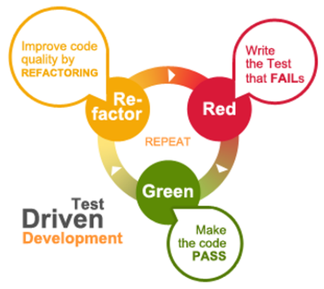
## JUnit

**JUnit 5** is een unit testing framework voor Java. Het maakt het mogelijk om tests te schrijven en deze automatisch uit te voeren. JUnit geeft feedback over geslaagde en gefaalde testen, inclusief gedetailleerde foutmeldingen.

```java
import org.junit.jupiter.api.Test;
import static org.junit.jupiter.api.Assertions.assertEquals;

@Test
void testAddition() {
    assertEquals(10, 5 + 5);  // Test of 5 + 5 gelijk is aan 10
}
```

## FIRST Eigenschappen

De **FIRST** eigenschappen helpen bij het schrijven van efficiënte en betrouwbare unit testen:

- **Fast**: Unit testen moeten snel zijn.
- **Isolated**: Testen moeten los van elkaar staan, zodat een mislukte test gemakkelijk te debuggen is.
- **Repeatable**: Testen moeten herhaalbaar zijn en consistente resultaten opleveren.
- **Self-validating**: Testen moeten automatisch aangeven of ze geslaagd zijn of niet.
- **Timely**: Het schrijven van tests mag niet te veel tijd kosten in verhouding tot de code.

Unit testen hebben geen order-of-run afhankelijkheid
# Ontwerptechnieken

## Equivalentiepartitionering (EP) en Grenswaardenanalyse (BVA)

- Een test case beschrijft een verzameling waarden en/of een bepaalde toestand die we gebruiken om een methode te testen. 
- Bij een test case beschrijft men ook wat men als resultaat van de test verwacht.

- De waarden die we gebruiken voor de verschillende test cases kunnen we laten variëren door:
	- enerzijds verschillende argumenten te kiezen voor de parameters van de te testen methode. 
	-  door objecten, waarop de te testen methode zal worden aangeroepen, met verschillende toestanden te creëren.

```java
@Test
void testOrderQuantity() {
    assertThrows(IllegalArgumentException.class, () -> new Order(-1));  // Test ongeldige bestelhoeveelheid
}
```

>
>- **positief testen**
	- gebruik maken van test cases die geldige data aanleveren
	- kijken of de code effectief doet wat ze verondersteld wordt te doen met normale data
>
>- **negatief testen**
	- gebruik maken van test cases die ongeldige data aanleveren
	- kijken of de code correct reageert wanneer abnormale data wordt aangeleverd
		- kijken of het systeem niet crasht
<
### Equivalentiepartitionering (EP)

- Een equivalentiepartitie is een interval van gegevens waarvoor je eenzelfde gedrag van een methode verwacht.
- Bij equivalentiepartitionering ga je een verzameling gegevens opdelen in equivalentiepartities.
- Om test cases te bepalen wordt uit elke equivalentiepartitie een willekeurig element gekozen.

>
>- **partitionering**
	- partities met waarden waar de methode op een normale manier moet kunnen mee omgaan noemen we geldige partities
		- testen met test cases uit geldige partities zijn dus positieve testen
>
	 - partities die aanleiding zullen geven tot het werpen van exceptions noemen we ongeldige partities
		 - testen met test cases uit ongeldige partities zijn dus negatieve testen
>

>
>- Een **goede naam** voor een test methode bestaat uit **3 delen**
	- de naam van de methode die zal getest worden
		- voor een constructor kiezen we “maak” gevolgd door de naam van de constructor
	- een omschrijving van de waarde of toestand voor test case
	- een omschrijving van het verwachte resultaat
>
#### Voorbeeld
 
 - We bekijken allereerst de constructor in de klasse Bestelling.

 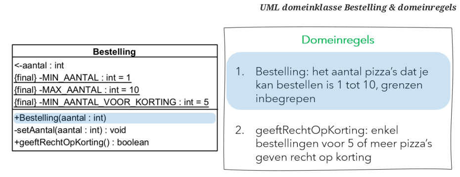
- **De eerste domeinregel geeft aanleiding tot partitionering**:
	- ***als** de parameter `aantal` van de constructor in het interval* `[1, 10]` *ligt **verwachten** we dat de Bestelling gemaakt wordt*
	- ***als** deze parameter `aantal` niet in dit interval ligt **verwachten** we dat de Bestelling niet wordt gemaakt*

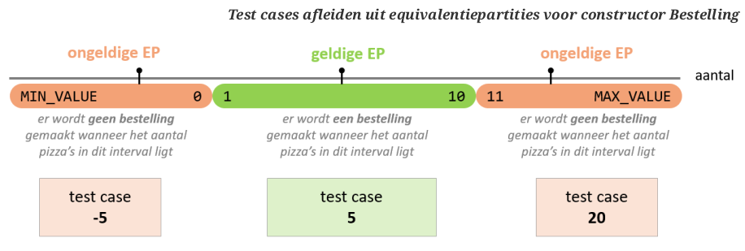

- Voor elke test case kunnen we nu een test methode definiëren.

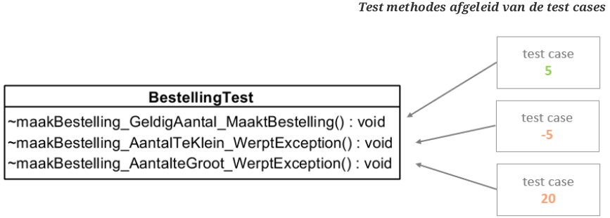

### Grenswaardenanalyse (Boundary Value Analysis - BVA)

- Een grenswaarde is een waarde die zich aan de grens van een equivalentie partitie bevindt.
- We maken test cases voor alle waarden die liggen op de grens van twee aaneensluitende equivalentiepartities.

#### Voorbeeld

- We gaan verder met test cases op te stellen voor de constructor Bestelling. 
- We focussen op de grenswaarden aan de overgangen tussen de verschillende partities.

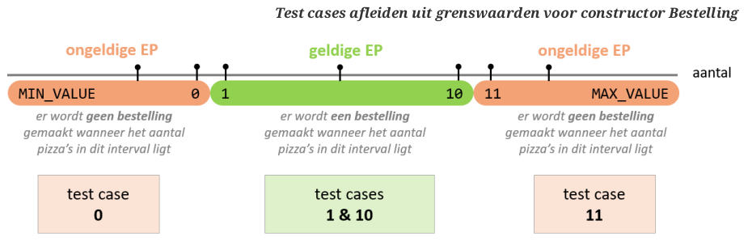

- Zoals steeds gaan we elke test case vertalen naar een test methode en op deze manier komen we tot volgende test methodes voor de constructor Bestelling.

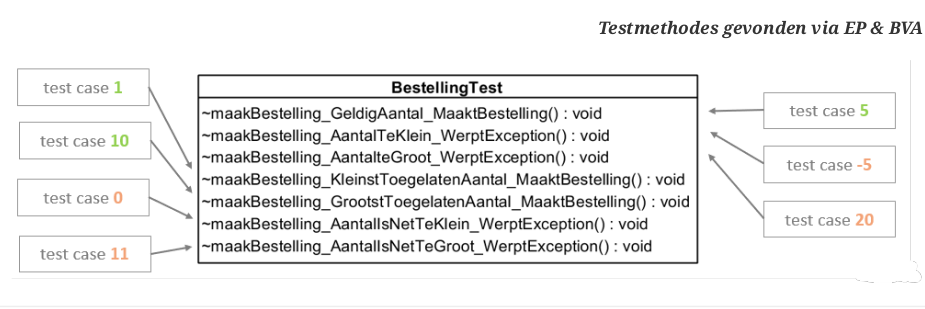

## Private en Triviale Methodes

- **Private methodes** kunnen *niet rechtstreeks getest worden*
	- maar kunnen indirect getest worden *door de publieke methoden die ze aanroepen*. 

- **Triviale methoden**, zoals `getters`, worden doorgaans *niet getest omdat ze geen logica bevatten*.

## Voorbeeld: Pizza’s Bestellen - Methode `geeftRechtOpKorting`

- We bekijken nu de methode geeftRechtopKorting uit de klasse Bestelling. 
- Deze methode heeft geen parameters maar de toestand van het object waarop we de methode aanroepen geeft nu aanleiding tot EP en BVA.

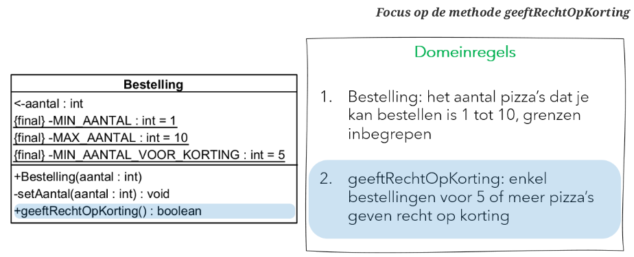

- De tweede domeinregel geeft aanleiding tot volgende partitionering:
	- als de Bestelling voor minstens 5 pizza's is geeft deze recht op korting
	- als de Bestelling voor minder dan 5 pizza's is geeft deze geen recht op korting

- Hieronder zie je de test cases die we kunnen afleiden. Merk op dat er geen ongeldige partities zijn
	- voor elke bestelling zal een waarde geretourneerd worden…


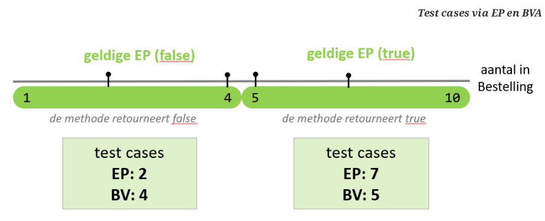

- Het eindresultaat voor onze testklasse BestellingTest:

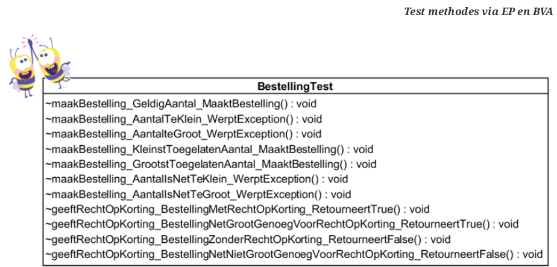

# Implementatie van Unit Testen

- Alle testklassen worden in een package testen geplaatst. 
- Voor elke klasse die je wil testen uit het domein heb je een overeenkomstige testklasse deze draagt de naam van de te testen klasse gevolgd door Test.

- Zorg ervoor dat elke testmethode in je testklasse wordt voorafgegaan door de annotatie `@Test`.

- test methodes mogen geen private visibiliteit hebben; 
	- je mag ze gerust default visibiliteit geven want ze worden nooit buiten de package testen gebruikt

- Om de testmethode effectief te implementeren maak je steeds gebruik van het triple-A patroon.

## Het AAA-patroon

Het **AAA-patroon** is een veelgebruikte structuur in unit testen:

- **Arrange**: Bereid de testdata voor.
- **Act**: Voer de actie uit die je wilt testen.
- **Assert**: Controleer of het resultaat zoals verwacht is.

```java
@Test
void testValidOrder() {
    // Arrange
    Order order = new Order(5);
    
    // Act
    int quantity = order.getQuantity();
    
    // Assert
    assertEquals(5, quantity);  // Verwacht dat de hoeveelheid gelijk is aan 5
}
```

- Voor eenvoudige testen zullen deze stappen vaak samen genomen worden.

```java
@Test
void maakBestelling_GeldigAantal_MaaktBestelling() {
// Arrange Act Assert
	assertEquals(5, new Bestelling(5).getAantal());
}
```
## Assertions

### Positieve testen

- Controleer of de methode werkt met geldige invoer.

- Veel gebruikte methoders uit de klasse Assertions

```java
assertEquals(expected, actual)
assertArrayEquals(expected, actual)
assertNull(actual) & assertNotNull(actual)
assertTrue(condition) & assertFalse(condition)
```

https://junit.org/junit5/docs/5.0.1/api/org/junit/jupiter/api/Assertions.html voor een volledig overzicht.

```java
// Positief testgeval

@Test
void maakBestelling_GeldigAantal_MaaktBestelling() {
// Arrange Act Assert
	assertEquals(5, new Bestelling(5).getAantal());
	// Eerst 5 als expliciete waarde omdat we dit verwachten
	// Pas als tweede de getter!
}
```
### Negatieve testen

- Testen of de methode juist reageert op ongeldige invoer (zoals exceptions).

- Om na te gaan of een methode tijdens het testen een exception werpt gebruik je `assertThrows`.
	- Deze methode heeft in zijn simpelste vorm twee parameters: 
		- een specificatie van de te verwachten exception klasse
		- en een lambda expressie met een aanroep naar de testen methode.

```java
@Test
void testNegativeOrder() {
    assertThrows(IllegalArgumentException.class, () -> new Order(-5));  // Negatief testgeval
}
```

- assertThrows bestaat dus telkens uit 3 delen:
	1. assertThrows om aan te geven dat je negatief gaat testen = Assert
	2. specificatie exception klasse = welke exception verwacht je dat er zal gegooid worden?
	3. aanroepen van de te testen methode na het pijltje = Act

### Import

- In de voorgaande voorbeelden werden de static methods zoals assertThrows en assertEquals uit de klasse Assertions gebruikt, zonder dat ze werden voorafgegaan door de naam van de klasse.

- Dergelijke aanroep naar static methods wordt mogelijk gemaakt door een gepaste import static in de klasse te plaatsen.

```java
import domein.Bestelling; //①
import static org.junit.jupiter.api.Assertions.assertEquals; //②
import static org.junit.jupiter.api.Assertions.assertThrows;
```

- ① een klassieke import: 
	- door een klasse op dergelijke manier te importeren hoef je deze niet langer te laten voorafgaan door de naam van de package waarin ze zich bevindt

- ② een import static: 
	- door een klasse methode op dergelijke manier te importeren hoef je deze niet langer te laten voorafgaan door de naam van de klasse waarin ze zich bevindt
## Geparameterizeerde Testen

- Geparameterizeerde testen maken het mogelijk om één test meerdere keren uit te voeren met verschillende invoerwaarden.

>
>- maak gebruik van de annotatie @ParameterizedTest
>- definieer in de signatuur van de test methode een parameter
>- lever de waarden voor die parameter aan via de annotatie @ValueSource
	- de waarden zijn literals
	- `ints`, `doubles`, `floats`, `chars`, `strings`, …
>


- Er zijn speciale annotaties om null en/of lege waarden door te geven aan een geparameterizeerde test.
	- `@NullSource` levert de waarde null aan
	- `@EmptySource` levert een lege waarde aan
		- lege string
		- lege verzameling
	- `@NullAndEmptySource` levert zowel een null als een lege waarde aan


**Voorbeeld**

```java
@ParameterizedTest
@ValueSource(ints = { -5, 20, 0, 11 })
void testInvalidOrder(int quantity) {
    assertThrows(IllegalArgumentException.class, () -> new Order(quantity));  // Testen met verschillende hoeveelheden
}
```
- Bovenstaande test wordt 4 keer uitgevoerd
## Test Life Cycle

- Gebruik de annotaties `@BeforeEach` en `@AfterEach` voor het voorbereiden en opruimen van testdata vóór en na elke test.

>
>- `@BeforeEach`
	- voor een methode die wordt uitgevoerd vóór de uitvoering van elke test methode
>- `@BeforeAll`
	- voor een statische methode die 1 keer wordt uitgevoerd alvorens alle testen uit de testklasse worden uitgevoerd
>- `@AfterEach`
	- voor een methode die wordt uitgevoerd ná de uitvoering van elke test methode
>- `@AfterAll`
	- voor een statiche methode die 1 keer wordt uitgevoerd ná de uitvoering van alle test methodes
>

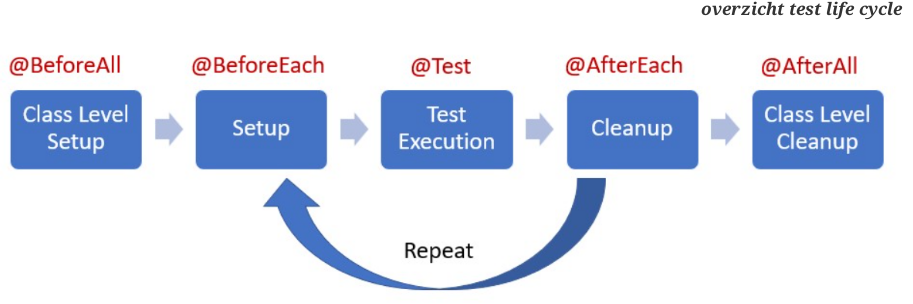

```java
@BeforeEach
void setUp() {
    // Code om de testomgeving voor te bereiden
    // Wordt voor alle testen uitgevoerd
}

@AfterEach
void tearDown() {
    // Code om op te ruimen na de test
    // Wordt na alle testen uitgevoerd
}
```


## Private Methodes en Attributen in Testklasse

Je kunt herhaling in je testklassen verminderen door gebruik te maken van **private methodes** en **attributen**.

### Private methode om herhaling te vermijden

- Om herhaling in testmethodes te vermijden, kunnen we gebruik maken van **private methodes** en **private attributen**. 
- In het voorbeeld hieronder wordt dezelfde code voor het aanmaken van een `Bestelling` herhaald in meerdere testmethodes. 
- Dit kan efficiënter worden gemaakt door een private methode te gebruiken die de bestelling aanmaakt:

```java
private Bestelling b; 

private void maakBestellingMetAantal(int aantal) { 
    b = new Bestelling(aantal); 
}

@ParameterizedTest
@ValueSource(ints = {5, 7})
void geeftRechtOpKorting_BestellingMetRechtOpKorting_RetourneertTrue(int aantal) {
    maakBestellingMetAantal(aantal); 
    assertTrue(b.geeftRechtOpKorting()); 
}
```

### Constanten voor grenswaarden

In een testklasse moeten **constanten** worden gebruikt om domeinregels te controleren in plaats van expliciete waarden. Dit maakt de code beter leesbaar en onderhoudbaar.

Voorbeeld met constanten voor het controleren van grenswaarden:

```java
private static final int MIN_AANTAL = 1;  
private static final int MAX_AANTAL = 10;  
private static final int MIN_AANTAL_VOOR_KORTING = 5;

@ParameterizedTest // geldige waarden
@ValueSource(ints = {5, MIN_AANTAL, MAX_AANTAL})
void maakBestelling_GeldigAantal_maaktBestelling(int aantal) {
    assertEquals(aantal, new Bestelling(aantal).getAantal());
}
```

Door deze constanten te gebruiken, verbeteren we de leesbaarheid en zorgen we ervoor dat de test eenvoudig kan worden aangepast wanneer de grenswaarden veranderen.
# Natuurlijke Partities en Grenswaarden

De datatypes die gebruikt worden in Java kunnen leiden tot verschillende partities en grenswaarden, wat belangrijk is bij het testen van applicaties.

## int

- **Grenswaarden**:
    - `Integer.MIN_VALUE` (kleinste waarde)
    - `Integer.MAX_VALUE` (grootste waarde)
- **Partities**:
    - Positieve getallen
    - Negatieve getallen
    - De waarde 0 bevindt zich tussen deze twee partities.

## double (en float)

- **Grenswaarden**:
    - `Double.MAX_VALUE` (grootste waarde voor `double`)
    - `Double.MIN_VALUE` (kleinste positieve waarde voor `double`)
- **Grens van partities**:
    - De grens tussen positieve en negatieve getallen ligt bij 0.

## String

- **Grenswaarden**:
    - Lege string (`""`)
    - `null`
    - String die alleen alfabetische karakters bevat, alleen hoofdletters, of alleen cijfers.

## Object

- **Grenswaarden**:
    - `null` (geen object)

## List (en andere verzamelingen)

- **Grenswaarden**:
    - `null` (geen lijst)
    - Lege lijst (`[]`)
    - Lijst met één element (`[element]`)
# @Test methoden - Tips

Bij het schrijven van unit tests moeten we de focus houden op eenvoud en duidelijkheid.

## Test één aspect

- Testmethoden moeten slechts **1 aspect** testen.
- Dit maakt het gemakkelijker om te begrijpen wat er misgaat bij het falen van een test.
- Houd de focus **laser-precies** op het specifieke onderdeel van de code.

## Geen waarden uit het domein gebruiken

- Testmethoden moeten **geen waarden uit het domein gebruiken** (bijv. geen publieke constanten uit domeinklassen).
- Het doel is om het **domein** te **valideren** en niet afhankelijk te zijn van de domeinlogica.

## Houd het simpel

- Testmethoden moeten **eenvoudig** zijn.
    - Er mag **weinig of geen logica** in een testmethode worden geïmplementeerd.
    - Vermijd **logische fouten** in de testcode.
    - **Maak gebruik van concrete waarden** in plaats van berekeningen te doen, zodat de test duidelijk en begrijpelijk blijft.

Deze aanpak zorgt voor robuuste, onderhoudbare en effectieve unit tests.

# Unit testen - Voordelen en misvattingen

## Voordelen

- **Duidelijke en ondubbelzinnige specificaties begrijpen**  
    Unit testen schrijven dwingt een developer om specificaties duidelijk en ondubbelzinnig te begrijpen.
    - Door testen te ontwerpen, kom je vaak onduidelijkheden in de specificaties tegen die tijdig kunnen worden opgehelderd.

- **Feedback over het design**  
    Unit testen geven feedback over het design van je applicatie.
    - Als je op basis van het UML design van een klasse moeilijk unit testen kunt schrijven, zit het design waarschijnlijk niet goed.

- **Documentatie van functionaliteit**  
    Unit testen beschrijven de functionaliteit van een stukje code. Ze fungeren als een vorm van documentatie.
    
- **Geautomatiseerde testen**  
    Unit testen zijn geautomatiseerd. 
    - Niet alle vormen van testen kunnen gemakkelijk geautomatiseerd worden.

- **Leiden tot kwaliteitsvollere code**  
    Unit testen zorgen voor kwaliteitsvollere code die herbruikbaar, aanpasbaar en leesbaar is.
    - Developers krijgen meer vertrouwen in hun code.
    - Developers spenderen minder tijd aan debuggen.

- **Vroege bugdetectie**  
    Unit testen helpen om bugs vroeg te detecteren en te corrigeren.
    

## Misvattingen

- **Mindset "kost tijd"**  
    Het schrijven van unit testen kost inderdaad tijd.
    - De tijd die je investeert in unit testen win je dubbel en dik terug omdat je op een veel efficiëntere manier tot code komt die van veel hogere kwaliteit is.

- **Druk van hogerhand**  
    Onder tijdsdruk worden testen vaak als wisselgeld gezien.
    - "Time is money"
    - "Dit project moet tegen volgende week af en..."

# Een Uitgewerkt Voorbeeld: Rechthoek

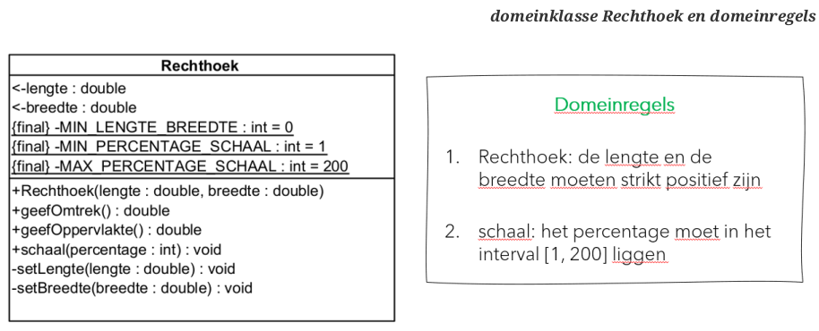

## De Constructor

**DR: De lengte moet strikt positief zijn - EP & BVA**

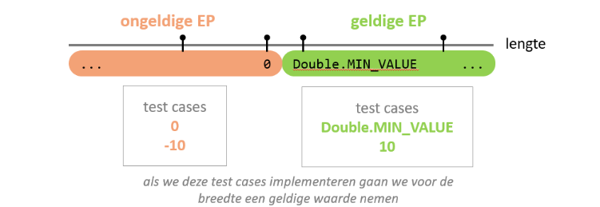

**DR: De breedte moet strikt positief zijn - EP & BVA**

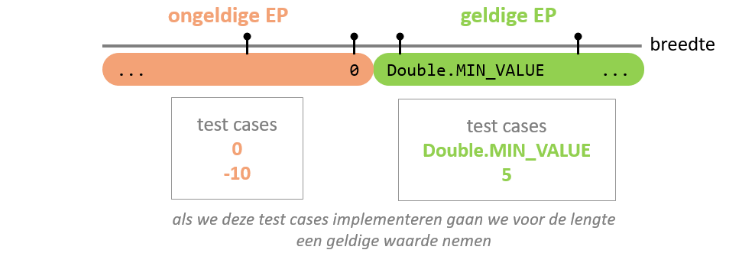

**Overzicht test cases constructor Rechthoek:**

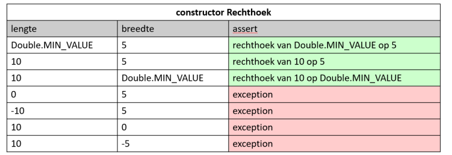

>
>- **Vermijd het combineren van testcases!**
	- Als je verschillende waarden moet combineren (bv. lengte en breedte), kies dan voor de combinatie van 1 grenswaarde/ongeldige waarde en kies voor de andere waarde(s) een correcte waarde die midden in de geldige EP ligt.
	- Verschillende geldige waardes die willekeurig in een geldige EP liggen, mag je wel combineren.
>

**Voorbeelden:**

- **Testcase 1:** Lengte is een grenswaarde, dus we kiezen voor de breedte een correcte waarde (5).
- **Testcase 4:** Lengte is ongeldig, dus we kiezen voor de breedte een correcte waarde (5).
- **Testcase 2:** Hier combineren we de geldige waarden 10 en 5 tot 1 test waarin we controleren of de rechthoek correct wordt aangemaakt.

**Testen voor de constructor in JUnit:**

```java
class RechthoekTest {
    private Rechthoek r;
    private static final int MIN_LENGTE_BREEDTE = 0;
    private static final int EEN_CORRECTE_LENGTE = 10;
    private static final int EEN_CORRECTE_BREEDTE = 5;

    @BeforeEach
    void setUp() {
        r = new Rechthoek(EEN_CORRECTE_LENGTE, EEN_CORRECTE_BREEDTE);
    }

    @Test
    void maakRechthoek_LengteEnBreedtePositief_MaaktRechthoek() {
        assertEquals(10, r.getLengte());
        assertEquals(5, r.getBreedte());
    }

    @Test
    void maakRechthoek_LengteNetGroterDanNul_MaaktRechthoek() {
        Rechthoek r = new Rechthoek(Double.MIN_VALUE, EEN_CORRECTE_BREEDTE);
        assertEquals(Double.MIN_VALUE, r.getLengte());
        assertEquals(5, r.getBreedte());
    }

    @Test
    void maakRechthoek_BreedteNetGroterDanNul_MaaktRechthoek() {
        Rechthoek r = new Rechthoek(EEN_CORRECTE_LENGTE, Double.MIN_VALUE);
        assertEquals(10, r.getLengte());
        assertEquals(Double.MIN_VALUE, r.getBreedte());
    }

    @ParameterizedTest
    @ValueSource(doubles = { MIN_LENGTE_BREEDTE, -10 })
    void maakRechthoek_LengteNietStriktPositief_WerptException(double lengte) {
        assertThrows(IllegalArgumentException.class, () -> new Rechthoek(lengte, EEN_CORRECTE_BREEDTE));
    }

    @ParameterizedTest
    @ValueSource(doubles = { MIN_LENGTE_BREEDTE, -10 })
    void maakRechthoek_BreedteNietStriktPositief_WerptException(double breedte) {
        assertThrows(IllegalArgumentException.class, () -> new Rechthoek(EEN_CORRECTE_LENGTE, breedte));
    }
}
```

## Methode geefOmtrek

**De methode heeft geen parameters.** De eigenschappen van een geldige rechthoek (ongeldige rechthoeken kunnen niet gemaakt worden) zijn een geldige lengte en breedte. We kiezen representanten uit de geldige partities.

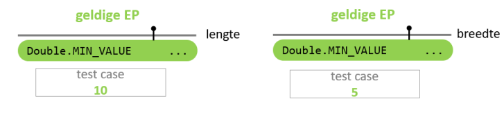

**Overzicht test cases methode geefOmtrek:**

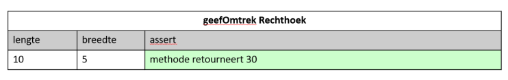

**De JUnit test voor de methode geefOmtrek:**

```java
class RechthoekTest {
    private Rechthoek r;
    private static final int EEN_CORRECTE_LENGTE = 10;
    private static final int EEN_CORRECTE_BREEDTE = 5;

    @BeforeEach
    void setUp() {
        r = new Rechthoek(EEN_CORRECTE_LENGTE, EEN_CORRECTE_BREEDTE);
    }

    @Test
    void geefOmtrek_RetourneertDeOmtrek() {
        assertEquals(30, r.geefOmtrek());
    }
}
```

## Methode geefOppervlakte

Dit is volledig analoog aan de voorgaande methode geefOmtrek en wordt hier niet verder toegelicht.

## Methode schaal

- **Voor deze methode moeten we vertrekken van een geldige rechthoek en kunnen we gerust wederom een rechthoek met lengte 10 en breedte 5 nemen.**
- **De int parameter percentage geeft aanleiding tot EP en BVA.**

**Domeinregel (DR):** Het percentage moet in het interval `[1, 200]` liggen - EP & BVA.

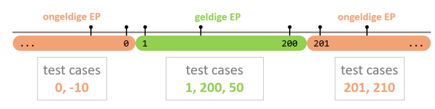

**Overzicht test cases methode schaal:**

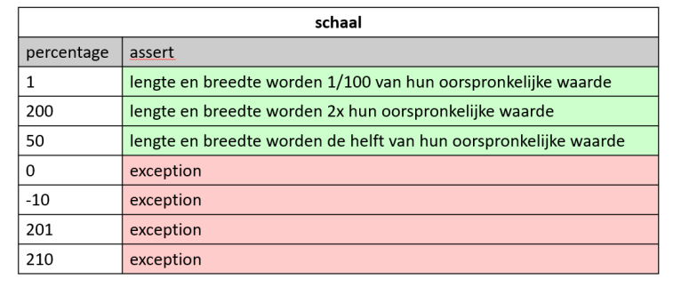

**De JUnit testen voor de methode schaal:**

```java
/*
Alleen code in verband met testen rond schaal, andere code/testen weggelaten voor
de duidelijkheid.
Voor de volledige testklasse: zie het voorbeeldproject.
*/

class RechthoekTest {
    private Rechthoek r;
    private static final int MIN_PERCENTAGE_SCHAAL = 1;
    private static final int MAX_PERCENTAGE_SCHAAL = 200;
    private static final int EEN_CORRECTE_LENGTE = 10;
    private static final int EEN_CORRECTE_BREEDTE = 5;

    @BeforeEach
    void setUp() {
        r = new Rechthoek(EEN_CORRECTE_LENGTE, EEN_CORRECTE_BREEDTE);
    }

    @Test
    void schaal_GeldigPercentage_SchaaltDeRechthoek() {
        r.schaal(50);
        assertEquals(5, r.getLengte(), 0.01);
        assertEquals(2.5, r.getBreedte(), 0.01);
    }

    @Test
    void schaal_PercentageGrootstMogelijk_SchaaltDeRechthoek() {
        r.schaal(MAX_PERCENTAGE_SCHAAL);
        assertEquals(20, r.getLengte(), 0.01);
        assertEquals(10, r.getBreedte(), 0.01);
    }

    @Test
    void schaal_PercentageKleinstMogelijk_SchaaltDeRechthoek() {
        r.schaal(MIN_PERCENTAGE_SCHAAL);
        assertEquals(0.1, r.getLengte(), 0.01);
        assertEquals(0.05, r.getBreedte(), 0.01);
    }

    @ParameterizedTest
    @ValueSource(ints = { MIN_PERCENTAGE_SCHAAL-1, -10, MAX_PERCENTAGE_SCHAAL+1, 210 })
    void schaal_OngeldigSchalingsPercentage_WerptException(int percentage) {
        assertThrows(IllegalArgumentException.class, () -> r.schaal(percentage));
    }
}
```

Tijd om de methodes in de klasse Rechthoek te implementeren! De uitwerking hiervan kan je bekijken in het voorbeeldproject.

# Nog een uitgewerkt voorbeeld: TelewerkAanvraag

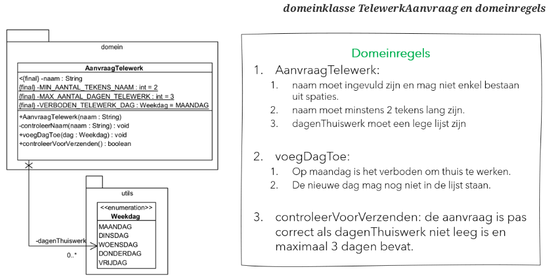

## De Constructor

#### Testcases opstellen:

- **DR:** Naam moet ingevuld zijn en mag niet enkel bestaan uit spaties. 

	Deze domeinregel geeft geen aanleiding tot equivalentiepartities en grenswaarden. Er zijn echter wel testcases nodig!

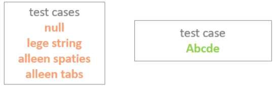

- **DR:** Naam moet minstens 2 tekens lang zijn - EP & BVA.

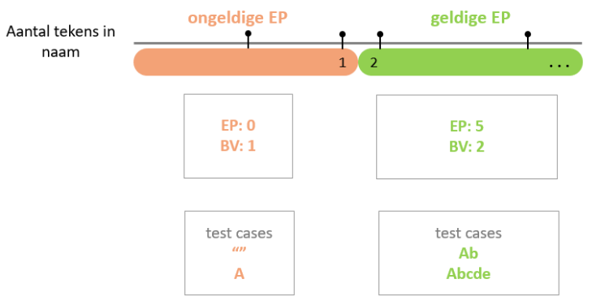

- **DR:** DagenThuiswerk moet een lege lijst zijn.
	- Deze domeinregel geeft geen aanleiding tot equivalentiepartities en grenswaarden. 
	- Het is voldoende om in de voorgaande positieve testcases te controleren of het object effectief is aangemaakt met een lege lijst voor dagenThuiswerk.

**Overzicht test cases constructor TelewerkAanvraag:**

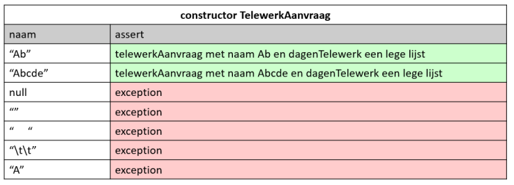

### De Testen voor de Constructor in JUnit

```java
private AanvraagTelewerk at;
private static final String CORRECTE_NAAM = "Abcde";

@ParameterizedTest
@NullAndEmptySource //①
@ValueSource(strings= {"\t\t", "\n", "A"}) //②
void maakAanvraagTelewerk_NaamLeegOfTeKort_WerptException(String naam) {
    assertThrows(IllegalArgumentException.class, ()-> new AanvraagTelewerk(naam));
}

@ParameterizedTest
@ValueSource(strings= {"Ab", CORRECTE_NAAM})
void maakAanvraagTelewerk_GeldigeNaam_maaktAanvraagTelewerk(String naam) {
    at = new AanvraagTelewerk(naam);
    assertEquals(naam, at.getNaam());
    assertTrue(at.getDagenThuiswerk().isEmpty());
}
```

- ① Door gebruik te maken van `@NullAndEmptySource` moeten de cases ivm null en lege string niet expliciet toegevoegd worden aan `@ValueSource`.

- ② De andere negatieve test cases kunnen toegevoegd worden met behulp van `@ValueSource`.
### Bijhorende Code in Constructor en ControleerNaam

- Ook in dit voorbeeld wordt TDD toegepast, dus zal de code in de constructor en controleerNaam nu pas aangevuld worden.

- Aangezien er geen nieuwe technieken gebruikt worden in die code, is deze niet opgenomen in de cursus. Je kan deze code bekijken in het voorbeeldproject.

## Methode voegDagToe

### Testcases Opstellen

Deze methode heeft 1 parameter die aanleiding geeft tot test cases, maar ook de toestand van het object zal aanleiding geven tot test cases!

- **DR:** Op maandag is het verboden om thuis te werken.

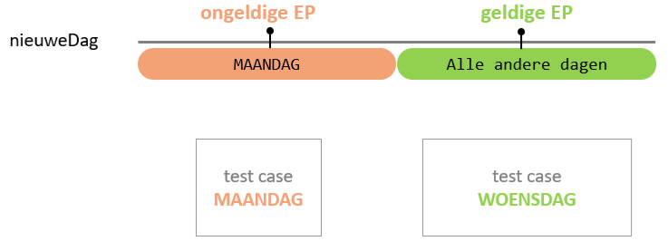

- **DR:** De nieuwe dag mag nog niet in de lijst staan.

	- Om dit te controleren, moet de lijst `dagenTelewerk` al minstens 1 waarde bevatten. We kiezen ervoor om `DINSDAG` al toe te voegen aan `dagenTelewerk`.


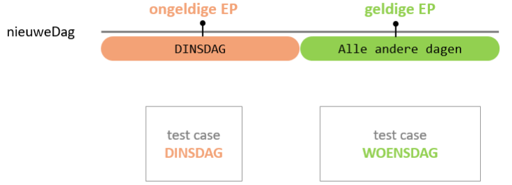


#### Overzicht test cases voegDagToe

- Bij enumeraties is het wel mogelijk om exhaustief te testen! 
- Bij een enumeratie kunnen we eenvoudig alle waarden oplijsten en gebruiken als test case.

- Bij een enumeratie geeft elke waarde een test case.

- De uitwerking van bovenstaande domeinregels zorgt ervoor dat zowel MAANDAG als DINSDAG negatieve test cases zijn.
	- Bijgevolg zijn zowel WOENSDAG, DONDERDAG en VRIJDAG positieve test cases.

### De Testen voor voegDagToe in JUnit

```java
/*
**Opmerking:**  
Alleen code in verband met testen rond `voegDagToe`, andere code/testen weggelaten voor de duidelijkheid. Voor de volledige testklasse, zie het voorbeeldproject.
*/

private static final String VERBODEN_DAG_ALS_STRING = "MAANDAG";
private static final String AL_GEKOZEN_DAG_ALS_STRING = "DINSDAG";

private static final Weekdag AL_GEKOZEN_DAG = Weekdag.valueOf(AL_GEKOZEN_DAG_ALS_STRING);

private void maakAanvraagMetAl1GekozenDag() {
    at = new AanvraagTelewerk(CORRECTE_NAAM);
    at.voegDagToe(AL_GEKOZEN_DAG);
}

@ParameterizedTest
@EnumSource(
    value = Weekdag.class, // ①
    names = {VERBODEN_DAG_ALS_STRING, AL_GEKOZEN_DAG_ALS_STRING}) // ②
void voegDagToe_OngeldigeDagen_WerptException(Weekdag dag) { // ③
    maakAanvraagMetAl1GekozenDag();
    assertThrows(IllegalArgumentException.class, () -> at.voegDagToe(dag)); // ④
}

@ParameterizedTest
@EnumSource(
    value = Weekdag.class, // ①
    names = {VERBODEN_DAG_ALS_STRING, AL_GEKOZEN_DAG_ALS_STRING}, // ②
    mode = EnumSource.Mode.EXCLUDE // ⑤
)
void voegDagToe_GeldigeDag_voegtDagToe(Weekdag dag) { // ⑥
    maakAanvraagMetAl1GekozenDag();
    at.voegDagToe(dag);
    assertEquals(2, at.getDagenThuiswerk().size());
    assertTrue(at.getDagenThuiswerk().contains(AL_GEKOZEN_DAG));
    assertTrue(at.getDagenThuiswerk().contains(dag));
}
```

**Uitleg:**

- ① De annotatie `@EnumSource` geeft aan dat de aangeleverde waarden enum waarden zijn.
- ② Bij `value` lever je aan over welke enum klasse het gaat.
- ③ Bij `names` plaats je de waarden die je wil testen als string.
- ④ In de signatuur definieer je de parameter als enum. De waarden die je meegeeft bij `names` zullen via deze parameter één voor één getest worden.
- ⑤ Het is mogelijk om alle enum waarden behalve bepaalde waarden te testen door gebruik te maken van `mode EXCLUDE`. In dit voorbeeld wordt de test 3 keer uitgevoerd met de waarden: WOENSDAG, DONDERDAG, en VRIJDAG. MAANDAG en DINSDAG worden uitgesloten.
- ⑥ We testen niet alleen of de lijst met `dagenThuiswerk` effectief 2 waardes bevat, maar ook of de "oude" dag nog steeds aanwezig is (`AL_GEKOZEN_DAG`) én of de "nieuwe" dag toegevoegd is (`dag`).

### Bijhorende code in voegDagToe

In dit voorbeeld wordt **Test Driven Development (TDD)** toegepast, dus zal de code in de klasse `AanvraagTelewerk` bij de methode `voegDagToe` nu pas worden aangevuld. Aangezien er ook hier geen nieuwe technieken worden gebruikt, is deze code niet opgenomen in de cursus. Je kunt deze code bekijken in het voorbeeldproject.

## Methode controleerVoorVerzenden

### Testcases Opstellen

Deze methode heeft geen parameters, maar de toestand van het object zal wel aanleiding geven tot test cases.

**Domeinregels (DR):**
- De aanvraag is pas correct als `dagenThuiswerk` niet leeg is en maximaal 3 dagen bevat.
- Wanneer de aanvraag voldoet aan bovenstaande voorwaarden, zal de methode `true` retourneren. In andere gevallen zal de methode `false` teruggeven.

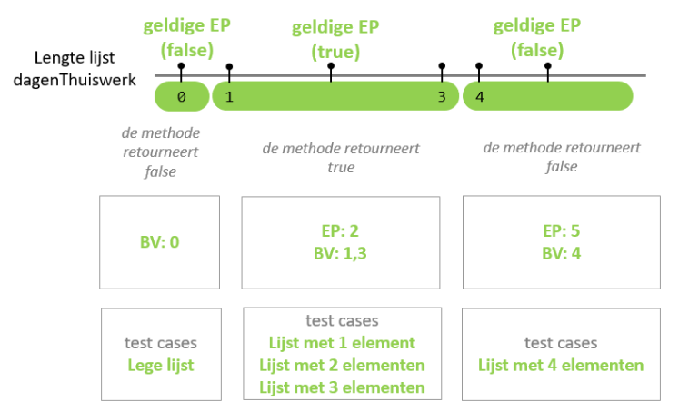

- Het is niet mogelijk om **EP: 5** om te zetten in een test case, omdat er geen 5 correcte dagen om toe te voegen zijn aan de lijst (MAANDAG is niet toegestaan en dubbele dagen zijn niet toegestaan).

**Overzicht test cases controleerVoorVerzenden:**

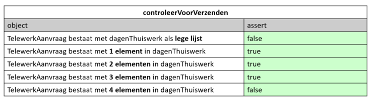
### De Testen voor controleerVoorVerzenden in JUnit

```java
/*
Alleen code in verband met testen rond controleerVoorVerzenden, andere code/testen
weggelaten voor de duidelijkheid.
Voor de volledige testklasse: zie het voorbeeldproject.
*/

private void maakAanvraagMetDagen(int aantalDagen) {
    at = new AanvraagTelewerk(CORRECTE_NAAM);
    for (int i = 0; i < aantalDagen; i++)
        at.voegDagToe(Weekdag.values()[i + 1]); // ②
}

@ParameterizedTest
@ValueSource(ints = {0, 4})
void controleerVoorVerzenden_OngeldigAantalDagen_ReturnsFalse(int aantalDagen) {
    maakAanvraagMetDagen(aantalDagen);
    assertFalse(at.controleerVoorVerzenden());
}

@ParameterizedTest
@ValueSource(ints = {1, 2, 3})
void controleerVoorVerzenden_GeldigAantalDagen_ReturnsTrue(int aantalDagen) {
    maakAanvraagMetDagen(aantalDagen);
    assertTrue(at.controleerVoorVerzenden());
}
```

**Uitleg:**

- ① De methode `maakAanvraagMetDagen` maakt een `AanvraagTelewerk` aan met de naam `CORRECTE_NAAM` en voegt dagen toe afhankelijk van de lengte van de lijst `aantalDagen`.
- ② Door gebruik te maken van `i + 1` wordt voorkomen dat de waarde `i = 0` wordt gebruikt, wat zou resulteren in MAANDAG, wat niet is toegestaan volgens de domeinregels van `voegDagToe`.

### 10.3.3. Bijhorende Code in controleerVoorVerzenden

Ook deze code kan je bekijken in het voorbeeldproject.

**Happy coding, and don’t forget...**

