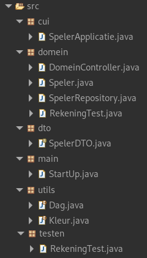

---
tags:
  - Samenvatting
  - Java
  - HoGent
  - toegepasteinformatica
  - OOSD
  - Opbouw
---
# Structuur java programma

## Pakages in professionele softwareontwikkeling

## Korte uitleg

**[cui](#cui)** -> interface (later ook GUI)
	- NaamApplicatie.java

**[domein](#domein)** -> code
	- Klassen.java
	- Domeincontroller.java => om gui en domein gescheiden te houden (domeincontroller werkt niet zelf), onze façade

**[main](#main)**
	- StartUp.java

**[dto](#dto)**
	- NaamAppDTO.java => is een record, geen java klasse!

**[utils](#utils)**

 **[testen](#testen)**
	 - De test klassen om de klassen te testen

**persitentie** *-> database*

# cui

[Uitgebreide uitleg](./cui.md)

Hier komt alle code die de interactie met de gebruiker regelt. In eerste instantie is dit meestal een _console interface_, maar later kun je het uitbreiden naar een GUI (Graphical User Interface).

- **NaamApplicatie.java**  
    Dit is de klasse die de interactie met de gebruiker regelt, zoals input vragen en output tonen.  
    _Bijvoorbeeld:_ Het vragen naar gegevens of tonen van resultaten.

# domein
[Uitgebreide uitleg](./domein.md)

Dit is de kern van je applicatie waar de echte businesslogica wordt geïmplementeerd.

- **Klassen.java**  
    Hier maak je de klassen die je domeinlogica vertegenwoordigen, zoals objecten en methodes die iets berekenen of verwerken.
    
- **Domeincontroller.java**  
    De domeincontroller is een _façade_ (een tussenlaag) die ervoor zorgt dat de **cui** en de **domein**-logica gescheiden blijven. De interface communiceert niet rechtstreeks met de domeinlogica, maar via deze controller.

# main
[Uitgebreide uitleg](./main.md)
Hier start je programma.

- **StartUp.java**  
    Deze klasse bevat de `main`-methode en is verantwoordelijk voor het opstarten van de applicatie. Het maakt vaak een instantie van de **Domeincontroller** en de **cui**.

# dto
(Data Transfer Object)
[Uitgebreide uitleg](./dto.md)

Hier gebruik je _records_ (een feature van Java) om gegevens eenvoudig over te dragen tussen lagen, bijvoorbeeld van de domeincontroller naar de interface.

- **NaamAppDTO.java**  
    Dit is een **record**, geen gewone klasse. Een record is een compacte manier om immutable (onveranderbare) data-objecten te maken.  
    _Bijvoorbeeld:_ Om een set van eigenschappen zoals `naam` en `leeftijd` van een gebruiker te bundelen.

# utils
[Uitgebreide uitleg](./utils.md)

Hier komen ondersteunende klassen of methodes die niet specifiek bij een van de andere lagen horen.

- Bijvoorbeeld: een klasse voor **validaties**, **helper-methoden**, of **berekeningen** die in meerdere lagen gebruikt worden.

# testen
[Uitgebreide uitleg](./testen.md)

Hier komen je _unit tests_. Met deze tests controleer je of de verschillende onderdelen van je applicatie correct werken.

- Testklassen zoals **KlassenTest.java** of **DomeincontrollerTest.java** testen respectievelijk je domeinlogica en de façade.  
    _Bijvoorbeeld:_ Je controleert of methoden de juiste waarden retourneren.

## gunit framewor toevoegen voor testen 
testklassen

Werkt met het framework gunit

### we moeten gunit framework toevoegen

 next

finish

apply&close

### test draaien

`alt` + `shift` + `x` ==> `t` (run with j-unit)

# persistentie (Database) (voor later in de cursus)

Hier komt de code voor het opslaan en ophalen van data uit een database. Je werkt meestal met een _Data Access Object_ (DAO)-patroon of frameworks zoals JPA of Hibernate.

Voor de database

Apart want:
- onderhoud
- toevoeging of aanpassing van database soort heeft geen invloed op het project

