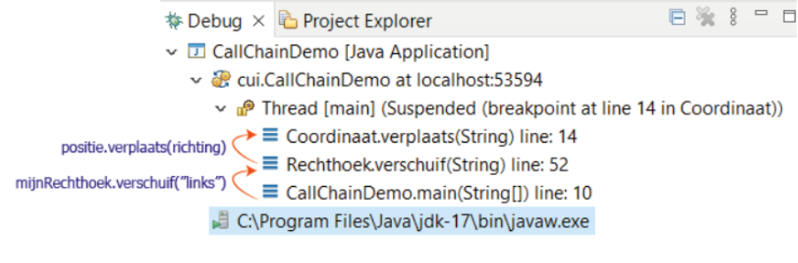

# Wat is een methode


## Method overloading

Vermijd ten alle tijde duplicate code in een programma! Gebruik methodes op een doordachte manier!

### Voorbeeld met overload
```java
ublic void verplaats(String richting) {
	switch (richting) {
		case "boven" -> y += 1; 
		case "onder" -> y -= 1; 
		case "links" -> x -= 1; 
		case "rechts" -> x += 1; 
	} 
} 

public void verplaats(String richting, int verschuiving) {
	switch (richting) {
		case "boven" -> y += verschuiving; 
		case "onder" -> y -= verschuiving; 
		case "links" -> x -= verschuiving; 
		case "rechts" -> x += verschuiving; 
	} 
}
```

### Voorbeeld zonder overload
```java
public void verplaats(String richting) {
	verplaats(richting, 1); 
} 
	
public void verplaats(String richting, int verschuiving) {
	switch (richting) {
		case "boven" -> y += verschuiving; 
		case "onder" -> y -= verschuiving; 
		case "links" -> x -= verschuiving; 
		case "rechts" -> x += verschuiving; 
	} 
}
```

# Declaratie (Opbouw)
```java
private void setLengte(double lengte) {
	this.lengte = lengte; 
}
```

- **access modifier**: private
- **return type**: void
- **naam**: setLengte
- **formele parameterlijst met 1 parameter**: (double lengte)
- **methode body**: {this.lengte = lengte;}

## modifiers
- **access modifiers** om het niveau van toegankelijkheid in te stellen
	- *private:* de methode kan niet van buitenaf aangeroepen worden
	- *public:* de methode kan van buitenaf aangeroepen worden
- **andere modifiers**
	- in dit hoofdstuk maak je kennis met enkele nieuwe modifiers zoals *static en final*

## returntype 
- bepaalt het *datatype van de waarde die de methode retourneert*
	- indien de methode *niets retourneert gebruik je void*
	
## naam
- het is heel belangrijk dat de naam *ondubbelzinnig het doel van de methode benoemt*

## formele parameterlijst
- omschrijving van de *extra stukjes informatie, die zullen aangereikt worden bij aanroep van de methode*
	- tussen ronde haakjes een door komma’s gescheiden lijst van formele parameters; elke formele parameter heeft een *datatype en een naam*
	- indien er *geen formele parameters* zijn gebruik je *lege ronde haakjes*

## body
- een *code blok dat zal worden uitgevoerd wanneer de methode wordt aangeroepen*


# Aanroepen van een methode

Bij het aanroepen van een methode gebruik je de naam van de methode, gevolgd door ronde haakjes waarin je de waarden zet die je wilt doorgeven. Deze waarden noemen we **actuele parameters** (of argumenten). De methode ontvangt deze waarden en koppelt ze aan **formele parameters**.

In Java worden deze waarden altijd doorgegeven met een mechanisme dat **pass by value** heet.

## Pass by
### Pass by value:

*Wanneer je een methode aanroept, de waarde van een parameter naar de methode wordt gekopieerd* en doorgegeven aan de methode. *De formele parameter binnen de methode ontvangt deze kopie.*


**Bij primitieve types** (zoals `int`, `double`, `boolean`):

- De **waarde zelf** wordt gekopieerd.
- Veranderingen aan de parameter binnen de methode hebben **geen effect buiten de methode**, omdat je werkt met een kopie.

```java
public class Main { 
	public static void main(String[] args) {
		int x = 10; 
		wijzigWaarde(x); 
		System.out.println(x); // Output: 10 
	}
	
	public static void wijzigWaarde(int getal) {
		getal = 20; // Verandert alleen de lokale kopie 
	} 
}
```
### Pass by reference

Betekent het dat in plaats van een kopie van de waarde of een **kopie van de referentie** door te geven, de methode direct werkt met de **originele referentie** of het **originele object**.

Als Java écht pass by reference zou gebruiken, zouden wijzigingen aan een parameter in de methode direct effect hebben op de originele variabele of referentie buiten de methode. Maar dit is **niet het geval in Java**! Java gebruikt **altijd pass by value**.

#### Uitzonderling in java: waarde van referentie van een object

**Bij objecten** (zoals `String`, arrays, of eigen klassen):

- Wat wordt doorgegeven is de **waarde van de referentie** naar het object, niet het object zelf.
- Dit betekent dat als je de attributen van het object wijzigt binnen de methode, de wijzigingen **wel zichtbaar zijn buiten de methode**.
- Als je echter de referentie zelf probeert te veranderen (*door een nieuw object toe te wijzen*), verandert dat **niet de originele referentie buiten de methode**.


```java
public class Main {
    public static void main(String[] args) {
        StringBuilder tekst = new StringBuilder("Hallo");
        wijzigTekst(tekst);
        System.out.println(tekst); // Output: Hallo Wereld
    }

    public static void wijzigTekst(StringBuilder sb) {
        sb.append(" Wereld"); // Wijzigt het object waar sb naar verwijst
    }
}

```
Maar:
```java
public class Main {
    public static void main(String[] args) {
        StringBuilder tekst = new StringBuilder("Hallo");
        veranderReferentie(tekst);
        System.out.println(tekst); // Output: Hallo
    }

    public static void veranderReferentie(StringBuilder sb) {
        sb = new StringBuilder("Nieuwe tekst"); // Verandert alleen de lokale kopie van de referentie
    }
}
```

Hier blijft `tekst` buiten de methode ongewijzigd, omdat alleen de **waarde van de referentie** wordt doorgegeven.

## Stack

### Wat gebeurt er bij een methode-aanroep?
    
 - Wanneer je een methode aanroept, wordt het punt in je programma waar de aanroep gebeurt **onthouden**.
 - De **parameters** die je doorgeeft worden gekopieerd en doorgegeven aan de methode.
 - Daarna begint de uitvoering van de code binnen de methode (de **body van de methode**).

### Wat gebeurt er na de methode-aanroep?

- Zodra de methode klaar is met uitvoeren, gaat het programma verder **op het punt waar de methode werd aangeroepen**.
- Als de methode een waarde teruggeeft (`return`), wordt die waarde gebruikt in het programma.
### Hoe werkt de call stack hierbij?
    
- De **call stack** is een soort "stapel" waarin wordt bijgehouden welke methode momenteel wordt uitgevoerd en waar het programma daarna verder moet.
- Elke keer als een methode wordt aangeroepen:
	- Wordt een **frame** toegevoegd aan de call stack. Dit frame bevat informatie zoals:
        - De methode die wordt uitgevoerd.
        - De waarden van de parameters.
        - Het punt in het programma waar teruggekeerd moet worden na de methode.
- Als een methode klaar is:
    - Wordt het bovenste frame van de call stack verwijderd, en keert de uitvoering terug naar het programma op het punt waar de aanroep plaatsvond.
### Waarom is dit belangrijk?
    
- Als een methode zelf een andere methode aanroept, wordt er **opnieuw een frame toegevoegd** aan de call stack. Dit zorgt voor een "gestapelde" volgorde van methodes.
- Het begrijpen van de call stack helpt bij het debuggen. Bijvoorbeeld:
    - Als er een fout optreedt, kun je in de **stack trace** precies zien welke methodes werden aangeroepen en in welke volgorde.
    - Bij problemen zoals **stack overflow** kun je zien dat te veel methodes werden aangeroepen zonder terug te keren (bijvoorbeeld door oneindige recursie).



