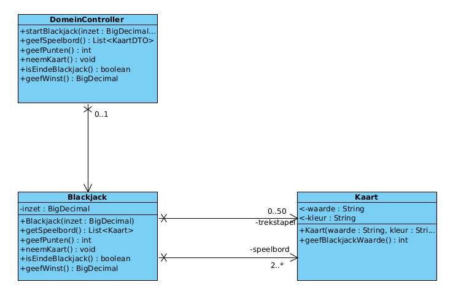
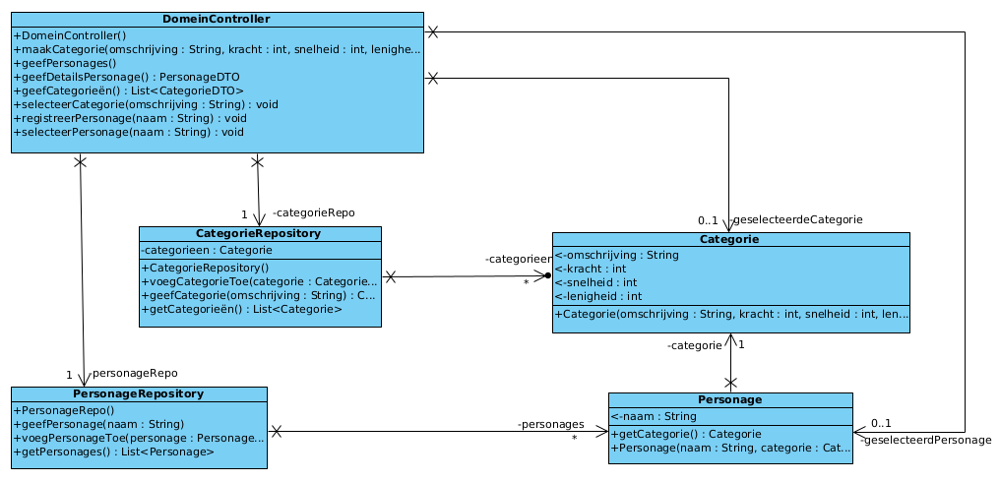

# H01 [Introductie Java-applicaties](H01%20Introductie%20Java-applicaties.md)
## Doelstellingen
## Inleiding
## Ontstaansgeschiedenis Java
## Java-applicaties
## Uitvoerstatements in een Java-applicatie
## Invoer- en uitvoerstatements in een Java-applicatie
## Rekenkundige bewerkingen
## On the web
# H02 [Controlestructuren en operatoren](H02%20Controlestructuren%20en%20operatoren.md)
## Doelstellingen
## Inleiding
## Algoritmen
## Pseudo-code
## Controlestructuren
## Een eenvoudige methode voor een programma
## De selectiestructuren
## Samengestelde toekenningsoperatoren
##  Increment- en decrementoperatoren
## De herhalingsstructuren
## Logische operatoren
## Precedentie en associativiteit van de operatoren (leesrichting)
## Primitieve datatypes
## Extra
# H03 [Klasse en object](H03%20Klasse%20en%20object.md)
## Doelstellingen
## Inleiding: een aantal sleutelconcepten
## Object
## Abstractie
## Klasse
## Klassen en objecten: in de diepte
## Voorstelling klasse in UML
## Implementatie klasse, gedefinieerd in UML
## Bouwen van een applicatie m.b.v. die domeinklasse
# H04 [Array en ArrayList](H04%20Array%20en%20ArrayList.md)
## Doelstellingen
## Inleiding
## Arrays
## ArrayList
## Tweedimensionale arrays
## Extra’s
# H05 [Ontwikkel een applicatie](H05%20Ontwikkel%20een%20applicatie.md)
## Doelstellingen
## Inleiding
## Ontwerpklassendiagram
## Het ontwerp: klassendiagram opbouwen
## DCD ontwikkelen a.d.h.v. GRASP: Dobbelspel – Iteratie 1 “Speel spel”
## Van DCD naar Java
## DCD: ontwerp aanpassen met _private_ methodes
## Dobbelspel – Iteratie 2 – _Registreer_
## Dobbelspel – Iteratie 3 – Meld Aan
## Samenvatting
# H06 [Methodes - next level](H06%20Methodes%20-%20next%20level.md)
##  Doelstellingen
##  Inleiding
### Rode draad: Rechthoek
## Declaratie van een methode
### Method overloading
## Aanroepen van een methode
## Uitvoering van een methode 
### Lokale variabelen
## Scope van een declaratie
### Naamgeving en het keyword this
## Constructoren 
## Exceptions
## Het keyword static 
### Instantie variabelen en instantie methodes
### Static variabelen
### Static methodes
## Het keyword final 
## Reflectie - de main methode 
## Reflectie - de Java API 
 ### De klasse SecureRandom
### De klasse Math
### De klasse BigDecimal
## Case study 1 - arrays en methodes 
## Case study 2 - twee-dimensionale arrays en methodes
## Recursie 
### Wat is recursie?
### Voorbeeld 1: Faculteit
### Voorbeeld 2: Fibonacci
## Promotie en casting 
## Enum klassen
## Case study 3: Craps - een volledige applicatie .
# H07 [Pijlers van OO](H07%20Pijlers%20van%20OO.md)
## Doelstellingen
## Inleiding
## De 4 pijlers van OO
## Meer over overerving
## Meer over polymorfisme
## Drielagenmodel

# H08 [Testen](H08%20Testen.md)

## Doelstellingen
## Inleiding

## Unit Testen - Situering en Begrippen
## Ontwerptechnieken

## Implementatie van Unit Testen
## Natuurlijke Partities en Grenswaarden
## @Test methoden - Tips
## Unit testen - Voordelen en misvattingen
## Een Uitgewerkt Voorbeeld: Rechthoek
## Nog een uitgewerkt voorbeeld: TelewerkAanvraag


# Korte Algemene samenvatting

## Klasse
- *Klasse*
	- is een blueprint voor objecten in het echte leven (zoals toilet, koptelefoon, dier, kat,Rekening)
		- eigenschappen van dat object
			- attributen
		- bedrijfslogica van dat object
			- methoden
	- Speciale klassen 
		- *Domeincontroller*: 
				- Beheert processen die meerdere klassen kunnen omvatten.
				- Verwerkt complexere bedrijfslogica die niet specifiek is voor één klasse.
		- *Applicatie* (in de `cui`)
			- voor in en uitvoer
			- menu
			- vragen aan de gebruiker
		- *StarUp* (`main`)
			- Start het programma en configureert de initiële uitvoering.
		- *dto*
			- Gebruikt voor het overdragen van gegevens tussen verschillende lagen van de applicatie.
		- *Persistentie*
			- Behandelt de opslag van gegevens, bijvoorbeeld in een bestand of database.
		- *Testklassen*
			- Om te testen
				- @test
					- Assertions.assertEquals(waarde1, waarde2);
					- Assertions.assertThrows(IllegalArgumentException.class,() -> geeftError);
				- @ParameterizedTest
					- @ValueSource(doubles= {-5,9,0,45,999,Double.MAX_VALUE})
						- void testNaam (double getal) {}
## Persitentie, DTO en mapper
### DTO
- **DTO's zijn objecten die gegevens overdragen tussen lagen van je applicatie.**
- Ze bevatten alleen data (veldnamen en waarden) zonder logica.
- Ze worden gebruikt om gegevens efficiënt en veilig te transporteren zonder direct de onderliggende logica te hoeven delen.

#### Voorbeeld van een gebruik van een DTO

- Stel je voor dat je gebruikersgegevens van de databank naar de gebruikersinterface wilt overdragen
	- Maar je wilt niet dat de presentatie laag toegang heeft tot de interne logica van de `User` klasse in de database laag. 
	- In plaats daarvan maak je een `UserDTO` die alleen de noodzakelijke gegevens bevat en deze doorgeeft aan de presentatie (UI) laag.

```java
public class UserService {
    public UserDTO getUserDetails(int userId) {
        // Stel je voor dat we een gebruiker uit de database halen
        User user = userRepository.getUserById(userId);
        
        // Zet de gegevens om in een DTO om deze door te geven
        UserDTO userDTO = new UserDTO(user.getName(), user.getEmail());
        
        return userDTO;
    }
}

```
In dit voorbeeld krijgt de `UserService` een `User` object uit de database en zet het om in een `UserDTO`, die vervolgens naar de gebruikersinterface wordt gestuurd.

### Persistentie

- **Persistentie** verwijst naar het proces van het opslaan van gegevens op een manier die ervoor zorgt dat deze gegevens blijven bestaan, zelfs nadat het programma is gestopt.
	- Gegevens in de **memory** (zoals variabelen in een programma) verdwijnen zodra de applicatie wordt afgesloten. 
	- Persistentie zorgt ervoor dat gegevens bijvoorbeeld worden opgeslagen in een bestand of een database, zodat ze bij een volgend gebruik opnieuw beschikbaar zijn.
	- **Persistentie** met behulp van een Mapper is een manier om de gegevens die door de applicatie worden gebruikt, om te zetten naar een formaat dat geschikt is voor opslag (zoals in een database of bestand).
		- Mapper
			- De **Mapper** zorgt voor de conversie van objecten naar de opslaglaag en omgekeerd, en het maakt de applicatie gemakkelijker te onderhouden en uit te breiden.
### Voorbeeld van Persistentie met Mapper en DTO in Java

#### 1. RekeningDTO

We nemen de `RekeningDTO` die je eerder hebt gedefinieerd en breiden deze uit voor het werken met verschillende soorten rekeningen, net zoals in jouw Mapper.
We hebben al de `RekeningDTO` in een `record` gedefinieerd. 
	- Deze class heeft twee verschillende soorten rekeningen: spaarrekening en zichtrekening, met een speciale manier van maken via statische methoden.

```java
package dto;

public record RekeningDTO(long rekeningnummer, double saldo, String houder, double maxkredietOnderNul, double aangroeiIntrest, char soort) { 

    // Statische methoden voor het aanmaken van verschillende types van rekeningen
    public static RekeningDTO maakSpaarrekeningDTO(long rekeningnummer, double saldo, String houder, double aangroeiIntrest){
        return new RekeningDTO(rekeningnummer, saldo, houder, 0, aangroeiIntrest, 'S');
    }

    public static RekeningDTO maakZichtRekeningDTO(long rekeningnummer, double saldo, String houder, double maxkredietOnderNul){
        return new RekeningDTO(rekeningnummer, saldo, houder, maxkredietOnderNul, 0, 'Z');
    }
}
```

##### Klasse Rekening

Het domeinobject `Rekening` heeft de eigenschappen die overeenkomen met de `RekeningDTO`, maar de `RekeningDTO` wordt gebruikt voor het transporteren van gegevens, bijvoorbeeld tussen de businesslaag en de opslaglaag.

```java
package domein;

public class Rekening {
    private long rekeningnummer;
    private double saldo;
    private String houder;
    private double maxkredietOnderNul;
    private double aangroeiIntrest;
    private char soort;

    // Constructor, getters en setters
    public Rekening(long rekeningnummer, double saldo, String houder, double maxkredietOnderNul, double aangroeiIntrest, char soort) {
        this.rekeningnummer = rekeningnummer;
        this.saldo = saldo;
        this.houder = houder;
        this.maxkredietOnderNul = maxkredietOnderNul;
        this.aangroeiIntrest = aangroeiIntrest;
        this.soort = soort;
    }

    public long getRekeningnummer() {
        return rekeningnummer;
    }

    public double getSaldo() {
        return saldo;
    }

    public String getHouder() {
        return houder;
    }

    public double getMaxkredietOnderNul() {
        return maxkredietOnderNul;
    }

    public double getAangroeiIntrest() {
        return aangroeiIntrest;
    }

    public char getSoort() {
        return soort;
    }

    public void setRekeningnummer(long rekeningnummer) {
        this.rekeningnummer = rekeningnummer;
    }

    public void setSaldo(double saldo) {
        this.saldo = saldo;
    }

    public void setHouder(String houder) {
        this.houder = houder;
    }

    public void setMaxkredietOnderNul(double maxkredietOnderNul) {
        this.maxkredietOnderNul = maxkredietOnderNul;
    }

    public void setAangroeiIntrest(double aangroeiIntrest) {
        this.aangroeiIntrest = aangroeiIntrest;
    }

    public void setSoort(char soort) {
        this.soort = soort;
    }
}

```

#### 2. RekeningMapper

De `RekeningMapper` zal nu de `RekeningDTO` gebruiken om de gegevens van de rekeningen te converteren naar DTO's voordat ze verder gebruikt worden. De rekeningen worden als `RekeningDTO` objecten teruggegeven. Dit is het moment waarop de gegevens tussen lagen worden overgedragen.

```java
package persistentie;

import java.util.ArrayList;
import java.util.List;
import dto.RekeningDTO;
import domein.Rekening;
import domein.SpaarRekening;
import domein.ZichtRekening;

public class RekeningMapper
{
    public List<RekeningDTO> geefRekeningen()
    {
        // We doen alsof we de inhoud van de tabel Rekening uit onze database ophalen
        List<RekeningDTO> lijst = new ArrayList<>();
        
        // Simulatie van het ophalen van gegevens (normaal gesproken zou je dit met SQL doen)
        Rekening sr1, sr2, zr1, zr2;
        sr1 = new SpaarRekening(101L, "Senne");
        sr2 = new SpaarRekening(202L, "Michiel");
        zr1 = new ZichtRekening(303L, "Kamiel", -2000);
        zr2 = new ZichtRekening(404L, "Jens", -2500);
        
        sr1.stortOp(1000);
        sr2.stortOp(2000);
        zr1.stortOp(3000);
        zr2.stortOp(4000);
        
        // Stel de aangroeiIntrest op 5% voor de spaarrekeningen
        sr1.setAangroeiIntrest(5.0);
        sr2.setAangroeiIntrest(5.0);
        
        // Voeg de rekeningen toe als DTO's
        lijst.add(RekeningDTO.maakZichtRekeningDTO(zr2.getRekeningnummer(), zr2.getSaldo(), zr2.getHouder(), zr2.getMaxkredietOnderNul()));
        lijst.add(RekeningDTO.maakSpaarrekeningDTO(sr2.getRekeningnummer(), sr2.getSaldo(), sr2.getHouder(), sr2.getAangroeiIntrest()));
        lijst.add(RekeningDTO.maakSpaarrekeningDTO(sr1.getRekeningnummer(), sr1.getSaldo(), sr1.getHouder(), sr1.getAangroeiIntrest()));
        lijst.add(RekeningDTO.maakZichtRekeningDTO(zr1.getRekeningnummer(), zr1.getSaldo(), zr1.getHouder(), zr1.getMaxkredietOnderNul()));
        
        return lijst;
    }
}
```

#### 3. Gebruik van de Mapper en DTO in de Applicatie

Nu gebruiken we de `RekeningMapper` om de `RekeningDTO` objecten op te halen en weer te geven.

```java
import dto.RekeningDTO;
import persistentie.RekeningMapper;

import java.util.List;

public class Main {
    public static void main(String[] args) {
        // Maak een nieuwe instantie van de Mapper
        RekeningMapper rekeningMapper = new RekeningMapper();
        
        // Verkrijg de lijst van rekeningen als DTO's
        List<RekeningDTO> rekeningen = rekeningMapper.geefRekeningen();
        
        // Toon de lijst van rekeningen (DTO's)
        for (RekeningDTO rekeningDTO : rekeningen) {
            System.out.println("Rekening: " + rekeningDTO.rekeningnummer() +
                    ", Saldo: " + rekeningDTO.saldo() +
                    ", Houder: " + rekeningDTO.houder() +
                    ", Soort: " + rekeningDTO.soort());
        }
    }
}
```

#### 4. Resultaat

```plaintext
Rekening: 404, Saldo: 4000.0, Houder: Jens, Soort: Z
Rekening: 202, Saldo: 2000.0, Houder: Michiel, Soort: S
Rekening: 101, Saldo: 1000.0, Houder: Senne, Soort: S
Rekening: 303, Saldo: 3000.0, Houder: Kamiel, Soort: Z
```

#### Samenvatting:

- We gebruiken een **DTO** (`RekeningDTO`) om de gegevens van verschillende soorten rekeningen over te dragen.
- De **Mapper** (`RekeningMapper`) zet de `Rekening`-objecten om naar de juiste `DTO` voor het transporteren van gegevens.
- De gegevens worden via de **Mapper** omgezet naar **DTO's** voordat ze verder verwerkt worden in bijvoorbeeld de presentatie- of opslaglaag.

Dit zorgt voor een duidelijke scheiding van verantwoordelijkheden en maakt de applicatie flexibeler en makkelijker onderhoudbaar.
## 4 Pijles van OO


- **polymorfisme** = Meerdere methoden met dezelfde naam maar andere parameters.  
	- *Overloading* `@overload`
		- 
	- *Overriding*
		- extend in klasse (Dit is **overerving**)


- Acces modifiers
	- `Private` 
		- niet beschikbaar voor andere klassen = **incapsulatie**
		- *Setters* (**Abstractie**)
		- *Getters* (**Abstractie**)
	- `Public`
		- Overal beschikbaar


**Abstractie**:
	- Enkel wat echt nog is is toegankelijk, niet de achterliggende techniek
	- *Interface* (Voor gelijkaardige klassen met steeds wat kleine verschillen)
		- `public interface Example1 {}`
		- lijst van variabelen en methoden (methodes niet implementeren (invullen) het is gewoon een oplijsting, variabelen(attributen) wel)
			- *implements* `public class Example2 implements Example1 {}`
				- nu kan je object creëren van Example2
					- methodes worden automatisch toegevoegd
						- wel nog invullen
					- attributen zijn gekend van de interface (Example1)

## DCD

| Symbool | Betekenis                                                    |
|---------|--------------------------------------------------------------|
| `+`     | Publieke toegang (public)                                     |
| `-`     | Private toegang (private)                                     |
| `#`     | Beschermde toegang (protected)                                |
| `~`     | Package-toegang (package-private)                             |
| `<-`    | Getter methode (van een attribuut naar buiten toe)            |
| `->`    | Setter methode (om een attribuut van buitenaf te wijzigen)    |
### DCD voorbeeld1: Blackjack



### DCD voorbeeld2: Personalges

