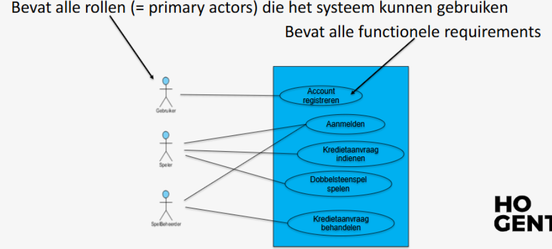

# Voorbeeld doorheen de cursus
## Wensen klant

Onze klant wil graag een simulatie krijgen van een dobbelspel. De klant meldt ons meteen dat als dit spelletje aanslaat, er dan heel snel uitbreidingen kunnen volgen. Hij beschrijft ons hier onder wat dit simulatiespel allemaal moet kunnen. 

“Het spel is vrij eenvoudig. Een speler gooit met twee dobbelstenen. Die eerste worp is belangrijk. Werpt hij 7 of 11,  dan wint de speler onmiddellijk het spel met een score 2. Anders moet hij dit specifieke aantal ogen – van de eerste worp - nog eens werpen vooraleer hij een 7  of een 11 werpt, ook dan wint hij maar met een score 1. Een speler kan pas spelen als hij voldoende krediet heeft. Een nieuwe speler start meteen krediet van 5, hij kan een aanvraag indien en om dat krediet te verhogen –  een beheerder controleert de betalingen. Het krediet kan verhoogd worden door te betalen of door spelletjes te winnen.

Het is een spel dat iedereen dus afzonderlijk kan spelen, maar we willen als dit aanslaat in een verder stadium ook graag tornooien opstellen. Elke speler moet gekend zijn in het spel zodat we een klassement kunnen opstellen. We organiseren dit nu als volgt: afhankelijk van het aantal deelnemers, starten we met een aantal tafels. 

Stel dat er vijf mensen aan één tafel zitten, dan mag iedere speler dit spel 5 + 1 keer spelen. Van die tafel wordt een rangorde opgesteld, de twee beste gaan door naar de volgende ronde.  Daar worden terug groepjes gemaakt. Terug de twee beste gaan door. Dan kom je aan de ronde waar er maar drie tafels meer over schieten. Hier gaat slechts telkens de beste door. Deze drie beste spelers spelen dan de finale. 

Soms worden de spelers willekeurig in groepen verdeeld om het tornooi te starten, soms worden ze op basis van vorige klassementen bij elkaar geplaatst.

Daarnaast heb ik ook nog allerhande extra mogelijkheden in mijn hoofd: er bestaan ook spelvarianten van dit dobbel spel.
- Een eerste voorbeeld hier van is dat de speler maximaal vijf maal mag gooien met de dobbelstenen.
- Een ander voorbeeld kan zijn dat het cijfer 2 ook zorgt – naast een 7 of een 11 – dat de speler wint.
- Nog een andere wijziging die mogelijk is, is het aantal wedstrijden dat per ronde gespeeld wordt.

De mogelijkheden zijn eindeloos, maar misschien moeten we eerst zorgen dat we het basisspel via pc kunnen spelen?

## USE CASE

**Usecase**: Speler registreren
**Primaire actor**: een (willekeurige) gebruiker
**Preconditie**: -
**Postconditie**: Het systeem heeft de nieuwe speler geregistreerd
**Normaal verloop** :
1. De gebruiker wenst zich te registreren als speler.
2. Het systeem vraagt naam, voornaam, e-mail, geboortedatum, wachtwoord en bevestiging wachtwoord.
3. De gebruiker geeft de gegevens in.
4. Het systeem valideert (alles verplicht + DR-wachtwoord + DR-email).
5. Het systeem registreert de nieuwe speler met een krediet van 5 Euro.
6. Het systeem toont een gepaste melding aan de gebruiker.

### Alternatieve verlopen

4A. Het systeem detecteert dat niet alle gegevens ingevuld zijn.
	4A1. Het systeem geeft een gepaste melding.
	4A2. Keer terug naar stap 2 in het normaal verloop.

4B. Het systeem detecteert dat er reeds een speler bestaat met opgegeven e-mailadres.
	4B1. Het systeem geeft een gepaste melding.
	4B2. Keer terug naar stap 2 in het normaal verloop.

4C. Het systeem detecteert dat wachtwoord en wachtwoordbevestiging niet gelijk zijn aan elkaar.
	4C1. Het systeem geeft een gepaste melding.
	4C2. Keer terug naar stap 2 in het normaal verloop.

4D. Het systeem detecteert dat gebruiker jonger is dan 18 jaar.
	4D1. Het systeem geeft een gepaste melding. 
	*Use case eindigt zonder bereiken van de postconditie*

4E. Het systeem detecteert dat het e-mailadres niet voldoet aan de regels van een geldig e-mailadres.
	4E1. Het systeem geeft een gepaste melding.
	4E2. Keer terug naar stap 2 in het normaal verloop.

4F. Het systeem detecteert dat het wachtwoord niet voldoet aan de regels van een wachtwoord (zie DR-wachtwoord).
	4F1. Het systeem geeft een gepaste melding.
	4F2. Keer terug naar stap 2 in het normaal verloop.

### Domeinregels

DR-wachtwoord
	Wachtwoord bestaat uit minstens 6 tekens, waarvan minstens 2 cijfers.

DR-email
	Het e-mailadres moet uniek zijn.

#### Normaal verloop = eerste scenario = mainsucces story

1. De gebruiker wenst zich te registreren als speler.
2. Het systeem vraagt naam, voornaam, e-mail, geboortedatum, wachtwoord en bevestiging wachtwoord.
3. De gebruiker geeft de gegevens in.
4. Het systeem valideert (alles verplicht + DR-wachtwoord + DR-email).
5. Het systeem registreert de nieuwe speler met een krediet van 5 Euro.
6. Het systeem toont een gepaste melding aan de gebruiker.

#### Als we afwijken van het hoofdscenario komen we in een alternatief scenario terecht

1. De gebruiker wenst zich te registreren als speler.
2. Het systeem vraagt naam, voornaam, e-mail, geboortedatum, wachtwoord en bevestiging wachtwoord.
3. De gebruiker geeft de gegevens in.
4. Het systeem valideert (alles verplicht + DR-wachtwoord + DR-email).
5. Het systeem detecteert dat niet alle gegevens ingevuld zijn.
6. Het systeem geeft een gepaste melding
7. Het systeem vraagt naam, voornaam, e-mail, geboortedatum, wachtwoord en bevestiging wachtwoord.
8. De gebruiker geeft de gegevens in.
9. Het systeem valideert (alles verplicht + DR-wachtwoord + DR-email).
10. Het systeem registreert de nieuwe speler met een krediet van 5 Euro.
11. Het systeem toont een gepaste melding aan de gebruiker.

## usecase diagram

