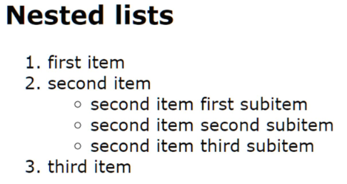
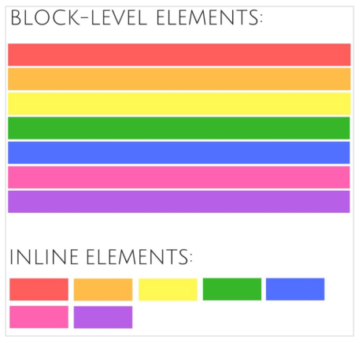
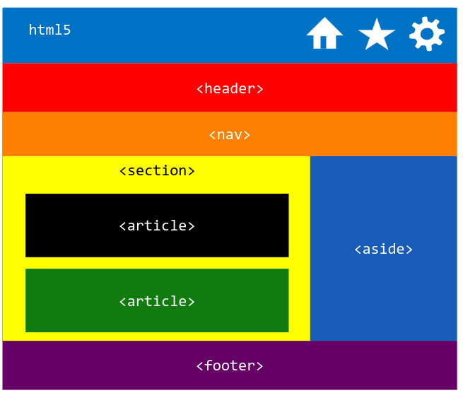

# Mozilla Developer Network

- https://developer.mozilla.org/en-US/docs/Web/HTML
- Bevat een HTML reference met informatie over alle HTML-elementen. Deze informatie is ook gemakkelijk oproepbaar vanuit Visual Studio Code. Door in Visual Studio Code te hoveren over een ‘tag name’ krijg je een korte beschrijving te zien van het element en een link naar de MDN-website waar je meer uitgebreide info vindt over het element.
- De website bevat ook een CSS reference. De info over de CSS properties is ook oproepbaar vanuit Visual Studio Code.


# Validatie website

- Valideer steeds je HTML- en CSS-code
	- online op https://validator.w3.org/
	- of via Chrome extensie HTML Validator

- Zeker tijdens het leren van HTML en CSS is het belangrijk om steeds je code te valideren.
- In de foutboodschappen komen soms de woorden deprecated (afgekeurd) en obsolete (verouderd) voor. Elementen en eigenschappen met deze stempel mag je niet gebruiken.

# Lijsten

| openingstag  | naam                           | actie                                                                                           | attributen            |
| ------------ | ------------------------------ | ----------------------------------------------------------------------------------------------- | --------------------- |
| \<ol> \<\ol> | Ordered List                   | lijst met rangschikking                                                                         | start, type, reversed |
| \<ul> \<\ul> | Unordered List                 | lijst zonder rangschikking                                                                      |                       |
| \<li> \<\li> | List item                      | item van een Ordered of Unordered List                                                          |                       |
| \<dl> \<\dl> | Description of Definition List | lijst met beschrijvingen of definities, Kan bijvoorbeeld gebruikt worden om een FAQ te markeren |                       |
| \<dt> \<\dt> | Description Term               | Deel van Description List,de term waarvoor een beschrijving of definitie wordt gegeven          |                       |
| \<dd> \<\dd> | Description Details            | Deel van Decription beschrijving of definitie van de term                                       |                       |
## Lijsten nesten

```html
<h2>Nested lists</h2>
<ol>
	<li>first item</li>
	<li>
		second item
		<!-- closing </li> tag not here! -->
		<ul>
			<li>second item first subitem</li>
			<li>second item second subitem</li>
			<li>second item third subitem</li>
		</ul>
	</li> <!-- Here's the closing </li> tag -->
	<li>third item</li>
</ol>
```



## Voorbeeld lists
```html
  <h1>Example lists</h1>
  <h2>Ordered List</h2>
  <h3>Simple example</h3>
  <ol>
    <li>Mix flour, baking powder and sugar.</li>
    <li> In another bowl, mix eggs and milk.</li>
    <li>Stir both mixtures together.</li>
    <li>Fill muffin tray 3/4 full. Bake for 20 minutes.</li>
  </ol>


  <h2>Unordered List</h2>
  <ul>
    <li>Introduction</li>
    <li>List of Grievances</li>
    <li>Conclusion</li>
  </ul>


  <h3>Using Roman Numeral type</h3>
  <ol type="i">
    <li>apples</li>
    <li>oranges</li>
    <li>bananas</li>
  </ol>


  <h2>Description List</h2>
  <h3>Example HTTP response status codes</h3>
  <dl><!-- start defenition list -->
    <dt>200 OK </dt><!-- title van defenition list -->
    <dd>The request has succeeded.</dd> <!-- description van defenition list -->
    <dt>404 Not Found</dt>
    <dd>The server can not find the requested resource. This response code is probably the most famous one due to its
      frequent occurrence on the web.</dd>
    <dt>500 Internal Server Error</dt>
    <dd>The server has encountered a situation it doesn't know how to handle.</dd>
  </dl><!-- einde defenition list -->


  <h2>Nested lists</h2>
  <ol>
    <li>first item</li>
    <li>second item<ul>
        <li>second item first subitem</li>
        <li>second item second subitem</li>
        <li>second item third subitem </li>
      </ul>
    </li>
    <li>third item</li>
  </ol>
```


# Block en inline elementen

Alhoewel de indeling in block-level en inline-level elements niet meer bestaat in HTML5 is het toch
interessant om deze te vermelden. De terminologie wordt immers nog steeds gebruikt in veel
artikels, vooral omdat de nieuwe indeling in HTML5 nogal complex is (zie ‘Content categories’).
◦ we gaan uit van een document die in een horizontaal geschreven taal staat (left-to-right, right-to-
left)

## Block elements (\<h1\>, \<p\>, …)
Een block-level element start altijd op een nieuwe regel en neemt de volledige beschikbare breedte in op de webpagina.

## Inline elements (\<a\>, \, …)
Een inline element begint niet op een nieuwe regel en neemt maar zoveel breedte is als nodig.



## Non semantic elements

- Er zijn twee HTML-elementen die geen semantische betekenis hebben nl. \<div\> en \<span\>.
	- \<div\> is een block element en een algemene container. Het wordt veelvuldig gebruikt worden om elementen te groeperen. Bijvoorbeeld om ze daarna op te maken met CSS of omdat ze een gemeenschappelijk attribuut, zoals bijv. het lang-attribuut hebben.
	- \<span\> is net als het \<div\> een algemene container, maar is een inline element.

- Gebruik \<div\> en \<span\> enkel als er geen semantisch element voorhanden is.

# Text block elements


| HTML Tag       | Beschrijving                                                                                  |
|----------------|----------------------------------------------------------------------------------------------|
| `<ol>`, `<ul>`, `<dl>` | Reeds besproken: respectievelijk genummerde lijsten, ongenummerde lijsten, en definitielijsten. |
| `<blockquote>` | Voor langere citaten.                                                                        |
| `<figure>`     | Groepeert een illustratie met zijn bijschrift. Dit kan ook een tabel, grafiek, citaat of meer zijn. |
| `<figcaption>` | Het bijschrift binnen een `<figure>`.                                                        |
| `<address>`    | Markeert contactinformatie.                                                                  |
| `<pre>`        | Behoudt tabs, witruimte en regelindelingen (pre-formatted tekst).                            |
| `<hr>`         | Geeft een thematische scheiding tussen paragrafen.                                           |
# Text inline elements

| HTML Tag       | Beschrijving                                                                                      |
|----------------|--------------------------------------------------------------------------------------------------|
| `<strong>`     | Geeft nadruk aan tekst, heel belangrijk. Default weergegeven in vet (bold).                      |
| `<em>`         | Legt klemtoon (emphasis) op tekst. Default weergegeven in cursief (italic).                      |
| `<b>`          | Vestigt de aandacht van de lezer op tekst die niet essentieel is.                                |
| `<i>`          | Verbetert de leesbaarheid door bepaalde tekst te benadrukken.                                    |
| `<small>`      | Geeft aanvullende informatie, zoals copyrighttekst.                                              |
| `<cite>`       | Markeert de naam van een auteur of creatief werk (geen attribuut voor bronvermelding).            |
| `<q>`          | Voor korte citaten in een lopende zin. Het attribuut `cite` kan worden gebruikt voor de bron.     |
| `<abbr>`       | Markeert een afkorting (abbreviation).                                                           |
| `<dfn>`        | Markeert de eerste keer dat een definitie voorkomt.                                              |
| `<code>`       | Markeert programmeercode.                                                                        |
| `<time>`       | Gebruikt om een tijdstip of datum aan te duiden.                                                 |
| `<samp>`       | Geeft computeruitvoer weer.                                                                      |
| `<kbd>`        | Gebruikersinvoer (toetsenbord of andere invoermethoden).                                         |
| `<s>`          | Geeft aan dat informatie niet meer klopt (suppress).                                             |
| `<sub>`        | Geeft subscript (onderschrift) weer.                                                             |
| `<sup>`        | Geeft superscript (bovenschrift) weer.                                                           |
| `<mark>`       | Markeert tekst met speciale relevantie (highlighted text).                                       |
| `<ins>`        | Geeft aan dat inhoud is toegevoegd.                                                              |
| `<del>`        | Geeft aan dat inhoud is verwijderd.                                                              |

# Hyperlinks

Hyperlinks maken navigatie tussen webpagina's mogelijk. Ze kunnen verwijzen naar:

- Een pagina binnen dezelfde website.
- Een pagina op een andere website.
- Een specifieke plaats binnen een pagina (bookmarks).
- Een e-mailadres (opent een e-mailclient).

**Voorbeeld hyperlink:**

```html
<a href="https://www.hogent.be">Hogeschool Gent</a>
```

**Klikbare inhoud:** kan tekst, afbeeldingen, koppen of volledige artikelen bevatten.

---

## Het `<a>`-element

- **Zonder `href`-attribuut:** er gebeurt niets bij klikken.
- **`href=""`:** laadt de huidige pagina.
- **`href="#"`:** springt naar de top van de pagina.

**Navigation menu met `<ul>`:**
```html
<ul>
  <li><a href="index.html">Home</a></li>
  <li><a href="pictures.html">Pictures</a></li>
  <li><a href="projects.html">Projects</a></li>
</ul>

```

## Absolute en relatieve paden

- **Absolute paden:** starten met `/` en verwijzen naar de root van de website.  
    Voorbeeld:
```html
<a href="/contacts.html">Contacts Page</a>

```

###  **Relatieve paden:** afhankelijk van de huidige mapstructuur.

- Binnen dezelfde map: alleen de bestandsnaam nodig.
```html
<a href="contacts.html">Contacts Page</a>
```
	
- Mapniveau lager: voeg de mapnaam toe.
```html
<a href="projects/index.html">Project Homepage</a>
```

- Mapniveau hoger: gebruik `..` om naar de bovenliggende map te verwijzen.
```html
<a href="../index.html">Projects Page</a>
<a href="../../pdfs/project-brief.pdf">Project Brief</a>
```

---

## Speciale links

-  **Nieuw tabblad openen:**
```html
<a href="http://www.w3.org" target="_blank">World Wide Web Consortium</a>
```

- E-mail starten:
```html
<a href="mailto:webmaster@hogent.be">Mail de webmaster</a>
<a href="mailto:webmaster@hogent.be?subject=reactie">Mail met onderwerp</a>
```

- Telefoonnummer bellen:
```html
<a href="tel:+3209828282">Bel de webmaster</a>
```

- SMS versturen:
```html
<a href="sms:+18664504185">Stuur een SMS</a>
```


## PDF-bestand weergeven of downloaden:
- Weergeven:
```html
<a href="./pdf/h05.pdf">PDF van hoofdstuk 5</a>
```

- Downloaden:
```html
<a href="./pdf/h05.pdf" download="hoofdstuk 5">Download PDF</a>
```

## Belangrijke aandachtspunten

- Zorg voor correcte paden om HTTP 404-fouten te voorkomen.
- Gebruik duidelijke en toegankelijke linkteksten.
- Combineer links vaak met een lijst (`<ul>` of `<ol>`) voor navigatiemenu’s.

## Bookmarks
Het is ook mogelijk om te linken naar een specifiek deel (document fragment) van een HTML document in plaats van naar het begin van het HTML document.
- Om dit te doen moet je eerst het specifiek deel (ook wel bladwijzer of bookmark genoemd) aanduiden. Je doet dit door een id-attribuut toe te kennen aan het element waarnaar je wilt linken. Dikwijls zal dit een heading element zijn.

```html
<h2 id="Mailing_address">Mailing address</h2>
```
- Om dan te linken naar het specifieke id voeg je op het einde van de url een \#-teken toe gevolgd door het id.

```html
<a href="contacts.html#Mailing_address">mailing address</a>
```

## Links binnen eenzelfde pagina

Als je links maakt binnen eenzelfde pagina mag je de bestandsnaamweglaten. De url start dan met een \#

```html
<a href="#jan">

<h3 id="#jan">
```

# Paginastructuur

## Heading elementen

### \<h1\>-\<h6\>
- \<h1\> : hoofdonderwerp, meestal de paginatitel. Meestal 1 h1-element per pagina
- \<h2\> : Een ondertitel.
- \<h3\> : Tussen kopjes

## Pagina opbouw

- HTML5 bevat elementen om de pagina in logische blokken in te delen
	- vóór HTML5: div element
	- sinds HTML5: **section**, **article**, **aside**, **footer**, **header**, **nav** en het later toegevoegde **main**

 - *elk element geeft een specifieke betekenis (semantiek) aan zijn inhoud*. Dit zorgt voor een duidelijkere structuur voor screen readers en voor zoekmachines dan  wanneer men enkel div-elementen gebruikt.

 - Eénmaal de inhoudsblokken gekend zijn, kan je ze opmaken met css.

## Logische blokken

| Element    | Beschrijving                                           |
|------------|-------------------------------------------------------|
| `<article>`| Zelfstandig stuk inhoud dat onafhankelijk te hergebruiken is. |
| `<section>`| Onderdeel van een pagina waarvoor geen specifieker element is. |
| `<nav>`    | Hoofdnavigatie.                                       |
| `<aside>`  | Zijdelingse informatie.                               |
| `<header>` | Kopgedeelte van een pagina of sectie.                 |
| `<footer>` | Voettekst van een pagina of sectie.                   |


# Afbeeldingen

- Dit is een inleiding op afbeeldingen toevoegen aan een webpagina en behandelt onder andere het kiezen van het juiste bestandsformaat.

- Maak bij voorkeur een aparte map aan binnen je webstructuur waar je de afbeeldingen opslaat. Indien er heel veel afbeeldingen zijn, maak dan ook submappen aan (volgens onderwerp: bvb. reizen, hobby, jeugdbeweging,…)

```html

```

- verplicht attribuut bij \ is **alt**. Dit is een *korte beschrijving van de image*.
- Het **title**-attribuut. Dit *geeft een meer uitgebreide beschrijving van de image en zorgt voor een tooltip*.

- In plaats van vele grote foto’s op te nemen op een webpagina kan het een goed idee zijn, om gebruik te maken van thumbnails.
## Afbeelding + hyperlink

```html
<html>
	<head>…</head>
	<body>
		<a href="html/registreer.html">
			
		</a>
	</body>
</html>
```

# Speciale characters

- **sommige karakters hebben voor de browser een speciale betekenis**, nl. `<`, `>` , `"`,`'` en `&`. Om deze karakters in de browser **te kunnen weergeven wordt gebruikgemaakt van** *‘character references’*.

- een named **character reference** *start met een ampersand* (`&`) *en eindigt met een* (`;`)

| Literal Character     | Named Character Reference Equivalent |
|-----------------------|---------------------------------------|
| `<`                   | `&lt;`                                |
| `>`                   | `&gt;`                                |
| `"`                   | `&quot;`                              |
| `'`                   | `&apos;`                              |
| `&`                   | `&amp;`                               |
| `©`                   | `&copy;`                              |
| Non-breaking space    | `&nbsp;`                              |
| Soft hyphen           | `&shy;`                               |
| `±`                   | `&plusmn;`                            |
| `—`                   | `&mdash;`                             |

## Favicon

- Een favicon is een pictogram dat in het tabblad van de browser wordt afgebeeld.
- Er zijn meerdere manieren om een favicon toe te voegen aan je website:
	- De eenvoudigste manier is een favicon.ico-bestand in de root van je website plaatsen. Het bestand favicon.ico wordt gecached en weergegeven op elke webpagina in je website.
	-  In principe kan je per webpagina een ander icon weergeven met behulp van het link- element
- Voor meer informatie zie: https://en.wikipedia.org/wiki/Favicon

```html
<link rel="shortcut icon" type="image/png" href="image/favicon.png">
```

