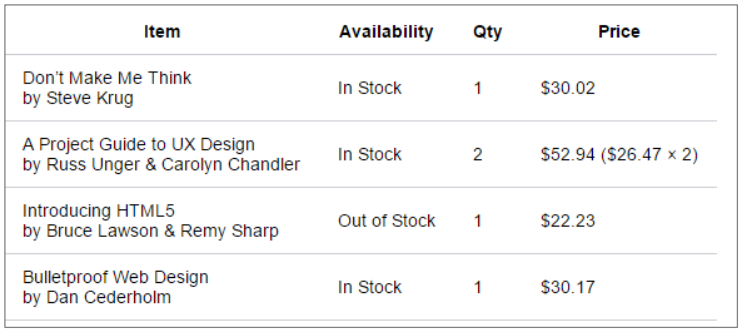

# Tabel

| openingstag             | naam                         | actie                                             | attributen         |
| ----------------------- | ---------------------------- | ------------------------------------------------- | ------------------ |
| \<table> \<table>       | Tabel                        | tag waarbinnen de tabel zich bevind               |                    |
| \<caption> \<caption>   | Bijschrift                   | Bijschrift boven de tabel                         |                    |
| \<tr> \<tr>             | Tabel rij                    | een rij                                           |                    |
| \<th> \<\th>            | Tabel hoofding               | Kolomnaam                                         |                    |
| \<td> \<\td>            | Tabel data                   | data kolom                                        | colspan<br>rowspan |
| \<thead> \<\thead>      | Het head deel van de tabel   | Deel dat de head van de tabel aflijnt (voor css)  |                    |
| \<tbody> \<\tbody>      | Het body deel van de tabel   | eel dat de body van de tabel aflijnt (voor css)   |                    |
| \<tfoot> \<\tfoot>      | Het footer deel van de tabel | eel dat de footer van de tabel aflijnt (voor css) |                    |
| \<colgroup> \<colgroup> |                              |                                                   |                    |
| \<col> \<col>           |                              |                                                   |                    |
## Border
**Dubbele rand naar enkele rand**
```css
table { 
  border-collapse: collapse; 
}
```

**moderne opmaak**
```css
table {
  border-collapse: collapse;
  font-size: 14px;
}

table, th, td {
  border-block-end: 1px solid #cecfd5;
  padding: 10px 15px;
}
```

## Cellen samenvoegen
Toevoegen als *attribuut*:
- **colspan** (rijen samen voegen)
```html
<tr>
	<td colspan="3">Subtotaal</td>
	<td>$135.36$</td>
</tr>
```

- **rowspan** (kolommen samen voegen)
```html
<tr>
	<td rowspan="2">In Stock</td>
	<td>1</td>
	<td>$30.02</td>
</tr>
```

## Structuur

- Vaak kan men in tabellen volgende items onderscheiden:
	1.  header
	2. body
	3. footer

 - In HTML kan men deze met de volgende tags omsluiten:
	- `<thead>`
	- `<tbody>`
	- `<tfoot>`

 - In feite is dit een logische indeling van de tabel. Dit is nuttig voor screen readers en voor de opmaak in CSS.

### voorbeeld
```html
<table>
	<thead>
		<th>Item</th>
		<th>In Stock</th>
		<th>Qty</th>
		<th>Price</th>
	</thead>
	<tbody>
		<tr> ...
		</tr>
		<tr> ...
		</tr>
		<tr> ...
		</tr>
		<tr> ...
		</tr>
	</tbody>
	<tfoot>
		<tr>
			<td colspan="3">Subtotal</td>
			<td>$136.36</td> 
		</tr>
		<tr> ...
		</tr>
	</tfoot>
</table>
```

| Element      | Beschrijving                                                                    |
| ------------ | ------------------------------------------------------------------------------- |
| `<table>`    | Begin van elke tabel.                                                           |
| `<tr>`       | Rijen binnen een tabel.                                                         |
| `<td>`       | Tabelcel met data (table data).                                                 |
| `<th>`       | Tabelcel met koptekst (table header).                                           |
| `colspan`    | Attribuut om een cel over meerdere kolommen te laten lopen.                     |
| `rowspan`    | Attribuut om een cel over meerdere rijen te laten lopen.                        |
| `<caption>`  | Optioneel: Bijschrift voor de tabel. (nog boven thead)                          |
| `<colgroup>` | Optioneel: Groeperen van kolommen voor opmaak met CSS.                          |
| `span`       | Attribuut voor aantal kolommen binnen `<colgroup>` of `<col>`.                  |
| `<col>`      | Optioneel: Kolommen binnen een `<colgroup>`, kan ook met `span` attribuut.      |
| `<thead>`    | Optioneel: Koptekst van de tabel. Bevat rijen `<tr>` en kolommen `<th>`.        |
| `<tbody>`    | Optioneel: Markering van de tabelinhoud. Meerdere `<tbody>` per tabel mogelijk. |
| `<tfoot>`    | Optioneel: Overzicht, samenvatting of totaal, vóór of achter `<tbody>`.         |

### colgroup

Met `<colgroup>` kun je kolommen in een tabel stylen. Dit werkt alleen voor eigenschappen zoals `border`, `background`, `visibility`, en `width`.

**Voorbeeld:**
```html
<table>
  <colgroup>
    <col style="background-color: lightblue; width: 150px;">
    <col style="background-color: lightgray;">
  </colgroup>
  <tr>
    <th>Kolom 1</th>
    <th>Kolom 2</th>
  </tr>
  <tr>
    <td>Data 1</td>
    <td>Data 2</td>
  </tr>
</table>
<!-- In dit voorbeeld krijgt de eerste kolom een blauwe achtergrond en vaste breedte, terwijl de tweede kolom een grijze achtergrond heeft. -->
```


# Formulieren

- Elk onderdeel van het formulier resulteert in een name/value paar
	- De **name** is de beschrijving van het onderdeel
	- De **value** is de invoer die de gebruiker gaf


- Minder belangrijke attributen
	- id of name: formulier opmaken met CSS of gebruiken in JavaScript 
	- autocomplete: bepaalt of autocomplete voor alle velden van het formulier aan of af staat. Dit is ook een attribuut voor de controls afzonderlijk. Mogelijke waarden zijn: on en off


### onderdelen en controls

| openingstag             | naam                  | actie                                        | attributen                                                                                                                                                                                                                                                                                                              |
| ----------------------- | --------------------- | -------------------------------------------- | ----------------------------------------------------------------------------------------------------------------------------------------------------------------------------------------------------------------------------------------------------------------------------------------------------------------------- |
| \<form> \<form>         | Form                  | aflijning van het formulier                  | action<br>method (*post,get*)<br>autocomplete                                                                                                                                                                                                                                                                           |
| \<label> \<label>       | Label                 | Bijschrift bij het type                      | for                                                                                                                                                                                                                                                                                                                     |
| \<input> \<input>       |                       |                                              | type (*text, password, email, date, number, search, radio, checkbox, file, list, image, hidden, submit*)<br>name<br>id (moet naan van label zijn)<br>placeholder (hint invoerveld)<br>maxlength (maximum invoer lengte)<br>required (verplicht (field validation))<br>min<br>max<br>checked (bij radio en checkbox)<br> |
| \<select> \<select>     | Keuzelijst            | aflijning de keuzelijst                      | name<br>id<br>size<br>multiple                                                                                                                                                                                                                                                                                          |
| \<option> \<option>     | Optie                 | onderdeel van de keuzelijst of datalist      | value (de waarde, steeds invulen)<br>selected (standaardselectie)                                                                                                                                                                                                                                                       |
| \<datalist> \<datalist> | Combobox              | Aflijning van combobox                       | id (zelfde waarde als attrbt list)<br>                                                                                                                                                                                                                                                                                  |
| \<textarea> \<textarea> | Multi line text input | voor meerdere regels tekstinvoer             | name                                                                                                                                                                                                                                                                                                                    |
| \<fieldset> \<fieldset> | fieldset              | Form controls groeperen, bevat een \<legend> |                                                                                                                                                                                                                                                                                                                         |
| \<legend> \<legend><br> | legend                | titel van de fieldset                        |                                                                                                                                                                                                                                                                                                                         |
#### Extra elementen

| Element      | Beschrijving                          |
| ------------ | ------------------------------------- |
| `<button>`   | Knop                                  |
| `<textarea>` | Uitgebreide tekstinvoer               |
| `<option>`   | Een keuzemogelijkheid                 |
| `<optgroup>` | Groeperen van keuzemogelijkheden      |
| `<select>`   | Keuzelijst                            |
| `<datalist>` | Keuzelijst met invoervak              |
| `<fieldset>` | Groeperen van invoerelementen         |
| `<legend>`   | Titel voor een groep invoerelementen  |
| `<progress>` | Voortgang tonen                       |
| `<meter>`    | Een schaal binnen een begrensd bereik |
| `<output>`   | Resultaat van een berekening          |


### Post/get

**Attribuut method**:
- **get**: de *formulier-data worden toegevoegd aan de URL via naam-waarde paren* => zijn zichtbaar in de adresbalk + beperkt in lengte (afhankelijk van de browser) => enkel voor non-secure data
- **post**: voegt de *formulier-data toe aan de header van het HTTP request (niet zichtbaar)*. Wordt gebruikt bij data bestemd voor een databank, gevoelige data, uploaden bestanden.

- **action**: geeft de site aan naar waar de data gestuurd wordt na het klikken op de verzendknop
	- bij action mailto:stuster@live.be?subject=formulierinhoud

```html
        <form action="mailto:nikki.stuster@student.hogent.be?subject=formulierinhoud" method="post">
            <label for="firstname">Voornnaam</label> <input type="text" name="fname" id="firstname">
        </form>
```
label for="firstname" komt overeen met id van de control, hier id="firstname"
### Voorbeeld

```html
<form action="/submit" method="POST">
    <fieldset>
        <legend>Persoonlijke Gegevens</legend>

        <label for="naam">Naam:</label>
        <input type="text" id="naam" name="naam" required><br><br>

        <label for="email">E-mail:</label>
        <input type="email" id="email" name="email" required><br><br>

        <label for="geslacht">Geslacht:</label>
        <select id="geslacht" name="geslacht">
            <option value="man">Man</option>
            <option value="vrouw">Vrouw</option>
            <option value="anders">Anders</option>
        </select><br><br>

        <label for="interesses">Interesses:</label>
        <datalist id="interesses">
            <option value="Sport">
            <option value="Lezen">
            <option value="Reizen">
        </datalist>
        <input list="interesses" id="interesses" name="interesses"><br><br>

        <label for="opmerkingen">Opmerkingen:</label><br>
        <textarea id="opmerkingen" name="opmerkingen" rows="4" cols="50"></textarea><br><br>

        <input type="submit" value="Verstuur">
    </fieldset>
</form>
```

# Accessibility

-  Accessibilty (toegankelijkheid) richt zich op hoe een persoon met een handicap toegang krijgt tot of voordeel haalt uit een site, systeem of applicatie. Toegankelijkheid is een belangrijk onderdeel van het ontwerpen van een website en moet tijdens het ontwikkelingsproces in overweging worden genomen.

- Een goede basis en voorbeelden ivm accessibilty vind je op: https://developer.mozilla.org/en-US/docs/Learn/Accessibility/HTML

