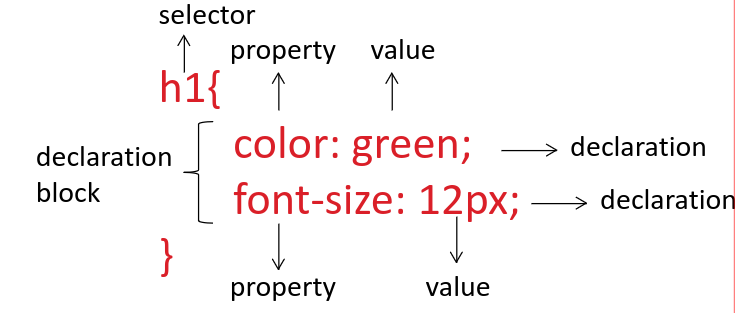
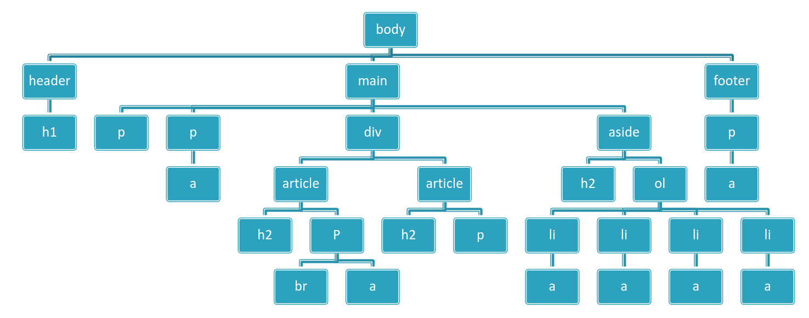

# CSS

## Inleiding

- Cascading Style Sheets is een verzameling van stijlregels (style rules) om webpagina’s op te maken (kleur, lettertype, achtergrondafbeeldingen, lay-out, …)

- Cascading Style Sheets
	- Latest stable version: https://www.w3.org/TR/CSS/
		- De CSS standaard wordt momenteel verder ontwikkeld in modules: kleur, boxmodel, …
	- Status: https://www.w3.org/Style/CSS/current-work
- Reference op MDN: https://developer.mozilla.org/en-US/docs/Web/CSS/Reference



## Toevoegen

### external stylesheet
- de CSS rules worden in een aparte .css-file geplaatst en via het <link>-element wordt de .css-file gekoppeld aan het html-document (zie ook les 1). Deze werkwijze geniet meestal de voorkeur.
```html
	<title>CSS</title>
	<link rel="stylesheet" href="css/styles.css">
</head>
```
### internal stylesheet
- de CSS rules worden in een \<style\>-element in de head van het html-document geplaatst. 
```html
	<title>CSS</title>
	<style>
		h2 {
			color: white;
			background-color: red;
		}
	</style>
</head>
```
### inline styles
- inline styles zijn CSS declarations die slechts van toepassing zijn op één element en plaats je in het style-attribuut voor dat element.
```html
<h2 style="color: white; background-color: red">
```


# Achtergrond


## background-repeat

- **Doel**: Bepaalt hoe een achtergrondafbeelding wordt herhaald.
- **Waarden**:
    - `repeat`: Herhaalt zowel horizontaal als verticaal (standaard).
    - `repeat-x`: Herhaalt alleen horizontaal.
    - `repeat-y`: Herhaalt alleen verticaal.
    - `no-repeat`: De afbeelding wordt niet herhaald.
    - `space`: Beeld wordt herhaald en de resterende ruimte tussen de afbeeldingen wordt gelijk verdeeld.
    - `round`: Beeld wordt herhaald en de resterende ruimte wordt opgevuld door de afbeelding te schalen.
- **Voorbeeld**:

```css
body {
  background-image: url('image.jpg');
  background-repeat: no-repeat;
}
```

## background-attachment

- **Doel**: Bepaalt of de achtergrondafbeelding meebeweegt met de pagina of vast blijft staan.
- **Waarden**:
    - `fixed`: De afbeelding blijft vast ten opzichte van het venster.
    - `scroll`: De afbeelding beweegt mee met de scroll van de pagina (standaard).
    - `local`: De afbeelding schuift mee met het element als het een scrollbalk heeft.
- **Voorbeeld**:

```css
body {
  background-image: url('image.jpg');
  background-attachment: fixed;
}
```

## background-position

- **Doel**: Bepaalt de positie van de achtergrondafbeelding in het venster.
- **Waarden**:
    - **Sleutelwoorden**: `left`, `center`, `right`, `top`, `bottom` (standaard is `left top`).
    - **Percentages**: Bijvoorbeeld `50% 50%` voor gecentreerd.
    - **Lengtes**: Bijvoorbeeld `10px 20px` voor positie in pixels.
- **Voorbeeld**:

```css
body {
  background-image: url('image.jpg');
  background-position: center;
}
```

## Shorthand (verkorte) properties

- **Doel**: Meerdere achtergrondinstellingen in één regel definiëren.
- **Gebruik**: De shorthand property `background` combineert de waarden voor kleur, afbeelding, herhaling en positie.
- **Voorbeeld**:

```css
body {
  background: #000 url('image.jpg') no-repeat left top;
}
```

### Waarschuwing met shorthand

- **Opmerking**: Het gebruik van shorthand kan bestaande waarden overschrijven, wat ongewenst kan zijn. Bijvoorbeeld, het instellen van `background` zonder `background-color` kan de achtergrondkleur op `transparent` zetten.
- **Voorbeeld**:

```css
background-color: red;
background: url('image.jpg') no-repeat left top;  /* Dit overschrijft de kleur */
```

## Gradiënten

- **linear-gradient**: Een lineair kleurverloop, bijvoorbeeld van boven naar beneden.
- **radial-gradient**: Een radiaal kleurverloop, bijvoorbeeld van het midden naar buiten.
- **Voorbeeld**:

```css
body {
  background: linear-gradient(to right, red, blue);
}
```

Generator: https://cssgradient.io/


# Kleuren

## Instellen van Kleur

- **Textkleur**: Stel de tekstkleur in met de `color` property.
- **Achtergrondkleur**: Stel de achtergrondkleur in met de `background-color` property.
- **Randen, Schaduwen, enz.**: Gebruik eigenschappen zoals `border-color`, `text-shadow` voor andere kleureigenschappen.
- **Voorbeeld**:

```css
h1 {
  color: red; /* Tekstkleur */
  background-color: yellow; /* Achtergrondkleur */
}
```

## Manieren om een Kleur te Definiëren

### Named Colors

CSS ondersteunt kleuren zoals `red`, `blue`, `green`, enz.
    
    - **Voorbeeld**:

```css
h1 { color: red; }
```

### RGB (Red, Green, Blue)

Kleur definiëren via de intensiteit van de drie componenten.

- **Absolute waarden**: Waarden tussen 0 en 255.
    - **Voorbeeld**:

```css
h1 { color: rgb(255, 127, 0); } /* Orange */
```

### Relatieve waarden
Percentages tussen 0% en 100%.

- **Voorbeeld**:

```css
h1 { color: rgb(100% 50% 0%); } /* Orange */
```

### Hexadecimale Notatie

Kleurcode begint met `#` gevolgd door hexadecimale waarden.

- **Voorbeeld**:

```css
h1 { color: #ff7f00; } /* Orange */
```

## RGB met Alpha Channel (Transparantie)

- **Doel**: De vierde component, het alpha channel, bepaalt de transparantie.

### Absolute waarden

Tussen 0 (volledig transparant) en 1 (volledig dekkend).

- **Voorbeeld**:

```css
h1 { color: rgb(255, 127, 0 / 0.5); } /* Orange, 50% transparant */
h1 { color: rgb(255, 127, 0 / 1); } /* Orange, volledig dekkend */
h1 { color: rgb(255, 127, 0 / 0); } /* Orange, volledig transparant */
```

### Relatieve waarden

Percentages tussen 0% en 100%.

- **Voorbeeld**:

```css
h1 { color: rgb(100% 50% 0% / 50%); } /* Orange, 50% transparant */
```

## Kleuren kiezen

- **Kleurtools**: Gebruik tools zoals [Adobe Color](https://color.adobe.com/) om een kleurenpalet te kiezen.
- **Meer informatie**: MDN biedt informatie over [kleurtheorie](https://developer.mozilla.org/en-US/docs/Web/CSS/CSS_colors/Using_color_wisely) en kleurenmodellen zoals RGB en HSL.
    - **RGB en HSL modellen**: Beide worden uitgelegd op de MDN-pagina en door Khan Academy (in samenwerking met Pixar).

# Lijsten opmaken

opmaken van lijsten in CSS

Hier is een gestructureerde samenvatting van de leerstof over het opmaken van lijsten in CSS:

## 1. List Style Properties

- **`list-style-type`**: Bepaalt het opsommingsteken (bullet) voor een lijst.
    
    - Voorbeelden:
        - **`upper-alpha`**: Hoofdletters (A, B, C, ...).
        - **`none`**: Geen opsommingsteken.
    - **Voorbeeld**:
        
        ```css
        ol { list-style-type: upper-alpha; }
        ul { list-style-type: none; }
        ```
        
    - Opmerking: **Unordered lists** worden vaak zonder opsommingstekens gebruikt voor navigatie, met `list-style-type: none`.
- **`list-style-image`**: Gebruikt een afbeelding als opsommingsteken.
    
    - **Voorbeeld**:
        
        ```css
        ul { list-style-image: url('bullet.png'); }
        ```
        
    - Het pad naar de afbeelding is relatief ten opzichte van het CSS-bestand, niet de HTML-pagina.
- **`list-style-position`**: Bepaalt de plaatsing van het opsommingsteken.
    
    - **`inside`**: Het opsommingsteken bevindt zich binnen de lijstitemtekst.
    - **`outside`**: Het opsommingsteken bevindt zich buiten de lijstitemtekst (standaardinstelling).
    - **Voorbeeld**:
        
        ```css
        ul { list-style: circle inside; }
        ```
        

## 2. Shorthand Property

- **`list-style`**: Verkorte eigenschap om alle bovenstaande eigenschappen in één regel in te stellen.
    - **Voorbeeld**:
        
        ```css
        ul { list-style: circle inside; }
        ```
        
    - Hiermee stel je het opsommingsteken (type) en de plaatsing in één keer in.

## Samenvatting:

- **`list-style-type`**: Stelt het type opsommingsteken in, zoals `upper-alpha`, `circle`, of `none`.
- **`list-style-image`**: Maakt het mogelijk om een afbeelding te gebruiken als opsommingsteken.
- **`list-style-position`**: Bepaalt de plaatsing van het opsommingsteken (`inside` of `outside`).
- **`list-style`**: Verkorte eigenschap voor het combineren van bovenstaande instellingen in één regel.


# Text en typografie

Hier is een gestructureerde samenvatting van de leerstof over tekst en typografie in CSS, met een samenvattende tabel:

## Eenheden

- **`rem` (root em)**: De tekstgrootte wordt berekend ten opzichte van het root-element `<html>` (standaard 16px).
- **Voordeel**: Lost het probleem van samengestelde `em` eenheden op.

## Font Properties

- **`font-weight`**: Bepaalt de dikte van het lettertype.
    
    - Waarden: van 100 tot 900, of de sleutelwoorden `normal` (400), `bold` (700), `bolder`, en `lighter`.
- **`font-style`**: Bepaalt of de tekst normaal, cursief of schuin is.
    
    - Waarden: `normal`, `italic`, `oblique`.
- **`line-height`**: Bepaalt de afstand tussen regels tekst.
    
    - Best practice: `line-height: 1.5` (1.5 keer de `font-size`).
- **Shorthand for Font Properties**:
    
    - **`font`**: Combineer verschillende font-eigenschappen in één regel.
    - Volgorde: `font-style` `font-variant` `font-weight` `font-size/line-height` `font-family`.
    - **Voorbeeld**:
        
        ```css
        font: italic 1.2em/1.5 "Fira Sans", serif;
        ```
        

## Text Formatting

- **`text-transform`**: Hoofdlettergebruik voor tekst.
    - Waarden: `uppercase`, `lowercase`, `capitalize`, `none`.
- **`font-variant`**: Maakt gebruik van kleine hoofdletters.
    - Waarde: `small-caps`.
- **`text-decoration`**: Bepaalt de stijl van de tekstdecoratie (onderstreping, doorhalen, etc.).
    - Waarden: `none`, `underline`, `overline`, `line-through`, `blink`.
- **`letter-spacing`**: Verandert de afstand tussen letters.
    - **Voorbeeld**: `letter-spacing: .7em;`
- **`word-spacing`**: Verandert de afstand tussen woorden.
    - **Voorbeeld**: `word-spacing: 2px;`
- **`text-align`**: Bepaalt de uitlijning van de tekst.
    - Waarden: `left`, `right`, `center`, `justify`.
- **`text-indent`**: Bepaalt de inspringing van de eerste regel van de tekst.
    - **Voorbeeld**: `text-indent: 2em;`

## Samenvattende Tabel:

|**Eigenschap**|**Beschrijving**|
|---|---|
|`font-weight`|Bepaalt de dikte van de tekst (100-900 of `normal`, `bold`, etc.)|
|`font-style`|Bepaalt of de tekst normaal, cursief of schuin wordt weergegeven|
|`line-height`|Bepaalt de ruimte tussen regels tekst (bijv. `line-height: 1.5`)|
|`font`|Verkorte eigenschap voor font-instellingen: `font-style`, `font-variant`, etc.|
|`text-transform`|Hoofdlettergebruik (`uppercase`, `lowercase`, etc.)|
|`font-variant`|Kleine hoofdletters (`small-caps`)|
|`text-decoration`|Stijl van tekstdecoratie (`underline`, `line-through`, etc.)|
|`letter-spacing`|Verandert de afstand tussen letters (bijv. `letter-spacing: .7em;`)|
|`word-spacing`|Verandert de afstand tussen woorden (`word-spacing: 2px;`)|
|`text-align`|Bepaalt de uitlijning van tekst (`left`, `center`, `justify`, etc.)|
|`text-indent`|Bepaalt de inspringing van de eerste regel tekst (`text-indent: 2em;`)|

# CSS selectors

## Dom tree



## Termen

- child : onderliggend element
- parent : bovenliggend element
- descendant : afstamming
- sibling : elementen die op hetzelfde niveau staan (broers of zusters van)
## soorten
- Universal selector en de type selector
- Class en Id selectors
- Selector list (aka Group selector)
- Child en Descendant combinators
- Adjacent en General sibling combinator
- Attribute selectors
- Pseudo-classes
- Pseudo-elements

## Universal selector en de type selector (TE KENNEN)

| voorbeeld | 1ste teken in css | naam               | prioriteit |
| --------- | ----------------- | ------------------ | ---------- |
| \* {};    | \*                | Universal selector | 1          |
| h2{};     | naamVanElement    | Type selector      | 2          |

## Class en Id selectors (TE KENNEN)

Waar mogelijk andere selectors gebruiken.

| voorbeeld      | 1ste teken in css | naam  | prioriteit | komt van (niet zo geschreven) |
| -------------- | ----------------- | ----- | ---------- | ----------------------------- |
| \#archives {}; | #                 | id    | 3          |                               |
| .archives{};   | .                 | class | 3          | \*.archives{};                |
## Selector list (aka Group selector)(TE KENNEN)

*meerdere* elementen gebruiken, *gescheiden met komma*
```css
h2, h1, .archives{};
```
## Child en Descendant combinators

### Descendant combinator(TE KENNEN)
Een *afstammeling* selecteren, *gebruik spaties*, het meest rechtse element (key selector) zal opgemaakt worden.
```css
div p {};
```
Enkel het `p` element onder het `div` element zal opgemaakt worden, andere `p` elementen niet.

### Child combinator (TE KENNEN)
Een *directe afstammeling* selecteren, *gebruik \>*, het meest rechtse element (key selector) zal opgemaakt worden.
```css
div > p {};
```
Enkel het `p` element *rechtstreeks* onder het `div` element zal opgemaakt worden, andere `p` elementen niet.

## Adjacent en General sibling combinator

*Selecteren op hetzelfde niveau*
### Sibling
Alle p die *onmiddelijk naast* h1 staat. (zal niet geselecteerd worden als er een element tussen zit)
```css
h1 + p {};
```
### General
Alle p die *naast* h1 staat. (niet per se onmiddellijk naast)
```css
h1 ~ p {};
```

## Attribute selectors
Selecteren op basis van attribuut, zet het attrubuut tussen \[\]

```css
a[href] {}
```

## Pseudo-classes (ENKELE VAN KENNEN)

Pseudo-class *start altijd met een* **:** en dan de naam van de pseudo-class
Deze kunnen we *gebruiken om iets interactief te maken met CSS*

| voorbeeld  | 1ste teken in css | naam                               | actie                  | te kennen |
| ---------- | ----------------- | ---------------------------------- | ---------------------- | --------- |
|            | :link             |                                    |                        |           |
|            | :visited          |                                    |                        |           |
|            | :active           |                                    |                        |           |
| a:hover{}; | :hover            |                                    | met muis over hooveren | X         |
|            | :first-child      | eerste kind van een parent         |                        |           |
|            | :last-child       | laatste kind van een parent        |                        |           |
|            | :only-child       | element die geen ouder heeft       |                        |           |
|            | :first-of-type    | het eerste element van dat type    |                        | X         |
|            | :last-of-type     | het laatste elemetn van dat type   |                        |           |
|            | :only-of-type     | het enige element van dat type     |                        |           |
|            | :nth-of-child(n)  | elk zoveelste child-element        |                        |           |
|            | :nth-last-child   | gerekend vanaf laatste element     |                        |           |
|            | :nth-of-type(n)   | elk zoveelste (n) element van type |                        | X         |
|            | :nth-last-of-type | gerekend vanaf laatste element     |                        |           |
|            | :empty            | leeg element                       |                        |           |

mooi voorbeeld voor een hyperlink (\<a> element)
```html
  <style>
    a{
      text-decoration: none;
    }
    a:hover{
      text-decoration: underline;
    }
  </style>
```
Dit zal de onderlijning van de hyperlink weghalen behalve als je er over hoverd.
## Pseudo-elements

| voorbeeld                 | 1ste teken in css | naam                                         | gebruik                     |
| ------------------------- | ----------------- | -------------------------------------------- | --------------------------- |
|                           | ::first-line      | eerste regel opgemaakte text van een element |                             |
| p::first-letter{};        | ::first-letter    | de eerste letter                             |                             |
| a::before{content: '❤️'}; | ::before          | voor de inhoud van een element               | om afbeelding toe te voegen |
|                           | ::after           | na de inhoud van een element                 |                             |

