# CSS Grid Layout
## Definitie
- Is een twee dimensionaal lay-out model voor CSS. Het heeft veel mogelijkheden voor de positionering van boxes en hun inhoud, alsook voor het controleren van de afmetingen (sizing) van de boxes.

- Een grid (of raster) bestaat uit (denkbeeldige) horizontale en verticale lijnen die een grid container opdelen in rijen, kolommen en cellen. Te vergelijken met een tabel.

https://gridbyexample.com/
## Flexbox vs Grid

- In tegenstelling tot ‘Flexible Box layout’ (kort Flexbox of *flex*), dat een **eendimensioneel lay-outsysteem** is, is ‘Grid Layout’ (kort *Grid*) een **tweedimensioneel lay-outsysteem**.

## Grid terminology

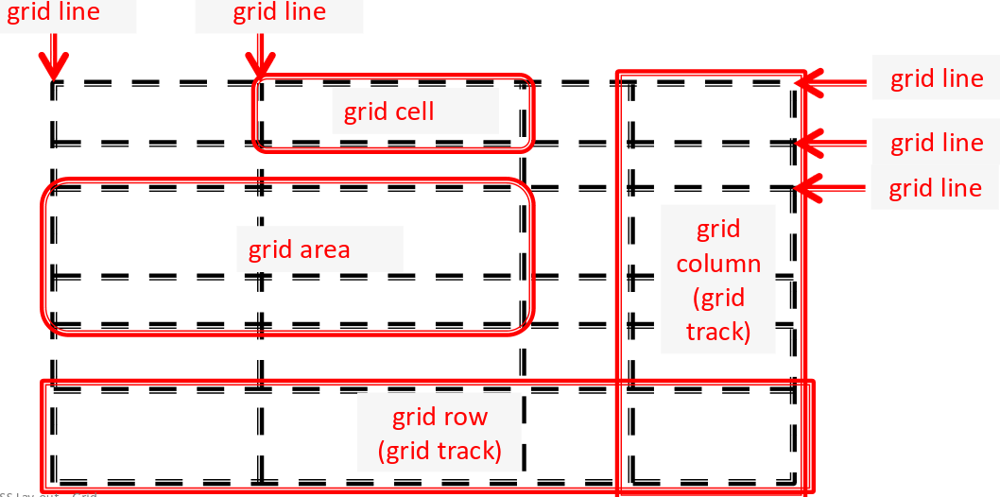


# Hoe Grid gebruiken

## Aanmaken van een Grid

1. **Creëer een grid container**
	- Als blok
		- *display: block grid;* of (vroeger) display: grid;
			- De eerste waarde duidt aan dat de container een block element is.
			- De tweede waarde heeft tot gevolg dat alle directe kind-elementen van dit grid container-element, grid items worden.
			- Met display:block grid definieer je dus niet alleen de grid container, maar ook impliciet de grid items.
	
	- Als inline
		-  *display: inline grid* creëert een inline-level-element.
	

2. **Definieer de grid** (het aantal rijen en/of kolommen en hun hoogte/breedte), hier zijn *2 mogelijkheden*
	- met columns en rows
		- *grid-template-columns*
		- *grid-template-rows*

	- met areas
		- *grid-template-areas*

	- De uiteindelijke grid kan echter groter zijn vanwege grid-items die buiten de ‘expliciet grid’ geplaatst worden.
		- In dit geval zullen er impliciet tracks gecreëerd worden.
		- De afmetingen van deze tracks worden bepaald door *grid-auto-rows* en *grid-auto-columns*.
### Voorbeeld
```html
<div class="grid-container">
	<div>item 1</div>
	<div>item 2</div>
	<div>item 3</div>
	<div>item 4</div>
	<div>item 5</div>
</div>
```

```css
* {
	box-sizing: border-box;
}

/* CSS Grid Layout */
.grid-container {
	display: block grid;
	grid-template-columns: 150px 150px 150px;
	grid-template-rows: 100px 100px 100px 100px;
	background-color: cyan;
}

.grid-container div {
	border: 1px solid black;
	background-color: white;
	border-radius: 5px;
	padding: 1em;
}
```

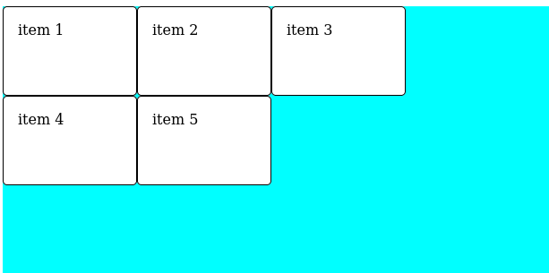

## Grid Columns en Rows

- De waarde voor grid-template-columns (en grid-template-rows) kan een \<track-list\> zijn of een \<auto-track-list\>
- *Mogelijke track sizes* bij een \<track-list\> zijn:
	- **\<length\>**
	- **\<percentage\>**
	- **\<flex\>**
	- **min-content**
	- **max-content**
	- **minmax(min,max)**
	- **fit-content(value)**
	- **auto**

```css
/* Voorbeelden <track-list> */
grid-template-columns: 20ch 200px 200px;
grid-template-columns: 20% 60% 40%;
grid-template-columns: 100px 1fr 2fr;
grid-template-columns: minmax(100px, 200px);
grid-template-columns: fit-content(40%);
grid-template-columns: auto 100px 1fr;
```

###  fr-eenheid

- Met de fr-eenheid kan je ‘flexible grid tracks’ (rijen of kolommen) maken.
- De fr-eenheid stelt een fractie voor van de ‘leftover space’. De ‘leftover space’ is de ruimte die niet ingenomen wordt door ‘non-flexible grid tracks’.

#### Voorbeeld
```css
.grid-container {
	display: block grid;
	grid-template-columns: 2fr 1fr 1fr 
}
```

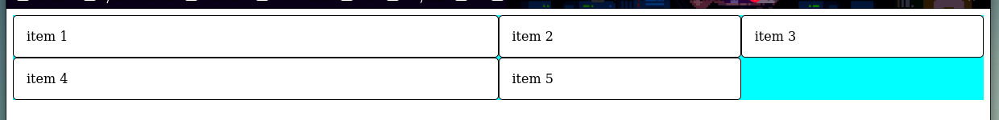

### repeat functie

- Met de repeat()-functie kan je een **(deel van een) ‘track-list’ herhalen**.

- Zo kan je
	- `grid-template-columns: 1fr 1fr 1fr;`
	*korter schrijven als:*
	- `grid-template-columns: repeat(3, 1fr);`

- Een meer uitgebreid voorbeeld:
	- `grid-template-columns: 20px repeat(4, 1fr 2fr);`
	*is hetzelfde als:*
	- `grid-template-columns: 20px 1fr 2fr 1fr 2fr 1fr 2fr 1fr 2fr;`

### grid-auto-rows/grid-auto-columns
 
 - Deze CSS properties bepalen hoe groot automatisch aangemaakte rijen of kolommen moeten worden in een CSS Grid.

- Bij grid-auto-rows/grid-auto-columns kunnen we dezelfde ‘track sizes’ gebruiken als bij grid-template-rows/grid-template-colums.
	- Voorbeeld minmax():
		- grid-auto-rows: minmax(100px, auto);
	- In dit voorbeeld zal de rijhoogte steeds aangepast worden aan de inhoud (auto), maar de rijhoogte zal nooit kleiner worden dan 100px.

- Als je CSS Grid gebruikt, kun je op twee manieren rijen en kolommen maken:

1. **Expliciet** (vooraf gedefinieerd):
```css
.grid {
  grid-template-columns: 100px 200px 100px; /* Je definieert precies welke kolommen je wilt */
}
```

2. **Impliciet** (automatisch aangemaakt): Wanneer je meer content hebt dan in je expliciete grid past, maakt CSS Grid automatisch nieuwe rijen aan. Deze noemen we "impliciete" rijen.

Om de hoogte van deze automatisch gemaakte rijen te bepalen, gebruik je `grid-auto-rows`:

```css
.grid {
  grid-template-columns: 100px 200px 100px;
  grid-auto-rows: 150px; /* Elke automatisch aangemaakte rij wordt 150px hoog */
}
```

Als je `grid-auto-rows` niet instelt, krijgt het de waarde `auto`. Dan wordt de hoogte bepaald door de inhoud van die rij.

Hetzelfde geldt voor kolommen: als je meer kolommen nodig hebt dan je expliciet hebt gedefinieerd, kun je `grid-auto-columns` gebruiken om de breedte van die extra kolommen in te stellen.

#### repeat (auto-fill en auto-fit)
- Bij een \<auto-track-list\> gaan we bij de repeat()-functie, als eerste argument i.p.v. een getal op te geven, de waarde auto-fill of auto-
fit gebruiken

```css
.grid {
	grid-template-columns: repeat(auto-fill, minmax(150px, 1fr));
}
```
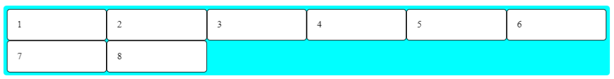
```css
.grid {
	grid-template-columns: repeat(4,1fr);
}
```
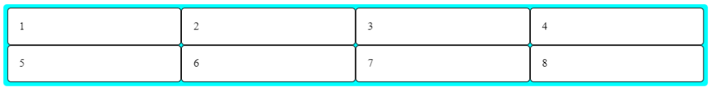
## Positioneren van grid items

- Als je een grid definieert dan krijgen de lijnen waaruit de grid bestaat automatisch nummers. Je kan deze lijnnummers gebruiken om een ‘grid item’ expliciet te positioneren op de grid.

- Je kan in de inspector, bij Layout, kiezen om de line numbers of line names te tonen van de selecteerde grid 

- De getallen verwijzen naar de lijnen en niet naar de kolommen of de rijen. Zo bevat een 3-column-layout 4 lijnen.

- Naast de positieve lijnnummers zijn er ook negatieve lijnnummers, waarbij er achterwaarts geteld wordt.

### Grid Items positioneren op de Grid met Line Numbers
- We kunnen grid-items ook expliciet positioneren op de grid.

```html
<div class="grid-container">
	<div>item 1</div>
	<div>item 2</div>
	<div>item 3</div>
	<div>item 4</div>
	<div>item 5</div>
</div>
```


```css
* {
	box-sizing: border-box;
}

/* CSS Grid Layout */
.grid-container {
	display: block grid;
	grid-template-columns: 150px 150px 150px;
	grid-template-rows: 100px 100px 100px 100px;
	background-color: cyan;
}

.grid-container div {
	border: 1px solid black;
	background-color: white;
	border-radius: 5px;
	padding: 1em;
}

div:nth-of-type(2) {
	grid-row: 3/5;
	grid-column: 2;
}
```

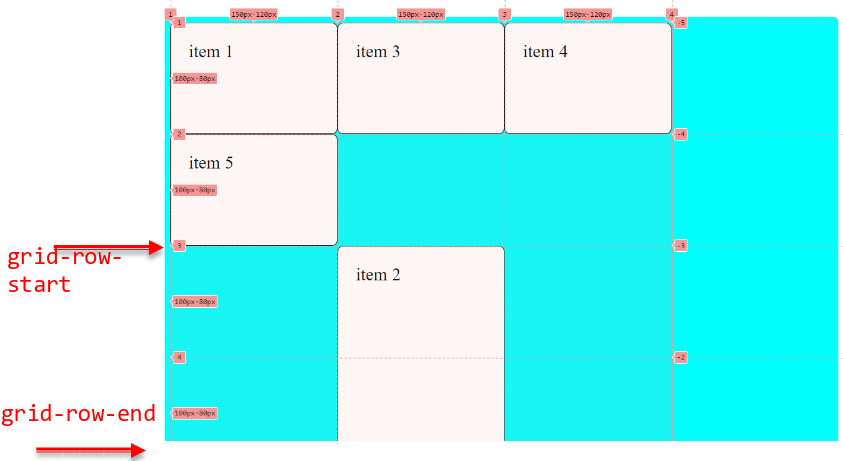

- Merk op dat de getallen bij grid-row en grid-column lijnnummers zijn (zie volgende dia). 'grid-row: 3/5’ (betekent dus dat de div rij 3 en rij 4 overspant).

#### Voorbeeld

```html
<div class="grid-container">
	<div class="box1">One</div>
	<div class="box1">Two</div>
	<div class="box1">THree</div>
	<div class="box1">Four</div>
</div>
```

```css
.box1 {grid-column-start: 1;grid-column-end: 2;grid-row-start: 1;grid-row-end: 4;}
.box2 {grid-column-start: 3;grid-column-end: 4;grid-row-start: 1;grid-row-end: 3;}
.box3 {grid-column-start: 2;grid-column-end: 3;grid-row-start: 1;grid-row-end: 2;}
.box4 {grid-column-start: 2;grid-column-end: 4;grid-row-start: 3;grid-row-end: 4;}
```

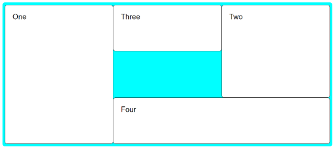

### Default Spans

**Als het item echter maar één track (rij of kolom) overspant, mag je de ‘grid-row-end’ of ‘grid-column-end’ waarden weglaten**. Het vorige voorbeeld kan dus ook geschreven worden als:

```css
.box1 {grid-column-start: 1;grid-row-start: 1;grid-row-end: 4;}
.box2 {grid-column-start: 3;grid-row-start: 1;grid-row-end: 3;}
.box3 {grid-column-start: 2;grid-row-start: 1;}
.box4 {grid-column-start: 2;grid-column-end: 4;grid-row-start: 3;}
```

#### Span

**In plaats van het ‘end’ lijnnummer op te geven, kan je ook het aantal tracks opgeven dat je wilt overspannen**.

```css
grid-row-start: 1;grid-row-end: 4;}
/*kan je dus ook schrijven als*/
grid-row-start: 1;grid-row-end: span 3;}
```

### z-index

- **Grid items kunnen overlappen** *dan moeten we de z-index-property aanpassen*.

```css
.box2 {
	grid-column-start: 3;
	grid-row-start: 1;
	grid-row-end: 4;
	z-index: 1;
}
```


### grid-area (Korter uitschrijven)

- Kan korter geschreven worden

```css
.box1 {grid-column-start: 1;grid-row-start: 1;grid-row-end: 4;}
.box2 {grid-column-start: 3;grid-row-start: 1;grid-row-end: 3;}
.box3 {grid-column-start: 2;grid-row-start: 1;}
.box4 {grid-column-start: 2;grid-column-end: 4;grid-row-start: 3;}
```

-  met de grid-column en grid-row shorthand properties

```css
.box1 {grid-column: 1;grid-row: 1 / 4;}
.box2 {grid-column: 3;grid-row: 1 / 3;}
.box3 {grid-column: 2;grid-row: 1;}
.box4 {grid-column: 2 / 4;grid-row: 3;}
```

- Nog korter:

```css
.box1 {grid-area: 1 / 1 / 4 / 2;}
.box2 {grid-area: 1 / 3 / 3 / 4;}
.box3 {grid-area: 1 / 2 / 2 / 3;}
.box4 {grid-area: 3 / 2 / 4 / 4;}

/* De volgorde van de waarden
voor de grid-area property is:
grid-row-start
grid-column-start
grid-row-end
grid-column-end */
```

### achterwaarts te tellen 

- Het is ook mogelijk om achterwaarts te tellen bij het opgeven van de lijnnummers. Zo kan je in Voorbeeld 06 het lijnnummer 4 vervangen daar lijnnummer -1 en kan

```css
.box1 {grid-column:1; grid-row: 1 / 4;}
```

- ook geschreven worden als

```css
.box1 {grid-column:1; grid-row: 1 / -1;}
```


### Gutters

- Witruimte tussen kolommen en rijen, genoemd ‘Gutters’, creëer je met column-gap en row-gap of de shorthand gap.

```css
.grid-container {
	display: block grid;
	grid-template-columns: 1fr 1fr 1fr;
	grid-template-rows: 50px 50px;
	column-gap: 10px;
	row-gap: 1rem;
}
```

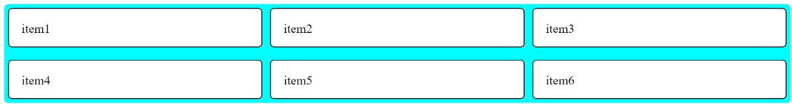

## grid-template-areas

-  Hiermee creëer je namen voor grid areas die je dan kan gebruiken in bijvoorbeeld de grid-area property om grid items te plaatsen in een grid area.

```css
.grid-container {
	display: block grid;
	grid-template-columns: repeat(3, 1fr);
	grid-template-rows: repeat(3, 100px);
	grid-template-areas:
		"one three two"
		"one . two"
		"one four four";
}

.box1 {grid-area: one;}
.box2 {grid-area: two;}
.box3 {grid-area: three;}
.box4 {grid-area: four;}
```

## align-self en justify-self

- **Individuele Grid Items Uitlijnen**
### Verticale Uitlijning (Block Axis) met `align-self`

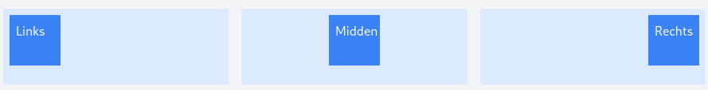

```css
.grid-item {
  align-self: start | center | end | stretch; /* stretch is default */
}
```

- `stretch`: Rekt het item uit over de hele hoogte van de cel
- `start`: Plaatst het item aan de bovenkant
- `center`: Centreert het item verticaal
- `end`: Plaatst het item aan de onderkant

### Horizontale Uitlijning (Inline Axis) met `justify-self`

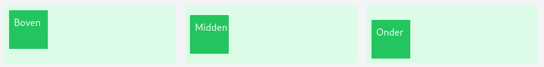

```css
.grid-item {
  justify-self: start | center | end | stretch; /* stretch is default */
}
```

- `stretch`: Rekt het item uit over de hele breedte van de cel
- `start`: Plaatst het item aan de linkerkant
- `center`: Centreert het item horizontaal
- `end`: Plaatst het item aan de rechterkant

## align-items en justify-items
- **Alle Grid Items Tegelijk Uitlijnen**

#### Voor de hele container met `align-items` en `justify-items`

```css
.grid-container {
  align-items: start | center | end | stretch;    /* Verticaal */
  justify-items: start | center | end | stretch;  /* Horizontaal */
}
```

Voorbeeld om alles te centreren:

```css
.grid-container {
  align-items: center;
  justify-items: center;
}
```

## align-content en justify-content

**Als je grid-tracks (rijen/kolommen) kleiner zijn dan de container, kun je ze uitlijnen met**:

- `align-content`: Verticale uitlijning van alle tracks
- `justify-content`: Horizontale uitlijning van alle tracks

```css
.grid-container {
  align-content: start | center | end | space-between | space-around;
  justify-content: start | center | end | space-between | space-around;
}
```

# Float

## Basis

- Een CSS eigenschap die **een element uit de normale documentflow haalt**
- Het **element 'zweeft' naar links of rechts**
- **Andere content vloeit er omheen**

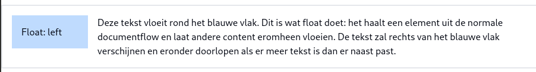


```css
.element {
  float: left;    /* Zweeft naar links */
  float: right;   /* Zweeft naar rechts */
  float: none;    /* Standaard - geen float */
}
```

## Meerdere floats

- Floats worden eerst tegen de bovenrand geplaatst
- Daarna worden ze tegen elkaar geplaatst
- Als er geen ruimte meer is, springen ze naar de volgende "rij"

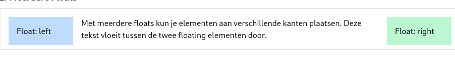


## Belangrijke Punten

- Float-elementen hebben altijd een breedte nodig
- Andere elementen vloeien eromheen
- De parent container kan problemen krijgen met hoogte-berekening

## Clear Property
Clear is de oplossing voor veel float-problemen.

```css
.element {
  clear: left;    /* Cleart linkse floats */
  clear: right;   /* Cleart rechtse floats */
  clear: both;    /* Cleart beide richtingen */
  clear: none;    /* Standaard - geen clearing */
}
```

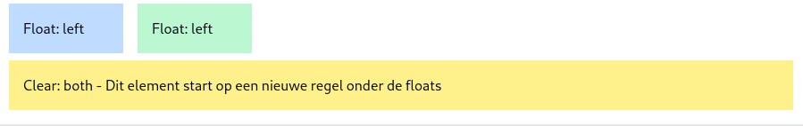
### Wanneer gebruik je Clear?

- Om een nieuw element onder floating elementen te plaatsen
- Om te voorkomen dat elementen naast floats komen
- Om de layout te "resetten"

### Wanneer gebruik je welke clear

- `clear: left` - Als je onder linkse floats wilt beginnen
- `clear: right` - Als je onder rechtse floats wilt beginnen
- `clear: both` - Het meest gebruikt, werkt voor beide richtingen
## Veel voorkomende problemen

- Floats kunnen de layout verstoren als ze niet goed worden gecleard
- Parent containers kunnen 'instorten' als alle kinderen floaten
- Elementen kunnen ongewenst naast floats terechtkomen

# Position

- *Om de normale flow te doorbreken* bekijken we nu:
	- **relatieve positionering**: *position: relative*
	- **absolute positionering**: *position: absolute*
	- **fixed positionering**: *position: fixed*

De normale flow ziet er als volgt uit (position: static)

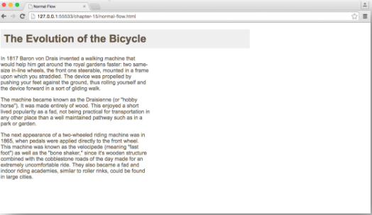
## position: relative

- Relatieve positionering verplaatst het element relatief tov zijn positie in de normale flow. Dit heeft geen invloed op de positie van de andere elementen. Deze behouden hun normale positie.

- Offset wordt bepaald door:
	- verticale verplaatsing: top – bottom
	- horizontale verplaatsing: left – right

```css
p.example {
	position: relative;
	top: 275px;
	left: 100px;
}
```

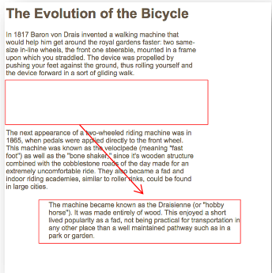

## position: absolute

- Absolute positionering verplaatst het element relatief tov zijn eerste niet static parent element, of het body element indien alle parent elementen static zijn.

- Voor de overige elementen is het alsof dit element nooit aanwezig is geweest in de normale flow.

- Ze nemen dus posities in zonder rekening te houden met het absolute gepositioneerde element. Bij het scrollen beweegt het element mee.

- Offset (px - % - em) wordt bepaald door:
	- verticale verplaatsing: top – bottom
	- horizontale verplaatsing: left – right

```css
h1 {
	position: absolute;
	top: 0px;
	left: 500px;
	width: 250px;
}
```

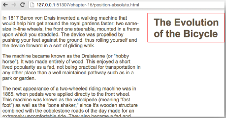

## position: fixed

Vaste positionering verplaatst het element relatief tov het browser
venster. Voor de overige elementen is het alsof dit element nooit
aanwezig is geweest in de normale flow. Ze nemen dus posities in zonder
rekening te houden met het vast gepositioneerde element. Bij het scrollen
beweegt het element NIET mee. Wordt gedaan bij menubalken die niet
mogen meescrollen.
 Offset (px - % - em) wordt bepaald door:
◦ verticale verplaatsing: top – bottom
◦ horizontale verplaatsing: left – right

```css
h1 {
	position: fixed;
	top: 0px;
	left: 0px;
	width: 100%;
}
```

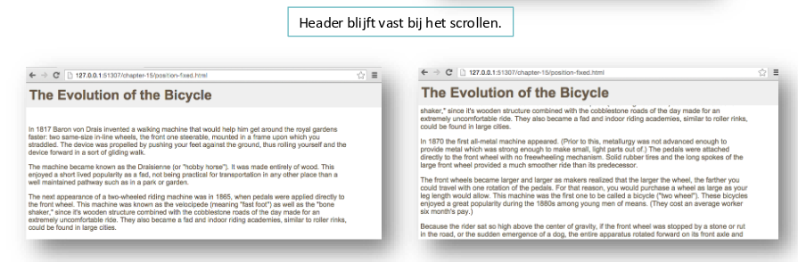


## position: z-index

 Indien de positionering van elementen gewijzigd worden, kan het zijn dat
elementen gaan overlappen. De volgorde van de elementen in de html
pagina bepaalt welke bovenaan staat: het bovenste element zit steeds
onder een element daaronder (stapelen van dozen, te beginnen met het
eerste element)
 Deze volgorde kan gewijzigd worden door de z-index. de mogelijke waarde
is een geheel getal. Hoe hoger de waarde, hoe hoger op de stapel.

**Zonder z-index**


**met z-index**

```css
h1 {
	position: fixed;
	top: 0px;
	left: 0px;
	width: 100%;
	z-index: 10;
}
```

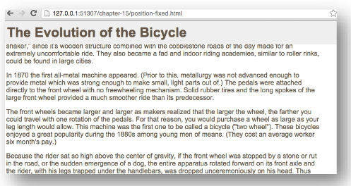