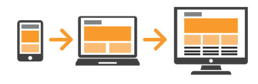
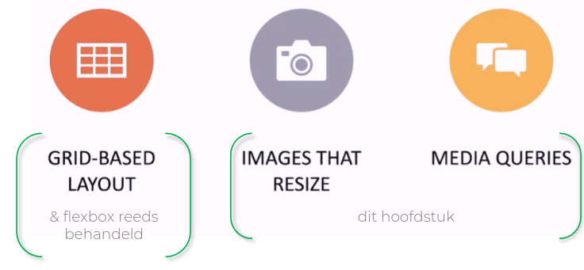
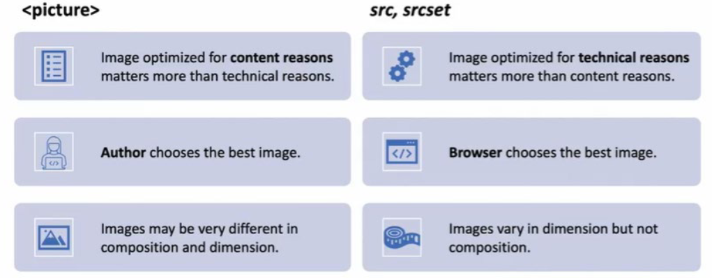

# Inleiding
## Waarom?
* betere user experience
* meer bezoekers
* hogere SE ranking
* betere laadtijden
* beheersbare ontwikkeling & onderhoud
* geen aparte ontwikkeling voor ≠ devices

## Hoe?
* HTML en CSS gebruiken om pagina’s geschikt te maken voor alle soorten schermen en devices
	* Lay-out van pagina kan wijzigen
	* inhoud kan verborgen/getoond worden
	* elementen kunnen anders getoond worden

## Mobile First


* *start ontwikkeling met focus op mobile experience*
	* minimaal, maar bevat alle belangrijke elementen
	* focus op inhoud
* *geleidelijk opschalen voor grotere schermen*
	* meer mogelijkheden voor extra inhoud
	* meer toeters & bellen

## Technieken

* **Grid** & **flexbox** gebaseerd
* Afbeelding die aanpast
* Media querries

# De Viewport

## visual & layout viewport
* De viewport stelt het deel van het document voor dat je bekijkt.

* op grotere schermen komt dit overeen met de grootte van het browser venster
* op mobile devices komt de *viewport* overeen met het volledig scherm
	* de grootte van het browser venster kan op een mobiel niet aangepast worden

* mobiel: visual & layout viewport
	* **visual viewport**
		* bevat het gedeelte van de pagina dat momenteel op het scherm wordt getoond
	* **layout viewport**
		* is groter dan de visual viewport en bevat de layout van de volledige pagina
		* CSS werkt met de afmetingen van deze layout viewport

*  de *visual viewport* **toont een deel van wat beschikbaar is in de** *layout viewport*
*  **door te zoomen (in/uit), te ‘pannen’, portrait/landscape mode te gebruiken breng je een ander deel van de** *layout viewport* **in de** *visual viewport*

## probleem
* *pagina wordt gebouwd t.o.v. layout viewport breedte*
	* uitgedrukt in DIP - Device Independent Pixels
* bij **openen van de pagina gaat de browser uitzoomen om je de volledige pagina te tonen in de visual viewport**...
* ...en dat ziet er meestal niet uit...

## Viewport meta tag
- via de viewport meta tag **wordt het mogelijk de viewport width gelijk te stellen aan de** *device width*
- ! *altijd gebruiken bij Resonsive Web Design* !
- width = device-width
	- breedte waarop we werken is de breedte van het device in DIP
- initial-scale = 1.0
	- 1 DIP = 1 CSS Pixel

```html
<head>
...
<meta name="viewport" content="width=device-width, initial-scale=1.0">
...
</head>
```

## developer tools
- **maak gebruik van de responsive web developer tools van je browser**
	- bekijk de pagina op verschillende devices via een emulator
	- bekijk pagina op eigen configuratie
# Media queries

## Wat?

Een media query is **een techniek in CSS die het mogelijk maakt om te controleren hoe een gebruiker je website bekijkt en daar vervolgens op in te spelen**. Het test verschillende eigenschappen van het apparaat of de browser (user agent) waarop je website wordt weergegeven.

Simpel gezegd: met media queries kun je verschillende stijlen toepassen afhankelijk van bijvoorbeeld:

- *De schermbreedte van het apparaat* (bijvoorbeeld voor mobiel, tablet of desktop)
- *De schermoriëntatie* (staand of liggend)
- *Het type beeldscherm*
- *De resolutie van het scherm*
- *Of iemand een donkere modus heeft ingeschakeld*

 Merk op: de **user agent gaat media queries automatisch her-evalueren indien relevante eigenschappen wijzigen**.

merk op: de **volgorde waarin de media queries geplaatst worden is belangrijk**
* media queries worden van boven naar onder geëvalueerd
* denk aan regels van cascade & overerving
### voorbeeld

```css
/* Deze stijl wordt alleen toegepast als het scherm smaller is dan 600px */
@media screen and (max-width: 600px) {
    .menu {
        width: 100%;
    }
}
```

## Werkwijzes
### Werkwijze 1: Alles in één CSS-bestand
- Bij deze methode plaats je alle media queries in hetzelfde CSS-bestand. Dit is de meest gebruikte methode.
#### Voorbeeld
```css
/* Basis stijlen voor alle schermen */
.header {
    width: 100%;
    background: blue;
}

/* Media query voor tablets */
@media screen and (max-width: 768px) {
    .header {
        background: green;
    }
}

/* Media query voor mobiele telefoons */
@media screen and (max-width: 480px) {
    .header {
        background: red;
    }
}
```

### Werkwijze 2: Aparte CSS-bestanden
- Bij deze methode maak je verschillende CSS-bestanden en laad je ze alleen wanneer nodig:
#### Voorbeeld
```html
<link rel="stylesheet" href="main.css">
<link rel="stylesheet" media="screen and (max-width: 768px)" href="tablet.css">
<link rel="stylesheet" media="screen and (max-width: 480px)" href="mobile.css">
```

## Media Types
Er zijn verschillende media types die je kunt gebruiken:

1. `all`: Voor alle apparaten
2. `print`: Voor printers en afdrukvoorbeeld
3. `screen`: Voor beeldschermen

#### Voorbeeld
```css
@media all and (max-width: 600px) {
    /* Stijlen hier */
}

@media print {
    .no-print {
        display: none;
    }
}

@media screen and (min-width: 768px) {
    /* Stijlen voor grotere schermen */
}
```

## Media Features
Hier zijn voorbeelden van verschillende media features:

### 1. Viewport/page afmetingen
```css
/* Breedte */
@media (max-width: 600px) { }

/* Hoogte */
@media (min-height: 800px) { }

/* Oriëntatie */
@media (orientation: landscape) { }

/* Aspect ratio */
@media (aspect-ratio: 16/9) { }
```
### 2. Resolutie
   ```css
/* Voor high-DPI schermen */
@media (min-resolution: 192dpi) { }
```
### 3. Kleur
   ```css
/* Voor apparaten die kleuren ondersteunen */
@media (color) { }

/* Voor specifieke kleurdiepte */
@media (min-color: 8) { }
```
### 4. Interactie
   ```css
/* Voor apparaten met nauwkeurige aanwijzer (muis) */
@media (pointer: fine) { }

/* Voor touch-apparaten */
@media (pointer: coarse) { }
```
### Combinatie
```css
@media screen and (max-width: 768px) and (orientation: landscape) {
    /* Stijlen voor landscape tablets */
}
```

## break points

### Tips voor keuze van breakpoints

|                 |                         |
| --------------- | ----------------------- |
| 320px-480px     | Mobile devices          |
| 481px-768px     | iPads, Tablets          |
| 769px-1024px    | Small screens, laptops  |
| 1025px-1200px   | Desktops, large screens |
| 1201px and more | Extra large screens, TV |
## Enkele tips
- zorg voor een tap-area van minstens 45 op 45 pixels voor buttons, links, ... op schermen zonder accuraat pointing device 
	- gemiddelde afdruk vinger 40 x 40 pixels
  
- maak minimaal gebruik van absolute waarden in CSS, maak gebruik van relatieve waarden
	- %, vw, em, rem, ...

- gebruik max-width: 100% op img elementen zodat de afbeelding niet uit hun container kunnen vloeien

- layout is geen exacte wetenschap, gebruik tips, baseer je op best practices, maar gebruik ook je gevoel om te beslissen of iets al dan niet OK oogt

# Responsive images



## Formaten

**afbeeldingen schalen = verlies aan kwaliteit**
- als afbeeldingsbestanden te groot zijn voor het gewenste formaat op scherm verkwist je dus bandbreedte, geheugen en processor tijd (de browser moet schalen!) maar bovendien verlies je ook aan kwaliteit...
- als afbeeldingsbestanden te klein zijn heb je grote kans op een pixelated afbeelding op de pagina

### bitmap based

- afbeelding is raster van pixels
- elke pixel is een waarde die een kleur voorstelt
- foto realisme
- bij schalen verlies je aan kwaliteit
- bestandsgrootte hangt af van de resolutie, kleurdiepte, compressie-techniek

### vector based

- coördinaten en geometrische vormen
- niet foto realistisch
- kleine bestandsgrootte
- schalen zonder verlies aan kwaliteit

### Pixels

device pixel - hardware pixel
• CSS pixel - logische pixel
• vroeger vielen device pixels en CSS pixels 1
op 1 samen
• met de komst van retina (high density)
schermen is er een gap ontstaan tussen de
twee

### Afbeelding kiezen

- een afbeelding moet scherp zijn
	- schermen met hoge resolutie -> afbeeldingen met hoge resolutie
	- schermen met lage resolutie -> afbeeldingen met lage resolutie zodat geen bandbreedte verkwist wordt

- afbeeldingen moeten kunnen krimpen en uitzetten

- afbeeldingen moeten soms bijgesneden worden
	- art direction

- afbeeldingen kunnen aangeboden worden in verschillende formaten
	- zorg ervoor dat alternatieven voorhanden zijn indien formaat niet ondersteund wordt door browser

## resolution switching

### Inleiding

- wij bieden een **aantal versies van eenzelfde afbeelding** aan
- de **browser gaat zelf kiezen welke versie geladen wordt**
- wij helpen de browser door wat extra informatie te voorzien bij elke versie
	- pixel density, width/sizes
- de browser kan naast onze informatie ook gebruik maken van andere informatie, **we kunnen dus niet voorspellen welke versie geladen zal worden**
	-  *viewport afmetingen*
	- *kwaliteit van het netwerk*
	- *voorkeursinstellingen van de gebruiker*

### concreet
- **gebruik maken van** *srcset* **attribuut bij het img-element**
	- op deze manier bied je verschillende versies aan

- extra informatie voorzien bij elke versie:
	- optie 1: *pixel density beschrijven*
	- optie 2: *grootte beschrijven*

### srcset attribuut

- bij gebruik van srcset heb je zelf geen controle over de versie van de afbeelding die de browser zal laden
- enkel te gebruiken voor verschillende versies van 1 en dezelfde afbeelding!

#### Voorbeeld 1

```html

```

- srcset attribuut heeft als waarde een lijst van image URLs
- bij elke URL staat ook een x-descriptor die aangeeft voor welke pixel density het bestand bedoeld is
- de URL in het src attribuut wordt gebruikt door browsers die srcset niet ondersteunen

- nadeel is dat geen rekening wordt gehouden met de grootte waarop de afbeelding zal gerendered worden

#### voorbeeld 2 – width descriptor

```html

```

- srcset: bij elke URL staat nu een w-descriptor die de exacte breedte (in pixels) aangeeft van de afbeelding
- het sizes attribuut verduidelijkt voor de browser hoeveel pixels er effectief nodig zijn door de breedte van de gerenderde image aan te geven

 - op deze manier kent de browser de eigenschappen van de afbeelding EN de grootte van de uiteindelijk gerenderde afbeelding

#### het sizes attribuut

- het sizes attribuut bevat een breedte (CSS lengte)

- klassieke eenheden: 55px, 10em, ...
- of relatief t.o.v. de breedte van de viewport; eenheid: vw
	- 33,3vw, i.e. een derde van de breedte van de viewport
	- 100vw, i.e. de volledige breedte van de viewport

 - de lengte wordt gekoppeld aan een media query, deze worden sequentieel overlopen tot de eerst passende gevonden wordt

## Picture element

- soms wil je zelf controle over de afbeelding die geladen wordt
	- kiezen uit verschillende afbeeldingen, uit anders uitgesneden afbeeldingen, uit afbeeldingen in verschillende formaten

 - maak in deze gevallen gebruik van het picture element

### use cases

- Art direction
- alternative afbeeldingsformaten

### art direction

- art direction: jij bepaalt welke afbeelding er onder welke condities moet gebruikt worden
	-  je kan totaal verschillende afbeeldingen aanbieden
		- aangepast aan de viewport
	- je kan afbeeldingen aanbieden die op verschillende manieren uitgesneden zijn
		- focus op element van afbeelding behouden
	- typische toepassing: hero image

- aanbieden alternatieve afbeeldingsformaten
	- .webp en .avif zijn niet voor niets upcoming...
		- betere compressie (kleinere bestanden)
		- betere kleurdiepte, dynamiek, ...
		- animatie, transparantie, ...
	- maar voorzie via het picture element eenfallback
		- voor browsers die het formaat niet ondersteunen

```html
<picture>
<source srcset="images/runner-wide.jpg" media="(min-width: 1200px)">
<source srcset="images/runner-narrow.jpg" media="(min-width: 700px)">

</picture>
```

- source elementen
	- srcset attribuut met URL naar een afbeelding en
	- media attribuut met query die bepaalt wanneer deze afbeelding gebruikt wordt
	- volgorde is belangrijk!

 - het img element wordt gebruikt om het geselecteerde element te tonen
	 - de URL van het src attribuut wordt enkel gebruikt indien picture niet ondersteund is door browser, of indien geen enkele media query voldoet

```html
<picture>
<source srcset="example.avif" type="image/avif">
<source srcset="fallback.webp" type="image/webp">

</picture>

<!-- 
• via het srcset- & type-attribuut kan je in verschillende formaten voorzien
• via het src-attribuut kan je steeds een fallback voor de browser voorzien 
-->
```

```html
<picture>
<source srcset="images/runner-wide-2x.jpg 2x, images/runner-wide.jpg"
media="(min-width: 1200px)">
<source srcset="images/runner-narrow-2x.jpg 2x, images/runner-narrow.jpg"
media="(min-width: 700px)">

</picture>
```

- in het srcset attribuut kan je ook weer gebruik maken van een lijst van URL’s met pixel density/width descriptors
	-  combinatie van art direction & resolution switching
	- wordt serieus complex