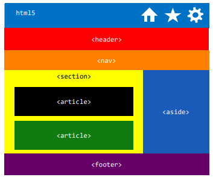

**Valideer steeds je HTML- en CSS-code**
- online op https://validator.w3.org/ 
- of via *Chrome extensie HTML Validator*

# Opbouw html document

```html
<!DOCTYPE html>
<html lang="nl">
<head>
    <meta charset="UTF-8">
    <meta name="viewport" content="width=device-width, initial-scale=1.0">
    <title>Herhaling</title>
</head>
<body>
	<header>
    </header>

	<nav>

    </nav>

    <main>
        <!-- steeds je body beginnen met <h1></h1> dit word ook door google gebruikt -->
	    <h1></h1>
    </main>

    <footer>
    </footer>

</body>
</html>
```

# pagina opbouw met logisch blokken



|                                                                                 |            |
| ------------------------------------------------------------------------------- | ---------- |
| logische blok: voor een zelfstandig stuk inhoud                                 | \<article> |
| logische blok: onderdeel van een pagina waarvoor geen meer specifiek element is | \<section> |
| logische blok: voor de hoofdnavigatie                                           | \<nav>     |
| logische blok: voor ‘zijdelingse’ informatie                                    | \<aside>   |
| logische blok: voor het kopgedeelte                                             | \<header>  |
| logische blok: voor het footer gedeelte                                         | \<footer>  |
# Opbouw css

```css
html { box-sizing: border-box; }
\*, ::before, ::after { box-sizing: inherit; }


```