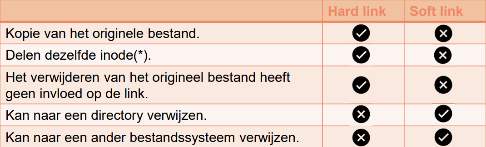

# Opbouw commando
```bash

command [-opties] [argument]

```

- **Absoluut pad:** Begint bij de root (`/`), geeft de volledige locatie aan.
/etc/bestand.txt

- **Relatief pad:** Gebaseerd op de huidige directory, geeft de locatie aan ten opzichte van waar je je bevindt.
../etc/bestand.txt
# Opties
### Opties kunnen in combinatie met andere opties gebruikt worden:

dit onderstaande voorbeeld is een combinatie van `ls -l -r`
```bash
sysadmin@localhost:~$ ls -lr
```

### - of --

Bij een optie die *enkel een letter* heeft gebruiken we een enkele `-`
Bij een optie met een *woord* gebruiken we een dubbele `--`

# Variabele

### definiëren 
```bash
sysadmin@localhost:~$ variabele='string'

sysadmin@localhost:~$ variabeleInt=1
```
### print waarde van variabele

```bash
sysadmin@localhost:~$ echo $(variable)
```
### omgevingsvariabelen maken

```bash
sysadmin@localhost:~$ export $(variabele)
```
### ongedaan maken omgevingsvariabele
```bash
sysadmin@localhost:~$ unset $(variabele)
```

### $PATH

Belangrijkste bash variabele:
- alle plaatsten waar het systeem zoekt naar uitvoerbare programma's
- als een commando niet op 1 van deze plaatsen staat krijg je **"command not found"**

# Aliassen

Eenvoudige namen toe te wijzen aan langere of ingewikkeldere commando's

### Aanmaken alias
```bash
alias aliasnaam='commando'
```

**voorbeeld***
```bash
alias ll='ls -lah'
```

### Aliassen bekijken 

```bash
alias
```
### Alias verwijderen

Verwijderen doen we met unalias
```bash
unalias ll
```
### Aliassen permanent maken

liassen die je in de terminal invoert, gelden alleen voor de huidige sessie. Om ze permanent te maken, kun je ze toevoegen aan je `.bashrc` of `.bash_profile` bestand (afhankelijk van je systeem).

1. Open `.bashrc` of `.bash_profile` in een teksteditor:
```bash
nano ~/.bashrc
```    

2. Voeg de alias toe:
```bash

alias ll='ls -lah'
``` 

3. Sla het bestand op en voer vervolgens uit om de wijzigingen direct toe te passen:
```bash
source ~/.bashrc
```

# Lijst met te kennen bash commandos


| bash commando                                                   | resultaat                                                                                                                       | opties                                                                                                                                                                                                                 | syntax                                                                           |
| --------------------------------------------------------------- | ------------------------------------------------------------------------------------------------------------------------------- | ---------------------------------------------------------------------------------------------------------------------------------------------------------------------------------------------------------------------- | -------------------------------------------------------------------------------- |
| sudo                                                            | om een opdracht als root uit te voeren                                                                                          |                                                                                                                                                                                                                        |                                                                                  |
| su                                                              | inloggen als root                                                                                                               |                                                                                                                                                                                                                        |                                                                                  |
| ls                                                              | weergeven directory inhoud                                                                                                      | <br> -l (long)meer detail<br> -a met verborgen bestanden<br> -r omgekeerde volgorde<br> -s van groot naar klein<br> -R met sub mappen inbegrepen<br> -i met inode<br> -il met inode en detail<br> -d (enkel directory) | ls [OPTION]... [FILE]...                                                         |
| tree                                                            | directory tree weergeven                                                                                                        |                                                                                                                                                                                                                        | tree [OPTION]...                                                                 |
| history                                                         | weergeven bash geschiendenis                                                                                                    | <br>voer history lijn n uit<br>meest recente history command<br>zoeken in history                                                                                                                                      | history<br>!n<br>!!<br>`ctrl +` r                                                |
|                                                                 | definiëren van variabele                                                                                                        |                                                                                                                                                                                                                        | variabele='string'<br>variabeleInt=1<br>echo $(VARIABELE)                        |
| echo                                                            | text weergeven                                                                                                                  |                                                                                                                                                                                                                        | echo [SHORT-OPTION]... [STRING]...                                               |
| env                                                             | geeft omgevingsvairabelen weer                                                                                                  |                                                                                                                                                                                                                        | env [OPTION]... [-] [NAME=VALUE]                                                 |
| export                                                          | omgevingsvariabele aanmaken                                                                                                     |                                                                                                                                                                                                                        | export VARIABELE=waarde                                                          |
| unset                                                           | omgevingsvariabele verwijderen                                                                                                  |                                                                                                                                                                                                                        | unset VARIABELE                                                                  |
| alias                                                           | kort commando maken van lang commando                                                                                           | <br>aliassen weergeven                                                                                                                                                                                                 | alias naam='commando'<br>alias                                                   |
| unalias                                                         | alias wissen                                                                                                                    |                                                                                                                                                                                                                        | unalias naam                                                                     |
| grep                                                            | zoeken in platte text                                                                                                           |                                                                                                                                                                                                                        | grep [OPTION...] PATTERNS [FILE...]                                              |
| ;                                                               | scheiden van meerdere commando's                                                                                                |                                                                                                                                                                                                                        | COMMANDO ; COMMANDO                                                              |
| cal                                                             | weergeven van een kalender                                                                                                      |                                                                                                                                                                                                                        | cal 11 2024                                                                      |
| man                                                             | hulp pagina's                                                                                                                   | <br>-f (in welke sectie staat het)<br>-k (zoeken in pan pages)                                                                                                                                                         | man COMMANDO                                                                     |
| whereis                                                         | locatie commando en locatie man pagina                                                                                          |                                                                                                                                                                                                                        | whereis commando<br>                                                             |
| commando --help                                                 | controleren of commando beschikbaar is                                                                                          | basis help opvragen                                                                                                                                                                                                    | command <commando>                                                               |
| pwd                                                             | huidige directory locatie weergeven                                                                                             |                                                                                                                                                                                                                        | pwd [OPTION]...                                                                  |
| cd                                                              | verplaatsen naar directory                                                                                                      | <br> - (vorige locatie)<br> ~ (home)<br> / (root)<br>.. bovenliggende locatie                                                                                                                                          |                                                                                  |
| cp                                                              | bestand kopieren                                                                                                                | <br>-v ((verbose) Toont output)<br>-i (interactive)<br>-r (recursive) bestanden en volledige mappenstructuur                                                                                                           | cp [OPTION]... SOURCE DEST                                                       |
| mv                                                              | bestand verplaatsen / hernoemen                                                                                                 | <br><br> -v (verbose) Toont output<br> -i (interactive) Vraagt of overschreven mag worden.<br> -n (no clobber) Overschrijft niet de inhoud doelbestand                                                                 | mv [OPTION]... SOURCE DEST                                                       |
| touch                                                           | bestand aanmaken                                                                                                                |                                                                                                                                                                                                                        | touch [OPTION]... FILE...                                                        |
| cat                                                             | inhoud bestand uitschrijven                                                                                                     |                                                                                                                                                                                                                        | cat [OPTION]... [FILE]...                                                        |
| mkdir                                                           | directory aanmaken                                                                                                              | <br>-p (directory structuur aanmaken)                                                                                                                                                                                  | mkdir [OPTION]... DIRECTORY...                                                   |
| rm                                                              | bestand verwijderen                                                                                                             | <br> -r (recursif) directory<br> -f (force) zonder bevestiging<br> -i (interactive) vraagt bevestiging<br> -ri (recursif) en (interactive)                                                                             |                                                                                  |
| [find](Opleiding/HoGent/ComputerSystems/Bash.md#find) | zoeken in bestandssyteem                                                                                                        |                                                                                                                                                                                                                        | find [expression]                                                                |
|                                                                 |                                                                                                                                 |                                                                                                                                                                                                                        |                                                                                  |
| *TEXT*                                                          | *TEXT*                                                                                                                          | *TEXT*                                                                                                                                                                                                                 |                                                                                  |
| **bash commando**                                               | **resultaat**                                                                                                                   | **opties**                                                                                                                                                                                                             | **syntax**                                                                       |
| less                                                            | bestand bekijken pagina, per pagina                                                                                             |                                                                                                                                                                                                                        | less bestandsnaam                                                                |
| more                                                            | bestand bekijken pagina per pagina, terugscrollbaar                                                                             |                                                                                                                                                                                                                        | more bestandsnaam<br>                                                            |
| cat                                                             | tekstbestanden weergeven en maken                                                                                               | <br>-n (kies zelf aantal regel)                                                                                                                                                                                        | cat [OPTION]... [FILE]...                                                        |
| head                                                            | leest de eerste 10 regels van een bestand uit                                                                                   | <br>-n (kies zelf aantal regels)                                                                                                                                                                                       | head - output the first part of files                                            |
| tail                                                            | leest de laatste 10 regels van een bestand uit                                                                                  | <br>-n (kies zelf aantal regel, negatief getal is vanaf regel)                                                                                                                                                         | tail [OPTION]... [FILE]...                                                       |
| \|                                                              | pipe (uitvoer doorgeven naar volgende commando)                                                                                 |                                                                                                                                                                                                                        | \|                                                                               |
| <                                                               | STDINbestand voor invoer (plaats waar invoer zou moeten)                                                                        |                                                                                                                                                                                                                        | cat < bestand.txt                                                                |
| >                                                               | STDOUT stuur uitvoer naar bestand                                                                                               |                                                                                                                                                                                                                        | ls > bestandenlijst.txt                                                          |
| 2>                                                              | STDERR schrijf error naar bestand ipv console                                                                                   |                                                                                                                                                                                                                        | cat nietbestaandbestand.txt 2> foutenlog.txt                                     |
| >>                                                              | kan je tekst aan een bestand toegevoegen in plaats van te overschrijven                                                         |                                                                                                                                                                                                                        | commando >> bestandsnaam                                                         |
| &>                                                              | Zowel STDOUT als STDERR naar een bestand sturen                                                                                 |                                                                                                                                                                                                                        | commando &> bestandsnaam                                                         |
| tr                                                              | tekst omvormen:<br>echo "HELLO WORLD" \| tr 'A-Z' 'a-z' (grote naar kleine letters)                                             |                                                                                                                                                                                                                        | tr [OPTION]... STRING1 [STRING2]                                                 |
| sort                                                            | sorteert lijnen text                                                                                                            | <br>-t (veldscheidingsteken)<br>-k (welk veld (bij kolommen))<br>-n (numerieke sortering)                                                                                                                              | sort [OPTION]... [FILE]...                                                       |
| grep                                                            | tekstpatronen te zoeken in bestanden of standaardinvoer (STDIN)                                                                 | <br>-d (standaardscheidingsteken aanpassen)<br>-f (welk veld moet getoond worden (kolom))<br>-c (tekstkolommen extraheren basis van char positie)<br>-E (regular expression)                                           | grep [OPTION...] PATTERNS [FILE...]<br>grep [OPTION...] -f PATTERN ... [FILE...] |
| wc                                                              | geeft het aantal regels, woorden en bytes                                                                                       | <br> -l (alleen het aantal regels)<br> -w (alleen het aantal woorden)<br> -c (alleen het aantal bytes)                                                                                                                 |                                                                                  |
| cut                                                             | kan tekstkolommen uit een bestand of standaardinvoer halen                                                                      | <br> -d (afwijken standaard kolomscheidingsteken)<br> -f (aan te geven op welk(e) veld(en))<br> -c (extraheren op basis van de karakterpositie)                                                                        |                                                                                  |
| \\                                                              | escape character                                                                                                                |                                                                                                                                                                                                                        |                                                                                  |
|                                                                 |                                                                                                                                 |                                                                                                                                                                                                                        |                                                                                  |
|                                                                 | *rechten, groepen en gebruikers*                                                                                                | *rechten, groepen en gebruikers*                                                                                                                                                                                       | *rechten, groepen en gebruikers*                                                 |
| **bash commando**                                               | **resultaat**                                                                                                                   | **opties**                                                                                                                                                                                                             | **syntax**                                                                       |
| ls -l                                                           | rechten weergeven van een betand/map                                                                                            |                                                                                                                                                                                                                        | ls -l                                                                            |
| chmod                                                           | rechten van een map of bestand aanpassen<br>symbolisch:<br>numeriek:                                                            | r, w, x (read,write,execute)<br>u,g,o (user,group,other)<br>0\---,1\--x,2\-w-,3\-wx,4r\--,5r\-x,6rw\-,7rwx<br>(- is verwijderen)<br>(+ is toevoegen)<br>(= is overschrijven)                                           | chmod u+r abd.txt<br>chmod u-r,g+w,o abd.txt<br>chmod 754 abd.txt                |
| umask                                                           | standaard rechten voor:<br>Bestand: Max(666)<br>Map: Max(777)                                                                   | weergeven:<br>instellen:<br>eerste 0 betekend octale weergave                                                                                                                                                          | umask<br>umask 0002                                                              |
|                                                                 | groep bekijken                                                                                                                  | waar root de gezochte groep is<br>resultaat (naam:paswoord:id:)                                                                                                                                                        | grep root /etc/group<br>cat /etc/group                                           |
| groupadd                                                        | groep toevoegen<br>groep toevoegen en id meegeven<br>(id onder 1000 is voor systeem)                                            | <br>-g                                                                                                                                                                                                                 | groupadd nieuwegroep<br>groupadd -g 1088 nieuwegroepnaam                         |
| groupmod                                                        | id aanpassen bestaande groep<br>naam aanpassen bestaande groep                                                                  | -g<br>-n                                                                                                                                                                                                               | groupmod -g 1001 bestaandegroep<br>groupmod -n nieuwenaam groep                  |
| groupdel                                                        | verwijderen van een groep                                                                                                       |                                                                                                                                                                                                                        | groupdel bestaandegroep                                                          |
|                                                                 | gebruikers cotroleren<br>(loginname:paswoord:user-Id:group-Id:username:homedir:shell)                                           | waar root de gezochte user is<br>alle users weergeven<br>/etc/shadow (bevat de wachtwoorden)                                                                                                                           | grep root /etc/passwd<br>cat passwd                                              |
| passwd                                                          | (huidige) geruikerpaswoord aanpassen<br>paswoord andere gebriuker aanpassen<br>gebruiker vergrendelen<br>gebruiker ontgrendelen | <br><br>-l<br>-u                                                                                                                                                                                                       | passwd<br>passwd jan<br>passwd -l jan<br>passwd -u jan                           |
| id                                                              | gerbruikersId en GroepId's opvragen                                                                                             |                                                                                                                                                                                                                        | id<br>id jan                                                                     |
| who                                                             | controleren als wie je bent ingelogd                                                                                            |                                                                                                                                                                                                                        | who                                                                              |
| w                                                               | controleren wie er allemaal is ingelogd                                                                                         |                                                                                                                                                                                                                        | w                                                                                |
| usermod                                                         | gebruiker toevoegen aan groepen<br>voeg gebruiker toe aan meerdere groepen<br>aanpassen van primaire groep                      | -a (toevoegen)<br>-aG<br>-g (primaire groep)                                                                                                                                                                           | usermod -a sudo username<br>usermod -aG grp1,grp2 user<br>usermod -g 1004 alex   |
| useradd                                                         | Gebruiker toevoegen<br>+ standaardwaarden weergeven<br>+ aanmaken homedir                                                       | <br>-D<br>-m                                                                                                                                                                                                           | useradd nieuweuser<br>useradd -D nieuweuser<br>useradd -m nieuweuser             |
| userdel                                                         | gebruiker verwijderen                                                                                                           |                                                                                                                                                                                                                        | userdel<br>userdel jan                                                           |
| exit                                                            | user verlaten in bash                                                                                                           |                                                                                                                                                                                                                        |                                                                                  |
### Tips:

kortere notaties bij mkdir, rm -r,..
```bash
#Lange manier:
mkdir directory1 directory2 directory3
mkdir -p fotos/archief gegevens/archief liedjes/archief

#Betere en kortere schrijfwijze
mkdir directory{1,2,3}
mkdir -p {fotos,gegevens,liedjes}/archief

```

# Werken met mappen en bestanden


### find

#### Syntax

```bash
find [options] [path...] [expression]
```

```bash
# Voorbeelden:
find -L /var/www -name "*.js" # -L = to follow symbolic links
find /home/linuxize -type f -iname document.pdf
find . -type d #alle directory's zoeken in huidige directory
find /var/www/my_website -type f -exec chmod 0666 {} \; #Zoeken en rechten aanpassen
find /etc/dovecot/conf.d -name "*.conf" -mtime 5 #die precies 5 dagen geleden zijn gewijzigd
find /etc/dovecot/conf.d -name "*.conf" -mtime -5 #die voorbije 5 dagen geleden zijn gewijzigd
find . -type f -size +1M -size 21M # zoeken naar bestanden tussen1 en  2 megabyte
```
 
 #### Optielijst

| Optie                                            | Werking                                                                                |
| ------------------------------------------------ | -------------------------------------------------------------------------------------- |
| -name                                            | zoek op naam , hoofdletter gevoellig (globbing mogelijk)                               |
| -iname                                           | zoek op naam (globbing mogelijk)                                                       |
| -iname "\*.csv" -o "\*.sh"                       | -o is voor of (OR) -a is voor en (AND)                                                 |
| -regex                                           | zoek op regular expression                                                             |
| -type                                            | zoek op type, 'f' zijn bestanden, 'd' zijn directory's                                 |
| -size                                            |                                                                                        |
| -empty                                           | Zoek op een leeg bestand/directory                                                     |
| -maxdepth                                        | Niet dieper zoeken dan hoeveelheid                                                     |
| -ls                                              | voer ls -l (ls met detail) uit op gevonden bestand                                     |
| -delete                                          | verwijder gevonden bestand of dir                                                      |
| -exec                                            | voer commando uit op gevonden bestand of dir                                           |
| -atime, -amin, -ctime, -cmin, -mtime, -mmin, ... | Zoek op bestanden of mappen die geopend, aangepast, … binnen x aantal minuten of dagen |
| -perm                                            | Zoek op rechten (niet kennen voor examen)                                              |

# STDIN STDOUT STDERR

### STDIN (Standaardinvoer)

- **Wat is het?**  
    Dit is de invoer die een commando kan ontvangen. In een typische situatie is STDIN gekoppeld aan het toetsenbord, zodat een gebruiker direct gegevens kan invoeren.
    
- **Voorbeeld in Bash:**  
    Bij het gebruiken van een commando zoals `cat`, kun je tekst invoeren via het toetsenbord:
    
```bash
cat
```

Als je daarna tekst typt en op Enter drukt, voert `cat` die tekst uit naar STDOUT (meestal het scherm). Je kunt ook STDIN doorsturen vanaf een bestand:
    
```bash
cat < bestand.txt
```
We steken de inhoud van bestand.txt in cat
### STDOUT (Standaarduitvoer)

- **Wat is het?**  
    Dit is de standaarduitvoer van een commando. Meestal is STDOUT gekoppeld aan de terminal, zodat de uitvoer op het scherm verschijnt.
    
- **Voorbeeld in Bash:**  
    Als je een bestand weergeeft met `ls`, wordt de uitvoer (lijst van bestanden) naar STDOUT gestuurd:
```bash
ls
```

 Je kunt deze uitvoer ook omleiden naar een bestand:
    
```bash
ls > bestandenlijst.txt
```

### STDERR (Standaardfout)

- **Wat is het?**  
    Dit is het kanaal waar foutmeldingen van een commando naar worden gestuurd. Net zoals STDOUT, is STDERR meestal gekoppeld aan de terminal, maar het is gescheiden van de gewone uitvoer.
    
- **Voorbeeld in Bash:**  
    Als je probeert een niet-bestaand bestand te lezen:
```bash
cat nietbestaandbestand.txt
```
De foutmelding wordt naar STDERR gestuurd. Je kunt foutmeldingen ook naar een bestand sturen met:
    
```bash
cat nietbestaandbestand.txt 2> foutenlog.txt
```

### bestandsdescriptors (niet kennen voor het examen)
In Bash zijn de standaardinvoeren en uitvoeren gekoppeld aan bestandsdescriptors:

- **STDIN** = Bestandsdescriptor `0`
- **STDOUT** = Bestandsdescriptor `1`
- **STDERR** = Bestandsdescriptor `2`

### tr
omvormen van tekens
#### syntax
```bash
tr [OPTION]... STRING1 [STRING2]
```

```bash
#voorbeelden
echo "hello 123 world" | tr -d '0-9' #verwijderen van cijfers
echo "hello world" | tr 'a-z' 'A-Z' #van kleine letters, grote letters maken
echo "apple banana cherry" | tr ' ' '\n' #spatie vervangen door volgende lijn
```

# sort

sorteert lijnen text
##### Syntax
```bash
sort [OPTION]... [FILE]...
sort [OPTION]... --files0-from=F
```

# grep

##### Syntax
```bash
       grep [OPTION...] PATTERNS [FILE...]
       grep [OPTION...] -e PATTERNS ... [FILE...]
       grep [OPTION...] -f PATTERN_FILE ... [FILE...]
```

#### Here document (niet kennen voor examen)

```bash
	cat>>naamBestand<<EOF
```

eindig met EOF

# Rechten

## Rechten van bestanden of mappen
### rechten bekijken met ls -l
```bash
ls -l /etc/passwd

-rw-r--r--, 1 root root 4135 May 27 21:08 /etc/passwd
```

| \-           | rw\-                  | r\--               | r\--                 |
| ------------ | --------------------- | ------------------ | -------------------- |
| type bestand | rechten voor eigenaar | rechten voor group | rechten voor  andere |

| 1                     | root        | root     | 4135    | May 27 21:08      | /etc/passwd |
| --------------------- | ----------- | -------- | ------- | ----------------- | ----------- |
| hoeveelheid hardlinks | de eigenaar | de group | grootte | laatste wijzeging | pad + naam  |
#### type bestand:

| karakter | type             | uitleg |
| -------- | ---------------- | ------ |
| -        | Gewoon bestand   |        |
| d        | map              |        |
| l        | Symbolische link |        |
|          |                  |        |
#### Rechten:
\--- bestaat tekens uit 3 mogelijke waarden:

| karakter | type           |         |
| -------- | -------------- | ------- |
| r        | Leesrecht      | read    |
| w        | Schrijfrecht   | write   |
| x        | Uitvoerrecht   | execute |
| -        | Niet toegekend |         |

## rechten toekennen aan bestand of map
### **chmod** met symbolische methode

```bash
chmod u+r abd.txt
chmod u-r,g+w,o abd.txt #combineren mag met ,
```

| karakter | Rechten toegepast op |        |
| -------- | -------------------- | ------ |
| u        | eigenaar             | user   |
| g        | groep                | group  |
| o        | andere               | others |
| a        | iedereen             | all    |

| karakter | Rechten toegepast op  |
| -------- | --------------------- |
| \+       | rechten toekennen     |
| \-       | rechten verwijderen   |
| \=       | rechten overschrijven |

| karakter | type           |         |
| -------- | -------------- | ------- |
| r        | Leesrecht      | read    |
| w        | Schrijfrecht   | write   |
| x        | Uitvoerrecht   | execute |
| -        | Niet toegekend |         |

### **chmod** met numerieke methode

```bash
chmod 754 abd.txt
```

**maximum:**
- Directory: 777
- Bestand: 666

| octaal nummer | binaire waarde | symbolische weergave |
| ------------- | -------------- | -------------------- |
| 0             | 000            | \---                 |
| 1             | 001            | \--x                 |
| 2             | 010            | \-w-                 |
| 3             | 011            | \-wx                 |
| 4             | 100            | r\--                 |
| 5             | 101            | r\-x                 |
| 6             | 110            | rw\-                 |
| 7             | 111            | rwx                  |

## standaard premissie met **umask**

Het commando umask wordt gebruikt om de standaardrechten te tonen of in te stellen.

Effectieve waarde = maximale standaardwaarde – de umaskwaarde

### controle van umask waarde

```bash
nikki@DESKTOP-7TKJV5E:~$ umask
0022
```
Dus:
- Voor mappen: 777 - (0)022 = 755
- Voor bestanden: 666 - (0)022 = 644

### aanpassen van umask waarde
```bash
umask 0002
```

Permanent, voeg `umask 0002` toe aan `~/.bashrc` of `~/.profile`.


# Lijst met variabelen

| Naam  | inhoud                                                                  |
| ----- | ----------------------------------------------------------------------- |
| $PATH | alle plaatsten waar het systeem kan zoeken naar uitvoerbare programma's |
|       |                                                                         |
# Globbing lijst

| Symbool | werking                                                                               |
| ------- | ------------------------------------------------------------------------------------- |
| \*      | Representeert 0 of meer gelijk welke tekens in een bestandsnaam.                      |
| ?       | Representeert precies 1 teken.                                                        |
| []      | Zoekt een match met precies 1 teken dat tussen de vierkante haakjes wordt opgegeven.  |
| !       | Wordt gebruikt met [ ] om aan te geven dat de tekens tussen [ ] niet mogen voorkomen. |
# Regex lijst

| Symbool | werking                                                  |
| ------- | -------------------------------------------------------- |
| .       | voor 1 karakter                                          |
| \[]     | opsomming van karakters                                  |
| \[^]    | niet voor een opsomming van karakters                    |
| \*      | 0 of meer karakters                                      |
| ^       | voor karakter aan begin van een regel                    |
| $       | voor karakter aan einde van een regel                    |
| ?       | karakter is optioneel karakter (komt 0 of een keer voor) |
| +       | karakter komt één of meerdere keer voor                  |
| !       | keuzes te maken tussen verschillende karakters           |
# Links

```bash
#Hard link 
#Is een iddentieke copie van het innode, soort van copy
ln


#Soft link (sybolic link) zoals een snelkoppeling in windows
#Link naar innode  (heeft meta informatie plaats op HDD, rechten) (nieuwe innode)
#Symbolische link is appelblauzeegroen
#Als je bestand verwijderd werkt deze niet meer
ln -s

```


bestand.txt = het orgineel
Bestand.txt = Symbolic link
BESTAND.txt = Hard link




