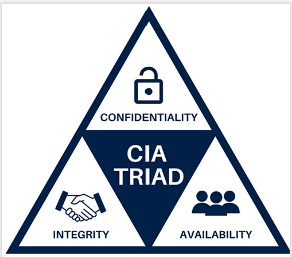
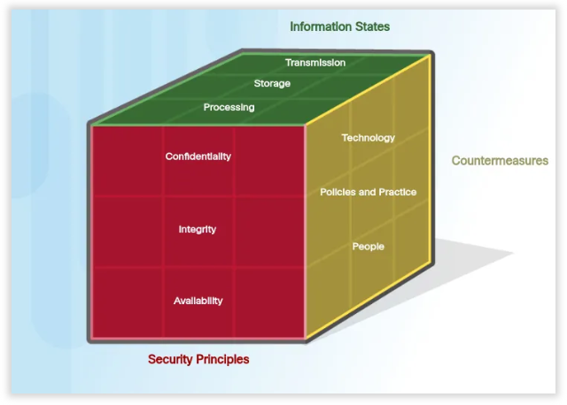

# H1: data, het virtuele goud

## Tegenhanger

Het wilde westen: **goud** -> - Het internet: **data**

## Jouw data

Wat is jou data (8):

### Private information (persoonlijke data)

- Een groot gedeelte van jouw data zit bij **bedrijven**:
    - Private gegevens: chat, e-mail, foto's, ...
    - Financiën: bankrekeningen, overschrijvingen, ...
    - Medisch: aandoeningen, ziektegeschiedenis, medicatie, ...
    - School: punten, verslagen, feedback, ...
    - Werk: loon, HR, werkbestanden (bv. als zelfstandige), ...
    - Overheid: rechtszaken, boetes, eigendom, ...
- Bij welke bedrijven zit jouw data?
    - Wie kan dit zien of aanpassen?
    - Wat zijn de gevolgen?
    - Wat als de data verloren geraakt?
- Ook data op eigen toestellen of papier is gevoelig
    - Private foto's of video's, bitcoinwallet, wachtwoorden, ...

## Industrial data (industriële data)

- Hackers zijn niet enkel geïnteresseerd in jouw data, maar ook in **industriële** data.
    - Vaak voor losgeld of (bedrijfs)spionage
- Een industriëel netwerk is anders dan een thuisnetwerk
    - Meer dan enkel computers (bv. [SCADA](https://scada-international.com/what-is-scada/))

## Omgaan met data

- Bedrijven hebben de verantwoordelijkheid om deze gegevens te **beschermen**:
    - Tegen misbruik
    - Tegen ongeoorloofde toegang.
- Groei in gegevensverzameling en -analyse
    - Grote **risico's**
    - **Voorzorgsmaatregelen** nodig
    - Plicht om gevoelige gegevens te beschermen tegen criminelen om schade te vermijden

## Staten van data

- Alles in de cyberwereld draait rond data. Cybersecurity specialisten focussen zich op het beveiligen van die data
- Data heeft 3 mogelijke staten:
    - Data in **rust**/opslag
    - Data tijdens het **verzenden**
    - Data tijdens het **verwerken**

### Data in rust

- Data opgeslagen op **opslagapparaten** dat niet wordt gebruikt door personen of processen.
- Opslagapparaten kunnen **lokaal** (harde schijf, USB-stick, ...) of gecentraliseerd **op afstand** aangesloten zijn (Dropbox, Google drive, NAS, ...)
- Data kan zo **verloren** of **gestolen** worden
    - Harde schijf kapot
    - Laptop vergeten op trein
    - Smartphone gestolen

### Data tijdens verzenden

- Verschillende manieren:
    - **Sneaker net**: gebruikt opslagapparaten om data tussen computers over te zetten (USB-stick, draagbare harde schijf, ...)
    - **Bedraad** netwerk: gebruikt koper- of fiberkabels
    - **Draadloos** netwerk: gebruikt elektromagnetische golven (kan door iedereen in de buurt "gehoord" worden)

- Een van de grootste uitdagingen voor cybersecurity personeel om te beveiligen.

- Enkele uitdagingen: cybercriminelen kunnen data tijdens het verzenden ...
    - afluisteren, kopiëren of stelen (vertrouwelijkheid)
    - aanpassen (integriteit)
    - verhinderen of verstoren (beschikbaarheid)

#### Extra info
- Tools om af te luisteren
	- nmap
	- wireshark

- Beveiligingsmaatregel:
	- End to end encrypty
	- wifi: 802.11x (wifi beveiliging via encryptie)

- Betrouwbare messaging services:
	- matrix (zelf opgezette messaging service (peer to peer))
	- Signal
### Data tijdens het verwerken

- Dit omvat data tijdens de **invoer**, **aanpassing**, **berekening** of **uitvoer**

- Organisaties gebruiken verschillende methodes om data te verzamelen:
    - Manuele invoer, het uploaden van bestanden, dataverzameling van sensoren, ... .
    - Elk van deze input-methode is een mogelijke bedreiging voor integriteit
- Data kan aangepast worden door manuele verandering door gebruikers, programma's die de data wijzigen, defecte apparaten, ... .
    - Voorbeelden van data-aanpassingen: encoderen/decoderen, compressie/decompressie, encryptie/decryptie, ... .
- Data dat zodanig wordt aangepast dat het fouten bevat of onbruikbaar wordt, noemt men **corrupte** data

## CIA driehoek (Rode draad in de cursus)

- 3 principes:
    - **C**onfidentiality (vertrouwelijkheid)
    - **I**ntegrity (integriteit)
    - **A**vailability (beschikbaarheid)

### **Confidentiality** (vertrouwelijkheid)
    - Wie mag dit zien? (en mag deze persoon enkel zien wat essentieel nodig is voor de persoon)
    - Bv. chatgesprekken, bedrijfsgeheimen, medische informatie, ... .

- Verhindert de bekendmaking van informatie aan onbevoegde personen, bronnen en processen.
- Organisaties moeten hun personeel opleiden om zo goed mogelijk om te gaan met gevoelige informatie om zichzelf en hun organisaties te beschermen tegen aanvallen.
- Vertrouwelijkheid kan verkregen worden door **encryptie**, **authenticatie** en **toegangscontrole**.
    - Dit wordt uitgebreid behandeld in **H4**.

### **Integrity** (integriteit)
    - Klopt dit wel? Is de informatie juist? Komt deze van de juiste persoon?
    - Bv. financiële transacties, contracten, ... .

- Integriteit is de nauwkeurigheid, consistentie en **betrouwbaarheid** van data zolang die data bestaat. Een andere term is de kwaliteit.
- De nood aan integriteit hangt af van de aard van de data.
    - Bijvoorbeeld:
        - Facebook verifieert de data in een gebruikerspost niet
        - Transacties en bedragen bij een bank moeten steeds 100% correct zijn
- Verlies van integriteit kan enorme schade brengen aan personen en organisaties, en kan databronnen onbruikbaar of onbetrouwbaar maken
- Een integriteitscontrole is een manier om te bekijken of gegevens (bestanden, foto's, transacties, ...) nog steeds correct zijn (niet corrupt of beschadigd).
    - Hiervoor wordt vaak een **hash functie** gebruikt.
- Dit wordt uitgebreid behandeld in **H5**.
### **Availability** (beschikbaarheid)
    - Kan ik er aan wanneer ik het nodig heb?
    - Bv. 112-noodcentrale, chamilo.hogent.be tijdens online examen, e-mail servers, internet-toegang, ... .

- Informatiesystemen moeten op elk moment beschikbaar zijn.
- Aanvallen en fouten kunnen toegang tot systemen in gevaar brengen.
- Er bestaan vele maatregelen voor beschikbaarheid:
    - redundantie, backups, verhoogde weerstand, onderhoud, up-to-date software en OS, noodplannen om terug online te komen na een onvoorziene omstandigheid, gebruik van nieuwe technologieën, detectie ongebruikelijke activiteit en beschikbaarheidstesten, ... .
- Dit wordt uitgebreid behandeld in **H6**.

## Maatregel

- Technologie
- Beleid en uitvoering
- Mensen

## De cybersecurity kubus

- Om bij het ontwerpen van een beveiligsplan niets te vergeten, wordt dit vaak gevisualiseerd als een kubus met 3 zijden:
    - Beveiligingsprincipes (== de CIA-driehoek)
    - De staten van data
    - Beveiligingsmaatregelen
- De kubus staat ook bekend als de McCumber Cube.
- Er zijn 27 combinaties mogelijk

## Paswoord

- De **lengte** is dus heel belangrijk!
- Nog beter dan een wachtwoord is een **wachtwoordzin** (**passphrase**)
    - "Purple Elephants Sliding Over Clouds"
    - "3@pples&Or@nges#Ban@nas"
    - "Chocolate Cake Is My Favourite dess3rt"
- Gebruik voor elke website een **apart** wachtwoord!
- Gebruik 2FA (2 Factor Authenticatie)
- Bij **datalekken** worden vaak wachtwoorden op straat gegooid
    - Niet alle bedrijven zijn even zorgvuldig met hun beveiliging (of beveiligen niet!)
    - Hackers proberen deze wachtwoorden (geautomatiseerd) uit op andere sites
    - Hetzelfde wachtwoord gebruikt, kans groot dat ze op jouw andere accounts ook binnengeraken
- Gebruik **geen** trucjes
    - Bv. hogent19jan2023, google1nov1998, ...
    - Tools zoals hashcat en AI-hacktools herkennen dit meteen en kunnen zo al een gedeelte van het wachtwoord achterhalen
    - De effectieve ongekende lengte van het wachtwoord wordt een pak kleiner

### Paswoordmanagers

- **Password managers** zijn zeker een goede oplossing
- Voordelen:
    - Jouw wachtwoorden worden **versleuteld** opgeslagen
    - Je kan voor elke login een **aparte** username en wachtwoord instellen (niet vertrouwen op geheugen of post-it op scherm)
    - Heeft een ingebouwde password **generator**
- Vult wachtwoorden **automatisch** aan in de browser
- Nadelen:
    - Je **master password** is nu extreem belangrijk
    - Je **vertrouwt** het bedrijf achter de password manager
    - De software / plugins moet je 100% vertrouwen, en deze kunnen ook **bugs** hebben

### Paswoord beleid

- Bedrijven hebben vaak password policies waardoor je je wachtwoord **regelmatig** moet **wijzigen**
- Volgende wachtwoordwijziging doe je best niet elke maand of je personeel heeft wachtwoorden als ...
    - January123, February123, ...
    - Summer2023
- Op die manier heeft wachtwoorden wijzigen **geen zin**
- Wordt tegenwoordig ook **afgeraden** (bv. door NIST)

### Paswoorden bij programmeren

- Introduceer **time-delay** bij inlogpogingen
    - Bv. Als een persoon een foutief wachtwoord ingeeft, zorg dat er een wachttijd is van 5 seconden.
      Met als optie bijvoorbeeld na  foutieve pogingen 1u delay.
- Dit gaat **bots/scripts** tegen en de kans is groot dat de gebruiker het nooit zal merken!

### Paswoorden bij systeembeheer

- Introduceer programma's die bepaalde verbindingen blokkeren bij teveel pogingen
    - Bv. Als iets 5x probeert in te loggen met een foutief wachtwoord in 20 minuten, wordt deze genegeerd voor 6 uur

tool: [fail2ban/fail2ban: Daemon to ban hosts that cause multiple authentication errors (github.com)](https://github.com/fail2ban/fail2ban)
