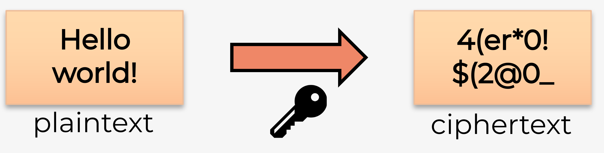
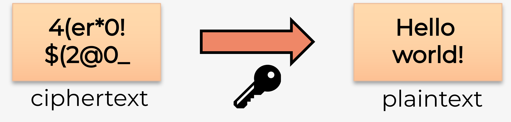
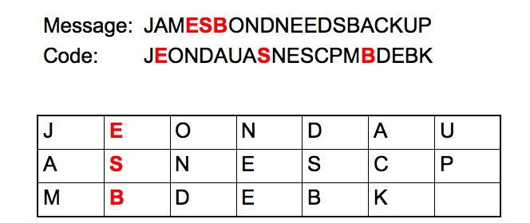
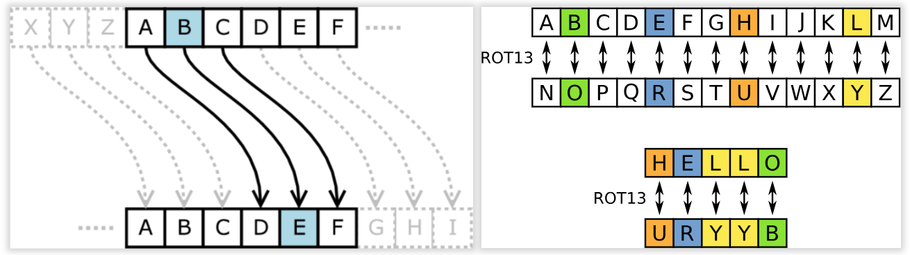
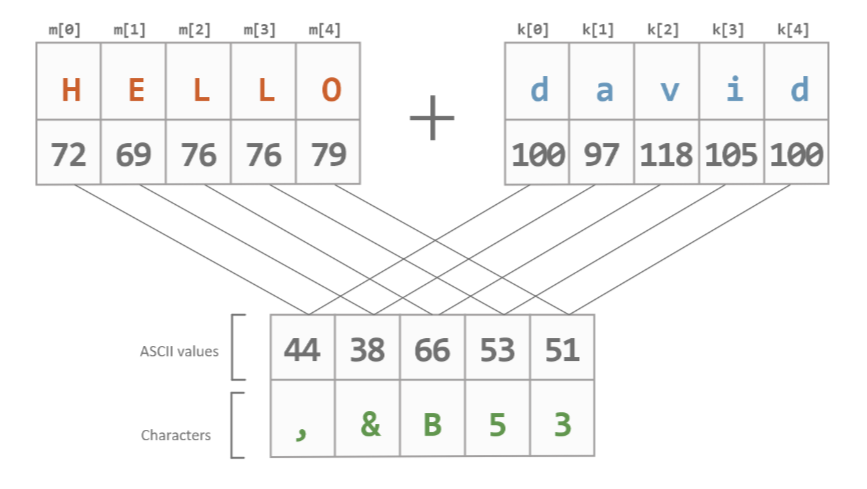

# H4 Confidentiality

## Cryptografie

### Cryptografie vs. cryptanalyse

#### Cryptografie

- *Cryptologie* 
    - **wetenschap** maken en breken **geheime codes**
- *Cryptografie* (maken van geheime berichten)
    - **manier** om gegevens **op te slaan** en te verzenden, zodat alleen de ontvanger deze kan lezen
    - Moderne cryptografie: gebruik van algoritmen om gevoelige data te beschermen
    - Veel **ouder dan computers** (duizenden jaren)
- *Crypto-analyse*:
    - **kraken** van cryptografie

### Encrypteren

- Om vertrouwelijkheid (confidentiality) te garanderen kunnen we een bericht **encrypteren** met behulp van een specifiek algoritme (cipher)
- Hierbij wordt een bericht dat we kunnen begrijpen (**plaintext**) omgezet naar een onleesbaar bericht (**ciphertext**) via een aantal goed gedefinieerde stappen (algoritme), vaak met behulp van een geheime sleutel (**key**).

### Decrypteren

- Het omgekeerde is ook mogelijk, **decrypteren** zet een onleesbaar bericht terug om naar de originele leesbare tekst.
- Voor encrypteren en decrypteren wordt vaak een **combinatie** gebruikt van verschillende **technieken**:
    - **Transpositie** (omzetting) (Van plaats verwisselen)
    - **Substitutie** (vervanging) 
    - **One-time pad** (Random bij optellen)

### Soorten technieken

#### Transpositie

- Eenvoudig voorbeeld van **transpositie** waarbij de volgorde van de karakters wijzigt (cfr. transpositie van een matrix, AT)

#### Substitutie

- Voorbeelden **substitutie** waarbij karakters vervangen worden door andere karakters

#### One-time pad

- Voorbeeld one-time pad waarbij een random **sleutel (pad)** toegevoegd wordt aan de plaintext
- Nadien wordt het resultaat omgezet naar een getal van 2 cijfers

##### Randomheid

- One time pad kan gekraakt worden als er een **patroon** in de sleutel zit
    - De sleutel moet volledig **random** zijn
	- Mensen zijn heel slecht in randomheid
	- Computers ook

##### Pseudorandom

- Computers zijn deterministisch
    - we maken ze juist heel precies zodat ze altijd hetzelfde uitkomen
- Computers bevatten **pseudorandom** generators
    - Spuwen op basis van een startgetal (**seed**) schijnbaar random getallen uit
    - Seeds wordt heel vaak gebruikt in games
	    - Randomheid in AI, omgeving, ...
	        - Gebruiken bv. tijd van spelen als seed
	    - Genereren van werelden

- Pseudorandom algoritmes zijn **zeer moeilijk** om correct op te stellen
- Vaak wordt er gebruik gemaakt van **natuurlijke** random fenomenen
    - bv. [https://random.org](https://random.org/) biedt random getallen aan op basis van atmosferische ruis
    - bv. Cloudflare filmt een muur van lavalampen en zet die om naar random getallen

### Twee types algoritmen

#### Symmetrische algoritmen
- **Zelfde sleutel** voor encrypteren (versleutelen) en decrypteren
	- Verzender en afzender **kennen de sleutel** voor communicatie begint
        - Groot nadeel: hoe wissel je deze veilig uit?

![[Pasted image 20241209161935.png]]

#### Asymmetrische algoritmen
  - **Sleutelpaar**:verschillende sleutels voor encrypteren en decrypteren
        - 1 sleutel is **publiek** (openbaar), andere is **privé**
        - Hoeft geen sleutel op voorhand uit te wisselen
            - Niet het grote nadeel van symmetrische encryptie
            - Wel complexer en dus **trager** dan symmetrische algoritmen
![[Pasted image 20241209161914.png]]

##### Ook **publieke-sleutel-cryptografie** genoemd

- Iedereen kan bericht encrypteren met publieke sleutel, enkel ontvanger kan decrypteren met private sleutel

![[Pasted image 20241209162026.png]]

### Private-key versleuteling (symmetrisch)

#### Data Encryption Standard (**DES**)
- Eenvoudig, encrypteert 64-bits blokken met 56-bits sleutel
- Niet bruikbaar in praktijk, **niet veilig**!

 #### Triple DES (**3DES**)
- 3x DES met verschillende sleutels
- Sleutelsterkte: ~~3x56 = 168 bits~~ in praktijk 112-168 bits afhankelijk van gekozen combinatie
- Niet bruikbaar in praktijk, **niet veilig**!

 #### International Data Encryption Algorithm (**IDEA**)
- 64-bits blokken met 128-bits sleutel
- Vervanging voor DES, gebruikt bij PGP (Pretty Good Privacy)
- **Veilig** op dit moment

#### Advanced Encryption Standard (**AES**)
- 128-bits blokken, sleutel van 128, 192 of 256 bits
- Goedgekeurd door NIST, gebruikt door Amerikaanse overheid
- **Veilig** op dit moment
- Op dit moment meest aangeraden (bv. voor performantie, implementeerbaarheid, ...)

### Public-key versleuteling (asymmetrisc)

 #### Rivest Shamir Adleman (**RSA**)
- Gebruikt product van 2 heel grote priemgetallen
- Vaak gebruikt in browsers
- **Veilig** op dit moment

#### Elliptic Curve Cryptography (**ECC**)
- Alternatief voor RSA: Nulpunten van elliptische curven i.p.v. priemgetallen
- NSA gebruikt dit voor handtekeningen en uitwisselen sleutels
- **Veilig** op dit moment
- Wordt meer en meer gebruikt i.p.v. RSA vanwege kleinere sleutels.

#### Diffie-Hellman
- Gebruikt om geheime sleutel (sessiesleutel) voor symmetrisch algoritme **veilig uit te wisselen**
- Vaak gebruikt: SSL, TLS, SSH, IPSec, ...
- **Veilig** op dit moment

#### El Gamal
- Amerikaanse overheidsstandaard voor digitale handtekeningen
- Niemand heeft patent ...
       - Vroeger was er een patent op RSA (nu niet meer)
       - Werd daarom gebruikt bij PGP (Pretty Good Privacy)
- **Veilig** op dit moment

### Symmetrische vs. asymmetrische codering

|Symmetrisch|Asymmetrisch|
|---|---|
|Snel|Niet nodig om beide sleutels te delen|
|Verbruikt weinig resources|Kan gebruikt worden voor encryptie en validatie (=handtekening)|
|Kan gebruikt worden voor korte en lange berichten|Gebruikt veel resources|
|Sleutel moet op veilige manier gedeeld worden|Enkel bruikbaar voor relatief kleine berichten|
### In de praktijk

1. We gebruiken **asymmetrisch encryptie** om een geëncrypteerde tunnel op te zetten
2. We gebruiken dan **Diffie-Hellman** om via de tunnel een gemeenschappelijke symmetrische sessie-sleutel te genereren zonder onze private keys uit te wisselen
3. We gebruiken daarna de **symmetrische sessiesleutel** om een (snellere) geëncrypteerde tunnel op te zetten

- Een "**tunnel**" betekent dat we berichten in een enkele of beide richting encrypteren. Anderen kunnen deze berichten niet lezen. Het lijkt alsof we een eigen tunnel hebben voor onze berichten door het internet.

### Public-key versleuteling

- Encrypteren (encrypt/decrypt)
- Digitale handtekening (sign/verify).

![[Pasted image 20241209162959.png]]

### Diffie Hellman

- Wordt gebruikt om met asymmetrische algoritmen een symmetrische sleutel te genereren
    - De private key wordt **nooit** getoond aan de andere partij!
    - Toch bekomen beide partijen dezelfde sleutel als resultaat

![[Pasted image 20241209163056.png]]

## cryptanalyse

### Het kraken van cryptografie

- Bij het **kraken** van cryptografie probeer je een onleesbaar bericht (ciphertext) om te vormen naar een leesbaar bericht (plaintext) **zonder** dat je de **geheime sleutel** kent
- In sommige gevallen zelfs zonder dat je weet **welk algoritme** gebruikt is voor de encryptie
- In theorie kan je elk algoritme kraken, maar de kans op succes hangt af van 2 factoren:
    - De hoeveelheid **tijd** die je hebt voor het bericht irrelevant wordt
    - De hoeveelheid **bronnen** (bv. CPU, GPU, storage, ...) die je kan gebruiken

### Technieken

- Soms is het mogelijk om algoritmen te kraken door **op zoek** te gaan naar **bepaalde patronen** in de ciphertext (zo is de Enigma gekraakt door Alan Turing!)

- Voor het kraken van moderne algoritmen worden vaak volgende technieken gebruikt:
    - **Dictionary attack**: uitproberen van verschillende waarden uit een opgegeven lijst
        - bv. woordenboek of dump van wachtwoorden
    - **Brute-force attack**: uitproberen van alle mogelijke waarden voor de geheime sleutel
        - heel tijdsintensief!
    - **Rainbow tables**: gebruikt vooraf gemaakte, gesorteerde lijsten met ciphertext en de overeenkomstige plaintext
        - wordt gebruikt voor het kraken van hashing algoritmen

### CPU, GPU, AI of quantum computing?

- De bewerkingen nodig voor het kraken van een modern algoritme zijn vaak **veel efficiënter** uit te voeren op een **GPU** dan een CPU (en dus veel sneller!)
- De opkomst van **AI** kan mogelijks in de toekomst een grote rol spelen bij het kraken van encryptie, als AI modellen hiervoor getraind kunnen worden (bv. door training met vaak gebruikte wachtwoorden)
- Verwacht wordt ook dat **quantum computing** veel algoritmen voor encryptie onbruikbaar zal maken, maar dit is nog niet voor morgen ...
    - Toch wordt op dit moment al veel geëncrypteerde data opgeslagen zodat deze later gekraakt kan worden!

### Enkele tools

**John The Ripper**
    - Kraken van zwakke wachtwoorden via een hash (bv: kraken van geëncrypteerde ZIP-file via hashwaarde)
    - Maakt gebruik van **dictionary attacks** via een woordenboek en/of **bruteforce** attacks
    - Geoptimaliseerd voor kraken via **CPU**, beperkte ondersteuning voor GPU

**Hashcat**
- Functionaliteit vergelijkbaar met John The Ripper
- Geoptimaliseerd voor kraken van wachtwoorden via **GPU**

## Data verduisteren

### Gegevensmaskering (masking)

- Gevoelige data **vervangen** door niet-gevoelige data
- Niet-gevoelige versie ziet eruit en gedraagt zich als het origineel
    - Geen wijzigingen nodig aan applicaties of data-opslagfaciliteiten
- Vaak gebruikt voor testen en analyse zonder privacyrisico
- Verschillende **technieken** om gegevens te wijzigen, maar zinvol te houden:
    - **Vervanging** vervangt gegevens door authentiek ogende waarden (garanderen anonimiteit)
    - **Shuffling** verwisselt data van verschillende gebruikers
        - Werkt goed voor bijvoorbeeld financiële data in een testdatabase

### Steganografie

- **Verbergt** gegevens in een ander bestand
    - bv. grafisch, audio-, of ander tekstbestand
- Geheime boodschap **valt niet op**
    - Niemand zou ooit weten dat een foto daadwerkelijk een geheime boodschap bevatte door het bestand elektronisch of op papier te bekijken
- Verschillende **componenten** betrokken:
	- **Ingebedde** gegevens = geheim bericht
	- **Omslagtekst** verbergt gegevens die de **stego-tekst** produceren
	    - Omslag en/of verborgen gegevens kunnen ook afbeelding of audio zijn
	- **Stego-key** regelt het verbergingsproces

### Gegevensverduistering (obfuscation)

- Toepassen gegevensmaskering en steganografietechnieken
    - **Verduistering** maakt de boodschap verwarrend, dubbelzinnig of moeilijker te begrijpen
    - Systeem kan opzettelijk berichten **door elkaar halen**

![[Pasted image 20241209164056.png]]

- Je kan dit zelf uittesten op [https://obfuscator.io/#code](https://obfuscator.io/#code)

