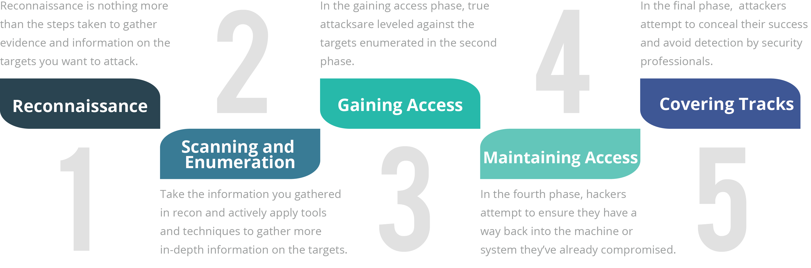
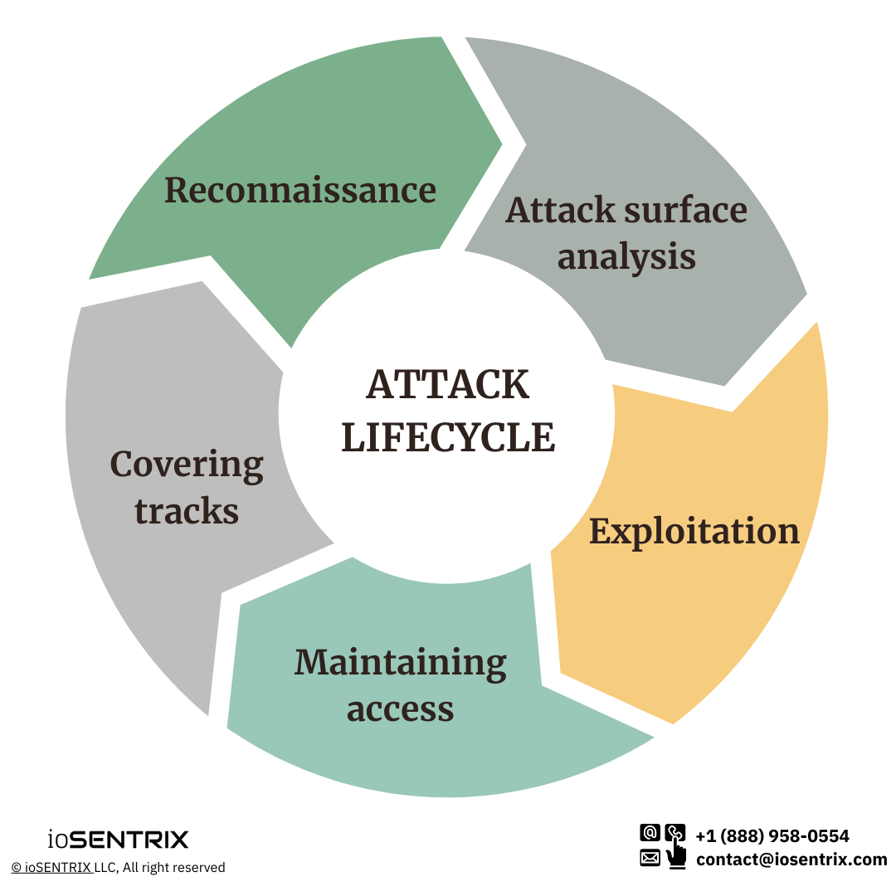
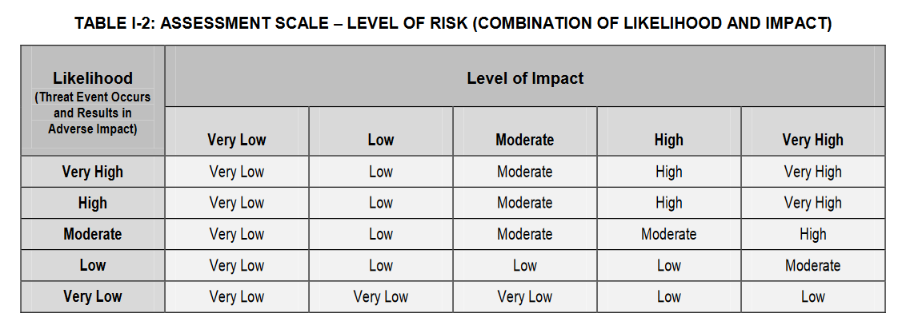
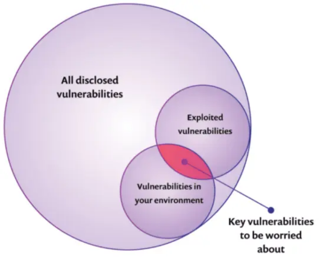

# H8 Red team
## Taak van het red team

- Proberen inbreken
- Verdediging testen
- **Zwakke punten blootleggen**

Legaal, en in dienst van de organisatie die ze aanvallen

### White hat / Black hat /grey hat

Deze legale hackers worden ook "White hat hackers" genoemd. Illegale hackers met slechte bedoelingen zijn "Black hat", en hackers die soms wetten negeren maar niet per se slechte bedoelingen hebben zijn "Grey hats"

## De 5 fasen

- *Reconnaissance*: Onopvallend **informatie** verzamelen
- *Scanning and enumeration*: Actief zoeken naar **zwakke punten**
- *Gaining access*: De gevonden zwaktes **aanvallen**
- *Maintaining access*: Zorgen voor manieren om later **opnieuw in te breken**
- *Covering tracks*: Zorgen dat het doelwit **geen sporen** terugvindt

## Fase 1: Reconnaissance

- Zo **veel** mogelijk informatie verzamelen (footprinting)
- Zo **onopvallend** mogelijk
- Doel:
    - Het doelwit **begrijpen**
        - Wie? Wat? Hoe? Waar? ...
        - Hoe beveiligen ze zich?
        - Waar zit de waardevolle data?
        - ...
    - De toekomstige aanval **accurater** maken door het **aanvalsdomein** te beperken

### Reconnaisance: types

- **Passief**
    - **Geen direct contact** met het doelwit
    - Anoniem
- **Actief**
    - **Wel direct contact** met het doelwit
        - Doelwit heeft informatie over aanvaller!
        - Maar doelwit weet (normaal gezien / nog) niet dat die data gelinkt is aan een toekomstige aanval.
- Soms **dunne grens**: bv. website bezoeken

#### voorbeelden

- Voorbeelden passieve reconnaisance:
    - Publieke bronnen (overheidsdata, kranten, social media, ...)
    - Aankomend/vertrekkend personeel in de gaten houden
- Voorbeelden actieve reconnaisance:
    - Helpdesk bellen
    - Werknemer om een naamkaartje vragen
    - Solliciteren
### Reconnaissance: Zoekmachines

Gebruik niet enkel [Google](https://google.com): **verschillende zoekmachines** hebben verschillende resultaten

- [Bing](https://bing.com), [Yandex](https://yandex.com), [Duckduckgo](https://duckduckgo.com), ...

Gebruik **operatoren** om efficiënter te zoeken

- [https://ahrefs.com/blog/google-advanced-search-operators/](https://ahrefs.com/blog/google-advanced-search-operators/)
- [Google Hacking Database](https://www.exploit-db.com/google-hacking-database)

#### OSINT

**Open source intelligence** (OSINT) is het verzamelen en analyseren van gegevens die verkregen zijn uit openbaar beschikbare bronnen[[1]](https://nl.wikipedia.org/wiki/Open_source_intelligence#cite_note-1)[[2]](https://nl.wikipedia.org/wiki/Open_source_intelligence#cite_note-2). Dit in contrast met het verzamelen en analyseren van gegevens verkregen uit spionage ([HUMINT](https://nl.wikipedia.org/wiki/HUMINT "HUMINT")) of verkregen uit het onderscheppen van elektronische signalen ([SIGINT](https://nl.wikipedia.org/wiki/SIGINT "SIGINT")), beide het domein van inlichtingendiensten. Onder deze openbare bronnen kunnen naast bewust openbaar gemaakte data ook onbewust openbaar gemaakte data of zelfs gelekte data vallen.

### Reconnaissance: Openbare databanken

Openbare databanken bevatten **publiek beschikbare**, maar soms zeer interessante, data. Voorbeelden:

- [Nationale Bank België](https://nbb.be)
- [Belgisch staatsblad](https://www.ejustice.just.fgov.be/cgi/welcome.pl)
- [Vlaamse databanken en zoeksystemen](https://www.vlaanderen.be/intern/werkplek/digitale-tools-en-digitale-veiligheid/bibliotheken-vlaamse-overheid/databanken-en-zoeksystemen)

### Reconnaissance: Vacatures

- Informatie over belangrijke (open) **posities**
- Informatie over gebruikte **technologieën**

### Reconnaissance: Social Media

- Mensen **delen** vaak (onbewust) **gevoelige informatie**
    - Locatie
    - Afbeeldingen van beveiliginsmechanismen of sleutels
    - Biometrische data, bijvoorbeeld in [deze studie](https://documents.trendmicro.com/assets/white_papers/wp-leaked-today-exploited-for-life.pdf)

- **Gespecialiseerde tools** om informatie van sociale media te verzamelen:
    - Online: Pipl, Maltego, ...
    - Commandline: bv. theHarvester, recon-ng, ...

### Reconnaissance: e-mailadressen

- Eenvoudig met tools als bv. [hunter.io](https://hunter.io)

### Reconnaissance: Websites

- De meeste organisaties hebben een website
- Bevat vaak **veel informatie**
    - Contactgegevens
    - Foto's (personeel, gebouwen)
    - Structuur van het bedrijf
- Gebruikte **technologie**
    - [Netcraft](https://www.netcraft.com/), [BuiltWith](https://builtwith.com/), [Wappalyzer](https://www.wappalyzer.com)
    - Met development tools/plug-ins (bv. `F12`)
- Soms beter om een **hele website te downloaden**
    - Onopvallend experimenteren
    - bv. met [HTTrack](https://www.httrack.com/)

### Reconnaissance: Whois

- Informatie over registratie domein
- [whois.domaintools.com](https://whois.domaintools.com/)

### Reconnaissance: DNS

- Vertaalt een **domeinnaam** ([www.hogent.be](http://www.hogent.be)) naar een **ip-adres** (`193.190.173.135`)
- Informatie over website, netwerk, infrastructuur
- Soms **gevoelige informatie** in slecht beveiligde DNS-servers
- Verschillende tools om info te achterhalen:
    - `nslookup`, `dig`, `dnsrecon`, `dnsmap`, ...

### Reconnaissance: IoT

- IoT devices zijn vaak **slecht beveiligd** en bieden zo toegang tot een bedrijf
- Zoeken naar publiek toegankelijke devices kan via [Shodan](https://www.shodan.io/)

## Fase 2: Scanning en enumeration

### Scanning en enumeration: doel

- Zoeken naar **zwakke punten**
    - Bedrijven houden dit zelf ook in de gaten (asset management)
- Gebruikte technologieën en versies vinden en linken aan **gekende kwetsbaarheden**
    - [CVE](https://www.cve.org), [exploit-db.com](https://www.exploit-db.com)
- Technischer en actiever dan reconnaissance

- **Port scanning**
    - Detecteren van open poorten en services
- **Network scanning**
    - Netwerk in kaart brengen.
    - Detecteren van gebruikte IP-adressen, besturingssystemen, netwerktoestellen, verbindingen, ...
- **Vulnerability scanning**
    - Onderzoeken of er gekende kwetsbaarheden of zwaktes in het netwerk aanwezig zijn

- **Ping**
    - Welke toestellen zijn bereikbaar?

- **Traceroute/tracert**
    - Welke route leggen berichten in het netwerk af?

### Scanning en enumeration: poortscanners

- Scant de **netwerkpoorten** van een toestel
- 3 mogelijkheden:
    - **Open**: een programma aanvaart connecties (interessant!)
    - **Gesloten**: connectie wordt niet aanvaard
        - Bv. geen programma actief op die poort
    - **Gefilterd**: Geen antwoord
        - _misschien_ vanwege een firewall
- Tools: [nmap](https://nmap.org/), [masscan](https://github.com/robertdavidgraham/masscan), [megaping](https://magnetosoft.com/product-megaping/), ...

- Vele tools gebruiken specifieke poorten
    
| Poort | Tool  |
| -----:|:----- |
|    22 | SSH   |
|    80 | HTTP  |
|   443 | HTTPS |
|  3306 | MySQL |
    
- Een volledig overzicht: [Wikipedia](https://en.wikipedia.org/wiki/List_of_TCP_and_UDP_port_numbers).

- Zeer populaire **poortscanner**
- Kan gokken **welk programma** en **versie** draait achter een open poort
- Ook **netwerkscanner** functionaliteit (zie later)
- Grafische wrapper: Zenmap

- Scant het netwerk af naar **hosts** (= toestellen) **en verbindingen**
- Moet toegang tot het netwerk hebben
- Verschillende opties: [LANState (Pro)](https://www.10-strike.com/lanstate/), [PRTG Network Monitor](https://www.paessler.com/prtg), [SolarWinds network topology mapper](https://www.solarwinds.com/network-topology-mapper/use-cases/network-mapping), ...

- Scant het netwerk af naar gekende **kwetsbaarheden**
- Moet ook toegang tot het netwerk hebben
- Verschillende opties: [OpenVAS](https://openvas.org/), [Nessus](https://www.tenable.com/products/nessus), [Metasploit](https://www.metasploit.com/)

- Informatie verzamelen op **applicatie-niveau**
    - Niet enkel toestellen, IP-adressen en poorten
- Vervolg op scanning
- **Netwerkprotocollen** "misbruiken" voor informatie over
    - Netwerkschijven
    - Loginsystemen
    - FTP servers
    - SMB servers
    - ...
- Details zijn voor vervolg-OLOD's

## Fase 3-5: Gaining access, maintaining access, covering tracks

### Gaining access

- Ontfutselen van logingegevens
    - Vele hackaanvallen gebruiken ook **social engineering**!
    - **Reconnaissance** is zeer belangrijk om kwetsbare targets te vinden
- **Exploits**
    - Het uitbuiten van zwaktes/foutjes in software
    - Veel makkelijker als systemen **niet up to date** zijn
- Password **cracking**
    - Zie H1:
        - Korte wachtwoorden: **brute force**
        - Gekende wachtwoorden: **dictionary attacks**
- Er zijn vele ander opties!

### Maintaining access

- Ook gekend als **persistence**
- Bv. je breekt binnen op een toestel in het netwerk. Dat toestel wordt fysiek afgesloten. Dan kan je weer opnieuw beginnen om binnen te geraken.
- Om dat te vermijden: verschillende opties
    - **Malware** installeren (rootkits, backdoors, reverse shells, ...)
    - Nieuwe **gebruiker** aanmaken
    - **Pivoting** (naar andere toestellen springen)
- Vaak nodig om administratorrechten (**root access**) te verkrijgen via **privilege escalation**
    - Kan met andere exploits
- Ondertussen zo onzichtbaar mogelijk blijven (**evasion**)

### Covering tracks

- Onopgemerkt blijven: **bewijsmateriaal** wegmoffelen
    - **Gebruikte bestanden** verwijderen of verstoppen
        - Bijvoorbeeld in `/tmp`-map
    - **Logs** aanpassen
        - Log files verwijderen valt juist extra op!
    - **Timestamps** aanpassen
    - ...

### De cyber attack cycle

- De fases zijn vaak niet mooi opeenvolgend, maar eerder **cyclisch**
- Een interessante ontdekking in latere fasen kan zorgen voor een **nieuwe reconnaissance**, om te zien hoe deze informatie kan uitgebuit worden

## Pentests en audit reports

### Pentests

- Van de 5 fases is enkel **passieve reconnaissance** standaard toegelaten
- Elke andere interactie heeft **expliciete toestemming** van het doelwit nodig
    - Vaak hoort daar een **non-disclosure agreement** (NDA) bij
        - Gevoelige informatie
    - Tegelijk wordt ook een **scope** afgesproken
        - Wat mag? Wat mag niet?
- Dit onderzoek heet dan een **pentest** (penetration test) of **security audit**

- NDA: om ervoor te zorgen dat informatie over de werking van het bedrijf of de beveiliging niet uitlekt
- Scope: bijvoorbeeld, welke tools/technieken mogen gebruikt worden, welke personen/machines/netwerken/applicaties mogen getarget worden, ... .

### White / Grey / Black box

- **White box**: het red team kent het systeem volledig, en zal die kennis gebruiken bij de aanval
    - Documentatie, broncode, werknemers, ...
- **Black box**: het red team begint zonder enige informatie, net zoals een externe hacker dat zou moeten doen
    - Duurt vaak langer, dus ook duurder
- **Grey box**: het red team heeft een beetje informatie
    - Bv. welke IP range is mogelijk kwetsbaar?

### Audit Report

- Vaak wordt de pentest afgesloten met een geschreven rapport, het **Audit Report**
    - Dit rapport bevat over het algemeen:
        - Een **conclusie** die begrijpbaar is voor niet-technisch personeel
        - Een **gedetailleerde lijst van vulnerabilities, exploits en threats** waar het IT-team mee aan de slag kan.
    - Dit is een **momentopname**, en is nooit compleet.
    - [Voorbeeld](https://pentest-hub.com/PDF/EXAMPLE-Penetration_Testing_Report_v.1.0.pdf)

### Vulnerabilities en exploits

- **Vulnerabilities** zijn foutjes in software of configuratie die een zwakke plek vormen
- **Exploits** zijn manieren om vulnerabilities te misbruiken.

### Threats en risk

- Een **threat** is dan het gebruik van een exploit door een aanvaller.
- **Risk** is de maat van ernst van een bepaalde vulnerability, gebaseerd op hoe waarschijnlijk het is dat er een threat komt, en hoe ernstig het is als dat gebeurt.
- Methodes om risk te berekenen: bv. van [NIST](https://doi.org/10.6028/NIST.SP.800-30r1)

### Risk matrix

- Uit de gelinkte NIST publicatie.
- Dit soort matrices wordt gebruikt om te bepalen wat de Risk is, gebaseerd op _likelihood_ (= kans op threat) en _impact_ (= ernst van threat)
- Likelihood en Impact worden bepaald per bedrijf, ze zijn relatief
- Voorbeeld:
    - Een _high impact_ threat (als het gebeurt, ligt de website een dag plat) met _very low_ likelihood (bv, de vulnerability is zeer moeilijk te exploiten, de aanvaller moet een usb-stick in een specifieke servermachine steken) heeft als totale risk-score **low**. Dit is dus een lagere prioriteit dan bv. een threat die _moderate_ impact en _moderate_ likelihood heeft.

### Kort woordje over de verdediging

- Vulnerabilities die niet gekend zijn kan je ook niet in rekening brengen. Het is best altijd enkele defensieve tactieken toe te passen, maar verder is het beter te focusen op gekende vulnerabilities.
- Niet alle vulnerabilities hebben een exploit. Vulnerabilities met exploits hebben een hogere likelihood, en dus hogere risk.
- Natuurlijk moet je je ook afvragen of een bepaalde vulnerability uberhaupt voorkomt in jouw systeem of netwerk
- De vulnerabilities waar je op focust zijn dus die:
    - Die bij jou voorkomen
    - Die gekend zijn
    - EN die een exploit hebben