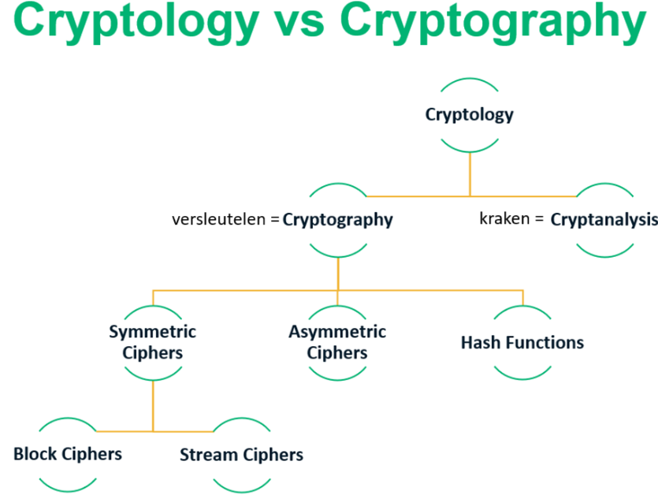
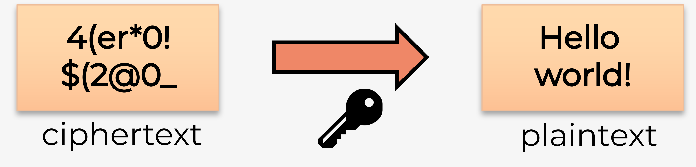

#Samenvatting #Cybersecurity #HoGent #toegepasteinformatica

Lesgever: [Pieter-Jan Maenhaut](pieterjan.maenhaut@hogent.be)
# H0 : Inleiding

## Links
[hogenttin.github.io/cybersecurity-slides/h0.html#/](https://hogenttin.github.io/cybersecurity-slides/h0.html#/)
https://chamilo.hogent.be/

## Legal

- Enkel in een legale context
    - Eigenaar of toestemming van eigenaar
- Illegaal gebruik: kans op gerechtelijke vervolging
- Op eigen verantwoordelijkheid!
    - Lectoren/HOGENT: niet aansprakelijk
    - Zie ook [OER](https://www.hogent.be/student/een-vlotte-start/onderwijs-en-examenregeling/) Art. 47. §7:

## Bij vragen:

Steeds alleen mailen naar: pieterjan.maenhaut@hogent.be

# H1: data, het virtuele goud

## Tegenhanger

Het wilde westen: **goud** -> - Het internet: **data**

## Jouw data

Wat is jou data (8):

### Private information (persoonlijke data)

- Een groot gedeelte van jouw data zit bij **bedrijven**:
    - Private gegevens: chat, e-mail, foto's, ...
    - Financiën: bankrekeningen, overschrijvingen, ...
    - Medisch: aandoeningen, ziektegeschiedenis, medicatie, ...
    - School: punten, verslagen, feedback, ...
    - Werk: loon, HR, werkbestanden (bv. als zelfstandige), ...
    - Overheid: rechtszaken, boetes, eigendom, ...
- Bij welke bedrijven zit jouw data?
    - Wie kan dit zien of aanpassen?
    - Wat zijn de gevolgen?
    - Wat als de data verloren geraakt?
- Ook data op eigen toestellen of papier is gevoelig
    - Private foto's of video's, bitcoinwallet, wachtwoorden, ...

## Industrial data (industriële data)

- Hackers zijn niet enkel geïnteresseerd in jouw data, maar ook in **industriële** data.
    - Vaak voor losgeld of (bedrijfs)spionage
- Een industriëel netwerk is anders dan een thuisnetwerk
    - Meer dan enkel computers (bv. [SCADA](https://scada-international.com/what-is-scada/))

## Omgaan met data

- Bedrijven hebben de verantwoordelijkheid om deze gegevens te **beschermen**:
    - Tegen misbruik
    - Tegen ongeoorloofde toegang.
- Groei in gegevensverzameling en -analyse
    - Grote **risico's**
    - **Voorzorgsmaatregelen** nodig
    - Plicht om gevoelige gegevens te beschermen tegen criminelen om schade te vermijden

## Staten van data

- Alles in de cyberwereld draait rond data. Cybersecurity specialisten focussen zich op het beveiligen van die data
- Data heeft 3 mogelijke staten:
    - Data in **rust**/opslag
    - Data tijdens het **verzenden**
    - Data tijdens het **verwerken**

### Data in rust

- Data opgeslagen op **opslagapparaten** dat niet wordt gebruikt door personen of processen.
- Opslagapparaten kunnen **lokaal** (harde schijf, USB-stick, ...) of gecentraliseerd **op afstand** aangesloten zijn (Dropbox, Google drive, NAS, ...)
- Data kan zo **verloren** of **gestolen** worden
    - Harde schijf kapot
    - Laptop vergeten op trein
    - Smartphone gestolen

### Data tijdens verzenden

- Verschillende manieren:
    - **Sneaker net**: gebruikt opslagapparaten om data tussen computers over te zetten (USB-stick, draagbare harde schijf, ...)
    - **Bedraad** netwerk: gebruikt koper- of fiberkabels
    - **Draadloos** netwerk: gebruikt elektromagnetische golven (kan door iedereen in de buurt "gehoord" worden)

- Een van de grootste uitdagingen voor cybersecurity personeel om te beveiligen.

- Enkele uitdagingen: cybercriminelen kunnen data tijdens het verzenden ...
    - afluisteren, kopiëren of stelen (vertrouwelijkheid)
    - aanpassen (integriteit)
    - verhinderen of verstoren (beschikbaarheid)

#### Extra info
- Tools om af te luisteren
	- nmap
	- wireshark

- Beveiligingsmaatregel:
	- End to end encrypty
	- wifi: 802.11x (wifi beveiliging via encryptie)

- Betrouwbare messaging services:
	- matrix (zelf opgezette messaging service (peer to peer))
	- Signal
### Data tijdens het verwerken

- Dit omvat data tijdens de **invoer**, **aanpassing**, **berekening** of **uitvoer**

- Organisaties gebruiken verschillende methodes om data te verzamelen:
    - Manuele invoer, het uploaden van bestanden, dataverzameling van sensoren, ... .
    - Elk van deze input-methode is een mogelijke bedreiging voor integriteit
- Data kan aangepast worden door manuele verandering door gebruikers, programma's die de data wijzigen, defecte apparaten, ... .
    - Voorbeelden van data-aanpassingen: encoderen/decoderen, compressie/decompressie, encryptie/decryptie, ... .
- Data dat zodanig wordt aangepast dat het fouten bevat of onbruikbaar wordt, noemt men **corrupte** data

## CIA driehoek (Rode draad in de cursus)

- 3 principes:
    - **C**onfidentiality (vertrouwelijkheid)
    - **I**ntegrity (integriteit)
    - **A**vailability (beschikbaarheid)

### **Confidentiality** (vertrouwelijkheid)
    - Wie mag dit zien? (en mag deze persoon enkel zien wat essentieel nodig is voor de persoon)
    - Bv. chatgesprekken, bedrijfsgeheimen, medische informatie, ... .

- Verhindert de bekendmaking van informatie aan onbevoegde personen, bronnen en processen.
- Organisaties moeten hun personeel opleiden om zo goed mogelijk om te gaan met gevoelige informatie om zichzelf en hun organisaties te beschermen tegen aanvallen.
- Vertrouwelijkheid kan verkregen worden door **encryptie**, **authenticatie** en **toegangscontrole**.
    - Dit wordt uitgebreid behandeld in **H4**.

### **Integrity** (integriteit)
    - Klopt dit wel? Is de informatie juist? Komt deze van de juiste persoon?
    - Bv. financiële transacties, contracten, ... .

- Integriteit is de nauwkeurigheid, consistentie en **betrouwbaarheid** van data zolang die data bestaat. Een andere term is de kwaliteit.
- De nood aan integriteit hangt af van de aard van de data.
    - Bijvoorbeeld:
        - Facebook verifieert de data in een gebruikerspost niet
        - Transacties en bedragen bij een bank moeten steeds 100% correct zijn
- Verlies van integriteit kan enorme schade brengen aan personen en organisaties, en kan databronnen onbruikbaar of onbetrouwbaar maken
- Een integriteitscontrole is een manier om te bekijken of gegevens (bestanden, foto's, transacties, ...) nog steeds correct zijn (niet corrupt of beschadigd).
    - Hiervoor wordt vaak een **hash functie** gebruikt.
- Dit wordt uitgebreid behandeld in **H5**.
### **Availability** (beschikbaarheid)
    - Kan ik er aan wanneer ik het nodig heb?
    - Bv. 112-noodcentrale, chamilo.hogent.be tijdens online examen, e-mail servers, internet-toegang, ... .

- Informatiesystemen moeten op elk moment beschikbaar zijn.
- Aanvallen en fouten kunnen toegang tot systemen in gevaar brengen.
- Er bestaan vele maatregelen voor beschikbaarheid:
    - redundantie, backups, verhoogde weerstand, onderhoud, up-to-date software en OS, noodplannen om terug online te komen na een onvoorziene omstandigheid, gebruik van nieuwe technologieën, detectie ongebruikelijke activiteit en beschikbaarheidstesten, ... .
- Dit wordt uitgebreid behandeld in **H6**.

## Maatregel

- Technologie
- Beleid en uitvoering
- Mensen

## De cybersecurity kubus

- Om bij het ontwerpen van een beveiligsplan niets te vergeten, wordt dit vaak gevisualiseerd als een kubus met 3 zijden:
    - Beveiligingsprincipes (== de CIA-driehoek)
    - De staten van data
    - Beveiligingsmaatregelen
- De kubus staat ook bekend als de McCumber Cube.
- Er zijn 27 combinaties mogelijk

## Paswoord

- De **lengte** is dus heel belangrijk!
- Nog beter dan een wachtwoord is een **wachtwoordzin** (**passphrase**)
    - "Purple Elephants Sliding Over Clouds"
    - "3@pples&Or@nges#Ban@nas"
    - "Chocolate Cake Is My Favourite dess3rt"
- Gebruik voor elke website een **apart** wachtwoord!
- Gebruik 2FA (2 Factor Authenticatie)
- Bij **datalekken** worden vaak wachtwoorden op straat gegooid
    - Niet alle bedrijven zijn even zorgvuldig met hun beveiliging (of beveiligen niet!)
    - Hackers proberen deze wachtwoorden (geautomatiseerd) uit op andere sites
    - Hetzelfde wachtwoord gebruikt, kans groot dat ze op jouw andere accounts ook binnengeraken
- Gebruik **geen** trucjes
    - Bv. hogent19jan2023, google1nov1998, ...
    - Tools zoals hashcat en AI-hacktools herkennen dit meteen en kunnen zo al een gedeelte van het wachtwoord achterhalen
    - De effectieve ongekende lengte van het wachtwoord wordt een pak kleiner

### Paswoordmanagers

- **Password managers** zijn zeker een goede oplossing
- Voordelen:
    - Jouw wachtwoorden worden **versleuteld** opgeslagen
    - Je kan voor elke login een **aparte** username en wachtwoord instellen (niet vertrouwen op geheugen of post-it op scherm)
    - Heeft een ingebouwde password **generator**
- Vult wachtwoorden **automatisch** aan in de browser
- Nadelen:
    - Je **master password** is nu extreem belangrijk
    - Je **vertrouwt** het bedrijf achter de password manager
    - De software / plugins moet je 100% vertrouwen, en deze kunnen ook **bugs** hebben

### Paswoord beleid

- Bedrijven hebben vaak password policies waardoor je je wachtwoord **regelmatig** moet **wijzigen**
- Volgende wachtwoordwijziging doe je best niet elke maand of je personeel heeft wachtwoorden als ...
    - January123, February123, ...
    - Summer2023
- Op die manier heeft wachtwoorden wijzigen **geen zin**
- Wordt tegenwoordig ook **afgeraden** (bv. door NIST)

### Paswoorden bij programmeren

- Introduceer **time-delay** bij inlogpogingen
    - Bv. Als een persoon een foutief wachtwoord ingeeft, zorg dat er een wachttijd is van 5 seconden.
      Met als optie bijvoorbeeld na  foutieve pogingen 1u delay.
- Dit gaat **bots/scripts** tegen en de kans is groot dat de gebruiker het nooit zal merken!

### Paswoorden bij systeembeheer

- Introduceer programma's die bepaalde verbindingen blokkeren bij teveel pogingen
    - Bv. Als iets 5x probeert in te loggen met een foutief wachtwoord in 20 minuten, wordt deze genegeerd voor 6 uur

tool: [fail2ban/fail2ban: Daemon to ban hosts that cause multiple authentication errors (github.com)](https://github.com/fail2ban/fail2ban)

# H2: een wereld van experten en criminelen

## Wetgeving in cybersecurity

- Een van de basisprincipes binnen een samenleving of maatschappij is de **wetgeving**
- Dit is geen gemakkelijke taak om uit te voeren
    - Wetgeving loopt vaak achter op technologie
    - Het "**op tijd**" invoeren van "de juiste" regelgevingen is essentieel

- Er zijn **nationale** en **internationale** pogingen om dit te regulariseren
    - In **België**: *wetgeving rond "ethisch hacken"*
    - In **Europa**: *NIS* en *NIS2 directives*
    - In **VS**: *NIST framework*
    - **Wereldwijd**: *ISO/IEC cybersecurity model*

### wetgeving rond "ethisch hacken" (Belgisch)

- Het openbaar ministerie interpreteert de wetgeving nog steeds **restrictief**. Dit wil zeggen dat "hacking" nog steeds **bij wet verboden** is en blijft.
- Dit kader beschrijft ...
    - **hoe** een natuurlijke of rechtspersoon ...
    - **zonder frauduleuze bedoelingen** of de intentie om schade te berokkenen, ...
    - bestaande kwetsbaarheden in netwerken en informatiesystemen in België kan opsporen ...
    - en **moet melden**.

### NIS en NIS2 directive (Europees)

- NIS 
    - Eerste **EU-brede wetgeving** rond cybersecurity
    - Ingevoerd in 2016
    - Invoering ging (te) moeizaam

- NIS 2
    - Meer verduidelijking
    - Hoe omgaan met snelle technologische vernieuwingen
    - Meer samenwerking tussen lidstaten bij grote bedreigingen
    - Verplicht meer organisaties en sectoren om te werken rond cybersecurity
    - Verplicht lidstaten om meer de wet te handhaven
    - Ingevoerd op 16 jan 2023, moet in de nationale wetgevingen van EU-lidstaten staan tegen 17 okt 2024

### NIST Framework

- National Institute of Standards and Technologies (**NIST**) 
- Een **raamwerk** voor bedrijven en organisaties die cyberbeveiligingsprofessionals nodig hebben.
- Stelt bedrijven in staat de belangrijkste soorten verantwoordelijkheden, functietitels en benodigde personeelsvaardigheden te identificeren.

![[./attachments/20241007160955.png]]
Hoe Identificeren
Hoe Beschermen
Hoe Detecteren
Hoe Reageren
Hoe Herstellen

### ISO/IEC cybersecurity model (Globaal)

- Het beveiligen van data is een enorme taak. Het is onmogelijk voor een persoon om alles van begin tot einde te weten.
- Het International Organization for Standardization (ISO)/International Electrotechnical Commission (IEC) ! heeft een volledig framework opgesteld om te helpen dit in goede banen te leiden. Dit framework noemt het **ISO/IEC cybersecurity model**.
- Het ISO model is een **hulpmiddel** om complexe problemen te begrijpen en aan te pakken.
- Het ISO/IEC 27000 is een **standaard** opgesteld in 2005 (en geupdated in 2013). Het is gepubliceerd door ISO.
- Alhoewel de standaard **niet verplicht** is, wordt het door veel landen en organisaties gebruikt als het model voor cybersecurity.
- Het ISO 27000 model is bruikbaar voor elk type organisatie en bevat controle doelstelling in de vorm van checklists.
- De organisatie moet zelf bepalen welke controle doelstellingen voor hen van toepassing zijn.

## Aanvallers

- Een **hacker** (aanvaller) kan om verschillende redenen inbreken op computers of netwerken om toegang te verkrijgen

- **White hat** hackers breken in op netwerken of computersystemen om zwakke punten te ontdekken en zo de beveiliging van deze systemen te verbeteren. (bv: pentesters, meestal ingehuurd)
- **Gray hat** hackers bevinden zich ergens tussen de 2 andere types aanvallers. Deze aanvallers kunnen een kwetsbaarheid vinden en deze melden aan de eigenaren van het systeem als die actie samenvalt met hun agenda.
- **Black hat** hackers zijn onethische criminelen die de computer- en netwerkbeveiliging schenden voor persoonlijk gewin of om kwaadaardige redenen, zoals het aanvallen van netwerken.

### Scriptkiddies

- Dit zijn meestal **tieners** of **hobbyisten**, en hun aanvallen zijn meestal beperkt tot grappen en vandalisme. Ze hebben **weinig of geen vaardigheid** en gebruiken vaak bestaande tools of instructies op internet om aanvallen uit te voeren.

### Vulnerability brokers

- Dit zijn **gray hat** aanvallers die exploits proberen te ontdekken en deze aan leveranciers rapporteren, soms voor **geldprijzen** of **beloningen**.

### hacktivisten

- Dit zijn **gray hat** aanvallers die zich verzamelen en protesteren tegen verschillende **politieke en sociale ideeën**. Hacktivisten protesteren publiekelijk tegen organisaties of regeringen door artikelen en video's te plaatsen, gevoelige informatie te lekken en DDoS-aanvallen uit te voeren.

### Cybercriminelen

- **Black hat** hackers die ofwel als zelfstandige werken of voor grote cybercrime-organisaties werken. Elk jaar zijn cybercriminelen verantwoordelijk voor het **stelen van miljarden dollars** van consumenten en bedrijven.

### State sponsored hackers

- Afhankelijk van het perspectief van een persoon, zijn dit ofwel white hat ofwel black hat hackers die **overheidsgeheimen** stelen, **inlichtingen verzamelen** en netwerken **saboteren**. Hun doelwitten zijn buitenlandse regeringen, terroristische groeperingen en bedrijven. De meeste **landen** in de wereld nemen tot op zekere hoogte deel aan door de staat gesponsorde hacking.

## Verdedigers

### Cybersecurityspecialisten

- Het dwarsbomen van de cybercriminelen is een moeilijke taak. Vele bedrijven, de overheden en internationale organisaties zijn daarom begonnen met het nemen van **gecoördineerde acties** om cybercriminelen te beperken of af te weren.

#### Tools voor bedrijven
- **Vulnerability Databases**: publiek beschikbare databases van gekende kwetsbaarheden.
- **Early Warning Systems**: systemen voor vroegtijdige waarschuwing.
- **Share cyberthreat intelligence**: delen van cyber intelligence, vaak door middel van samenwerking tussen de publieke en private sector.
- **ISM-normen** (bv. ISO 27000): Standaarden en normen voor informatiebeveiligingsbeheer die een kader vormen voor het implementeren van beveiligingsmaatregelen binnen een organisatie.

### Organisaties voor samenwerking

- Cybersecurity-specialisten moeten regelmatig samenwerken met professionele collega's.
- Internationale technologieorganisaties sponsoren vaak workshops en conferenties.
  
(bijvoorbeeld: CCB (centrum voor cyber security Belgium), SANS, ISC2)

### Conferenties, CTF's, ...

- Cybersecurity-specialisten moeten dezelfde vaardigheden hebben als hackers, vooral black hat-hackers, om zich te beschermen tegen aanvallen.
- Hoe kan een individu de vaardigheden opbouwen en oefenen die nodig zijn om een cyberbeveiligingsspecialist te worden?
- Conferenties en competities zijn een geweldige manier om kennis en vaardigheden op het gebied van cyberbeveiliging op te bouwen.

(bijvoorbeeld: BruCon, Cyber Security Chalange Belgium, Cyber summer school)

### Organisaties tegen computermisdaad

- Er bestaan verschillende organisaties om computermisdaad te bestrijden
- België: Federal Computer Crime Unit (FCCU), Centre for Cyber Security Belgium, ...
- Wereldwijd: Europol, ENISA, Interpol, ...

## Security vs. privacy

- *Politie strijdt tegen criminaliteit*
    - Bv. terrorisme, kinderporno, mensensmokkel, fraude, drugshandel, ...
- *Burgers hebben recht op briefgeheim en privacy*
    - Hoe kunnen politiediensten criminelen vatten als er bv. encryptie wordt gebruikt?

- *Overheid verzamelt data*
    - Bv. belastingsdienst, boetes, ...
- **Hoe ver** mag de overheid hierin gaan?
    - Wat als de data voor iets anders wordt gebruikt?
    - Wat als er een fout in de data zit?
    - Wat als de definitie van "fout" verandert?

Ik heb niets te verbergen??

## GDPR

- In Belgie en Nederland bekend als de **AVG**
- Europese wet voor beschermen van privacy
- Ingevoerd in 2018
- Recht ...
    - ... van **inzage**
    - ... op **correctie**
    - ... om **vergeten** te worden
    - ... op **overdracht** van gegevens
    - ... **beveiliging**

- Organisaties moeten ...
    - ... een **correct doel** hebben voor gegevensverzameling
    - ... **enkel nodige** gegevens opvragen
    - ... voor slechts **beperkte duur**
    - ... **toestemming** vragen
- Privacyverklaring
- Soms kan de wet je verplichten om gegevens te geven
    - Bv. Foto voor identiteitskaart, scan luchthaven, ...

- Wat is **toestemming**? GDPR legt regels op
    - Duidelijk
    - Niet automatisch aangevinkt (expliciete toestemming)
    - Geen negatieve gevolgen
    - Intrekbaar
    - 13 jaar of ouder (of door voogd)
    - ...

# H3: bedreigingen, aanvallen en kwetsbaarheden

## Interne vs. externe aanvallen

### Interne aanvallen
- Afkomstig van een **interne gebruiker**.
- Per ongeluk of opzettelijk
- Kunnen **grotere schade** aanrichten dan externe dreigingen (omdat interne gebruikers rechtstreeks toegang hebben tot het gebouw en de bijbehorende infrastructuur/apparatuur)
- Interne aanvallers hebben doorgaans **kennis van het bedrijfsnetwerk, de bronnen en de vertrouwelijke gegevens**.

### Externe aanvallen
- Kunnen misbruik maken van **kwetsbaarheden** in netwerkapparaten, of kunnen **social engineering** gebruiken om toegang te krijgen te krijgen tot **interne bronnen**.

## Nu meer en eigen toestellen op netwerk

- **Mobiele apparaten** en **BYOD** toestellen (bring your own device)
	- *moeilijk centraal beheren en updaten*
-  **Internet of Things** (IoT)
	- *Grote hoeveelheid gegevens*. Gebruikers hebben *op afstand toegang*.

 ## Big Data
 - Het **volume** of de hoeveelheid gegevens (grote volume)
- De **verscheidenheid** of het bereik van gegevenstypen en bronnen
- De **snelheid** van gegevens (groei)

Deze drie dimensies worden ook wel de **3 V's** genoemd, nl. **V**olume, **V**ariety, **V**elocity.

## Bredere reikwijdte en cascade-effect
- **Federatief identiteitsbeheer** is inloggen tot externe diensten met een andere dienst (bv inloggen met facebook)
- Inlogmogelijkheid te koppelen aan een **geautoriseerd apparaat** is meest gebruikelijke manier om de federatieve identiteit te beschermen

## Malware en kwaadaardige code

### Verschillende soorten malware

#### kwaadaardige code
- Cyber criminelen vallen de toestellen van de gebruikers aan door het installeren van **kwaadaardige code**
#### Virussen
- **een kwaadaardig stukje code** die vasthangt aan een uitvoerbaar bestand
- De meeste virussen hebben een zekere vorm van **actie van de eindgebruiker** nodig.
- De virussen kunnen dan onmiddellijk of op een bepaald moment worden **geactiveerd**.

#### Worm
- Een stukje kwaadaardige code die zich kenmerkt doordat het **zichzelf repliceert** door gebruik te maken van een kwetsbaarheid in het netwerk. 
- Worms zullen hierdoor ook vaak het **netwerk vertragen**. 
- Een virus heeft een host programma nodig om te draaien, een worm kan **op zichzelf draaien** en **geen interactie van de gebruiker** meer nodig.

#### Trojan horse
- Malware die **verborgen zit in gewenste bestanden** zoals foto's of een game.
- Een Trojan horse verschilt van een virus omdat een Trojan horse **een niet-uitvoerbaar bestand** (zoals een afbeelding of een pdf) **infecteert**.
- **Kopieert zichzelf niet** naar andere computers, zoals een worm wel doet

#### Logic bomb
- Wordt **geactiveerd op bepaald moment (= trigger)**

#### Ransomware
- Computersysteem of data wordt **geblokkeerd of geëncrypteerd** tot het moment dat het slachtoffer een **geldsom** betaalt.

#### Backdoor en Rootkits
- **Rootkit** zal het **operating system aanpassen** en **zo een backdoor creëren**. (Backdoor is bijvoorbeeld het open zetten van poorten)

#### Keyboard logging
-  Computerprogramma die de *toetsenbordaanslagen (keystrokes) gaat opnemen of loggen*
- Bestaat ook als hardware

## Misleiding en oplichting

#### Social Engineering:
- Het bestaat erin om het **vertrouwen van jouw slachtoffer te winnen** om dan nadien van het slachtoffer iets te verlangen.
- Tegenwoordig een van de meest populaire hack-methodes
    - 80+ % succeskans
    - Zeer doeltreffend
    - **Mensen** *zijn vaak de zwakste schakel*

#### Phishing
-  Een vorm van fraude. Hierbij **probeert de aanvaller informatie** (meestal logingegevens, credit card informatie, ...) **te verkrijgen van het slachtoffer**. *Vaak krijg je via sociale media of email een link doorgestuurd* naar bv een loginscherm van een bank. *Gebruikers die denken dat dit loginscherm legitiem is, geven zo hun gegevens bloot aan de aanvallers*.

#### Pretexting
- Slachtoffer wordt **opgebeld** en gevraagd om **gevoelige informatie vrij te geven om identificatie mogelijk te maken**.

#### Vishing
- **Voice phishing** is een vorm van criminele telefoonfraude, waarbij gebruik wordt gemaakt van social engineering via de **telefoonom toegang te krijgen tot persoonlijke en financiële informatie met het oog op een financiële beloning**

#### Quishing (QR phishing)
- Verspreiden van **QR codes** die proberen het slachtoffer te **lokken naar een website**.

#### Cat phishing
- Aanmaken van een **valse identiteit** om op die manier het **vertrouwen** van het slachtoffer te winnen.

#### Spear phishing/whaling
- **Spear phishing**: phishing gericht op een **specifieke persoon, doelgroep**, organisatie of bedrijf. Bv. alle werknemers of studenten van de IT-dienst van HoGent.
- **Whaling**: een vorm van spear phishing gericht op een **specifiek zeer belangrijk persoon**. Bv. de CEO van een bedrijf, baas van de IT-dienst, ...

#### Pharming
- Geen rechtstreekse interactie met gebruiker nodig
    - Verschil met phishing (pharming == "phishing without a lure")

#### Typosquatting
- **Misbruik** maken van vaak voorkomende **typfouten**. Bv. een website hosten die lijkt op [https://paypal.com](https://paypal.com/) met een URL als [https://paipal.com](https://paipal.com/) . Gebruikers voeren daar dan nietsvermoedend hun gegevens in

#### Shoulder surfing
- **Aflezen/meelezen** van PIN-codes of wachtwoorden en dergelijke

#### Dumpster diving
- Zoeken van info in **afval**

#### Impersonation
- Zich **voordoen** als iemand anders

#### Piggybacking/tailgating
- Het **meeglippen** met personen die wel toegang hebben tot een plaats met beperkte toegang.

## E-mail en browser aanvallen

#### SEO (Search Engine Optimization) poisoning

Dit is een verzameling van technieken die er moet voor zorgen dat jouw website *hoog scoort bij de zoekmachines*. **Cyber criminelen durven SEO wel eens te misbruiken om hun kwaadaardige software hoog in Google te laten ranken**.

#### Browser hijacking

Dit zorgt dat de **browser instellingen worden gewijzigd**. Op die manier kunnen criminelen ervoor zorgen dat **jouw browser doorlinkt naar de website van de "klant" van deze crimineel**.

#### Spam

Spam, junk mail, ongewenste e-mail, allemaal *synoniemen voor iets waar we ons dagdagelijks aan ergeren*. In de meeste gevallen gaan de **ongewenste e-mails over advertenties**, maar deze kunnen ook verwijzen naar **kwaadaardige links** met mogelijks misleidende informatie

#### Hoaxes

- Een leugen, **valse informatie**, ...
- Vaak onschadelijk ... maar niet altijd!

#### Spyware

Probeert **informatie** te **vergaren** over een gebruiker en *stuurt dit door naar een externe partij*. Vaak worden hiervoor de **beveiligingsinstellingen aangepast**. Het gaat dan soms over keystrokes verzamelen of **data capture**. Het doel van spyware is *meestal om geld te verdienen*.

#### Adware

Typisch zijn de lastige **pop-ups**. Deze pop-ups proberen op één of andere manier winst op te leveren voor de auteur. Het is dan ook **advertentie-ondersteunende software**.

#### Scareware

**Probeert de gebruiker te overtuigen door ze bang te maken**.

## Netwerkaanvallen

#### Botnets

- **C&C, C2** (**Command and Control**): computers, smartphones, IoT, ... worden geïnfecteerd door malware. De malware maakt een connectie met de C&C server van de aanvaller. De *C&C server kan nu opdrachten versturen naar het geïnfecteerd toestel om andere toestellen te* **infecteren** *om het botnet te doen groeien, of aanvallen uit te voeren*.

- Een botnet kan bestaan uit honderden tot **duizenden** geïnfecteerde toestellen *onder invloed van een aanvaller*.

#### (Distributed) Denial-of-Service attack (DDOS)

*Een aanval die resulteert in het* **niet beschikbaar** *zijn van een bepaalde netwerk service* (bv. website). Een (D)DoS attack is een groot risico en kan ervoor zorgen dat je veel tijd en geld verliest. Je hoeft niet veel talent te hebben om een (D)DoS attack uit te voeren: *deze zijn relatief makkelijk uit te voeren*.

DoS betekent dat 1 computer/connectie de aanval uitvoert, DDoS (Distributed DoS) betekent dat meerdere computers/connecties deelnemen aan de aanval. Een DDoS kan bijvoorbeeld uitgevoerd worden door een botnet.

#### Sniffing

- *Gelijkaardig aan iemand afluisteren*. De dader zal alle **netwerkverkeer** die passeert aan de NIC (Network Interface Card) **bekijken**, *ook het netwerkverkeer dat niet voor hem bedoeld was*.

- Daders gebruiken *speciale software en/of hardware om het netwerk te sniffen* (wireguard).

#### Spoofing

De werkelijkheid **vervalsen**. Zo gaat de dader kenmerken gaan aanpassen om te **doen alsof hij/zij iemand anders is**. 
	- Zo zal men *bij email spoofing de header* (bvb. From (Van), Return-Path (Afzender), ...) aanpassen. Zo kan men doen alsof de email door iemand anders werd verstuurd. 
	- Je hebt ook nog andere vormen van spoofen zoals *URL spoofing of IP spoofing*. Spoofing verschilt van phishing omdat spoofing technologie misleidt i.p.v. mensen.

#### Man-in-the-middle attack

De cyber crimineel zal trachten informatie te stelen dat wordt verstuurd over een netwerk **tussen twee toestellen**. Hij kan er ook voor kiezen om de boodschap aan te passen en op die manier valse informatie verspreiden tussen de hosts. De hosts zijn zich op dat moment niet bewust van de aanval. Een MitM-aanval laat de dader toe om de controle over te nemen zonder dat de andere partijen dit weten.

#### Frauduleuze (Rogue) Access Point

Wordt in een (vaak draadloos) netwerk geplaatst en **doet zich voor als een vertrouwelijk apparaat**. Dit *laat je toe MitM-attacks uit te voeren*. Het Access Point wordt geplaatst en zorgt ervoor dat mensen hun verkeer via dit Access Point versturen waardoor het Access Point de data kan zien en analyseren.

## Applicatie-aanvallen

### Aanvallen

#### Zero-day attack

Er wordt geprobeerd om gebruik te maken van een **kwetsbaarheid** in software die **nog niet** is **gekend**. Day zero (of zero hour) verwijst naar het moment waarop het lek wordt ontdekt.

#### Cross-site scripting (XSS)

Een kwetsbaarheid in **web applicaties**. Via XSS kan je **scripts injecteren** in een webpagina die beschikbaar is voor de gebruiker. De **crimineel valt het slachtoffer niet rechtstreeks aan** maar wel de website. Uiteraard is het het slachtoffer die de website bezoekt. De dader slaagt er soms in om files te bekijken op de web server die niet voor hem bedoeld zijn.

#### Code injections

Eén van de meest gebruikte manieren om data op te slaan voor een website is door gebruik te maken van een **databank**. Via een SQL injection bv. zal men proberen om een SQL databank aan te vallen. Men **injecteert** dan een **query** om deze uit te voeren. Developers dienen zich bewust te zijn van de potentiële gevaren. In een labo zullen we zo een login trachten te omzeilen.

#### Buffer overflow

Wanneer data **over zijn limiet** gaat. Buffers zijn geheugen die door een applicatie worden gebruikt. Door de data aan te passen en te vergroten tot het de **buffers overschrijdt**, gebruikt de applicatie geheugen dat door een ander proces wordt gebruikt en krijg je een error. Deze error kan dan een applicatie crash of het verlies van data zijn.

#### Remote Code Executions (RCE)

De **dader gebruikt een kwetsbaarheid** waarbij hij/zij **code vanop afstand kan uitvoeren**. Het is dan bv. mogelijk om over het netwerk of over het internet het toestel van het slachtoffer aan te vallen.

### Beschermen tegen deze aanvallen

- First-line defense: programmeurs moeten **stabiele code** schrijven
- Alle **user input** van buitenaf beschouwen als vijandige of kwaadaardige code
- Alle user input **valideren en controleren**
- Alle software waaronder plug-ins up-to-date houden door **updates** regelmatig uit te voeren
- Niet alle updates worden automatisch uitgevoerd, dus controleer zelf manueel ook altijd eens of er geen updates kunnen worden uitgevoerd
- **Never ending story**: in de volgende jaren zal je nog meer leren hoe je je kan beschermen en hoe je een aanval uitvoert.

## APT's

Een **Advanced Persistent Threat** is een langdurige en doelgerichte cyberaanval waarbij een onbevoegd persoon onopgemerkt en langdurig toegang krijgt tot een netwerk. Het doel is om continu toegang te krijgen en gegevens te stelen. APT-aanvallen richten zich vooral op landen en organisaties.

- **Advanced**: de schaal (incl. de middelen) zijn zeer geavanceerd van aard. Eén enkel individu kan dit niet uitvoeren. Vaak gaat het om state-sponsored hackers of georganiseerde misdaad.
- **Persistent**: heeft als doel om heel lang onzichtbaar te blijven.
- **Threat**: steelt logingegevens en gevoelige data. Het is vaak een vorm van spionage.

Aanvallende organisaties krijgen vaak een **code** beginnend met APT:

- Fancy Bear (aka. APT28)
- Cozy Bear (aka. APT29)
- ...

### voorbeelden

#### Voorbeeld 1: Stuxnet

- Advanced:
    - Een van de **meest complexe en doelgerichte** malware-aanvallen die tot nu toe bekend zijn.
    - Maakte gebruik van verschillende **zero-day** kwetsbaarheden om te infiltreren en zich te verspreiden.
    - Opmerkelijk vanwege zijn vermogen om industriële controlesystemen te manipuleren, met name de systemen die worden gebruikt in **kerncentrales** en **industriële faciliteiten**.
    - Bevatte ook digitale certificaten om zijn legitimiteit te verifiëren, wat suggereerde dat het door een **zeer geavanceerde (state sponsored?) actor** was ontwikkeld.
        - Oorsprong van Stuxnet was eerst niet bekend, later werd onthuld dat het een gezamenlijke operatie was van de Amerikaanse NSA en de Israëlische inlichtendienst.

- Persistent:
    - 2009-2010: **jarenlang**
    - Ontdekt in juni 2010
    
- Threat:
    - Het primaire doelwit was de **nucleaire** installatie in Natanz, Iran.
    - Een van de eerste bekende voorbeelden van door **state sponsored** cyberwapens.
    - Een keerpunt in de wereld van cybersecurity, omdat het aantoonde dat **fysieke** systemen via digitale middelen kunnen worden aangevallen.
    - Illustreerde het potentieel voor grootschalige en verwoestende cyberaanvallen op **industriële** infrastructuren.

- Sindsdien zijn er talloze andere soortgelijke aanvallen en malware-varianten ontdekt, en de beveiliging van kritieke infrastructuren is wereldwijd versterkt om dergelijke dreigingen te beperken.

#### Voorbeeld 2: Belgacom

- Advanced:
    - Op **grote schaal** uitgevoerd
    - Door de **Britse geheime dienst** (GCHQ), in samenwerking met de Amerikaanse NSA.

- Persistent:
    - 2010-2013: **jarenlang**
    - Ontdekt in 2013 en kreeg de naam "Operation Socialist."

- Threat:
    - Malafide software werd gebruikt om toegang te krijgen tot het interne netwerk van het bedrijf voor het verzamelen van **gevoelige informatie**.
    - Het feit dat een overheidsinstantie van een ander land betrokken was bij de aanval deed veel stof opwaaien en riep **vragen** op **over de grenzen en ethiek** van digitale spionage.

# H4 Confidentiality

## Cryptografie

### Cryptografie vs. cryptanalyse

#### Cryptografie

- Cryptologie
    - **wetenschap** maken en breken **geheime codes**
- Cryptografie
    - **manier** om gegevens **op te slaan** en te verzenden, zodat alleen de ontvanger deze kan lezen
    - Moderne cryptografie: gebruik van algoritmen om gevoelige data te beschermen
    - Veel **ouder dan computers** (duizenden jaren)
- Crypto-analyse:
    - **kraken** van cryptografie

### Encrypteren

- Om vertrouwelijkheid (confidentiality) te garanderen kunnen we een bericht **encrypteren** met behulp van een specifiek algoritme (cipher)
- Hierbij wordt een bericht dat we kunnen begrijpen (**plaintext**) omgezet naar een onleesbaar bericht (**ciphertext**) via een aantal goed gedefinieerde stappen (algoritme), vaak met behulp van een geheime sleutel (**key**).

### Decrypteren

- Het omgekeerde is ook mogelijk, **decrypteren** zet een onleesbaar bericht terug om naar de originele leesbare tekst.
- Voor encrypteren en decrypteren wordt vaak een **combinatie** gebruikt van verschillende **technieken**:
    - Transpositie (omzetting)
    - Substitutie (vervanging)
    - One-time pad

### Soorten technieken

#### Transpositie

- Eenvoudig voorbeeld van **transpositie** waarbij de volgorde van de karakters wijzigt (cfr. transpositie van een matrix, AT)

#### Substitutie

- Voorbeelden **substitutie** waarbij karakters vervangen worden door andere karakters

#### One-time pad

- Voorbeeld one-time pad waarbij een random **sleutel (pad)** toegevoegd wordt aan de plaintext
- Nadien wordt het resultaat omgezet naar een getal van 2 cijfers

##### Randomheid

- One time pad kan gekraakt worden als er een **patroon** in de sleutel zit
    - De sleutel moet volledig **random** zijn
	- Mensen zijn heel slecht in randomheid
	- Computers ook

##### Pseudorandom

- Computers zijn deterministisch
    - we maken ze juist heel precies zodat ze altijd hetzelfde uitkomen
- Computers bevatten **pseudorandom** generators
    - Spuwen op basis van een startgetal (**seed**) schijnbaar random getallen uit
    - Seeds wordt heel vaak gebruikt in games
	    - Randomheid in AI, omgeving, ...
	        - Gebruiken bv. tijd van spelen als seed
	    - Genereren van werelden

- Pseudorandom algoritmes zijn **zeer moeilijk** om correct op te stellen
- Vaak wordt er gebruik gemaakt van **natuurlijke** random fenomenen
    - bv. [https://random.org](https://random.org/) biedt random getallen aan op basis van atmosferische ruis
    - bv. Cloudflare filmt een muur van lavalampen en zet die om naar random getallen

