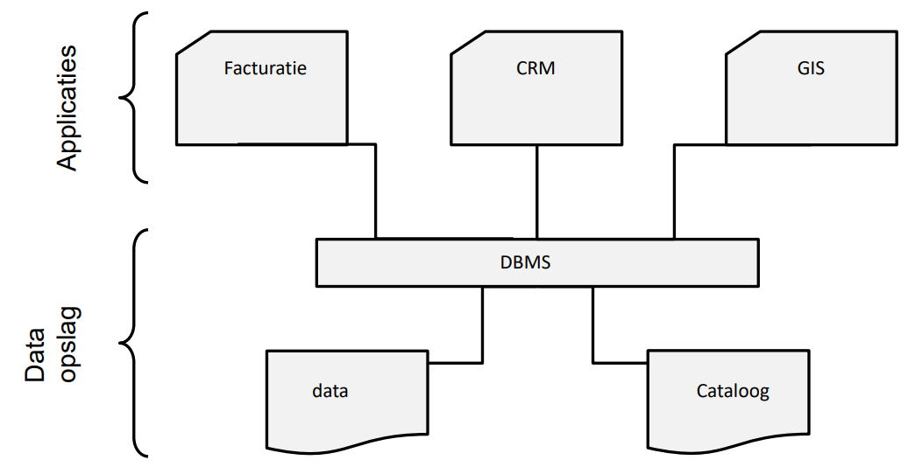
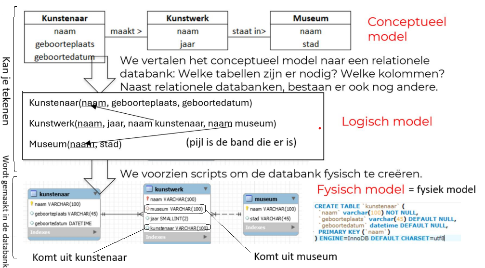
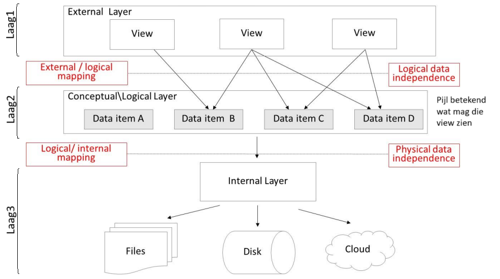
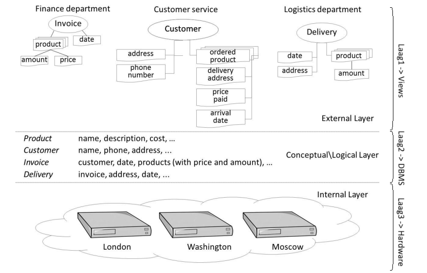

# Databanken gekaderd
## Wie gebruikt databank(technologie)?  (6)

- **Traditionele bedrijfsapplicaties** (loonberekening, tijdsregistratie, …)
- **Biometrische applicaties** (vingerafdrukken, resultaten scans)
- **Sensor-applicaties** (in kerncentrales, …)
- **GIS applicaties** (geografische informatie systemen (Google Maps, …)
- **Big Data applicaties* (Walmart, …)
- **‘Internet of Things (IoT)’ applicaties** (Telematics, …)

→ *opslag en terug ophalen van informatie (data)*

## Klassiek bestand <-> databank

### Gegevensmanagement via bestanden

Bestandsgebaseerde oplossing → *elke toepassing definieert zijn* **eigen** *bestanden*.
=> Er wordt dus gebruik gemaakt van *verschillende bestanden zonder relaties* tussen de bestanden.

#### Gegevensmanagement via bestanden
![[Pasted image 20241003072659.png]]

#### Nadelen gegevensmanagement via bestanden
1. *Verspreiding en isolatie van gegevens* (Moeilijk beheersbaar)
2. *Gegevensredundantie* (Dubbele opslag)
3. *Data afhankelijkheid*
4. *Incompatibiliteit* (niet kunnen samenwerken)
5. *Fixed query's* (moeilijk om data te vinden (query = vraag om data op te vragen))

### Oplossing: databank

#### Basisdefinities databank
Een *gedeelde* verzameling van **logisch** *met elkaar verbonden* gegevens en hun *beschrijving*, ontworpen om aan de *informatienoden* van een organisatie te voldoen. (T. Connolly).
- *digitaal opgeslagen*
- *specifiek bedrijfsproces*
- *specifieke groep* (gebruikers en applicaties)

verduidelijking (niet kennen):
*gedeelde*: op 1 vaste plaats
*logisch met elkaar verbonden*: moet logisch zijn
*beschrijving*: wat hou ik bij
*informatienoden*: wat wil je er mee doen (wat hebben we nodig)

#### Basisdefinities DBMS (database management system)
Dient om een databank te kunnen gebruiken.

* een verzameling computerprogramma’s (softwaremodules)
* *Nodig om* een databank te
	* *definiëren*
	* *creëren*
	* *wijzigen*
	* *beheren*
		* **back-up en recovery**
		* **beheerstools om de prestaties** van de data-bank **te monitoren en te optimaliseren**.
	* *gebruiken* (gegevens invoeren en ‘lezen’)

**Databanksysteem**: *databank* (data) *+ DBMS* (om met de data te werken)

#### Gegevensmanagement via DBMS

cataloog = metadata (data over data)

#### Basisdefinities: RDBMS

RDBMS = **DBMS voor relationele databanken**
- *Maakt gebruik van het relationeel gegevensmodel* (met tabellen, rijen, kolommen, …)
- Momenteel het *meest frequent gebruikt* in de bedrijfswereld
- *SQL* (beschrijvend en gebaseerd op resultset) (Structured Query Language)

Voorbeelden:

| Merknaam       | Omschrijving                                                                                                               |     |
| -------------- | -------------------------------------------------------------------------------------------------------------------------- | --- |
| **Oracle**     | Het grootste en eerste commerciële RDBMS. Wordt gebruikt in veel van 's werelds grootste bedrijven.                        |     |
| **SQL server** | RDBMS-product van Microsoft. Leverbaar in vele versies voor verschillende bedrijfsbehoeften.                               |     |
| **MySQL**      | Het populairste open source RDBMS. Sinds 2010 wordt het ontwikkeld, gedistribueerd en ondersteund door Oracle Corporation. |     |
| **PostgreSQL** | Ook een gratis, open source RDBMS. Sommigen zouden zeggen krachtiger dan MySQL                                             |     |
#### Basisdefinities: Toepassingsprogramma's

Toepassingssoftware zorgt voor de *verbinding met het DBMS*.
DBMS verzorgt de toegang tot de relevante databanken.

#### Basisdefinities: Databank gebruikers

1. **De data-administrators** (DA) zijn in een onderneming centraal verantwoordelijk zijn voor de data (waakt op de data zelf)
2. **Dbontwerper** vertaalt conceptueel model naar logisch en intern model
3. DBA (databankbeheerder of **database administrator**) implementeert en monitort DB (waakt op de werking)
4. **Applicatieontwikkelaar** schrijft databankprogramma’s/databankapplicaties
5. **Eindgebruikers** gebruikt databankapplicaties en voert op die manier databankacties uit
	- Sommige eindgebruikers zijn zich niet bewust van de databank
	- Sommige geavanceerde eindgebruikers kennen de structuur van de databank

#### Elementen van een databanksysteem.

- Databankmodel versus instances
- Cataloog
- Databankmodel
- 3-lagen architectuur

#### Databankmodel versus instances

- *Databankmodel = databankschema*
	- **bevat**
		- *beschrijving van de databankstructuur*
		- *specificaties v/d elementen*, hun eigenschappen, relaties, beperkingen, ...
	- **Opgesteld tijdens databankontwerp** – Wijzigt niet om de haverklap (door de database ontwerper)
	- **Opgeslagen in de cataloog** (is metadata)
	- **Toestand van een databank**
		- *Op dat ogenblik aanwezige data*
		- *Wijzigt voortduren*

Voorbeeld databankmodel:

Kunstenaar (naam, geboorteplaats, geboortedatum)
Kunstwerk (naam, museum, jaar)
Museum (naam, stad)

**Instances** = instanties (wat er in zit)

#### Datamodel (gegevensmodel)

- **Databankmodel**: *bestaat uit verschillende datamodellen*
- **Datamodel**: *weergave van de gegevens met hun kenmerken en hun relaties*
- In de cursus komen er **3 datamodellen** aan bod:
	- *Conceptueel datamodel*
	- *Logisch datamodel*
	- *Fysiek datamodel*

##### Conceptueel datamodel
- perfecte weergave van de gegevensvereisten van de ‘business’ requirements.
- algemene beschrijving gegevenselementen, kenmerken en relaties
	- *Gebruikt door ‘IT’ en ‘business’*
	- <ins>Weergave hoe ‘de business’ de gegevens ziet</ins>
	- Voorstelling: (E)ERD diagram (Entety Relation Diagram)

***!!Veronderstellingen en ontbrekende informatie duidelijk vermelden!!***

##### Logisch datamodel
- *vertaling conceptueel gegevensmodel naar het type databankmodel*
	- Relationeel, hiërarchisch, OO, XML, NoSQL
- nog altijd verstaanbaar voor niet IT-ers, maar *leunt al dichter aan bij hoe de data fysiek zal opgeslagen worden*

##### Fysiek datamodel
- *Geeft informatie over fysieke opslag*:
	- *waar* worden welke gegevens opgeslagen
	- *Wat is de grootte van de datavelden* (aantal characters, type variabele)
	- *Indexen* die het ophalen versnellen
- Zeer *DBMS afhankelijk*

(Mensen van de business komen hier niet mee in contact)

voorbeeld:

#### drielagen architectuur

- **Doel**: *verkrijgen van dataonafhankelijkheid*
	- Wijzigingen in de ene laag leiden tot minimale wijzigingen in de andere laag
1. **Externe laag** → externe datamodel, *bevat views*
	- Deelverzameling van het logisch model
	- Voor een specifieke doelgroep.
	- Wordt gebruikt om de toegang tot gegevens te controleren en beveiliging af te dwingen
2. **Middelste laag** → *conceptuele / logische laag*
3. **Interne laag** → interne datamodel, legt vast *hoe data fysisch georganiseerd en opgeslagen wordt*

### Nog enkele belangrijke begrippen (kennen)

- **Gegevensonafhankelijkheid**
- **Gestructureerde en ongestructureerde gegevens**
- **Redundante gegevens**
- **Integriteitsregels**
- **Cataloog**

#### Gegevensonafhankelijkheid:

-  = *wijzigingen aan de gegevensbeschrijving hebben weinig tot geen impact op de applicaties*
- **Fysieke gegevensonafhankelijkheid**: *wijzigingen van de opslagspecificaties hebben* **geen invloed op het logisch model** *noch op de applicatie* → wordt opgevangen door het DBMS
- **Logische gegevensonafhankelijkheid**: *minimale aanpassingen aan de applicaties bij wijzigingen aan het logisch model*

#### gestructureerde en ongestructureerde gegevens

- **Gestructureerde gegevens**
	- *Kunnen in een logisch datamodel voorgesteld worden*
	- *Integriteitsregels kunnen opgesteld en afgedwongen worden*
	- *Vereenvoudigen, opzoeken, verwerken en analyseren*
	- Voorbeelden: naam, geboortejaar, geboorteplaats van een kunstenaar
	
* **Ongestructureerde gegevens**
	* *kunnen niet op een zinvolle manier worden geïnterpreteerd door een applicatie*
	* Voorbeelden: gesprekken op social media, e-mails
	* *Let op*: er bestaat veel meer ongestructureerde data dan gestructureerde data

* **Semi-gestructureerde gegevens** 
	* *De structuur van de gegevens is zeer onregelmatig of zeer wisselend*.
	* Voorbeelden: webpagina's van individuele gebruikers op een social media platform, cv-documenten in een personeelsdatabank

#### Redundantegegevens

* Databank = centrale en unieke opslag gegevens
* Soms worden *databanken gedupliceerd uit veiligheidsoverwegingen of omwille van performantie*
	* →**redundantie**
* **DBMS** *is verantwoordelijk voor de synchronisatie* en garandeert de juistheid van de gegevens

#### Integriteitsregels

* Integriteitsregelsworden *gedefinieerd op basis van het conceptueel model en opgeslagen in de catalog*
	* Worden *afgedwongen door het DBMS*
* *Vastleggen hoe gegevens worden opgeslagen* (**syntactische regel**)
	* Bvb: customerIDis een geheel getal (100, 200, niet 2.A)
* *Vastleggen wanneer gegevens correct zijn* (**semantische regel**)
	* Bvb: Eenheidsprijs > 0; geboortedatum niet > vandaag
* Integriteitsregels worden gespecificeerd als *onderdeel van het conceptuele/logische datamodel*+ *centraal opgeslagen in de cataloog*

#### Cataloog

- Schatkist *van DBMS*
- *Definities en beschrijving van de elementen in de DB* (**= metadata**)
- *Definities logisch gegevensmodel* en *intern gegevensmodel*
- Zorgt voor *synchronisatie en consistentie van de gegevensmodellen*
- *Opslagplaats voor integriteitsregels*, en andere informatie zoals gebruikers, ...
