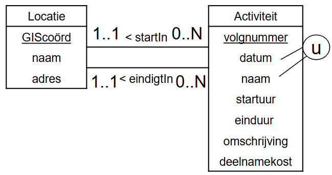
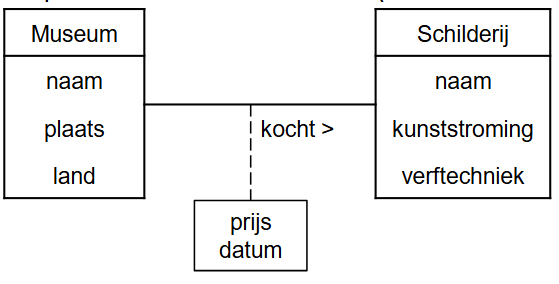

# Fases in Databank Ontwerp

Het *ontwerpen van een databank* vertrekt vanuit de bedrijfsprocessenen bestaat uit *4 fases*:
* **Fase1** = *Verzamelenenanalyserenvan de functionele/ inhoudelijkevereisten* (DBMS onafhankelijk)
* **Fase2** = *Conceptueelontwerp* -> **Conceptueel datamodel** (DBMS onafhankelijk)
* **Fase3** = *Logischontwerp* -> **Logisch datamodel** (DBMS specifiek)
* **Fase4** = *Fysiekontwerp* -> **Intern datamodel** (DBMS specifiek)

## **Fase 1** = Verzamelen en analyseren informatie

Doel: *de stappen en de benodigde data van het bedrijfsproces begrijpen*. **Wat nemen we op in de databank?**

- Dit kan via
	- *interviews* met de opdrachtgever
	- *analyse van bestaande formulieren en rapporten*
	
- **Vragen die moeten** beantwoord worden
	- *Welke data* moet in de databank worden opgenomen?
	- Wat is de *betekenis en context van alle data*, symbolen, gebruikte coderingen?
	- *Hoe zal de data worden verwerkt?*
	- Wat is de beoogde *functionaliteit*?
	- *Waarvoor zal de data gebruikt worden?*

## **Fase 2** = Conceptueel ontwerp

Het conceptueel model
- is de a*bstractie van de data en de onderlinge verbanden*
- moet *voldoende formeel* en *ondubbelzinnig* zijn voor de DBontwerper.
- moet *gebruiksvriendelijk* zijn
- doorgaans een *grafische representatie*
- *basis voor communicatie en discussie tussen de gebruiker van het bedrijfsproces en de databankontwerper*.
- gebeurt *onafhankelijk van enig databankmodel of applicatie*. Anders te vroeg gekoppeld aan een bepaald databankmodel of een bepaalde applicatie.

Wij kiezen hier het **Entity Relationship Diagram (ERD)** voor.

## **Fase 3** = Logisch ontwerp

*Type databank is bekend*(relationele databank, NoSQL databank, hiërarchische databank, ...)

Het *product zelf ligt nog niet vast*
- voor relationeledatabank: Microsoft SQL Server of MySQL of Oracle of DB2 of ...
- voor NoSQL document databank: MongoDB of CouchDB of ...
- voor hiërarschische databank: IMS of ...

!! Bij het opstellen van het conceptueel model en bij de overgang van het conceptueel model naar het logisch model is er *mogelijk verlies van specificaties*.**→** In een *apart document bijhouden om te gebruiken bij de applicatie-ontwikkeling*.

## **Fase 4** = Fysiek ontwerp

* Is de feitelijke *implementatie van het logisch model*.
* Je *kiest eerst een product*, ook *DBMS* genoemd (MySQL, Microsoft SQL Server, Oracle, ...).
* Je *implementeert het logisch model en zet dit om in datadefinitiecode(= DDL)*, die kan worden verwerkt door het DBMS.
* *Technische details worden toegevoegd* (datatypes van de attribuuttypes, ...)
* Indien mogelijk worden ook de *functionele beschrijvingen ‘vertaald’ naar databaseconcepten*. Zo kunnen de bedrijfsregels rond correct geboortejaar en jaar van overlijden omgezet worden naar een integriteitsrestrictie.
* *DBA kan ook aanbevelingen doen in verband met de performantie*.→zieRelational Databases and Datawarehousing(2TI)

# Conceptueelontwerp: **Entity Relationship Diagram** (ERD)

Een Entity Relationship Diagram *heeft de volgende bouwstenen*:
- **Entiteittypes**
- **Attribuuttypes**
- **Relatietypes**

## Entiteit type

Een *entiteittype–bestaat in de reële wereld*. –kan zowel *abstract* (een tentoonstelling, firma, cursus, job, ...) als *fysiek* (schilderij, persoon, auto, huis, ...) zijn.
-  is *ondubbelzinnig gedefinieerd* voor een bepaalde groep gebruikers.
- *karakteriseert een collectie van entiteiten* 
- *heeft een naam en inhoud en is identificeerbaar*.
	
Een *entiteit is een instantie van een entiteittype*.

In het conceptueel model *nemen we entiteittypes op* (geen individuele entiteiten).

Een entiteittype is *identificeerbaar en moet een inhoud hebben*.

Voor een onervaren databaseontwerper kan het onduidelijk zijn of een gegeven concept al dan niet als entiteittype moet worden gemodelleerd.

## Attribuuttype tov entiteittype

Een attribuuttype
- is een *karakteristiek van een entiteittype*
- *beschrijft het entiteittype*

*Elke entiteit heeft een specifieke waarde voor elke attribuuttype*.

bv: Elke schilder heeft een naam

## Relatietype

De **graad van een relatietype** = het *aantal verschillende entiteittypes die deelnemen aan het relatietype*
- **Unairerelatie** →*1 entiteittype*
- **Binaire relatie** →*2 entiteittypes*

Voorbeeld van een unaire of recursieve relatie:

Voorbeeld van een binaire relatie:

De **rollen van een relatietype** beschrijven *geeft de rol aan die een deelnemende entiteit van het entiteitstype speelt in de relatie*.

- In een **unaire of recursieve relatie**:
	- *één entiteitstype neemt meer dan één keer deel aan de relatie*
	- => de *rolnaam is essentieel voor het onderscheiden van de betekenis die elke deelnemende entiteit speelt*

- In een **binaire relatie**:
	- de *naam van elk deelnemend entiteitstype kan worden gebruikt als rolnaam*

### Cardinaliteiten

Elk relatietype kan worden gekarakteriseerd in termen van cardinaliteit **=** *het aantal entiteiten dat kan deelnemen aan de relatie*. 

*Elk relatietype heeft een minimum-en een maximumcardinaliteit*.

*Cardinaliteit betekent aantal* en wordt uitgedrukt als een *getal*.

De cardinaliteiten moeten afgetoetst worden met de opdrachtgever! Deze zijn vaak afhankelijk van de bedrijfsregels. *WIJ MODELLEREN ENKEL WAT WE WETEN*. **We veronderstellen niet!**

*!! Verkeerd gekozen cardinaliteiten kunnen ook voor minder kwalitatieve applicaties zorgen*

**Maximum cardinaliteit** = het *maximum aantal entiteiten van het entiteittype dat op een gegeven tijdstip kandeelnemen aan een relatie van het relatietype*. Mogelijke waarden zijn **1 of N**.
- **1**: *één entiteit kan in relatie staan met maximum 1 (andere) entiteit via dit relatietype*
- **N**: *één entiteit kan in relatie staan met N (andere) entiteiten via dit relatietype. N is een willekeurig geheel getal groter dan 1*.

**Minimum cardinaliteit** = het *minimum aantal entiteiten van het entiteittype dat op elk tijdstip moet voorkomen in een relatie van het relatietype*. Mogelijke waarden zijn **0** of **1**.
- **0**: *sommige entiteiten nemen niet deel aan de relatie. De relatie is optioneel voor dat entiteittype.*
- **1**: *een entiteit moet altijd in relatie staan met minimum één andere entiteit*.

## Relatie-attribuut

Ook relatietypes kunnen eigenschappen hebben: wanneer een kenmerk een eigenschap is van het relatietype en niet van één van de betrokken entiteittypes. We spreken van een relatie-attribuut.

## Attribuuttype

Het ER(EntiteitRelatie)-model kent een aantal *mogelijkheden om attribuuttypes verder te karakteriseren*:
- **Enkelvoudige versus samengestelde attribuuttypes**
- **Enkelwaardige versus meerwaardigeattribuuttypes**
- **Afgeleide attribuuttypes**
- **Kandidaatsleutelattribuuttype**

##### Enkelvoudige versus samengestelde attribuuttypes

**Samengesteld attribuuttype**: *het attribuuttype kan nog opgesplitst worden*. Bijvoorbeeld het attribuuttype ‘adres’ kan samengesteld zijn uit een ‘straat’, een ‘nummer’, een ‘postcode’ en een 'woonplaats'.*Wij werken in het conceptueel model steeds op het niveau van enkelvoudige attribuuttypes*

*Afhankelijk van de context* zullen attribuuttypes soms verder *opgesplitst* worden of niet. Bijvoorbeeld als het *niet belangrijk is* dat 'straat' of 'woonplaats' afzonderlijk moet gekend zijn, dan wordt 'adres' een **enkelvoudig attribuuttype**. In dat geval kan niet met de afzonderlijke delen (straat, stad, ...) gewerkt worden.

##### Enkelwaardige versus meerwaardige attribuuttypes

**Enkelwaardig attribuuttype**: *het attribuuttype heeft één waarde*. Bijvoorbeeld het attribuuttype ‘museum’ van ‘SCHILDERIJ’ en de attribuuttypes ‘geboortejaar’ en ‘jaar overlijden’ van ‘SCHILDER’. •

**Meerwaardigattribuuttype**: *het attribuuttype kan (meerdere) waarden bevatten*. Bijvoorbeeld een ‘SCHILDER' kan meerdere talen spreken of meerdere hobbyshebben. In dat geval zijn ‘talen’ en ‘hobby's’ meerwaardigeattribuuttypes.•In een ERD mogen beide voorkomen (zie later). ***Binnen Databases vermijden we meerwaardigeattributen in het ERD***

### Kandidaat sleutel attributen

*Één attribuut of meerdere attributen samen die de entiteiten van een entiteittype op een* **unieke, irreducibele manier identificeren**, *vormen een kandidaat sleutel van het entiteittype*. Irreducibiliteit wil zeggen dat er geen uniciteit mag gelden als men één of meerdere attributen weg laat.

De *attributen die deel uitmaken van een kandidaat sleutel noemt men de kandidaat sleutelattributen*.

*Er kunnen meerdere kandidaat sleutels zijn. Later wordt uit de kandidaat sleutels één sleutel gekozen als primaire sleutel*.

Alle *enkelvoudige kandidaat sleutels* (bestaat uit 1 attribuuttype) worden **onderlijnd**. Indien een kandidaatsleutel *uit meerdere attribuuttypes bestaat* (samengestelde kandidaat sleutel), duiden we dit dan aan met de **’u’-constraint**.

