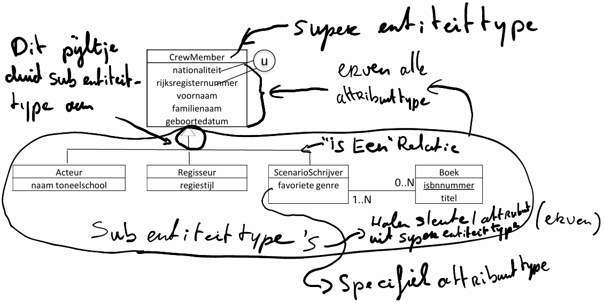
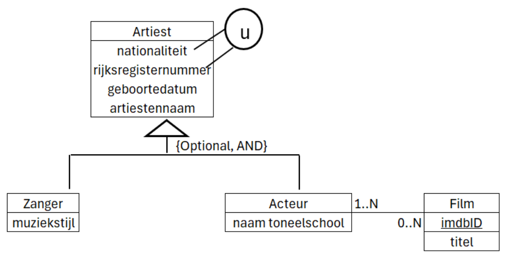
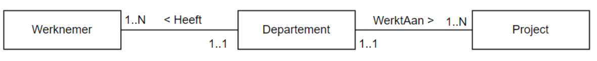
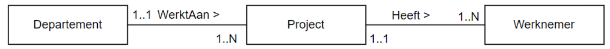
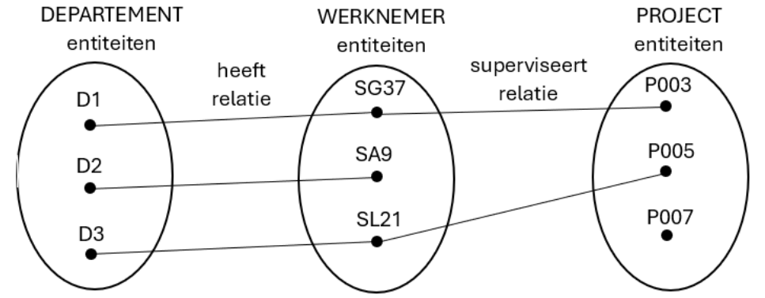
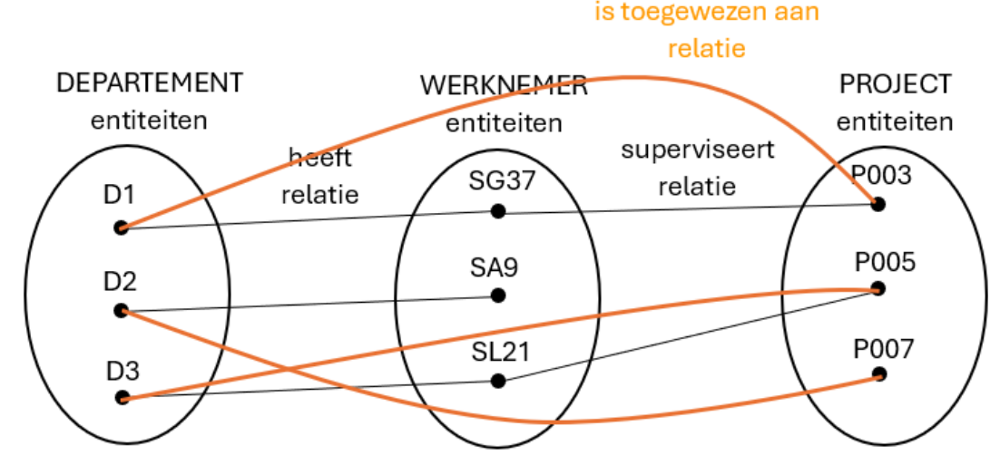
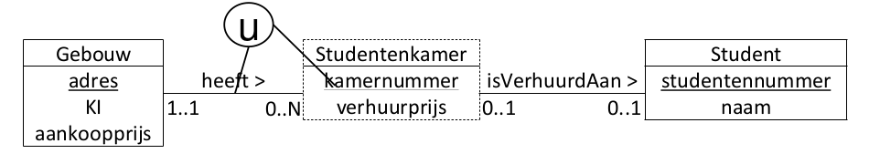
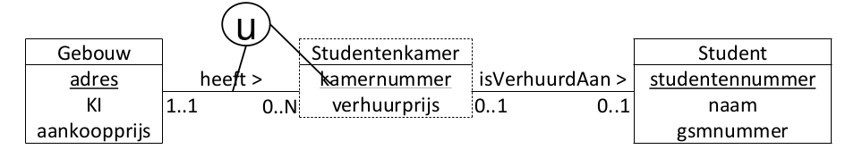
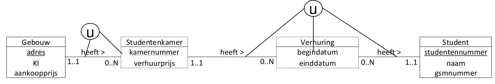
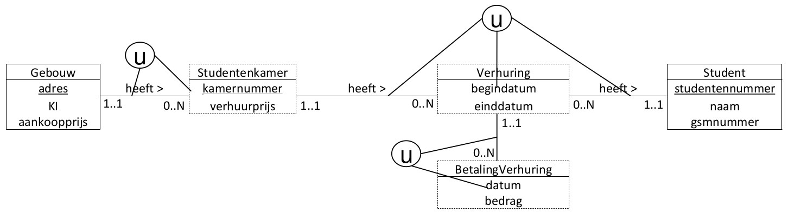

# Inleiding

Het Enhanced Entity Relationship Diagram of EERD is een **uitbreiding van het ERD**.
	- **alle concepten uit het ERD blijven behouden**, namelijk entiteittype, attribuuttype en relatietype.
	- een *nieuw modelleringsconcept wordt toegevoegd*:
		- **specialisatie/generalisatie**

# Specialisatie en generalisatie
## Specialisatie

- Om een *subcollectie van entiteiten te karakteriseren*, worden aparte entiteittypes aangemaakt: **sub(entiteit)types**.
- Het *oorspronkelijke entiteittype is het* **superentiteittype** *voor deze subentiteittypes*.
- Een **subentiteittype** *erft alle attribuuttypes en relatietypes van zijn* **superentiteittype**.
- Een **subentiteittype** *kan*:
	- *zelf specifieke attribuuttypes hebben. Deze gelden* **niet voor het superentiteittype**.
	- *aanleiding geven tot extra relatietypes met (andere)( sub) entiteittypes*. *Deze gelden* **niet voor het supereniteittype**.
- Een **subentiteittype** *heeft* **GEEN** *kandidaatsleutelattribuuttype*!
- **Specialisatie = het creëren van specifiekere subentiteittypes voor een gegeven entiteittype**. Een *specialisatie definieert* **een IS-EEN relatie**.
- Komt overeen met een *top-down proces van conceptuele verfijning*.

## Generalisatie

- Het *creëren van* **een algemeen supertype** *dat de gemeenschappelijke attribuuttypes en relatietypes van een aantal gegeven entiteittypes verenigt*. Dit is het omgekeerde proces van specialisatie.
- Komt overeen met een *bottom-up proces van conceptuele synthese*.

Bijvoorbeeld: 
- meerdere types muziekinstrumenten: PIANO, VIOOL en GITAAR.
- Met de generalisatiebenadering → superentiteittype STRIJKINSTRUMENT met de gemeenschappelijke kenmerken van de meerdere subtypen

# Participatie en Disjoint constraint
## Participatie constraint

- Specialisatie wordt gekenmerkt door een disjoint constraint en een participatie constraint.
- De participatierestrictie bepaalt of op elk tijdstip elke entiteit van het supertype ook entiteit moet zijn van ten minste één subtype of niet.

- **Totale participatie**:
	- *Elke entiteit van het supertype* **moet** *op elk tijdstip ook entiteit zijn van ten minste één subtype*. *Er bestaan geen entiteiten van het supertype die niet tot een subtype behoren*. => **Mandatory**

- **Partiële participatie**:
	- Er **kunnen** *entiteiten van het supertype zijn die niet tot één van de opgesomde subtypes behoren*. => **Optional**

## Disjoint constraint

- Specialisatie wordt gekenmerkt door een disjoint constraint en een participatie constraint.
- De Disjoint constraint specificeert tot welke subentiteittypes een entiteit van het superentiteittype kan behoren.. 
- Overlappende subtypes
	- Een entiteit *kan tot meer dan één subtype behoren*. -> **AND** 
- Disjuncte subtypes
	- Een exclusieve OR tussen de subtypes: een entititeit *kan maar tot 1 subtype behoren*. -> **OR**

# Beperkingen van het ERD

Beperkingen steeds documenteren

 ## 1. Tijdelijke beperkingen 
 - (**Dit zijn beperkingen die gelden in een bepaald tijdsinterval**) kunnen niet worden gemodelleerd.

- Bijvoorbeeld
	- een project moet binnen een maand toegewezen worden aan een specifiek departement 
	- een werknemer kan niet terugkeren naar een departement waarvan hij vroeger ooit de manager was
	
- Oplossing
	-  Deze beperkingen moeten worden gedocumenteerd en kunnen later worden

## 2. Het ERD kan geen consistentie garanderen tussen verschillende relatietypes

- Bijvoorbeeld
	- een werknemer moet werken in het departement waarvan hij de manager is
	- een werknemer kan enkel werken aan projecten die toegewezen zijn aan het departement waar hij werkt

- Oplossing
	- Deze beperkingen moeten worden gedocumenteerd en kunnen later worden geïmplementeerd (bijvoorbeeld door databanktriggers - zie Databanken 2)

## 3. In het ERD is het domein waartoe attributen behoren, niet bekend.

- **Men kan niet de mogelijke verzameling van waarden voor een attribuut vastleggen.**

- Bijvoorbeeld
	- het aantal uren dat aan een project gewerkt wordt, moet groter of gelijk zijn dan 0 

-  Oplossing
	- Deze beperkingen moeten worden gedocumenteerd en kunnen later worden geïmplementeerd (bijvoorbeeld door databankconstraints - zie Databanken 2)

## 4. In het ERD is het niet mogelijk de definitie van functies op te nemen.

- **We steken geen berekeningen in het ERD**

- Bijvoorbeeld
	- de manier waarop het salaris van een werknemer wordt berekend in functie van zijn startdatum

## 5. Fan trap

- Een fan trap = **treedt op wanneer één entiteittype, een 1..N relatie heeft met twee andere entiteittypes, waardoor er een schijnbare associatie bestaat tussen de twee andere entiteittypes, die echter niet uitgedrukt wordt door het model**.

### Voorbeeld

#### Probleem:
- Welke WERKNEMERs werken aan welk PROJECT?
	

- Enkele entiteiten

- Aan welk PROJECT werkt WERKNEMER SG37?

#### Oplossing:
- Juiste associaties tussen de entiteiten leggen

- Hier door volgorde te veranderen

- Aan welk PROJECT werkt WERKNEMER SG37?

## 6. Chasm Trap

- Een chasm trap = **wanneer een model het bestaan van een relatie tussen entiteitstypes suggereert, terwijl er geen relatie bestaat tussen bepaalde entiteittypes.**

- **Bijvoorbeeld:** *als een of meer relaties met een minimum-cardinaliteit 0 deel uitmaken van relatie*.

### Voorbeeld

#### Probleem:
- Aan welk DEPARTEMENT werden welke PROJECTen toegewezen?

- Aan welk DEPARTEMENT werd het PROJECT P007 toegewezen?

#### Oplossing:

- **Een extra relatie toevoegen**

- Aan welk DEPARTEMENT werd het PROJECT P007 toegewezen?

# Wanneer is het model correct

- **Als het alle vragen naar informatie van de gebruiker kan beantwoorden.**

## Voorbeeld:

### Probleem

- **Het model moet in staat zijn om volgende vragen te beantwoorden:**
	- Aan welke student (naam) is een bepaalde studentenkamer momenteel verhuurd?
		- Kan beantwoord worden: (naam uit Student)
	- Wat is de verhuurprijs van een bepaalde studentenkamer?
		- Kan beantwoord worden: (verhuurprijs uit Studentenkamer)
	- *Wat is het gsm-nummer van de student die kamer nummer 5 uit de Kerkstraat 12 in Gent huurt?*
		- **NEEN, DEZE KUNNEN WE NIET BEANTWOORDEN (Probleem 1: we hebben geen attribuut gsm nummer)**
	- *Aan welke student was een bepaalde studentenkamer vorig jaar verhuurd?*
		- **NEEN, DEZE KUNNEN WE NIET BEANTWOORDEN (Probleem 2: we hebben geen historiek)**
	- Heeft de huurder (de student) deze maand de huursom al betaald?
		-  **NEEN, DEZE KUNNEN WE NIET BEANTWOORDEN (Probleem 3: we missen hier een zwakke entiteit voor)**

### Oplossing

#### Probleem 1: we hebben geen attribuut gsm nummer

#### Probleem 2: we hebben geen historiek

#### Probleem 3: we missen hier een zwakke entiteit voor

