## Inleiding
- Er bestaan tools om EERD’s automatisch te vertalen naar relationeel model. Dit levert een relationeel model op dat automatisch genormaliseerd is.

- **Normalisatie is een proces voor het evalueren en corrigeren van de structuur van tabellen om** `redundantie` (onnodige herhaling van gegeven) **en** `anomalieën` (fouten en inconsistenties) **te elimineren.**

- Normalisatie **werkt in stappen**: `0NF` → `1NF` → `2NF` → `3NF` → `BCNF` → `4NF` → `5NF`.

- Voor de meeste doeleinden is **normalisatie tot en met 3NF voldoende**.
## Doel

Gegevens gezond maken.

- Vermindering van gegevensredundantie
- Vermijden van invoeg-, verwijder- en modificatie-anomalieën
- Verhoging van gegevensconsistentie
- Betere gegevensintegriteit
- Verbeterde onderhoudbaarheid en schaalbaarheid

### Vermindering van gegevensredundantie

- **Gegevensredundantie = dezelfde informatie meerdere keren op verschillende plaatsen opslaan**.

- Redundantie heeft volgende **nadelen**:
	- een **wijziging moet op verschillende plaatsen gebeuren** => er kan inconsistentie optreden
	- er is **meer plaats nodig voor het stockeren**

##### Voorbeeld

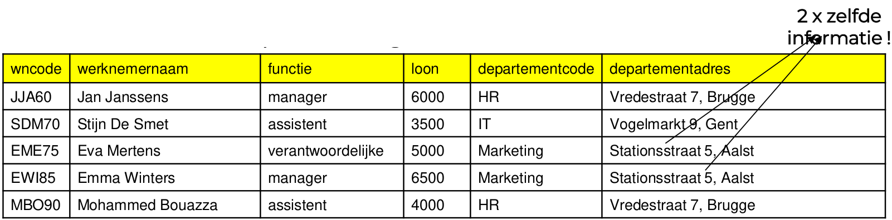

### Vermijden van invoeg-, verwijder- en modificatie-anomalieën

#### Vermijden van invoeganomalieën

**Het niet kunnen invoeren van gegeven omdat je andere ontbreekt.**
##### Voorbeeld

- Is het toevoegen van een departement zonder werknemers mogelijk?
- Invoeganomalie = Het is moeilijk om nieuwe gegevens toe te voegen zonder andere gegevens in te voeren die mogelijk nog niet beschikbaar of relevant zijn.

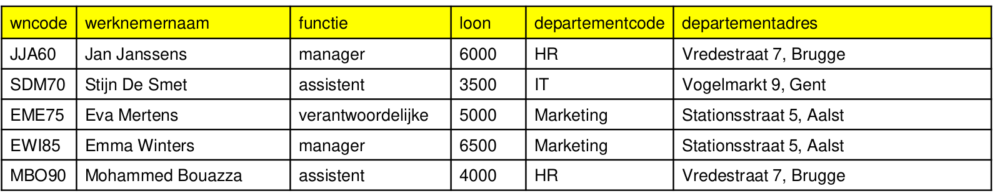

#### Vermijden van verwijderanomalieën

**Door iets te verwijderen verdwijnt er ook andere data.**

##### Voorbeeld

- Wat als we de laatste werknemer van een departement verwijderen?
- Verwijderanomalie = Het verwijderen van bepaalde gegevens kan ertoe leiden dat ook andere, nog steeds relevante gegevens onbedoeld worden verwijderd.

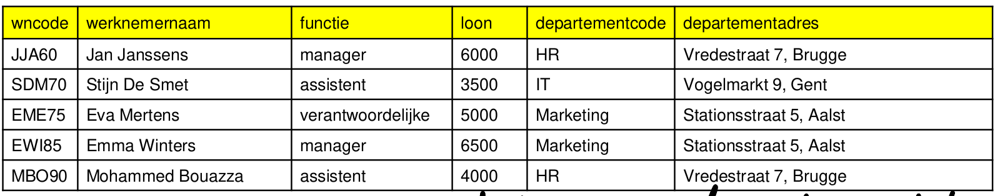

#### Oplossing anomalieën in voorbeeld

- De gegevensverzameling kan beter in 2 gesplitst worden.
	- Nieuw departement toevoegen zonder werknemers,
	- Werknemer verwijderen zonder departement te verwijderen.
	- Informatie van departement maar 1 keer wijzigen.

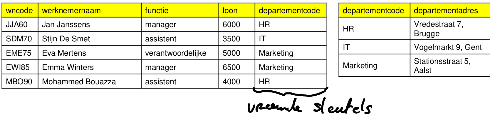
### Verhoging van gegevensconsistentie

- **inconsistentie: Verschillende gegevens die elkaar tegen spreken.**

- Inconsistentie ontstaat wanneer verschillende kopieën van dezelfdegegevens verschillende waarden bevatten.

- Door redundantie te verminderen, verkleint normalisatie de kans op tegenstrijdige gegevens.

### Betere gegevensintegriteit

- Gegevensintegriteit houdt in dat de gegevens in de databank juist, volledig en geldig zijn.

- Normalisatie helpt bij het implementeren van integriteitsregels door afhankelijkheden tussen gegevens te structureren.

### Verbeterde onderhoudbaarheid en schaalbaarheid

- Het bijwerken van een goed genormaliseerde databank is eenvoudiger en minder foutgevoelig, omdat de gegevens gestructureerd en logisch zijn opgeslagen
## Functionele afhankelijkheid
### Functionele afhankelijkheid (FA)

- B is functioneel afhankelijk van A (kan samengesteld zijn) **als er met een waarde van A ten hoogste één waarde van B overeenkomt**.

- = Als de waarde van A gekend is, dan is ook de waarde van B eenduidig gekend. (Als je A hebt kun je B vinden)

- Schrijfwijze: **A → B**

- We lezen: A bepaalt B
	**B is FA van A**

- Is vaak de sleutel

#### Voorbeeld

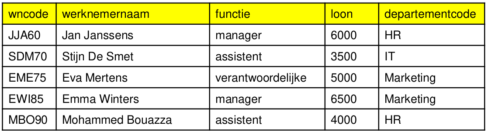

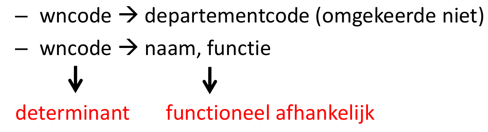

### Partiële functionele afhankelijkheid

- B is partieel functioneel afhankelijk van A **als B slechts functioneel afhankelijk is van een deel van A**.

- A → B en er is een A' ⊂ A, waarvoor geldt A' → B

- Enkel in tabellen met samengestelde primaire sleutel

#### Voorbeeld

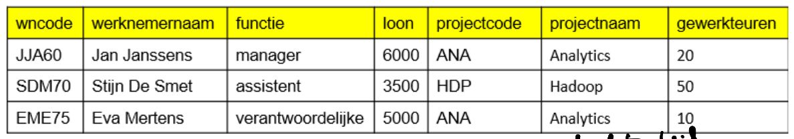

- wncode, projectcode → werknemernaam, gewerkteuren 

- werknemernaam is partieel afhankelijk van wncode, 
	projectcode want wncode → werknemernaam

- gewerkteuren is wel volledig FA van wncode, projectcode
	(determinant) want wncode, projectcode → gewerkteuren

### Transitieve functionele afhankelijkheid

- Een transitieve afhankelijkheid bestaat als:
	- Een niet-sleutelattribuut (bijv. attribuut C) functioneel afhankelijk is van een ander niet-sleutelattribuut (attribuut B).
	- Dat niet-sleutelattribuut (B) is weer functioneel afhankelijk van de primaire sleutel (attribuut A).
	
-  C is transitief afhankelijk van A als geldt:
	(A → B) en (B → C ) en niet (B → A)

#### Voorbeeld

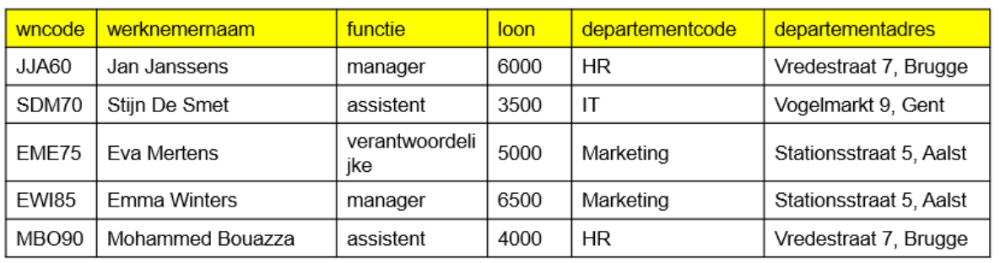

- wncode → departementcode
- departementcode → departementadres

Dus volgens de transitie is er een indirecte afhankelijkheid:

- wncode → departementadres
### Identificeren van functionele afhankelijkheid

- Vraag je van elke kolom af hoe dit gegeven bepaald wordt

#### Voorbeeld

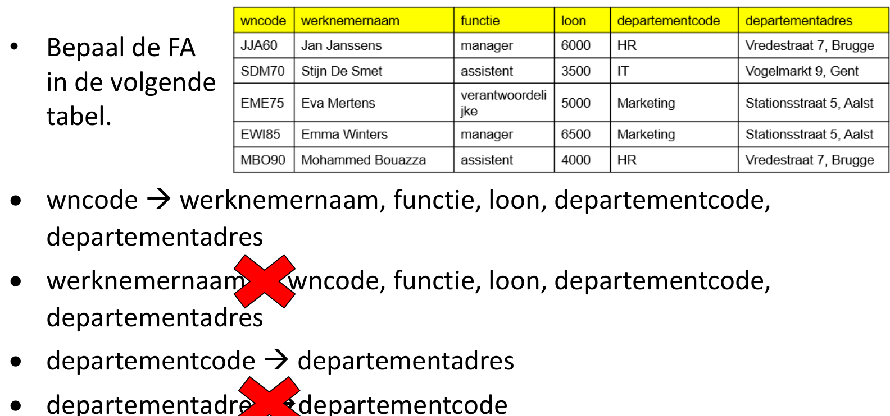
## Normalisatiestappen
### Inleiding

- Het proces bestaat uit een aantal stappen die steunen op functionele afhankelijkheid, waarbij we partiële en transitieve afhankelijkheden wegwerken.

- Het wordt toegepast op een verzameling met als doel elk attribuuttype te plaatsen in een nieuwe verzameling waar het volledig functioneel afhankelijk is van de gehele primaire sleutel.

#### Stappen

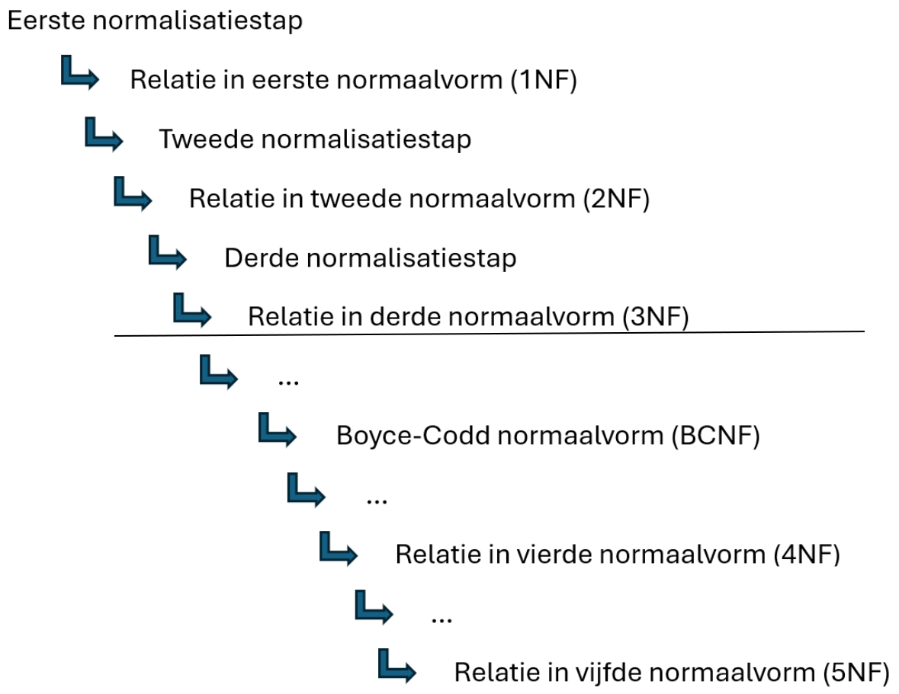
### Normalisatie stap 1: opstellen van R0 + FA

- Opstellen R0
	- Welke gegevens komen 1 keer voor?
	- Welke gegevens herhalen zich?
	- Wat zijn procesgegevens of niet-relevante gegevens?
	- Heeft het document een identificatie?
- Bepaal de functionele afhankelijkheden
### Normalisatie stap 2: opstellen van R1

- wegwerken procesgegevens (kan reeds in voorgaande stap gebeuren)
- opsplitsen samengestelde gegevens
- wegwerken herhalende groepen (HG)
	- Hoe?
		1. herhalende gegevens in nieuwe verzameling (tabel)
		2. sleutel oorspronkelijke verzameling mee overnemen
		3. bepalen sleutel nieuwe verzameling

### Normalisatie stap 3: opstellen van R2

- wegwerken partiële afhankelijkheden:
	- Hoe?
		1. zoek gegevens die partieel afhankelijk zijn
		2. verwijder deze uit oorspronkelijke tabel
		3. breng ze over naar nieuwe tabel met als sleutel de determinant waarvan ze FA zijn

### Normalisatie stap 4: opstellen van R3

- wegwerken transitieve afhankelijkheden:
	- Hoe?
		1. zoek gegevens die transitief afhankelijk zijn
		2. verwijder deze uit oorspronkelijke tabel
		3. breng deze over in een nieuwe tabel met als sleutel de determinant waarvan ze FA zijn

### Normalisatie stap 5: opstellen van RM

RM = Relationeel model

1. elke tabel een beduidende naam geven
2. integriteitregels toevoegen voor elke vreemde sleutel
3. integreren in overkoepelend relationeel model (RM)

### Normalisatie - Voorbeeld

- Een kleine kruidenier wil een databank laten ontwerpen om gegevens van klanten, producten en facturen bij te houden.
- Elk product heeft BTWCode 1, 2 of 3 naargelang het BTWPercentage.

 #### De kleine kruidenier toont ons een factuur.

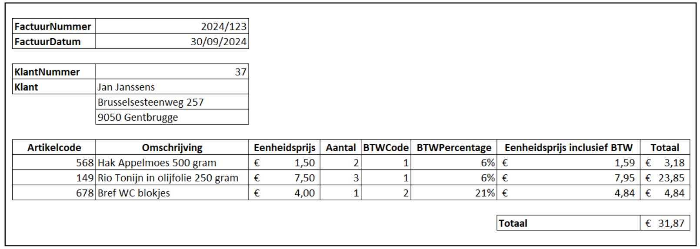

- En nog een …

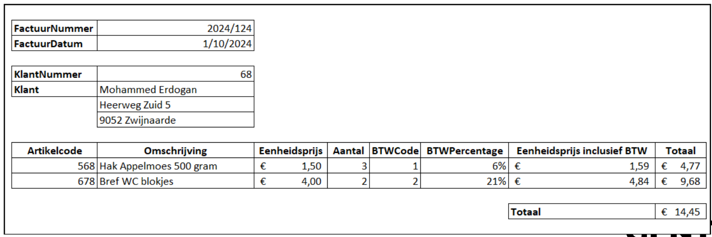

- En nog een ...

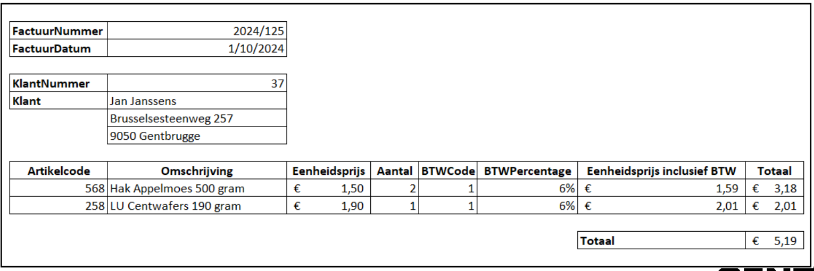

#### De kleine kruidenier had zelf al een eerste poging ondernomen om een databank te maken

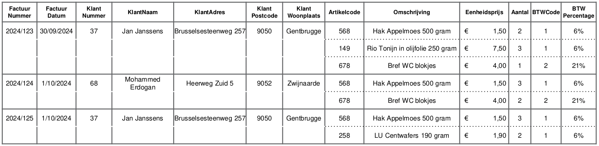

#### Stap 1: samenstellen R0 (niet-genormaliseerde verzameling) + opstellen FA

- Welke gegevens komen 1 keer voor?
- Welke gegevens herhalen zich?
- Wat zijn procesgegevens of niet-relevante gegevens?
- Heeft het document een identificatie?
- Bepaal de functionele afhankelijkheden

##### Uitvoering:

- Procesgegevens schrappen -> Nee
- Identificatie van het document? -> Factuurnummer
- Wat zijn de herhalende groepen? -> Artikel

##### Notatie R0

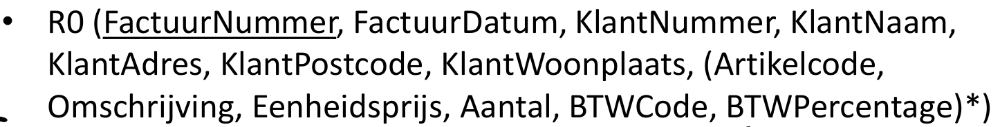
	*Herhalende gegevens tussen haakjes met \**

##### FA opstellen

- FactuurNummer → FactuurDatum, KlantNummer, KlantNaam, KlantAdres, KlantPostcode, KlantWoonplaats *(Trans)*
- KlantNummer → KlantNaam, KlantAdres, KlantPostcode, KlantWoonplaats
- KlantPostcode → KlantWoonplaats *(Trans)*
- Artikelcode → Omschrijving, Eenheidsprijs, BTWCode, BTWPercentage
- BTWCode → BTWPercentage *(Trans)*
- FactuurNummer, Artikelcode → Omschrijving, Eenheidsprijs, Aantal, BTWCode, BTW Percentage

#### Stap 2: opstellen R1 a.d.h.v. R0 (R in de 1e normaalvorm)

- wegwerken procesgegevens
- opsplitsen samengestelde gegevens
- wegwerken herhalende groepen (HG)
	- herhalende gegevens in nieuwe tabel
	- sleutel oorspronkelijke tabel overnemen
	- bepalen sleutel nieuwe tabel

##### Uitvoering:

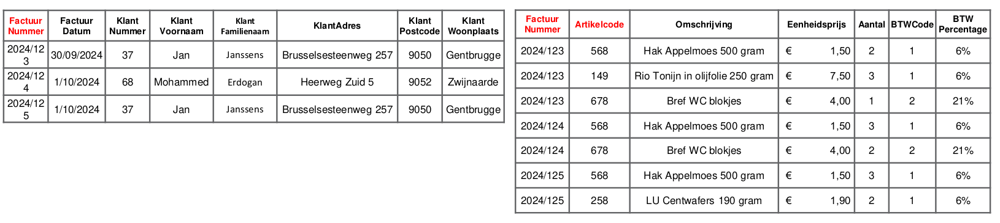

##### Notatie R1

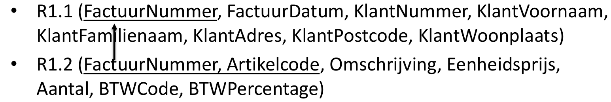

#### Stap 3: opstellen R2 a.d.h.v. R1 (R in de 2e normaalvorm)

- wegwerken partiële afhankelijkheden
	- Verwijder de partieel afhankelijke attribuuttypes uit de oorspronkelijke verzameling.
	- Vorm een nieuwe verzameling bestaande uit het afhankelijke sleuteldeel + de partieel afhankelijke attribuuttypes.

##### Uitvoering:

- Wegwerken partiële afhankelijkheden (enkel bij samengestelde sleutels!)

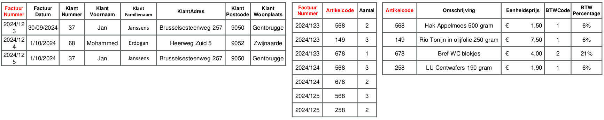

##### Notatie R2

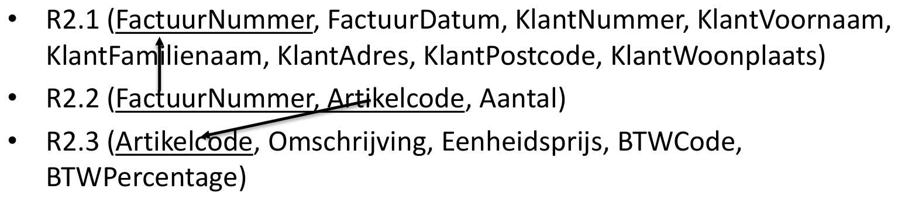

#### Stap 4: opstellen R3 a.d.h.v. R2 (R in de 3e normaalvorm)

- wegwerken transitieve afhankelijkheden
	- Verwijder de transitief afhankelijke attribuuttypes uit de oorspronkelijke verzameling.
	- Vorm een nieuwe verzameling bestaande uit de transitieve attribuuttypes en het attribuuttype waarvan ze afhankelijk zijn.

##### Uitvoering:

- Wegwerken transitieve afhankelijkheden

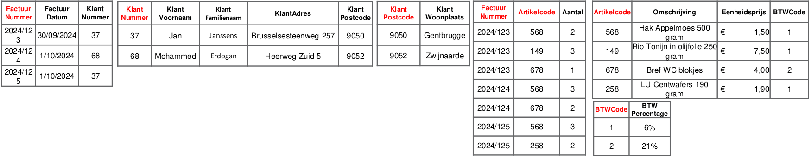

##### Notatie R3

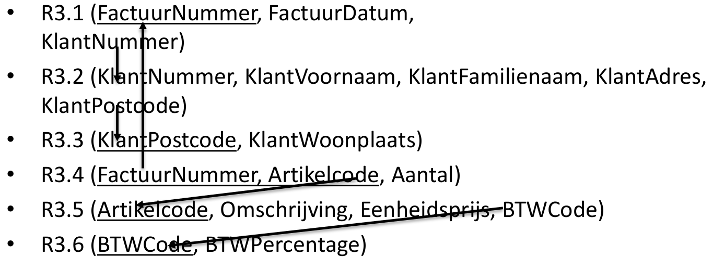

#### Stap 5: opstellen relationeel model (RM) a.d.h.v. R3

- Benoem de verzamelingen en bepaal de integriteitregels voor elke vreemde sleutel.

##### Uitvoering

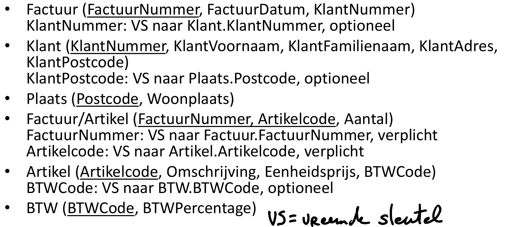

