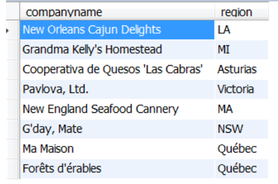
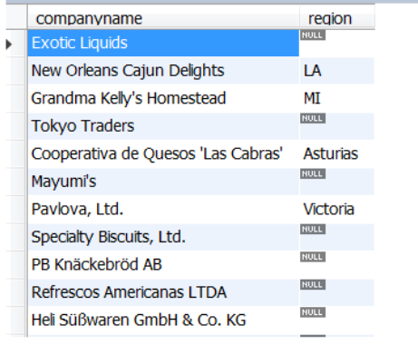

# Structured Query Language (SQL)
## SQL – standaarden en dialecten

-  Definitie:
	- relationele gegevenstaal voor relationele databanksystemen
	- niet-procedurele taal

- Standaard : ANSI/ISO-1992

 - Database systemen
	 - Oracle : PL/SQL
	 - SQL Server : TRANSACT-SQL
	 - Db2 (IBM)
	 - Informix
	 - Sybase
	 - MySQL

### Syntax

- Is niet case sensitive
- Moet niet op 1 lijn
```sql
SELECT ProductName,ProductId 
FROM products;
```

## SQL – overzicht
(zeker kennen)

- SQL bestaat uit **3 subtalen**
	- **Data Definition Language (DDL)**
		- *creatie van een database, en het definiëren van database-objecten* (tabellen, stored procedures, views,…)
		- `CREATE`, `ALTER`, `DROP`
	- **Data Manipulation Language (DML)**
		- *opvragen en manipuleren van de gegevens in een database*
		- `SELECT`, `INSERT`, `UPDATE`, `DELETE`
	- **Data Control Language (DCL)**
		- *gegevensbeveiliging en autorisatie*
		- `GRANT`, `REVOKE`, `DENY`
	
- Bijkomende taalelementen: operatoren, functies, control of flow (dialect gebonden)
## DML – raadplegen van gegevens

- Eén tabel raadplegen
	- Basisvorm
	- SELECT clausule
	- WHERE clausule
	- Formatteren van rijen
	- Statistische functies
	- Groeperen

- Meerdere tabellen raadplegen
# SELECT statement

- SELECT voor raadplegen van één tabel
## Basisvorm SELECT statement

```sql
SELECT * FROM Tabel;
```

```sql
SELECT Kolom FROM Tabel;
```
## SELECT statement

### Syntax 

```sql
SELECT [ALL | DISTINCT] {*|uitdrukking [,uitdrukking ...]}
FROM tabelnaam
[WHERE voorwaarde(n)]
[GROUP BY kolomnaam [,kolomnaam ...]
[HAVING voorwaarde(n)]
[ORDER BY {kolomnaam|volgnr}{ASC|DESC}[,...]
```

```sql
SELECT Kolom1,Kolom2,... FROM Tabel;
```

### Voorbeelden

Hier zijn een paar voorbeelden van SQL-query's, die de verschillende onderdelen van de `SELECT`-verklaring illustreren, inclusief korte uitleg per voorbeeld:

#### 1. Basisselectie van alle gegevens

```sql
SELECT * 
FROM Klanten;
```

**Uitleg**: Dit haalt **alle kolommen** op uit de **Klanten**-tabel zonder enige beperking.

---

#### 2. Selectie met DISTINCT

```sql
SELECT DISTINCT Stad
FROM Klanten;
```

**Uitleg**: Dit haalt de **unieke steden** op uit de **Klanten**-tabel, zodat duplicaten worden verwijderd.

---

#### 3. Selectie met uitdrukkingen en berekeningen

```sql
SELECT Naam, Leeftijd, Leeftijd * 12 AS LeeftijdInMaanden
FROM Klanten;
```

**Uitleg**: Dit haalt de **Naam** en **Leeftijd** op en berekent de **Leeftijd in maanden** voor elke klant.

---

#### 4. Selectie met WHERE voorwaarde

```sql
SELECT Naam, Stad
FROM Klanten
WHERE Leeftijd > 30;
```

**Uitleg**: Dit haalt de **Naam** en **Stad** op van klanten die **ouder dan 30 jaar** zijn.

---

#### 5. Selectie met GROUP BY en aggregatiefunctie

```sql
SELECT Stad, COUNT(*) AS AantalKlanten
FROM Klanten
GROUP BY Stad;
```

**Uitleg**: Dit telt het aantal klanten per **stad** en groepeert de resultaten per stad.

---

#### 6. Selectie met HAVING na GROUP BY

```sql
SELECT Stad, COUNT(*) AS AantalKlanten
FROM Klanten
GROUP BY Stad
HAVING COUNT(*) > 5;
```

**Uitleg**: Dit telt het aantal klanten per **stad**, groepeert per stad, en toont alleen steden met **meer dan 5 klanten**.

---

#### 7. Selectie met ORDER BY

```sql
SELECT Naam, Leeftijd
FROM Klanten
ORDER BY Leeftijd DESC;
```

**Uitleg**: Dit haalt de **Naam** en **Leeftijd** op van alle klanten en sorteert de resultaten op **Leeftijd in aflopende volgorde**.

---

#### 8. Selectie met meerdere kolommen en ORDER BY

```sql
SELECT Naam, Stad, Leeftijd
FROM Klanten
ORDER BY Stad ASC, Leeftijd DESC;
```

**Uitleg**: Dit haalt de **Naam**, **Stad**, en **Leeftijd** op van klanten en sorteert eerst op **Stad (oplopend)** en daarna op **Leeftijd (aflopend)**.

---

#### 9. Complexe selectie met WHERE, GROUP BY, en HAVING

```sql
SELECT Stad, AVG(Leeftijd) AS GemiddeldeLeeftijd
FROM Klanten
WHERE Leeftijd > 18
GROUP BY Stad
HAVING AVG(Leeftijd) < 40;
```

**Uitleg**: Dit haalt de **gemiddelde leeftijd** per **stad** op, maar alleen voor klanten **ouder dan 18 jaar**, en toont alleen de steden waar de gemiddelde leeftijd **lager dan 40 jaar** is.

---

#### 10. Selectie met een combinatie van WHERE en ORDER BY

```sql
SELECT Naam, Leeftijd
FROM Klanten
WHERE Leeftijd BETWEEN 25 AND 40
ORDER BY Leeftijd ASC;
```

**Uitleg**: Dit haalt de **Naam** en **Leeftijd** op van klanten die tussen **25 en 40 jaar oud** zijn en sorteert op **Leeftijd in oplopende volgorde**.

---

#### 11. Selectie met alle onderdelen (SELECT, WHERE, GROUP BY, HAVING, ORDER BY)

```sql
SELECT Stad, COUNT(*) AS AantalKlanten, AVG(Leeftijd) AS GemiddeldeLeeftijd
FROM Klanten
WHERE Leeftijd > 20
GROUP BY Stad
HAVING COUNT(*) > 3
ORDER BY GemiddeldeLeeftijd DESC;
```

**Uitleg**: Dit telt het aantal klanten per **stad**, berekent de **gemiddelde leeftijd** van klanten ouder dan **20 jaar**, groepeert per stad, toont alleen steden met **meer dan 3 klanten**, en sorteert op **gemiddelde leeftijd in aflopende volgorde**.

Deze voorbeelden dekken verschillende onderdelen van de SQL-syntax, van simpele selecties tot complexere queries met aggregatie en sortering.


## SELECT … WHERE
- **specificatie van de voorwaarden waaraan de getoonde rijen moeten voldoen**

- *Gebruik van literals:*
	 - **Numerische waarden**: `... WHERE categoryID = 1`
	 - **Alfanumerische waarden**: `... WHERE productName = ‘Chai’`
	 - **Datums**: `... WHERE orderDate = ‘1996-07-04 00:00:00’`
	 
- *Voorwaarden aan rijen opleggen*
	- **Vergelijkingsoperatoren**
	- **Wildcards**
	- **Logische operatoren**
	- **Een interval van specifieke waarden**
	- **Een lijst van waarden**
	- **Onbekende waarden**
	- Je kan **haakjes** gebruiken om de prioriteitsregels te doorbreken of het geheel leesbaarder te maken

### Vergelijkingsoperatoren
`=`, `>`, `>=`, `<`, `<=`, `<>`

```sql
select productid, productname, unitsinstock
from products
where unitsinstock < 5
```

```sql
select productid, productname
from products
where productname >= 'A' and productname < 'B'
```
### Wildcards (zoeken naar patronen)
- De operator `LIKE`, `NOT LIKE`
- In combinatie met wildcards:
	- `%` (willekeurige tekenrij met 0 of meerdere tekens)
	- `_` (1 teken)

```sql
SELECT productid, productname
FROM products
WHERE productname LIKE '%anton%'
```

### Logische operatoren
- `OR`, `AND`, `NOT` (volgens stijgende prioriteit)

```sql
SELECT productid, productname, supplierid, unitprice
FROM products
WHERE (productname LIKE ’T%’ OR productid = 46) AND unitprice > 16.00
```

```sql
SELECT productid, productname, unitprice
FROM products
WHERE (productname LIKE ’T%’) OR (productid = 46 AND unitprice > 16.00)
```

### Waarden in een interval
- `BETWEEN`, `NOT BETWEEN`

```sql
SELECT productid, unitprice
FROM products
WHERE unitprice BETWEEN 10 AND 15
```

### Lijst van waarden
- `IN`, `NOT IN`

```sql
SELECT productid, productname, supplierid
FROM products
WHERE supplierid in (1,3,5)
```

### Testen op onbekende waarden (niet-ingevulde waarden)
- `IS NULL`, `IS NOT NULL`
- NULL waarden komen voor bij niet-ingevulde kolommen (zonder defaultwaarde).
- NULL is niet gelijk aan 0 of een blanco string!
- NULL velden worden onderling als gelijk beschouwd (voor testen met DISTINCT) 
- Als in een rekenkundige uitdrukking een NULL-veld wordt verwerkt is het resultaat ook NULL

```sql
SELECT companyname, region
FROM suppliers
WHERE region IS NULL
```

#### **Let op met NULL!**

- expliciet benoemen om velden te krijgen

```sql
SELECT companyname, region
FROM suppliers
WHERE region <> ‘OR’
```




```sql
SELECT companyname, region
FROM suppliers
WHERE region <> ‘OR’
OR region IS NULL
```



## SELECT - formatteren resultaten

- Sorteren data
	- Order by

- Eliminatie van duplicaten
	- DISTINCT/ALL

- Wijzigen van kolomnaam
	- gebruik van aliassen

- Berekende resultaatkolommen
	- Via wiskundige operatoren : +, -, /, *
	- Via functies

- Commentaar
	- `/* commentaar */`
	- `-- commentaar` (beperkt zich tot 1 lijn)
## SELECT - ORDER BY

- `ORDER BY` clausule om te **sorteren**
	- Kan meerdere sorteervelden bevatten
	- Een sorteerveld is een kolomnaam of een volgnummer dat overeenkomt met de volgorde van het gegeven achter de SELECT.
	- Bij meerdere sorteervelden gebeurt het sorteren van links naar rechts.
	- Standaard gebeurt het sorteren in stijgende volgorde (`ASC`).
	  Een dalende volgorde moet expliciet vermeld worden (`DESC`).

```sql
SELECT productname
FROM products
ORDER BY productname  -- of ORDER BY 1
```

```sql
SELECT productid, productname, categoryid, unitprice
FROM products
ORDER BY categoryid, unitprice DESC
```
## SELECT - DISTINCT/ALL

- Uniciteit van de rijen
	- `DISTINCT` produceert een lijst waarin alle rijen uniek zijn, **identieke rijen worden uit het resultaat verwijderd**.
	- `ALL` (default) toont alle rijen, ook dubbels.

```sql
SELECT DISTINCT supplierid
FROM productsFROM products
ORDER BY supplieridORDER BY supplierid
```
## SELECT en gebruik van aliassen

- **Benoemen van kolommen**
	- Standaard : kolomtitel = naam van kolom in tabel; berekende kolommen krijgen geen kolomnaam.
	- Een kolom een andere titel geven:
		- Via `AS` keyword
			- Met een string na de kolomnaam
			- kan ook zonder `AS` keyword (zie voorbeeld)
			- Opmerking: Die nieuwe kolomnaam kan je ook gebruiken in ORDER BY (maar niet in WHERE, HAVING, GROUP BY)

```sql
SELECT productid AS ProductNummer,
productname AS ‘Naam Product’
FROM products
```

```sql
SELECT productid ProductNummer,
productname ‘Naam Product’
FROM products
```
## SELECT met berekende resultaten

- **Via wiskundige operatoren** : `+`, `-`, `/`, `*`

```sql
SELECT ProductName, Unitprice * UnitsInStock AS InventoryValue
FROM Products
```
## SELECT en gebruik van functies

- **Mogelijke functies**:
	- **String** functies: `concat`, `left`, `right`, `length`, `substring`, `replace`, `...`
	- **DateTime** functies: `dateAdd`, `dateDiff`, `day`, `month`, `year`, `...`
		- `NOW()`: **retourneert huidige datum en tijd in DATETIME** 
			formaat: *JJJJ-MM-DD UU:MM:SS*.
		-  `CURDATE()` → **huidige datum** in *JJJJ-MM-DD*
	- **Rekenkundige** functies: `round`, `floor`, `ceil`, `cos`, `sin`, `...`
	- **Aggregate** functies: `AVG`, `SUM`, `MIN`, `MAX`, `...`
	- `IFNULL(kolom, x)` : **vervangt gevonden NULL-waardes door x**.

```sql
-- Voorbeeld IFNULL()
SELECT OrderID, CustomerID, IFNULL(ShipPostalCode,'Niet ingevuld') as PostCode FROM orders;
```

### Tabel met voorbeelden

| **Categorie**       | **Functie**           | **Uitleg**                                                                                  | **Voorbeeld**                                                                                                                                               | **Resultaat**               |
|----------------------|-----------------------|--------------------------------------------------------------------------------------------|-------------------------------------------------------------------------------------------------------------------------------------------------------------|-----------------------------|
| **String**          | `CONCAT`             | Combineert meerdere strings of kolommen.                                                  | `SELECT CONCAT('Product: ', productname) AS Info FROM Products;`                                                                                            | Product: Apple             |
|                     | `LEFT`               | Haalt een bepaald aantal tekens vanaf links op.                                           | `SELECT LEFT(productname, 3) AS KortNaam FROM Products;`                                                                                                    | App                        |
|                     | `REPLACE`            | Vervangt tekst in een string.                                                             | `SELECT REPLACE(productname, 'e', '3') AS NieuweNaam FROM Products;`                                                                                         | Appl3                      |
|                     | `LENGTH`             | Geeft de lengte van een string terug.                                                     | `SELECT LENGTH(productname) AS Lengte FROM Products;`                                                                                                       | 5                          |
|                     | `SUBSTRING`          | Haalt een deel van een string op vanaf een specifieke positie.                            | `SELECT SUBSTRING(productname, 2, 3) AS DeelNaam FROM Products;`                                                                                            | ppl                        |
| **DateTime**        | `NOW()`              | Retourneert huidige datum en tijd in formaat *JJJJ-MM-DD UU:MM:SS*.                       | `SELECT NOW() AS HuidigeDatum;`                                                                                                                             | 2025-01-02 10:15:45        |
|                     | `CURDATE()`          | Geeft de huidige datum in formaat *JJJJ-MM-DD*.                                           | `SELECT CURDATE() AS HuidigeDatum;`                                                                                                                         | 2025-01-02                 |
|                     | `YEAR`               | Haalt het jaar uit een datum.                                                             | `SELECT YEAR(orderdate) AS Jaar FROM Orders;`                                                                                                               | 2023                       |
|                     | `DATEDIFF`           | Berekent het verschil tussen twee datums in dagen.                                        | `SELECT DATEDIFF('2025-01-02', '2024-12-31') AS Verschil;`                                                                                                  | 2                          |
| **Rekenkundige**    | `ROUND`              | Rondt een getal af tot een specifiek aantal decimalen.                                    | `SELECT ROUND(unitprice, 2) AS Afgerond FROM Products;`                                                                                                     | 19.99                      |
|                     | `FLOOR`              | Geeft het grootste gehele getal kleiner dan of gelijk aan het getal.                      | `SELECT FLOOR(19.99) AS FloorValue;`                                                                                                                        | 19                         |
|                     | `COS`                | Berekent de cosinus van een hoek (in radialen).                                           | `SELECT COS(0) AS Cosinus;`                                                                                                                                 | 1                          |
| **Aggregate**       | `AVG`                | Berekent het gemiddelde van een kolom.                                                    | `SELECT AVG(unitprice) AS GemiddeldePrijs FROM Products;`                                                                                                   | 15.67                      |
|                     | `SUM`                | Berekent de som van een kolom.                                                            | `SELECT SUM(unitprice) AS TotalePrijs FROM Products;`                                                                                                       | 156.75                     |
|                     | `MAX`                | Geeft de hoogste waarde in een kolom terug.                                               | `SELECT MAX(unitprice) AS HoogstePrijs FROM Products;`                                                                                                      | 45.99                      |
|                     | `MIN`                | Geeft de laagste waarde in een kolom terug.                                               | `SELECT MIN(unitprice) AS LaagstePrijs FROM Products;`                                                                                                      | 3.50                       |
| **Special**         | `IFNULL`             | Vervangt NULL-waarden door een opgegeven waarde.                                          | `SELECT IFNULL(discount, 0) AS Korting FROM Orders;`                                                                                                        | 0 (als de waarde NULL is)  |

## SELECT en data conversie

### Impliciet, voor sommige omzettingen

```sql
UnitPrice * 0,5 --→ UnitPrice (money) wordt automatisch naar decimal geconverteerd
```

### Expliciet met:

- `CAST (<value expression> AS <data type>)`

```sql
PRINT CAST(-25.25 AS INTEGER) --→ -25
SELECT CAST(38,8 AS CHAR) --→ ‘38,8’
```

- `CONVERT (<expression>, type)`

```sql
CONVERT( curdate(), char) --→ ‘2016-11-24’
```
## SELECT en strings

### Stringoperator: concatenatie

- Concatenatie betekent dat je meerdere strings of waarden aan elkaar plakt om een nieuwe string te maken. In SQL kun je dit doen met functies zoals `CONCAT`.
- Dit is handig voor rapportages of als je meerdere kolommen wilt combineren in één resultaat.

```sql
SELECT CONCAT(productid, ‘ , ’, productname )
AS Product
FROM Products
```

- **`CONCAT`-functie**: Dit plakt de waarden van de kolommen `productid` en `productname` samen met een string `,` ertussen.
- **Alias (`AS Product`)**: De gecombineerde string wordt weergegeven met de naam `Product`.
- **Resultaat**: Je krijgt bijvoorbeeld:  
    `1 , Apple`,  
    `2 , Banana`.
### Gebruik maken van tekst (literals)

- In SQL kun je tekst (literals) toevoegen aan je query om extra informatie of symbolen in je resultaat te verwerken. Tekst wordt altijd tussen enkele aanhalingstekens (`'`) gezet.
- Literals zijn nuttig voor:
	- Het tonen van valuta (`'€'`, `'$'`).
	- Het toevoegen van uitleg of context aan data.
	- Het combineren van tekst met databasewaarden.

```sql
SELECT ProductName, ‘$’, Unitprice
FROM Products
```

- **`'$'`**: Dit is een literal (vaste tekst) die dollar-symbolen toevoegt aan de output.
- **Kolomnamen**: `ProductName` en `Unitprice` worden weergegeven samen met de tekst.
- **Resultaat**: Je krijgt bijvoorbeeld:  
    `Apple | $ | 1.99`.

**Andere voorbeelden:**

- Prijs met label:
```sql
SELECT ProductName, CONCAT('Price: ', '$', Unitprice) AS PriceLabel
FROM Products;
```
- Geeft bijvoorbeeld: `Apple | Price: $1.99`.
    
- Aanhalingstekens in tekst:
```sql
SELECT CONCAT(ProductName, ' is on "sale"!') AS SaleInfo
FROM Products;
```
- Geeft bijvoorbeeld: `Apple is on "sale"!`.

## SELECT en de CASE functie

De `CASE`-functie in SQL wordt gebruikt om condities te evalueren en verschillende resultaten te retourneren op basis van die condities. Het werkt als een soort **"if-else"-structuur**, waarmee je kolommen of berekende waarden dynamisch kunt aanpassen afhankelijk van de data.
### Algemene structuur van CASE:

```sql
CASE
    WHEN conditie1 THEN resultaat1
    WHEN conditie2 THEN resultaat2
    ...
    ELSE resultaatN
END
```

- **`WHEN conditie THEN resultaat`**: Specificeert een voorwaarde en het bijbehorende resultaat.
- **`ELSE`**: Geeft een standaardwaarde terug als geen enkele conditie waar is (optioneel).
- **`END`**: Sluit de CASE-functie af.

### Toepassing:

- **Gebruik**: De `CASE`-functie is nuttig voor het categoriseren of groeperen van gegevens, het toekennen van labels aan waarden, of het verwerken van NULL-waarden.
- **Uitbreidbaarheid**: Je kunt meerdere `WHEN`-condities toevoegen of aanpassen voor meer controle.
### Voorbeeld:

```sql
SELECT OrderID, Freight,
CASE
    WHEN Freight IS NULL THEN 'Kost onbekend'
    WHEN Freight = 0 THEN 'Gratis verscheping'
    WHEN Freight < 20 THEN 'Lage verschepingskost'
    WHEN Freight < 100 THEN 'Gemiddelde verschepingskost'
    ELSE 'Hoge verschepingskost'
END AS 'Verschepingskost'
FROM Orders;
```

1. **Kolommen in SELECT**:
    - `OrderID`: Identificeert de bestelling.
    - `Freight`: Geeft de verschepingskosten weer.
2. **CASE-logica**:
    - **`WHEN Freight IS NULL THEN 'Kost onbekend'`**: Als de verschepingskosten niet beschikbaar (NULL) zijn, geef "Kost onbekend" terug.
    - **`WHEN Freight = 0 THEN 'Gratis verscheping'`**: Als de verschepingskosten 0 zijn, geef "Gratis verscheping" terug.
    - **`WHEN Freight < 20 THEN 'Lage verschepingskost'`**: Als de kosten onder 20 liggen, geef "Lage verschepingskost" terug.
    - **`WHEN Freight < 100 THEN 'Gemiddelde verschepingskost'`**: Als de kosten onder 100 liggen, geef "Gemiddelde verschepingskost" terug.
    - **`ELSE 'Hoge verschepingskost'`**: Voor alle andere gevallen geef "Hoge verschepingskost" terug.
3. **Alias**:
    - Het resultaat van de CASE wordt weergegeven als een nieuwe kolom genaamd `Verschepingskost`.

**Voorbeeldoutput:**

|OrderID|Freight|Verschepingskost|
|---|---|---|
|1001|NULL|Kost onbekend|
|1002|0|Gratis verscheping|
|1003|15|Lage verschepingskost|
|1004|50|Gemiddelde verschepingskost|
|1005|120|Hoge verschepingskost|
