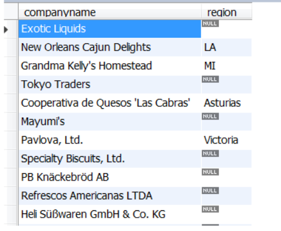

# Structured Query Language (SQL)
## SQL – standaarden en dialecten

-  Definitie:
	- relationele gegevenstaal voor relationele databanksystemen
	- niet-procedurele taal

- Standaard : ANSI/ISO-1992

 - Database systemen
	 - Oracle : PL/SQL
	 - SQL Server : TRANSACT-SQL
	 - Db2 (IBM)
	 - Informix
	 - Sybase
	 - MySQL

### Syntax

- Is niet case sensitive
- Moet niet op 1 lijn
```sql
SELECT ProductName,ProductId 
FROM products;
```

## SQL – overzicht
(zeker kennen)

- SQL bestaat uit **3 subtalen**
	- **Data Definition Language (DDL)**
		- *creatie van een database, en het definiëren van database-objecten* (tabellen, stored procedures, views,…)
		- `CREATE`, `ALTER`, `DROP`
	- **Data Manipulation Language (DML)**
		- *opvragen en manipuleren van de gegevens in een database*
		- `SELECT`, `INSERT`, `UPDATE`, `DELETE`
	- **Data Control Language (DCL)**
		- *gegevensbeveiliging en autorisatie*
		- `GRANT`, `REVOKE`, `DENY`
	
- Bijkomende taalelementen: operatoren, functies, control of flow (dialect gebonden)
## DML – raadplegen van gegevens

- Eén tabel raadplegen
	- Basisvorm
	- SELECT clausule
	- WHERE clausule
	- Formatteren van rijen
	- Statistische functies
	- Groeperen

- Meerdere tabellen raadplegen
# SELECT statement

- SELECT voor raadplegen van één tabel
## Basisvorm SELECT statement

```sql
SELECT * FROM Tabel;
```

```sql
SELECT Kolom FROM Tabel;
```
## SELECT statement

### Syntax 

```sql
SELECT [ALL | DISTINCT] {*|uitdrukking [,uitdrukking ...]}
FROM tabelnaam
[WHERE voorwaarde(n)]
[GROUP BY kolomnaam [,kolomnaam ...]
[HAVING voorwaarde(n)]
[ORDER BY {kolomnaam|volgnr}{ASC|DESC}[,...]
```

```sql
SELECT Kolom1,Kolom2,... FROM Tabel;
```

### Voorbeelden

Hier zijn een paar voorbeelden van SQL-query's, die de verschillende onderdelen van de `SELECT`-verklaring illustreren, inclusief korte uitleg per voorbeeld:

#### 1. Basisselectie van alle gegevens

```sql
SELECT * 
FROM Klanten;
```

**Uitleg**: Dit haalt **alle kolommen** op uit de **Klanten**-tabel zonder enige beperking.

---

#### 2. Selectie met DISTINCT

```sql
SELECT DISTINCT Stad
FROM Klanten;
```

**Uitleg**: Dit haalt de **unieke steden** op uit de **Klanten**-tabel, zodat duplicaten worden verwijderd.

---

#### 3. Selectie met uitdrukkingen en berekeningen

```sql
SELECT Naam, Leeftijd, Leeftijd * 12 AS LeeftijdInMaanden
FROM Klanten;
```

**Uitleg**: Dit haalt de **Naam** en **Leeftijd** op en berekent de **Leeftijd in maanden** voor elke klant.

---

#### 4. Selectie met WHERE voorwaarde

```sql
SELECT Naam, Stad
FROM Klanten
WHERE Leeftijd > 30;
```

**Uitleg**: Dit haalt de **Naam** en **Stad** op van klanten die **ouder dan 30 jaar** zijn.

---

#### 5. Selectie met GROUP BY en aggregatiefunctie

```sql
SELECT Stad, COUNT(*) AS AantalKlanten
FROM Klanten
GROUP BY Stad;
```

**Uitleg**: Dit telt het aantal klanten per **stad** en groepeert de resultaten per stad.

---

#### 6. Selectie met HAVING na GROUP BY

```sql
SELECT Stad, COUNT(*) AS AantalKlanten
FROM Klanten
GROUP BY Stad
HAVING COUNT(*) > 5;
```

**Uitleg**: Dit telt het aantal klanten per **stad**, groepeert per stad, en toont alleen steden met **meer dan 5 klanten**.

---

#### 7. Selectie met ORDER BY

```sql
SELECT Naam, Leeftijd
FROM Klanten
ORDER BY Leeftijd DESC;
```

**Uitleg**: Dit haalt de **Naam** en **Leeftijd** op van alle klanten en sorteert de resultaten op **Leeftijd in aflopende volgorde**.

---

#### 8. Selectie met meerdere kolommen en ORDER BY

```sql
SELECT Naam, Stad, Leeftijd
FROM Klanten
ORDER BY Stad ASC, Leeftijd DESC;
```

**Uitleg**: Dit haalt de **Naam**, **Stad**, en **Leeftijd** op van klanten en sorteert eerst op **Stad (oplopend)** en daarna op **Leeftijd (aflopend)**.

---

#### 9. Complexe selectie met WHERE, GROUP BY, en HAVING

```sql
SELECT Stad, AVG(Leeftijd) AS GemiddeldeLeeftijd
FROM Klanten
WHERE Leeftijd > 18
GROUP BY Stad
HAVING AVG(Leeftijd) < 40;
```

**Uitleg**: Dit haalt de **gemiddelde leeftijd** per **stad** op, maar alleen voor klanten **ouder dan 18 jaar**, en toont alleen de steden waar de gemiddelde leeftijd **lager dan 40 jaar** is.

---

#### 10. Selectie met een combinatie van WHERE en ORDER BY

```sql
SELECT Naam, Leeftijd
FROM Klanten
WHERE Leeftijd BETWEEN 25 AND 40
ORDER BY Leeftijd ASC;
```

**Uitleg**: Dit haalt de **Naam** en **Leeftijd** op van klanten die tussen **25 en 40 jaar oud** zijn en sorteert op **Leeftijd in oplopende volgorde**.

---

#### 11. Selectie met alle onderdelen (SELECT, WHERE, GROUP BY, HAVING, ORDER BY)

```sql
SELECT Stad, COUNT(*) AS AantalKlanten, AVG(Leeftijd) AS GemiddeldeLeeftijd
FROM Klanten
WHERE Leeftijd > 20
GROUP BY Stad
HAVING COUNT(*) > 3
ORDER BY GemiddeldeLeeftijd DESC;
```

**Uitleg**: Dit telt het aantal klanten per **stad**, berekent de **gemiddelde leeftijd** van klanten ouder dan **20 jaar**, groepeert per stad, toont alleen steden met **meer dan 3 klanten**, en sorteert op **gemiddelde leeftijd in aflopende volgorde**.

Deze voorbeelden dekken verschillende onderdelen van de SQL-syntax, van simpele selecties tot complexere queries met aggregatie en sortering.


## SELECT … WHERE
- **specificatie van de voorwaarden waaraan de getoonde rijen moeten voldoen**

- *Gebruik van literals:*
	 - **Numerische waarden**: `... WHERE categoryID = 1`
	 - **Alfanumerische waarden**: `... WHERE productName = ‘Chai’`
	 - **Datums**: `... WHERE orderDate = ‘1996-07-04 00:00:00’`
	 
- *Voorwaarden aan rijen opleggen*
	- **Vergelijkingsoperatoren**
	- **Wildcards**
	- **Logische operatoren**
	- **Een interval van specifieke waarden**
	- **Een lijst van waarden**
	- **Onbekende waarden**
	- Je kan **haakjes** gebruiken om de prioriteitsregels te doorbreken of het geheel leesbaarder te maken

### Vergelijkingsoperatoren
`=`, `>`, `>=`, `<`, `<=`, `<>`

```sql
select productid, productname, unitsinstock
from products
where unitsinstock < 5
```

```sql
select productid, productname
from products
where productname >= 'A' and productname < 'B'
```
### Wildcards (zoeken naar patronen)
- De operator `LIKE`, `NOT LIKE`
- In combinatie met wildcards:
	- `%` (willekeurige tekenrij met 0 of meerdere tekens)
	- `_` (1 teken)

```sql
SELECT productid, productname
FROM products
WHERE productname LIKE '%anton%'
```

### Logische operatoren
- `OR`, `AND`, `NOT` (volgens stijgende prioriteit)

```sql
SELECT productid, productname, supplierid, unitprice
FROM products
WHERE (productname LIKE ’T%’ OR productid = 46) AND unitprice > 16.00
```

```sql
SELECT productid, productname, unitprice
FROM products
WHERE (productname LIKE ’T%’) OR (productid = 46 AND unitprice > 16.00)
```

### Waarden in een interval
- `BETWEEN`, `NOT BETWEEN`

```sql
SELECT productid, unitprice
FROM products
WHERE unitprice BETWEEN 10 AND 15
```

### Lijst van waarden
- `IN`, `NOT IN`

```sql
SELECT productid, productname, supplierid
FROM products
WHERE supplierid in (1,3,5)
```

### Testen op onbekende waarden (niet-ingevulde waarden)
- `IS NULL`, `IS NOT NULL`
- NULL waarden komen voor bij niet-ingevulde kolommen (zonder defaultwaarde).
- NULL is niet gelijk aan 0 of een blanco string!
- NULL velden worden onderling als gelijk beschouwd (voor testen met DISTINCT) 
- Als in een rekenkundige uitdrukking een NULL-veld wordt verwerkt is het resultaat ook NULL

```sql
SELECT companyname, region
FROM suppliers
WHERE region IS NULL
```

#### **Let op met NULL!**

- expliciet benoemen om velden te krijgen

```sql
SELECT companyname, region
FROM suppliers
WHERE region <> ‘OR’
```


```sql
SELECT companyname, region
FROM suppliers
WHERE region <> ‘OR’
OR region IS NULL
```



## SELECT - formatteren resultaten
## SELECT - ORDER BY
## SELECT - DISTINCT/ALL
## SELECT en gebruik van aliassen
## SELECT met berekende resultaten
## SELECT en gebruik van functies
## SELECT en data conversie
## SELECT en strings
## SELECT en de CASE functie