# Diagram: **Entity Relationship Diagram** ERD

Een Entity Relationship Diagram *heeft de volgende bouwstenen*:
- **Entiteittypes**
- **Attribuuttypes**
- **Relatietypes**

### Entiteit type

Een *entiteittype–bestaat in de reële wereld*. –kan zowel *abstract* (een tentoonstelling, firma, cursus, job, ...) als *fysiek* (schilderij, persoon, auto, huis, ...) zijn.
-  is *ondubbelzinnig gedefinieerd* voor een bepaalde groep gebruikers.
- *karakteriseert een collectie van entiteiten* 
- *heeft een naam en inhoud en is identificeerbaar*.
	
Een *entiteit is een instantie van een entiteittype*.

In het conceptueel model *nemen we entiteittypes op* (geen individuele entiteiten).

Een entiteittype is *identificeerbaar en moet een inhoud hebben*.

Voor een onervaren databaseontwerper kan het onduidelijk zijn of een gegeven concept al dan niet als entiteittype moet worden gemodelleerd.

### Attribuuttype

Een attribuuttype
- is een *karakteristiek van een entiteittype*
- *beschrijft het entiteittype*

*Elke entiteit heeft een specifieke waarde voor elke attribuuttype*.

### Relatietype

De **graad van een relatietype** = het *aantal verschillende entiteittypes die deelnemen aan het relatietype*
- **Unairerelatie** →*1 entiteittype*
- **Binaire relatie** →*2 entiteittypes*

Voorbeeld van een unaire of recursieve relatie:

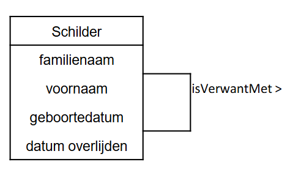

Voorbeeld van een binaire relatie:

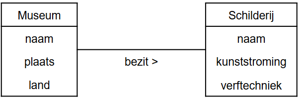

De **rollen van een relatietype** beschrijven *geeft de rol aan die een deelnemende entiteit van het entiteitstype speelt in de relatie*.

- In een **unaire of recursieve relatie**:
	- *één entiteitstype neemt meer dan één keer deel aan de relatie*
	- => de *rolnaam is essentieel voor het onderscheiden van de betekenis die elke deelnemende entiteit speelt*

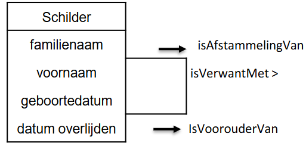

- In een **binaire relatie**:
	- de *naam van elk deelnemend entiteitstype kan worden gebruikt als rolnaam*

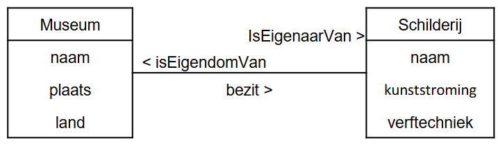

### Relatie-attribuut

Ook relatietypes kunnen eigenschappen hebben: wanneer een kenmerk een eigenschap is van het relatietype en niet van één van de betrokken entiteittypes. We spreken van een relatie-attribuut.

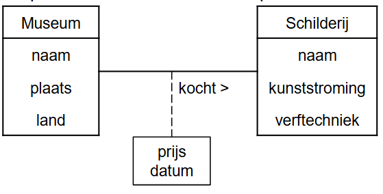

### Attribuuttype

Het ER(EntiteitRelatie)-model kent een aantal *mogelijkheden om attribuuttypes verder te karakteriseren*:
- **Enkelvoudige versus samengestelde attribuuttypes**
- **Enkelwaardige versus meerwaardigeattribuuttypes**
- **Afgeleide attribuuttypes**
- **Kandidaatsleutelattribuuttype**

##### Enkelvoudige versus samengestelde attribuuttypes

**Samengesteld attribuuttype**: *het attribuuttype kan nog opgesplitst worden*. Bijvoorbeeld het attribuuttype ‘adres’ kan samengesteld zijn uit een ‘straat’, een ‘nummer’, een ‘postcode’ en een 'woonplaats'.*Wij werken in het conceptueel model steeds op het niveau van enkelvoudige attribuuttypes*

*Afhankelijk van de context* zullen attribuuttypes soms verder *opgesplitst* worden of niet. Bijvoorbeeld als het *niet belangrijk is* dat 'straat' of 'woonplaats' afzonderlijk moet gekend zijn, dan wordt 'adres' een **enkelvoudig attribuuttype**. In dat geval kan niet met de afzonderlijke delen (straat, stad, ...) gewerkt worden.

##### Enkelwaardige versus meerwaardige attribuuttypes

**Enkelwaardig attribuuttype**: *het attribuuttype heeft één waarde*. Bijvoorbeeld het attribuuttype ‘museum’ van ‘SCHILDERIJ’ en de attribuuttypes ‘geboortejaar’ en ‘jaar overlijden’ van ‘SCHILDER’. •

**Meerwaardigattribuuttype**: *het attribuuttype kan (meerdere) waarden bevatten*. Bijvoorbeeld een ‘SCHILDER' kan meerdere talen spreken of meerdere hobbyshebben. In dat geval zijn ‘talen’ en ‘hobby's’ meerwaardigeattribuuttypes.•In een ERD mogen beide voorkomen (zie later). ***Binnen Databases vermijden we meerwaardigeattributen in het ERD***

### Kandidaat sleutel attributen

*Één attribuut of meerdere attributen samen die de entiteiten van een entiteittype op een* **unieke, irreducibele manier identificeren**, *vormen een kandidaat sleutel van het entiteittype*. Irreducibiliteit wil zeggen dat er geen uniciteit mag gelden als men één of meerdere attributen weg laat.

De *attributen die deel uitmaken van een kandidaat sleutel noemt men de kandidaat sleutelattributen*.

*Er kunnen meerdere kandidaat sleutels zijn. Later wordt uit de kandidaat sleutels één sleutel gekozen als primaire sleutel*.

Alle *enkelvoudige kandidaat sleutels* (bestaat uit 1 attribuuttype) worden **onderlijnd**. Indien een kandidaatsleutel *uit meerdere attribuuttypes bestaat* (samengestelde kandidaat sleutel), duiden we dit dan aan met de **’u’-constraint**.

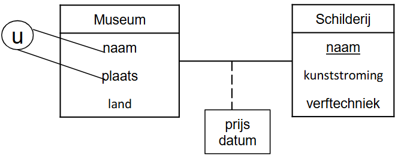

### Cardinaliteiten

Elk relatietype kan worden gekarakteriseerd in termen van cardinaliteit **=** *het aantal entiteiten dat kan deelnemen aan de relatie*. 

*Elk relatietype heeft een minimum-en een maximumcardinaliteit*.

*Cardinaliteit betekent aantal* en wordt uitgedrukt als een *getal*.

De cardinaliteiten moeten afgetoetst worden met de opdrachtgever! Deze zijn vaak afhankelijk van de bedrijfsregels. *WIJ MODELLEREN ENKEL WAT WE WETEN*. **We veronderstellen niet!**

*!! Verkeerd gekozen cardinaliteiten kunnen ook voor minder kwalitatieve applicaties zorgen*

**Maximum cardinaliteit** = het *maximum aantal entiteiten van het entiteittype dat op een gegeven tijdstip kandeelnemen aan een relatie van het relatietype*. Mogelijke waarden zijn **1 of N**.
- **1**: *één entiteit kan in relatie staan met maximum 1 (andere) entiteit via dit relatietype*
- **N**: *één entiteit kan in relatie staan met N (andere) entiteiten via dit relatietype. N is een willekeurig geheel getal groter dan 1*.

**Minimum cardinaliteit** = het *minimum aantal entiteiten van het entiteittype dat op elk tijdstip moet voorkomen in een relatie van het relatietype*. Mogelijke waarden zijn **0** of **1**.
- **0**: *sommige entiteiten nemen niet deel aan de relatie. De relatie is optioneel voor dat entiteittype.*
- **1**: *een entiteit moet altijd in relatie staan met minimum één andere entiteit*.

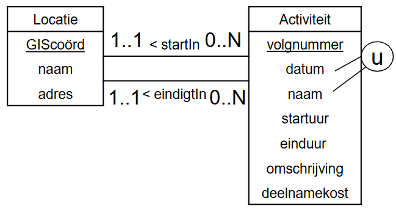

### Zwakke entiteiten

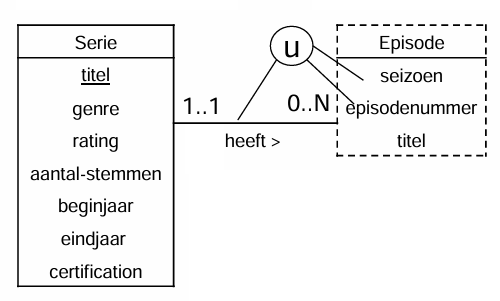

- Is **bestaansafhankelijk** want de *minimumcardinaliteit is 1*
- **Kan niet los op zichzelf bestaan** (je hebt een *andere entiteit (relatie) nodig* om te kunnen identificeren)
- **Aangeduid met een stippellijn**.
- Voor de identificatie wordt een kandidaatsleutelattribuuttype van het zwak entiteittype **gekoppeld aan de relatie**. *Dit attribuuttype wordt niet onderlijnd*.
- Het *is* immers *geen kandidaatsleutel* op zich maar **maakt deel uit van een kandidaatsleutel** (*kandidaatsleutelattribuuttypes*).

**Als je kan identificeren is het GEEN zwak entiteittype**. → *Enkel bestaansafhankelijkheid is niet voldoende* om te spreken van een zwak entiteittype.

### Historiek

De datum waarop een LID een EXEMPLAAR van een BOEK uitleent, verdwijnt uit de databank wanneer het LID dit EXEMPLAAR terug brengt. Dit strookt niet met wat we gewend zijn in de realiteit. 
**Soms is het noodzakelijk een overzicht van bepaalde gegevens uit het verleden te hebben** en te kunnen weergeven –in dit geval de ontleningen van elk EXEMPLAAR van een BOEK sedert dit werd aangekocht

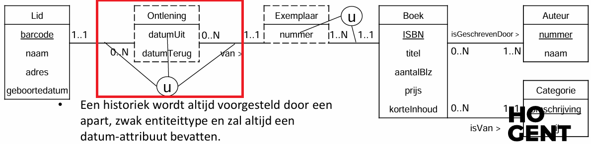

- **Er wordt een bijkomend, zwak entiteittype** *ONTLENING* **toegevoegd**.
- ONTLENING is **zwak** omdat het *bestaansafhankelijk is van LID en van EXEMPLAAR* ÉN omdat het *zelf niet over voldoende attribuuttypes beschikt om zich te identificeren*.
- We noemen het entiteittype *ONTLENING* een **historiek**.
- Is steeds met een **datum**.
### Ternaire relatie
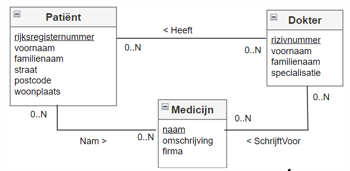

- We willen dit niet!
- Oplossing, gebruik een zwak entiteitstype (nadeel, de relatie is weg)

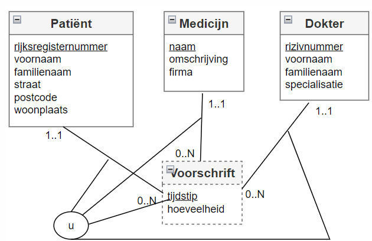

## Voorbeelden

Nog aan te vullen

## Diagram: **Extented Entity Relationship Diagram** EERD

Het Enhanced Entity Relationship Diagram of EERD is een **uitbreiding van het ERD**.
	- **alle concepten uit het ERD blijven behouden**, namelijk entiteittype, attribuuttype en relatietype.
	- een *nieuw modelleringsconcept wordt toegevoegd*:
		- **specialisatie/generalisatie**

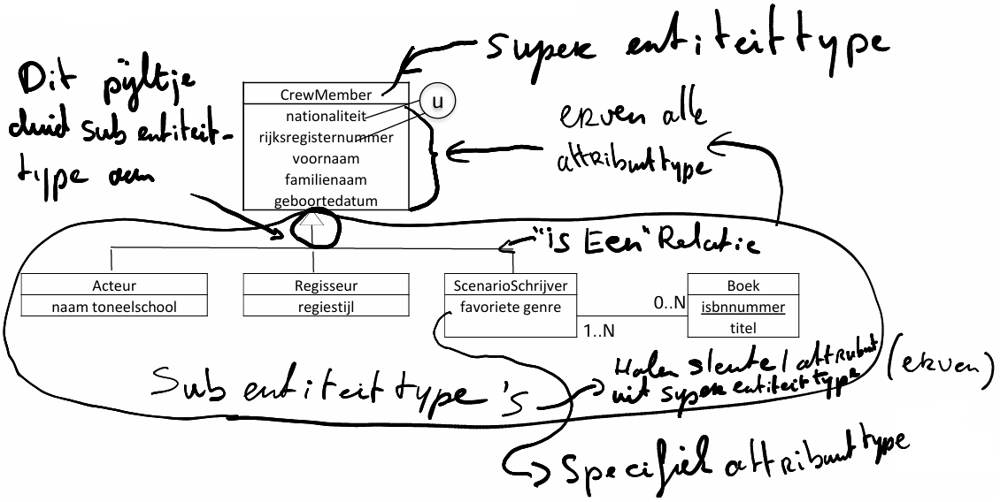
### Specialisatie

- Om een *subcollectie van entiteiten te karakteriseren*, worden aparte entiteittypes aangemaakt: **sub(entiteit)types**.
- Het *oorspronkelijke entiteittype is het* **superentiteittype** *voor deze subentiteittypes*.
- Een **subentiteittype** *erft alle attribuuttypes en relatietypes van zijn* **superentiteittype**.
- Een **subentiteittype** *kan*:
	- *zelf specifieke attribuuttypes hebben. Deze gelden* **niet voor het superentiteittype**.
	- *aanleiding geven tot extra relatietypes met (andere)( sub) entiteittypes*. *Deze gelden* **niet voor het supereniteittype**.
- Een **subentiteittype** *heeft* **GEEN** *kandidaatsleutelattribuuttype*!
- **Specialisatie = het creëren van specifiekere subentiteittypes voor een gegeven entiteittype**. Een *specialisatie definieert* **een IS-EEN relatie**.
- Komt overeen met een *top-down proces van conceptuele verfijning*.

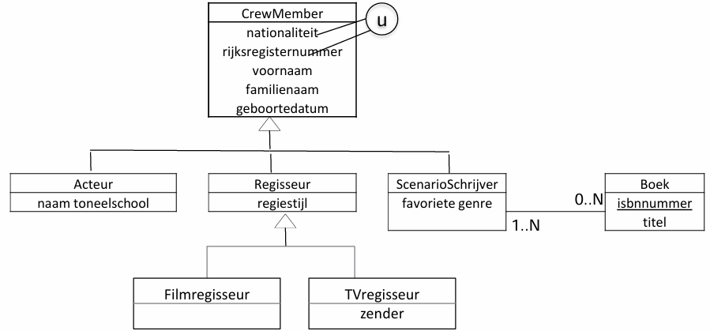

### Generalisatie

- Het *creëren van* **een algemeen supertype** *dat de gemeenschappelijke attribuuttypes en relatietypes van een aantal gegeven entiteittypes verenigt*. Dit is het omgekeerde proces van specialisatie.
- Komt overeen met een *bottom-up proces van conceptuele synthese*.

Bijvoorbeeld: 
- meerdere types muziekinstrumenten: PIANO, VIOOL en GITAAR.
- Met de generalisatiebenadering → superentiteittype STRIJKINSTRUMENT met de gemeenschappelijke kenmerken van de meerdere subtypen

### Participatie constraint

- Specialisatie wordt gekenmerkt door een disjoint constraint en een participatie constraint.
- De participatierestrictie bepaalt of op elk tijdstip elke entiteit van het supertype ook entiteit moet zijn van ten minste één subtype of niet.

- **Totale participatie**:
	- *Elke entiteit van het supertype* **moet** *op elk tijdstip ook entiteit zijn van ten minste één subtype*. *Er bestaan geen entiteiten van het supertype die niet tot een subtype behoren*. => **Mandatory**

- **Partiële participatie**:
	- Er **kunnen** *entiteiten van het supertype zijn die niet tot één van de opgesomde subtypes behoren*. => **Optional**

### Disjoint constraint

- Specialisatie wordt gekenmerkt door een disjoint constraint en een participatie constraint.
- De Disjoint constraint specificeert tot welke subentiteittypes een entiteit van het superentiteittype kan behoren.. 
- Overlappende subtypes
	- Een entiteit *kan tot meer dan één subtype behoren*. -> **AND** 
- Disjuncte subtypes
	- Een exclusieve OR tussen de subtypes: een entititeit *kan maar tot 1 subtype behoren*. -> **OR**