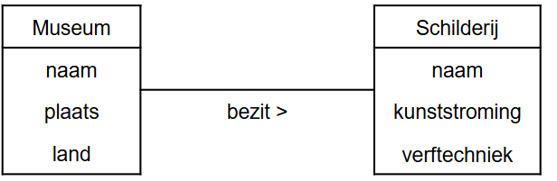
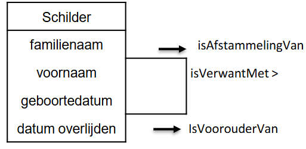

# H1 Databanken gekaderd
## Wie gebruikt databank(technologie)?  (6)

- **Traditionele bedrijfsapplicaties** (loonberekening, tijdsregistratie, …)
- **Biometrische applicaties** (vingerafdrukken, resultaten scans)
- **Sensor-applicaties** (in kerncentrales, …)
- **GIS applicaties** (geografische informatie systemen (Google Maps, …)
- **Big Data applicaties* (Walmart, …)
- **‘Internet of Things (IoT)’ applicaties** (Telematics, …)

→ *opslag en terug ophalen van informatie (data)*

## Klassiek bestand <-> databank

### Gegevensmanagement via bestanden

Bestandsgebaseerde oplossing → *elke toepassing definieert zijn* **eigen** *bestanden*.
=> Er wordt dus gebruik gemaakt van *verschillende bestanden zonder relaties* tussen de bestanden.

#### Gegevensmanagement via bestanden
![[Pasted image 20241003072659.png]]

#### Nadelen gegevensmanagement via bestanden
1. *Verspreiding en isolatie van gegevens* (Moeilijk beheersbaar)
2. *Gegevensredundantie* (Dubbele opslag)
3. *Data afhankelijkheid*
4. *Incompatibiliteit* (niet kunnen samenwerken)
5. *Fixed query's* (moeilijk om data te vinden (query = vraag om data op te vragen))

### Oplossing: databank

#### Basisdefinities databank
Een *gedeelde* verzameling van **logisch** *met elkaar verbonden* gegevens en hun *beschrijving*, ontworpen om aan de *informatienoden* van een organisatie te voldoen. (T. Connolly).
- *digitaal opgeslagen*
- *specifiek bedrijfsproces*
- *specifieke groep* (gebruikers en applicaties)

verduidelijking (niet kennen):
*gedeelde*: op 1 vaste plaats
*logisch met elkaar verbonden*: moet logisch zijn
*beschrijving*: wat hou ik bij
*informatienoden*: wat wil je er mee doen (wat hebben we nodig)

#### Basisdefinities DBMS (database management system)
Dient om een databank te kunnen gebruiken.

* een verzameling computerprogramma’s (softwaremodules)
* *Nodig om* een databank te
	* *definiëren*
	* *creëren*
	* *wijzigen*
	* *beheren*
		* **back-up en recovery**
		* **beheerstools om de prestaties** van de data-bank **te monitoren en te optimaliseren**.
	* *gebruiken* (gegevens invoeren en ‘lezen’)

**Databanksysteem**: *databank* (data) *+ DBMS* (om met de data te werken)

#### Gegevensmanagement via DBMS

cataloog = metadata (data over data)

#### Basisdefinities: RDBMS

RDBMS = **DBMS voor relationele databanken**
- *Maakt gebruik van het relationeel gegevensmodel* (met tabellen, rijen, kolommen, …)
- Momenteel het *meest frequent gebruikt* in de bedrijfswereld
- *SQL* (beschrijvend en gebaseerd op resultset) (Structured Query Language)

Voorbeelden:

| Merknaam       | Omschrijving                                                                                                               |     |
| -------------- | -------------------------------------------------------------------------------------------------------------------------- | --- |
| **Oracle**     | Het grootste en eerste commerciële RDBMS. Wordt gebruikt in veel van 's werelds grootste bedrijven.                        |     |
| **SQL server** | RDBMS-product van Microsoft. Leverbaar in vele versies voor verschillende bedrijfsbehoeften.                               |     |
| **MySQL**      | Het populairste open source RDBMS. Sinds 2010 wordt het ontwikkeld, gedistribueerd en ondersteund door Oracle Corporation. |     |
| **PostgreSQL** | Ook een gratis, open source RDBMS. Sommigen zouden zeggen krachtiger dan MySQL                                             |     |
#### Basisdefinities: Toepassingsprogramma's

Toepassingssoftware zorgt voor de *verbinding met het DBMS*.
DBMS verzorgt de toegang tot de relevante databanken.

#### Basisdefinities: Databank gebruikers

1. **De data-administrators** (DA) zijn in een onderneming centraal verantwoordelijk zijn voor de data (waakt op de data zelf)
2. **Dbontwerper** vertaalt conceptueel model naar logisch en intern model
3. DBA (databankbeheerder of **database administrator**) implementeert en monitort DB (waakt op de werking)
4. **Applicatieontwikkelaar** schrijft databankprogramma’s/databankapplicaties
5. **Eindgebruikers** gebruikt databankapplicaties en voert op die manier databankacties uit
	- Sommige eindgebruikers zijn zich niet bewust van de databank
	- Sommige geavanceerde eindgebruikers kennen de structuur van de databank

#### Elementen van een databanksysteem.

- Databankmodel versus instances
- Cataloog
- Databankmodel
- 3-lagen architectuur

#### Databankmodel versus instances

- *Databankmodel = databankschema*
	- **bevat**
		- *beschrijving van de databankstructuur*
		- *specificaties v/d elementen*, hun eigenschappen, relaties, beperkingen, ...
	- **Opgesteld tijdens databankontwerp** – Wijzigt niet om de haverklap (door de database ontwerper)
	- **Opgeslagen in de cataloog** (is metadata)
	- **Toestand van een databank**
		- *Op dat ogenblik aanwezige data*
		- *Wijzigt voortduren*

Voorbeeld databankmodel:

Kunstenaar (naam, geboorteplaats, geboortedatum)
Kunstwerk (naam, museum, jaar)
Museum (naam, stad)

**Instances** = instanties (wat er in zit)

#### Datamodel (gegevensmodel)

- **Databankmodel**: *bestaat uit verschillende datamodellen*
- **Datamodel**: *weergave van de gegevens met hun kenmerken en hun relaties*
- In de cursus komen er **3 datamodellen** aan bod:
	- *Conceptueel datamodel*
	- *Logisch datamodel*
	- *Fysiek datamodel*

##### Conceptueel datamodel
- perfecte weergave van de gegevensvereisten van de ‘business’ requirements.
- algemene beschrijving gegevenselementen, kenmerken en relaties
	- *Gebruikt door ‘IT’ en ‘business’*
	- <ins>Weergave hoe ‘de business’ de gegevens ziet</ins>
	- Voorstelling: (E)ERD diagram (Entety Relation Diagram)

***!!Veronderstellingen en ontbrekende informatie duidelijk vermelden!!***

##### Logisch datamodel
- *vertaling conceptueel gegevensmodel naar het type databankmodel*
	- Relationeel, hiërarchisch, OO, XML, NoSQL
- nog altijd verstaanbaar voor niet IT-ers, maar *leunt al dichter aan bij hoe de data fysiek zal opgeslagen worden*

##### Fysiek datamodel
- *Geeft informatie over fysieke opslag*:
	- *waar* worden welke gegevens opgeslagen
	- *Wat is de grootte van de datavelden* (aantal characters, type variabele)
	- *Indexen* die het ophalen versnellen
- Zeer *DBMS afhankelijk*

(Mensen van de business komen hier niet mee in contact)

voorbeeld:

#### drielagen architectuur

- **Doel**: *verkrijgen van dataonafhankelijkheid*
	- Wijzigingen in de ene laag leiden tot minimale wijzigingen in de andere laag
1. **Externe laag** → externe datamodel, *bevat views*
	- Deelverzameling van het logisch model
	- Voor een specifieke doelgroep.
	- Wordt gebruikt om de toegang tot gegevens te controleren en beveiliging af te dwingen
2. **Middelste laag** → *conceptuele / logische laag*
3. **Interne laag** → interne datamodel, legt vast *hoe data fysisch georganiseerd en opgeslagen wordt*

### Nog enkele belangrijke begrippen (kennen)

- **Gegevensonafhankelijkheid**
- **Gestructureerde en ongestructureerde gegevens**
- **Redundante gegevens**
- **Integriteitsregels**
- **Cataloog**

#### Gegevensonafhankelijkheid:

-  = *wijzigingen aan de gegevensbeschrijving hebben weinig tot geen impact op de applicaties*
- **Fysieke gegevensonafhankelijkheid**: *wijzigingen van de opslagspecificaties hebben* **geen invloed op het logisch model** *noch op de applicatie* → wordt opgevangen door het DBMS
- **Logische gegevensonafhankelijkheid**: *minimale aanpassingen aan de applicaties bij wijzigingen aan het logisch model*

#### gestructureerde en ongestructureerde gegevens

- **Gestructureerde gegevens**
	- *Kunnen in een logisch datamodel voorgesteld worden*
	- *Integriteitsregels kunnen opgesteld en afgedwongen worden*
	- *Vereenvoudigen, opzoeken, verwerken en analyseren*
	- Voorbeelden: naam, geboortejaar, geboorteplaats van een kunstenaar
	
* **Ongestructureerde gegevens**
	* *kunnen niet op een zinvolle manier worden geïnterpreteerd door een applicatie*
	* Voorbeelden: gesprekken op social media, e-mails
	* *Let op*: er bestaat veel meer ongestructureerde data dan gestructureerde data

* **Semi-gestructureerde gegevens** 
	* *De structuur van de gegevens is zeer onregelmatig of zeer wisselend*.
	* Voorbeelden: webpagina's van individuele gebruikers op een social media platform, cv-documenten in een personeelsdatabank

#### Redundantegegevens

* Databank = centrale en unieke opslag gegevens
* Soms worden *databanken gedupliceerd uit veiligheidsoverwegingen of omwille van performantie*
	* →**redundantie**
* **DBMS** *is verantwoordelijk voor de synchronisatie* en garandeert de juistheid van de gegevens

#### Integriteitsregels

* Integriteitsregelsworden *gedefinieerd op basis van het conceptueel model en opgeslagen in de catalog*
	* Worden *afgedwongen door het DBMS*
* *Vastleggen hoe gegevens worden opgeslagen* (**syntactische regel**)
	* Bvb: customerIDis een geheel getal (100, 200, niet 2.A)
* *Vastleggen wanneer gegevens correct zijn* (**semantische regel**)
	* Bvb: Eenheidsprijs > 0; geboortedatum niet > vandaag
* Integriteitsregels worden gespecificeerd als *onderdeel van het conceptuele/logische datamodel*+ *centraal opgeslagen in de cataloog*

#### Cataloog

- Schatkist *van DBMS*
- *Definities en beschrijving van de elementen in de DB* (**= metadata**)
- *Definities logisch gegevensmodel* en *intern gegevensmodel*
- Zorgt voor *synchronisatie en consistentie van de gegevensmodellen*
- *Opslagplaats voor integriteitsregels*, en andere informatie zoals gebruikers, ...

# H2 Datbank Ontwerp

Het *ontwerpen van een databank* vertrekt vanuit de bedrijfsprocessenen bestaat uit *4 fases*:
* **Fase1** = *Verzamelenenanalyserenvan de functionele/ inhoudelijkevereisten* (DBMS onafhankelijk)
* **Fase2** = *Conceptueelontwerp* -> **Conceptueel datamodel** (DBMS onafhankelijk)
* **Fase3** = *Logischontwerp* -> **Logisch datamodel** (DBMS specifiek)
* **Fase4** = *Fysiekontwerp* -> **Intern datamodel** (DBMS specifiek)

## **Fase 1** = Verzamelen en analyseren informatie

Doel: *de stappen en de benodigde data van het bedrijfsproces begrijpen*. **Wat nemen we op in de databank?**

- Dit kan via
	- *interviews* met de opdrachtgever
	- *analyse van bestaande formulieren en rapporten*
	
- **Vragen die moeten** beantwoord worden
	- *Welke data* moet in de databank worden opgenomen?
	- Wat is de *betekenis en context van alle data*, symbolen, gebruikte coderingen?
	- *Hoe zal de data worden verwerkt?*
	- Wat is de beoogde *functionaliteit*?
	- *Waarvoor zal de data gebruikt worden?*

## **Fase 2** = Conceptueel ontwerp

Het conceptueel model
- is de a*bstractie van de data en de onderlinge verbanden*
- moet *voldoende formeel* en *ondubbelzinnig* zijn voor de DBontwerper.
- moet *gebruiksvriendelijk* zijn
- doorgaans een *grafische representatie*
- *basis voor communicatie en discussie tussen de gebruiker van het bedrijfsproces en de databankontwerper*.
- gebeurt *onafhankelijk van enig databankmodel of applicatie*. Anders te vroeg gekoppeld aan een bepaald databankmodel of een bepaalde applicatie.

Wij kiezen hier het **Entity Relationship Diagram (ERD)** voor.

## **Fase 3** = Logisch ontwerp

*Type databank is bekend*(relationele databank, NoSQL databank, hiërarchische databank, ...)

Het *product zelf ligt nog niet vast*
- voor relationeledatabank: Microsoft SQL Server of MySQL of Oracle of DB2 of ...
- voor NoSQL document databank: MongoDB of CouchDB of ...
- voor hiërarschische databank: IMS of ...

!! Bij het opstellen van het conceptueel model en bij de overgang van het conceptueel model naar het logisch model is er *mogelijk verlies van specificaties*.**→** In een *apart document bijhouden om te gebruiken bij de applicatie-ontwikkeling*.

## **Fase 4** = Fysiek ontwerp

* Is de feitelijke *implementatie van het logisch model*.
* Je *kiest eerst een product*, ook *DBMS* genoemd (MySQL, Microsoft SQL Server, Oracle, ...).
* Je *implementeert het logisch model en zet dit om in datadefinitiecode(= DDL)*, die kan worden verwerkt door het DBMS.
* *Technische details worden toegevoegd* (datatypes van de attribuuttypes, ...)
* Indien mogelijk worden ook de *functionele beschrijvingen ‘vertaald’ naar databaseconcepten*. Zo kunnen de bedrijfsregels rond correct geboortejaar en jaar van overlijden omgezet worden naar een integriteitsrestrictie.
* *DBA kan ook aanbevelingen doen in verband met de performantie*.→zieRelational Databases and Datawarehousing(2TI)

## Conceptueelontwerp: **Entity Relationship Diagram** (ERD)

Een Entity Relationship Diagram *heeft de volgende bouwstenen*:
- **Entiteittypes**
- **Attribuuttypes**
- **Relatietypes**

### Entiteit type

Een *entiteittype–bestaat in de reële wereld*. –kan zowel *abstract* (een tentoonstelling, firma, cursus, job, ...) als *fysiek* (schilderij, persoon, auto, huis, ...) zijn.
-  is *ondubbelzinnig gedefinieerd* voor een bepaalde groep gebruikers.
- *karakteriseert een collectie van entiteiten* 
- *heeft een naam en inhoud en is identificeerbaar*.
	
Een *entiteit is een instantie van een entiteittype*.

In het conceptueel model *nemen we entiteittypes op* (geen individuele entiteiten).

Een entiteittype is *identificeerbaar en moet een inhoud hebben*.

Voor een onervaren databaseontwerper kan het onduidelijk zijn of een gegeven concept al dan niet als entiteittype moet worden gemodelleerd.

### Attribuuttype

Een attribuuttype
- is een *karakteristiek van een entiteittype*
- *beschrijft het entiteittype*

*Elke entiteit heeft een specifieke waarde voor elke attribuuttype*.

### Relatietype

De **graad van een relatietype** = het *aantal verschillende entiteittypes die deelnemen aan het relatietype*
- **Unairerelatie** →*1 entiteittype*
- **Binaire relatie** →*2 entiteittypes*

Voorbeeld van een unaire of recursieve relatie:

Voorbeeld van een binaire relatie:

De **rollen van een relatietype** beschrijven *geeft de rol aan die een deelnemende entiteit van het entiteitstype speelt in de relatie*.

- In een **unaire of recursieve relatie**:
	- *één entiteitstype neemt meer dan één keer deel aan de relatie*
	- => de *rolnaam is essentieel voor het onderscheiden van de betekenis die elke deelnemende entiteit speelt*

- In een **binaire relatie**:
	- de *naam van elk deelnemend entiteitstype kan worden gebruikt als rolnaam*

### Relatie-attribuut

Ook relatietypes kunnen eigenschappen hebben: wanneer een kenmerk een eigenschap is van het relatietype en niet van één van de betrokken entiteittypes. We spreken van een relatie-attribuut.

### Attribuuttype

Het ER(EntiteitRelatie)-model kent een aantal *mogelijkheden om attribuuttypes verder te karakteriseren*:
- **Enkelvoudige versus samengestelde attribuuttypes**
- **Enkelwaardige versus meerwaardigeattribuuttypes**
- **Afgeleide attribuuttypes**
- **Kandidaatsleutelattribuuttype**

##### Enkelvoudige versus samengestelde attribuuttypes

**Samengesteld attribuuttype**: *het attribuuttype kan nog opgesplitst worden*. Bijvoorbeeld het attribuuttype ‘adres’ kan samengesteld zijn uit een ‘straat’, een ‘nummer’, een ‘postcode’ en een 'woonplaats'.*Wij werken in het conceptueel model steeds op het niveau van enkelvoudige attribuuttypes*

*Afhankelijk van de context* zullen attribuuttypes soms verder *opgesplitst* worden of niet. Bijvoorbeeld als het *niet belangrijk is* dat 'straat' of 'woonplaats' afzonderlijk moet gekend zijn, dan wordt 'adres' een **enkelvoudig attribuuttype**. In dat geval kan niet met de afzonderlijke delen (straat, stad, ...) gewerkt worden.

##### Enkelwaardige versus meerwaardige attribuuttypes

**Enkelwaardig attribuuttype**: *het attribuuttype heeft één waarde*. Bijvoorbeeld het attribuuttype ‘museum’ van ‘SCHILDERIJ’ en de attribuuttypes ‘geboortejaar’ en ‘jaar overlijden’ van ‘SCHILDER’. •

**Meerwaardigattribuuttype**: *het attribuuttype kan (meerdere) waarden bevatten*. Bijvoorbeeld een ‘SCHILDER' kan meerdere talen spreken of meerdere hobbyshebben. In dat geval zijn ‘talen’ en ‘hobby's’ meerwaardigeattribuuttypes.•In een ERD mogen beide voorkomen (zie later). ***Binnen Databases vermijden we meerwaardigeattributen in het ERD***

### Kandidaat sleutel attributen

*Één attribuut of meerdere attributen samen die de entiteiten van een entiteittype op een* **unieke, irreducibele manier identificeren**, *vormen een kandidaat sleutel van het entiteittype*. Irreducibiliteit wil zeggen dat er geen uniciteit mag gelden als men één of meerdere attributen weg laat.

De *attributen die deel uitmaken van een kandidaat sleutel noemt men de kandidaat sleutelattributen*.

*Er kunnen meerdere kandidaat sleutels zijn. Later wordt uit de kandidaat sleutels één sleutel gekozen als primaire sleutel*.

Alle *enkelvoudige kandidaat sleutels* (bestaat uit 1 attribuuttype) worden **onderlijnd**. Indien een kandidaatsleutel *uit meerdere attribuuttypes bestaat* (samengestelde kandidaat sleutel), duiden we dit dan aan met de **’u’-constraint**.

### Cardinaliteiten

Elk relatietype kan worden gekarakteriseerd in termen van cardinaliteit **=** *het aantal entiteiten dat kan deelnemen aan de relatie*. 

*Elk relatietype heeft een minimum-en een maximumcardinaliteit*.

*Cardinaliteit betekent aantal* en wordt uitgedrukt als een *getal*.

De cardinaliteiten moeten afgetoetst worden met de opdrachtgever! Deze zijn vaak afhankelijk van de bedrijfsregels. *WIJ MODELLEREN ENKEL WAT WE WETEN*. **We veronderstellen niet!**

*!! Verkeerd gekozen cardinaliteiten kunnen ook voor minder kwalitatieve applicaties zorgen*

**Maximum cardinaliteit** = het *maximum aantal entiteiten van het entiteittype dat op een gegeven tijdstip kandeelnemen aan een relatie van het relatietype*. Mogelijke waarden zijn **1 of N**.
- **1**: *één entiteit kan in relatie staan met maximum 1 (andere) entiteit via dit relatietype*
- **N**: *één entiteit kan in relatie staan met N (andere) entiteiten via dit relatietype. N is een willekeurig geheel getal groter dan 1*.

**Minimum cardinaliteit** = het *minimum aantal entiteiten van het entiteittype dat op elk tijdstip moet voorkomen in een relatie van het relatietype*. Mogelijke waarden zijn **0** of **1**.
- **0**: *sommige entiteiten nemen niet deel aan de relatie. De relatie is optioneel voor dat entiteittype.*
- **1**: *een entiteit moet altijd in relatie staan met minimum één andere entiteit*.

