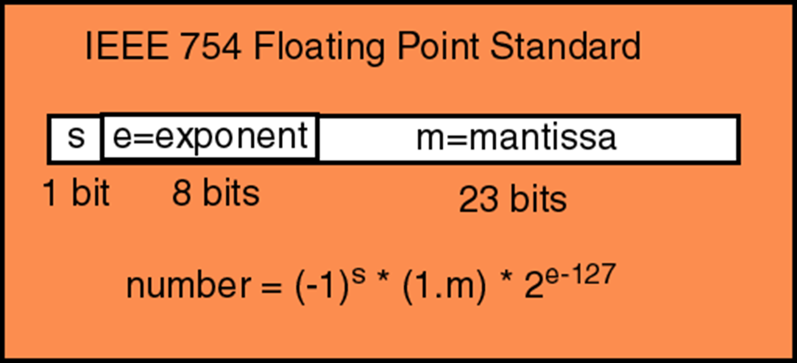

# Getallensystemen of talstelsels

### Definitie

Een *cijfer is een symbool*, dat gebruikt wordt bij de *voorstelling van getallen*.

Een getal wordt voorgesteld door, *al dan niet van elkaar verschillende, cijfers achter elkaar te plaatsen*

Voorbeeld:
- Wij gebruiken 10 symbolen namelijk
  0, 1, 2, 3, 4, 5, 6, 7, 8, 9 -> onze cijfers

- Door de cijfers achter elkaar te plaatsen krijgen we een getal:
  1213

### Positie

Afhankelijk van de positie in het getal heeft het cijfer dus een andere betekenis.
*De positie van een cijfer binnen het getal geeft aan met hoeveel het cijfer vermenigvuldigd moet worden*.

  1213  =  1 . 1000 + 2 . 100 + 1 . 10 + 3 . 1
  =  1 . 10³ + 2 . 10² + 1 . 101 + 3 . 100

#### Definitie
Een *positioneel (getallen)systeem of positioneel talstelsel (kortweg positiestelsel)*, is een talstelsel, waarbij een getal wordt voorgesteld door een reeks van symbolen of cijfers. De positie of de plaats van het cijfer in het getal, bepaalt de bijdrage aan het getal op basis van een gekozen grondtal.

Algemeen: een *positioneel systeem heeft* een
- *Grondtal* **a**
- *Verzameling symbolen of cijfers*, waarvan *het aantal gelijk is aan* **a**

## Tiendelig

- Een positioneel systeem
- Decimaal stelsel
- Positioneel systeem met
	- Grondtal = 10
	- •Verzameling cijfers = {0, 1, 2, 3, 4, 5, 6, 7, 8, 9}

Bijvoorbeeld het getal 1302:

| 10³  | 10² | 10¹ | 10⁰ |
| ---- | --- | --- | --- |
| 1000 | 100 | 10  | 1   |
| 1    | 3   | 0   | 2   |
| 1000 | 300 | 0   | 2   |
|      |     |     |     |
### Decimale veelvouden

| benaming | symbool | macht van 10 | aantal eenheden   |
| -------- | ------- | ------------ | ----------------- |
| terra    | T       | 10^12        | 1000 000 000 000  |
| giga     | G       | 10^9         | 1000 000 000      |
| mega     | M       | 10^6         | 1000 000          |
| kilo     | k       | 10^3         | 1000              |
| milli    | m       | 10^-3        | 0.001             |
| micro    | µ       | 10^-6        | 0.000 001         |
| nano     | n       | 10^-9        | 0.000 000 001     |
| pico     | p       | 10^-12       | 0.000 000 000 001 |

## Binaire getallen

- Grondtal = 2
- Verzameling symbolen = {0, 1}
- Voorbeeld getal 10100010110
- Betekenis van elk symbool:

| 2¹⁰  | 2⁹  | 2⁸  | 2⁷  | 2⁶  | 2⁵  | 2⁴  | 2³  | 2²  | 2¹  | 2⁰  |
| ---- | --- | --- | --- | --- | --- | --- | --- | --- | --- | --- |
| 1024 | 512 | 256 | 128 | 64  | 32  | 16  | 8   | 4   | 2   | 1   |
| 1    | 0   | 1   | 0   | 0   | 0   | 1   | 0   | 1   | 1   | 0   |
| 1024 | 0   | 256 | 0   | 0   | 0   | 16  | 0   | 4   | 2   | 0   |
1024 + 256 + 16 + 4 + 2 = 1302

### Toepassingsgebied

Voorstelling *informatie binnenin een computer*.

  - Voorbeeld: 
   
   een IPv4-adres bestaat uit 32 bits
   Probleem: lang ==> onoverzichtelijk ==> kansen op fouten
   Oplossing: binaire getal voorstellen in een ander talstelsel ==> dotted decimal

  11000000 10101000 00001010 00000001
  192 . 168 . 10 . 1

### Afspraken en notatie

Onderscheid tussen talstelsels:
   *haakjes rond het getal met grondtal als subscript*
- (10)10 = 10 als tiendelig getal
- (10)₂ = 10 als binair getal

Afspraak: indien *geen notatie van grondtal*, dan nemen we aan dat het getal in het *decimaal stelsel* staat.

### Binair tellen

Methode (analoog als bij decimaal tellen):
1. Begin bij 0
2. Vervang het laatste cijfer door zijn opvolger
3. Wanneer een 1 (hoogste cijfer) verhoogd moet worden, verhoog dan het cijfer van één rang hoger met één
4. Ga verder met stap 2

| Binaire waarden | Decimale waarden |
| --------------- | ---------------- |
| 0               | 0                |
| 1               | 1                |
| 10              | 2                |
| 11              | 3                |
| 100             | 4                |
| 101             | 5                |
| 110             | 6                |
| 111             | 7                |
| 1000            | 8                |
| 1001            | 9                |
| 1010            | 10               |
| 1011            | 11               |
| 1100            | 12               |
| 1101            | 13               |

### Definities

Definities:
- bit =
	- binary digit
	- afgekort b
	- 1 cijfer (0 of 1) uit binair getal

- byte = rij van 8 bits
	- afgekort B

- msb = most significant bit / lsb = least significant bit

 Voorbeeld getal: 
	  msb->(1)010001011(0)<-lsb

### Veelvouden van bytes

| [SI-voorvoegsels](http://nl.wikipedia.org/wiki/SI-prefix) |              | Binaire voorvoegsels                                    |            | Afwijking   tussen SI   en binair |
| --------------------------------------------------------- | ------------ | ------------------------------------------------------- | ---------- | --------------------------------------- |
| Symbool   (naam)                                       | Waarde       | Symbool   (naam)                                     | Waarde     |                                         |
| kB ([kilobyte](http://nl.wikipedia.org/wiki/Kilobyte))    | 1000¹ = 10³  | KiB ([kibibyte](http://nl.wikipedia.org/wiki/Kibibyte)) | 1024¹ =2¹⁰ | 2,4%                                    |
| MB ([megabyte](http://nl.wikipedia.org/wiki/Megabyte))    | 1000² = 10⁶  | MiB ([mebibyte](http://nl.wikipedia.org/wiki/Mebibyte)) | 1024² =2²⁰ | 4,9%                                    |
| GB ([gigabyte](http://nl.wikipedia.org/wiki/Gigabyte))    | 1000³ = 10⁹  | GiB ([gibibyte](http://nl.wikipedia.org/wiki/Gibibyte)) | 1024³ =2³⁰ | 7,4%                                    |
| TB ([terabyte](http://nl.wikipedia.org/wiki/Terabyte))    | 1000⁴ = 10¹² | TiB ([tebibyte](http://nl.wikipedia.org/wiki/Tebibyte)) | 1024⁴ =2⁴⁰ | 10,0%                                   |
| PB ([petabyte](http://nl.wikipedia.org/wiki/Petabyte))    | 1000⁵ = 10¹⁵ | PiB ([pebibyte](http://nl.wikipedia.org/wiki/Pebibyte)) | 1024⁵ =2⁵⁰ | 12,6%                                   |
| EB ([exabyte](http://nl.wikipedia.org/wiki/Exabyte))      | 1000⁶ = 10¹⁸ | EiB ([exbibyte](http://nl.wikipedia.org/wiki/Exbibyte)) | 1024⁶ =2⁶⁰ | 15,3%                                   |
| ZB ([zettabyte](http://nl.wikipedia.org/wiki/Zettabyte))  | 1000⁷ = 10²¹ | ZiB ([zebibyte](http://nl.wikipedia.org/wiki/Zebibyte)) | 1024⁷ =2⁷⁰ | 18,1%                                   |
| YB ([yottabyte](http://nl.wikipedia.org/wiki/Yottabyte))  | 1000⁸ = 10²⁴ | YiB ([yobibyte](http://nl.wikipedia.org/wiki/Yobibyte)) | 1024⁸ =2⁸⁰ | 20,9%                                   |
## Octale getallen

- Grondtal = 8
- Verzameling symbolen = {0, 1, 2, 3, 4, 5, 6, 7}
- Voorbeeld getal (172)₈
- Betekenis van elk symbool:

| 8²  | 8¹  | 8⁰  |
| --- | --- | --- |
| 1   | 7   | 2   |

Opmerking:
- Om onderscheid te maken met de tiendelige getallen worden octale getallen in IT-omgevingen *vooraf gegaan door de prefix 0* (nul).

   Voorbeeld: (172)₈ = 0172

### Octaal tellen

- Methode analoog als bij decimaal  en binair tellen
- Binair getal omzetten naar octale voorstelling:
	- *binair getal groeperen per 3 bit* ( => 2³ = 8)Eventueel leidende nullen toevoegen (groen in de tabel)
	- *octale waarde bepalen per 3 bit*

Voorbeeld: (111010)₂ = ( 111 010 )₂ = (72)₈

| Octale waarden | Binaire waarden | Decimale waarden |
| -------------- | --------------- | ---------------- |
| 0              | 000             | 0                |
| 1              | 001             | 1                |
| 2              | 010             | 2                |
| 3              | 011             | 3                |
| 4              | 100             | 4                |
| 5              | 101             | 5                |
| 6              | 110             | 6                |
| 7              | 111             | 7                |
| 10             | 001 000         | 8                |
| 11             | 001 001         | 9                |
| 12             | 001 010         | 10               |
| 13             | 001 011         | 11               |
| 14             | 001 100         | 12               |
| 15             | 001 101         | 13               |

### Toepassingsgebied

Bestandspermissies in Linux:
- Bestaat uit 3 octale cijfers:
	- Algemeen:
		- (rwx)owner (rwx)group (rwx)all  bestandsNaam
	- Hierbij staat:
		- r-bit voor ‘read’ of leesrecht
		- w-bit voor ‘write’ of schrijfrecht
		- x-bit voor ‘execute’ of recht van uitvoeren

	- Afhankelijk van wat toegelaten is (= 1) of niet toegelaten is (= 0) kunnen de bestandsrechten weergegeven worden in bit-vlaggen. Bijvoorbeeld: 
		- (111)owner (101)group (100)all   bestandsNaam
	- Octale weergave van de bestandspermissies, wordt dan:
		- (7)owner (5)group (4)all  bestandsNaam  of  754 bestandsNaam

## Hexadecimale talstelsel

* Grondtal = 16
* Verzameling symbolen = {0, 1, 2, 3, 4, 5, 6, 7, 8, 9, A (=10), B (=11), C (=12), D (=13), E (=14), F (=15)}
* Voorbeeld: getal (1272)₁₆
* Betekenis van elk symbool:

| 16³ | 16³ | 16¹ | 16⁰ |
| --- | --- | --- | --- |
| 1   | 2   | 7   | 2   |
**Opmerking:**
- Om *onderscheid te maken* met de tiendelige getallen worden hexadecimale getallen in IT-omgevingen vooraf gegaan door de *prefix 0x (nul)*. Dus (1272)₁₆ = 0x1272

### Hexadecimaal tellen

Methode analoog als bij decimaal, binair en octaal tellen
Binair getal omzetten naar hexadecimale voorstelling:
- *binair getal groeperen per 4 bit* ( à 24 = 16) Eventueel leidende nullen toevoegen  (groen in de tabel)
- *hexadecimale waarde bepalen per 4 bit*

Voorbeeld: (111010)₂ =  (0011 1010)₂ = (3A)₁₆

| Hexadecimale waarden | Binaire waarden | Decimale waarden |
| -------------------- | --------------- | ---------------- |
| 0                    | 0000            | 0                |
| 1                    | 0001            | 1                |
| 2                    | 0010            | 2                |
| 3                    | 0011            | 3                |
| 4                    | 0100            | 4                |
| 5                    | 0101            | 5                |
| 6                    | 0110            | 6                |
| 7                    | 0111            | 7                |
| 8                    | 1000            | 8                |
| 9                    | 1001            | 9                |
| A                    | 1010            | 10               |
| B                    | 1011            | 11               |
| C                    | 1100            | 12               |
| D                    | 1101            | 13               |
| E                    | 1110            | 14               |
| F                    | 1111            | 15               |
| 10                   | 0001 0000       | 16               |
| 11                   | 0001 0001       | 17               |

### Toepassingsvoorbeelden

IPv6-adres:
- Opvolger van IPv4-adres
- 128 bits
- 32 hexadecimale getallen verdeeld in groepjes van 4  
Voorbeeld: (2001:0DB8:ACAD:0001:0000:0000:0000:0002)16

MAC-adres:
- Fabrikantafhankelijk fysiek adres van een netwerkkaart
- 48 bits
- 12 hexadecimale getallen
- Verschillende voorstellingen: gegroepeerd per 2 of per 4  
Voorbeelden:
* 00:0C:6E:C1:22:4A
* 20c1-9bbf-324e

## Conversies tussen talstelsels

### Conversie decimaal binair decimaal  - Cijfers **voor** de komma (methode 1):

#### Essentieel: de machten van 2 kennen:

| 2¹⁰  | 2⁹  | 2⁸  | 2⁷  | 2⁶  | 2⁵  | 2⁴  | 2³  | 2²  | 2¹  | 2⁰  |
| ---- | --- | --- | --- | --- | --- | --- | --- | --- | --- | --- |
| 1024 | 512 | 256 | 128 | 64  | 32  | 16  | 8   | 4   | 2   | 1   |
#### Omzetten van binair naar decimaal

Voorbeeld: (1010)₂
- Vertrek vanaf de lsb, en voeg toe in de tabel van rechts naar links

| 2³  | 2²  | 2¹  | 2⁰  |                       |
| --- | --- | --- | --- | --------------------- |
| 8   | 4   | 2   | 1   |                       |
| 1   | 0   | 1   | 0   | Vermenigvuldigen      |
| 8   | 0   | 2   | 0   | Optellen 8+0+2+0 = 10 |
•Naarmate men hier vlotter in wordt, kan men de machten uitschrijven:

  Voorbeeld:   (1010)₂   = 1.2³ + 0.2² + 1.2¹ + 0.2⁰
			                  = 1.8                + 1.2    = (10)₁₀

#### Omzetten van decimaal naar binair

- = herkennen van machten
- Voorbeeld: (862)₁₀
	- Stap 1: zoek naar de hoogste macht van 2 kleiner dan het getal: 2⁹ = 512
	- Stap 2: trek deze waarde van het getal af :  862 – 512 = 350
	- Herhaal stap 1 en 2 op het resultaat van stap 2 tot wanneer je 0 uitkomt:

   28 = 256 -> 350 -256 = 94  ->  26 = 64 ->  94 - 64 = 30 -> 24 = 16 ->  30 - 16 = 14 ->
   23 = 8 ->  14 - 8 = 6 ->  22 = 4 -> 6 – 4 = 2 à  21 = 2 -> 2 – 2 = 0

Maak een tabel van opeenvolgende machten van 2, vertrekkende van de hoogste gebruikte macht, en schrijf een 1 onder de gebruikte machten en een 0 onder de niet gebruikte machten:

| 2¹⁰ | 2⁹  | 2⁸  | 2⁷  | 2⁶  | 2⁵  | 2⁴  | 2³  | 2²  | 2¹  | 2⁰  |
| --- | --- | --- | --- | --- | --- | --- | --- | --- | --- | --- |
| 1   | 1   | 0   | 1   | 0   | 1   | 1   | 1   | 1   | 1   | 0   |
Antwoord: (862)₁₀ = (1101011110)₂

### Conversie decimaal binair decimaal - Cijfers **na** de komma (methode 1):

#### Essentieel: de machten van 2 kennen:

| 2⁻¹ | 2⁻²  | 2⁻³   | 2⁻⁴    | 2⁻⁵     |
| --- | ---- | ----- | ------ | ------- |
| 0,5 | 0,25 | 0,125 | 0,0625 | 0,03125 |
#### Omzetten van binair naar decimaal (methode 1):

Voorbeeld: (0,011)₂

Vertrek na de msb (dus msb wordt niet toegevoegd in de tabel), en voeg toe in de tabel van links naar rechts

| 2⁻¹ | 2⁻²  | 2⁻³   |                  |
| --- | ---- | ----- | ---------------- |
| 0,5 | 0,25 | 0,125 |                  |
| 0   | 1    | 1     | Vermenigvuldigen |
| 0   | 0,25 | 0,125 | Optellen         |
0+0,25+ 0,125 = 0,375

Naarmate men hier vlotter in wordt, kan men de machten onmiddellijk uitschrijven:
  Voorbeeld:   (0,011)₂   = 0.2⁻¹ + 1.2⁻² + 1.2⁻³
						 = 1 . 0,25 + 1 . 0,125  = (0,375)₁₀

#### Omzetten van decimaal naar binair (methode 1):

= herkennen van machten

Voorbeeld: (0,875)₁₀
1. zoek naar de hoogste negatieve macht van 2 kleiner dan het getal: 2-1 = 0,5
2. Stap 2: trek deze waarde van het getal af : 0,875 – 0,5 = 0,375
3. Herhaal stap 1 en 2 op het resultaat van stap 2 tot wanneer je 0 uitkomt:
      2-2 = 0,25 -> 0,375 – 0,25 = 0,125  à 2-3 = 0,125 -> 0,125 – 0,125 = 0
4. Maak een tabel van dalende negatieve machten van 2, vertrekkende van 2-1, en schrijf een 1 onder de gebruikte machten en een 0 onder de niet gebruikte machten:

| 2⁻¹ | 2⁻² | 2⁻³ |
| --- | --- | --- |
| 1   | 1   | 1   |
Antwoord: (0,875)₁₀ = (0,111)₂

### Conversie decimaal binair decimaal - Cijfers **na** de komma (methode 2)

#### Conversie decimaal binair (methode 2)

Uitschrijven of herkennen van de machten is enkel praktisch voor omzettingen binair/decimaal met beperkt aantal cijfers na de komma.
*Indien er na de komma teveel cijfers zijn en/of je geen herkenning van een macht kunt toepassen, val je terug op volgende methodes:*

- Voor omzetting **binair naar decimaal**: *methode van de opeenvolgende delingen*.
- Voor omzetting **decimaal naar binair**: *methode van de opeenvolgende vermenigvuldigingen*.

##### Omzetting binair naar decimaal: methode van de opeenvolgende delingen  (methode 2)

Voorbeeld: (0 , 1 0 1)₂  = ( …. )₁₀
- Stoppen aan de komma -> 101
10**1**
(0 + **1**)*/2* = ***0,5***(met lsb beginnen en delen door 2)
1**0**1
(***0,5*** + **0**)*/2*  = ***0,25*** (eindresultaat meenemen en optellen met de volgende bit en opnieuw delen door 2)
**1**01
(***0,25*** + **1**)*/2* = (0,625)₁₀ (Zelfde stap al hierboven tot de bits op zijn, dan is de uitkomst de oplossing na de komma)

##### Omzetting decimaal naar binair: methode van de opeenvolgende vermenigvuldigingen (methode 2)

Voorbeeld: (0,375)₁₀ = (…)₂

0,375 *. 2* = **0**,***75***  -> **0** (cijfer voor de komma noteren we) (grondtal * 2, uitkomst *na de komma* is begin van volgende berekening)
0,***75*** *. 2* = **1**,***5*** -> **1** (cijfer voor de komma noteren we) (maal 2, uitkomst *na de komma* is begin van volgende berekening)
0,***5*** *. 2* = **1** -> **1** (cijfer voor de komma noteren we) (maal 2, als we als uitkomst 1 uitkomen stoppen we)

oplossing: (0,375)₁₀ = (0,**011**)₂

### Conversies talstelsels met als basis een macht van 2

In geval dat de *basis van een talstelsel een macht van 2 is, zal één symbool van dat talstelsel voorgesteld kunnen worden door een vast aantal bits*.

Voorbeelden:
- Octaal talstelsel: basis = **8** = **2***³* -> dus voorstelling elk symbool door *3 bits*
- Hexadecimaal stelsel: basis = **16** = **2***⁴* -> dus voorstelling elk symbool door *4 bits*

#### Omzetten talstelsel naar binair:

*Stel elke symbool voor door de overeenkomstige groep bits* (zie onderstaande tabellen)

| Octale waarden | Binaire waarden | Decimale waarden |
| -------------- | --------------- | ---------------- |
| 0              | 000             | 0                |
| 1              | 001             | 1                |
| 2              | 010             | 2                |
| 3              | 011             | 3                |
| 4              | 100             | 4                |
| 5              | 101             | 5                |
| 6              | 110             | 6                |
| 7              | 111             | 7                |
| 10             | 001 000         | 8                |
| 11             | 001 001         | 9                |
| 12             | 001 010         | 10               |
| 13             | 001 011         | 11               |
| 14             | 001 100         | 12               |
| 15             | 001 101         | 13               |

| Hexadecimale waarden | Binaire waarden | Decimale waarden |
| -------------------- | --------------- | ---------------- |
| 0                    | 0000            | 0                |
| 1                    | 0001            | 1                |
| 2                    | 0010            | 2                |
| 3                    | 0011            | 3                |
| 4                    | 0100            | 4                |
| 5                    | 0101            | 5                |
| 6                    | 0110            | 6                |
| 7                    | 0111            | 7                |
| 8                    | 1000            | 8                |
| 9                    | 1001            | 9                |
| A                    | 1010            | 10               |
| B                    | 1011            | 11               |
| C                    | 1100            | 12               |
| D                    | 1101            | 13               |
| E                    | 1110            | 14               |
| F                    | 1111            | 15               |
| 10                   | 0001 0000       | 16               |
| 11                   | 0001 0001       | 17               |
##### voorbeeld:

(11010,0100001)₂ = (0001 1010,0100 0010)₂ = (1A,42)₁₆
(11010,0100001)₂ = (011 010,010 000 100)₂ = (32,204)₈

#### Omzetten binair naar talstelsel:

In het *binaire getal symbolen groeperen, startend bij de komma*.

*Eventueel voor- en achteraan nullen toevoegen indien je geen volledig groepje kan vormen*.
##### voorbeeld:

(7,A8)₁₆ = (0111,1010 1000)₂ = (111,10101)₂
(4,17)₁₆ = (0100,0001 0111)₂ = (100,00010111)₂
(4,17)₈ = (100,001 111)₂ = (100,001111)₂

# Bewerkingen in het binair stelsel

## Optellen in het decimaal stelsel

Werkwijze:
1. Schrijf de twee getallen onder elkaar met de komma's onder elkaar
2. Tel cijfer per cijfer bij elkaar op, van rechts naar links
3. Draag indien nodig een één (1) over naar een hogere rangorde

Bijvoorbeeld: (157,37)₁₀ + (279,4)₁₀

|     | 1   | 1   |     |     |     |     |          |
| --- | --- | --- | --- | --- | --- | --- | -------- |
|     | 1   | 5   | 7   | ,   | 3   | 7   | Getal1   |
| +   | 2   | 7   | 9   | ,   | 4   |     | Getal 2  |
|     | 4   | 3   | 6   | ,   | 7   | 7   | Uitkomst |
Uitkomst = (436,77)₁₀
## Optellen in het binair stelsel

*Werkwijze (analoog aan decimaal stelsel):*
1. Schrijf de twee getallen onder elkaar met de komma's onder elkaar
2. Tel cijfer per cijfer bij elkaar op, van rechts naar links
3. Draag indien nodig een één (1) over naar een hogere rang

Voorbeeld: (100,11)₂ + (101,1)₂

| 1   |     |     | 1   |     |     |     |          |
| --- | --- | --- | --- | --- | --- | --- | -------- |
|     | 1   | 0   | 0   | ,   | 1   | 1   | Getal1   |
| +   | 1   | 0   | 1   | ,   | 1   |     | Getal 2  |
| 1   | 0   | 1   | 0   | ,   | 0   | 1   | Uitkomst |
Uitkomst: (1010,01)₂

## Andere bewerkingen

### Complement(eren) (NIET bewerking)

*Alle enen worden nullen én omgekeerd*

PAS OP! *alleen mogelijk wanneer er een beperkend kader is*  -> Byte (8 bit); 16-, 32- of 64-bit woord

Operator: **¬**

Voorbeeld: ¬\[00011010\] = \[11100101\]

### Bitsgewijze EN (EN bewerking)

Op *twee operanden* wordt *BIT PER BIT de EN-bewerking toegepast* (zie tabel)

Operator: Λ

| Λ   | 0   | 1   |
| --- | --- | --- |
| 0   | 0   | 0   |
| 1   | 0   | 1   |
|     |     |     |

  Voorbeeld: [1010] Λ [1100] = [1000]

### Bitsgewijze OF (OF bewerking)

Operator : V

| V   | 0   | 1   |
| --- | --- | --- |
| 0   | 0   | 1   |
| 1   | 1   | 1   |

  Voorbeeld: [10001101] V [00111011] = [10111111]

### Bitsgewijze Exclusieve OF of xor (XOR bewerking)

•Operator : <ins>V</ins> of xor

| <ins>V</ins> | 0   | 1   |
| ------------ | --- | --- |
| 0            | 0   | 1   |
| 1            | 1   | 0   |

  Voorbeeld: [10001101] <ins>V</ins> [00111011] = [10110110]

# Negatieve getallen

In het *decimaal stelsel* stellen we een negatief getal voor *door een min-teken* of ‘-’ te plaatsen voor de absolute waarde. De bewerking het verschil of het aftrekken wordt gezien als de som van een positief en een negatief getal.

Bij het *binair stelsel zitten we met een bijkomend probleem omdat getallen per computerwoord (8, 16, 32 of 64 bit) bijgehouden worden in het geheugen en in de CPU*.

- De voorstelling van negatieve getallen *zal dus binnen de beperkte ruimte van het computerwoord moeten gebeuren*.
- Het *teken* van een getal moet dus *binnen het woord* bijgehouden worden

**3 methodes** om een negatief getal binair voor te stellen :
1. *Teken + absolute waarde*
2. *Excess-N*
3. *Two’s complement* of 2’s complement

We *beperken ons in het vervolg tot 8-bit* computerwoorden.

## Teken + absolute waarde (8-bit signed magnitude)

*Meest linkse bit binnen het woord gebruiken als tekenbit*

- **0** -> positief ; **1** -> negatief

- Voorbeelden:    (-12)₁₀ = \[***1***0001100\]  en  (+22)₁₀ = \[***0***0010110\]

*Nadelen*:
- *A-B kan niet berekend worden als A+(-B)*: bijvoorbeeld 22-12 = 22 + (-12):
    00010110
  \+10001100
    10100010  = (-34)₁₀ (zou (-12)₁₀ moeten uitkomen)
- *Aftrekking moet als afzonderlijke bewerking in de hardware* geïmplementeerd worden -> *duur!*
- *Bewerkingen kunnen pas uitgevoerd worden nadat beide tekenbits uit de woorden verwijderd en geanalyseerd werden*.
- *Nul heeft twee voorstellingen* : \[00000000\] en \[10000000\]

## Excess-N

**N** *bij het getal optellen* (*N =* **127** *bij 8 bit woorden*)
Getal als decimaal en 127 bij optellen = decimaal getal -> decimaal getal omzetten naar binair

Voorbeelden in een 8 bit computerwoord:

  **(1)₁₀** *+ 127* **=** (128)₁₀   -> **\[10000000\]**
  **(0)₁₀** *+ 127* **=** (127)₁₀ -> **\[01111111\]** 
  **(-127)₁₀** *+ 127* **=** (0)₁₀ -> **\[00000000\]**
  **(-1)₁₀** *+ 127* **=** (126)₁₀ -> **\[01111110\]** 
  **(128)₁₀** *+ 127* **=** (255)₁₀ -> **\[11111111\]**

**Voordeel**: *Nul* wordt slechts *op één manier* voorgesteld.

**Nadelen**:
- Rekenen met negatieve getallen wordt ook niet vereenvoudigd:  Voorbeeld:   -127 + (-127) = -127
- **Geen enkel** getal wordt nog *op de gewone binaire manier* voorgesteld

## 2’s complement (Beste keuze)

**Positieve** *getallen* -> *gewone binaire vorm*

**Negatieve** *getallen* -> *2’s complement van de binaire vorm*

### Werkwijze 2’s complement:

1. Schrijf de *binaire vorm* van de **absolute waarde**
2. *inverteer* hiervan **alle bits** (dus 0 => 1 en 1 => 0)
3. *tel er binair* **1** *bij op*

#### Voorbeelden:

  **(0)₁₀** *->* \[00000000\]  (1)₁₀  *->* **\[00000001\]**

  **(-1)₁₀** -> \[11111111\]  (-10)₁₀  *->* **\[11110110\]**

•Opmerking: een *positief getal* heeft bij de 2’s complement voorstelling een *0 als msb* en een *negatief getal heeft een 1 als msb*.

•**Voordeel**: bij deze voorstelling geldt *wél* dat **A-B = A+ (-B)**

| (10)₁₀  | ->  | \[00001010\] |
| ------- | --- | ------------ |
| (-20)₁₀ | ->  | \[11101100\] |
|         |     | \[11110110\] |
**Controle**:
\[**1**1110110\] *is een negatief getal, want msb = 1*
Om de *absolute waarde* te *bepalen*:
- *Inverteer eerst de bits*: \[00001001\]
- *Tel er binair 1 bij op*: \[00001010\] = *(10)₁₀*

*-> Dus oplossing = (-10)₁₀*

# Overflow

Sommige berekeningen, bij het optellen van twee 2’s-complement getallen, lopen fout omdat *het resultaat buiten het bereik van het computerwoord of register (geheugenplaats) valt*.

Wanneer treedt **overflow** op?
- Als er 1 van de overflow condities optreedt (**niet beide samen!**). Deze zijn:
	1. “*carry naar het tekenbit*” = Overdracht van de op één na meest linkse positie naar de meest linkse positie (msb)
	2. “*carry naar buiten*” = Overdracht van de meest linkse positie (msb) naar nergens of dus buiten het computerwoord

Wanneer treedt **geen overflow** op?
- Er een *carry naar buiten* **EN** *een carry naar het tekenbit* is
- *Geen van beide zich voordoen*

| Carry naar tekenbit | Carry naar buiten | Overflow | Correcte som |
| ------------------- | ----------------- | -------- | ------------ |
| Nee                 | Nee               | Nee      | Ja           |
| Nee                 | Ja                | Ja       | Nee          |
| Ja                  | Nee               | Ja       | Nee          |
| Ja                  | Ja                | Nee      | Ja           |

# Floating-point

## Waarom floating point

- Bij de voorstelling van een decimaal kommagetal is het *aantal cijfers na de komma variabel*. Vandaar dat we moeten *bijhouden waar de komma staat*.

- We hebben, bijgevolg, *2 getallen nodig om één kommagetal voor te stellen*, namelijk
	- één met de *waarde* (**mantisse**)
	- één met de *aanduiding waar de komma moet komen* (meestal onder de vorm van een **exponent**).

- Deze notatie noemen we de *wetenschappelijke notatie*.
	- Voorbeeld: 123456 = 1,23456 . 10⁵ of *1,23456E05*
	
- *Ook bij de binaire voorstelling van een kommagetal is het aantal cijfers na de komma variabel*.

- We hebben echter een bijkomend *voordeel: in de binaire voorstelling van een kommagetal is het eerste beduidend cijfer of de* **msb steeds gelijk aan 1**.

- Hiervan maken we gebruik om de **genormaliseerde vorm te bepalen**:
	- *Bij de genormaliseerde vorm verschuiven we de komma zodat het eerste beduidende cijfer (=1)* **voor** *de komma staat*.
	- In deze genormaliseerde vorm hebben we dan nog:
		- een *getal nodig om de mantisse* (of **deel na de komma**) *te bepalen*
		- En een *getal om* **de exponent** *te bepalen*.

Voorbeeld: (101,1101)₂ = (1,***011101***)₂ . 2*²*
***011101*** is de mantisse
*²* is de exponent 

- Bij de voorstelling van floating-point getallen in de computer zullen we moeten *afspreken hoeveel bits we gebruiken voor de mantisse en hoeveel voor de exponent*.
	- *4 mogelijk* gestandaardiseerde formaten volgens de IEEE 754:

| naam          | precisie             | sign-bit | exponent bits | mantisse bits | Excess -N | totaal aantal bits |
| ------------- | -------------------- | -------- | ------------- | ------------- | --------- | ------------------ |
| binairy16     | half-precission      | 1        | 5             | 10            | 15        | 16                 |
| **binairy32** | **single-precision** | **1**    | **8**         | **23**        | **127**   | **32**             |
| binairy64     | double-precision     | 1        | 11            | 52            | 1023      | 64                 |
| binairy128    | quadrupple-precision | 1        | 15            | 112           | 16383     | 128                |
We zullen ons, bij de verdere bespreking, *beperken tot het binary32-formaat* of enkelvoudige precisie

### Opbouw IEEE 754 getal met enkelvoudige precisie (32bit)

## IEEE 754 binary32 getal (binair) naar Decimale waarde

Voorbeeld:  Er staat volgend binary32 getal in het geheugen:
 (11000000101100000000000000000000)₂
 
 dit delen we op volgens binairy32 IEEE 754
 (1)₂ (10000001)₂ (01100000000000000000000)₂

- 1 bit voor **teken** (**s**) -> (*1*)₂ => ***het getal is negatief***
- 8 bits voor de **exponent** (**e**) voorgesteld in de *excess-127* -> (10000001)₂ = (129)₁₀ => 129-127 dus exponent = ***²***
- 23 bits voor de **mantisse** (**m**) -> 011000…. -> *enkel het deel na de komma => 1,*011000…* = ***(1,375)₁₀***

  Het getal is dus *-1,375 . 2²* = ***(-5,5)₁₀***

## Decimaal getal naar IEEE 754 binary32 getalwaarde (binair)

Voorbeeld: (- 2,25)₁₀
1. (stap1)  IEEE 754 single voorstelling begint met **1** omdat het decimale startgetal negatief is.

2. (stap1) binaire voorstelling  => (- 10,01)₂

3. (stap2) genormaliseerde vorm  => (- 1,***001*** x 2`¹`)₂ => (2¹ omdat de komma maar 1 plaats is moeten opschuiven)

4.  (stap3) exponent met Excess-127 =>(127 + `1`= 128)₁₀ => (*1000 0000*)₂

5. (stap4) IEEE 754 single voorstelling (32 bit) => **1** *10000000* ***00100000000000000000000***

 IEEE 754 single voorstelling is dus 1100000000100000000000000000000

## Hexadecimale voorstelling van een IEEE 754 binary32 getal

Omdat een *binary32 getal nogal lang is*, en bij overnemen er gemakkelijk fouten kunnen gemaakt worden, wordt er dikwijls *gebruik gemaakt van de hexadecimale voorstelling*.

11000000101100000000000000000000
	↓verdelen in groepjes van 4
1100 0000 1011 0000 0000 0000 0000 0000
	↓ Omzetten naar hexadecimaal
=(C0B00000)16

