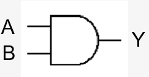

# Overzicht van een logische poort

## Wat is een logische poort?

- Een logische poort is een *digitale elektronische schakeling die werken volgens de (booleaanse) logica*.
- Logische poorten zijn de *elementaire bouwstenen* van computers en andere digitale apparaten.
- Ze zijn *opgebouwd uit elektronische componenten* zoals *transistors, weerstanden en dioden*. Eén poort is opgebouwd uit o.a. 1 tot 10 transistors.
- Ze bevinden zich meestal *in grote hoeveelheden samen op IC’s (Integrated Circuits)*, maar zijn *ook als afzonderlijke bouwstenen* beschikbaar.

## Waarheidstabel

Om waarde van de uitgang weer te geven

### voorbeeld

Waarheidstabel:

| A   | B   | Y   |
| --- | --- | --- |
| 0   | 0   | 0   |
| 0   | 1   | 0   |
| 1   | 0   | 0   |
| 1   | 1   | 1   |
### Opbouw waarheidstabel

*Aantal kolommen = aantal ingangen + aantal tussenwaarden + uitgang*
In het voorbeeld 2 ingangen, nl. A en B en 1 uitgang, nl. Y

*Aantal rijen = titelrij + 2 tot de (aantal ingangen)*
  *=> rijen altijd in oplopende binaire volgorde*
In het voorbeeld 2 ingangen, nl. A en B dus 1 + 2² = 5 rijen

# Basispoorten

## soorten

NIET-poort
EN-poort
OF-poort
XOR-poort
NEN-poort
NOR-poort

![[Pasted image 20241015182803.png]]
## NIET-poort (NOT)

De logische NIET of **NOT** => komt overeen met *complementeren in de logica*

![[Pasted image 20241015180112.png]]

| In  | Uit |
| --- | --- |
| 0   | 1   |
| 1   | 0   |
Opmerking:
- Signaal zwart => binair 0
- Signaal rood   => binair 1

## EN-poort (AND)

De logische EN of **AND** => *komt overeen met Λ in de logica*

![[Pasted image 20241015180619.png]]

| A   | B   | AΛB |
| --- | --- | --- |
| 0   | 0   | 0   |
| 0   | 1   | 0   |
| 1   | 0   | 0   |
| 1   | 1   | 1   |
## OF-poort (OR)
De logische OF of **OR** => *komt overeen met V in de logica*

![[Pasted image 20241015180940.png]]

| A   | B   | AVB |
| --- | --- | --- |
| 0   | 0   | 0   |
| 0   | 1   | 1   |
| 1   | 0   | 1   |
| 1   | 1   | 1   |
## Exclusieve OF (XOR)

De logische Exclusieve OF of **XOR** => *wordt ook nog genoteerd als <ins>V</ins>*
Functie => *uitgang is 1 als de ingangen verschillend zijn* en is *0 als de ingangen gelijk zijn*.

![[Pasted image 20241015181641.png]]

| A   | B   | A<ins>V</ins>B |
| --- | --- | -------------- |
| 0   | 0   | 0              |
| 0   | 1   | 1              |
| 1   | 0   | 1              |
| 1   | 1   | 0              |
## Logische NEN (NAND)

De logische NEN of **NAND** => *komt overeen met Λ+ complementeren in de logica*

![[Pasted image 20241015181945.png]]

| A   | B   | AΛ+B |
| --- | --- | ---- |
| 0   | 0   | 1    |
| 0   | 1   | 1    |
| 1   | 0   | 1    |
| 1   | 1   | 0    |
## Logische NOF (NOR)

De logische NOF of **NOR** => *komt overeen met V+ complementeren in de logica*

![[Pasted image 20241015182230.png]]

| A   | B   | AV+B |
| --- | --- | ---- |
| 0   | 0   | 1    |
| 0   | 1   | 0    |
| 1   | 0   | 0    |
| 1   | 1   | 0    |
# De tri-state buffer

Dit is een speciale poort die gebruikt wordt *om kortsluiting (x/  ) op bussen te vermijden*

Twee ingangen:
- *stuurlijn*
- *signaal*

![[Pasted image 20241015182528.png]]

**Functie**:
- *Stuurlijn = 1* => signaal *wordt doorgegeven* naar de uitgang
- *Stuurlijn = 0* => signaal *wordt niet doorgegeven*

- Tri-state buffers worden in paren gebruikt

