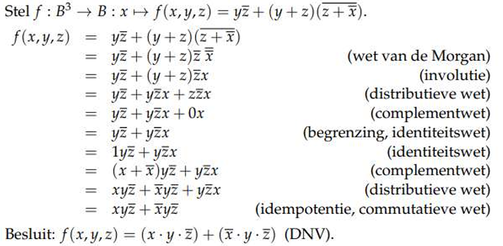
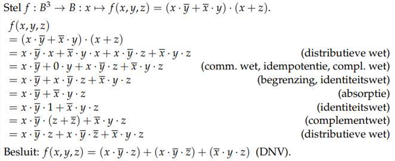
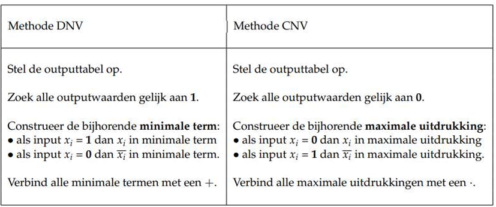
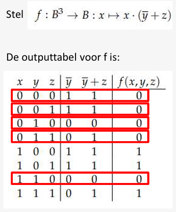

# Boolese uitdrukkingen

We beperken ons tot de eenvoudigste Boole-algebra, de minimale Boole-algebraB.

## Minimale Boole-algebra:
- Een Boole-algebra is 1 specifieke algebraïsche structuur

- Een Boole-algebra B bestaat uit:
	- een *verzameling* **S** die *minstens twee constanten*, **0 en 1**, bevat
	  **S = {0,1}**
	  
	- *twee binaire operatoren* op S: **+ en ·** ; 
  
| +   | 0   | 1   |     | .   | 0   | 1   |
| --- | --- | --- | --- | --- | --- | --- |
| 0   | 0   | 1   |     | 0   | 0   | 0   |
| 1   | 1   | 1   |     | 1   | 0   | 1   |
* Een Boole-algebra B bestaat uit:
	- *een unaire operator* op S: **− (complement)**.
  $$\overline{1} = 0$$
    $$\overline{0} = 1$$

## Uitdrukken

*Twee Boolese functies zijn gelijk als ze voor dezelfde input steeds dezelfde output hebben*.

**Uitdrukken is mogelijk met:**
### Een functie

⨏(𝑥,  𝑦, 𝑧) =(𝑥+𝑦) .z

### Waarheidstabel

| x   | y   | z   | ⨏(𝑥,  𝑦, 𝑧) |
| --- | --- | --- | -------------- |
| 0   | 0   | 0   | 0              |
| 0   | 0   | 1   | 0              |
| 0   | 1   | 0   | 0              |
| 0   | 1   | 1   | 1              |
| 1   | 0   | 0   | 0              |
| 1   | 0   | 1   | 1              |
| 1   | 1   | 0   | 0              |
| 1   | 1   | 1   | 1              |

# Minimale en maximale Boolese uitdrukkingen

## Minimale uitdrukking

### Voorbeelden Minimale uitdrukkingen:

| in één variabele | in twee variabele x en y      | in drie variabelen x, y en z               |
| ---------------- | ----------------------------- | ------------------------------------------ |
| $$x$$            | $$x.y$$                       | $$x.y.z$$                                  |
|                  |                               | $$x.y.\overline{z}$$                       |
|                  | $$x.\overline{y}$$            | $$x.\overline{y}.z$$                       |
|                  |                               | $$x.\overline{y}.\overline{z}$$            |
| $$\overline{x}$$ | $$\overline{x}.y$$            | $$\overline{x}.y.z$$                       |
|                  |                               | $$\overline{x}.y.\overline{z}$$            |
|                  | $$\overline{x}.\overline{y}$$ | $$\overline{x}.\overline{y}.z$$            |
|                  |                               | $$\overline{x}.\overline{y}.\overline{z}$$ |

## Maximale uitdrukking

### Voorbeelden Maximale uitdrukkingen:

| in één variabele | in twee variabele x en y      | in drie variabelen x, y en z               |
| ---------------- | ----------------------------- | ------------------------------------------ |
| $$x$$            | $$x+y$$                       | $$x+y+z$$                                  |
|                  |                               | $$x+y+\overline{z}$$                       |
|                  | $$x+\overline{y}$$            | $$x+\overline{y}+z$$                       |
|                  |                               | $$x+\overline{y}+\overline{z}$$            |
| $$\overline{x}$$ | $$\overline{x}+y$$            | $$\overline{x}+y+z$$                       |
|                  |                               | $$\overline{x}+y+\overline{z}$$            |
|                  | $$\overline{x}+\overline{y}$$ | $$\overline{x}+\overline{y}+z$$            |
|                  |                               | $$\overline{x}+\overline{y}+\overline{z}$$ |

# De disjunctieve normaalvorm: DNV

DNV = **som*** *van* **minimale** *uitdrukkingen*
Korts mogelijke variant

bv: $$(x.\overline{y}.z)+(\overline{x}.y.\overline{z})+(x.y.\overline{z})$$
## 2 methoden om uitdrukkingen om te zetten in DNV

1. Uitdrukking herleiden mbv axioma’s en eigenschappen 
2. Aflezen uit waarheidstabel

### 1 ste Methode: gebruik axioma’s en eigenschappen

voorbeeld1: 
voobeeld2: 
### 2 de Methode: gebruik de uitvoertabel

In het lang uitgeschreven:
- Elke rij heeft een minimale term. Deze bevat 𝑥 voor de rijen waar 𝑥 = 1, en 𝑥̅ waar 𝑥 = 0. Analoog voor y, z, …
- Tel deze minimale term op met de output voor elke rij

| $$x$$ | $$y$$ | $$𝑓(𝑥,𝑦) =𝑥+\overline{𝑥}𝑦$$ |                                                                              |
| ----- | ----- | --------------------------------- | ---------------------------------------------------------------------------- |
| $$0$$ | $$0$$ | $$0$$                             | $$𝑓(0,0) .(\overline{𝑥}.\overline{𝑦}) = 0.(\overline{𝑥}.\overline{𝑦})$$ |
| $$0$$ | $$1$$ | $$1$$                             | $$𝑓(0,1) .(\overline{𝑥}.𝑦) = 1.(\overline{𝑥}.𝑦)$$                       |
| $$1$$ | $$0$$ | $$1$$                             | $$𝑓(1,0) .(𝑥.\overline{𝑦}) = 1.(𝑥.\overline{𝑦})$$                       |
| $$1$$ | $$1$$ | $$1$$                             | $$𝑓(1,1) .(𝑥.𝑦) = 1.(𝑥.𝑦)$$                                             |

$$𝑓(𝑥,𝑦) = 0.(\overline{𝑥}.\overline{𝑦}) +  1.(\overline{𝑥}.𝑦) + 1.(𝑥.\overline{𝑦}) + 1.(𝑥.𝑦)$$
**Oplossing**:
$$𝑓(𝑥,𝑦) = (\overline{𝑥}.𝑦)+(𝑥.\overline{𝑦})+(𝑥.𝑦)$$

**Conclusie**: 
- *We hebben enkel de rijen nodig waar de uitvoer* **1** *is*

# De conjunctieve normaalvorm: CNV

CNV = **product** *van* **maximale** *uitdrukkingen*
Korts mogelijke variant

bv: $$(x+\overline{y}+z).(\overline{x}+y+\overline{z}).(x+y+\overline{z})$$

Elke uitdrukking heeft 1 CNV
- Gelijke uitdrukkingen hebben gelijke CNV’s
- 2 methodes om de CNV te bepalen: 
	- met eigenschappen
	- via waarheidstabel

### Methode: gebruik de uitvoertabel

De oplossingsmethode voor het bepalen van de CNV komt overeen met de duale werkwijze: dezelfde stappen worden doorlopen als DNV maar *telkens de duale vorm ervan*.

 

#### voorbeeld:

 

 

# Vereenvoudigen van Boolese uitdrukkingen

De DNV en CNV van een functie zijn uniek. Gelijke functies hebben eenzelfde DNV en CNV. CNV en DNV kunnen soms verder vereenvoudigd worden: 

#### voorbeeld:

$$𝑓(𝑥,𝑦) = (𝑥.\overline{𝑦})+(𝑥.𝑦) ⟺ 𝑓(𝑥,𝑦) = 𝑥$$

**Een Boolese functie vereenvoudigen kan o.a. door te steunen op de axioma’s en eigenschappen van een Boole-algebra. **

Welke axioma’s en eigenschappen er moeten toegepast worden om de uitdrukking te vereenvoudigen, daar zijn geen vaste regels voor. Het beste resultaat vindt men via **trial and error**.
