# Doel

Een Karnaugh-diagram is een *hulpmiddel om logische expressies te vereenvoudigen*. Het wordt veel gebruikt in de digitale elektronica en informatica om expressies met booleaanse variabelen, zoals *AND, OR en NOT, makkelijker te maken door* **overbodige termen weg te halen**. Zo kun je schakelingen met zo min mogelijk componenten opbouwen, wat tijd, ruimte en kosten bespaart.

# Werking

### 1. Aanmaken van Karnaugh-diagram

Een Karnaugh-diagram (ook wel K-map genoemd) is een raster met vakjes waarin je de mogelijke uitkomsten van een logische functie invult. Elk vakje stelt een specifieke combinatie van de invoervariabelen voor, meestal weergegeven als 1 of 0. Het aantal vakjes in de K-map wordt bepaald door het aantal variabelen in de functie:

- Bij 2 variabelen heb je een 2x2-raster (4 vakjes).
- Bij 3 variabelen heb je een 2x4-raster (8 vakjes).
- Bij 4 variabelen heb je een 4x4-raster (16 vakjes), enzovoort.

### 2. Invullen van het diagram

Je vult de K-map in door de uitkomst (1 of 0) van de logische functie in elk vakje te zetten voor elke combinatie van de invoervariabelen. Zo zie je een overzicht van alle uitkomsten van de functie.

### 3. Vereenvoudigen door groeperen

Zodra je het diagram hebt ingevuld, kun je gaan zoeken naar groepen van 1's (of soms 0's, afhankelijk van wat je probeert te vereenvoudigen). Deze groepen zijn blokken van aangrenzende vakjes, zoals paren, kwarten, of octetten. Door deze groepen te maken, kun je gedeelten van de functie samenvoegen en vereenvoudigen.

De regel is:

- Groepen moeten bestaan uit **1**, 2, 4, 8, enzovoort (dus **machten van 2**).
- **Zo groot mogelijk**
- **enkel 1**, geen 0
- **ze mogen overlappen**
- Ze moeten rechthoekig zijn en **mogen door de randen van het diagram heen "wrappen"** (*je kunt vakjes aan de randen als aangrenzend beschouwen*).

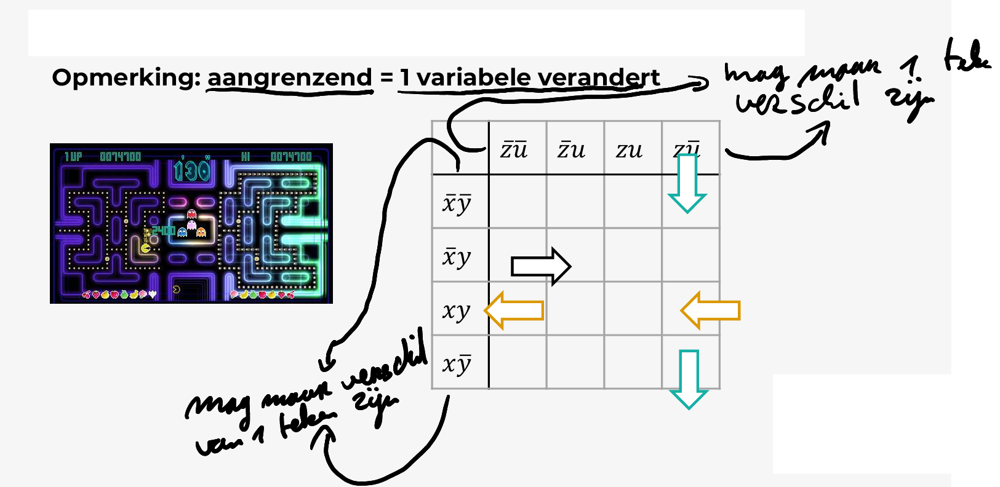

# DNV (Disjunctieve Normaal Vorm) VS CNV (Congjectieve Normaal Vorm)
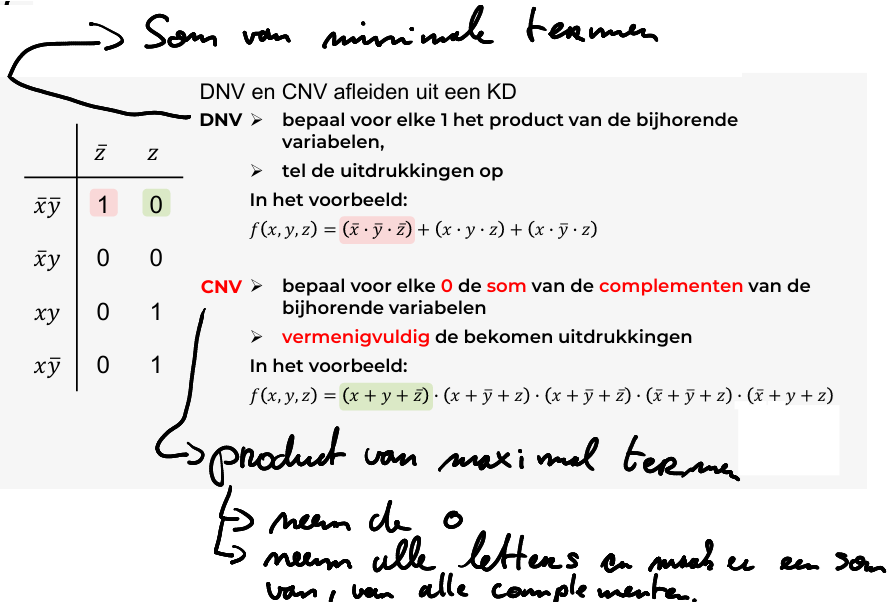

# Vereeenvoudigen
## Methode 1 : Met minimale uitdrukking
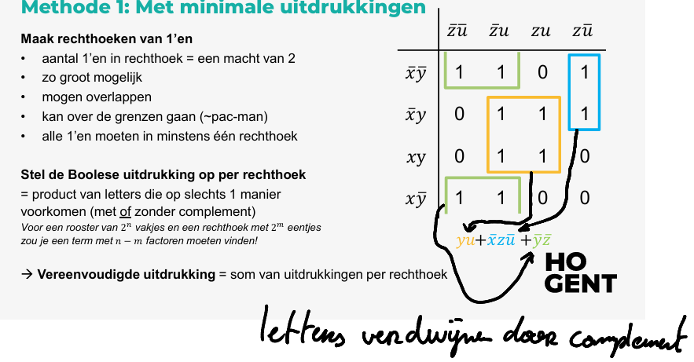
## Methode 2 : Met maximale uitdrukking
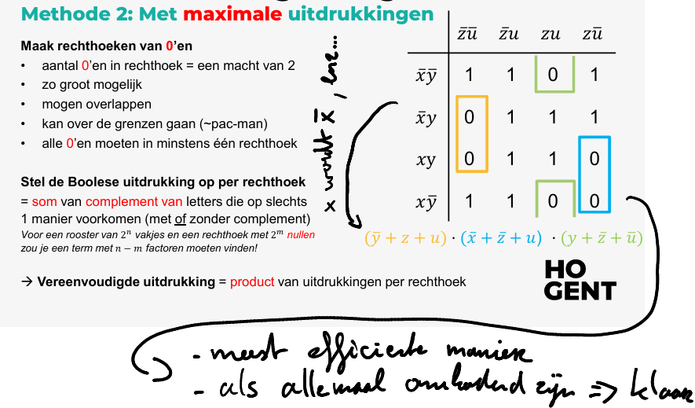
## Met 5 variabelen
### Methode 1
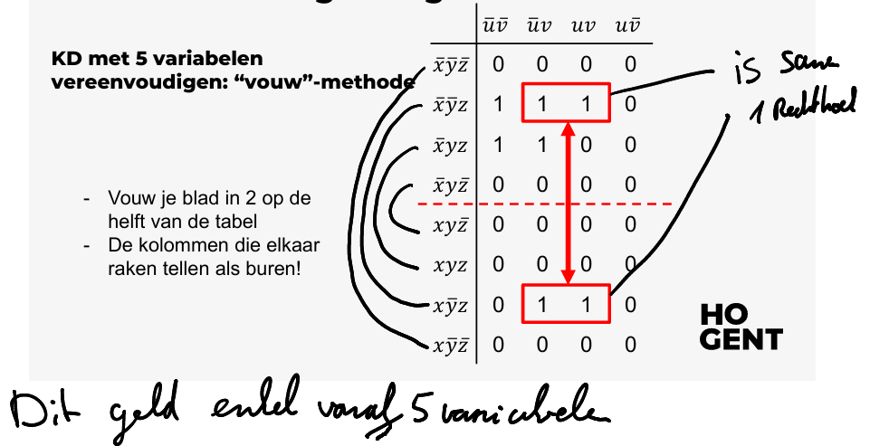
### Methode 2
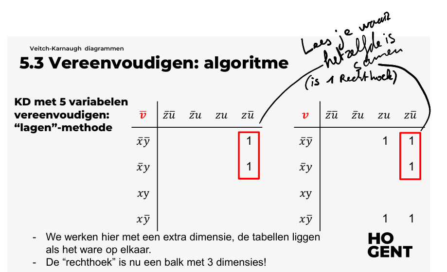

# Voorbeelden
### Voorbeeld met 1 variabelen
*Opgave:*

$$f(x)=x$$
*Stap 1*

| $$x$$ | $$f(x)$$ |
| ----- | -------- |
| $$0$$ | $$f(0)$$ |
| $$1$$ | $$f(1)$$ |
*stap 2*

| $$\overline{x}$$ | $$x$$    |
| ---------------- | -------- |
| $$f(0)$$         | $$f(1)$$ |

*stap 3*

*oplossing*

$$x$$

### Voorbeeld met 2 variabelen

*Opgave:*

$$f(x,y)=x+y$$
*Stap 1*

| $$x$$ | $$y$$ | $$f(x,y)$$ |                               | $$x+y$$ |
| ----- | ----- | ---------- | ----------------------------- | ------- |
| $$0$$ | $$0$$ | $$f(0,0)$$ | $$\overline{x}.\overline{y}$$ | $$0$$   |
| $$0$$ | $$1$$ | $$f(0,1)$$ | $$\overline{x}.y$$            | $$1$$   |
| $$1$$ | $$0$$ | $$f(1,0)$$ | $$x.\overline{y}$$            | $$1$$   |
| $$1$$ | $$1$$ | $$f(1,1)$$ | $$x.y$$                       | $$1$$   |

*Stap 2*

| DNV              | $$\overline{y}$$ | $$y$$      |
| ---------------- | ---------------- | ---------- |
| $$\overline{x}$$ | $$f(0,0)$$       | $$f(0,1)$$ |
| $$x$$            | $$f(1,0)$$       | $$f(1,1)$$ |
*Stap 3*

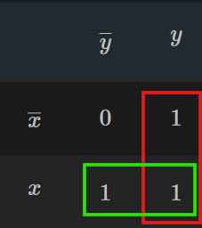

groepen van 1's (DNV)

$$Rood: y + \overline{x} + x = y$$
$$Groen: x + \overline{y} + y = x$$
Breng Rood en groen samen als een product:

*oplossing*

$$x.y$$

*extra: DNV uit halen*

$$f(x,y)=f(0,0)\overline{x}.\overline{y}+f(0,1)\overline{x}.y+f(1,)x.\overline{y}+f(1,1)\overline{x}.\overline{y}$$
$$DNV=0.\overline{x}.\overline{y}+1.\overline{x}.y+1.x.\overline{y}+1.\overline{x}.\overline{y}$$
$$=1.\overline{x}.y+1.x.\overline{y}+1.\overline{x}.\overline{y}$$
$$=\overline{x}.y+x.\overline{y}+\overline{x}.\overline{y}$$
### Voorbeeld met 3 variabelen
$$f(x,y,z)=x.y.z+x.\overline{y}.z+\overline{x}.\overline{y}.\overline{z}$$

| DVN                         | $\overline{z}$ | $z$ |
| --------------------------- | -------------- | --- |
| $\overline{x}.\overline{y}$ | 1              | 0   |
| $\overline{x}.y$            | 0              | 0   |
| $x.y$                       | 0              | 1   |
| $x.\overline{y}$            | 0              | 1   |

*oplossing*
$$=x.z+\overline{x}.\overline{y}.\overline{z}$$

# Boole algebra en logisch schakelingen

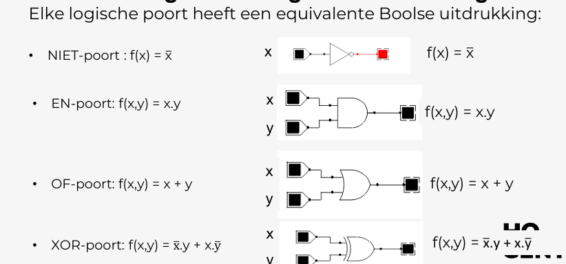

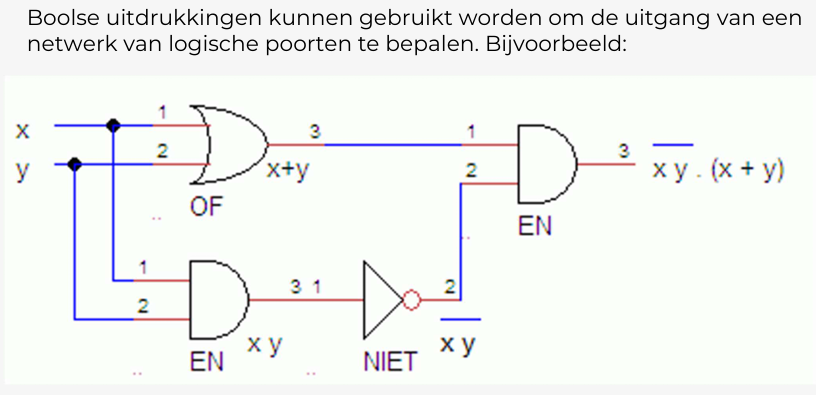

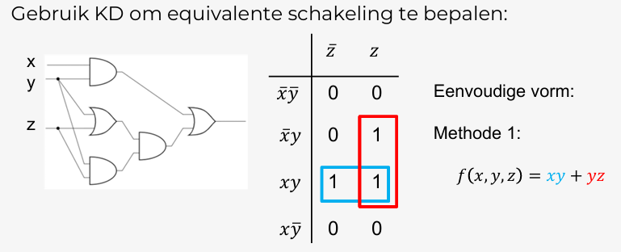

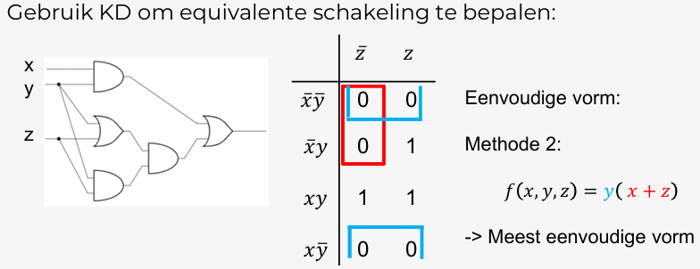

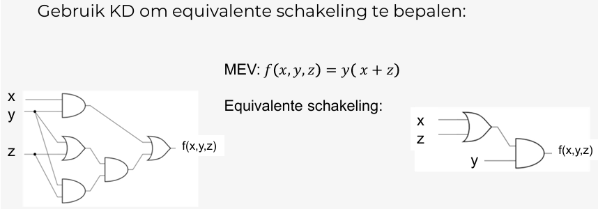
# Oefeningen

Nog toe te voegen
# Eigen notities:
![[./attachments/HT5oefenbladen.pdf]]

