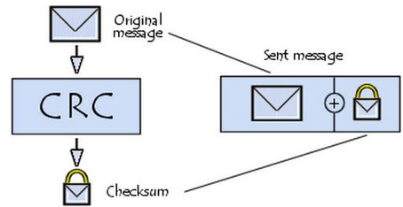
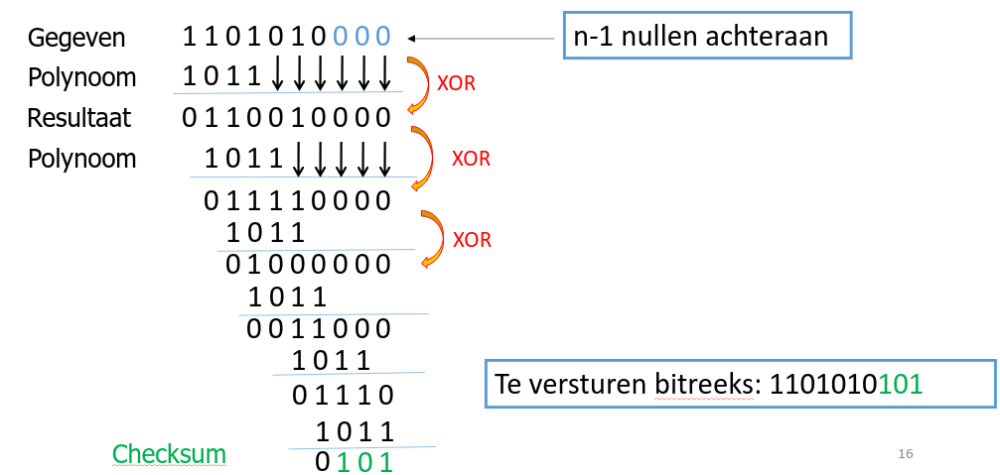
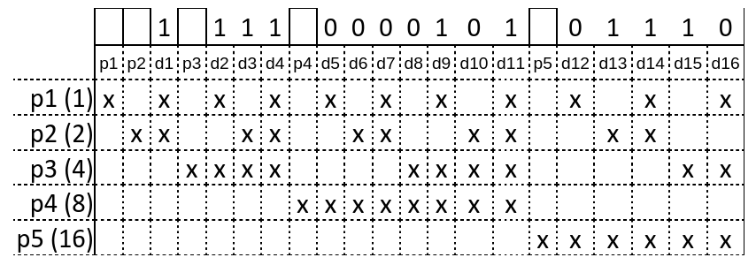
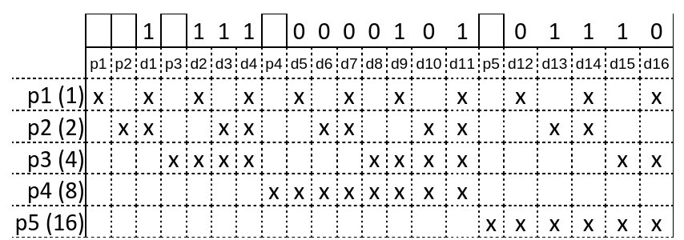
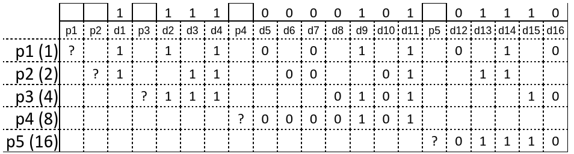
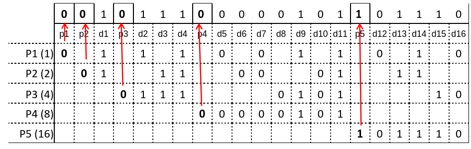
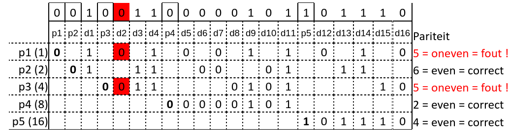

# Inleiding

- Wanneer informatie digitaal wordt opgeslagen, verstuurd en verwerkt, onder de vorm van binaire code, dan wordt deze informatie vertaald naar een rij van nullen en enen.​
- Bij het uitwisselen van informatie over een (communicatie)kanaal, kan het voorkomen dat niet alle bits correct worden doorgegeven. (door oa ruis)
- Het kanaal kan een telefoonlijn, satellietverbinding, een computerverbinding, …. zijn.

## Algemeen communicatiesysteem ziet er als volgt uit:​
1. Verzender maakt een bericht​
2. Bericht wordt gecodeerd​
3. Gecodeerd bericht wordt verstuurd over het communicatiekanaal​
4. Gecodeerd bericht wordt ontvangen​
5. Gecodeerd bericht wordt gedecodeerd naar het originele bericht​
6. Bericht wordt afgeleverd aan de ontvanger​

##  Er kunnen verschillende soorten ruis onderscheiden worden:​
- Natuurlijke ruis: ​
    - verstoring van de communicatie door natuurlijke fenomenen zoals bliksem, temperatuurschommelingen, …​
   - Toevallige ruis: ​
    - onvoorspelbare vormen van communicatiebeschadiging zoals magnetische fluctuaties, slijtage van een communicatiedrager​
   - Opzettelijke ruis: ​
    - het doelbewust verstoren van de communicatie zoals het inrichten van stoorsignalen.​

- We hebben dus *nood aan een systeem om bitfouten, op zijn minst, te detecteren*.​
    
- We maken hiervoor gebruik van de codeertheorie, waarbij er extra (overtollige) informatie wordt toegevoegd aan het (oorspronkelijk) bericht, zodat we kunnen achterhalen of het ontvangen bericht correct is of niet.​
    
- We maken onderscheid tussen:​
    - **Foutdetecterende codes**​
	    - - Deze codes ontdekken dat er fouten zijn, als het ontvangen bericht verschillend is van het verzonden bericht​
	    - Deze codes corrigeren de fouten niet. Dit is ook niet altijd nodig:​
	    - Voorbeeld: videocodering algoritmes: fout zal een spikkeltje of een blokje in één beeld veroorzaken  niet zo erg
    - **Foutverbeterende codes**
	    - Deze codes ontdekken dat er fouten zijn, als het ontvangen bericht verschillend is van het verzonden bericht​
	    - Deze codes verbeteren, daarnaast, het ontvangen bericht zodat het oorspronkelijk bericht gedecodeerd wordt. De voorwaarde is wel dat er niet te veel fouten zijn opgetreden.​

## Foutverbeterende codes:​

- We maken onderscheid tussen:​
    - Backward Error Correction​
	    - Bij fouten worden de gegevens opnieuw opgevraagd aan de verzender​
	    - Beperking: enkel wanneer vertraging of latency voor de toepassing niet belangrijk is of wanneer het opnieuw versturen zéér snel kan. Bijvoorbeeld bij TCP, Ethernet, …​
    - Forward Error Correction​
	    - Algoritmen die in staat zijn om de correcte bitreeks te reconstrueren uit de vervormde bitreeks​
	    - Voorbeeld: Hammingcode​
   - Om codes te vergelijken maken we gebruik van de performantie van de code:​
    - Definitie: ​
	    - Performantie: de verhouding van de hoeveelheid bitfouten die kunnen ontdekt worden t.o.v. de hoeveelheid extra informatie die toegevoegd moet worden aan de te versturen(of op te slagen) bitreeks​

# Foutdetecterende codes​

## Herhaling:​

- Algoritme: oorspronkelijke bitreeks wordt n-keer herhaald​
- Voorbeeld:​
	   - n = 2​
    - oorspronkelijke data : 1011101​
    - versturen : 10111011011101​
    - ontvangen : 10111011001101​
- Af te spreken:​
	   - lengte van de oorspronkelijke bitreeks​
    - n (aantal herhalingen)​
- Performantie: zéér laag​
	- zeer veel extra informatie

## Pariteit:​

- Twee vormen: oneven pariteit en even pariteit​
- Algoritme:​
    - één bit ( = pariteitsbit) toevoegen, zodanig dat de binaire code​
	    - een oneven aantal 1-bits (of logische enen) heeft (oneven pariteit)​
	    - een even aantal 1-bits (of logische enen) heeft (even pariteit)​

- Waarde van de pariteitsbit is afhankelijk van de gekozen pariteit:​
    - Oneven pariteit:​
	    - Aantal 1-bits van de binaire code = oneven => pariteitsbit = 0​
	    - Aantal 1-bits van de binaire code = even => pariteitsbit = 1​
	    - => totaal aantal 1-bits is steeds oneven​
	
    - Even pariteit:​
	    - Aantal 1-bits van de binaire code = even => pariteitsbit = 0​
	    - Aantal 1-bits van de binaire code = oneven => pariteitsbit = 1​
	    - => totaal aantal 1-bits is steeds even​
	
- Voorbeeld: oneven pariteit​
    - oorspronkelijke data : 1011101 => code heeft 5 logische enen​
    - versturen : 10111010​
	    - 5 eentjes = oneven aantal => pariteitsbit = 0 ​
    - ontvangen : 10101010​
	    - ontvangen code heeft maar 4 eentjes => pariteitsbit zou 1 moeten zijn maar is 0 => FOUT!​
    
- Af te spreken:​  
	- lengte van de oorspronkelijke bitreeks​
    - oneven of even​
    - plaats van de pariteitsbit (voor- of achteraan)​
        
- Performantie: laag​
    - alle oneven aantallen bitfouten worden herkend​
    - alle even aantallen bitfouten worden NIET herkend​
    - positief: weinig extra bits

## Controlegetal - Rest als controlegetal:​

- Algoritme: de rest (modulo) bij deling door een priemgetal vormt een controlegetal.​
- Voorbeeld:​
	   - Bankrekeningnummer : BE05 3631 9038 5475 ​
    - Laatste 2 cijfers vormen het controlegetal​
    - Controlegetal wordt bepaald door 3631903854 te delen door het grootste priemgetal, dat kleiner is dan 100 , namelijk 97. De rest van deze deling vormt hierbij het controlegetal en wordt achteraan toegevoegd. Hier is het controlegetal = 75 .​
    - Indien de rest 0 is, wordt 97 als controlegetal gebruikt.​
    - Let op: BE05 = landcode (BE: in dit geval België) + extra en anders berekend controlegetal (05) voor het IBAN-formaat.​

## Controlegetal - Cyclic Redundancy Check:​

- Definitie: Er wordt gebruik gemaakt van een “soort” deling, waarbij de rest van de deling als “checksum” wordt meegestuurd.

- Voordelen:​
    - veel krachtiger dan pariteit​
    - eenvoudig in hardware te implementeren​
	    - Wordt zéér veel gebruikt in computerhardware: harde schijven, Ethernet, IP, TCP, USB, PCI-e, Wifi, …

- Definitie: Er wordt gebruik gemaakt van een “soort” deling, waarbij de rest van de deling als “checksum” wordt meegestuurd.​
    - Deler wordt de “Polynoom” genoemd​
    
- Algoritme (voorbeeld zie volgende slide):​
    1. Voeg n-1 nullen achteraan toe aan de data met n = de lengte van de polynoom​
    2. Schrijf de polynoom links onder de data bit-reeks met extra nullen, meest linkse bit van polynoom is 1, die van data erboven ook. ​
    3. Voer nu een bitsgewijze “exclusieve OF” of “XOR”-bewerking uit​
    4. De polynoom wordt opnieuw links onder het bekomen resultaat geschreven, en de XOR bewerking wordt herhaald​
    5. Stop wanneer het bekomen resultaat korter is dan de polynoom. (leading zeros niet meegeteld)​
    
- Voor het versturen, vervang de initieel toegevoegde nullen door de bekomen CRC checksum rest. Bij ontvangst MOET deze bij deling door de polynoom als rest 0 geven.​

Merk op: Twee meest linkse posities (bij data en polynoom) = 1 (Moest de meest linkse van de polynoom een nul zijn, zou dit een polynoom zijn van een graad lager…. ) Dit zorgt ervoor dat we altijd minstens één positie naar rechts opschuiven bij volgende deling.

- Algoritme (voorbeeld) : gegeven bitreeks = 1101010 en polynoom = 1011(n=4)​

- Te versturen: 1101010101​
- Stel: er is een communicatie fout opgetreden waardoor 3 bits in het midden verkeerd zijn ontvangen.​
- Algoritme (voorbeeld) : ontvangen bitreeks = 1100100101
		verstuurd:   1101010101
		Ontvangen: 1100100101
		Polynoom:   1011
		Controle:      100 ipv de verwachte 000

- Op de bestemming wordt de CRC-waarde nagerekend en indien deze niet resulteert in alléén nullen (= 000, in bovenstaand voorbeeld) is er een fout of zijn er meerdere fouten opgetreden

- Af te spreken:​
    - lengte van de oorspronkelijke bitreeks​
    - de polynoom​
	- plaats van de checksum (voor- of achteraan)​
     ​
- Performantie: goed​
	   - n-bit CRC zal in elke bitreeks een “single error burst” (aaneengesloten bitreeks) van n bit kunnen detecteren​
    - weinig extra bits: één minder dan de lengte van de polynoom

## Oefeningen op foutdetecterende codes​

### Oefening 1: Bereken de CRC checksum voor

| Data​         | Polynoom​ | Oplossing​ |
| ------------- | --------- | ---------- |
| 1101101​      | 10011​    | 1001​      |
| 111010010​    | 10011​    | 0101​      |
| 100111001011​ | 100101​   | 01100​     |

### Oefening 2: Zijn deze doorgestuurde gegevens correct ?​

| Data​             | Polynoom​ | Oplossing​  |
| ----------------- | --------- | ----------- |
| 11001001101010​   | 100101​   | Nee: 01101​ |
| 1011011010100111​ | 101011​   | Ja!​        |

### Oefening 3: Bereken de CRC checksum van de onderstaande bitreeksen met de polynoom 110101​
    
- 110001110​
    
- 11001010011​
    
- 10000101110000011​
    ​
#### Oplossing oefening 3: Bereken de CRC checksum van de onderstaande bitreeksen met de polynoom 110101​
    
- 110001110 => 10011​
    
- 11001010011 => 00110​
    
- 10000101110000011 => 11100​
### Oefening 4: Je ontvangt onderstaande bitreeksen van een zender die een CRC checksum achter de originele gegevens meestuurt. De zender gebruikt de polynoom 10111. Geef aan of de ontvangen bitreeksen correct of fout zijn.​
    
- 11001110100110000​
    
- 1001101100001100​
    
- 1000111000110000​

#### Oplossing oefening 4: Je ontvangt onderstaande bitreeksen van een zender die een CRC checksum achter de originele gegevens meestuurt. De zender gebruikt de polynoom 10111. Geef aan of de ontvangen bitreeksen correct of fout zijn.​
    
- 11001110100110000 => nee: 1100​
    
- 1001101100001100 => nee: 0001​
    
- 1000111000110000 => ja!​

# Foutverbeterende codes ​

## Hammingcode​

 ### Algoritme (aan de hand van een voorbeeld):​
    
- Beschouw de te verzenden binaire code of bitreeks 1111000010101110. Deze databits worden genummerd van 1 tot 16 en aangeduid als d1 tot d16. ​
	- Let op: de bitnummering begint vanaf 1! Niet vanaf 0 ​
    
| 1   | 1   | 1   | 1​  | 0   | 0   | 0   | 0   | 1   | 0   | 1   | 0   | 1   | 1   | 1   | 0   |
| --- | --- | --- | --- | --- | --- | --- | --- | --- | --- | --- | --- | --- | --- | --- | --- |
| d1  | d2  | d3  | d4  | d5  | d6  | d7  | d8  | d9  | d10 | d11 | d12 | d13 | d14 | d15 | d16 |
    
- De Hammingcode voegt op specifieke plaatsen pariteitsbits, als controlebits toe tussen de databits. De pariteitsbits worden aangeduid als p1, p2, p3, p4, p5. De posities van deze pariteitsbits in de gecodeerde bitreeks worden bepaald door de machten van 2 en wel als volgt:​
    - p1  op positie 20 = 1​
	- p2  op positie 21 = 2​
	- p3  op positie 22 = 4​
	- p4  op positie 23 = 8​
	- p5  op positie 24 = 16​
	- … ​
    
Aantal pariteitsbits is afhankelijk van de lengte van de code​

|     |     | 1   |     | 1   | 1   | 1​  |     | 0   | 0   | 0   | 0   | 1   | 0   | 1   |     | 0   | 1   | 1   | 1   | 0   |
| --- | --- | --- | --- | --- | --- | --- | --- | --- | --- | --- | --- | --- | --- | --- | --- | --- | --- | --- | --- | --- |
| p1  | p2  | d1  | p3  | d2  | d3  | d4  | p4  | d5  | d6  | d7  | d8  | d9  | d10 | d11 | p5  | d12 | d13 | d14 | d15 | d16 |
- p1 staat dus op positie 1 van de gecodeerde bitreeks, p2 op de 2de positie, enz.​
- We eindigen met p5 omdat p6 op positie 32 zou moeten staan, wat buiten het bereik valt​ 
- Vervolgens wordt de waarde bepaald van de pariteitsbits, p1 tot en met p5. Hiervoor gebruikt de Hammingcodering ALTIJD EVEN pariteit! Om dit te bepalen wordt er volgend schema opgesteld:

 
#### Schema: ​
- De structuur van de Hammingcode met de databits reeds ingevuld, staat bovenaan​ 
- Links staat een kolom met de gebruikte pariteitsbits in de Hammingcode met tussen haakjes de positie van deze bits in de code. Dit getal wordt ook gebruikt om aan te duiden welke bits van belang zijn per rij. Deze zijn aangeduid in het schema met een kruisje:​
    
##### Voorbeeld: ​
- p1 (1) vertrekkend van p1, 1 bit, dan telkens 1 bit niet en 1 bit wel​
- p2 (2) vertrekkende van p2, 2 bits wel, dan 2 bits niet enz.​
- …..

- Om de waarde van de pariteitsbits te bepalen, worden eerst per lijn de databits gekopieerd op de posities aangeduid door de kruisjes:

- Vervolgens, onderzoeken we per lijn de pariteit, die even moet zijn. Dus we tellen het aantal eentjes per lijn en als dit even is, wordt de pariteitsbit op die lijn 0, anders wordt deze 1.

![[Pasted image 20241217175855.png]]

De bekomen waardes van de pariteitsbits worden tussen de databits geplaatst:

- De te verzenden Hammingcode van de (oorspronkelijke) bitreeks is dus ​
001011100000101101110

 ### Correctie van een fout:​
    
- Gegeven is de ontvangen Hammingcode van een bitreeks : 001001100000101101110.​
- Aan de hand van het schema, achterhalen we waar de fout zich bevindt.​

- We noteren de posities van de pariteitsbits met een oneven aantal eentjes in hun rij en tellen deze op. In het voorbeeld dus: p1 en p3 of dus 1 + 4 = 5 dus de 5e bit in de Hammingcode is verkeerd (in het rood aangeduid). ​
    
- De verbeterde Hammingcode = 001011100000101101110​
    
- Het gedecodeerd bericht of de oorspronkelijke binaire code wordt bekomen door het verwijderen van de pariteitsbits = 1111000010101110 ​

- Af te spreken:​
    - lengte van de oorspronkelijke bitreeks​
    ​
- Performantie: Niet zo goed​
    - De Hammingcode was het eerste algoritme voor Forward Error Correction.​
    - Er zijn ondertussen performantere algoritmes ontwikkeld:​
    - Veterbi algoritme (GSM, Wifi)​
    - Turbo codes (G3 netwerken)​
    - LDPC - Low Density Parity Check (DVB-S2, Ethernet 10GBase-T)​

## Oefeningen

### Oefening 1:​
- Codeer volgende gegevens met de Hamming code​
		1. 1100111​ 
		2. 0001100​    
		3. 1000111​    

### Oefening 2: ​   
- Geef de oorspronkelijke data van “10001100100”​  
		
### Oefening 3: ​
- Geef de oorspronkelijke data van “01100111011” beter “11100110011”

### Oefening 4:​
- Je ontvangt onderstaande gegevens die met de Hamming code gecodeerd werden. Corrigeer eventuele fouten en geef de oorspronkelijke data. ​
		1. 10010010011 ​
		2. 11010100110 ​    
		3. 00000000100 ​    
		4. 11110100111 ​

###  Oefening 5:​
- Gegeven: Een ontvanger krijgt de volgende Hammingcode binnen  ​
		0 0 0 0 0 1 0 1 1 1 1 1 ​
- Gevraagd: ​
		1. Omcirkel in bovenstaande code de pariteitsbits of controlebits. ​  
		2. Maak een kruisje over de foutieve bit. Indien er geen foute bit is noteer dan “geen”: ………………………..​
	    3. Geef de oorspronkelijke binaire code: …………………………….​

## Oplossingen

- Oplossing oefening 1: ​
	1. 01111001111​
    2. 01010011100​    
	3. 11100001111​

- Oplossing oefening 2:​
    - Pariteitsbit 1, 2, 8 fout => 11e bit is fout. Oorspronkelijke data: 0110101​

- Oplossing oefening 3:​
	1. Pariteitsbit 1 en 8 fout => 9e bit fout. Oorspronkelijke data: 1011111​    
	2. Geen fouten in pariteitsbits. Oorspronkelijke data: 1011011​

- Oplossing oefening 4:​
	1. Pariteitsbit 1 en 2 fout => 3e bit fout. Oorspronkelijke data: 1001011​    
	2. Pariteitsbit 2 fout. Oorspronkelijke data: 0010110​
	3. Pariteitsbit 1 en 8 fout => 9e bit fout. Oorspronkelijke data: 0000000​
	4. Pariteitsbit 2 en 8 fout => 10e bit fout. Oorspronkelijke data: 1010101​
    
- Oplossing oefening 5:​    
	- Pariteits bits op machten van 2: positie 1, 2, 4, 8​
	- Pariteitsbit 2 en 8 fout => 10e bit fout​
	- Oorspronkelijke data: 00101011

