# Definities en notaties

## Definitie:
    
- Een functie f is een reële functie indien zijn bron- en doelverzameling beide ℝ zijn.
- D.w.z. dat voor elke x ∈ ℝ hoogstens één y ∈ℝ bestaat zodanig dat f(x) = y.
- We noemen **x** het **argument** terwijl **y** het **beeld** wordt genoemd.

## Notaties

$$f:ℝ→ℝ:x↦y$$
$$Ƒ(ℝ,ℝ) = \text{de verzameling van alle reële functies}$$

## Intuïtieve definities:
    
**Domein** van een reële functie f of **dom** f, is de *verzameling van alle argumenten x waarvoor een beeld y in de functie f bestaat*. Het domein is een doelverzameling van de bronverzameling, dus niet noodzakelijkerwijs gelijk aan de bronverzameling van f.
    
**Beeld** van een reële functie f of **bld** f, is de *verzameling van alle beelden y die in de functie f bestaan*. Het beeld is een doelverzameling van de bronverzameling, dus niet noodzakelijkerwijs gelijk aan de bronverzameling van f.

- Een reële functie f is **continu** in een punt a van haar domein, indien de grafiek van f geen ‘sprong’ vertoont in de onmiddellijke omgeving van het punt (a, f(a)).
- In het ander geval spreekt men van een **discontinuïteit** in het punt a.
    
**Definitie:**

- Een **nulpunt x** van een reële functie f is een element van het domein van f waarvoor de functiewaarde gelijk is aan 0, dus **f(x) = 0** . Een functie kan meerdere nulpunten hebben.

**Definitie:**
    
- Een veeltermfunctie is een reële functie met als functievoorschrift:
$$f:ℝ→ℝ:x↦f(x) = a_ₙxⁿ + a_{ₙ-₁}xⁿ⁻¹ + ... + a_₁x + a_₀ \text{ met }n ∈ ℕ \text{ en }a_ᵢ∈ℝ(i=0...n),a_ₙ≠0 $$
- We noemen **n de graad van f(x)** en an xn de hoogste graadsterm.
  **Voorbeeld**: $g:ℝ→ℝ:x↦g(x)= x³-x-2$
  
- Het *domein van om het even welke veeltermfunctie is steeds ℝ*

# Constante functies

## Algemeen
    
- Een **constante functie** f is een veelterm functie van de **0-de graad**.
    
- **Definitie:**
    - Een **constante functie** is een functie waarbij de functiewaarde constant is.
$$f:ℝ→ℝ:x↦f(x) = a \text{ }\text{ }\text{ }\text{ }\text{ }\text{ }\text{ }(a∈ℝ)$$
- **Grafiek:**
    - Is een rechte met vergelijking y = a, evenwijdig met de X-as.
$$f:ℝ→ℝ:x↦ a \text{ }(a∈ℝ)$$
### De grafiek

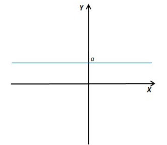

- Nulpunten:
	- Als $a≠0$ dan zijn er geen nulpunten.
	- Als $a=0$ dan zijn er oneindig veel nulpunten: voor alle $x∈ℝ$ geldt $f(x)=0$.

- Snijpunt met de y-as:
	- $(0,a)$
	- (verklaring: $f(0)=a$)

### Eigenschappen:

- **Het domein**
  $dom(f)=ℝ$
  
- **Het beeld**:
  $bld(f)=\{a\}$

- De constante functie $f$ is continu in ℝ.

- **Tekenverloop:**
	- De constante functie $f:x↦a$is:
		- positief in gans ℝ als en slechts als $a>0$.
		- nul in gans ℝ als en slechts als $a=0$.
		- negatief in gans ℝ als en slechts als $a>0$.

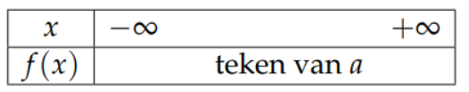

## Oefening

- De constante functie f bevat het koppel (2, −3). Bepaal deze functie f en berekenen f(5) en f(-8).

# Lineaire functies of functies van de eerste graad

 ## Definitie:

De functie $f:ℝ→ℝ:x↦ax +b$ waarbij a en b gegeven reële getallen zijn en $a ≠ 0$ noemt men **een functie van de eerste graad** of **lineaire functie**.

### Eigenschappen:

####  Het domein
  $dom(f)=ℝ$
  
####  Het beeld:
  $bld(f)=ℝ$

- De lineaire functie $f$ is continu in ℝ.

 #### Nulpunt:
  $x∈ℝ$ waarvoor geld $f(x)=0$ , i.e. $x=-b/a$
  
 (i.e. (afkorting van het Latijnse _id est_) "dat wil zeggen" of "met andere woorden")
 
### Grafiek:

- Schuine rechte die de X-as snijdt met vergelijking **y =** **ax** **+ b,** met a de richtingscoëfficient of **rico**

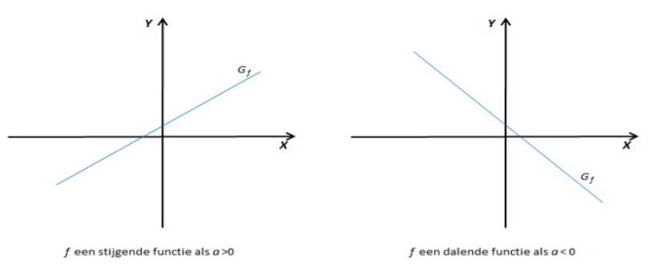

###  Tekenverloop:

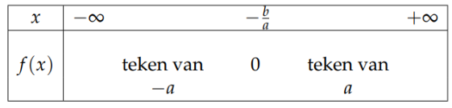

## Voorbeeld

Beschouw: $f:ℝ→ℝ:x↦3x-6$

### Eigenschappen:

- $dom(f) = ℝ$
- $bld(f) = ℝ$
- nulpunt: $x=2$
  Verklaring: $3x-6=0⇔3x=6⇔x=2$
- snijpunt met y-as: $(0,-6)$
  Verklaring: $f(0)=3.0-6=-6$
- rico $=3>0$,
  de grafiek van $f$ is een stijgende rechte

### Tekenverloop

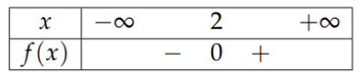

### Grafiek

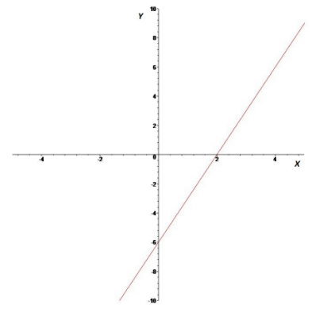

## De vergelijking van een rechte door twee gegeven punten

### Voorbeeld:

- Zij f een eerste graadsfunctie die door de punten (3,4) en (5,8) gaat.
    - Er geldt:

$$y=\frac{y_₂-y_₁}{x_₂-x_₁}.(x-x_₁)+y_₁$$
$$⇔y=\frac{8-4}{5-3}.(x-3)+4$$
$$⇔y=2.(x-3)+4$$
$$⇔y=2x-6+4$$
$$⇔y=2x-2$$
$$of$$
$$f:ℝ→ℝ:x↦y = 2x-2$$

## De vergelijking van een rechte door één gegeven punt en gegeven **rico**.

$$f:ℝ→ℝ:x↦y = rico.(x-x_₁)+y_₁$$
- **Voorbeeld:**
    - Zij g een rechte met rico = -2 en (3, 1) ∈ g.

$$y=rico.(x-x_₁)+y_₁$$
$$⇔y=-2.(x-3)+1$$
$$⇔y=2x+6+1$$
$$⇔y=2x+7$$
$$\text{en dus}$$
$$g:ℝ→ℝ:x↦y =-2x+7$$

## Oefeningen

1. Onderzoek het verloop van de volgende functies van de eerste graad. Teken de grafiek van de functie.
	1. $f:x↦x-3$
	2. $g:x↦x-\frac{3}{5}x+7$

2. Bepaal het snijpunt van de grafieken van
	1. $f:x↦-3x -2$ en $g:x↦-5x+6$
	2. $f:x↦-\frac{2}{3}x+\frac{1}{2}$ en $g:x↦\frac{7}{6}x-\frac{1}{6}$
	3. $f:x↦x\sqrt{3}+6\sqrt{3}$ en $g:x↦2x\sqrt{3}$

3. (Bron [De Pauw et al., 2009]) Een object beweegt tijdens een computerspel langs een rechte lijn van het punt A met coördinaten (0,20) naar het punt B met coördinaten (15,30). Zoek de vergelijking van deze rechte. Als het voorwerp in het punt C met coördinaten (30,40) komt, beweegt de speler de joystick, zodat het object 90° naar links draait en in een rechte lijn verder beweegt. Vind de vergelijking van de rechte die het nieuwe pad voorstelt. Teken bovendien beide rechten in één assenstelsel. Tip: Twee rechten f en g, de rechte f met rico = r1 en de rechte g met rico = r2, staan loodrecht op elkaar enkel en alleen als r1 * r2 = -1.

# Functies van de tweede graad

## Definitie
    
- Een functie $f:ℝ→ℝ:x↦ax²+bx+c$ waarbij a, b en c gegeven reële getallen zijn en waarvoor a ≠ 0, noemt men **een functie van de tweede graad**.
    
## Eigenschappen
### Grafiek:

- De grafiek van de functie $f:ℝ→ℝ:x↦ax²+bx+c$ is een **parabool** $P$.
- De verticale rechte met vergelijking $x=-b/2a$ is de symmetrie-as. Het snijpunt van de symmetrie-as en de parabool is de **top**. Dit is het punt met coördinaten $(-b/2a,f(-b/2a))$.
	- Als $a>0$ is $P$ een dal parabool.
	- Als $a<0$ is $P$ een bergparabool.

### Extrema’s:
    
- Een tweedegraadsfunctie heeft **één** **extremum**, nl. **de top van de parabool**.
- Bij een **dalparabool** is dit extremum **een minimum**, bij een **bergparabool** **een maximum**.

### Domein: 
$$dom(f=ℝ)$$

### Beeld

#### Dalparabool

$$bld()f=[f(-b/2a),+∞[$$
#### Bergparabool

$$bld()f=]f-∞,(-b/2a)]$$

### Nulpunten:

* **Discriminant**
	- De discriminant is een waarde die wordt gebruikt om de aard van de oplossingen van een kwadratische vergelijking te bepalen. Een kwadratische vergelijking heeft de algemene vorm:
$$ax^2 + bx + c = 0$$
	- De discriminant ($\Delta$ of D) wordt berekend met de formule:

$$D=\Delta = b^2 - 4ac$$

- **De waarde van de discriminant D geeft aan of er 0, 1 of 2 nulpunten zijn**.
	- $D > 0$: *er zijn twee verschillende nulpunten*
	$$x_₁ = \frac{-b + \sqrt{D}}{2a}$$
	$$x_₂ = \frac{-b - \sqrt{D}}{2a}$$
	- $D = 0$: *er is juist één nulpunten*
	$$x_₁ = x_₂ = -\frac{b}{2a}$$
	- $D < 0$: *er is geen nulpunt: de parabool ligt volledig boven of onder de X-as*

- **Eens de wortels (= nulpunten) gekend zijn, kunnen we de kwadratische vergelijking als volgt ontbinden in factoren**
$$ax²+bx+c=a(x-x_₁)(x-x_₂)$$

	
### Tekenonderzoek
#### D > 0
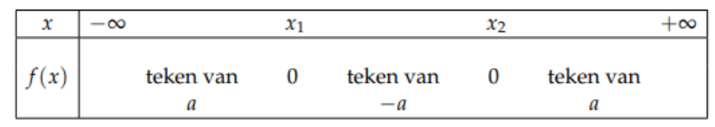
#### D = 0
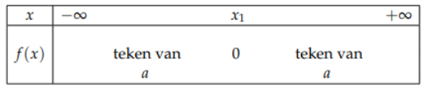
#### D < 0
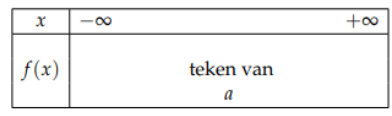

### Grafiek

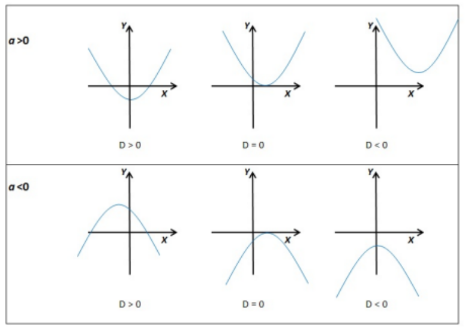

## Voorbeeld

### Beschouw
$$f:ℝ→ℝ:x↦3x² -4x +1$$
### Domein
$$dom(f) = ℝ$$
### Beeld
$$bld(f)=[-1/3,+∞[ \text{ }\text{ }\text{ }\text{ (want f(top)=-1/3)}$$

### Nulpunten
$$D = b² -ac=(-4)²-4.3.1=16-12=4>0$$
$$x_₁,_₂=\frac{-b±\sqrt{D}}{2a}=\frac{-4±\sqrt{4}}{6}=\frac{4±2}{6}$$
$$dus$$
$$x_₁=\frac{4-2}{6}=\frac{1}{3}$$
$$x₂=\frac{4+2}{6}=1$$
### Snijpunten met Y-as

$$(0,1)\text{ } (verklaring: f(0) = 1)$$

### Top
- Voor de top $t(t_x,t_y)$ geldt
$$t_x = \frac{-b}{2a}= \frac{4}{6}= \frac{2}{3}$$
$$en$$
$$t_y = f(t_x)= 3(\frac{2}{3})²-4.\frac{2}{3}+1= 3.\frac{4}{9}-\frac{8}{3}+1= \frac{4}{3}-\frac{8}{3}+1=-\frac{1}{3}$$
### Tekenonderzoek:

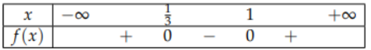

### Grafiek
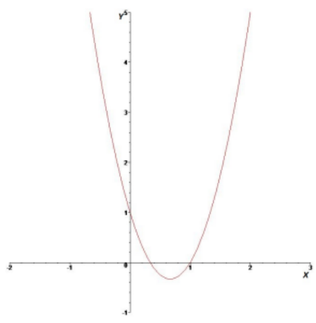

## Oefeningen

### 1. Bespreek de volgende tweedegraadsfuncties
- a) $f:x↦-x²+2x+5$
- b) $f:x↦3x²+2x+5$
- c) $f:x↦-x²+2x-1$
- d) $f:x↦3x²+4x$
- e) $f:x↦x²-9$

### 2. Oefening 2
#### Gegeven
$$f:ℝ→ℝ:x↦f(x) = -2x²-2x+4$$
$$g:ℝ→ℝ:x↦g(x) = -4x$$
#### Gevraagd 
- a) Bepaal het domein, het beeld, de nulpunten en het snijpunt met de Y-as van f en g.
- b) Teken de grafiek van f en g en duid de snijpunten aan op de grafiek.
- c) Bereken de snijpunten van f en g analytisch en controleer.

