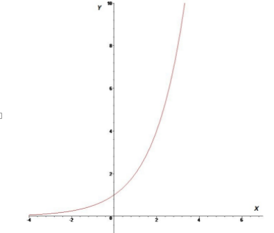
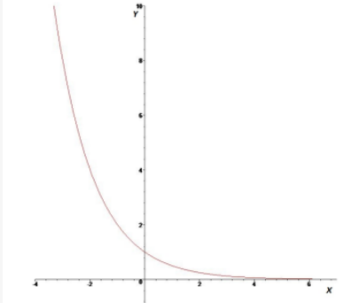
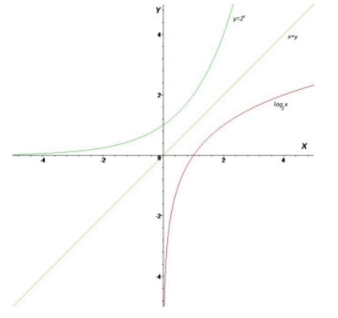
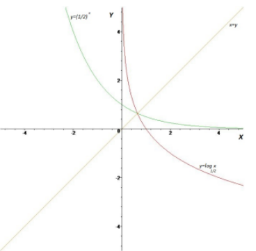

# De exponentiële functie

## Definitie

De exponentiële functie met grondtal $a(a∈ℝ_0^+\text{\\}\{1\})$
$$f:ℝ→ℝ:x↦a^x$$

- Voor $a > 1$ is de exponentiële functie strikt stijgend.
- Voor $0<a<1$ is de exponentiële functie strikt dalend.

## Voorbeelden

### Voorbeeld 1: **De exponentiële functie f met grondtal a = 2.**
$$f:ℝ→ℝ:x↦f(x)=2^x$$
- De volgende punten behoren tot de functie f:

| x   | f(x)              |
| --- | ----------------- |
| -2  | $2^{-2}=1/2²=1/4$ |
| -1  | $2^{-1}=1/2$      |
| 0   | $2⁰=1$            |
| 1   | $2^1=2$           |
| 2   | $2^2=4$           |

#### De grafiek

### Voorbeeld 2: **De exponentiële functie f met grondtal a = 1/2.**

$$f:ℝ→ℝ:x↦f(x)=\frac{1}{2}^x$$
- De volgende punten behoren tot de functie f:

| x   | f(x)                          |
| --- | ----------------------------- |
| -2  | $(\frac{1}{2})^{-2}=2²=4$     |
| -1  | $(\frac{1}{2})^{-1}=2$        |
| 0   | $(\frac{1}{2})⁰=1$            |
| 1   | $(\frac{1}{2})^1=\frac{1}{2}$ |
| 2   | $(\frac{1}{2})^2=\frac{1}{4}$ |

#### De grafiek

## Eigenschappen

$$\text{Stel }f:ℝ→ℝ:x↦f(x) = a^x \text{ }\text{ }\text{ }\text{ }\text{ }\text{ }\text{ }(a∈ℝ_0^+\text{\\}\{1\})\text{ dan geldt}$$

- $f(0)=1$ , onafhankelijk het grondtal a.
- $f(1) = a$
- $dom f = ℝ$
- $bld f =ℝ_0^+$
- De functie $f$ is continu in ℝ
- $a > 1$:
	- $\lim\limits_{x \mapsto +\infty} f(x)=+\infty$
	- $\lim\limits_{x \mapsto -\infty} f(x)=0$
	  de X-as is een horizontale asymptoot aan de kant van $-\infty$
- 0 < a < 1:
	-  $\lim\limits_{x \mapsto -\infty} f(x)=+\infty$
	- $\lim\limits_{x \mapsto +\infty} f(x)=0$
	  de X-as is een horizontale asymptoot aan de kant van $+\infty$

*Asymptoten zijn rechte lijnen waar een grafiek steeds dichterbij komt, maar die nooit volledig worden geraakt of gekruist.* Ze helpen ons begrijpen hoe een functie zich gedraagt als de invoerwaarden (xx) extreem groot of klein worden (positief of negatief), of als de functie een specifieke waarde nadert.
## De natuurlijke exponentiële functie

 ### Definitie:
    
- De natuurlijke exponentiële functie met **natuurlijk grondtal** **e** (e = 2, 7182818284 . . .) is
$$exp:ℝ→ℝ:x↦exp(x)=e^x$$
# De logaritmische functie

## Voorbeelden

### Voorbeeld 1: **De logaritmische functie f met grondtal a = 2**

$$exp:ℝ→ℝ:x↦f(x)=log_{2}x$$

#### Tabel met enkele punten:

| $x$ | $2^x$ |     | $x$ | $log_{2}x$                            |
| --- | ----- | --- | --- | ------------------------------------- |
| -2  | 1/4   |     | 1/4 | $log_{2}\frac{1}{4}=log_{2}2^{-2}=-2$ |
| -1  | 1/2   |     | 1/2 | $log_{2}\frac{1}{2}=log_{2}2^{-1}=-1$ |
| 0   | 1     |     | 1   | $log_{2}1=log_{2}2^{0}=0$             |
| 1   | 2     |     | 2   | $log_{2}2=log_{2}2^{1}=1$             |
| 2   | 4     |     | 4   | $log_{2}4=log_{2}2^{2}=2$             |

#### Grafiek

$$\text{Grafiek van de logaritmische functie met grondtal 2 en haar inverse}$$

### Voorbeeld 1: **De logaritmische functie f met grondtal a = 1/2**

$$exp:ℝ→ℝ:x↦f(x)=log_{\frac{1}{2}}x$$#### Tabel met enkele punten:

| $x$ | $\frac{1}{2}^x$ |     | $x$ | $log_{\frac{1}{2}}x$                                                |
| --- | --------------- | --- | --- | ------------------------------------------------------------------- |
| -2  | 4               |     | 4   | $log_{\frac{1}{2}}4=log_{\frac{1}{2}}(\frac{1}{2})^{-2}=-2$         |
| -1  | 2               |     | 2   | $log_{\frac{1}{2}}2=log_{\frac{1}{2}}(\frac{1}{2})^{-1}=-1$         |
| 0   | 1               |     | 1   | $log_{\frac{1}{2}}1=log_{\frac{1}{2}}(\frac{1}{2})^{0}=0$           |
| 1   | 1/2             |     | 1/2 | $log_{\frac{1}{2}}\frac{1}{2}=log_{\frac{1}{2}}(\frac{1}{2})^{1}=1$ |
| 2   | 1/4             |     | 1/4 | $log_{\frac{1}{2}}\frac{1}{4}=log_{\frac{1}{2}}(\frac{1}{2})^{2}=2$ |
#### Grafiek

$$\text{Grafiek van de logaritmische functie met grondtal }\frac{1}{2}\text{ en haar inverse}$$

## Eigenschappen

$$\text{Stel }f:ℝ→ℝ:x↦f(x) = log_a{x} \text{ }\text{ }\text{ }\text{ }\text{ }\text{ }\text{ }(a∈ℝ_0^+\text{\\}\{1\})\text{ dan geldt}$$

- $f(1)=0$ , onafhankelijk het grondtal.
- $f(a) = 1$
- $dom f = ℝ_0^+$
- $bld f =ℝ$
- De functie $f$ is continu in $ℝ_0^+$
- $a > 1$:
	- $\lim\limits_{x \mapsto +\infty} f(x)=+\infty$ (stijgende functie)
	- $\lim\limits_{x \mapsto > 0} f(x)=-\infty$ (De y-as as is een verticale asymptoot)
- 0 < a < 1:
	-  $\lim\limits_{x \mapsto -\infty} f(x)=-\infty$ (delende functie)
	- $\lim\limits_{x \mapsto > 0} f(x)=+\infty$ (De y-as id een verticale asymptoot)

## Bijzondere logaritmen

### 3 Soorten
#### De Briggse logaritmische functie
- Is een logaritmische functie met grondtal 10
$$log:ℝ_0^+→ℝ:x↦y=\text{log x}$$
#### De Neperiaanse of natuurlijke logaritmische functie
- Is een logaritmische functie met grondtal e
- Grondtal e is een wiskundige constante die ongeveer gelijk is aan 2,718 Het is een irrationaal getal dat vaak voorkomt in wiskunde, natuurkunde, en economie, vooral in situaties met exponentiële groei of verval.
$$ln:ℝ_0^+→ℝ:x↦y=\text{ln x}$$
#### De logaritmische functie met grondtal 2
- Is een logaritmische functie met grondtal 2 wordt genoteerd als $\text{lg x}$
$$lg:ℝ_0^+→ℝ:x↦y=\text{lg x}$$

### Voorbeelden

- $lg(8)=log_2 8= log_2 2³ = 3$
- $lg(2)=log_2 2= log_2 1 = 1$
- $lg(1)=log_2 1= log_2 0 = 0$
- $lg(1/8)=log_2 1/8= log_2 2^{-3} = -3$
- $lg(1/2)=log_2 1/2= log_2 2^{-1} = -1$
- $ln(e)=log_e e¹= 1$
- $log(1000)=log_{10}{10}³=3$

### Rekenregels

$$\text{Stel a,b}∈ℝ_0^+\text{\\}\{1\}\text{, dan geldt}$$
$$log_a (x.y)=log_a x+log_a y$$
$$log_a \frac{x}{y}=lag_a x-log_a y$$
$$log_a(x^p)=p.log_ax \text{ }\text{ }\text{ }\text{(met p ∈ ℚ)}$$
$$log_a a=1$$
$$log_a x = \frac{log_b x}{log_b a}$$
#### Voorbeelden
- $log_4 2+log_4 8=log_4 (2.8)=log_4 16=log_4 4^2=2$
- $log_3 36-log_3 4=log_3 (36/4)=log_4 9=log_4 3^2=2$
- $2.log_4 8x=log_4(8^2)=log_4 64=log_4 4^{3}=3$
- $log_7 7=1$
- $log_{25} 125=\frac{log_5 125}{log_5 25}=\frac{log_5 5³}{log_5 5²}=\frac{3}{2}$

# Oefeningen

## 1. Bepaal het domein en beeld van $f$. Geef de nulpunten, het snijpuntmet de $y$-as en eventuele asymptoten van $f$. Teken tenslotte de grafiek van $f$.
- a) $f:ℝ→ℝ:x↦y=log_3 x$
- b) $f:ℝ→ℝ:x↦y=2+3^x$
- c) $f:ℝ→ℝ:x↦y=-2log_3 x$

## 2. Stel
- $f:ℝ→ℝ:x↦ln(exp(x))$
- $g:ℝ→ℝ:x↦exp(ln(x))$

Wat is het verschil tussen de functie $f$ en de functie $g$?

## 3. Angry birds
Je speelt het spel Angry Birds. Je moet door boze vogels te lanceren zoveel mogelijk groene varkens raken. Je krijgt hiervoor drie pogingen. Er bevinden zich groene varkens op de punten met coördinaten: (1,4), (2,4), (2,5), (3,1), (3,3), (3,4), (3,5), (4,2), (4,4).  
Je mag drie vogels lanceren: een bruine, rode en blauwe vogel.

- **De bruine vogel** start in het punt met coördinaten (1,3) en vliegt volgens de grafiek van de functie $f$ met
  $f(x)=2x+1$.
- **De rode vogel** start in het punt met coördinaten (2,0) en vliegt volgens de grafiek van de functie $g$ met
  $g(x)=log⁡(x−1)$.
- **De blauwe vogel** start in het punt met coördinaten (2,3) en vliegt volgens de grafiek van de functie $h$ met
  $h(x)=−x2+6x−5$.

**Beantwoord de volgende vragen:**

a) Maak een tekening van de gegeven situatie. Duid eveneens de vlucht van elke vogel op jouw tekening aan.

b) Raakt elke vogel een varken? Zo ja, welk varken wordt geraakt door welke vogel?  
Motiveer jouw antwoord a.d.h.v. een analytische berekening. Verifieer vervolgens of jouw berekeningen overeenstemmen met jouw tekening.

c) De varkens met coördinaten (2,4) en (4,2) zijn nog niet geraakt. Je krijgt twee extra vogels om specifiek deze varkens uit te schakelen. Beide vogels vertrekken van het punt met coördinaten (1,2). Ze vliegen allebei volgens een rechte lijn.  
Geef voor beide vogels de vergelijking van de functie die hun vlucht volgt.

## Oefening 4

### 1. Los op naar $x∈ℝ$
- a) $5^x= 1/5$
- b) $7^x=\sqrt[4]{49}$
- c) $2^x=8$
- d) $4^x=1/16$

### 2 Bereken
- a) $e^3=...$
- b) $e^{-\frac{2}{3}}=...$
- c) $5^6=...$
- d) $log⁵ 25=...$
- e) $log_2 \frac{1}{16}=...$
- f) $log_2 40=...$
- g) $log_4 8+log_4 2=...$
- h) $ln25=...$
- i) $log \sqrt{10}=...$
- j) $log_2 3-log_2 6=...$

### 3. Los op naar $x∈ℝ$
- a) $log_2 x=log_2 5 + log_2 \frac{1}{3}$
- b) $log_3 (2x+1) = 1 + log_3 2$
- c) $log_3 x = 1$
- d) $log_5 x=0$
- e) $log_8 x=-\frac{2}{3}$
- f) $log_3 x=3.log_3 4$
- g) $log x²=log 2⁵ - log2$
- h) $log_2 x=3.log_2 3 - \frac{1}{3}.log_2 27$

### 4. Geef het domein, het beeld, eventuele nulpunten en snijpunten met de $y$-as van de gegeven functies. Noteer eventuele asymptoten. Schets de grafiek
- a) $f:ℝ→ℝ:x↦f(x)=exp(x_2)$
- b) $g:ℝ→ℝ:x↦g(x) = exp(x^2 -4)$

### 5. Geef het domein, het beeld, eventuele nulpunten en snijpunten met de $y$-as van de gegeven functies. Noteer eventuele asymptoten. Schets de grafiek
- a) $f:ℝ→ℝ:x↦f(x)=ln(x_2)$
- b) $g:ℝ→ℝ:x↦g(x) = ln(x^2 -4)$

