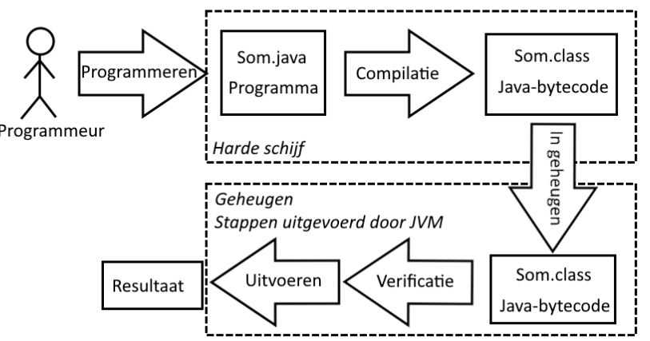

# Doelstellingen

-  kan een eenvoudige Java-applicatie opbouwen en begrijpt de achterliggende werking van het Java platform
- kan in- en uitvoerstatements schrijven
- kan primitieve datatypes gebruiken
- kan gebruikmaken van rekenkundige operatoren met voorrangsregels

# Inleiding

- Java is één van de meest gebruikte programmeertalen. Zie [TIOBE](http://www.tiobe.com/tiobe-index/).
	- Draait op 51 miljard devices
	- Java ondersteunt
		- Object georiënteerd programmeren
		- Generiek programmeren
		- Functioneel programmeren
	- Java heeft reeds veel releases gekend en wordt nog steeds up-to-date gehouden: [evolutie van Java](https://nl.wikipedia.org/wiki/Java_(programmeertaal)#Releases)

# Ontstaansgeschiedenis Java

- 1991 ontworpen door Sun Microsystems
- 1993 release van Mosaic browser (ontwerpers herschreven de compiler (C -> Java))
- 1994 Release webrunner (eerste op Java gebaseerde browser (Dit bleek samen met de gratis verspreiding een succesverhaal te zijn!))
- voor 1995 had bijna niemand ervan gehoord


## Oplossing die men in Java toepast:

1. Elk Java-programma wordt door een compiler vertaald naar een soort *TUSSENTAAL(= Java-bytecode)*, die betrekkelijk dicht tegen machinecode aanleunt.
2. De tussentaal wordt dan verder vertaald voor een specifieke processor, door een programma genaamd de *JAVA VIRTUAL MACHINE (JVM)*. Een JVM is een tamelijk klein programma (256Kb), vermits het vertalen niet zo’n grote klus is want Java-bytecode is een kleine taal (weinig keywords).


### Java-bytecode

Gezien een processor enkel zijn eigen specifieke machinecode begrijpt, die onleesbaar is voor de mens (0 en 1), moeten we een programma schrijven in een *hogere programmeertaal* (Cobol, Java,Pascal, ...). 

Een *compiler* (vertaler) zal het programma omzetten naar een specifieke machinecode.
Omdat de vertaler kan vertalen naar verschillende soorten machinecode, zal het programma *platformafhankelijk* zijn (platform = combinatie van een bepaald type processor met een bepaald besturingssysteem).

# Java-applicaties

## Eigenschappen

1. *een applicatie is een Java-programma*, net als de programma’s op je eigen computer (vb. Word, tekenprogramma,...)
2. *een applicatie wordt bewaard en uitgevoerd op lokale PC*
3. *een applicatie is uitvoerbaar op elke PC mits JVM* (geen webbrowser nodig, zoals bij een JAVA-applet)
4. *een applicatie kan bestanden op schijf maken, lezen en verwijderen*


## Eerste voorbeeld

```java

package cui;//een project delen we op in packages, voorlopig enkel cui = console-user-interface

import java.lang.*;//mag weggelaten worden, want wordt als enige package uit de Java-API automatisch geïmporteerd

public class Som extends Object// extends Object mag ook weggelaten worden gezien ELKE klasse in Java erft van Object, de moederklasse

{
	publicstaticvoidmain(String[]args)
	{
		intx=2,y=3,som;
		som=x*x+y*y;System.out.println("Som = "+som);
	}
}

```

Uitvoer:

Som = 13

## De 5 fasen




1. *Met een editor het java-programma intypen en bewaren met extensie .java* → **Som.java**
2. *Het programma compileren met het commando javac.* Het resultaat is een file met de extensie.class (= *bytecode*). → **javac Som.java → geeft Som.class**
3. *Het programma (de .class-file) wordt geladen in het geheugen.*
4. *De bytecode wordt geverifieerd* (om te kijken of de .class-files geldige java bytecode bevatten).
5. *Het programma wordt uitgevoerd, door gebruik te maken van de Java-vertaler (JVM), via het commando java* → **java Som**

### JIT compilatie

Java-applicaties worden door een compiler vertaald naar bytecode voor de JVM. De eerste JVM’s voerden deze bytecode uit door middel van pure interpretatie ("live" vertalen en uitvoeren). Omdat deze methode langzaam was ging men gebruikmaken van *JIT-compilatie (Just in Time)*, een vorm van compilatie die plaatsvindt tijdens de uitvoering van een computerprogramma.


## Het java platform


  
*Java Runtime Environment (=JRE)*  is een combinatie van de JVM met de Java API.

## Wat heb je nodig

1. *een editor*, bijv. Notepad, Wordpad of Textpad (Textpad)
2. *een compiler*
3. een Java Virtual Machine Compiler + JVM = *Java Development Kit* [(JDK)]([Content Server Error (oracle.com)](https://www.oracle.com/technetwork/java/javase/downloads/index.html))

## Integrated Development Environment

### Een IDE bevat:

1. *Code editor* (maakt gebruikt van JDK)
2. *Compiler, linker*
3. *Debugger*
4. *Helpfuncties*⇒ de ontwikkelingstijd voor het schrijven van een programma wordt sterk gereduceerd.

IDE’s: [NetBeans](http://netbeans.org/), [Eclipse](http://eclipse.org/), [JBuilder](http://www.borland.com/jbuilder), [IntelliJ IDEA](http://www.jetbrains.com/idea), [JDeveloper](https://www.oracle.com/application-development/technologies/jdeveloper.html), ..

# Uitvoerstatements in een Java-applicatie
In deze paragraaf leren we print, println en printf gebruiken.

## Eerste Java-applicatie: een zin afdrukken

```java
/* Welcome1.java
 * Een eerste programma in Java. */ //①
//②
package cui; //③

public class Welcome1 //④
{ //⑤
    // main methode begint de uitvoering van Java applicatie ①
    public static void main(String[] args) //⑥
    { 
        System.out.println("Welcome to Java Programming!"); //⑦

    } //⑧ // einde methode main
} // einde klasse Welcome1
```

### Verklaring
#### ① Commentaar in Java
-  Beschrijft stukken code
- Verhoogt de leesbaarheid van het programma
- Wordt door de Java-compiler genegeerd. Er zijn **3 soorten commentaar** in Java:
	1. **Eén-lijn commentaar** : `// Commentaar op 1 lijn`
	2. **Commentaar die uit meerdere lijnen bestaat** `/* Dit is een traditioneel comment. Het kan over meerdere lijnen gesplitst worden */`
	3. J**avadoc commentaar** : `/** … */`: het **javadoc-programma leest deze vorm van commentaar en maakt documentatie in HTML-formaat**

#### ② Blanco regel buiten de klasse
- Programmeurs zetten blanco regels in hun programma zodat het gemakkelijker kan gelezen worden.
- Witregels, spaties en tabs (= wit-ruimte karakters), worden door de compiler genegeerd.

#### ③ Package-declaratie: 
- een project delen we op in packages, voorlopig enkel `cui` = **console-user-interface**

#### ④ Klasse definitie: `public class Welcome1`
- Elke Java-applicatie heeft minstens *één klasse door de programmeur gedefinieerd* (= **user-defined class**)
- **Keyword** = sleutelwoord, heeft een speciale betekenis in Java
	- **class gevolgd door naam van klasse** (= identifier)
- Afspraak: De naam van een klasse begint **altijd met een hoofdletter en ook elk woord in de naam**. Dit wordt ook wel "**CamelCase**" genoemd.
	Vb.: VoorbeeldKlasseNaam
- **Identifier**
	- Rij karakters **bestaande uit** *letters*, *cijfers*, *underscores* (`_`) en *dollartekens* (`$`)
	- B**egint nooit met een cijfer**, **heeft geen spaties**
	- Voorbeelden: Welcome1, $value, value, button7
		- 7button is ongeldig
	- **Java is case sensitive** (hoofdletter-gevoelig)
		- `a1` is niet gelijk aan `A1`
	- `public` **sleutelwoord**
		- `Welcome1` **is beschikbaar voor alle andere objecten, van welke packages ze ook deel uitmaken**.

#### ⑤ Linkerhaakje `{`
- Blokken vormen
- Rechterhaakje sluit het blok
- Om **het begin van de klasse aan te geven**

#### ⑥ `public static void main(String[] args)`
- **Onderdeel van elke Java-applicatie**
	- **Applicaties starten met de uitvoering van** `main`
	- `main` **is een methode**
	- *Java-applicaties bevatten één of meerdere methodes*
	- **Juist één methode moet main genoemd worden**
- *Methodes verrichten taken en kunnen informatie teruggeven*
	- `void` **betekent geen teruggeef-informatie** (want de caller van main is JRE)

#### ⑦ In body : instructies (`System.out.println("Welcome to Java Programming!");`)
- `System.out`
	- Standaard output stream object, laat toe om bytes weer te geven op het scherm
	- Een stream is een stroom van gegevens. Een stream is een manier om allerlei vormen van gegevenstransport in een computer te beschrijven: gegevens die via het toetsenbord binnenkomen, of via een netwerkkabel of gegevens die via twee programma’s worden uitgewisseld, kan je ook beschouwen als een stream.
	- Drukt af in command window (Command Prompt/shell)
- Methode `System.out.println`
- Toont een zin en neemt nadien een nieuwe lijn
	- Argument tussen haakjes
	- Tekst die letterlijk moet getoond worden staat tussen dubbele quote
- Instructies = statements
	- Statements worden afgesloten met ; (maakt deel uit van het statement)

#### ⑧ Rechterhaakje `}`
- Om het einde van de methode main aan te geven


### Compilatie en uitvoering van de Java-applicatie

1. **Bewaren met bestandsnaam** = `klassenaam.java` (`Welcome1.java`)
2. **Compileren** (`javac Welcome1.java` → geeft `Welcome1.class`)
3. **Uitvoeren van de applicatie** (`java Welcome1`)

### Declareren vs Initialiseren vs Instantiëren
- **Declareren**: “We kondigen een variabele aan.”
- **Initialiseren**: “We geven die variabele een (begin)waarde.”
- **Instantiëren**: “We maken een nieuw object in het geheugen met `new`.”
## Eén zin afdrukken met meerdere statements


### print

- Toont een zin en neemt nadien geen nieuwe lijn

```java
System.out.print("Voorbeeldtext");
```

## Meerdere zinnen afdrukken met één enkel statement
### println

- Meerdere zinnen afdrukken met één enkel statement
- Toont een zin en neemt nadien een nieuwe lijn

```java
System.out.println("Dit is een voorbeeld ");
//Sytem.out = scherm / .println() = methode
//System is een naam van een klasse (standaard geintergreede klasse)
```
### gereserveerde tekens

```java
\ //= start van een gereserveerd teken
\n //= nieuwe lijn
\t //= tab
\\ //= om een backslash in mijn text te zetten
\r //= terug te keren naar het begin van de huidige regel, zonder naar een nieuwe regel te gaan (wordt weinig gebruikt)
\" //= levert de dubbele quote op

//Voorbeelden:
System.out.print("\n"); // System.out.print("\n"); is zelfde als System.out.println();
System.out.println("\\directorynaam\\");
System.out.println("\"Dit is een zin in dubbele accolades\"");

System.out.print("Downloaden: 50%\r");
System.out.print("Downloaden: 100%\n");
```

## Alternatieve methode printf
### printf

- De f in printf betekent "**formatted**".
- We gebruiken de methode printf voor geformatteerde uitvoer naar het beeldscherm.

#### Syntax

```java
printf(format-string, arg1, arg2, ...)
```

#### gereserveerde tekens

Bij gebruik van printf of gebruik van argumenten

```java
%n //= nieuwe lijn, hier eindigen we standaard altijd mee!
%d //= uitschrijven van decimale integer (argument) %d wordt ook gebruikt voor byte, short, long!
%s //= uitscrhijven van een string (argument)
%S //= uitscrhijven van een string maar alles met HOOFDLETTERS (argument)
%f //= is voor een double (kan je voor alles gebruiken, niet gewenst) (kommagetal)
%o //= is voor octaale integer (Zet automatisch om naar Octaal)
%x of %X //= is voor Hexadecimaale integer (zet automatisch om naar Hexadecimaal)
%% //= als je wilt het teken % tonen moet je 2 % plaatsen

```

#### Voorbeeld

```java
//slechte syntax:
System.out.println("Het resultaat is: " + getal1 + " en getal: " + getal2); //Niet goede methode!
//Correct manier: (juiste syntax)
//System.out.printf("Resultaat is %d en tweede resultaat is %d%n", args);
System.out.printf("Resultaat is %d en tweede resultaat is %d%n", getal1 , getal2);
// printf is voor print met argumenten (variabelen meegeven)

System.out.printf("De prijs is %.2f%n", decGetal); //Afronden %.2f (2cijfers na de komma)

System.out.printf("%4d%n", 1); // %getald (%4d) reserveeerd aantal plaatsen (4 is de breedte)

System.out.printf("%-4d%-4d%n", 1,2); // - voor %4d telt hij de plaatsen aan de andere (linker) kant

```

### Strings weergeven

| Conversiekarakter | Beschrijving                                                                |
| ----------------- | --------------------------------------------------------------------------- |
| `s`               | Het argument is een **string**. s geeft de string weer.                     |
| `S`               | Het argument is een **string**. S geeft de string **in hoofdletters** weer. |


### Gehele getallen weergeven


| Conversiekarakter | Beschrijving                                                                                                                                                                                                     |
| ----------------- | ---------------------------------------------------------------------------------------------------------------------------------------------------------------------------------------------------------------- |
| `d`               | Het (int) argument wordt geconverteerd naar **decimale notatie**.                                                                                                                                                |
| `o`               | Het (int) argument wordt geconverteerd naar **octale notatie**.                                                                                                                                                  |
| `x` of `X`        | Het (int) argument wordt geconverteerd naar **hexadecimale notatie**.<br>`X` *geeft de getallen 0 t.e.m. 9 en de letters A t.e.m. F weer*. <br>`x` *geeft de getallen 0 t.e.m. 9 en de letters a t.e.m. f weer*. |

### Kommagetallen weergeven

| Conversiekarakter | Beschrijving                                                                              |
| ----------------- | ----------------------------------------------------------------------------------------- |
| `f`               | Het (double) argument wordt geconverteerd naar decimale notatie met 6 cijfers na de komma |
### Cijfers na de komma (Afronden)

- **Tussen het procentteken** (`%`) **en een conversiekarakter** `f` kan je ook `.` **en een getal plaatsen**. Dit getal geeft aan hoeveel cijfers na de komma moeten staan.
- Heeft het getal meer beduidende cijfers? Dan zal het afgerond worden.
- Heeft het getal minder beduidende cijfers? Dan worden er 1 of meer nullen toegevoegd.

```java
System.out.printf("De prijs is %.2f%n", decGetal); //Afronden %.2f (2cijfers na de komma)
```

### Veldbreedte

- Plaats reserveren voor de output
- **Tussen het procentteken** (`%`) **en een conversiekarakter** (behalve n) **kan een getal staan**. Dit getal geeft de veldbreedte aan. Het geconverteerde argument zal afgedrukt worden in een veld van de opgegeven breedte, of meer als dat nodig is. Eventuele ruimte die over is wordt aan de linkerkant toegevoegd.

```java
System.out.printf("%4d%n", 1); // %getal (%4d) reserveeerd aantal plaatsen (4 is de breedte)

System.out.printf("%-4d%-4d%n", 1,2); // - voor %4d telt hij de plaatsen aan de andere (linker) kant
```
#### Maken van een kolom met %4d (4 is de breedte):

- Dit voorbeeld maakt een tabel met 4 kolommen en 2 rijen:

```java
System.out.printf("%4d%4d%4d%4d%n", 1, 2, 3, 4);
System.out.printf("%4d%4d%4d%4d%n", 5, 6, 7, 8);
```


### if in print

```java

System.out.printf("Er %s %d getal%s deelbaar door %d%n",
	aantalDeelbaarDoor == 1? "is" :"zijn" , aantalDeelbaarDoor,
	aantalDeelbaarDoor == 1? "" : "len", getal);
}

```

# Invoer- en uitvoerstatements in een Java-applicatie

## Optellen van gehele getallen

- Programma met input en output: Er worden twee waarden aan de gebruiker gevraagd. De som van de twee waarden wordt weergegeven op het scherm.

```java
package cui;

import java.util.Scanner; //①

public class Addition {
    // main methode start de uitvoering van Java applicatie
    public static void main(String[] args) {
        // creëer een object van Scanner; voor invoer vanaf het toetsenbord
        Scanner input = new Scanner(System.in); //②

        int number1; // eerste getal om op te tellen ③
        int number2; // tweede getal om op te tellen
        int sum; // som van number1 en number2

        System.out.print("Enter first integer: "); // prompt ④
        number1 = input.nextInt(); // leest eerste getal van de gebruiker ⑤

        System.out.print("Enter second integer: "); // prompt
        number2 = input.nextInt(); // leest tweede getal van de gebruiker

        sum = number1 + number2; // de getallen optellen ⑥

        System.out.printf("Sum is %d%n", sum); // de som weergeven ⑦
    } // einde methode main
} // einde klasse Addition
```

### Verklaring

#### ① `import java.util.Scanner;`
- `import`: importeert de klasse `Scanner` van de package `java.util`
	- Het import-statement geeft de compiler de opdracht de applicatie toegang te geven tot een klasse van een package.
- **Packages**
	- *Verzameling van voorgedefinieerde klassen*.
	- Een groep van gerelateerde klassen is een package.
	- *Verzameling van alle packages = Java class library* of *Java Applications Programming Interface (Java API)*
- **Twee groepen packages in Java API**
	- **Core** (=kern) *packages en beginnen met java* (vb: java.util.Scanner: enkel de klasse Scanner)
	- **Extension** (=uitbreidings) *packages en beginnen met javax* (vb: javax.net.\*: alle klassen in package 'net' onder javax)
	- De Java API documentatie kan gevonden worden op https://docs.oracle.com/en/java/javase/17/docs/api/index.html of je kan ze downloaden van http://www.oracl.com/technetwork/java/javase/downloads/index.htm

#### ② `Scanner input = new Scanner( System.in );`
- **Een klasse** beschrijft gelijksoortige objecten:
	- Auto: de klasse Auto beschrijft auto’s met gelijksoortige eigenschappen zoals kleur, merk, type en hetzelfde gedrag zoals rijden, remmen,…
	- Pennenzak: de klasse Pennenzak beschrijft pennenzakken met gelijksoortige eigenschappen zoals kleur, lengte, materiaal en hetzelfde gedrag zoals openen, sluiten, vullen,…
- `Scanner`: de **klasse Scanner uit java.util beschrijft scanners die data kunnen scannen/lezen van een welbepaalde bron**.
	- `System.in` = Standaard input stream object, **laat toe om bytes via het toetsenbord in te lezen**
	- `new Scanner(System.in)` **creëert een object van de klasse Scanner door de constructor aan te roepen via de operator** '`new`'. Door dit object zullen we data vanaf het toetsenbord kunnen lezen.
	- `Scanner input = new Scanner( System.in );` : het object van de klasse Scanner toekennen aan de variabele input in het linkerlid
-  **Toekenningsstatement**
	- `=` binaire operator - **heeft twee operanden**
	- **Rechterlid wordt geëvalueerd en toegekend aan variabele in het linkerlid**
- **Variabelen**
	- **Geheugenlocatie waarin een waarde wordt gestockeerd**
	- **Heeft een naam en is van een bepaald type**: *De naam* `input` *is van type* `Scanner`
	- **Naam van variabele** = willekeurige identifier (Hier `input`)

#### ③ `int number1;` // eerste getal om op te tellen
- **Declaraties eindigen met** `;`
- Mogelijk meerdere variabelen van hetzelfde type tegelijkertijd te declareren: int number1, number2, sum;
- Voeg **commentaar** toe om het doel van variabelen te beschrijven met `//`
- De **variabelen** `number1`, `number2` en `sum` **zijn van het primitieve type** `int`
- int bevat gehele getallen : 0, -4, 97
- **Andere primitieve types**: `boolean`, `char`, `float`, `double`, `short`, `byte`, `long`
- Namen van **variabelen beginnen ALTIJD met een kleine letter**

#### ④ `System.out.print("Enter first integer: ");` // prompt
- De vraagstelling "Enter first integer: " wordt op het scherm weergegeven
- Methode **print: de cursor blijft op dezelfde lijn staan na het dubbele punt**

#### ⑤ `number1 = input.nextInt(); `// leest eerste getal van de gebruiker
- **Klassen hebben methodes**, die we gebruiken **om met de objecten te communiceren**. 
	Notatie: **object.methode**
- De klasse Scanner heeft een **methode** '`nextInt`' **om integers te lezen**
- De methode `nextInt` **geeft het ingegeven getal**, via het toetsenbord, terug.
- **Het ingegeven getal wordt toegekend aan de variabele** `number1`
	- `number1` **werd als int gedeclareerd**

#### ⑥ `sum = number1 + number2;` // de getallen optellen
- **Toekenningsstatement**
	- **Berekent de som van** `number1` **en** `number2` (**rechterzijde**)
	- Gebruikt de **toekenningsoperator** `=` **om het resultaat in de variabele** `sum` **te stoppen**
	- Lees als: sum krijgt de waarde van number1 + number2
	- `number1` en `number2` zijn **operanden**

#### ⑦ `System.out.printf("Sum is %d%n", sum); `// de som weergeven
- De **format-string is** "`Sum is %d%n";` deze bestaat uit vaste tekst, **conversiespecificatie** `%d` en een **newline** `%n`
- **Tweede argument** (`sum`) is een geheel getal: in de **formatstring** wordt `%d` vervangen door de **waarde die in de variabele** `sum` **zit**
- Als we met `printf` **een geheel getal willen laten weergeven** dan moeten we als **conversiespecificatie** `%d` **gebruiken**

### Scanner

- buiten methodes:
	- `import java.util.Scanner;`

- in methode bij declaratie:
	- `Scanner invoerScanner = new Scanner(System.in);`
	- Waarbij `invoerScanner` de naam is van de scanner en hierna verder kan gebruikt worden

#### Mogelijke scanners

| Type       | Syntax                                            |
| ---------- | ------------------------------------------------- |
| Integer    | `int integer = input.nextInt();`                  |
| Kommagetal | `double kommagetal = invoerScanner.nextDouble();` |
| String     | `String tekst = invoerScanner.nextLine();`        |

#### Consumeren van de newline die wordt achtergelaten door `invoerScanner.next*();`


- Gebruik **`invoerScanner.nextLine();`** altijd direct na een **numerieke invoer** zoals `nextDouble()`, `nextInt()`, etc., om de achtergebleven newline in de invoerbuffer te consumeren en ervoor te zorgen dat de volgende `nextLine()` correct werkt.

##### Voorbeeld:
```java
Scanner invoerScanner = new Scanner(System.in);
  
// Leest een double waarde
System.out.print("Enter a number: ");
double getal = invoerScanner.nextDouble();
  
// Consumeert de newline die wordt achtergelaten door nextDouble()
invoerScanner.nextLine(); // Dit is nodig voor de volgende stringinvoer
// zonder deze zal de hierna volgende stringinvoer overgeslagen worden

// Leest een string
System.out.print("Enter a string: ");
String tekst = invoerScanner.nextLine(); // Nu wordt de juiste string gelezen
  
System.out.println("Your number: " + getal);
System.out.println("Your string: " + tekst);
```
## Optellen van kommagetallen

Programma met input en output: Er worden twee kommagetallen aan de gebruiker gevraagd. De som van de twee waarden wordt weergegeven op het scherm.

```java
package cui;

import java.util.Scanner;

public class Addition2
{

	public static void main(String[] args)
	{
		Scanner input = new Scanner(System.in);
		
		double number1, number2, sum; //①
		
		System.out.print("Enter first double: ");
		number1 = input.nextDouble(); // leest eerste getal van de gebruiker ②
		
		System.out.print("Enter second double: ");
		number2 = input.nextDouble(); // leest tweede getal van de gebruiker
		
		sum = number1 + number2;
		
		System.out.printf("Sum is %.2f%n", sum); // de som weergeven ③
		}
}
```

### Verklaring

#### ① `double number1, number2, sum;`
- **Getallen en som zijn van het primitieve type double** aangezien we in de in- en uitvoer zien dat het kommagetallen zijn.
- **Variabelen worden op 1 lijn gedeclareerd**. Dit **kan alleen als ze hetzelfde datatype hebben**.

#### ② `number1 = input.nextDouble();` // leest eerste getal van de gebruiker
- De klasse Scanner heeft een methode '`nextDouble`' om **kommagetallen te lezen**.
- De **methode geeft het ingegeven kommagetal terug en kent de waarde toe aan variabele** `number1`
- Gebruik bij het ingeven , ipv . ! Anders zal je een foutmelding krijgen.

#### ③ `System.out.printf("Sum is %.2f%n", sum);` // de som weergeven
- `%.2f` **zorgt ervoor dat het resultaat getoond wordt met 2 cijfers na de komma**.
- Het resultaat hier is afgerond want 2,5 + 3,756 = 6,256 .

# Rekenkundige bewerkingen

## bewerkingen

- **Integer deling kapt quotiënt af** (*geen afronding*): Dit gebeurt **wanneer zowel deeltal en deler datatype int hebben**.
- **Reële deling geeft wel kommagetal** als resultaat: Dit gebeurt **van zodra deeltal of deler datatype double heeft**.


- `*` voor **vermenigvuldiging**
- `/` voor **deling**
- `+`, `-` voor **som** en **verschil**
- **Geen operator voor exponent** (zie hoofdstuk 2)
- `%` **Rest-operator** :
	- `7 % 5` Resultaat = 2 want 7 - (5 * 1) = 2
	- `1 % 2` = 1 want 1 - (2 * 0) = 1
	- `123 % 10` = 3 want 123 - (10 * 12) = 3

## Prioriteitsregels

- Bij gelijke prioriteit ⇒ regels van de associativiteit (van L naar R)

- Net **als in algebra mag je**:
	- **Overbodige haakjes plaatsten**
		- `y=(a*x*x)+(b*x)+c`
	- **Geneste haakjes plaatsen**
		- `y=((b+c)*d)/2`


| Prioriteit | Teken       | Betekenis |
| ---------- | ----------- | --------- |
| 1.         | `()`        | haakjes   |
| 2.         | `*`,`/`,`%` |           |
| 3.         | `+`, `-`    |           |

## formules in de algebra omgezet in Java


| Algebra                    | Java                |
| -------------------------- | ------------------- |
| $$m= \frac{a+b+c+d+e}{5}$$ | `m = (a+b+c+d+e)/5` |
| $$m= a+b+c+d+\frac{e}{5}$$ | `m = a+b+c+d+e/5`   |
| $$z=pr\%q+\frac{w}{x}-y$$  | `z=p*r%q+w/x-y`     |
| $$y=ax²+bx+c$$             | `y=a*x*x+b*x+c`     |
# On the web

- [Oracle Java home page](http://www.oracle.com/technetwork/java/index.html)
- [de home page voor het Java Platform, Standard Edition](http://www.oracle.com/technetwork/java/javase/overview/index.html)
- [de download page voor JDK en API documentatie](http://www.oracle.com/technetwork/java/javase/downloads/index.htm)
- [online API documentatie JDK17](https://docs.oracle.com/en/java/javase/17/docs/api/index.html:)
- [informatie omtrent UML](http://www.uml.org/)